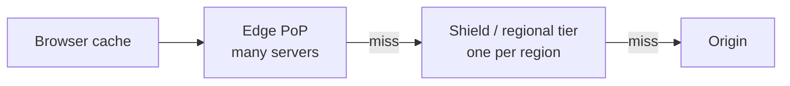
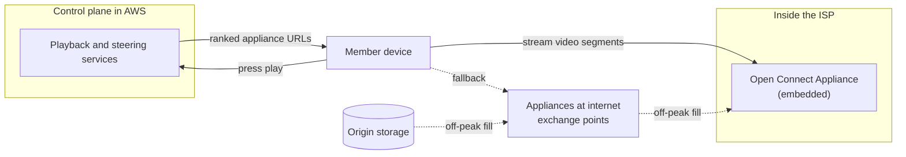

At 09:00 a marketing email sends two million people to a new trailer page. The page sits behind a CDN with a 5-minute TTL, and the origin melts anyway. Every link in the email carries a unique `utm_id` for click tracking, the CDN includes the full query string in its cache key, and two million distinct URLs are two million cache misses. The CDN worked perfectly. It was asked to cache two million different pages.

A CDN is a distributed cache with a routing layer in front and a hierarchy behind. Whether it helps or merely adds a hop is decided by details a senior engineer is expected to own: what is in the cache key, what the `Cache-Control` headers say to a *shared* cache, how misses are collapsed before they reach the origin, and how content is invalidated. This lesson goes through each, then looks at Netflix's Open Connect, a CDN built on the opposite assumption from most: that you know what users will ask for before they ask.

## What a CDN buys you

Three things, in order of how often they matter:

**Latency, even on a miss.** Round trips dominate short requests, and a CDN moves the round trips close to the user. Take a user 150 ms from the origin and 10 ms from an edge. A cold HTTPS request straight to the origin costs TCP, TLS and the request itself: $3 \times 150 = 450$ ms. Through the edge, those three round trips are $3 \times 10 = 30$ ms, and if the edge has to fetch from the origin it does so over a connection it already holds open: one more 150 ms round trip, 180 ms in total. A cache hit costs 30 ms. The edge is faster even for content it cannot cache.

**Offload.** The origin serves only misses. At a 98% hit ratio the origin sees 2% of requests, which is the difference between a fleet of servers and a handful.

**Throughput and absorption.** TCP throughput is inversely proportional to RTT (the Mathis relationship from [Congestion control](/learn/networking/fundamentals/congestion-control)), so the same file downloads several times faster from 10 ms away than from 150 ms. And a CDN's aggregate capacity absorbs traffic spikes and volumetric attacks that would flatten a single origin.

## Getting the user to an edge

Before caching, the CDN has to pick a point of presence (PoP). Two mechanisms dominate, both covered earlier in this track:

- **DNS-based steering.** Your hostname is a `CNAME` to the CDN's name, and the CDN's authoritative DNS answers with the addresses of a PoP near the querying resolver. It gives fine control (per-PoP load, health, cost), with the resolver-location blind spot described in [DNS](/learn/networking/fundamentals/dns) and failover limited by TTLs.
- **Anycast.** Every PoP announces the same IP prefix over BGP, and the internet's routing delivers each client to a nearby one, as in [IP addressing and routing](/learn/networking/fundamentals/ip-addressing-and-routing). Failover is a route withdrawal and takes seconds; the cost is less control, and a route change mid-connection can move a long-lived TCP flow to a PoP that has never seen it.

Large CDNs often combine them: anycast to reach the network, DNS to refine the choice.

## The cache hierarchy

```viz
{"type": "network", "scenario": "cdn-cache", "title": "First request misses to the origin, the second is served at the edge", "caption": "The miss pays the trans-Pacific round trip once; every nearby user after that is served in a few milliseconds and the origin never sees them."}
```

A real CDN has more than one layer:



Hit ratios multiply down the hierarchy. If edges hit 90% of requests and the shield hits 80% of what edges miss, the origin sees $0.10 \times 0.20 = 2\%$ of traffic. The shield matters most for the long tail. Without it, an object requested once in each of 50 PoPs costs 50 origin fetches; with it, one.

Inside a PoP, the servers do not cache independently. If requests were spread randomly, every popular object would end up copied onto every server and a PoP of 20 servers with 10 TB each would hold about 10 TB of distinct content. Instead the PoP's front layer hashes the cache key to pick the one server responsible for it, so each object is stored once per PoP and the same 20 servers hold about 200 TB. The hashing is **consistent** so that adding or losing a server moves only that server's share of keys rather than reshuffling the whole cache:

```viz
{"type": "system", "scenario": "consistent-hashing", "nodes": 4, "keys": ["/trailers/42", "/img/poster-7.jpg", "/js/app.3f9a.js", "/api/rows?page=1", "/video/seg-0042.m4s", "/css/site.81c.css"], "title": "Mapping cache keys to servers inside a PoP", "caption": "Each key is owned by the next server clockwise. Adding a server moves only the keys between it and its predecessor; every other server keeps its cache warm."}
```

Two more mechanisms keep the origin alive at the moment it is most exposed, when a popular object is new or has just expired:

- **Request coalescing** (collapsed forwarding). Ten thousand simultaneous misses for the same key produce one origin fetch; the other requests wait for it. Without it, a launch or a TTL expiry on a hot object is a thundering herd, the same cache-stampede problem described in [Caching strategies](/learn/system-design/building-blocks/caching-strategies).
- **Serving stale.** `stale-while-revalidate` lets the edge answer from the expired copy while it refreshes in the background, and `stale-if-error` lets it keep serving the old copy if the origin is failing. The second turns an origin outage into slightly old content instead of an error page.

Watch two hit ratios, not one. **Request hit ratio** decides origin CPU and request load; **byte hit ratio** decides origin bandwidth and egress cost. A site whose small API responses miss while its video segments hit can show 99% byte hit ratio and a struggling origin.

## Cache keys: the silent hit-ratio killer

By default, a CDN's cache key is roughly scheme, host, path and the full query string, plus the values of any request headers named in the response's `Vary`. Anything that makes two equivalent requests produce different keys splits the cache:

| Fragmenter | Example | Fix |
|---|---|---|
| Tracking parameters | `?utm_source=mail&utm_id=8f3` | Strip them, or better, allowlist the parameters that change the response |
| Parameter order and case | `?a=1&b=2` versus `?b=2&a=1` | Sort parameters, lowercase the host |
| `Vary: User-Agent` | Thousands of distinct UA strings | Normalise to a device class (mobile, desktop) at the edge and vary on that |
| `Vary: Cookie`, or cookies in the key | One entry per session | Strip cookies on cacheable paths; keep personalisation out of cacheable responses |
| Per-user or per-experiment responses | A/B test flag in a cookie | Put the bucket, not the user, in the key |

The arithmetic is brutal. A page requested 1,000 times a second at one PoP with a 60-second TTL misses once a minute: a hit ratio of $1 - 1/60{,}000 \approx 99.998\%$. Give every request a unique query parameter and the hit ratio is zero. A normalised key, as most CDNs let you configure or compute in edge code:

```python
from urllib.parse import urlsplit, parse_qsl, urlencode

ALLOWED = {"page", "lang", "size"}         # parameters that change the response

def cache_key(url: str, device_class: str) -> str:
    u = urlsplit(url)
    params = sorted((k, v) for k, v in parse_qsl(u.query) if k in ALLOWED)
    return f"{u.netloc.lower()}{u.path}?{urlencode(params)}#{device_class}"

cache_key("https://www.Example.com/trailers/42?utm_source=mail&lang=en&utm_id=8f3", "mobile")
# 'www.example.com/trailers/42?lang=en#mobile', the same key for every email recipient
```

An allowlist is safer than a denylist: a new tracking parameter invented by the marketing team next quarter is ignored automatically.

## Freshness: what the headers tell a shared cache

A CDN is a **shared** cache, and HTTP gives it its own directives. From the origin's response:

| Directive | Meaning for the CDN |
|---|---|
| `s-maxage=N` | Fresh for N seconds in shared caches; overrides `max-age` there |
| `max-age=N` | Fresh for N seconds (browsers and, absent `s-maxage`, the CDN) |
| `stale-while-revalidate=N` | For N seconds after expiry, serve stale and refresh in the background |
| `stale-if-error=N` | For N seconds after expiry, serve stale if the origin errors |
| `no-cache` | May store, but must revalidate with the origin before every use |
| `no-store` | Must not store at all |
| `private` | For the end user's browser only; a shared cache must not store it |
| `CDN-Cache-Control` | Same syntax, addressed only to CDNs (RFC 9213), so the browser and CDN can get different TTLs |

A response's current state is visible with `curl`:

```bash
$ curl -sI https://www.example.com/trailers/42
HTTP/2 200
content-type: text/html; charset=utf-8
cache-control: public, max-age=60, s-maxage=300, stale-while-revalidate=30
age: 212
etag: "5f2a-1c"
vary: Accept-Encoding
cache-status: ExampleCDN; hit; ttl=88
```

`age: 212` is how long the edge has held this copy. With `s-maxage=300` it has 88 seconds of freshness left, which the standard `Cache-Status` header (RFC 9211) reports directly; many CDNs use their own `X-Cache: HIT` style header instead. Browsers use `max-age=60`, so they revalidate every minute while the CDN absorbs those revalidations for five.

```exercise
id: cdn-cache-decision
title: Decide what a shared cache does with a stored response
prompt: |
  A CDN holds a stored response. Given its `Cache-Control` header value and
  its current `age` in seconds, return what the CDN does with the next
  request for it:

  - `"bypass"` if the directives include `no-store` or `private`
    (it should never have been stored by a shared cache).
  - `"revalidate"` if they include `no-cache`.
  - Otherwise the freshness lifetime is `s-maxage` if present, else
    `max-age` if present, else 0 (no heuristics).
    `age < lifetime` gives `"fresh"`.
  - If stale, and `age < lifetime + stale-while-revalidate` (0 if absent),
    return `"stale-while-revalidate"`.
  - Otherwise `"revalidate"`.

  Directives are comma-separated, case-insensitive, and may have
  surrounding whitespace. Values are non-negative integers.
languages: [python, javascript]
entry: cache_decision
starter:
  python: |
    def cache_decision(cache_control, age):
        directives = {}
        return "revalidate"
  javascript: |
    function cache_decision(cache_control, age) {
      const directives = new Map();
      return "revalidate";
    }
tests:
  - args: ["public, max-age=60", 30]
    expected: "fresh"
  - args: ["public, max-age=60", 60]
    expected: "revalidate"
    label: stale at exactly max-age
  - args: ["max-age=60, s-maxage=600", 300]
    expected: "fresh"
    label: s-maxage wins in a shared cache
  - args: ["private, max-age=600", 10]
    expected: "bypass"
  - args: ["max-age=60, stale-while-revalidate=30", 75]
    expected: "stale-while-revalidate"
    hidden: true
  - args: ["max-age=60, stale-while-revalidate=30", 90]
    expected: "revalidate"
    label: past the stale window
    hidden: true
  - args: ["No-Cache, Max-Age=600", 1]
    expected: "revalidate"
    label: case-insensitive no-cache
    hidden: true
  - args: ["  s-maxage=0 ,max-age=3600", 5]
    expected: "revalidate"
    label: s-maxage=0 overrides a long max-age
    hidden: true
hints:
  - "Split on commas, strip and lowercase each part, then split each part on the first '=' into a name and an optional value."
  - "Check s-maxage with a membership test, not truthiness: s-maxage=0 is present and means zero."
```

## Invalidation: design so you rarely need it

Purging is the expensive, slow and error-prone way to change cached content. The best strategies avoid it:

1. **Versioned URLs for static assets.** Put a content hash in the filename (`app.3f9a.js`) and serve it with `Cache-Control: public, max-age=31536000, immutable`. The file at that URL never changes, so it never needs invalidating. The HTML that references it has a short TTL, and a deploy changes which asset names the HTML points to.
2. **Short TTLs with `stale-while-revalidate`** for content that changes on its own schedule (listing pages, API responses): users see content at most one TTL old, the origin sees one refresh per TTL per key, and nobody waits for the refresh.
3. **Purge by tag** for content that must change *now*. The origin tags each response (`Surrogate-Key: title-42 genre-drama` or `Cache-Tag`, depending on the CDN) and one purge of `title-42` invalidates every page that mentions title 42. Purges propagate across a global CDN in seconds, not instantly, so a correction is not visible everywhere at the same moment.
4. **Soft purge** where supported: mark objects stale rather than deleting them, so that the next request revalidates but the edge can still serve the stale copy if the origin is struggling.

The failure mode to design against is the **purge storm**: a hard purge of a popular object, or of everything, turns every edge's next request into a miss at the same moment. With request coalescing and a shield it is survivable; without them it is a self-inflicted outage timed exactly to your deploy.

## Dynamic content and edge compute

Uncacheable responses still benefit from the edge: TLS terminates close to the user, and the edge reuses warm, already-grown connections to the origin, often over a CDN's optimised backbone, so the long-haul leg is one round trip on a connection that is out of slow start.

**Edge compute** goes further and runs your code in the PoP: V8 isolates (Cloudflare Workers), WebAssembly (Fastly Compute), or functions attached to CloudFront. Good uses are small and stateless: validating a JWT and rejecting bad requests before they cost origin capacity, normalising cache keys, redirects and header rewrites, assigning A/B buckets, assembling a page from cached fragments. The limits are CPU time per request (typically milliseconds), memory, and above all **data gravity**: code at the edge that reads from a database 150 ms away has added a hop, not removed one. Edge compute pays off when the data it needs is either in the request, in the cache, or in an edge key-value store that tolerates eventual consistency.

## Netflix Open Connect: push instead of pull

Netflix delivers its video through its own CDN, Open Connect, announced in 2012. Its public documentation and engineering blog describe a design that inverts the usual CDN assumptions, because Netflix's traffic is unusual: one tenant, a finite catalogue of very large objects, and demand that is predictable by title, by region and by hour.



- **Appliances inside ISPs.** Netflix provides Open Connect Appliances (OCAs), purpose-built caching servers, at no charge to qualifying ISPs, which install them inside their own networks; more appliances sit at internet exchange points where Netflix peers with ISPs. Traffic served from an embedded appliance never crosses the ISP's transit links, which is the ISP's incentive to host it.
- **The control plane is elsewhere.** Browsing, recommendations, authentication and playback authorisation run in AWS. Only the video bytes come from Open Connect. When a member presses play, the steering service picks appliances that hold the requested files, are healthy, and are well placed for the client's network (embedded appliances learn which client IP prefixes they should serve through BGP sessions with the ISP), and returns a ranked list of URLs. The client streams from the best one and can switch if it degrades.
- **Proactive caching.** Instead of pulling a title on its first miss, Netflix predicts what each location will need and fills appliances during a nightly off-peak **fill window**, through a tiered fill hierarchy. By the evening peak, the content is already there, so peak traffic is almost entirely hits and the fill traffic has used capacity that would otherwise sit idle. Netflix has described spreading content across the appliances at a site with consistent hashing, so each file lives on a predictable subset of servers, the same idea as the PoP hashing above.
- **Efficiency per box.** The appliances run FreeBSD and NGINX, and Netflix engineers have published work on in-kernel TLS and related optimisations that let a single server stream hundreds of gigabits per second of encrypted video.

The transferable lesson is the first design choice, not the hardware: **when demand is predictable, push beats pull.** A pull-through cache pays one miss per object per location and suffers at launch and expiry; a pre-positioned cache pays at a time of your choosing. Most products cannot predict demand this well, but many can do it partially: pre-warm a CDN before a launch, push the next release's assets before switching the HTML, fill a regional cache before the evening peak. The [Netflix video streaming case study](/learn/system-design/case-studies/video-streaming-netflix) builds the full design around it.

## Senior signals

- You quantify the CDN's value in round trips (a miss through a nearby edge beats a direct origin request) and in hit ratios multiplied through edge and shield tiers.
- You own the cache key: allowlist query parameters, normalise variants to a small set, and treat `Vary: Cookie` or `Vary: User-Agent` as a hit-ratio emergency.
- You use `s-maxage` or `CDN-Cache-Control` to give the CDN a different TTL from browsers, and `stale-while-revalidate` and `stale-if-error` to protect users from origin latency and outages.
- You avoid invalidation with content-hashed URLs and `immutable`, purge by tag when you must, and plan for purge storms with coalescing and a shield.
- You judge edge compute by data gravity: code at the edge helps only when its data is in the request, the cache or an eventually consistent edge store.
- You can explain Open Connect as push-based, ISP-embedded caching with a separate control plane that steers clients, and extract the general lesson that predictable demand should be pre-positioned.

## Check yourself

```quiz
- q: >-
    A campaign email links to a cached landing page, and the origin is overwhelmed despite a 5-minute TTL at the CDN. Each link contains a unique utm_id query parameter. What is the best fix?
  options: ["Raise the TTL to one day", "Configure the cache key to include only the query parameters that change the response (an allowlist), so every recipient's URL maps to the same key", "Add Vary: User-Agent", "Purge the page every minute"]
  answer: 1
  explanation: >-
    Every unique URL is a separate cache entry, so the hit ratio is near zero regardless of TTL. Normalising the key restores sharing. Vary: User-Agent would fragment it further, and purging only creates more misses.
- q: >-
    Edges hit 95% of requests. A shield tier is added that hits 70% of the requests edges miss. What fraction of requests now reaches the origin?
  options: ["5%", "3.5%", "1.5%", "0.5%"]
  answer: 2
  explanation: >-
    Origin traffic is the edge miss rate times the shield miss rate: 0.05 x 0.30 = 0.015, or 1.5%. The shield cut origin load by more than two thirds without changing edge behaviour.
- q: >-
    An origin returns Cache-Control "public, max-age=60, s-maxage=600". How long does each cache treat the response as fresh?
  options: ["60 s everywhere", "600 s everywhere", "600 s in the CDN (a shared cache), 60 s in the browser", "60 s in the CDN, 600 s in the browser"]
  answer: 2
  explanation: >-
    s-maxage applies only to shared caches and overrides max-age there. Browsers are private caches and use max-age. This split lets the CDN absorb browser revalidations while the content stays reasonably fresh for users.
- q: >-
    Why do CDN PoPs route each cache key to a specific server with consistent hashing rather than letting any server cache anything?
  options: ["It reduces TLS handshake cost", "It stores each object once per PoP instead of once per server, multiplying the PoP's effective cache capacity, and consistent hashing keeps most keys in place when servers are added or removed", "It is required by HTTP/2", "It lets the PoP skip the origin shield"]
  answer: 1
  explanation: >-
    Random placement eventually copies popular objects to every server, so the PoP holds roughly one server's worth of distinct content. Hashing partitions the key space. Consistent hashing means a server failure only moves that server's keys, instead of invalidating most of the cache.
- q: >-
    What is the main reason Netflix's Open Connect can serve evening peak traffic almost entirely from cache?
  options: ["Its appliances have very large disks", "It predicts which titles each location will need and fills appliances during off-peak hours, so content is already present before demand arrives", "It uses anycast routing", "It serves video over UDP"]
  answer: 1
  explanation: >-
    A pull-through cache misses on first request per location; a proactively filled cache does not. Predictable demand for a finite catalogue makes pre-positioning possible, and filling off-peak uses capacity that would otherwise be idle. Disk size helps, but only because the right content is placed on it in advance.
```
