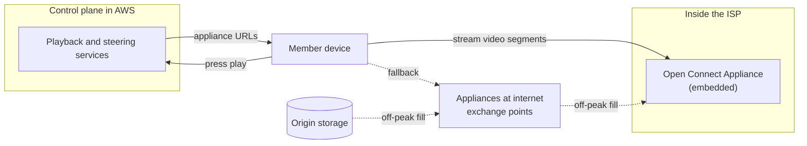

At 09:00 a marketing email sends two million people to a new trailer page. The page sits behind a CDN with a 5-minute TTL, and the origin melts anyway. Every link in the email carries a unique `utm_id` for click tracking, the CDN includes the full query string in its cache key, and two million distinct URLs are two million cache misses. The CDN worked perfectly. It was asked to cache two million different pages.

A CDN is a distributed cache with a routing layer in front and a hierarchy behind. Whether it helps or merely adds a hop is decided by details a senior engineer is expected to own: which point of presence (PoP) a user reaches, what is in the cache key, what `Cache-Control` says to a *shared* cache, how simultaneous misses are collapsed, and how content is invalidated. This lesson works each with numbers, including observations of Cloudflare's edge serving `example.com` from a home connection in the US on 28 September 2026, then looks at Netflix's Open Connect, a CDN built on the assumption that you know what users will ask for before they ask.

## What a CDN buys you

**Latency, even on a miss.** Take a user 150 ms from the origin and 10 ms from an edge. A cold HTTPS request straight to the origin costs TCP, TLS and the request: $3 \times 150 = 450$ ms. Through the edge those three round trips are $3 \times 10 = 30$ ms, and a miss adds one 150 ms round trip on a connection the edge already holds open: 180 ms. A hit costs 30 ms. The edge wins even for content it cannot cache.

**Offload.** The origin serves only misses: at a 98% hit ratio it sees 2% of requests.

**Throughput and absorption.** TCP throughput falls as RTT grows (the Mathis relationship in [Congestion control](/learn/networking/fundamentals/congestion-control)), so a file downloads several times faster from 10 ms than from 150 ms, and a CDN's aggregate capacity absorbs spikes and volumetric attacks that would flatten one origin.

## Getting the user to an edge: anycast and DNS

- **DNS-based steering.** Your hostname is a `CNAME` to the CDN, whose authoritative DNS answers with addresses of a PoP near the querying resolver. It gives fine control (per-PoP load, health, cost), with the resolver-location blind spot from [DNS](/learn/networking/fundamentals/dns) and failover bounded by TTLs.
- **Anycast.** Every PoP announces the same prefix over BGP and routing delivers each client to a nearby one ([IP addressing and routing](/learn/networking/fundamentals/ip-addressing-and-routing)). Failover is a route withdrawal, as fast as BGP converges rather than bounded by DNS TTLs; the cost is less control, and a route change can move a long-lived TCP flow to a PoP that has never seen it.

*Measured:* `example.com` resolved to Cloudflare anycast addresses. An HTTP/1.1 request to `104.20.23.154` was answered by the Los Angeles PoP (`cf-ray` ending `-LAX`) with `Age: 10242` and `cf-cache-status: HIT`; a request to the **same IP** a minute later was answered by Dallas (`-DFW`) with `Age: 5`. Routing had moved between the two, and the two PoPs held independent copies, one 2.8 hours old and one 5 seconds old. Later, two requests to DFW on one connection, 0.2 s apart, carried `Age: 4` and then `Age: 0`, consistent with several cache servers or a refresh inside one PoP. `Age` describes one copy in one cache, so "the CDN has it" is always "some PoPs have some copies".

| | DNS steering | Anycast |
|---|---|---|
| Granularity | Per resolver, per query | Per BGP route |
| Failover time | DNS TTL plus client caching | Route withdrawal, as fast as BGP converges |
| Load control | Fine: answer with any PoP | Coarse: shift by changing announcements |
| Failure mode | Users routed by their resolver's location | Mid-connection route change breaks long TCP flows |

Large CDNs combine them: anycast to reach the network, DNS to refine the choice.

## The cache hierarchy and hit-ratio arithmetic

```viz
{"type": "network", "scenario": "cdn-cache", "title": "First request misses to the origin, the second is served at the edge", "caption": "The miss pays the long round trip once; every nearby user after that is served in a few milliseconds and the origin never sees them."}
```


Miss ratios multiply down the tiers. With 100,000 requests per second, edges hitting 90% and a shield hitting 80% of what edges miss:

| Tier | Arrives | Hit ratio | Served here | Passed on |
|---|---|---|---|---|
| Edge | 100,000/s | 90% | 90,000/s | 10,000/s |
| Shield | 10,000/s | 80% | 8,000/s | 2,000/s |
| Origin | 2,000/s | – | 2,000/s | – |

The origin sees $0.10 \times 0.20 = 2\%$. The shield matters most for the long tail: an object requested once in each of 50 PoPs costs 50 origin fetches without it and one with it, because the other 49 edge misses hit the shield.

Watch two ratios. **Request hit ratio** decides origin CPU and request load; **byte hit ratio** decides origin bandwidth and egress cost. Suppose a minute brings 1,000 video-segment requests of 2 MB at 99.5% hit and 100,000 API requests of 2 KB at 60% hit. The request hit ratio is (995 + 60,000) / 101,000 = 60.4%; the byte hit ratio is (1,990 MB + 120 MB) / 2,200 MB = 95.9%. The bandwidth dashboard looks excellent while the origin fields 40,005 requests a minute.

## Inside a PoP: one copy per key

If a PoP spread requests randomly over its servers, every popular object would end up on every server, and 20 servers with 10 TB each would hold about 10 TB of distinct content. Instead the front layer hashes the cache key to pick the one server responsible, so each object is stored once per PoP and the same 20 servers hold about 200 TB. The hashing is **consistent**, so adding or losing a server moves only that server's keys ([Hashing at scale](/learn/data-structures/hashing/hashing-at-scale) traces rings and Maglev):

```viz
{"type": "system", "scenario": "consistent-hashing", "nodes": 4, "keys": ["/trailers/42", "/img/poster-7.jpg", "/js/app.3f9a.js", "/api/rows?page=1", "/video/seg-0042.m4s", "/css/site.81c.css"], "title": "Mapping cache keys to servers inside a PoP", "caption": "Each key is owned by the next server clockwise. Adding a server moves only the keys between it and its predecessor; every other server keeps its cache warm."}
```

Fastly's [clustering documentation](https://www.fastly.com/documentation/guides/full-site-delivery/fastly-vcl/clustering-in-vcl/) describes this layout concretely. A request lands on a random *delivery* server, which hashes the cache key and hands the request to the one *fetch* server that owns that part of the key space; the fetch server goes to the origin and stores the object. Without this, an object would have to be cached on every server in the PoP before a hit was guaranteed. The cost is a hot key: one viral object lands on one server. Fastly's answers are that copies may also sit on other servers, where they are evicted more aggressively than on the owner, and that for an exceptionally popular object each delivery server forwards one request to the fetch server, which collapses them into a single origin fetch: coalescing at two levels inside one PoP.

## Request coalescing, traced

A new trailer page goes live and 10,000 requests per second arrive at one PoP; the origin fetch takes 80 ms. About 800 requests arrive before the first fetch completes. With **request coalescing** (collapsed forwarding), the first miss starts a fetch and the rest wait on it:

| Time | Event | Without coalescing | With coalescing |
|---|---|---|---|
| 0 ms | First request misses | Fetch 1 starts | Fetch 1 starts; key marked "in flight" |
| 0–80 ms | 799 more requests | 799 more fetches | 799 wait on fetch 1 |
| 80 ms | Response arrives, cached | 800 origin fetches for one object | 1 fetch; 800 responses from it |
| 80 ms + | Later requests | Hits | Hits |

Across 50 PoPs, per-PoP coalescing still sends 50 fetches; the shield coalesces those into one. The same thing recurs at every TTL expiry of a hot object, which is the cache stampede from [Caching strategies](/learn/system-design/building-blocks/caching-strategies).

```viz
{"type": "system", "scenario": "cache-stampede", "title": "A hot key expires and every request misses at once", "caption": "Without coalescing, each concurrent miss goes to the origin. Coalescing lets one request refill the cache while the others wait for its result."}
```

In nginx, `proxy_cache_lock on` enables coalescing (off by default); waiters give up after `proxy_cache_lock_timeout` (5 s default) and go to the origin without caching the response, so a slow origin still sees a trickle of duplicate fetches.

```exercise
id: cdn-coalescing
title: Count origin fetches with and without request coalescing
prompt: |
  One cache starts empty and receives requests for a single key at the
  times in `times` (milliseconds, non-decreasing). A fetch that starts at
  time `s` completes at `s + fetch_ms`; the object it returns is fresh for
  requests at times `t` with `s + fetch_ms <= t < s + fetch_ms + ttl_ms`.

  For each request at time `t`, in order:
  - if any completed fetch makes the object fresh at `t`, it is a hit;
  - otherwise, if `coalesce` is true and some fetch is in flight at `t`
    (`s <= t < s + fetch_ms`), the request waits for it (no new fetch);
  - otherwise the request starts a new fetch at `t`.

  Return the number of fetches sent to the origin.
languages: [python, javascript]
entry: origin_fetches
starter:
  python: |
    def origin_fetches(times, fetch_ms, ttl_ms, coalesce):
        starts = []          # start time of every fetch sent to the origin
        for t in times:
            pass             # TODO: hit, wait, or start a fetch
        return len(starts)
  javascript: |
    function origin_fetches(times, fetch_ms, ttl_ms, coalesce) {
      const starts = [];     // start time of every fetch sent to the origin
      for (const t of times) {
        // TODO: hit, wait, or start a fetch
      }
      return starts.length;
    }
tests:
  - args: [[0, 10, 20, 30], 50, 1000, true]
    expected: 1
    label: three requests wait on the first fetch
  - args: [[0, 10, 20, 30], 50, 1000, false]
    expected: 4
    label: without coalescing every concurrent miss fetches
  - args: [[0, 60, 1100, 1120], 50, 1000, true]
    expected: 2
    label: a hit, then an expiry and one refetch
  - args: [[0, 60, 1100, 1120], 50, 1000, false]
    expected: 3
  - args: [[], 50, 1000, true]
    expected: 0
    label: no requests
  - args: [[0, 50, 1050], 50, 1000, true]
    expected: 2
    label: fresh from the completion instant, stale exactly at expiry
    hidden: true
  - args: [[0, 49, 50, 99, 100], 50, 0, true]
    expected: 3
    label: a zero TTL still coalesces concurrent misses
    hidden: true
  - args: [[100, 100, 100, 100, 100], 80, 60000, false]
    expected: 5
    hidden: true
hints:
  - "Keep the list of fetch start times; freshness and in-flight checks are both tests against every start time."
  - "Check freshness before the in-flight test: a completed fetch serves the request even if another fetch is in flight."
```

## Cache keys: the silent hit-ratio killer

Defaults differ by vendor, and the default is what bites. Cloudflare's default key is the scheme, host, path and full query string (plus a few request headers such as `Origin`), and it ignores `Vary` apart from `Accept-Encoding` unless configured to honour it. Fastly hashes the URL with its query string plus `Host`, and honours `Vary` by storing variants of one object. CloudFront builds the key from a cache policy, and its recommended `CachingOptimized` policy leaves query strings and cookies out entirely, which invites the opposite mistake: a parameter that does change the response serves one variant to everyone. nginx's default `proxy_cache_key` is `$scheme$proxy_host$request_uri`. Anything that makes two equivalent requests produce different keys splits the cache:

| Fragmenter | Example | Fix |
|---|---|---|
| Tracking parameters | `?utm_source=mail&utm_id=8f3` | Allowlist the parameters that change the response |
| Parameter order and case | `?a=1&b=2` versus `?b=2&a=1` | Sort parameters, lowercase the host |
| `Vary: User-Agent` where the CDN honours it | Thousands of distinct strings | Normalise to a device class at the edge and vary on that |
| `Vary: Cookie`, cookies in the key | One entry per session | Strip cookies on cacheable paths |
| Per-user experiment flags | A/B flag in a cookie | Put the bucket, not the user, in the key |

The arithmetic: a page requested 1,000 times a second at one PoP with a 60-second TTL misses once a minute, a hit ratio of $1 - 1/60{,}000 \approx 99.998\%$. Split it into $k$ equally popular variants and each misses once a minute, so the ratio is $1 - k/60{,}000$: 99.8% for 100 variants, 83% for 10,000, and zero when every request is unique. A normalised key:

```python
from urllib.parse import urlsplit, parse_qsl, urlencode

ALLOWED = {"page", "lang", "size"}         # parameters that change the response

def cache_key(url: str, device_class: str) -> str:
    u = urlsplit(url)
    params = sorted((k, v) for k, v in parse_qsl(u.query) if k in ALLOWED)
    return f"{u.netloc.lower()}{u.path}?{urlencode(params)}#{device_class}"

print(cache_key("https://www.Example.com/trailers/42?utm_source=mail&lang=en&utm_id=8f3", "mobile"))
# www.example.com/trailers/42?lang=en#mobile, the same key for every email recipient
```

An allowlist beats a denylist: a tracking parameter invented next quarter is ignored automatically.

## Freshness: what the headers tell a shared cache

| Directive | Meaning for the CDN |
|---|---|
| `s-maxage=N` | Fresh for N s in shared caches; overrides `max-age` there |
| `max-age=N` | Fresh for N s (browsers, and the CDN when `s-maxage` is absent) |
| `stale-while-revalidate=N` | For N s after expiry, serve stale and refresh in the background |
| `stale-if-error=N` | For N s after expiry, serve stale if the origin errors |
| `no-cache` / `no-store` / `private` | Revalidate every use / never store / browser only |
| `CDN-Cache-Control` | Same syntax, for CDNs only (RFC 9213) |

An illustrative response from a CDN-fronted page (the hostname and CDN name are placeholders):

```bash
$ curl -sI https://www.example.com/trailers/42
HTTP/2 200
cache-control: public, max-age=60, s-maxage=300, stale-while-revalidate=30
age: 212
etag: "5f2a-1c"
vary: Accept-Encoding
cache-status: ExampleCDN; hit; ttl=88
```

`age: 212` against `s-maxage=300` leaves 88 s, which the standard `Cache-Status` header (RFC 9211) reports; many CDNs use their own header instead (`cf-cache-status` in the measurement, `x-cache`, `x-amz-cf-pop` for the PoP). Browsers use `max-age=60`, so they revalidate every minute while the CDN absorbs those revalidations for five.

A `stale-while-revalidate` timeline for `s-maxage=60, stale-while-revalidate=30`:

| Time | Copy's age | Decision | User waits for origin? |
|---|---|---|---|
| 0 s | – | Miss: fetch, store | Yes |
| 59 s | 59 | Fresh hit | No |
| 70 s | 70 | Stale within 60 + 30: serve stale, refresh in background | No |
| 75 s | 5 (new copy) | Fresh hit | No |
| 170 s | 100 | Past 90: synchronous revalidation | Yes |

A popular object is therefore never waited on; only objects idle for longer than the window pay a blocking refresh.

```exercise
id: cdn-cache-decision
title: Decide what a shared cache does with a stored response
prompt: |
  A CDN holds a stored response. Given its `Cache-Control` header value and
  its current `age` in seconds, return what the CDN does with the next
  request for it:

  - `"bypass"` if the directives include `no-store` or `private`
    (it should never have been stored by a shared cache).
  - `"revalidate"` if they include `no-cache`.
  - Otherwise the freshness lifetime is `s-maxage` if present, else
    `max-age` if present, else 0 (no heuristics).
    `age < lifetime` gives `"fresh"`.
  - If stale, and `age < lifetime + stale-while-revalidate` (0 if absent),
    return `"stale-while-revalidate"`.
  - Otherwise `"revalidate"`.

  Directives are comma-separated, case-insensitive, and may have
  surrounding whitespace. Values are non-negative integers.
languages: [python, javascript]
entry: cache_decision
starter:
  python: |
    def cache_decision(cache_control, age):
        directives = {}
        return "revalidate"
  javascript: |
    function cache_decision(cache_control, age) {
      const directives = new Map();
      return "revalidate";
    }
tests:
  - args: ["public, max-age=60", 30]
    expected: "fresh"
  - args: ["public, max-age=60", 60]
    expected: "revalidate"
    label: stale at exactly max-age
  - args: ["max-age=60, s-maxage=600", 300]
    expected: "fresh"
    label: s-maxage wins in a shared cache
  - args: ["private, max-age=600", 10]
    expected: "bypass"
  - args: ["max-age=60, stale-while-revalidate=30", 75]
    expected: "stale-while-revalidate"
    hidden: true
  - args: ["max-age=60, stale-while-revalidate=30", 90]
    expected: "revalidate"
    label: past the stale window
    hidden: true
  - args: ["No-Cache, Max-Age=600", 1]
    expected: "revalidate"
    label: case-insensitive no-cache
    hidden: true
  - args: ["  s-maxage=0 ,max-age=3600", 5]
    expected: "revalidate"
    label: s-maxage=0 overrides a long max-age
    hidden: true
hints:
  - "Split on commas, strip and lowercase each part, then split each part on the first '=' into a name and an optional value."
  - "Check s-maxage with a membership test, not truthiness: s-maxage=0 is present and means zero."
```

## Invalidation: design so you rarely need it

Purging is the slow, expensive and error-prone way to change cached content:

1. **Versioned URLs for static assets.** A content hash in the filename (`app.3f9a.js`) with `Cache-Control: public, max-age=31536000, immutable` never needs invalidating; the short-TTL HTML decides which names are current.
2. **Short TTLs with `stale-while-revalidate`** for content that changes on its own schedule: at most one TTL stale, one refresh per TTL per key, nobody waiting.
3. **Purge by tag** for content that must change now. The origin tags responses (`Surrogate-Key: title-42 genre-drama` at Fastly, `Cache-Tag` at Cloudflare; CloudFront added tag invalidation in April 2026, with a header name you configure) and one purge of `title-42` invalidates every page mentioning title 42, where purge-by-URL would need every URL listed, including variants you do not know about.
4. **Soft purge** where supported: mark stale instead of deleting, so the edge revalidates but can still serve the old copy if the origin struggles.

Purges propagate to every PoP in times that vendors quote from well under a second to seconds, depending on the provider and the purge type. Fastly documents about 150 ms for URL and surrogate-key purges and up to 2 minutes for a purge-all; Cloudflare [reported](https://blog.cloudflare.com/instant-purge/) a median under 150 ms for tag, hostname and prefix purges in 2024; CloudFront states that invalidations take effect within 5 s at the 95th percentile. A correction is therefore not visible everywhere at the same moment, and a purge followed immediately by a check from one location proves little. The failure to design against is the **purge storm**: a hard purge of a hot object, or of everything, makes every PoP miss at once, and without coalescing and a shield it is a self-inflicted outage timed to your deploy.

## Under the hood: a CDN node

Commercial CDNs run their own software, but nginx and Varnish expose the same mechanisms by name:

| Mechanism | nginx | Varnish |
|---|---|---|
| Cache key | `proxy_cache_key` (default `$scheme$proxy_host$request_uri`) | `vcl_hash`: URL plus Host by default |
| Coalescing | `proxy_cache_lock` (off by default) | Built in: a waiting list per object |
| Serve stale while refreshing | `proxy_cache_use_stale updating` + `proxy_cache_background_update` | `grace` |
| Serve stale on error | `proxy_cache_use_stale error timeout http_500 http_502 http_503 http_504` | `grace` with a failing backend |
| TTL override | `proxy_cache_valid` | `beresp.ttl` in `vcl_backend_response` |

Both cache errors if told to: `proxy_cache_valid 404 1m` caches not-found responses (negative caching), which protects the origin from repeated lookups of missing objects and also keeps a wrongly returned 404 alive for a minute. In nginx the keys and metadata live in a shared-memory zone (the documentation sizes 1 MB at about 8,000 keys) and the bodies in files, and a cache manager process removes the least recently used data once the cache exceeds `max_size` ([LRU cache](/learn/advanced-data-structures/caches-and-eviction/lru-cache)).

## Dynamic content and edge compute

Uncacheable responses still benefit: TLS terminates near the user and the edge reuses warm connections to the origin, out of slow start, often over the CDN's backbone. **Edge compute** runs your code in the PoP: V8 isolates (Cloudflare Workers), WebAssembly (Fastly Compute), functions attached to CloudFront. Good uses are small and stateless: rejecting requests with invalid tokens before they cost origin capacity, normalising cache keys, redirects and header rewrites, A/B bucketing, assembling pages from cached fragments. The limits are CPU time per request (Cloudflare Workers allow 10 ms on the free plan and 30 s by default on paid plans, and Cloudflare reports that the average Worker uses about 2.2 ms; CloudFront Functions are built for sub-millisecond work in 2 MB of memory), memory, and **data gravity**: edge code that reads a database 150 ms away has added a hop. It pays off when its data is in the request, the cache, or an eventually consistent edge store.

## Netflix Open Connect: push instead of pull

Netflix delivers video through its own CDN, Open Connect, which it began building in 2011. Its public documentation and engineering blog describe a design that inverts usual CDN assumptions, because the traffic is unusual: one tenant, a finite catalogue of very large objects, and demand predictable by title, region and hour.



- **Appliances inside ISPs.** Netflix provides Open Connect Appliances (OCAs) at no charge to qualifying ISPs, which install them in their networks; more sit at internet exchange points where Netflix peers. Traffic from an embedded appliance never crosses the ISP's transit links, which is the ISP's incentive.
- **Control plane elsewhere.** The Netflix application and its playback services run in AWS; appliances hold no member data and do two things, report their health, routes and stored files to the control plane, and serve files. On play, the playback services check authorisation and choose the files, and a steering service picks appliances that hold them, are healthy and are close to the client in the network (embedded appliances learn which client prefixes they serve through BGP sessions with the ISP's routers), then hands their URLs to the client, which streams from them.
- **Proactive caching.** Instead of pulling a title on first miss, Netflix predicts what each location needs and fills appliances in a nightly off-peak **fill window** through a tiered fill hierarchy, so evening peak traffic is almost entirely hits and fill uses capacity that would sit idle. Within a site, content is spread with consistent hashing, the same idea as the PoP hashing above.
- **Efficiency per box.** The appliances run FreeBSD and NGINX, and Netflix engineers have published work on in-kernel TLS and related optimisations that let one server stream hundreds of gigabits per second of encrypted video.

The transferable lesson is the first choice, not the hardware: **when demand is predictable, push beats pull.** A pull-through cache pays one miss per object per location and suffers at launch and expiry; a pre-positioned cache pays when you choose. Most products can predict partially: pre-warm before a launch, push the next release's assets before switching the HTML, fill a regional cache before the evening peak. The [Netflix video streaming case study](/learn/system-design/case-studies/video-streaming-netflix) builds the full design.

## Production failure modes

| Failure | Symptom | Diagnosis | Fix |
|---|---|---|---|
| Cache-key explosion | Hit ratio near zero on a cacheable page; origin load tracks traffic | Distinct keys per minute approaches requests per minute; query strings or `Vary` differ per request | Allowlist parameters, normalise variants |
| Stampede at launch or expiry | Origin spikes to many times normal at a TTL boundary | Origin logs show hundreds of identical fetches in one fetch-time window | Coalescing at edge and shield; `stale-while-revalidate` |
| Purge storm | Origin overload minutes after a deploy | Correlates with a wildcard or hot-object hard purge | Versioned URLs, tag purges, soft purge |
| Personal data cached | One user sees another's page | A personalised response lacked `private` or `no-store`, or carried `Set-Cookie` into a shared cache | `private`/`no-store` on authenticated responses; never cache responses that set cookies |
| Cached error | A 404 or 500 persists after the origin is fixed | `Age` on the error response; negative-caching TTL | Short TTLs for errors; purge the key |
| Regional staleness | Some users see old content after a purge | `Age` differs by PoP (as measured, LAX and DFW) | Wait for propagation; verify from several PoPs |

## Trade-offs

| Strategy | Freshness | Origin load | Operational cost |
|---|---|---|---|
| Long TTL + versioned URLs | Instant (new URL) | Lowest | Build pipeline must hash assets |
| Short TTL + stale-while-revalidate | Bounded by TTL | One refresh per TTL per PoP or shield | None |
| Purge on change | Seconds, after propagation | Spikes after each purge | Tagging, purge tooling, storm risk |
| No caching, edge only for TLS and routing | Always fresh | All requests | Origin sized for peak |

| | Pull-through CDN | Push (Open Connect style) |
|---|---|---|
| First request per location | Miss | Hit if predicted |
| Needs demand prediction | No | Yes |
| Fill traffic timing | Whenever misses happen, often at peak | Off-peak window |
| Fits | Many tenants, unpredictable content | One tenant, large predictable catalogue |

## Interviewer follow-ups

**"Edges hit 90%. Is a shield worth adding?"** Model answer: it cuts origin traffic by the shield's hit ratio on edge misses (80% takes the origin from 10% to 2%), matters most for the long tail spread thin across PoPs, and collapses per-PoP stampedes into one fetch; the cost is an extra hop on shield misses. Common wrong answer: "no, 90% is already high", which ignores that the origin sees five times more traffic without it.

**"A page's hit ratio is 3%. How do you find out why?"** Model answer: count distinct cache keys per minute against requests per minute, then look at query strings, `Vary` values and cookies on sample misses; check for `private` or `Set-Cookie` making responses uncacheable. Common wrong answer: "raise the TTL", which does nothing when every key is unique.

**"How would you make a correction visible everywhere within a minute?"** Model answer: short TTL with `stale-while-revalidate` for the page type, or tag the response and purge the tag, knowing propagation takes seconds and verifying from several PoPs; for assets, a new versioned URL is instant. Common wrong answer: "purge everything", which triggers a storm.

**"Why did Netflix build its own CDN instead of buying one?"** Model answer: one tenant with a predictable catalogue of huge objects can pre-position content off-peak inside ISPs, removing transit costs and peak-time misses, which a general pull-through CDN cannot; the control plane stays in the cloud and steers clients. Common wrong answer: "commercial CDNs lacked capacity", which misses the design difference.

## What mid-level engineers get wrong

- **Leaving the full query string in the cache key**, so tracking parameters defeat the cache.
- **Sending `Vary: User-Agent` or `Vary: Cookie`**, multiplying entries by thousands.
- **Watching byte hit ratio only**, while request misses overload the origin.
- **Purging everything on deploy** instead of versioning asset URLs.
- **Assuming a purge is instant and global**, then chasing "stale" reports from one region.
- **Caching authenticated responses** without `private`, which serves one user's data to another.
- **Moving code to the edge** that still reads a far-away database on every request.

## Senior signals

- You quantify a CDN in round trips and in miss ratios multiplied through tiers, and you track request and byte hit ratios separately.
- You know a PoP is one cache among many: anycast can move you between PoPs with different copies, as the LAX and DFW `Age` values showed.
- You own the cache key: allowlisted parameters, normalised variants, and the $1 - k/60{,}000$ arithmetic for what fragmentation costs.
- You rely on coalescing, a shield and `stale-while-revalidate` against stampedes, and on versioned URLs rather than purges.
- You judge edge compute by data gravity.
- You explain Open Connect as push-based, ISP-embedded caching with a cloud control plane, and apply "predictable demand should be pre-positioned" elsewhere.

## Check yourself

```quiz
- q: >-
    A campaign email links to a cached landing page, and the origin is overwhelmed despite a 5-minute TTL at the CDN. Each link contains a unique utm_id query parameter. What is the best fix?
  options: ["Allowlist only the query parameters that matter", "Raise the TTL to one day so entries live longer", "Add Vary: User-Agent so each device gets its own copy", "Purge the page every minute to keep it fresh"]
  answer: 0
  explanation: >-
    Every unique URL is a separate cache entry, so the hit ratio is near zero regardless of TTL. A cache key that includes only the query parameters that change the response maps every recipient's URL to the same key and restores sharing. Vary: User-Agent would fragment it further, and purging only creates more misses.
- q: >-
    Edges hit 95% of requests. A shield tier is added that hits 70% of the requests edges miss. What fraction of requests now reaches the origin?
  options: ["0.5%", "5.0%", "3.5%", "1.5%"]
  answer: 3
  explanation: >-
    Origin traffic is the edge miss rate times the shield miss rate: 0.05 x 0.30 = 0.015, or 1.5%. The shield cut origin load by more than two thirds without changing edge behaviour.
- q: >-
    An origin returns Cache-Control public, max-age=60, s-maxage=600. How long does each cache treat the response as fresh?
  options: ["60 s in the CDN and in the browser", "600 s in the CDN and in the browser", "600 s in the CDN, 60 s in the browser", "60 s in the CDN, 600 s in the browser"]
  answer: 2
  explanation: >-
    s-maxage applies only to shared caches and overrides max-age there. Browsers are private caches and use max-age. This split lets the CDN absorb browser revalidations while content stays reasonably fresh for users.
- q: >-
    Two requests to the same anycast IP a minute apart return the same object with Age 10242 and Age 5. What is the most likely explanation?
  options: ["The first response was served stale after an origin error", "They reached different PoPs, each holding its own copy", "The origin changed the object between the two requests", "Age counts time since the browser last requested it"]
  answer: 1
  explanation: >-
    Anycast routes each connection to a nearby PoP, and routing can change. Each PoP caches independently, so the same object can be hours old in one and seconds old in another; in the measurement the cf-ray suffix showed LAX and then DFW. Age is the age of the cache's copy, not of the browser's history.
- q: >-
    A hot object's TTL expires while 10,000 requests per second arrive at a PoP and the origin fetch takes 80 ms. Without request coalescing, roughly how many origin fetches does that PoP send before the object is cached again?
  options: ["About 800, one per request in the 80 ms", "Exactly 1, since the first miss locks the key", "About 10,000, one per request in that second", "None, since the CDN serves the expired copy"]
  answer: 0
  explanation: >-
    Every request that arrives while no fresh copy exists goes to the origin, and at 10,000 per second about 800 arrive during the 80 ms fetch. Coalescing would make that one fetch, and stale-while-revalidate would let the expired copy be served during the refresh; without either, the stampede is the default.
- q: >-
    What is the main reason Netflix's Open Connect can serve evening peak traffic almost entirely from cache?
  options: ["Anycast routes viewers to the nearest appliance", "It fills appliances off-peak with predicted titles", "Its caches pull each title on first request, then keep it", "Its appliances have unusually large disks installed"]
  answer: 1
  explanation: >-
    A pull-through cache misses on the first request per location; a proactively filled cache does not. Netflix predicts which titles each location needs and fills appliances during off-peak hours, so content is present before demand arrives, using capacity that would otherwise be idle. Disk size helps only because the right content is placed on it in advance.
```
