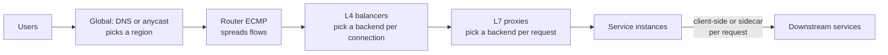

The database fails over and is unreachable for 30 seconds. Every one of your 40 API instances has a `/health` endpoint that runs `SELECT 1`, so every instance starts returning 503 to the load balancer's health checks. After three failed checks the balancer marks all 40 unhealthy and has nowhere to send traffic, so it returns errors for every request, including the many that never touch the database. The database is back after 30 seconds. The instances need three consecutive passing checks at 10-second intervals to be readmitted, so the outage lasts another half a minute on top. A partial dependency failure became a total outage, and the component that turned it into one was the load balancer, doing exactly what it was configured to do.

A load balancer makes three decisions on every request or connection: which backends are eligible (health), which of them gets this one (the algorithm), and whether it should go where the previous one went (affinity). It makes them with the information visible at its layer. This lesson covers what each layer can see, how the algorithms behave when backends are not identical, how health checking goes wrong, and how the same ideas scale to steering traffic between regions.

## Where balancers sit

A large service has several layers of balancing, each with a different view:



Global steering chooses a region before a connection exists (see [DNS](/learn/networking/fundamentals/dns)). Routers spread flows across balancer machines with equal-cost multipath hashing. L4 balancers choose a backend per TCP connection. L7 proxies terminate the connection and choose per HTTP request. Inside the data centre, service-to-service calls are often balanced by the client itself or by a sidecar proxy. Every layer has its own health checks, timeouts and failure modes.

## L4 versus L7

An **L4** balancer works on packets and connections. It sees the 5-tuple (source and destination IP and port, protocol), picks a backend when the SYN arrives, and forwards every later packet of that flow to the same place. It never sees HTTP. It can forward by rewriting the destination address (NAT), by encapsulating the packet to the backend, or by **direct server return**, where the backend answers the client directly from the virtual IP and the reply bypasses the balancer. DSR suits asymmetric traffic like video: small requests in, large responses out, and the balancer only carries the small half.

An **L7** balancer is a proxy. It terminates TCP (and usually TLS), parses each HTTP request, and opens or reuses its own connection to a backend. Because it sees requests, it can route by host, path or header, balance each request separately, retry idempotent requests on another backend, enforce timeouts, and emit per-route metrics.

| | L4 | L7 |
|---|---|---|
| Unit of balancing | Connection (flow) | Request |
| Sees | IPs, ports, TCP flags | Methods, paths, headers, status codes |
| TLS | Passes through untouched | Usually terminates (it must, to read HTTP) |
| Client IP at backend | Preserved (DSR, or PROXY protocol with NAT) | Lost unless forwarded in `X-Forwarded-For` |
| HTTP/2 and gRPC | All streams stick to one backend | Each stream balanced separately |
| Retries, routing rules, per-route metrics | No | Yes |
| Cost | Very cheap per packet; scales to line rate | Parsing, TLS and a second connection per client connection |
| Examples | Maglev, Katran, IPVS, AWS NLB | Envoy, NGINX, HAProxy, AWS ALB |

The long-lived-connection problem deserves emphasis. An L4 balancer is balanced only if connections are short and numerous. With HTTP/2 or gRPC, one client connection carries thousands of requests, so a few clients can pin most of the load onto a few backends, as the [gRPC lesson](/learn/networking/application-protocols/grpc-and-protobuf) showed.

### Keeping L4 balancers stateless enough to scale

Routers spread packets across a pool of L4 machines by hashing the 5-tuple, and a router change or a balancer failure can send the next packet of an established flow to a different balancer machine. That machine has never seen the flow. Google's Maglev (published in 2016) solves this by having every balancer compute the backend from the same **consistent hash** of the 5-tuple into a shared lookup table, so any machine picks the same backend for a given flow without coordinating, and adding or removing a backend moves only a small fraction of flows. Each machine also keeps a local connection table so that established flows stay put when the backend set changes.

```viz
{"type": "system", "scenario": "consistent-hashing", "nodes": 4, "keys": ["10.1.4.7:51220", "10.9.0.3:40112", "172.16.2.9:33810", "10.1.4.7:51221", "192.0.2.44:60001", "10.3.3.3:45678"], "title": "Hashing flows to backends so every balancer agrees", "caption": "Each flow hashes to a point on the ring and belongs to the next backend clockwise. Adding a backend moves only the flows in one arc; the rest of the established connections keep their backend."}
```

## Algorithms, and what uneven load does to them

With identical backends and identical requests, every algorithm works. The differences appear when one backend is slower (a noisy neighbour, a cold JIT, a bad disk) or when requests vary in cost.

**Round robin** sends each backend its turn regardless of its state.

```viz
{"type": "network", "scenario": "load-balancer-round-robin", "title": "Round robin ignores backend state", "caption": "Each backend gets the next request in rotation. A backend that has slowed down still receives exactly its share."}
```

Put numbers on it. Twenty backends share 1,000 requests per second, each normally taking 20 ms. One backend degrades to 100 ms. Round robin still sends it 5% of requests, so 5% of all requests take 100 ms or more and the p95 latency of the whole service is set by one sick machine. By Little's law the slow backend holds five times as many requests in flight as its peers.

**Least connections / least outstanding requests** sends the request to the backend with the fewest in-flight requests. A slow backend accumulates in-flight work and so receives less new work.

```viz
{"type": "network", "scenario": "load-balancer-least-conn", "title": "Least connections routes around a slow backend", "caption": "The balancer counts in-flight requests per backend and picks the minimum, so a backend that is slow to finish receives fewer new requests."}
```

In the example above, the slow backend now settles at roughly a fifth of the rate of the others: about 10 requests per second instead of 50, so about 1% of requests are slow instead of 5%. For L7 proxies, "outstanding requests" is the right quantity; "connections" is a proxy for it that breaks with connection reuse.

Least-requests has two failure modes. With many balancers, each sees only its own in-flight counts, and all of them see a newly started backend at zero and send it everything at once, a herd that knocks over a cold instance. And computing a global minimum is expensive with large backend sets. The fix for both is:

**Power of two choices (P2C).** Pick two backends at random and send the request to the less loaded of the two. Classic balls-into-bins analysis says that placing *n* items uniformly at random leaves the fullest bin with about $\ln n / \ln \ln n$ items, while choosing the better of two random bins cuts that to about $\ln \ln n / \ln 2$: an exponential improvement from one extra sample. Just as important, randomness breaks the herd: many balancers with stale counts do not all pick the same target. Envoy's least-request policy uses this by default, and Finagle and Linkerd combine it with a latency estimate (an exponentially weighted moving average of response time) so that "less loaded" means "expected to answer sooner".

**Weighted round robin** gives backends traffic in proportion to capacity, for mixed instance sizes or gradual canaries. The naive version sends `a, a, a, a, a, b, c` for weights 5, 1, 1, a burst of five in a row to one backend. **Smooth weighted round robin**, used by NGINX, interleaves them. Each backend has a running `current` score: on every request, add each backend's weight to its score, pick the highest (the first on ties), and subtract the total weight from the winner. For weights 5, 1, 1 (total 7):

| Request | `current` after adding weights | Pick | `current` after subtracting 7 |
|---|---|---|---|
| 1 | 5, 1, 1 | a | -2, 1, 1 |
| 2 | 3, 2, 2 | a | -4, 2, 2 |
| 3 | 1, 3, 3 | b | 1, -4, 3 |
| 4 | 6, -3, 4 | a | -1, -3, 4 |
| 5 | 4, -2, 5 | c | 4, -2, -2 |
| 6 | 9, -1, -1 | a | 2, -1, -1 |
| 7 | 7, 0, 0 | a | 0, 0, 0 |

Seven requests, five to `a`, never more than two in a row, and the scores return to zero, so the pattern repeats.

```exercise
id: smooth-weighted-round-robin
title: Implement smooth weighted round robin
prompt: |
  Given positive integer `weights` for each backend and a number of
  requests `n`, return the list of backend indices chosen for requests
  1 to n using smooth weighted round robin:

  - Every backend starts with `current = 0`.
  - For each request, add each backend's weight to its `current`, pick the
    backend with the highest `current` (the lowest index on ties), then
    subtract the sum of all weights from the chosen backend's `current`.
languages: [python, javascript]
entry: swrr
starter:
  python: |
    def swrr(weights, n):
        current = [0] * len(weights)
        out = []
        return out
  javascript: |
    function swrr(weights, n) {
      const current = weights.map(() => 0);
      const out = [];
      return out;
    }
tests:
  - args: [[5, 1, 1], 7]
    expected: [0, 0, 1, 0, 2, 0, 0]
    label: the worked example
  - args: [[1, 1, 1], 6]
    expected: [0, 1, 2, 0, 1, 2]
    label: equal weights reduce to round robin
  - args: [[2, 1], 3]
    expected: [0, 1, 0]
  - args: [[1], 3]
    expected: [0, 0, 0]
    label: single backend
  - args: [[4, 2, 1], 7]
    expected: [0, 1, 0, 2, 0, 1, 0]
    hidden: true
  - args: [[3, 3], 4]
    expected: [0, 1, 0, 1]
    label: ties go to the lower index
    hidden: true
  - args: [[1, 2, 3], 12]
    expected: [2, 1, 0, 2, 1, 2, 2, 1, 0, 2, 1, 2]
    hidden: true
hints:
  - "The sum of all current values is zero after every request, which is why the sequence is periodic with period equal to the total weight."
  - "Use a strict greater-than when scanning for the maximum so that the first backend wins ties."
```

**Consistent hashing** sends every request with the same key (user ID, cache key, session) to the same backend while that backend is healthy. It is the right choice when the backend holds something worth reusing: a warm cache, a local shard. Plain consistent hashing can overload a backend that owns a hot key; the "bounded loads" variant caps each backend at a small factor above the average and spills the excess to the next backend on the ring. [Consistent hashing and routing](/learn/networking/network-algorithms/consistent-hashing-and-routing) covers the ring and virtual nodes.

| Algorithm | State needed | Good for | Fails when |
|---|---|---|---|
| Round robin | A counter | Identical backends, uniform requests | One backend is slow or requests vary |
| Smooth weighted RR | A score per backend | Mixed instance sizes, canaries | Weights drift from real capacity |
| Least outstanding requests | In-flight count per backend | Uneven request cost, slow backends | Many balancers herd onto the same idle backend |
| Power of two choices | In-flight counts, sampled | Large fleets, many balancers | Almost never; the default for a reason |
| Consistent hash | The ring | Cache locality, affinity | Hot keys, unless load-bounded |

New backends need **slow start** under any load-aware algorithm: ramp their weight up over tens of seconds so a cold JIT, empty caches and unfilled connection pools are not hit with a full share at once. Envoy and HAProxy both support it.

## Health checks: how partial failures become total

**Active checks** probe each backend on a schedule, typically an HTTP `GET /healthz` every few seconds, marking it unhealthy after N consecutive failures and healthy again after M successes. Detection time is interval × threshold: a 5-second interval with a threshold of 3 means a dead backend keeps receiving its share for up to 15 seconds. **Passive checks** (outlier detection) watch real traffic and eject a backend that returns consecutive 5xx or gateway errors. They react in a few requests rather than a few intervals, and they see failures that a synthetic check misses.

The opening incident came from three mistakes that are worth naming separately:

1. **The check tested a shared dependency.** If every instance depends on the same database, a database failure fails every instance's check at once. The check that removes an instance from rotation should answer "can this process serve requests", not "is the whole system healthy". Kubernetes separates these: a *liveness* probe restarts a wedged process, a *readiness* probe removes it from load balancing, and neither should call shared dependencies. A service that genuinely cannot work without the database should fail requests fast (and let a circuit breaker shed load), not hide from the balancer.
2. **Nothing failed open.** When most backends look unhealthy at once, the likelier explanation is a broken check or a shared dependency, not simultaneous failure of forty machines. Envoy's **panic threshold** (50% by default) handles this: when fewer than half of the hosts are healthy, it balances across all of them regardless of health, on the principle that sending traffic to maybe-healthy hosts beats sending it nowhere.
3. **Readmission was slow.** High healthy thresholds make recovery take several intervals after the dependency is back.

Outlier detection is equally configurable into an outage, which is why Envoy caps how much of a cluster it will eject:

```yaml
outlier_detection:
  consecutive_5xx: 5          # eject after 5 consecutive errors
  interval: 10s               # how often ejection is evaluated
  base_ejection_time: 30s     # grows with repeated ejections
  max_ejection_percent: 10    # never eject more than 10% of hosts
common_lb_config:
  healthy_panic_threshold:
    value: 50                 # below 50% healthy, ignore health and use every host
```

### Draining: leaving without dropping requests

Removing an instance cleanly (for a deploy or a scale-in) is the health-check machinery run deliberately:

1. On `SIGTERM`, start failing readiness while continuing to serve.
2. Wait until every balancer has noticed: at least interval × threshold, plus any deregistration delay (AWS target groups default to 300 seconds, often lowered to match the real longest request).
3. Stop accepting new connections, finish in-flight requests, and close idle keep-alive connections (`Connection: close` on HTTP/1.1, `GOAWAY` on HTTP/2) so clients reconnect elsewhere.
4. Exit.

Skip step 2 and every deploy produces a burst of connection-refused errors. Idle-timeout ordering from [TCP deep dive](/learn/networking/fundamentals/tcp-deep-dive) applies here too: the balancer's idle timeout must be shorter than the backend's keep-alive timeout.

## Sticky sessions, and why to avoid them

Session affinity pins a client to one backend, using a cookie inserted by the balancer, an application cookie, or a hash of the source IP. Teams usually add it because sessions or caches live in process memory. The costs:

- **Uneven load.** Heavy users stay on one backend. With source-IP hashing, thousands of users behind one corporate NAT or mobile carrier gateway become a single "client".
- **Failures lose state.** When the pinned backend dies, its sessions die with it.
- **Scaling and deploys slow down.** New instances receive only new sessions, and draining an instance takes as long as its longest session.

The durable fix is to move session state out of the process, into a shared store or a signed cookie, and keep affinity only as a performance optimisation that can fail harmlessly (consistent hashing for cache locality, with bounded loads). [Scalability primitives](/learn/system-design/building-blocks/scalability-primitives) covers the stateless-service side of this.

## Global load balancing

Between regions, the same three decisions (eligible, which, affinity) are made with coarser tools:

- **DNS steering** returns a region's addresses based on the resolver's location, latency measurements or weights, with health-checked records for failover. It is flexible, and slow to fail over because of TTLs and caching.
- **Anycast** announces one IP from every region; BGP delivers users to the nearest, and withdrawing the route fails a region over in seconds. Global cloud load balancers combine an anycast front end with L7 proxies that can forward to backends in other regions.
- **Client-side selection**: the application receives a list of regional endpoints and measures them itself, which is how many video and gaming clients choose.

The hard constraint is capacity, not routing. If one of N regions fails, the rest must absorb its traffic, so each region can safely run at no more than $(N-1)/N$ of its capacity at peak: 50% with two regions, 67% with three. Failing over without that headroom moves the outage rather than ending it. Netflix has described on its engineering blog running active-active across multiple AWS regions and practising regional evacuation, shifting all traffic out of a region, as a routine exercise; the routing is the easy part, and the practice exists to prove the remaining regions can actually take the load and that the data they need is already there.

## Senior signals

- You pick the layer by what it must see: L4 for raw throughput and end-to-end TLS, L7 for per-request balancing, retries and routing, and never L4 alone for HTTP/2 or gRPC.
- You reach for least-outstanding-requests with P2C as the default algorithm, can explain why round robin lets one slow backend set the p95, and add slow start for new instances.
- You keep shared dependencies out of readiness checks, configure a fail-open threshold, and cap outlier ejection, because health checking is the usual way partial failures become total ones.
- You implement graceful draining (fail readiness, wait interval × threshold, drain, close idle connections) and know the deregistration delay of your balancer.
- You treat sticky sessions as a smell and move state out of process, keeping affinity only where losing it is harmless.
- You size regions for N-1 and treat global failover as a capacity and data problem, not a DNS change.

## Check yourself

```quiz
- q: >-
    One of 20 identical-looking backends slows from 20 ms to 100 ms per request because of a noisy neighbour. With round robin, what happens to overall latency, and which algorithm limits the damage?
  options: ["~5% of requests turn slow; least-requests with P2C helps", "All requests slow down equally; only more servers help", "Nothing changes, since averages hide one slow backend", "Round robin automatically skips slow backends in time"]
  answer: 0
  explanation: >-
    Round robin gives the slow backend its full 1/20 share, so about one request in twenty is slow and the p95 is set by one sick machine. Least-outstanding-requests (ideally with power of two choices) sees in-flight requests piling up on the slow backend and routes around it, cutting its share roughly in proportion to its speed. Round robin never looks at backend state.
- q: >-
    All 40 instances fail their health checks when a shared database has a 30-second blip, and the load balancer serves errors for every request. Which two changes most directly prevent this?
  options: ["Switch from L7 to L4 balancing, and lower the timeouts", "Enable sticky sessions, and raise the healthy threshold", "Shorter check intervals, and more instances in the pool", "Keep the DB out of readiness checks, and add a panic threshold"]
  answer: 3
  explanation: >-
    The check made every instance share the database's fate, and the balancer had no rule for the case where everything looks down at once. Readiness should reflect the instance's own ability to serve, not a shared dependency; a fail-open or panic threshold treats simultaneous failure of most hosts as a probable checking problem and uses all of them. Faster checks or more instances would all fail the same check together.
- q: >-
    Why does P2C (pick two random backends, send to the less loaded) outperform both pure random choice and "always pick the global least loaded" when many independent balancers share a fleet?
  options: ["It guarantees perfectly even load across every backend", "It removes the need for health checks on the backends", "Sampling two cuts imbalance; randomness stops herds", "It needs no load information about the backends at all"]
  answer: 2
  explanation: >-
    Balls-into-bins analysis shows two choices cut the maximum load from about ln n / ln ln n to about ln ln n / ln 2, an exponential improvement over random choice. Global least-loaded with stale information makes every balancer herd onto the same idle backend at the same moment. P2C keeps most of the benefit of load awareness without the herd, though it still needs in-flight counts and does not promise perfect balance.
- q: >-
    For weights [5, 1, 1], smooth weighted round robin produces a, a, b, a, c, a, a. What does the naive approach (send weight-many in a row) produce, and why is the smooth version preferred?
  options: ["a, a, a, a, a, b, c: a burst that loads a unevenly", "The same sequence, since the two are equivalent", "c, b, a, a, a, a, a: the naive version reverses order", "a, b, c, a, b, c, a: the naive version ignores weights"]
  answer: 0
  explanation: >-
    Both give a five of seven share over a full cycle, but the naive version delivers it as a burst of five consecutive requests to one backend, which the smooth version interleaves away. Short-term bursts matter for queueing and for canaries, where you want the new version's share spread evenly in time.
- q: >-
    A service runs active-active in three regions. What is the highest peak utilisation each region can run at if the service must survive the loss of any one region without shedding load?
  options: ["About 33%", "About 50%", "About 67%", "About 100%"]
  answer: 2
  explanation: >-
    If one of three regions fails, two must carry the whole load, so each must have capacity for 1.5 times its normal share: normal utilisation of at most 2/3. With two regions the figure is 50%. Global failover is a capacity plan before it is a routing change.
```
