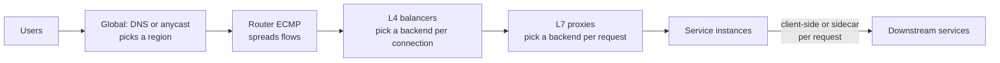

The database fails over and is unreachable for 30 seconds. Every one of your 40 API instances has a `/health` endpoint that runs `SELECT 1`, so every instance starts returning 503 to the load balancer's health checks. After three failed checks the balancer marks all 40 unhealthy and has nowhere to send traffic, so it returns errors for every request, including the many that never touch the database. The database is back after 30 seconds; the instances need three consecutive passing checks at 10-second intervals to be readmitted, so the outage lasts another half a minute on top. A partial dependency failure became a total outage, and the component that turned it into one was the load balancer, doing what it was configured to do.

A load balancer makes three decisions: which backends are eligible (health), which gets this request or connection (the algorithm), and whether it should go where the previous one went (affinity). It makes them with the information visible at its layer. This lesson covers what each layer sees, puts numbers on how the algorithms behave when backends are not identical (including a simulation of power of two choices run on this machine), works health-check timing, and scales the same ideas to regions.

## Where balancers sit



Global steering chooses a region before a connection exists ([DNS](/learn/networking/fundamentals/dns)). Routers spread flows over balancer machines with equal-cost multipath (ECMP) hashing. L4 balancers choose a backend per TCP connection; L7 proxies terminate the connection and choose per HTTP request; inside the data centre, clients or sidecars often balance their own calls ([Service meshes and proxies](/learn/networking/networking-in-practice/service-meshes-and-proxies)). Every layer has its own health checks, timeouts and failure modes.

## L4 versus L7

An **L4** balancer works on packets and connections. It sees the 5-tuple (source and destination IP and port, protocol), picks a backend when the SYN arrives, and sends every later packet of that flow to the same place. It never sees HTTP, and TLS passes through it untouched. An **L7** balancer is a proxy: it terminates TCP and usually TLS, parses each request, and uses its own pooled connections to backends, so it can route by host, path or header, balance each request, retry idempotent ones elsewhere, enforce timeouts and report per-route metrics.

| | L4 | L7 |
|---|---|---|
| Unit of balancing | Connection (flow) | Request |
| Sees | IPs, ports, TCP flags | Methods, paths, headers, status codes |
| TLS | Passes through (can route on SNI without decrypting) | Terminates: certificates and handshake CPU live here |
| Client IP at backend | Preserved (DSR, tunnelling) or via PROXY protocol | Lost unless forwarded in `X-Forwarded-For` |
| HTTP/2 and gRPC | All streams stick to one backend | Each stream balanced separately |
| Cost | Cheap per packet; line rate | Parsing, TLS and a second connection |
| Examples | Maglev, Katran, IPVS, AWS NLB | Envoy, NGINX, HAProxy, AWS ALB |

Terminating TLS at L7 means the proxy holds private keys, pays the handshake CPU (one full handshake per new client connection, the round trip measured in [TLS and PKI](/learn/networking/fundamentals/tls-and-pki)), and either sends plaintext to backends or re-encrypts, paying again on the backend leg. A proxy that only needs the host name can read SNI from the ClientHello and forward at L4 without decrypting.

## L4 forwarding: NAT, DSR and tunnelling

| Mode | What the balancer changes | Return traffic | Backend sees client IP | Constraint |
|---|---|---|---|---|
| NAT | Destination IP (and source, if SNAT) | Back through the balancer | Only without SNAT, or via PROXY protocol | Balancer carries both directions and keeps per-flow state |
| Direct server return (L2) | Destination MAC only | Backend to client directly | Yes | Backends on the same L2 segment, VIP on loopback, no ARP for it |
| Tunnelling (IP-in-IP, GRE, GUE) | Wraps the packet in a new IP header | Backend to client directly | Yes | Every packet grows by the tunnel header |

DSR and tunnelling suit asymmetric traffic such as video: small requests in, large responses out, and the balancer carries only the small half. Tunnelling is how Google's Maglev (GRE) and Facebook's Katran (IP-in-IP) reach backends across routed networks. Its cost is MTU arithmetic: IP-in-IP adds 20 bytes, so on a 1,500-byte path a full-size client segment no longer fits and would need fragmentation. Operators clamp the MSS or raise the internal MTU. *Measured:* the Cloudflare edge serving `example.com` advertised an MSS of 1,400 bytes to a home connection (`ss -ti` showed `mss:1388` after 12 bytes of TCP timestamps) rather than the 1,460 a plain 1,500-byte path allows, a 60-byte margin of the kind encapsulating networks keep.

### Keeping many L4 machines consistent: Maglev

Routers hash flows across a pool of L4 machines, and a router or pool change can send the next packet of an established flow to a machine that has never seen it. Maglev (Google, 2016) makes every machine compute the backend from the same consistent-hash lookup table (65,537 entries in Google's deployment), so any machine picks the same backend without coordination, and a backend change moves only the flows that backend owned. Each machine also keeps a local connection table, so established flows keep their backend even while the table changes. [Hashing at scale](/learn/data-structures/hashing/hashing-at-scale) traces the Maglev table fill slot by slot; the load-balancing detail it adds is that the lookup table handles *new* flows and the connection table protects *existing* ones.

```viz
{"type": "system", "scenario": "consistent-hashing", "nodes": 4, "keys": ["10.1.4.7:51220", "10.9.0.3:40112", "172.16.2.9:33810", "10.1.4.7:51221", "192.0.2.44:60001", "10.3.3.3:45678"], "title": "Hashing flows to backends so every balancer agrees", "caption": "Each flow hashes to a point on the ring and belongs to the next backend clockwise. Adding a backend moves only the flows in one arc; the rest of the established connections keep their backend."}
```

## Round robin and weighted round robin

**Round robin** gives each backend its turn regardless of state.

```viz
{"type": "network", "scenario": "load-balancer-round-robin", "title": "Round robin ignores backend state", "caption": "Each backend gets the next request in rotation. A backend that has slowed down still receives exactly its share."}
```

Twenty backends share 1,000 requests per second, normally 20 ms each. One degrades to 100 ms (a noisy neighbour, a bad disk). Round robin still sends it 50 requests per second, so 5% of all requests take 100 ms or more and one sick machine sets the service's p95. By Little's law it holds 50 × 0.1 = 5 requests in flight against 1 on its peers.

**Weighted round robin** splits traffic in proportion to capacity, for mixed instance sizes or canaries. The naive version sends `a, a, a, a, a, b, c` for weights 5, 1, 1: a burst of five to one backend. **Smooth weighted round robin** (NGINX's algorithm) interleaves them: on every request add each backend's weight to its `current` score, pick the highest (first on ties), and subtract the total weight from the winner. For weights 5, 1, 1 (total 7):

| Request | `current` after adding weights | Pick | `current` after subtracting 7 |
|---|---|---|---|
| 1 | 5, 1, 1 | a | -2, 1, 1 |
| 2 | 3, 2, 2 | a | -4, 2, 2 |
| 3 | 1, 3, 3 | b | 1, -4, 3 |
| 4 | 6, -3, 4 | a | -1, -3, 4 |
| 5 | 4, -2, 5 | c | 4, -2, -2 |
| 6 | 9, -1, -1 | a | 2, -1, -1 |
| 7 | 7, 0, 0 | a | 0, 0, 0 |

Five of seven to `a`, never more than two in a row, and the scores return to zero, so the pattern repeats.

```exercise
id: smooth-weighted-round-robin
title: Implement smooth weighted round robin
prompt: |
  Given positive integer `weights` for each backend and a number of
  requests `n`, return the list of backend indices chosen for requests
  1 to n using smooth weighted round robin:

  - Every backend starts with `current = 0`.
  - For each request, add each backend's weight to its `current`, pick the
    backend with the highest `current` (the lowest index on ties), then
    subtract the sum of all weights from the chosen backend's `current`.
languages: [python, javascript]
entry: swrr
starter:
  python: |
    def swrr(weights, n):
        current = [0] * len(weights)
        out = []
        return out
  javascript: |
    function swrr(weights, n) {
      const current = weights.map(() => 0);
      const out = [];
      return out;
    }
tests:
  - args: [[5, 1, 1], 7]
    expected: [0, 0, 1, 0, 2, 0, 0]
    label: the worked example
  - args: [[1, 1, 1], 6]
    expected: [0, 1, 2, 0, 1, 2]
    label: equal weights reduce to round robin
  - args: [[2, 1], 3]
    expected: [0, 1, 0]
  - args: [[1], 3]
    expected: [0, 0, 0]
    label: single backend
  - args: [[4, 2, 1], 7]
    expected: [0, 1, 0, 2, 0, 1, 0]
    hidden: true
  - args: [[3, 3], 4]
    expected: [0, 1, 0, 1]
    label: ties go to the lower index
    hidden: true
  - args: [[1, 2, 3], 12]
    expected: [2, 1, 0, 2, 1, 2, 2, 1, 0, 2, 1, 2]
    hidden: true
hints:
  - "The sum of all current values is zero after every request, which is why the sequence is periodic with period equal to the total weight."
  - "Use a strict greater-than when scanning for the maximum so that the first backend wins ties."
```

## Least connections and least outstanding requests

**Least outstanding requests** sends each request to the backend with the fewest in flight. A slow backend accumulates in-flight work and so receives less new work.

```viz
{"type": "network", "scenario": "load-balancer-least-conn", "title": "Least connections routes around a slow backend", "caption": "The balancer counts in-flight requests per backend and picks the minimum, so a backend that is slow to finish receives fewer new requests."}
```

Work the same example. If the balancer keeps in-flight counts roughly equal, then by Little's law (in flight = rate × latency) each backend's rate is inversely proportional to its latency: the slow one gets a fifth of a fast one's rate. With 19 fast backends at rate $r$ and one at $r/5$: $19r + r/5 = 1{,}000$, so $r = 52.1$ and the slow backend gets 10.4 requests per second. About 1% of requests are slow instead of 5%. For L7 proxies count outstanding *requests*; "least connections" is a stand-in that breaks once connections are reused or multiplexed.

Two failure modes remain. Many balancers each see only their own counts, so all of them see a newly started or newly recovered backend at zero and send it everything at once: a herd that knocks over a cold instance. And finding the global minimum means scanning every backend on every request.

## Power of two choices, measured

**Power of two choices (P2C)**: pick two backends at random and send the request to the less loaded. The classic balls-into-bins result: placing $n$ items in $n$ bins uniformly at random leaves the fullest bin with about $\ln n / \ln \ln n$ items, while the better of two random bins gives about $\ln \ln n / \ln 2$. *Measured* with a 20-line simulation on this machine (10 seeds each, $n$ items into $n$ bins):

| $n$ | One random choice: max load | Two choices: max load | $\ln n / \ln \ln n$ | $\ln \ln n / \ln 2$ |
|---|---|---|---|---|
| 1,000 | 5–6 (mean 5.6) | 3 | 3.57 | 2.79 |
| 10,000 | 6–8 (mean 6.8) | 3–4 (mean 3.2) | 4.15 | 3.20 |
| 100,000 | 7–8 (mean 7.6) | 3–4 (mean 3.6) | 4.71 | 3.53 |

The formulas are leading terms, and the one-choice formula underestimates at practical sizes, but the shape holds: one extra sample halves the worst case and makes it grow extremely slowly. Equally important, randomness breaks the herd: balancers with stale counts do not all pick the same target, because each compares a different random pair. Envoy's `LEAST_REQUEST` policy samples two hosts by default, NGINX offers `random two least_conn`, and Finagle and Linkerd compare a latency estimate (an exponentially weighted moving average of response time) so that "less loaded" means "expected to answer sooner".

```exercise
id: p2c-least-requests
title: Simulate power-of-two-choices least-requests balancing
prompt: |
  Implement `p2c(n, events)` for `n` backends that start with 0 requests
  in flight. `events` is processed in order:

  - `["req", a, b]`: the two backends sampled for this request (the random
    choices are given, so the result is deterministic). Send the request to
    `a` if `a` has no more requests in flight than `b`, otherwise to `b`,
    and increment that backend's in-flight count. `a` may equal `b`.
  - `["done", k]`: a request on backend `k` finished; decrement its
    in-flight count (it is always positive when this happens).

  Return the list of backends chosen for the `"req"` events, in order.
languages: [python, javascript]
entry: p2c
starter:
  python: |
    def p2c(n, events):
        active = [0] * n
        chosen = []
        # TODO: handle "req" and "done" events
        return chosen
  javascript: |
    function p2c(n, events) {
      const active = new Array(n).fill(0);
      const chosen = [];
      // TODO: handle "req" and "done" events
      return chosen;
    }
tests:
  - args: [3, [["req", 0, 1], ["req", 0, 1], ["req", 1, 2], ["req", 0, 2]]]
    expected: [0, 1, 2, 0]
    label: ties go to the first sample
  - args: [2, [["req", 0, 1], ["done", 0], ["req", 0, 1], ["req", 0, 1]]]
    expected: [0, 0, 1]
    label: completions free capacity
  - args: [3, [["req", 2, 2], ["req", 2, 0], ["req", 1, 1]]]
    expected: [2, 0, 1]
    label: both samples the same backend
  - args: [3, []]
    expected: []
    label: no events
  - args: [3, [["req", 0, 1], ["req", 0, 2], ["done", 2], ["req", 1, 0], ["done", 1], ["req", 0, 2], ["done", 2], ["req", 2, 0], ["done", 2], ["req", 0, 1], ["done", 1]]]
    expected: [0, 2, 1, 2, 2, 1]
    label: a backend that never finishes is avoided
    hidden: true
  - args: [4, [["req", 3, 1], ["req", 1, 3], ["req", 3, 1], ["done", 3], ["req", 3, 1], ["req", 0, 0], ["done", 1], ["req", 1, 0]]]
    expected: [3, 1, 3, 3, 0, 1]
    hidden: true
hints:
  - "Keep one in-flight counter per backend; the comparison is active[a] <= active[b]."
  - "Only \"req\" events add to the returned list; \"done\" events only change the counters."
```

## Consistent hashing, bounded loads and slow start

**Consistent hashing** sends every request with the same key (user id, cache key) to the same backend while it is healthy, which is right when the backend holds something worth reusing: a warm cache or a local shard. Plain hashing overloads whichever backend owns a hot key; **bounded loads** caps each backend at $c$ times the average and spills the excess clockwise. With $c = 1.25$ and four backends averaging 100 in-flight requests, none takes more than 125. Envoy offers ring hash and Maglev policies; [Consistent hashing and routing](/learn/networking/network-algorithms/consistent-hashing-and-routing) covers rings, virtual nodes and rendezvous hashing.

New backends need **slow start** under any load-aware algorithm, because a fresh instance has an empty cache, a cold JIT and unfilled pools, and least-requests would otherwise flood it. A linear ramp over 60 s gives it 25% of a full share at 15 s and 50% at 30 s. AWS target groups offer 30 to 900 s (off by default); Envoy's `slow_start_config` takes a window and an aggression exponent that shapes the curve; HAProxy has `slowstart` per server.

| Algorithm | State needed | Good for | Fails when |
|---|---|---|---|
| Round robin | A counter | Identical backends, uniform requests | One backend is slow or requests vary |
| Smooth weighted RR | A score per backend | Mixed sizes, canaries | Weights drift from real capacity |
| Least outstanding requests | In-flight count per backend | Uneven cost, slow backends | Many balancers herd onto one idle backend |
| Power of two choices | In-flight counts, sampled | Large fleets, many balancers | Rarely; the default for a reason |
| Consistent hash (bounded) | The ring | Cache locality, affinity | Hot keys, unless load-bounded |

## Health checks: detection arithmetic

**Active checks** probe each backend on a schedule and flip its state after consecutive results. **Passive checks** (outlier detection) watch real traffic and eject a backend after, say, five consecutive 5xx or gateway errors. The difference is time. Twenty backends share 1,000 requests per second, and one dies by refusing connections:

| Detector | Settings | Worst-case detection | Failed requests meanwhile (50/s to the dead one) |
|---|---|---|---|
| Active | 5 s interval, 3 failures, 2 s timeout | 3 × 5 + 2 = 17 s | About 850 |
| Active, AWS ALB target-group defaults | 30 s interval, 2 failures, 5 s timeout | 2 × 30 + 5 = 65 s | About 3,250 |
| Passive | 5 consecutive errors | 5 requests, about 0.1 s | 5 |

Recovery runs the same arithmetic in reverse: AWS's default healthy threshold of 5 at 30 s means 150 s before a recovered target gets traffic. Passive detection is fast but only sees what traffic reveals: a backend that hangs rather than failing is caught only if requests have timeouts, and an idle backend is never tested, which is why the two are combined.

## How partial failures become total

The opening incident came from three mistakes:

1. **The check tested a shared dependency.** If every instance calls the same database, a database failure fails every check at once. The check that removes an instance from rotation should answer "can this process serve requests". Kubernetes separates a *liveness* probe (restart a wedged process) from a *readiness* probe (remove it from balancing), and neither should call shared dependencies. A service that cannot work without the database should fail requests fast behind a circuit breaker, not hide from the balancer.
2. **Nothing failed open.** When most backends look unhealthy at once, a broken check or shared dependency is likelier than forty simultaneous machine failures. Envoy's **panic threshold** (50% by default) balances across all hosts, ignoring health, when fewer than half are healthy.
3. **Readmission was slow.** High healthy thresholds add intervals of outage after the dependency returns.

Outlier detection can eject a cluster into an outage too, so Envoy caps it (these are its defaults, apart from the comments):

```yaml
outlier_detection:
  consecutive_5xx: 5          # eject after 5 consecutive errors
  interval: 10s               # how often ejection is evaluated
  base_ejection_time: 30s     # multiplied by the number of times ejected
  max_ejection_percent: 10    # never eject more than 10% of hosts
common_lb_config:
  healthy_panic_threshold:
    value: 50                 # below 50% healthy, ignore health and use every host
```

## Draining and deregistration

Removing an instance for a deploy or scale-in runs the health machinery deliberately:

1. On `SIGTERM`, start failing readiness while still serving.
2. Wait until every balancer has noticed: interval × threshold plus the deregistration delay (AWS target groups default to 300 s, usually lowered to the longest real request).
3. Stop accepting connections, finish in-flight requests, and close idle keep-alive connections (`Connection: close` on HTTP/1.1, `GOAWAY` on HTTP/2) so clients reconnect elsewhere.
4. Exit.

With a 5 s interval and threshold 3, step 2 needs at least 15 s; skip it and every deploy produces a burst of connection errors. The idle-timeout rule from [HTTP/1.1](/learn/networking/application-protocols/http-1-1) applies too: the balancer's idle timeout must be shorter than the backend's keep-alive timeout, or reused connections race the backend's close.

## The long-lived connection problem

An L4 balancer is balanced only when connections are short and numerous. Four backends serve 400 HTTP/2 or gRPC client connections, 100 each, and you add four more. New backends receive only connections opened after they join, and a client that keeps one connection for days never moves: the old four stay hot, the new four idle ([gRPC and protobuf](/learn/networking/application-protocols/grpc-and-protobuf) shows the same incident with Kubernetes).

A **maximum connection age** fixes it over time. If servers send `GOAWAY` after 300 s, each client reconnects within 300 s, and each reconnection lands on one of eight backends, so after one full age period the expected split is 50 per backend. grpc-go adds ±10% jitter to the age so clients do not reconnect in synchronised waves. The alternatives are per-request balancing at L7 or in the client. The same trap catches WebSockets, database connection pools and any protocol with long sessions.

## Sticky sessions, and why to avoid them

Session affinity pins a client to one backend with a balancer cookie, an application cookie or a hash of the source IP, usually because sessions or caches live in process memory. The costs:

- **Uneven load.** Heavy users stay put, and with source-IP hashing thousands of users behind one carrier NAT become one "client" ([NAT, firewalls and cloud networking](/learn/networking/fundamentals/nat-firewalls-and-cloud-networking)).
- **Failures lose state.** When the pinned backend dies, its sessions die.
- **Scaling and deploys slow down.** New instances get only new sessions, and draining takes as long as the longest session.

Move session state into a shared store or a signed cookie, and keep affinity only where losing it is harmless (consistent hashing for cache locality, with bounded loads). [Scalability primitives](/learn/system-design/building-blocks/scalability-primitives) covers the stateless side.

## Global load balancing

| | GeoDNS | Anycast |
|---|---|---|
| How a region is chosen | Authoritative DNS answers by resolver location, latency or weight | BGP delivers packets to the nearest announcing region |
| Failover | Health-checked records; bounded by TTLs and caching | Withdraw the route: seconds |
| Control | Fine: per query, weighted | Coarse: announcement changes |
| Blind spot | Resolver location is not the user's | Route changes can move long-lived flows |

Global cloud balancers combine an anycast front end with L7 proxies that can forward to another region, and some clients (video, games) receive a list of regional endpoints and measure them themselves.

The hard constraint is capacity, not routing. If one of $N$ regions fails, the rest absorb its traffic, so each can run at no more than $(N-1)/N$ of capacity at peak: 50% with two regions, 67% with three, 75% with four. Netflix has described running active-active across AWS regions and practising regional evacuation, shifting all traffic out of a region, as a routine exercise; the routing is the easy part, and the practice proves the remaining regions can take the load and already hold the data they need.

## Under the hood: where balancing runs

- **IPVS** is the Linux kernel's L4 balancer (used by kube-proxy in IPVS mode): a connection table in the kernel and schedulers including round robin, weighted and least connections, with NAT, DSR and tunnelling modes.
- **Katran** (Facebook, open source) runs in the kernel's XDP hook as an eBPF program, choosing a backend with Maglev hashing and encapsulating the packet before the normal network stack sees it, which is what lets one machine forward at line rate.
- **Envoy** runs balancing per worker thread: each worker has its own connection pools and least-request counts, so an 8-worker proxy is 8 independent balancers, which is one more reason P2C's tolerance of stale counts matters.
- **NGINX and HAProxy** implement smooth weighted round robin (`upstream` default in NGINX), least connections, hashing, and random-two variants, with active checks in HAProxy and NGINX Plus and passive `max_fails`/`fail_timeout` in open-source NGINX.

## Production failure modes

| Failure | Symptom | Diagnosis | Fix |
|---|---|---|---|
| Shared-dependency health check | Every instance ejected at once; total outage during a partial one | Health endpoint calls the database or another shared service | Local readiness checks; panic threshold; circuit breakers |
| Slow backend under round robin | p95 set by one host | Per-host latency shows one outlier with a full share of traffic | Least-requests with P2C; outlier ejection |
| Herd on a new or recovered host | A fresh instance overloads and fails right after joining | Its in-flight count spikes at join time | Slow start; P2C |
| Long-lived connection imbalance | New instances idle after scale-out | Connections per backend skewed; requests per connection high | Max connection age with jitter; L7 or client-side balancing |
| Deploy errors | Connection refused or 502 bursts on every rollout | Instances exit before balancers stop sending | Fail readiness first, wait detection plus deregistration delay, drain |
| NAT-skewed stickiness | One backend far hotter than others | Source-IP affinity maps a carrier NAT to one host | Cookie affinity or stateless backends |

## Interviewer follow-ups

**"One backend of twenty is five times slower. Quantify the damage under round robin and under least-requests."** Model answer: round robin sends it 5% of traffic, so 5% of requests are slow; least-requests equalises in-flight counts, so by Little's law it gets a fifth of a fast host's rate, about 10 of 1,000 per second, 1%. Common wrong answer: "the average barely moves", which ignores that the p95 is set by that host.

**"Why power of two choices rather than the global least-loaded?"** Model answer: global least-loaded with many balancers and stale counts herds onto one host; two random samples keep most of the benefit (max load about 3 instead of 5 to 8 at $n$ from 1,000 to 100,000 in the simulation) while different balancers pick different targets, and it costs two lookups instead of a scan. Common wrong answer: "it is only cheaper", missing the herd.

**"How long does it take to stop sending traffic to a dead backend?"** Model answer: active checks take interval × unhealthy threshold plus the timeout (17 s at 5 s × 3 + 2 s; 65 s with AWS's defaults), passive outlier detection takes a few failed requests, so use both; recovery takes interval × healthy threshold. Common wrong answer: "immediately, the balancer notices", which forgets the thresholds that exist to avoid flapping.

**"You scaled from 4 to 8 gRPC backends and the new ones get nothing. Why and how do you fix it?"** Model answer: connection-level balancing with long-lived HTTP/2 connections; add a jittered maximum connection age so clients reconnect across all eight within one age period, or balance per request at L7 or in the client. Common wrong answer: "restart the clients", which rebalances once and fails at the next scale-out.

## What mid-level engineers get wrong

- **Health endpoints that call the database**, turning one dependency blip into a fleet-wide ejection.
- **Round robin in front of heterogeneous or noisy hosts**, letting one slow host set the tail.
- **L4 balancing for HTTP/2 or gRPC** and expecting new instances to share load.
- **No slow start**, so least-requests floods every new instance.
- **Exiting on `SIGTERM` without draining**, producing errors on every deploy.
- **Source-IP stickiness**, which puts a whole carrier behind one host.
- **Running each of two regions at 70%**, then discovering that failover means 140%.

## Senior signals

- You choose the layer by what it must see, know NAT, DSR and tunnelling and their MTU and return-path consequences, and never rely on L4 alone for HTTP/2 or gRPC.
- You quantify algorithms: 5% versus 1% slow requests for round robin versus least-requests, and max load 3 versus 5 to 8 for two choices versus one.
- You default to least-requests with P2C plus slow start, and use bounded-load consistent hashing only when locality pays.
- You compute detection and recovery times from interval, threshold and timeout, combine active and passive checks, keep shared dependencies out of readiness, and set a panic threshold.
- You drain with fail-readiness, wait, drain, close, and fix long-lived connection imbalance with a jittered maximum age.
- You size regions for N-1 and treat global failover as a capacity and data problem.

## Check yourself

```quiz
- q: >-
    One of 20 backends slows from 20 ms to 100 ms per request. With round robin, what share of requests is slow, and roughly what share with least-outstanding-requests?
  options: ["Every request slows by a fifth under either algorithm", "About 1% with round robin, about 5% with least-requests", "About 5% with round robin, 1% with least-requests", "About 5% with round robin, about 5% with least-requests"]
  answer: 2
  explanation: >-
    Round robin gives the slow host its full 1/20 share. Least-requests keeps in-flight counts roughly equal, and since in flight equals rate times latency, the slow host's rate falls to a fifth of a fast host's: 19r + r/5 = 1,000 gives about 10 requests per second, about 1% of traffic.
- q: >-
    All 40 instances fail their health checks when a shared database has a 30-second blip, and the load balancer serves errors for every request. Which two changes most directly prevent this?
  options: ["Switch from L7 to L4 balancing, and lower the check timeouts", "Enable sticky sessions, and raise the healthy threshold count", "Shorter check intervals, and more instances in the pool", "Keep the DB out of readiness, and add a panic threshold"]
  answer: 3
  explanation: >-
    The check made every instance share the database's fate, and the balancer had no rule for everything looking down at once. Readiness should reflect the instance's own ability to serve; a panic threshold treats most hosts failing together as a probable checking problem and uses all of them. Faster checks or more instances would all fail the same check together.
- q: >-
    Why does power of two choices beat always picking the globally least-loaded backend when many independent balancers share a fleet?
  options: ["It works without any load information about the backends", "Two samples cut imbalance, and randomness stops herds", "It guarantees perfectly even load across all of the backends", "It removes the need for any health checks on the backends"]
  answer: 1
  explanation: >-
    With stale counts, every balancer that picks the global minimum sends its traffic to the same idle host at once. Comparing two random hosts keeps most of the benefit (in the simulation, a maximum load of about 3 instead of 5 to 8) while different balancers pick different targets. It still needs in-flight counts and promises no perfect balance.
- q: >-
    Active health checks run every 5 s, mark a host down after 3 failures, and time out after 2 s. A host starts refusing connections right after a successful check. Roughly how long until the balancer stops sending it traffic?
  options: ["About 2 seconds", "About 5 seconds", "About 17 seconds", "About 7 seconds"]
  answer: 2
  explanation: >-
    Three consecutive failed checks are needed, 5 s apart, plus the timeout of the last one: about 3 x 5 + 2 = 17 s, during which the host keeps its share of traffic. Passive outlier detection on real requests catches it within a few failed requests, which is why the two are combined.
- q: >-
    A gRPC service scales from 4 to 8 backends behind an L4 balancer and the new backends stay idle. Which change spreads the load without changing the balancer?
  options: ["More HTTP/2 streams allowed per connection", "Sticky sessions keyed on the client IP address", "A longer idle timeout on the L4 balancer", "A jittered maximum connection age on servers"]
  answer: 3
  explanation: >-
    Clients hold long-lived HTTP/2 connections, and an L4 balancer only chooses when a connection opens. A maximum connection age makes servers send GOAWAY, so clients reconnect and each new connection can land on any of the eight backends; jitter prevents synchronised reconnection waves. The other changes keep connections pinned longer.
- q: >-
    A service runs active-active in three regions. What is the highest peak utilisation each region can run at if the service must survive the loss of any one region without shedding load?
  options: ["About 50%", "About 67%", "About 90%", "About 33%"]
  answer: 1
  explanation: >-
    If one of three regions fails, two must carry the whole load, so each needs capacity for 1.5 times its normal share: normal utilisation of at most 2/3. With two regions the figure is 50%, with four 75%. Global failover is a capacity plan before it is a routing change.
```
