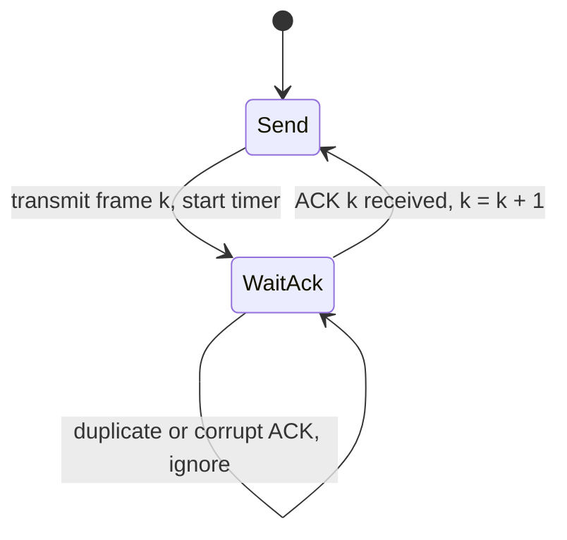

IP makes one promise: it will try. A packet can be dropped by a full router queue, corrupted by a flaky optic and discarded by a checksum, duplicated by a link-layer retry, or overtaken by a later packet that took a different ECMP path. Yet `write()` on a TCP socket hands the other side exactly the bytes you wrote, once each, in order. Everything between those two facts is a small family of algorithms built from four parts: sequence numbers, acknowledgements, timers and retransmission.

The interesting part is not reliability itself, which a child could design ("send it, wait for a thumbs-up, send it again if none arrives"). It is reliability *at speed*: keeping a 10 Gbit/s link with a 50 ms round trip full while still recovering every lost byte. That requires a sliding window, and the choice of what to do when one frame inside the window goes missing is the difference between Go-Back-N and Selective Repeat, and between a link that runs at 99% of capacity under loss and one that runs at 20%.

## Stop-and-wait: correct and useless

The simplest reliable protocol sends one frame, starts a timer, and waits. If the ACK arrives, it sends the next frame. If the timer fires, it resends the same frame.



Two details make it correct. First, a retransmission can create a **duplicate**: the frame arrived, the ACK was lost, the sender resends. The receiver must recognise the second copy, so frames carry a sequence number. Stop-and-wait only ever has one frame outstanding, so a single bit that alternates 0, 1, 0, 1 is enough (the *alternating bit protocol*). Second, the receiver ACKs the duplicate again, because the sender is clearly still waiting for an ACK it never got.

Now put numbers on it. A 100 Mbit/s link, a 50 ms round trip, 1,500-byte frames:

- Transmission time of one frame: $12{,}000 \text{ bits} / 10^8 \text{ bit/s} = 0.12$ ms.
- Each cycle is the transmission plus the round trip: $50.12$ ms.
- Utilisation: $0.12 / 50.12 \approx 0.24\%$.

The link carries about 240 kbit/s out of 100 Mbit/s. The protocol is correct and spends 99.76% of its time waiting. On a LAN with a 0.2 ms RTT the same protocol would be fine, which is why simple request-response protocols over local links often get away with it and why the same code falls apart across an ocean.

## Pipelining: the sliding window

The fix is to have many frames in flight. The sender keeps a **window** of up to `W` frames that have been sent but not yet acknowledged. When the oldest one is acknowledged, the window slides forward by one and the next frame can go out.

```text
sequence:   0   1   2   3   4   5   6   7   8   9  10
            [ acked ][   sent, not acked   ][ usable ][ not yet allowed ]
                     ^ base                  ^ next    ^ base + W
```

The sender tracks two numbers: `base`, the oldest unacknowledged frame, and `next`, the next frame to send. It may send while `next < base + W`. With `W` frames in flight per round trip, utilisation becomes

$$
U = \min\left(1,\ \frac{W \cdot T_{tx}}{RTT + T_{tx}}\right)
$$

To fill the 100 Mbit/s, 50 ms link you need $W \geq 50.12 / 0.12 \approx 418$ frames. Put differently, the window in bytes must cover the **bandwidth-delay product**: $10^8 \text{ bit/s} \times 0.05 \text{ s} = 5$ Mbit $= 625{,}000$ bytes, about 417 full frames. This is the same arithmetic as in [Latency, bandwidth and the math](/learn/networking/networking-in-practice/latency-bandwidth-and-math), and it is the reason TCP needed window scaling: its original 16-bit window field caps the window at 64 KiB, which on this link would limit throughput to $65{,}535 \times 8 / 0.05 \approx 10.5$ Mbit/s no matter how fast the link is.

The sender's window is a ring buffer indexed by sequence number modulo the buffer size: frames enter at `next`, leave at `base`, and every in-flight frame must stay buffered until acknowledged, because it might need to be resent. If you have implemented [Design Circular Queue](/practice/design-circular-queue), you have implemented the data structure at the heart of every TCP send buffer.

Pipelining creates the real question. When frame 2 of frames 0 to 9 is lost, frames 3 to 9 still arrive. What does the receiver do with them, and what does the sender resend?

## Go-Back-N: one timer, cumulative ACKs, no receiver buffer

Go-Back-N (GBN) keeps the receiver as simple as possible.

- The receiver tracks one number, `expected`. A frame with that sequence number is delivered and `expected` advances. **Any other frame is discarded**, and the receiver re-sends an ACK for the last in-order frame.
- ACKs are **cumulative**: "ACK 5" means "I have everything up to and including 5".
- The sender runs one timer, for the oldest unacknowledged frame. When it fires, the sender **goes back** to `base` and resends every frame from there.

Step through it: a window of 3, frame 1 lost.

```viz
{"type": "network", "scenario": "sliding-window-protocol", "title": "Go-Back-N with a window of 3", "caption": "Frame 1 is lost. Frames 2 and 3 arrive out of order and are thrown away, the receiver keeps re-ACKing frame 0, and when the timer fires the sender resends everything from frame 1."}
```

### A worked trace

Window 4, eight frames, and the first transmission of frame 2 is lost. Assume the round trip is long enough that the sender fills its window before the first ACK returns, and that ACKs are never lost.

| Event | Sender window | Receiver `expected` | On the wire |
|---|---|---|---|
| send 0, 1, 2, 3 | [0..3] | 0 | 0, 1, 2 (lost), 3 |
| 0 arrives, ACK 0 | slides to [1..4], sends 4 | 1 | 4 |
| 1 arrives, ACK 1 | slides to [2..5], sends 5 | 2 | 5 |
| 3, 4, 5 arrive | stuck at [2..5] | 2 (discards 3, 4, 5; re-ACKs 1) | dup ACK 1 ×3 |
| timer for 2 fires | goes back to 2 | 2 | 2, 3, 4, 5 |
| 2, 3 arrive | slides, sends 6 and 7 | 4 | 6, 7 |
| everything arrives | done | 8 | |

The transmission log is `0 1 2 3 4 5 2 3 4 5 6 7`: twelve transmissions to deliver eight frames. Frames 3, 4 and 5 crossed the link twice even though nothing was wrong with them the first time.

That is the whole trade. GBN's receiver needs no buffer and one integer of state, and its ACKs are a single number. The price is that one loss costs up to a full window of retransmissions. With a large window that is ruinous. Take the 418-frame window from before and a 1% loss rate: a loss happens roughly every 100 frames, and each loss resends roughly a window's worth, so the useful fraction is about

$$
\frac{1/p}{1/p + W} = \frac{1}{1 + pW} = \frac{1}{1 + 0.01 \times 418} \approx 19\%
$$

A link that should run at 100 Mbit/s delivers about 19 Mbit/s of new data and spends the rest resending frames that had already arrived safely.

## Selective Repeat: buffer out of order, resend only the hole

Selective Repeat (SR) moves the work to the receiver.

- The receiver keeps its own window of `W` slots. A frame that falls in the window is **buffered** even if it is out of order, and acknowledged **individually**.
- When the frame at the bottom of the receiver's window arrives, the receiver delivers it and every consecutive buffered frame after it, and slides.
- The sender keeps a **timer per frame** and retransmits only frames whose own timers expire.

Replay the same trace: frame 2 is lost, 3, 4 and 5 are buffered and individually ACKed, the sender's timer for 2 alone fires, and the retransmission of 2 lets the receiver deliver 2, 3, 4 and 5 at once. Nine transmissions instead of twelve. On the lossy long link, the useful fraction is roughly $1 - p = 99\%$, because each loss costs exactly one extra frame.

| | Stop-and-wait | Go-Back-N | Selective Repeat |
|---|---|---|---|
| Frames in flight | 1 | up to W | up to W |
| Receiver buffer | 1 frame | 1 frame | W frames |
| ACK meaning | this frame | everything up to n (cumulative) | this frame (individual) |
| Timers | 1 | 1 (oldest unacked) | 1 per outstanding frame |
| Retransmissions per loss | 1 | up to W | 1 |
| Max window with k-bit sequence numbers | 1 (alternating bit) | $2^k - 1$ | $2^{k-1}$ |

## Sequence numbers are finite: the window limits

Sequence numbers live in a header field of k bits, so they wrap: with 3 bits they run 0 to 7 and then 0 again. The window size is limited by the requirement that the receiver can always tell a new frame from an old retransmission carrying the same number.

**Go-Back-N: $W \leq 2^k - 1$.** Suppose k = 3 and W = 8. The sender sends 0 to 7; all arrive; the receiver delivers them and now expects 0 (the next lap). Every ACK is lost. The sender times out and resends the *old* 0 to 7. The receiver is expecting 0, sees 0, and delivers stale data as if it were new. With W = 7, the sender only sends 0 to 6, the receiver then expects 7, and a retransmitted 0 is correctly recognised as a duplicate.

**Selective Repeat: $W \leq 2^{k-1}$.** SR is stricter because the receiver's window accepts a whole range. With k = 3 and W = 5: the sender sends 0 to 4, all arrive, and the receiver's window slides to {5, 6, 7, 0, 1}. All ACKs are lost. The sender retransmits old frame 0, and 0 is inside the receiver's window, so the receiver buffers stale data as the frame after 7. With W = 4, the receiver's window after 0 to 3 is {4, 5, 6, 7} and the old 0 falls outside it. The general rule is that the sender's and receiver's windows together must not exceed the sequence space.

This is not a textbook curiosity. TCP numbers *bytes* with 32 bits, and the window scale option (RFC 7323) is capped at a shift of 14, which limits the window to about $2^{30}$ bytes, a quarter of the sequence space. The cap exists precisely so the window stays under half of the sequence space, the Selective Repeat bound, and TCP's modular sequence comparisons remain unambiguous.

Wraparound in time is the other hazard. At 10 Gbit/s, $2^{32}$ bytes pass in $2^{32} \times 8 / 10^{10} \approx 3.4$ seconds. TCP's original design assumed a stray segment could survive up to two minutes in the network (the maximum segment lifetime), so on a fast link an old segment could reappear with a sequence number that is valid again. **PAWS** (protection against wrapped sequences) uses the TCP timestamp option as an extension of the sequence number and discards segments whose timestamp is older than the last one seen. Above roughly 300 Mbit/s (where the sequence space wraps within two minutes) PAWS is doing real work.

## What TCP actually does

TCP is neither pure GBN nor pure SR. It is a hybrid that took the cheap parts of each.

- **Cumulative ACKs, like GBN.** The ACK field is "the next byte I expect". A receiver with a hole keeps sending the same ACK number.
- **Out-of-order buffering, like SR.** Practically every TCP receiver keeps segments that arrive after a hole instead of discarding them.
- **SACK, to make the ACKs selective.** The SACK option carries up to three or four byte ranges the receiver holds beyond the hole, so the sender knows exactly which bytes to resend.
- **One retransmission timer, like GBN**, with an RTO computed from the smoothed RTT and its variance and doubled on each consecutive expiry. The derivation is in [TCP deep dive](/learn/networking/fundamentals/tcp-deep-dive).
- **Fast retransmit.** Three duplicate ACKs mean later data is arriving and one segment is missing, so the sender resends it immediately instead of waiting for the timer.

```viz
{"type": "network", "scenario": "tcp-retransmit", "title": "TCP: cumulative ACKs, buffered segments, one fast retransmit", "caption": "The receiver buffers segments 3 and 4 (Selective Repeat behaviour) but its ACK number stays at the hole (Go-Back-N behaviour). Three duplicates trigger a retransmission of only the missing segment, and the cumulative ACK then jumps past everything buffered."}
```

The window also has a second job. The receiver advertises how much buffer space it has left (`rwnd`), and the sender's usable window is $\min(\text{cwnd}, \text{rwnd})$: the sliding window is simultaneously the reliability mechanism, the flow-control mechanism (do not overrun the receiver) and, via the congestion window, the congestion-control mechanism (do not overrun the network, the subject of [Congestion control](/learn/networking/fundamentals/congestion-control)). One data structure, three constraints.

### The retransmission ambiguity

When an ACK arrives for a segment that was sent twice, which transmission is it acknowledging? If the sender guesses the first, it overestimates the RTT; if it guesses the second, it may underestimate it. **Karn's algorithm** is the classic answer: never take an RTT sample from a retransmitted segment. TCP timestamps later made the samples unambiguous by echoing the sender's clock.

QUIC fixed the ambiguity at the root. Its **packet numbers are never reused**: a retransmission carries the lost *data* in a brand-new packet with a higher number, and stream offsets (not packet numbers) say where the data belongs. Every ACK is unambiguous, RTT samples are exact, and ACK frames list ranges of received packet numbers, which is SACK built in from the start. Loss recovery is also per stream, so one lost packet stalls only the stream whose data it carried, which is the head-of-line argument in [HTTP/2 and HTTP/3](/learn/networking/application-protocols/http-2-and-http-3).

## The same algorithms, one layer up

A TCP ACK means "the peer's kernel has these bytes in its receive buffer". It does not mean the peer application read them, let alone acted on them. If the process crashes after the ACK, the data is gone and the sender will never know. This is the end-to-end argument: reliability that matters to the application has to be implemented, again, by the application. When you do that, you rebuild this lesson.

- **Kafka consumer offsets are cumulative ACKs.** Committing offset 1,042 says "everything before 1,042 is processed". One slow or poisoned message at 1,000 blocks the commit for everything after it, which is GBN's head-of-line problem. Consumers that process messages in parallel have to track completion per message and commit only the lowest contiguous point.
- **SQS and RabbitMQ acknowledgements are Selective Repeat.** Each message is acked individually, and the visibility timeout (or unacked-redelivery) is a per-message retransmission timer.
- **Idempotency keys are sequence numbers.** Retransmission guarantees duplicates, so the receiver must deduplicate, exactly as the alternating bit did. The application-level version of this is [Idempotency and retries](/learn/system-design/building-blocks/idempotency-and-retries).
- **Resumable streams** (SSE's `Last-Event-ID`, a WebSocket protocol with numbered messages) are a cumulative ACK sent at reconnect time.

## Exercise

```exercise
id: go-back-n-simulation
title: Simulate a Go-Back-N sender
prompt: |
  Simulate Go-Back-N and return the sequence number of every frame the
  sender transmits, in transmission order.

  The model:

  - Frames are numbered 0 to n - 1 (no wraparound). At most `window`
    frames may be sent but unacknowledged.
  - The link is a FIFO pipe. Repeat until every frame is acknowledged:
    1. The sender transmits every frame its window allows, from `next`
       up to `base + window - 1` and never past `n - 1`, appending each
       to the log and to the pipe.
    2. The frame at the head of the pipe arrives. If that transmission
       was lost, nothing happens. If it is the frame the receiver expects,
       the receiver delivers it and its cumulative ACK reaches the sender
       instantly, so `base` becomes `expected`. Any other frame is
       discarded.
    3. If the pipe is now empty and some frames are still unacknowledged
       (`base < next`), the timer fires and the sender goes back:
       `next = base`.
  - `lost` lists positions in the transmission log (0-based) whose
    transmissions are lost; a retransmission can be lost too. ACKs are
    never lost.

  Example: n = 8, window = 4, lost = [2] gives
  [0, 1, 2, 3, 4, 5, 2, 3, 4, 5, 6, 7].
languages: [python, javascript]
entry: go_back_n
starter:
  python: |
    def go_back_n(n, window, lost):
        lost = set(lost)
        base = 0        # oldest unacknowledged frame
        next_seq = 0    # next frame to transmit
        expected = 0    # receiver: next in-order frame it will accept
        log = []        # sequence numbers in transmission order
        pipe = []       # FIFO of (seq, is_lost)
        # TODO: loop until base == n
        return log
  javascript: |
    function go_back_n(n, window, lost) {
      const lostSet = new Set(lost);
      let base = 0;      // oldest unacknowledged frame
      let nextSeq = 0;   // next frame to transmit
      let expected = 0;  // receiver: next in-order frame it will accept
      const log = [];    // sequence numbers in transmission order
      const pipe = [];   // FIFO of [seq, isLost]
      // TODO: loop until base === n
      return log;
    }
tests:
  - args: [5, 3, []]
    expected: [0, 1, 2, 3, 4]
    label: no loss
  - args: [8, 4, [2]]
    expected: [0, 1, 2, 3, 4, 5, 2, 3, 4, 5, 6, 7]
    label: the worked trace
  - args: [4, 1, [1]]
    expected: [0, 1, 1, 2, 3]
    label: window 1 is stop-and-wait
  - args: [6, 3, [0]]
    expected: [0, 1, 2, 0, 1, 2, 3, 4, 5]
    label: first frame lost
  - args: [4, 2, [1, 3]]
    expected: [0, 1, 2, 1, 2, 1, 2, 3]
    label: the retransmission is lost too
  - args: [0, 4, []]
    expected: []
    label: nothing to send
  - args: [10, 4, [3, 6]]
    expected: [0, 1, 2, 3, 4, 5, 6, 3, 4, 5, 6, 7, 8, 9]
    hidden: true
  - args: [7, 3, [2, 5, 9]]
    expected: [0, 1, 2, 3, 4, 2, 3, 4, 2, 3, 4, 5, 3, 4, 5, 6]
    hidden: true
hints:
  - "A transmission is lost when its log position (the log length at the moment you send it) is in `lost`."
  - "Only an in-order frame that was not lost advances `expected`, and `base` follows it."
  - "When the pipe drains with `base < next`, set `next = base`; the refill step then resends the whole window."
```

## Senior signals

- You size windows from the **bandwidth-delay product**, and when a transfer is slow on a long path you check whether the window (send buffer, receive buffer, window scaling, HTTP/2 flow-control window) is smaller than the BDP before blaming the network.
- You can state the trade between Go-Back-N and Selective Repeat as **receiver state versus retransmitted bytes**, and do the $1/(1 + pW)$ estimate that shows why GBN collapses on lossy, high-BDP links.
- You know the **sequence-space bounds** ($2^k - 1$ and $2^{k-1}$) and can connect them to real limits: TCP's 2^30 window cap and PAWS on fast links.
- You describe TCP as a **hybrid**: cumulative ACKs plus SACK, one timer plus fast retransmit, and you know QUIC's never-reused packet numbers remove the retransmission ambiguity Karn's algorithm works around.
- You never treat a transport ACK as an application ACK. You recognise Kafka offsets as cumulative ACKs with head-of-line blocking and per-message queue acks as Selective Repeat, and you design deduplication because retransmission guarantees duplicates.

## Check yourself

```quiz
- q: >-
    A stop-and-wait protocol runs over a 1 Gbit/s link with a 100 ms round trip and 1,500-byte frames. Roughly what throughput does it achieve, and what is the fix?
  options: ["About 500 Mbit/s; send jumbo frames to halve the waits", "About 1 Gbit/s, since the link is never the limit", "About 120 kbit/s; keep a BDP of frames in flight", "About 12 Mbit/s; upgrade to a faster 10 Gbit/s link"]
  answer: 2
  explanation: >-
    One 12,000-bit frame per 100 ms round trip is 120 kbit/s. Only a window covering the bandwidth-delay product (10^9 bit/s × 0.1 s = 100 Mbit = 12.5 MB, about 8,300 frames) keeps the pipe full. Larger frames or a faster link do almost nothing, because the protocol is waiting, not transmitting.
- q: >-
    A protocol uses 4-bit sequence numbers. What are the largest safe windows for Go-Back-N and for Selective Repeat?
  options: ["15 and 15", "16 and 16", "15 and 8", "8 and 15"]
  answer: 2
  explanation: >-
    Go-Back-N allows 2^k − 1 = 15, because its receiver only ever accepts one sequence number. Selective Repeat's receiver accepts a whole window, so sender and receiver windows together must fit in the sequence space: 2^(k−1) = 8. With W = 9, a retransmitted old frame could fall inside the receiver's advanced window and be accepted as new.
- q: >-
    A satellite link has a large window and a 2% loss rate. Moving from Go-Back-N to Selective Repeat mainly improves throughput because:
  options: ["Selective Repeat never needs retransmission timers", "Selective Repeat needs fewer sequence-number bits", "Each loss costs one resend instead of up to a window", "Individual ACKs are smaller than cumulative ACKs"]
  answer: 2
  explanation: >-
    With W frames in flight, Go-Back-N resends up to W frames per loss, so useful throughput is roughly 1/(1 + pW). Selective Repeat resends only the missing frame. The price is the opposite of the claims about timers and sequence bits: it needs more sequence space, a W-frame receiver buffer and per-frame timers.
- q: >-
    Your service writes an order to a TCP socket, the write returns, and the peer's TCP stack ACKs every byte. The peer process then crashes. What do you know?
  options: ["The ACK proves the process read the bytes before crashing", "The order was processed, because TCP is reliable", "TCP will redeliver the order once the peer restarts", "Only that the bytes reached the peer's kernel buffer"]
  answer: 3
  explanation: >-
    TCP's reliability ends at the receiving kernel: the ACK says the bytes are in the receive buffer, not that the application ever read them. Application-level delivery needs its own acknowledgement (a response, a committed offset, a queue ack) and its own deduplication. That is the end-to-end argument, and it is why message queues rebuild ACKs and timers above TCP.
- q: >-
    Why does QUIC not need Karn's algorithm to get clean RTT samples?
  options: ["It sends every packet twice, so one copy always lands", "It never reuses a packet number, even for resends", "It does not measure RTT at all, so needs no samples", "It uses a fixed retransmission timeout, not an RTT one"]
  answer: 1
  explanation: >-
    In TCP a retransmitted segment carries the same sequence numbers as the original, so an ACK is ambiguous and Karn's rule discards those samples. QUIC puts retransmitted data in a new packet with a new, higher packet number and locates the data by stream offset, so every ACK identifies exactly one transmission and one send time.
```
