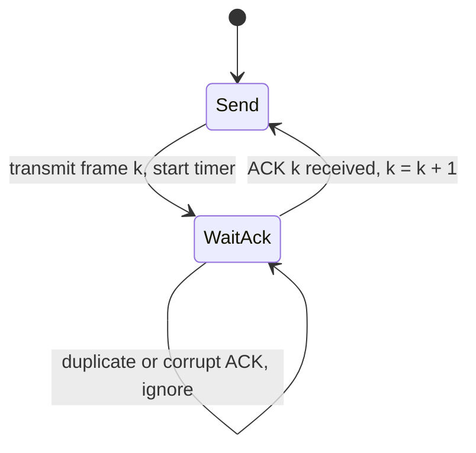

IP makes one promise: it will try. A packet can be dropped by a full router queue, corrupted by a flaky optic and discarded by a checksum, duplicated by a link-layer retry, or overtaken by a later packet that took a different ECMP path. Yet `write()` on a TCP socket hands the other side exactly the bytes you wrote, once each, in order. Everything between those two facts is a small family of algorithms built from four parts: sequence numbers, acknowledgements, timers and retransmission.

The interesting part is not reliability itself ("send it, wait for a thumbs-up, send it again if none arrives"). It is reliability *at speed*: keeping a 10 Gbit/s link with a 50 ms round trip full while still recovering every lost byte. That requires a sliding window, and the choice of what to do when one frame inside the window goes missing is the difference between Go-Back-N and Selective Repeat, and between a link that runs at 99% of capacity under loss and one that runs at 20%.

## Stop-and-wait: correct and useless

The simplest reliable protocol sends one frame, starts a timer, and waits. If the ACK arrives, it sends the next frame. If the timer fires, it resends the same frame.



Two details make it correct. A retransmission can create a **duplicate**: the frame arrived, the ACK was lost, the sender resends. The receiver must recognise the second copy, so frames carry a sequence number; with one frame outstanding a single alternating bit is enough (the *alternating bit protocol*). And the receiver ACKs the duplicate again, because a retransmission is proof the sender never received the first ACK.

Now put numbers on it. A 100 Mbit/s link, a 50 ms round trip, 1,500-byte frames:

- Transmission time of one frame: $12{,}000 \text{ bits} / 10^8 \text{ bit/s} = 0.12$ ms.
- Each cycle is the transmission plus the round trip: $50.12$ ms.
- Utilisation: $0.12 / 50.12 \approx 0.24\%$.

The link carries about 240 kbit/s out of 100 Mbit/s. On a LAN with a 0.2 ms RTT the same protocol reaches 38%, which is why simple request-response protocols over local links get away with it and why the same code falls apart across an ocean.

## Pipelining: the sliding window

The fix is to have many frames in flight. The sender keeps a **window** of up to `W` frames that have been sent but not yet acknowledged. When the oldest is acknowledged, the window slides forward and the next frame can go out.

```text
frame:      0   1   2   3   4   5   6   7   8   9
            [ acked ][   sent, not acked   ][ usable ][ not yet allowed ]
                     ^ base                  ^ next    ^ base + W
```

The sender tracks `base`, the oldest unacknowledged frame, and `next`, the next frame to send, and may send while `next < base + W`. Real headers carry a k-bit sequence number, `frame mod 2^k`, so the test is done in modular arithmetic: with 3-bit numbers, `base` at sequence 6 and `W = 4`, the sender may use sequence numbers `s` with `(s − 6) mod 8 < 4`, which is {6, 7, 0, 1}. With `W` frames per round trip, utilisation becomes

$$
U = \min\left(1,\ \frac{W \cdot T_{tx}}{RTT + T_{tx}}\right)
$$

To fill the 100 Mbit/s, 50 ms link you need $W \geq 50.12 / 0.12 \approx 418$ frames. In bytes, the window must cover the **bandwidth-delay product**: $10^8 \text{ bit/s} \times 0.05 \text{ s} = 625{,}000$ bytes, the arithmetic of [Latency, bandwidth and the math](/learn/networking/networking-in-practice/latency-bandwidth-and-math). TCP's original 16-bit window field caps the window at 64 KiB, which on this link limits throughput to $65{,}535 \times 8 / 0.05 \approx 10.5$ Mbit/s whatever the link speed, and is why window scaling exists.

The sender's window is a ring buffer indexed by sequence number modulo its size: frames enter at `next`, leave at `base`, and every in-flight frame stays buffered until acknowledged because it might need resending. If you have implemented [Design Circular Queue](/practice/design-circular-queue), you have implemented the data structure at the heart of every TCP send buffer.

## One loss pattern, three protocols

Every trace below uses the same setup, which is also the model the exercises use: 10 frames, 3-bit sequence numbers (frames 8 and 9 carry sequence numbers 0 and 1), a window of 4, ACKs that are never lost, and **the first transmission of frame 2 is lost**. The link is a FIFO pipe; the sender refills its window, then the frame at the head of the pipe arrives, and a timer fires when the pipe has drained with frames still unacknowledged.

**Stop-and-wait** (`W = 1`) sends `0 1 2 2 3 4 5 6 7 8 9`: eleven transmissions and one timeout, but each frame costs a full round trip, so on the 50 ms link it needs ten round trips plus the timeout.

### Go-Back-N, traced

Go-Back-N (GBN) keeps the receiver as simple as possible: it tracks one number, `expected`, delivers a frame only if it carries that sequence number, **discards everything else**, and re-sends a **cumulative** ACK for the last in-order frame. The sender runs one timer, for the oldest unacknowledged frame, and when it fires the sender **goes back** to `base` and resends everything from there.

| Step | Event | Sender window (frames) | Receiver expects (seq) | On the wire (seq) |
|---|---|---|---|---|
| 1 | Send 0 to 3 | [0..3] | 0 | 0, 1, 2 lost, 3 |
| 2 | 0 arrives, ACK 0 | [1..4], sends 4 | 1 | 4 |
| 3 | 1 arrives, ACK 1 | [2..5], sends 5 | 2 | 5 |
| 4 | 3, 4, 5 arrive out of order | stuck at [2..5] | 2: discards them, re-ACKs 1 three times | none |
| 5 | Timer for 2 fires | goes back to 2 | 2 | 2, 3, 4, 5 |
| 6 | 2, 3, 4, 5 arrive in order | slides to [6..9], sends 6, 7, 8, 9 | 6 | 6, 7, 0, 1 |
| 7 | 6 to 9 arrive | done | 2 (frame 10) | none |

The log is `0 1 2 3 4 5 2 3 4 5 6 7 8 9`: fourteen transmissions for ten frames. Frames 3, 4 and 5 crossed the link twice though nothing was wrong with them the first time. At step 6 the window check runs in modular arithmetic: `base` is sequence 6, and frame 8 goes out as sequence 0 because `(0 − 6) mod 8 = 2 < 4`.

```viz
{"type": "network", "scenario": "sliding-window-protocol", "title": "Go-Back-N with a window of 3", "caption": "Frame 1 is lost. Frames 2 and 3 arrive out of order and are thrown away, the receiver keeps re-ACKing frame 0, and when the timer fires the sender resends everything from frame 1."}
```

### Selective Repeat, traced

Selective Repeat (SR) moves the work to the receiver. It keeps its own window of `W` slots starting at `rcv_base`, **buffers** any frame inside it even out of order, and ACKs each frame **individually**. When the frame at `rcv_base` arrives it delivers that frame and every consecutive buffered one, and slides. The sender keeps a **timer per frame** and resends only frames whose own timer expires.

| Step | Event | Sender | Receiver (`rcv_base`, buffer) | On the wire (seq) |
|---|---|---|---|---|
| 1 | Send 0 to 3 | base 0 | 0, empty | 0, 1, 2 lost, 3 |
| 2 | 0 arrives: deliver, ACK 0 | base 1, sends 4 | 1 | 4 |
| 3 | 1 arrives: deliver, ACK 1 | base 2, sends 5 | 2 | 5 |
| 4 | 3 arrives: buffer, ACK 3 | base 2; 3 acked; `next` = 6 = base + W, so nothing new | 2, {3} | none |
| 5 | 4, 5 arrive: buffer, ACK each | base 2; 3, 4, 5 acked | 2, {3, 4, 5} | none |
| 6 | Timer for 2 alone fires | resends 2 only | 2, {3, 4, 5} | 2 |
| 7 | 2 arrives: deliver 2, 3, 4, 5 at once | base 6, sends 6, 7, 8, 9 | 6, empty; accepts seq {6, 7, 0, 1} | 6, 7, 0, 1 |
| 8 | 6 to 9 arrive | done | seq 2 (frame 10) | none |

The log is `0 1 2 3 4 5 2 6 7 8 9`: eleven transmissions, the minimum possible with one loss. The receiver held three frames in its buffer at step 5; that memory is what SR pays for the saved retransmissions.

| After one loss | Stop-and-wait | Go-Back-N | Selective Repeat |
|---|---|---|---|
| Transmissions for 10 frames | 11 | 14 | 11 |
| Good frames sent twice | 0 | 3 | 0 |
| Receiver buffer used | 1 frame | 1 frame | 3 frames |
| Timers the sender runs | 1 | 1 | 1 per outstanding frame, 4 at step 3 |

### When an ACK is lost instead

Suppose frame 4 arrives but its ACK is lost. In GBN nothing happens: the next ACK is cumulative ("everything up to 5") and covers 4. In SR, frame 4's own timer fires and the sender resends it, although the receiver already delivered it. The receiver must recognise this copy as old and **ACK it again**; if it stayed silent the sender would retransmit frame 4 forever. Recognising it as old is a question about sequence numbers, and it only has a right answer if the window obeys the rule proved below.

## Why Go-Back-N collapses under loss

GBN's receiver needs one integer of state, and its ACKs are one number. The price is that one loss costs up to a full window of retransmissions. Take the 418-frame window from earlier and a 1% loss rate: a loss happens about every 100 frames and each one resends about a window, so the useful fraction is roughly

$$
\frac{1/p}{1/p + W} = \frac{1}{1 + pW} = \frac{1}{1 + 0.01 \times 418} \approx 19\%
$$

A link that should run at 100 Mbit/s delivers about 19 Mbit/s of new data. SR's useful fraction is about $1 - p = 99\%$, because each loss costs one extra frame.

## The window rule, proved

Sequence numbers live in a k-bit field and wrap. The receiver sees only `frame mod 2^k`, so the protocol is correct only if every frame the receiver could possibly be handed maps to a distinct sequence number.

**Claim.** With sender window $W_s$ and receiver window $W_r$ over a channel that does not reorder, the receiver can always classify a frame correctly if and only if $W_s + W_r \le 2^k$. So Go-Back-N ($W_r = 1$) needs $W \le 2^k - 1$ and Selective Repeat ($W_r = W_s = W$) needs $W \le 2^{k-1}$.

**Proof.** Let the sender's window be frames $[a, a + W_s)$. The receiver's window starts at some $r$ with $a \le r \le a + W_s$: it cannot be behind $a$, because the sender only advanced past a frame after that frame's ACK, which the receiver sent after taking the frame; and it cannot be more than $W_s$ ahead, because the receiver has at most every frame the sender has sent. The frames that can reach the receiver are retransmissions of anything in $[a, a + W_s)$, which it must treat as old if below $r$, and frames in its own window $[r, r + W_r)$, which it must treat as new. Every such frame lies in $[a, r + W_r) \subseteq [a, a + W_s + W_r)$, a run of $W_s + W_r$ consecutive frame numbers. Consecutive integers have distinct residues mod $2^k$ exactly when the run is at most $2^k$ long, so $W_s + W_r \le 2^k$ suffices. For necessity, take the extreme case $r = a + W_s$ (every frame arrived, every ACK was lost): the sender resends frame $a$ and the receiver's window contains frame $a + W_s + W_r - 1$; if $W_s + W_r = 2^k + 1$ these two frames share a sequence number and the old one is accepted as new. ∎

The counterexamples fall out of the proof. With k = 3 and GBN at W = 8: frames 0 to 7 arrive, every ACK is lost, the receiver now expects sequence 0 (frame 8), and the retransmitted old frame 0 is delivered as new data. With SR at W = 5: after 0 to 4 arrive the receiver accepts {5, 6, 7, 0, 1}, and the retransmitted old 0 is buffered as frame 8. At W = 4 the receiver accepts {4, 5, 6, 7} and the old 0 falls outside, is recognised as a duplicate, and is re-ACKed.

### TCP's version of the rule

The proof assumed a channel that does not reorder old frames past the window. The internet can deliver a stray segment long after it was sent, which is the second half of TCP's problem. TCP numbers *bytes* with 32 bits and caps the window scale shift at 14 (RFC 7323), so the window is at most about $2^{30}$ bytes, a quarter of the space, safely under the SR bound. At 10 Gbit/s the 32-bit space wraps in $2^{32} \times 8 / 10^{10} \approx 3.4$ s, far less than the two minutes a segment may survive in the network, so **PAWS** (protection against wrapped sequences) uses the timestamp option as extra sequence bits and drops segments whose timestamp is older than the last one seen.

## What TCP actually does

TCP is neither pure GBN nor pure SR. It is a hybrid that took the cheap parts of each:

- **Cumulative ACKs, like GBN.** The ACK field is "the next byte I expect", so a lost ACK is repaired by the next one, and a receiver with a hole keeps sending the same number.
- **Out-of-order buffering, like SR.** Receivers keep segments that arrive after a hole.
- **SACK, to make ACKs selective.** The SACK option lists byte ranges held beyond the hole: up to 4 blocks, or 3 when the 10-byte timestamp option shares the 40 bytes of option space.
- **One retransmission timer, like GBN**, with an RTO from the smoothed RTT and its variance, doubled on each consecutive expiry; the derivation is in [TCP deep dive](/learn/networking/fundamentals/tcp-deep-dive).
- **Fast retransmit.** Three duplicate ACKs mean later data is arriving and one segment is missing, so the sender resends it without waiting for the timer.

```viz
{"type": "network", "scenario": "tcp-retransmit", "title": "TCP: cumulative ACKs, buffered segments, one fast retransmit", "caption": "The receiver buffers segments 3 and 4 (Selective Repeat behaviour) but its ACK number stays at the hole (Go-Back-N behaviour). Three duplicates trigger a retransmission of only the missing segment, and the cumulative ACK then jumps past everything buffered."}
```

The window has two more jobs. The receiver advertises the buffer space it has left (`rwnd`), and the sender's usable window is $\min(\text{cwnd}, \text{rwnd})$: one sliding window is simultaneously reliability, flow control (do not overrun the receiver) and, through `cwnd`, congestion control (do not overrun the network, the subject of [Congestion control](/learn/networking/fundamentals/congestion-control)).

### Measured: SACK on and off

To see SR against GBN-style recovery in a real stack, I ran 20 MB bulk transfers between two sockets on this machine (Linux 6.18 under WSL2) inside a network namespace, with `netem` adding 25 ms each way (50 ms RTT), 1% random loss in each direction, a 1,500-byte MTU and CUBIC, three runs each with `net.ipv4.tcp_sack` on and off, reading `nstat` counters after each run.

| `tcp_sack` | Time for 20 MB (three runs) | Median | Retransmission timeouts | Recoveries |
|---|---|---|---|---|
| 1 | 2.1 s, 30.5 s, 38.3 s | 30.5 s | 0, 0, 0 | 6, 61, 61 SACK recoveries |
| 0 | 26.1 s, 48.9 s, 47.2 s | 47.2 s | 38, 5, 5 | NewReno recoveries, 33 of them failed in run 1 |

Variance is large (the 2.1 s run avoided loss during slow start, and at 1% loss CUBIC's window, not the recovery algorithm, sets most of the throughput), so read direction and order of magnitude: without SACK the sender learns about one hole per round trip, several losses in one window push it into retransmission timeouts, and the median transfer took about 1.5 times as long.

### The retransmission ambiguity

When an ACK arrives for a segment sent twice, which transmission does it acknowledge? Guess the first and the RTT is overestimated; guess the second and it may be underestimated. **Karn's algorithm** never takes an RTT sample from a retransmitted segment; TCP timestamps later made samples unambiguous by echoing the sender's clock. QUIC fixed it at the root: **packet numbers are never reused**, so a retransmission carries the lost *data* in a new packet with a higher number, stream offsets say where the data belongs, and every ACK names exactly one transmission. QUIC's ACK frames list ranges of received packet numbers, SACK built in from the start, and loss on one stream stalls only that stream, the head-of-line argument in [HTTP/2 and HTTP/3](/learn/networking/application-protocols/http-2-and-http-3).

## Under the hood: Linux's TCP

The kernel keeps a connection's unacknowledged data as socket buffers in a red-black tree ordered by sequence number (the retransmit queue), and segments that arrive beyond a hole in a second red-black tree, the out-of-order queue, so inserting and merging SACKed ranges is logarithmic even with thousands of segments in flight. Each sent buffer carries scoreboard flags (SACKed, lost, retransmitted), which is what "selective" means in code.

Loss detection is no longer "three duplicate ACKs". With `net.ipv4.tcp_recovery = 1` (the value on this machine) Linux uses **RACK**: a segment is declared lost when a segment sent after it has been delivered and more than a reordering window (a fraction of the RTT) has passed, which tolerates reordering that would fool a duplicate-ACK count. **Tail loss probes** (`tcp_early_retrans = 3` here) cover the case where the last segments of a burst are lost and no later data exists to produce duplicate ACKs: after about two smoothed RTTs the sender retransmits the last segment to provoke a SACK instead of waiting for the RTO.

The timer's floor is 200 ms (`TCP_RTO_MIN`), the initial RTO before any sample is 1 s (RFC 6298), and an established connection gives up after `tcp_retries2 = 15` retransmissions, on the order of 15 minutes. You can watch all of this per socket. From the measured run above:

```text
cubic wscale:10,10 rto:252 rtt:50.096/0.015 mss:1448 pmtu:1500 cwnd:733
bytes_retrans:2896 retrans:0/3 dsack_dups:2 reordering:8 reord_seen:1
```

`rto:252` is the 50 ms smoothed RTT plus the 200 ms floor on the variance term. `retrans:0/3` is segments currently being retransmitted and the total. `dsack_dups:2` counts duplicate-SACK reports: the receiver telling the sender that two retransmissions were unnecessary. `reordering:8` is the reordering degree the kernel has learned for this path.

## Production failure modes

| Failure | Symptom | Diagnosis | Fix |
|---|---|---|---|
| Window below the BDP | A cross-region copy runs at a fixed rate far below the link, with zero loss | `ss -ti` shows `rwnd_limited` time high and a small `rcv_space`; throughput equals window ÷ RTT; the code sets `SO_RCVBUF`, which disables autotuning | Stop setting the buffer explicitly, or raise it and `net.ipv4.tcp_rmem`'s maximum above the BDP |
| Tail loss | Small responses have a p99 about 200 ms or more above p50; the handler is fast | A capture shows the last segment of a response retransmitted after the RTO; `TcpExtTCPTimeouts` rises while `TCPLossProbes` stays flat | Keep TLP and RACK enabled (defaults on current Linux), avoid middleboxes that drop the probes, keep connections warm |
| Reordering treated as loss | Retransmissions and slow throughput on a multipath link with no real loss | `ss -ti` shows `reordering` and `dsack_dups`; `TcpExtTCPDSACKRecv` climbs | Hash flows, not packets, across paths; RACK's time-based detection tolerates moderate reordering |
| SACK broken by a middlebox | Transfers through one firewall fall into repeated timeouts under mild loss | The SYN lacks `sackOK`, or SACK blocks carry sequence numbers outside the window because a firewall randomises sequence numbers without rewriting SACK blocks | Fix or bypass the middlebox; the measurement above shows what losing SACK costs |
| Application head-of-line | One Kafka partition's lag grows while the consumer is busy | The consumer retries one record forever, so the committed offset (a cumulative ACK) cannot pass it | Dead-letter the poison record, or track completion per message and commit the lowest contiguous offset |

## The same algorithms, one layer up

A TCP ACK means "the peer's kernel has these bytes in its receive buffer". It does not mean the peer application read them, let alone acted on them. If the process crashes after the ACK, the data is gone and the sender never knows. That is the end-to-end argument: reliability that matters to the application has to be implemented again by the application, and when you do that you rebuild this lesson.

- **Kafka consumer offsets are cumulative ACKs.** Committing offset 1,042 says "everything before 1,042 is processed". A slow or poisoned message at 1,000 blocks the commit for everything after it, GBN's head-of-line problem, and a consumer that processes in parallel must track completion per message and commit only the lowest contiguous point.
- **SQS and RabbitMQ acknowledgements are Selective Repeat.** Each message is acked individually, and the visibility timeout is a per-message retransmission timer.
- **Idempotency keys are sequence numbers.** Retransmission guarantees duplicates, so the receiver must deduplicate, as the alternating bit did; see [Idempotency and retries](/learn/system-design/building-blocks/idempotency-and-retries).
- **Resumable streams** (SSE's `Last-Event-ID`, a WebSocket protocol with numbered messages) are a cumulative ACK sent at reconnect time.

## Choosing a protocol

| | Stop-and-wait | Go-Back-N | Selective Repeat |
|---|---|---|---|
| Frames in flight | 1 | up to W | up to W |
| Receiver buffer | 1 frame | 1 frame | W frames |
| ACK meaning | this frame | everything up to n (cumulative) | this frame (individual) |
| Lost ACK | Resend | Harmless; next ACK covers it | Spurious resend, receiver re-ACKs |
| Timers | 1 | 1 (oldest unacked) | 1 per outstanding frame |
| Retransmissions per loss | 1 | up to W | 1 |
| Useful throughput at loss p | $\le 1$ frame per RTT | $\approx 1/(1 + pW)$ | $\approx 1 - p$ |
| Max window with k-bit sequence numbers | 1 (alternating bit) | $2^k - 1$ | $2^{k-1}$ |

## Interviewer follow-ups

**"Why is Selective Repeat's window limited to half the sequence space?"** Model answer: the receiver's window can be up to W ahead of the sender's, so the frames it might see span 2W consecutive numbers, and they must all have distinct sequence numbers: $2W \le 2^k$. TCP respects the same bound with a window capped near $2^{30}$ in a 32-bit space, and adds PAWS for old segments that outlive a wrap. Common wrong answer: "$2^k - 1$ for both protocols", which is the GBN bound and lets an old frame into an SR receiver's window.

**"A 1 GB copy between regions with an 80 ms RTT runs at 50 Mbit/s with no loss. What do you check?"** Model answer: window versus BDP. 50 Mbit/s × 0.08 s is 500 KB, so something caps the window near 500 KB: an explicit `SO_RCVBUF`, a low `tcp_rmem` maximum, or an application reading slowly. `ss -ti` shows `rwnd_limited`. Common wrong answer: "the link is congested, buy bandwidth", when there is no loss.

**"Why does TCP need both fast retransmit and a timer?"** Model answer: fast retransmit and RACK need later segments to be delivered as evidence; when the last segments of a burst are lost there is no later data, so only a timer (or a tail loss probe) can recover them. Common wrong answer: "fast retransmit is an optimisation; the timer alone would be fine", which costs 200 ms or more per tail loss.

**"Design reliable delivery over UDP for a multiplayer game."** Model answer: per-packet sequence numbers never reused, ACKs as ranges or a bitfield of recent packets (QUIC's approach), RTT from unambiguous samples, and per-message decisions about whether to retransmit at all, because a stale position update is superseded by the next one. Common wrong answer: "reimplement TCP", which reintroduces head-of-line blocking for data nobody wants late.

**"Your Kafka consumer processes a batch in parallel. How do you commit?"** Model answer: track completion per offset and commit the lowest offset below which everything is done, which is a Selective Repeat receiver emitting a cumulative ACK; send poison records to a dead-letter topic so the commit point can advance. Common wrong answer: "commit the highest completed offset", which silently skips unfinished messages after a crash.

## What mid-level engineers get wrong

- **Treating a TCP ACK as an application ACK.** The bytes reached the peer's kernel, nothing more; a crash after the ACK loses them silently.
- **Setting `SO_RCVBUF` or `SO_SNDBUF` "for performance".** An explicit size turns off Linux's autotuning and usually caps the window below the BDP of any long path.
- **Committing the highest processed offset from parallel workers.** One slow message below it is skipped for good if the process dies.
- **Reading every retransmission as network loss.** Checksum failures, reordering and too-aggressive timers also produce them; `dsack_dups` tells you which retransmissions were unnecessary.
- **Taking RTT samples from retransmitted messages in a home-grown protocol.** Without Karn's rule or unique packet numbers, the timeout drifts after every loss.
- **Choosing Selective Repeat's window with the Go-Back-N bound.** $2^k - 1$ lets an old retransmission be accepted as new data.

## Exercises

```exercise
id: go-back-n-simulation
title: Simulate a Go-Back-N sender
prompt: |
  Simulate Go-Back-N and return the sequence number of every frame the
  sender transmits, in transmission order.

  The model:

  - Frames are numbered 0 to n - 1 (no wraparound). At most `window`
    frames may be sent but unacknowledged.
  - The link is a FIFO pipe. Repeat until every frame is acknowledged:
    1. The sender transmits every frame its window allows, from `next`
       up to `base + window - 1` and never past `n - 1`, appending each
       to the log and to the pipe.
    2. The frame at the head of the pipe arrives. If that transmission
       was lost, nothing happens. If it is the frame the receiver expects,
       the receiver delivers it and its cumulative ACK reaches the sender
       instantly, so `base` becomes `expected`. Any other frame is
       discarded.
    3. If the pipe is now empty and some frames are still unacknowledged
       (`base < next`), the timer fires and the sender goes back:
       `next = base`.
  - `lost` lists positions in the transmission log (0-based) whose
    transmissions are lost; a retransmission can be lost too. ACKs are
    never lost.

  Example: n = 8, window = 4, lost = [2] gives
  [0, 1, 2, 3, 4, 5, 2, 3, 4, 5, 6, 7].
languages: [python, javascript]
entry: go_back_n
starter:
  python: |
    def go_back_n(n, window, lost):
        lost = set(lost)
        base = 0        # oldest unacknowledged frame
        next_seq = 0    # next frame to transmit
        expected = 0    # receiver: next in-order frame it will accept
        log = []        # sequence numbers in transmission order
        pipe = []       # FIFO of (seq, is_lost)
        # TODO: loop until base == n
        return log
  javascript: |
    function go_back_n(n, window, lost) {
      const lostSet = new Set(lost);
      let base = 0;      // oldest unacknowledged frame
      let nextSeq = 0;   // next frame to transmit
      let expected = 0;  // receiver: next in-order frame it will accept
      const log = [];    // sequence numbers in transmission order
      const pipe = [];   // FIFO of [seq, isLost]
      // TODO: loop until base === n
      return log;
    }
tests:
  - args: [5, 3, []]
    expected: [0, 1, 2, 3, 4]
    label: no loss
  - args: [8, 4, [2]]
    expected: [0, 1, 2, 3, 4, 5, 2, 3, 4, 5, 6, 7]
    label: the worked trace
  - args: [4, 1, [1]]
    expected: [0, 1, 1, 2, 3]
    label: window 1 is stop-and-wait
  - args: [6, 3, [0]]
    expected: [0, 1, 2, 0, 1, 2, 3, 4, 5]
    label: first frame lost
  - args: [4, 2, [1, 3]]
    expected: [0, 1, 2, 1, 2, 1, 2, 3]
    label: the retransmission is lost too
  - args: [0, 4, []]
    expected: []
    label: nothing to send
  - args: [10, 4, [3, 6]]
    expected: [0, 1, 2, 3, 4, 5, 6, 3, 4, 5, 6, 7, 8, 9]
    hidden: true
  - args: [7, 3, [2, 5, 9]]
    expected: [0, 1, 2, 3, 4, 2, 3, 4, 2, 3, 4, 5, 3, 4, 5, 6]
    hidden: true
hints:
  - "A transmission is lost when its log position (the log length at the moment you send it) is in `lost`."
  - "Only an in-order frame that was not lost advances `expected`, and `base` follows it."
  - "When the pipe drains with `base < next`, set `next = base`; the refill step then resends the whole window."
```

```exercise
id: selective-repeat-simulation
title: Simulate a Selective Repeat sender
prompt: |
  Same model as the Go-Back-N exercise, with a Selective Repeat receiver
  and per-frame timers. Return the sequence number of every transmission,
  in order.

  - Frames are 0 to n - 1; at most `window` frames may be outstanding, so
    the sender transmits new frames from `next` while
    `next < min(base + window, n)`, appending each to the log and the pipe.
  - The frame at the head of the pipe arrives. If that transmission was
    lost, nothing happens. Otherwise the receiver buffers it and ACKs it
    individually; the ACK reaches the sender instantly and marks that
    frame acknowledged (a duplicate copy is acknowledged again).
    `base` then advances past every consecutive acknowledged frame.
  - If the pipe is now empty and `base < next`, every outstanding frame's
    timer has expired: retransmit each sent frame in `[base, next)` that
    is not acknowledged, in increasing order.
  - `lost` lists positions in the transmission log (0-based) whose
    transmissions are lost. ACKs are never lost.

  Example: n = 8, window = 4, lost = [2] gives
  [0, 1, 2, 3, 4, 5, 2, 6, 7]: only frame 2 is resent.
languages: [python, javascript]
entry: selective_repeat
starter:
  python: |
    def selective_repeat(n, window, lost):
        lost = set(lost)
        base = 0         # oldest unacknowledged frame
        next_seq = 0     # next new frame to transmit
        acked = set()    # frames the receiver has acknowledged
        log = []         # sequence numbers in transmission order
        pipe = []        # FIFO of (seq, is_lost)
        # TODO: loop until base == n
        return log
  javascript: |
    function selective_repeat(n, window, lost) {
      const lostSet = new Set(lost);
      let base = 0;          // oldest unacknowledged frame
      let nextSeq = 0;       // next new frame to transmit
      const acked = new Set();
      const log = [];        // sequence numbers in transmission order
      const pipe = [];       // FIFO of [seq, isLost]
      // TODO: loop until base === n
      return log;
    }
tests:
  - args: [8, 4, [2]]
    expected: [0, 1, 2, 3, 4, 5, 2, 6, 7]
    label: one loss costs one retransmission
  - args: [10, 4, [2]]
    expected: [0, 1, 2, 3, 4, 5, 2, 6, 7, 8, 9]
    label: the lesson's trace
  - args: [5, 3, []]
    expected: [0, 1, 2, 3, 4]
    label: no loss
  - args: [0, 4, []]
    expected: []
    label: nothing to send
  - args: [4, 1, [1]]
    expected: [0, 1, 1, 2, 3]
    label: window 1 is stop-and-wait
  - args: [4, 2, [1, 3]]
    expected: [0, 1, 2, 1, 1, 3]
    label: the retransmission is lost too
  - args: [10, 4, [3, 6]]
    expected: [0, 1, 2, 3, 4, 5, 6, 3, 6, 7, 8, 9]
    hidden: true
  - args: [7, 3, [2, 5, 9]]
    expected: [0, 1, 2, 3, 4, 2, 2, 5, 6]
    hidden: true
hints:
  - "Unlike Go-Back-N, every frame that arrives is useful: add it to `acked` whether or not it is in order."
  - "After each arrival, `while base in acked: base += 1`."
  - "On a timeout, resend only the unacknowledged frames in `[base, next)`; `next` itself does not move back."
```

## Senior signals

- You size windows from the **bandwidth-delay product**, and when a transfer is slow on a long path you check whether the window (send buffer, receive buffer, window scaling, HTTP/2 flow-control window) is smaller than the BDP before blaming the network.
- You can trace Go-Back-N and Selective Repeat under the same loss, state the trade as **receiver state versus retransmitted frames**, and do the $1/(1 + pW)$ estimate that shows why GBN collapses on lossy, high-BDP links.
- You can **prove** the sequence-space bound ($W_s + W_r \le 2^k$) from the receiver's possible window positions, and connect it to TCP's $2^{30}$ window cap and PAWS.
- You describe TCP as a **hybrid**: cumulative ACKs plus SACK, one timer plus fast retransmit, RACK and tail loss probes, and you read `rto`, `retrans`, `dsack_dups` and `reordering` in `ss -ti`.
- You know QUIC's never-reused packet numbers remove the retransmission ambiguity Karn's algorithm works around.
- You never treat a transport ACK as an application ACK. You recognise Kafka offsets as cumulative ACKs with head-of-line blocking and per-message queue acks as Selective Repeat, and you design deduplication because retransmission guarantees duplicates.

## Check yourself

```quiz
- q: >-
    A stop-and-wait protocol runs over a 1 Gbit/s link with a 100 ms round trip and 1,500-byte frames. Roughly what throughput does it achieve, and what is the fix?
  options: ["About 120 kbit/s; keep a BDP of frames in flight", "About 1 Gbit/s, since the link is never the limit", "About 12 Mbit/s; upgrade to a faster 10 Gbit/s link", "About 500 Mbit/s; send jumbo frames to halve the waits"]
  answer: 0
  explanation: >-
    One 12,000-bit frame per 100 ms round trip is 120 kbit/s. Only a window covering the bandwidth-delay product (10^9 bit/s × 0.1 s = 100 Mbit = 12.5 MB, about 8,300 frames) keeps the pipe full. Larger frames or a faster link do almost nothing, because the protocol is waiting, not transmitting.
- q: >-
    A protocol uses 4-bit sequence numbers. What are the largest safe windows for Go-Back-N and for Selective Repeat?
  options: ["16 and 16", "15 and 15", "8 and 15", "15 and 8"]
  answer: 3
  explanation: >-
    The condition is sender window plus receiver window at most 2^k = 16. Go-Back-N's receiver window is 1, so W = 15; Selective Repeat's is W, so 2W ≤ 16 and W = 8. With W = 9, the receiver's advanced window could contain the sequence number of a retransmitted old frame and accept it as new.
- q: >-
    In the Selective Repeat trace, the receiver has slid to rcv_base = sequence 6 with W = 4 and 3-bit numbers. A late retransmission carrying sequence 2 arrives. What must the receiver do?
  options: ["Deliver it at once, since it fills an old gap", "Discard it silently, since it is outside the window", "Treat it as a duplicate and ACK it again", "Buffer it as frame 10, since 2 follows 1"]
  answer: 2
  explanation: >-
    The window accepts sequence numbers s with (s − 6) mod 8 < 4, which is {6, 7, 0, 1}; (2 − 6) mod 8 = 4 is outside, so this is an old frame the receiver already delivered. It must re-ACK it, because the sender is retransmitting only since it never saw the first ACK; staying silent makes the sender retry forever. The window rule is what guarantees an old frame can never look new.
- q: >-
    A satellite link has a large window and a 2% loss rate. Moving from Go-Back-N to Selective Repeat mainly improves throughput because:
  options: ["Individual ACKs are smaller than cumulative ACKs", "Each loss costs one resend instead of up to a window", "Selective Repeat needs fewer sequence-number bits", "Selective Repeat never needs retransmission timers"]
  answer: 1
  explanation: >-
    With W frames in flight, Go-Back-N resends up to W frames per loss, so useful throughput is roughly 1/(1 + pW). Selective Repeat resends only the missing frame. The price is the opposite of the other claims: it needs more sequence space, a W-frame receiver buffer and per-frame timers.
- q: >-
    Your service writes an order to a TCP socket, the write returns, and the peer's TCP stack ACKs every byte. The peer process then crashes. What do you know?
  options: ["The ACK proves the process read the bytes before crashing", "Only that the bytes reached the peer's kernel buffer", "TCP will redeliver the order once the peer restarts", "The order was processed, because TCP is reliable"]
  answer: 1
  explanation: >-
    TCP's reliability ends at the receiving kernel: the ACK says the bytes are in the receive buffer, not that the application read them. Application-level delivery needs its own acknowledgement (a response, a committed offset, a queue ack) and its own deduplication. That is the end-to-end argument, and it is why message queues rebuild ACKs and timers above TCP.
- q: >-
    Small API responses show a p99 about 220 ms above the p50, the handler is fast, and a capture shows the final segment of those responses being retransmitted. Why does fast retransmit not help, and what does?
  options: ["The window is below the BDP; a larger receive buffer on the client", "No later segment exists to cause duplicate ACKs; a tail loss probe", "The receiver disabled SACK; turning SACK back on at the server", "Nagle delayed the segment; setting TCP_NODELAY on the socket"]
  answer: 1
  explanation: >-
    Fast retransmit and RACK need evidence that later data was delivered. When the last segment of a response is lost there is no later data, so recovery waits for the RTO, whose floor on Linux is 200 ms. A tail loss probe retransmits the last segment after about two RTTs to provoke a SACK instead. SACK, buffer size and Nagle produce different signatures.
```
