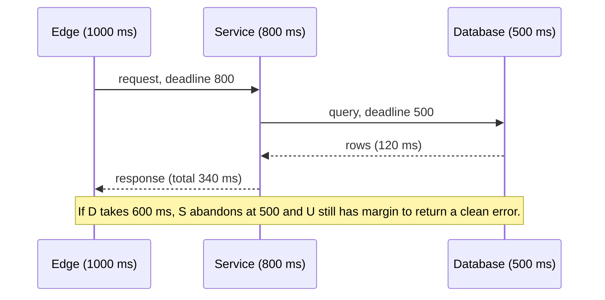

A downstream service pauses for four seconds during a deploy. Every caller, configured with a 30-second default timeout and three retries, keeps its threads pinned and then retries in lockstep. The downstream comes back to nine times its normal load, falls over properly, and the incident that should have been a blip lasts forty minutes. Nobody wrote a bug. They accepted defaults.

Timeouts and retries are the two knobs that decide whether a partial failure stays partial. Both are almost always set wrong, in the same two directions: timeouts too long, retries too eager.

## There is no such thing as "the timeout"

A single HTTP call from a typical client passes through at least five distinct waits, each with its own timer or its own absence of one.

| Timeout | Starts | Ends | Typical default |
|---|---|---|---|
| DNS | Resolver query sent | Answer received | Seconds, with retries; often outside your library's control |
| Connect | SYN sent | Handshake complete | Often tens of seconds; the OS gives up after several SYN retransmits (roughly two minutes on Linux) |
| TLS handshake | ClientHello sent | Finished received | Frequently folded into connect, or unbounded |
| Request / read | Bytes sent or last byte received | Next byte received | Frequently unbounded in older libraries |
| Idle (pooled) | Last use of a pooled connection | Connection closed | Tens of seconds to minutes |
| Total / deadline | Call begins | Call returns | Usually absent unless you add it |

The one most people mean when they say "the timeout" is the read timeout, and the one that matters is the last row. A read timeout of 5 s is a timeout *between bytes*; a server that trickles one byte every 4 s never trips it. A total deadline is the only guarantee that a call returns.

The default column is the dangerous one. Libraries choose defaults for compatibility, not for production; some have no read timeout at all, and a connect timeout in the tens of seconds is common. Assume every timeout is wrong until you have read the value from the code that sets it.

```python
import httpx

# Every phase bounded; total bounded separately by the caller.
client = httpx.Client(timeout=httpx.Timeout(connect=0.2, read=1.0, write=1.0, pool=0.1))
```

`pool=0.1` deserves a mention: it bounds how long a request waits for a connection from the pool, which is where requests silently queue when the pool is exhausted (see [Connection pooling and keep-alive](/learn/networking/networking-in-practice/connection-pooling-and-keep-alive)).

## Choose timeouts from the p99, not from feel

A timeout is a bet that anything slower than *this* is broken. Set it from the dependency's latency distribution, not from what feels safe.

The rule of thumb: connect timeouts should be a small multiple of the RTT, because a handshake that has not completed in a few RTTs has almost certainly lost its SYN. Within a data centre that is single-digit milliseconds; a 200 ms connect timeout is already generous. Request timeouts sit just above the dependency's p99 or p99.9, with a margin for its own retries.

Set too high and a slow dependency holds your threads and connections open (Little's law from [Latency, bandwidth and the math](/learn/networking/networking-in-practice/latency-bandwidth-and-math) tells you exactly how many). Set too low and you cancel work that would have succeeded, then retry it, doubling the load precisely when the dependency is struggling.

The check before you ship: plot the dependency's latency histogram and draw the timeout on it. If it cuts through the body of the distribution, you have a load amplifier, not a safety net.

## Deadlines compose down the call chain

A user request enters at the edge with a 1,000 ms budget. It calls a service which calls a database. If each hop sets its own timeout independently, the numbers do not add up:

```text
Edge timeout:     1,000 ms
Service timeout:  2,000 ms   (someone's default)
DB timeout:       5,000 ms   (someone else's default)
```

At 1,001 ms the edge gives up and returns a 504. The service is still waiting, the database is still working, and the resources for a request nobody wants stay allocated for another four seconds. Under load those orphaned requests are the majority of the work the system is doing.

The fix is **deadline propagation**: the edge computes an absolute deadline, and every hop passes the remaining budget downstream, subtracting its own expected cost.

```text
Edge:     deadline = now + 1,000 ms
Service:  receives 1,000 ms; reserves ~200 ms for its own work and response; passes 800 ms
DB call:  receives 800 ms; the client sets a 500 ms statement timeout, leaving room for one retry
```

gRPC has this built in: the client sets a deadline, it travels in the `grpc-timeout` header (`grpc-timeout: 800m`), and each server can read the remaining time from its context and refuse work that cannot finish. Over plain HTTP you carry it yourself, typically as a header with the remaining milliseconds or an absolute timestamp:

```text
X-Request-Deadline-Ms: 800
```

Every hop reads it, subtracts its own budget, forwards the rest, and rejects immediately if the remaining budget is smaller than its own p50. Rejecting fast is the point: a request that cannot possibly finish in time should fail at the cheapest possible hop.



## Retries: the amplifier

A retry converts a transient failure into a success. It also converts a struggling dependency into a dead one. Which happens depends on arithmetic.

Take three tiers, each retrying up to three times (one attempt plus two retries would be 3×; take three attempts per tier). When the bottom tier slows down and every call starts timing out:

$$\text{load at the bottom} = 3 \times 3 \times 3 = 27\times$$

The edge retries the middle three times; each of those retries the bottom three times; each of *those* attempts hits the database three times. A dependency that could not handle 1× load is now receiving 27×. That is the **retry storm**, and it is why retries must be governed, not merely counted.

```viz
{"type": "system", "scenario": "retry-backoff", "title": "Backoff spreads retries out", "caption": "Without backoff every failed request retries at the same instant; with exponential backoff and jitter, retries thin out and the dependency gets room to recover."}
```

Three rules keep retries safe.

### Retry only where a retry can help

| Failure | Retry? | Why |
|---|---|---|
| Connect timeout, connection refused | Yes | No request reached the server; the retry is free of side effects |
| DNS failure | Yes, briefly | Usually transient resolver trouble |
| 503 with `Retry-After` | Yes, honouring the header | The server is telling you when |
| 429 | Yes, honouring the header, slowly | You are the problem; retrying fast makes it worse |
| Read timeout | Only if idempotent | The server may have processed the request; a retry may duplicate it |
| 500 | Only if idempotent | Same: unknown side effects |
| 4xx other than 429 | No | The request is wrong; it will be wrong again |
| Request body already streamed | No | You cannot replay what you did not buffer |

The distinction between a connect timeout and a read timeout is the single most useful one. A connect failure guarantees the server saw nothing. A read timeout guarantees nothing.

### Retry only idempotent work, or make it idempotent

A `POST /payments` that times out on read might have charged the card. Retrying it might charge it twice. The client either does not retry, or attaches an **idempotency key** that lets the server deduplicate the second attempt. The mechanics of keys and deduplication stores are in [Idempotency and retries](/learn/system-design/building-blocks/idempotency-and-retries); the networking rule is simply that retry policy and idempotency are one decision, not two.

### Retry with a budget, not a count

A per-request count ("retry up to 3 times") gives 27× amplification in the example above. A **retry budget** bounds retries as a fraction of total traffic: if retries exceed 10% of requests over the last ten seconds, stop retrying and fail fast. Healthy operation has retry rates near zero, so the budget is never touched; during an outage it caps amplification at 1.1× instead of 27×. Envoy and Linkerd implement this natively; it is a few lines to implement in a client library.

## Exponential backoff with jitter

When a retry is allowed, it must not happen immediately, and it must not happen at the same instant as everyone else's retry.

Exponential backoff spaces attempts geometrically: base × 2^attempt, capped. Jitter randomises each sleep so that a thousand clients that failed together do not retry together. The variant that works best in practice is **full jitter**: sleep for a uniform random duration between zero and the exponential ceiling.

$$\text{sleep}_n = \text{random}\big(0,\ \min(\text{cap},\ \text{base} \times 2^n)\big)$$

With base 100 ms and cap 10 s:

| Attempt | Ceiling | Example draw |
|---|---|---|
| 0 | 100 ms | 43 ms |
| 1 | 200 ms | 171 ms |
| 2 | 400 ms | 88 ms |
| 3 | 800 ms | 612 ms |
| 4 | 1,600 ms | 1,203 ms |
| 5 | 3,200 ms | 2,047 ms |
| 6 | 6,400 ms | 5,910 ms |
| 7 | 10,000 ms (capped) | 3,388 ms |

Notice the example draws are not monotonic; that is jitter doing its job. The ceiling grows so that a dependency down for a minute receives a trickle, not a wall, and the random spread means the trickle is smooth.

```python
import random, time

def backoff_sleep(attempt, base=0.1, cap=10.0):
    ceiling = min(cap, base * (2 ** attempt))
    time.sleep(random.uniform(0, ceiling))
```

Without jitter, exponential backoff still synchronises: every client that failed at T retries at T+100, T+300, T+700 ms, producing waves that a recovering server sees as periodic spikes. AWS's analysis of this in their own systems is where "full jitter" got its name; the plain exponential curve produced a comb of load, and the jittered one produced a smooth decline.

Compare this to TCP's own retransmission, which is the same idea one layer down: an RTO that starts around the measured RTT plus variance and doubles on each retransmit. The difference is that TCP retransmits bytes that are guaranteed identical, so it never has to ask whether the retry is safe.

```viz
{"type": "network", "scenario": "tcp-retransmit", "title": "TCP retransmission is a retry with no idempotency question", "caption": "Lost segments are resent with the same sequence numbers; the receiver deduplicates by design. Application retries have no such guarantee."}
```

## Circuit breakers: the cap on retries

Backoff slows retries; a **circuit breaker** stops them. The breaker watches the failure rate to a dependency, and once it crosses a threshold (say, 50% of the last 20 calls) it opens: further calls fail immediately without touching the network. After a cooling period it lets one probe request through (half-open); success closes the circuit, failure opens it again.

```viz
{"type": "system", "scenario": "circuit-breaker", "title": "Closed, open, half-open", "caption": "An open breaker turns a slow failure (wait for timeout) into a fast one (fail immediately), which frees the caller's threads and gives the dependency quiet time."}
```

The value is not just protecting the dependency; it is protecting the caller. A dependency that times out at 1 s pins a thread for 1 s per request. With the breaker open, the same request fails in microseconds, the caller's thread pool stays healthy, and the caller can serve a degraded response (cached data, a default, a partial page) instead of stalling.

A breaker per dependency, not per service, so that one bad backend does not cut off the healthy ones. The broader family of these patterns, including bulkheads and load shedding, is covered in [Resilience patterns](/learn/system-design/building-blocks/resilience-patterns).

## Hedging versus retrying

A retry waits for failure. A **hedged request** does not: it sends the request, waits until the dependency's p95, and if nothing has come back sends a second copy to a different replica, using whichever answers first and cancelling the other.

| | Retry | Hedge |
|---|---|---|
| Trigger | Error or timeout | Elapsed time (a percentile) |
| Extra load | Only when things fail | A fixed fraction always (5% if hedging at p95) |
| Improves | Success rate | Tail latency |
| Requires | Idempotency for unsafe methods | Idempotency, always, and cancellation |

Hedging is the tool for the fan-out tail problem; retrying is the tool for transient errors. Hedging at the p50 doubles your load and is a self-inflicted retry storm, so the percentile is the whole design.

## Putting it together

A client configuration that will survive an incident looks like this in prose:

1. Every phase has a timeout: connect a few RTTs, read just above the p99, total set from the propagated deadline.
2. Retries only on connect failures, 503/429 with `Retry-After`, and on read timeouts only for idempotent requests or those carrying an idempotency key.
3. Full-jitter exponential backoff, base 100 ms, capped at whatever remains of the deadline.
4. A retry budget of around 10% of traffic across the client.
5. A circuit breaker per dependency that opens on sustained failure and serves a degraded response while open.

Each line removes one way for a partial failure to spread. The forty-minute incident at the top of the lesson would have been a four-second one.

## Senior signals

- You ask "which timeout?" and can name connect, read, idle and total separately, and you know a read timeout is between bytes, not end to end.
- You propagate **deadlines** down the call chain rather than letting each hop invent a number, and you reject work that cannot finish in its remaining budget.
- You can do the **amplification math** for nested retries (3 tiers × 3 attempts = 27×) and you bound retries with a budget, not a count.
- You retry connect failures freely and read timeouts only with idempotency, and you treat retry policy and idempotency as one decision.
- You use **full jitter** and can explain why unjittered exponential backoff still produces synchronised waves.
- You know a circuit breaker protects the caller's threads as much as the callee, and that hedging is a tail-latency tool that must be tied to a high percentile.

## Check yourself

```quiz
- q: >-
    A dependency's latency is p50 30 ms, p99 250 ms, p99.9 900 ms. Your call has a 1,000 ms total budget. The most defensible request timeout is:
  options: ["300 ms, just above the p99, leaving room to retry", "30 ms, the p50, to keep the service fast", "900 ms, the p99.9, so almost nothing is cut off", "1,000 ms, matching the caller's whole budget exactly"]
  answer: 0
  explanation: >-
    Just above the p99 cancels the genuinely stuck 1% while leaving budget for a single backoff-and-retry within the 1,000 ms deadline. 30 ms cuts through the body of the distribution and would retry half your traffic; 900 or 1,000 ms leaves no room to recover from a slow attempt.
- q: >-
    A request with a 500 ms read timeout to POST /orders times out. The order service does not support idempotency keys. What should the client do?
  options: ["Retry immediately, since timeouts are usually transient", "Send a GET first, then retry the POST if it is absent", "Retry after a jittered exponential backoff delay", "Do not retry; surface the ambiguous outcome"]
  answer: 3
  explanation: >-
    A read timeout means the server may have created the order. Without an idempotency key a retry, with or without backoff, risks a duplicate, and a GET cannot reliably tell whether a still-running create will land. Connect failures are retryable; ambiguous outcomes on non-idempotent operations are surfaced to the caller instead.
- q: >-
    Four tiers each retry up to 3 attempts. When the bottom tier degrades, what load does it see relative to normal, in the worst case?
  options: ["81×", "27×", "12×", "4×"]
  answer: 0
  explanation: >-
    Attempts multiply through the chain: 3 × 3 × 3 × 3 = 81×. A retry budget (cap retries at ~10% of traffic) turns that into about 1.1×.
- q: >-
    Why does plain exponential backoff without jitter still overload a recovering dependency?
  options: ["The backoff sleeps are too short to help at all", "It ignores the server's Retry-After header entirely", "Exponential backoff never stops retrying on its own", "Clients that failed together retry together in waves"]
  answer: 3
  explanation: >-
    Deterministic backoff preserves the alignment of the original failure; every client wakes at the same instants, producing synchronised waves at each backoff step. Full jitter spreads each retry uniformly across the interval, smoothing the load. The sleep lengths themselves are fine.
- q: >-
    Which statement about hedged requests is correct?
  options: ["At the p95 it adds ~5% load and needs idempotency", "Hedging at the p50 is the sweet spot for tail latency", "Hedging removes the need for timeouts on the call", "They cut load, since the first reply cancels the second"]
  answer: 0
  explanation: >-
    A hedge is a second copy of the request sent after a percentile elapses; at the p95 that is about 5% extra load, and it cuts the tail. At the p50 it would double load. The duplicate can reach the backend before cancellation, so the call must be idempotent, and timeouts are still needed for the case where both copies stall.
```
