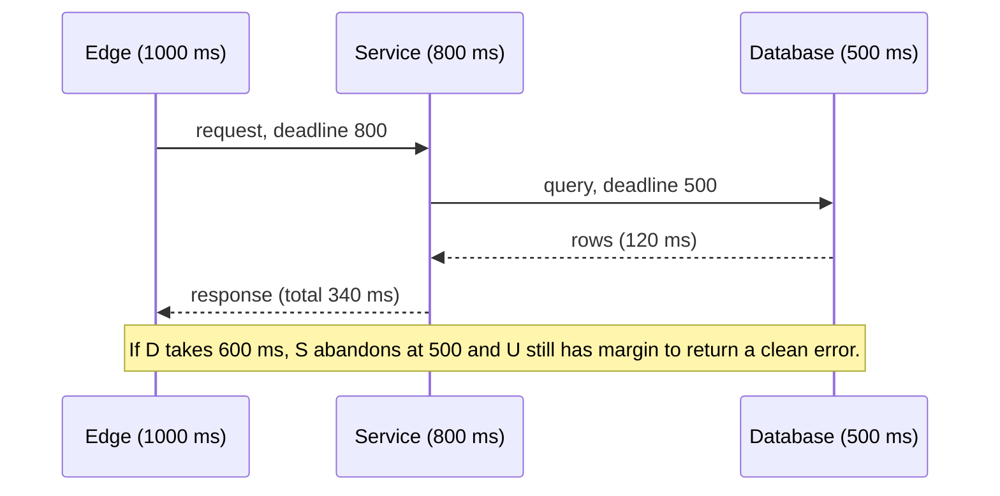

A downstream service pauses for four seconds during a deploy. Every caller, configured with a 30-second default timeout and three retries, keeps its threads pinned and then retries in lockstep. The downstream comes back to nine times its normal load, falls over properly, and the incident that should have been a blip lasts forty minutes. Nobody wrote a bug. They accepted defaults.

Timeouts and retries are the two knobs that decide whether a partial failure stays partial. Both are usually set wrong, in the same two directions: timeouts too long, retries too eager. This lesson measures both instead of asserting them: a packet capture of what Linux does with a connect that never answers, a simulation of 1,000 clients retrying against a full server under five backoff strategies, a retry budget traced token by token, and hedged requests on a heavy-tailed latency distribution.

## There is no such thing as "the timeout"

A single HTTP call from a typical client passes through at least five distinct waits, each with its own timer or its own absence of one.

| Timeout | Starts | Ends | Typical default |
|---|---|---|---|
| DNS | Resolver query sent | Answer received | Seconds, with retries; often outside your library's control |
| Connect | SYN sent | Handshake complete | Often none: the kernel gives up after its SYN retries, 130–133 s measured below |
| TLS handshake | ClientHello sent | Finished received | Frequently folded into connect, or unbounded |
| Request / read | Bytes sent or last byte received | Next byte received | Frequently unbounded in older libraries |
| Idle (pooled) | Last use of a pooled connection | Connection closed | Tens of seconds to minutes |
| Total / deadline | Call begins | Call returns | Usually absent unless you add it |

The one most people mean when they say "the timeout" is the read timeout, and the one that matters is the last row. A read timeout of 5 s is a timeout *between bytes*; a server that trickles one byte every 4 s never trips it. A total deadline is the only guarantee that a call returns.

The default column is the dangerous one. Libraries choose defaults for compatibility, not for production:

| Client | Connect | Read / total |
|---|---|---|
| Python `requests` | None unless you pass `timeout=`: the kernel's limit | None: a silent server blocks the call forever |
| Go `http.Client{}` with `DefaultTransport` | 30 s dial, 10 s TLS handshake | No total timeout (`Timeout: 0`) |
| Java `HttpURLConnection` | `0`, meaning infinite: the kernel's limit | `0`, infinite |

Assume every timeout is wrong until you have read the value from the code that sets it.

```python
import httpx

# Every phase bounded; total bounded separately by the caller.
client = httpx.Client(timeout=httpx.Timeout(connect=0.2, read=1.0, write=1.0, pool=0.1))
```

`pool=0.1` bounds how long a request waits for a connection from the pool, which is where requests silently queue when the pool is exhausted (see [Connection pooling and keep-alive](/learn/networking/networking-in-practice/connection-pooling-and-keep-alive)).

## Under the hood: a connect that never answers

A connect fails in one of two ways. If the host is up and nothing listens on the port, its kernel answers the SYN with a RST and `connect()` fails with `ECONNREFUSED` within one round trip; on loopback in the same namespace the RST followed the SYN within 10 µs and Python raised `ConnectionRefusedError` within 70 µs. If the address is black-holed (a terminated instance's old IP behind a dropping security group, a route to nowhere), nothing answers, and the kernel retransmits the SYN on its own schedule.

The schedule below was captured on Linux 6.18 (WSL2) inside an unprivileged network namespace: a dummy interface on `10.9.0.1/24`, `tcpdump` on it, and Python's `socket.connect(("10.9.0.2", 443))` with no timeout. Times are from the first SYN:

| SYN | Default settings | `tcp_syn_linear_timeouts=0` |
|---|---|---|
| 1 (original) | 0 s | 0 s |
| 2 | 1.0 | 1.0 |
| 3 | 2.0 | 3.0 |
| 4 | 3.1 | 7.2 |
| 5 | 4.1 | 15.4 |
| 6 | 5.1 | 31.5 |
| 7 | 7.1 | 64.8 |
| 8 to 11 | 11.3, 19.5, 35.6, 67.9 | none |
| `connect()` raises `ETIMEDOUT` | 133.4 s | 130.3 s |

The right-hand column is the textbook: the SYN retransmission timeout starts at 1 s and doubles, `tcp_syn_retries=6` allows six retransmissions, and the kernel gives up one doubled timeout after the last, 1 + 2 + 4 + 8 + 16 + 32 + 64 = 127 s in theory and 130.3 s measured (the timers ran a few percent long on this VM). The left-hand column is what this kernel does by default: `net.ipv4.tcp_syn_linear_timeouts=4` holds the timeout at 1 s for four retransmissions before the doubling starts from 1 s, so the first five retransmissions are a second apart, 11 SYNs go out, and the kernel still gives up after about 133 s. Either way, **a connect with no application timeout to a black-holed address blocks for over two minutes.**

Three consequences follow:

- **A connect timeout under 1 s disables SYN retransmission.** Measured: `settimeout(0.2)` sent one SYN and raised `TimeoutError` at 0.20 s. Inside a data centre that is what you want: fail fast and try another endpoint.
- **`TCP_SYNCNT` keeps retransmission but shortens the give-up.** With `TCP_SYNCNT=2`, `ETIMEDOUT` came after 7.1 s under both settings: SYNs at 0, 1 and 3 s with linear timeouts off, six SYNs a second apart with them on.
- **Little's law turns 130 s into an outage.** A service making 50 calls per second to a host that vanishes accumulates 50 × 130 = 6,500 sockets in `SYN-SENT` before the first one fails. `ss -tan state syn-sent` shows them.

## Choose timeouts from the p99, not from feel

A timeout is a bet that anything slower than *this* is broken. Set it from the dependency's latency distribution, not from what feels safe.

Connect timeouts should be a small multiple of the RTT, because a handshake that has not completed in a few RTTs has almost certainly lost its SYN. Within a data centre the RTT is around half a millisecond, so a 200 ms connect timeout is already 400 RTTs, and it is still below the kernel's first 1 s SYN retransmission. Request timeouts sit slightly above the dependency's p99 or p99.9, with a margin for its own retries.

Set too high and a slow dependency holds your threads and connections open (Little's law from [Latency, bandwidth and the math](/learn/networking/networking-in-practice/latency-bandwidth-and-math) tells you exactly how many). Set too low and you cancel work that would have succeeded, then retry it, doubling the load precisely when the dependency is struggling. A timeout at the p50 cancels half of all calls by definition; at the p99 it cancels 1%.

The check before you ship: plot the dependency's latency histogram and draw the timeout on it. If it cuts through the body of the distribution, you have a load amplifier, not a safety net.

## Deadlines compose down the call chain

A user request enters at the edge with a 1,000 ms budget. It calls a service which calls a database. If each hop sets its own timeout independently, the numbers do not add up:

```text
Edge timeout:     1,000 ms
Service timeout:  2,000 ms   (someone's default)
DB timeout:       5,000 ms   (someone else's default)
```

At 1,001 ms the edge gives up and returns a 504. The service is still waiting, the database is still working, and the resources for a request nobody wants stay allocated for another four seconds. Under load those orphaned requests are the majority of the work the system is doing.

The fix is **deadline propagation**: the edge computes an absolute deadline, and every hop passes the remaining budget downstream, subtracting its own expected cost.

```text
Edge:     deadline = now + 1,000 ms
Service:  receives 1,000 ms; reserves ~200 ms for its own work and response; passes 800 ms
DB call:  receives 800 ms; the client sets a 500 ms statement timeout, leaving room for one retry
```

Over plain HTTP you carry it yourself, as a header with the remaining milliseconds (`X-Request-Deadline-Ms: 800`). Every hop reads it, subtracts its own budget, forwards the rest, and rejects immediately if the remaining budget is smaller than its own p50. Rejecting fast is the point: a request that cannot finish in time should fail at the cheapest possible hop.



## Under the hood: grpc-timeout and cancellation

gRPC builds deadline propagation into the protocol ([gRPC and protobuf](/learn/networking/application-protocols/grpc-and-protobuf) covers the rest of the wire format). The client's deadline travels as an HTTP/2 header, `grpc-timeout`, whose value is a positive integer of at most eight ASCII digits followed by a unit: `H`, `M`, `S`, `m` (milliseconds), `u` (microseconds) or `n` (nanoseconds). grpc-go picks the finest unit whose value fits in eight digits and rounds up, so an 800 ms budget goes on the wire as `800000u`, not `800m`.

The header carries a **duration, not a timestamp**. The receiver converts it to an absolute deadline on its own monotonic clock the moment the headers arrive, so clock skew between hosts cannot corrupt it; the cost is that the network transit time of the request is not subtracted. An `X-Deadline: <unix-ms>` header has the opposite property, and a host whose clock is 2 s fast rejects every request as already expired.

```python
import math, time

UNITS = [("n", 1e-9), ("u", 1e-6), ("m", 1e-3), ("S", 1.0), ("M", 60.0), ("H", 3600.0)]
MAX_VALUE = 99_999_999                         # the spec allows at most 8 ASCII digits

def encode_grpc_timeout(seconds):
    """Finest unit whose value fits in 8 digits, rounded up (what grpc-go does)."""
    if seconds <= 0:
        return "0n"
    for unit, size in UNITS:
        value = math.ceil(round(seconds / size, 6))     # round first: 0.8 / 1e-6 is 800000.0000000001
        if value <= MAX_VALUE:
            return f"{value}{unit}"
    raise ValueError("timeout too large")

def decode_grpc_timeout(header):
    return int(header[:-1]) * dict(UNITS)[header[-1]]

class Deadline:
    def __init__(self, at):
        self.at = at                           # absolute, on this host's monotonic clock
    @classmethod
    def from_header(cls, header):              # relative on the wire, absolute locally
        return cls(time.monotonic() + decode_grpc_timeout(header))
    def child(self, reserve):                  # budget left for a downstream call
        return self.at - time.monotonic() - reserve

def handle(incoming_header):
    deadline = Deadline.from_header(incoming_header)
    time.sleep(0.12)                           # 120 ms of local work
    budget = deadline.child(reserve=0.05)      # keep 50 ms to build our own reply
    if budget <= 0:
        return "DEADLINE_EXCEEDED, no downstream call made"
    return f"downstream grpc-timeout: {encode_grpc_timeout(budget)}"

print(encode_grpc_timeout(0.8))                # 800000u
print(handle("800m"))                          # downstream grpc-timeout: 629910u (about 630 ms)
print(handle("150m"))                          # DEADLINE_EXCEEDED, no downstream call made
```

**Cancellation** is the other half. When a client's deadline passes or it gives up, it sends an HTTP/2 `RST_STREAM` with error code `CANCEL` (0x8) for that stream; the server's context for the call is cancelled, and in Go `ctx.Done()` closes. If the handler passed that `ctx` to its own outbound calls and database queries, they are cancelled too, and one expired deadline tears down the whole tree of work. The classic bug is a handler that starts its outbound call with `context.Background()`: the deadline and the cancellation stop at that line, and every hop below it does orphaned work.

## Retries: the amplifier

A retry converts a transient failure into a success. It also converts a struggling dependency into a dead one. Which happens depends on arithmetic.

With up to $k$ attempts and each attempt failing independently with probability $p$, the expected number of attempts per call is

$$1 + p + p^2 + \dots + p^{k-1} = \frac{1 - p^k}{1 - p}$$

| Failure rate $p$ | Attempts per call ($k = 3$) | When the bottom of three such tiers is hard down |
|---|---|---|
| 1% | 1.01 | |
| 10% | 1.11 | |
| 50% | 1.75 | |
| 90% | 2.71 | |
| 100% | 3.00 | $3 \times 3 \times 3 = 27\times$ |

Healthy traffic barely notices retries. Nesting is what hurts: when the bottom tier is down, each of the edge's three attempts reaches the middle tier, each of those makes three attempts at the bottom, and a dependency that could not handle 1× load now receives 27×. The cube assumes every attempt fails, which is exactly what an overloaded dependency produces, because its failures are correlated in time rather than independent. That is the **retry storm**, and it is why retries must be governed, not merely counted.

```viz
{"type": "system", "scenario": "retry-backoff", "title": "Backoff spreads retries out", "caption": "Without backoff every failed request retries at the same instant; with exponential backoff and jitter, retries thin out and the dependency gets room to recover."}
```

### Retry only where a retry can help

| Failure | Retry? | Why |
|---|---|---|
| Connect timeout, connection refused | Yes | No request reached the server; the retry is free of side effects |
| DNS failure | Yes, briefly | Usually transient resolver trouble |
| 503 with `Retry-After` | Yes, honouring the header | The server is telling you when |
| 429 | Yes, honouring the header, slowly | You are the problem; retrying fast makes it worse |
| Read timeout | Only if idempotent | The server may have processed the request; a retry may duplicate it |
| 500 | Only if idempotent | Same: unknown side effects |
| 4xx other than 429 | No | The request is wrong; it will be wrong again |
| Request body already streamed | No | You cannot replay what you did not buffer |

The distinction between a connect timeout and a read timeout is the single most useful one. A connect failure guarantees the server saw nothing. A read timeout guarantees nothing.

### Retry only idempotent work, or make it idempotent

A `POST /payments` that times out on read might have charged the card. Retrying it might charge it twice. The client either does not retry, or attaches an **idempotency key** that lets the server deduplicate the second attempt. The mechanics of keys and deduplication stores are in [Idempotency and retries](/learn/system-design/building-blocks/idempotency-and-retries); the networking rule is that retry policy and idempotency are one decision, not two.

## Retry budgets, traced

A per-request count ("up to 3 attempts") gives 27× in the example above. A **retry budget** bounds retries as a fraction of traffic, so a healthy system (retry rate near zero) never touches it and an outage cannot multiply load. gRPC's version is a token bucket per server name, configured in the service config:

```json
{
  "methodConfig": [{
    "name": [{"service": "payments.Ledger"}],
    "retryPolicy": {
      "maxAttempts": 3,
      "initialBackoff": "0.1s",
      "maxBackoff": "1s",
      "backoffMultiplier": 2,
      "retryableStatusCodes": ["UNAVAILABLE"]
    }
  }],
  "retryThrottling": {"maxTokens": 10, "tokenRatio": 0.1}
}
```

The rules from the gRPC retry design (gRFC A6): `token_count` starts at `maxTokens` and stays between 0 and `maxTokens`; every failed attempt subtracts 1, every success adds `tokenRatio`; retries and hedges are sent only while `token_count > maxTokens / 2`. The policy's own backoff is full jitter: retry $n$ waits a random time in $[0, \min(\text{initialBackoff} \times \text{multiplier}^{n-1}, \text{maxBackoff})]$. Trace a hard-down server:

| Step | Attempt | Result | Tokens after | Retry allowed (tokens > 5)? |
|---|---|---|---|---|
| 1 | RPC 1, attempt 1 | `UNAVAILABLE` | 9 | Yes |
| 2 | RPC 1, attempt 2 | `UNAVAILABLE` | 8 | Yes |
| 3 | RPC 1, attempt 3 | `UNAVAILABLE` | 7 | `maxAttempts` reached; RPC 1 fails |
| 4 | RPC 2, attempt 1 | `UNAVAILABLE` | 6 | Yes |
| 5 | RPC 2, attempt 2 | `UNAVAILABLE` | 5 | No: 5 is not above 5; RPC 2 fails |
| 6 | RPC 3, attempt 1 | `UNAVAILABLE` | 4 | No |
| 7+ | Every later RPC | `UNAVAILABLE` | Falls to 0 and stays | No: one attempt per RPC |

After three retries, amplification is exactly 1.0×. When the server heals, tokens climb by 0.1 per success, so retries resume after 51 successes (5.1 > 5). In a partial outage where a fraction $f$ of attempts fail, tokens drift by $0.1(1 - f) - f$ per attempt, which is negative whenever $f > 1/11 \approx 9\%$. With `tokenRatio: 0.1`, retries switch themselves off once more than about 9% of attempts fail: the regime where they stop helping and start hurting.

| Implementation | Budget shape | Defaults |
|---|---|---|
| gRPC `retryThrottling` | Token bucket per server name, as traced | None; you choose `maxTokens` and `tokenRatio` |
| Envoy `retry_budget` | Concurrent retries ≤ a percentage of active requests | 20% of active requests, floor of 3 concurrent retries |
| Finagle `RetryBudget` | Each request deposits, each retry withdraws, over a sliding window | 20% of requests, 10 retries/s floor, 10 s window |
| Linkerd `retryBudget` | Same shape as Finagle | `retryRatio: 0.2`, `minRetriesPerSecond: 10`, `ttl: 10s` |

The floor matters for low-traffic clients: at 2 requests per second, 20% is 0.4 retries per second, which would make retries useless, so a fixed minimum keeps them working.

```viz
{"type": "system", "scenario": "token-bucket", "title": "A retry budget is a token bucket", "caption": "Successes refill the bucket slowly; each failure drains it. Retries are allowed only while the bucket is above its threshold, so a burst of failures shuts retries off within a handful of attempts and they return only after the dependency has served enough successes."}
```

## Exponential backoff with jitter

When a retry is allowed, it must not happen immediately, and it must not happen at the same instant as everyone else's retry. Exponential backoff spaces attempts geometrically; jitter randomises each sleep so that a thousand clients that failed together do not retry together. With $c_n = \min(\text{cap}, \text{base} \times 2^n)$:

| Variant | Sleep before retry $n$ | Property |
|---|---|---|
| Exponential, no jitter | $c_n$ | Deterministic: clients that failed together stay together |
| Full jitter | $U(0, c_n)$ | Widest spread; a sleep can be close to 0 ms |
| Equal jitter | $c_n/2 + U(0, c_n/2)$ | Guarantees at least half the ceiling |
| Decorrelated jitter | $\min(\text{cap}, U(\text{base}, 3 \times \text{previous sleep}))$ | Depends on the previous sleep, not on $n$ |

The names come from Marc Brooker's 2015 AWS Architecture Blog post, "Exponential Backoff And Jitter". Full jitter with base 100 ms and cap 10 s:

| Attempt | Ceiling | Example draw |
|---|---|---|
| 0 | 100 ms | 43 ms |
| 1 | 200 ms | 171 ms |
| 2 | 400 ms | 88 ms |
| 3 | 800 ms | 612 ms |
| 4 | 1,600 ms | 1,203 ms |
| 5 | 3,200 ms | 2,047 ms |
| 6 | 6,400 ms | 5,910 ms |
| 7 | 10,000 ms (capped) | 3,388 ms |

The draws are not monotonic; that is jitter doing its job. The ceiling grows so that a dependency down for a minute receives a trickle, not a wall.

```python
import random, time

def backoff_sleep(attempt, base=0.1, cap=10.0):
    ceiling = min(cap, base * (2 ** attempt))
    time.sleep(random.uniform(0, ceiling))
```

TCP's retransmission is the same idea one layer down: a timeout that starts near the measured RTT plus variance and doubles on each retransmit, as the SYN capture above showed. The difference is that TCP resends bytes with the same sequence numbers and the receiver deduplicates them, so it never has to ask whether the retry is safe.

```viz
{"type": "network", "scenario": "tcp-retransmit", "title": "TCP retransmission is a retry with no idempotency question", "caption": "Lost segments are resent with the same sequence numbers; the receiver deduplicates by design. Application retries have no such guarantee."}
```

## Measured: 1,000 clients against a full server

To compare the variants, the simulation below models a herd. 1,000 clients all send at t = 0. The server admits the first 100 arrivals in each 100 ms bucket (1,000 requests per second) and rejects the rest with a fast 503 that the client hears 10 ms later; the client then sleeps per its strategy and retries. "No backoff" retries as soon as the rejection arrives. Base 100 ms, cap 10 s, seed 42. Rejections cost the server nothing, which flatters the no-backoff row.

```python
import heapq, random

N, CAP, BUCKET_MS, RTT_MS = 1000, 100, 100, 10     # 1,000 clients; 100 admissions per 100 ms
BASE, CEIL = 100.0, 10_000.0

def sleeps(strategy, rng):
    """Yield the sleep (ms) before retry 0, 1, 2, ... for one client."""
    prev, n = BASE, 0
    while True:
        c = min(CEIL, BASE * 2 ** n)
        if strategy == "none":           s = 0.0
        elif strategy == "exponential":  s = c
        elif strategy == "full":         s = rng.uniform(0, c)
        elif strategy == "equal":        s = c / 2 + rng.uniform(0, c / 2)
        elif strategy == "decorrelated": s = prev = min(CEIL, rng.uniform(BASE, prev * 3))
        yield s
        n += 1

def run(strategy, seed=42):
    rng = random.Random(seed)
    clients = [sleeps(strategy, rng) for _ in range(N)]
    events = [(0.0, i) for i in range(N)]          # everyone arrives at t = 0
    heapq.heapify(events)
    admitted, arrivals, finished, attempts = {}, {}, [], 0
    while events:
        t, i = heapq.heappop(events)                # process arrivals in time order
        attempts += 1
        b = int(t // BUCKET_MS)
        arrivals[b] = arrivals.get(b, 0) + 1
        if admitted.get(b, 0) < CAP:                # capacity left in this 100 ms bucket
            admitted[b] = admitted.get(b, 0) + 1
            finished.append(t)
        else:                                       # fast 503; the client hears it RTT later
            heapq.heappush(events, (t + RTT_MS + next(clients[i]), i))
    return max(arrivals.values()), attempts, sorted(finished)[N // 2], max(finished)

for s in ("none", "exponential", "full", "equal", "decorrelated"):
    peak, attempts, p50, last = run(s)
    print(f"{s:13} peak/bucket={peak:5} attempts={attempts:6} p50 done={p50/1000:5.2f}s all done={last/1000:5.2f}s")
```

| Strategy | Peak arrivals per 100 ms | Peak after the first 100 ms | Total attempts | Half done | All done |
|---|---|---|---|---|---|
| No backoff | 9,100 | 8,100 | 46,000 | 0.50 s | 0.90 s |
| Exponential, no jitter | 1,000 | 900 | 5,500 | 3.15 s | 32.79 s |
| Full jitter | 1,951 | 559 | 3,971 | 0.50 s | 3.70 s |
| Equal jitter | 1,716 | 698 | 3,760 | 0.53 s | 2.78 s |
| Decorrelated jitter | 1,000 | 477 | 2,722 | 0.50 s | 2.02 s |

Arrivals in the first eight buckets show the shapes:

| Strategy | 0–100 ms | 100–200 | 200–300 | 300–400 | 400–500 | 500–600 | 600–700 | 700–800 |
|---|---|---|---|---|---|---|---|---|
| No backoff | 9,100 | 8,100 | 7,100 | 6,100 | 5,100 | 4,100 | 3,100 | 2,100 |
| Exponential | 1,000 | 900 | 0 | 800 | 0 | 0 | 0 | 700 |
| Full jitter | 1,951 | 559 | 445 | 235 | 215 | 166 | 82 | 61 |

What the numbers say:

- **No backoff** finishes at 0.90 s, the floor for 1,000 clients at 100 per bucket, by sending 46 attempts per success. On a real server each rejection costs CPU, and 9,100 arrivals per 100 ms against a capacity of 100 is how a **metastable failure** starts: the retry load alone keeps the server saturated after the original trigger is gone (Bronson et al., "Metastable Failures in Distributed Systems", HotOS 2021).
- **Exponential without jitter** cut attempts to 5,500 but took 32.8 s: the herd stays a herd, arriving in waves of 900, 800, 700 at 110, 320, 730 ms and so on, with idle buckets in between. 318 of the 328 buckets before the last success had unused capacity.
- **Every jittered variant** needed 2,722–3,971 attempts and finished in 2–3.7 s. Full jitter has the highest first-bucket peak because its first retry window (0–100 ms) overlaps the initial burst; after that it is the smoothest.
- **The ranking among jittered variants depends on parameters.** Decorrelated jitter won every column here. With base 50 ms, cap 5 s and 200 admissions per bucket, equal jitter finished first (0.76 s against 0.87 s) while decorrelated still made the fewest attempts (2,615). Across seeds 1–20 the main run varied little: full jitter 3,936–3,994 attempts, decorrelated 2,705–2,764. The gap between jitter and no jitter did not move.

## Circuit breakers: the cap on retries

Backoff slows retries; a **circuit breaker** stops them. The breaker watches the failure rate to a dependency, and once it crosses a threshold (say, 50% of the last 20 calls) it opens: further calls fail immediately without touching the network. After a cooling period it lets one probe request through (half-open); success closes the circuit, failure opens it again.

```viz
{"type": "system", "scenario": "circuit-breaker", "title": "Closed, open, half-open", "caption": "An open breaker turns a slow failure (wait for timeout) into a fast one (fail immediately), which frees the caller's threads and gives the dependency quiet time."}
```

The breaker protects the caller as much as the dependency. A dependency that times out at 1 s pins a thread for 1 s per request. With the breaker open, the same request fails in microseconds, the caller's thread pool stays healthy, and the caller can serve a degraded response (cached data, a default, a partial page) instead of stalling.

Use a breaker per dependency, not per service, so that one bad backend does not cut off the healthy ones. Netflix's Hystrix popularised this pattern for JVM services and has been in maintenance mode since 2018; Netflix's own later work moved toward adaptive concurrency limits (the open-source `concurrency-limits` library), which lower the allowed in-flight requests as measured latency rises instead of waiting for a failure threshold. The history is in [Netflix microservices and resilience](/learn/system-design/case-studies/netflix-microservices-and-resilience), and bulkheads and load shedding are in [Resilience patterns](/learn/system-design/building-blocks/resilience-patterns).

## Hedging versus retrying

A retry waits for failure. A **hedged request** does not: it sends the request, waits until the dependency's p95, and if nothing has come back sends a second copy to a different replica, using whichever answers first and cancelling the other.

| | Retry | Hedge |
|---|---|---|
| Trigger | Error or timeout | Elapsed time (a percentile) |
| Extra load | Only when things fail | A fixed fraction always (5% if hedging at p95) |
| Improves | Success rate | Tail latency |
| Requires | Idempotency for unsafe methods | Idempotency, always, and cancellation |

Here it is measured on a synthetic heavy-tailed distribution: each call takes a lognormal time (median 10 ms, σ = 0.5), and 2% of calls also hit a stall that adds an exponential delay with a 200 ms mean (a GC pause, a slow disk). 200,000 calls, seed 7, replicas independent, and the extra queueing that hedges cause is not modelled:

| Policy | p50 | p95 | p99 | p99.9 | Extra requests |
|---|---|---|---|---|---|
| No hedging | 10.1 ms | 25.1 ms | 145.0 ms | 608.9 ms | 0% |
| Hedge at p50 (10 ms) | 10.1 | 20.1 | 25.6 | 36.4 | 50% |
| Hedge at p90 (20 ms) | 10.1 | 24.6 | 32.1 | 44.9 | 10% |
| Hedge at p95 (25 ms) | 10.1 | 25.1 | 36.0 | 49.3 | 5% |
| Hedge at p99 (145 ms) | 10.1 | 25.1 | 145.0 | 164.9 | 1% |

Hedging at the p95 cut the p99 fourfold and the p99.9 twelvefold for 5% more requests. Hedging at the p50 took another 10 ms off the p99 for ten times the extra load. Dean and Barroso's "The Tail at Scale" (CACM, 2013) reports the same shape on a real system: a Google BigTable benchmark where hedging after 10 ms cut the 99.9th percentile for reading 1,000 keys from 1,800 ms to 74 ms while sending 2% more requests. The independence assumption is the catch: if the slowness is shared (both replicas overloaded, one slow database under both), the hedge waits as long and adds load to an overloaded system. gRPC's `hedgingPolicy` draws on the same `retryThrottling` tokens, so hedges stop when failures pile up.

## Production failure modes

| Failure | Symptom | Diagnosis | Fix |
|---|---|---|---|
| Retry storm | Downstream request rate jumps to many times user traffic during a partial outage; its success rate falls as load rises | Compare attempts received downstream with calls made upstream; read attempt-count headers (`x-envoy-attempt-count`, gRPC's `grpc-previous-rpc-attempts`) | Retry at one layer only; add a budget; fail fast when the budget is spent |
| Orphaned work | Database CPU stays high after the edge has already returned 504s; slow-query logs full of requests nobody is waiting for | Compare query end times with the caller's deadline; count server-side cancellations (often zero) | Propagate the deadline; pass the request context to every outbound call; set statement timeouts from the remaining budget |
| Connect hang to a vanished host | Threads or event-loop slots stuck for about two minutes after an instance is terminated; `ss -tan state syn-sent` climbs | `tcpdump` shows repeated SYNs with no reply at 1, 2, 3... s | Explicit connect timeout (under 1 s inside a data centre) or `TCP_SYNCNT`; try another endpoint |
| Synchronised retry waves | Load spikes at fixed offsets after an incident (1 s, 3 s, 7 s) | Arrival histogram shows a comb, as in the exponential row above | Add jitter; also jitter scheduled jobs and cache TTLs |
| Timeout inside the latency body | Timeouts and retries rise with load while the dependency's own latency is unchanged | Draw the timeout on the dependency's histogram; retry rate tracks traffic | Move the timeout above the p99; bound retries with a budget |
| Metastable overload | The trigger is fixed but the system stays down until clients are stopped or restarted | Goodput near zero while offered load is far above capacity, mostly retries | Budgets and breakers in clients; server-side load shedding that rejects cheaply; restart clients in waves |

## Choosing a policy

| Mechanism | Protects against | Extra load in an outage | Latency cost | Needs idempotency |
|---|---|---|---|---|
| Fixed retry count | Transient single-attempt errors | Up to $k^d$ for $d$ nested tiers | Backoff sleeps | For unsafe methods |
| Retry budget | Retry storms | Bounded (about 1.1–1.2×) | None when healthy | Same as retries |
| Circuit breaker | Slow failures pinning callers | Near zero while open | Fast failure; probes when half-open | No |
| Deadline propagation | Orphaned work | Reduces it | None | No |
| Hedging at p95 | Tail latency | About 5%, always | Cuts p99 when slowness is per-replica | Yes, always |

## Putting it together

A client configuration that will survive an incident:

1. Every phase has a timeout: connect a few RTTs (under 1 s in a data centre), read slightly above the p99, total set from the propagated deadline.
2. Retries only on connect failures, 503/429 with `Retry-After`, and on read timeouts only for idempotent requests or those carrying an idempotency key.
3. Jittered exponential backoff, base about 100 ms, capped at whatever remains of the deadline.
4. A retry budget of 10–20% of traffic per client, in one layer.
5. A circuit breaker or adaptive concurrency limit per dependency, serving a degraded response while open.

Each line removes one way for a partial failure to spread. The forty-minute incident at the top of the lesson would have been a four-second one.

## Interviewer follow-ups

**"A dependency's host is terminated and your calls to its old IP hang. Why, and for how long?"** Model answer: the address is black-holed, so SYNs get no reply and no RST; the kernel retransmits on its own schedule and gives up after about 130 s with default `tcp_syn_retries=6`. Set an explicit connect timeout or `TCP_SYNCNT`, and remove the endpoint from discovery. Common wrong answer: "the connection is refused, so it fails immediately", which is only true when a live host answers with a RST.

**"Why is `grpc-timeout` a duration and not a timestamp?"** Model answer: a duration is converted to an absolute deadline on the receiver's own clock, so clock skew between hosts cannot make a request look expired or immortal; the price is that request transit time is not deducted. Common wrong answer: "to save bytes on the wire."

**"Full jitter can sleep for 0 ms. Isn't that the same as not backing off?"** Model answer: individual sleeps can be short, but the expected sleep is half the ceiling and the ceiling doubles, so the population spreads out; in the simulation full jitter needed 3,971 attempts against 46,000 with no backoff. If a floor matters, equal jitter guarantees half the ceiling. Common wrong answer: "yes, so use plain exponential", which measured 32.8 s to drain the herd.

**"Retries are configured at three tiers with three attempts each. What do you change?"** Model answer: retry in one layer, usually the one closest to the failing dependency (or the mesh), give that layer a budget, make the others fail fast, and propagate a deadline so an outer layer never retries work an inner layer is still doing. Common wrong answer: "lower each tier to two attempts", which still gives 8× when the bottom is down.

**"How do you pick a hedging threshold, and how do you keep hedging from worsening an overload?"** Model answer: hedge at a high percentile (p95 or later), so extra load is bounded at a few percent; hedge only idempotent reads; cancel the loser; and throttle hedges with the same budget as retries so they stop when errors rise. Common wrong answer: "hedge at the median for the biggest win."

## What mid-level engineers get wrong

- **Setting only a read timeout.** A trickling server never trips it, and a black-holed connect blocks for 130 s before the read timer even starts.
- **Retrying at every layer.** Each layer's policy looks reasonable in its own code review; together they multiply to 27× or more.
- **Retrying a read timeout on a non-idempotent call.** The first attempt may have succeeded, and the customer is charged twice.
- **Backoff without jitter.** Load arrives in synchronised waves, and recovery takes several times longer than with any jittered variant.
- **Dropping the request context.** Starting outbound calls from a fresh context stops both deadline propagation and cancellation at that line.
- **Treating hedging as free.** Without cancellation and a budget, hedges double load exactly when a shared dependency slows down.

## Exercise: a deadline-aware backoff schedule

```exercise
id: full-jitter-schedule
title: Full-jitter backoff that respects a deadline
prompt: |
  Compute the sleeps a client performs between retries using full-jitter
  exponential backoff, with the randomness injected so the result is
  deterministic.

  - `base_ms`, `cap_ms` and `deadline_ms` are non-negative integers.
  - `draws` is a list of integers from 0 to 1000; `draws[i]` is the uniform
    draw for retry `i`, in thousandths.
  - The ceiling for retry `i` is `min(cap_ms, base_ms * 2**i)`, and its sleep
    is `ceiling * draws[i] // 1000` (integer division, rounding down).
  - Keep a running total of sleeps. If adding the next sleep would make the
    total exceed `deadline_ms`, stop: return what you have and ignore the
    remaining draws.
  - There is one retry per draw, so an empty `draws` means no retries.

  Return the list of sleeps in milliseconds.
languages: [python, javascript]
entry: backoff_schedule
starter:
  python: |
    def backoff_schedule(base_ms, cap_ms, deadline_ms, draws):
        sleeps = []
        # your code here
        return sleeps
  javascript: |
    function backoff_schedule(base_ms, cap_ms, deadline_ms, draws) {
      const sleeps = [];
      // your code here
      return sleeps;
    }
tests:
  - args: [100, 10000, 100000, [430, 855, 220, 765]]
    expected: [43, 171, 88, 612]
    label: the draws from the lesson's table
  - args: [100, 1000, 100000, [1000, 1000, 1000, 1000, 1000, 1000]]
    expected: [100, 200, 400, 800, 1000, 1000]
    label: the cap holds the ceiling at 1000
  - args: [100, 10000, 1000, [1000, 1000, 1000, 1000, 1000]]
    expected: [100, 200, 400]
    label: stops before the deadline would be exceeded
  - args: [100, 10000, 5000, []]
    expected: []
    label: no draws, no retries
  - args: [100, 10000, 0, [0, 500]]
    expected: [0]
    label: a zero sleep fits a zero budget
  - args: [100, 10000, 500, [1000, 1000, 1000, 0]]
    expected: [100, 200]
    hidden: true
    label: stops at the first overflow even if a later sleep would fit
  - args: [3, 100, 50, [999, 999, 999]]
    expected: [2, 5, 11]
    hidden: true
    label: rounds down
  - args: [50, 3000, 20000, [500, 500, 500, 500, 500, 500, 500, 500, 500, 500, 500, 500]]
    expected: [25, 50, 100, 200, 400, 800, 1500, 1500, 1500, 1500, 1500, 1500]
    hidden: true
hints:
  - "Compute the ceiling before applying the draw: `min(cap_ms, base_ms * 2**i)`."
  - "Check `total + sleep > deadline_ms` before appending, and break rather than continue."
  - "Multiply before dividing (`ceiling * draw // 1000`) so small values do not round to zero early."
```

## Senior signals

- You ask "which timeout?" and can name connect, read, idle and total separately; you know a read timeout is between bytes and that an unbounded connect to a black-holed host lasts about 130 s on Linux.
- You propagate **deadlines** down the call chain, know that `grpc-timeout` is a relative duration immune to clock skew, and pass the request context to every outbound call so cancellation cascades.
- You can do the **amplification math** ($(1 - p^k)/(1 - p)$ per tier, $k^d$ when the bottom is down) and you bound retries with a **budget** you can trace token by token.
- You retry connect failures freely and read timeouts only with idempotency, and you treat retry policy and idempotency as one decision.
- You use **jittered** backoff and can quote what happens without it: synchronised waves, idle capacity, and a herd that drains many times more slowly.
- You treat hedging as a tail-latency tool tied to a high percentile, budgeted and cancelled, and you know it fails when slowness is shared.

## Check yourself

```quiz
- q: >-
    A dependency's latency is p50 30 ms, p99 250 ms, p99.9 900 ms. Your call has a 1,000 ms total budget. Which request timeout is the most defensible?
  options: ["30 ms, the p50, to keep the service fast", "1,000 ms, matching the caller's whole budget exactly", "900 ms, the p99.9, so almost nothing is cut off", "300 ms, slightly above the p99, leaving room to retry"]
  answer: 3
  explanation: >-
    Slightly above the p99 cancels the genuinely stuck 1% while leaving budget for a single backoff-and-retry within the 1,000 ms deadline. 30 ms cuts through the body of the distribution and would cancel and retry half your traffic; 900 or 1,000 ms leaves no room to recover from a slow attempt.
- q: >-
    A request with a 500 ms read timeout to POST /orders times out. The order service does not support idempotency keys. What should the client do?
  options: ["Do not retry; surface the ambiguous outcome", "Send a GET first, then retry the POST if it is absent", "Retry after a jittered exponential backoff delay", "Retry immediately, since timeouts are usually transient"]
  answer: 0
  explanation: >-
    A read timeout means the server may have created the order. Without an idempotency key a retry, with or without backoff, risks a duplicate, and a GET cannot reliably tell whether a still-running create will land. Connect failures are retryable; ambiguous outcomes on non-idempotent operations are surfaced to the caller instead.
- q: >-
    A service calls a dependency whose instance was terminated; packets to the old IP are silently dropped. The client sets no connect timeout and Linux uses its defaults. What happens to each call?
  options: ["It blocks for about 130 s while the kernel retransmits SYNs", "It fails after about 3 s, once two SYN retransmits go unanswered", "It fails at once because the kernel receives a reset", "It blocks until the read timeout fires, since connect has no limit"]
  answer: 0
  explanation: >-
    A black-holed address sends nothing back, neither SYN-ACK nor RST, so the kernel keeps retransmitting the SYN with growing timeouts and gives up after tcp_syn_retries: about 130 s measured in the lesson. A reset only comes from a live host with a closed port. The read timeout never starts because the connection never opens.
- q: >-
    A gRPC channel uses retryThrottling with maxTokens 10 and tokenRatio 0.1. Above roughly what failure rate do retries stay switched off?
  options: ["About 9% of attempts", "About 50% of attempts", "About 1% of attempts", "About 90% of attempts"]
  answer: 0
  explanation: >-
    Each failure costs 1 token and each success earns 0.1, so tokens drift by 0.1(1 - f) - f per attempt, which is negative once f exceeds 1/11, about 9%. Tokens then sink below maxTokens/2 and retries stop. The 50% figure confuses the token threshold with a failure rate.
- q: >-
    In the lesson's simulation of 1,000 clients, plain exponential backoff without jitter took 32.8 s to drain the herd while jittered variants took 2 to 3.7 s. Why?
  options: ["Every client reached the 10 s cap on its very first retry", "Retries arrived in synchronised waves separated by idle buckets", "The server penalised deterministic retries with longer queues", "Its sleeps were shorter, so more retries were rejected outright"]
  answer: 1
  explanation: >-
    Without jitter every rejected client computes the same sleep, so the herd arrives together at 110, 320, 730 ms and so on; each wave gets one bucket's worth of admissions and the buckets in between sit idle. Jitter spreads the same clients across those idle buckets. The sleeps were the same length, not shorter, and the cap is reached only after several doublings.
- q: >-
    Hedging at the p95 cut the simulated p99 from 145 ms to 36 ms. What does it cost, and what must be true for it to work?
  options: ["About 5% more requests; slowness must be per-replica", "About 50% more requests; the call must be read-only", "About 5% more requests; replicas must share one queue", "No extra requests, since the loser is always cancelled"]
  answer: 0
  explanation: >-
    Only requests still pending at the p95 send a second copy, so the extra load is about 5%. The gain relies on the second replica being unlikely to be slow at the same time; when slowness is shared, the hedge waits as long and adds load. Cancellation reduces wasted work but the hedge has already been sent, so the extra requests are not free.
```
