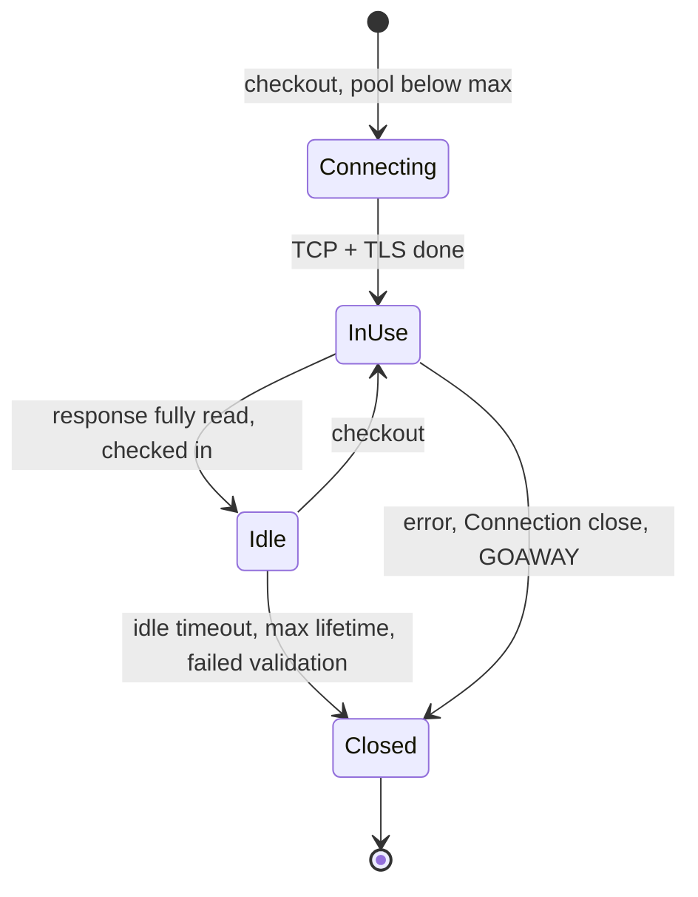

An order service calls a payment service 25 ms away, a 50 ms round trip. Opened fresh, each call pays a TCP handshake (one round trip) and a TLS 1.3 handshake (another) before the request's own round trip, plus the CPU for the key exchange and certificate verification on both ends. Over a warm connection the same call costs one round trip. That difference is why every serious HTTP client, database driver and proxy keeps a **pool** of open connections, and why the [latency lesson](/learn/networking/networking-in-practice/latency-bandwidth-and-math) counts keep-alive as removing most of a cold request's round trips.

A pool is a cache, and it has every problem a cache has. It must be sized. Its entries go stale (the server closed the connection, a NAT forgot it). It needs invalidation (DNS changed, and a pooled connection keeps talking to the old address). And unlike most caches, when it runs dry callers *wait*, which makes it a queue no dashboard on the server side can see. This lesson is about those problems, with the numbers measured where they could be.

## What a pool is

A pool keeps, per origin (scheme, host and port), a set of open connections. A request **checks out** an idle connection or opens a new one if the pool is under its cap, uses it, and **checks it in** when the response is complete. If the pool is at its cap and nothing is idle, the request waits.



| Setting | What it bounds | Getting it wrong |
|---|---|---|
| Max connections (per host, total) | Concurrency to the dependency | Too low: requests queue in your process. Too high: no protection when the dependency slows |
| Min idle / warm-up | Cold-start latency | Zero: the first requests after a deploy pay every handshake at once |
| Idle timeout | How long an unused connection is kept | Longer than the server's or a middlebox's: you reuse a connection the other side has closed |
| Max lifetime | How long any connection may live | Unbounded: DNS changes and new backends are never picked up |
| Acquire (checkout) timeout | How long a request waits for a connection | Unbounded: pool exhaustion becomes unbounded latency instead of an error |
| Validation | Whether a connection is checked before use | Off: stale connections fail the first request; a query per checkout: an extra round trip each time |

With HTTP/1.1 a connection carries one request at a time, so the number of connections *is* your concurrency to that host. With HTTP/2 one connection multiplexes many streams (RFC 9113 recommends servers allow at least 100 concurrent streams), so a single connection per origin is often enough and the pool's job becomes keeping that one connection healthy.

## Measured: what reuse saves

A Python client and server inside a network namespace on this machine (Linux 6.18 under WSL2), `netem` adding 25 ms each way, one small HTTP/1.1 request per sample, TLS 1.3 with an ECDSA P-256 certificate, medians of 20 samples (200 without added delay):

| Connection | 50 ms RTT | No added delay | Round trips |
|---|---|---|---|
| Fresh TCP | 100.6 ms | 0.32 ms | 2: handshake, request |
| Fresh TCP + TLS 1.3 | 151.6 ms | 1.14 ms | 3: handshake, TLS, request |
| Reused (TCP or TLS) | 50.2 ms | 0.08 to 0.10 ms | 1 |

Each fresh TLS request also cost about 1.5 to 1.8 ms of CPU for client and server together (Python and OpenSSL, one process), against well under a tenth of that for a reused one. On a fleet doing tens of thousands of requests per second, that CPU is whole cores.

The first run of this experiment measured 44 ms for a fresh TLS request with *no* added delay, and 244 ms at a 50 ms RTT. The server socket had Nagle's algorithm on, so its second handshake write waited for an ACK that the client's kernel delayed by about 40 ms. Setting `TCP_NODELAY` on the server removed it. Handshakes are small writes in quick succession, exactly the pattern Nagle and delayed ACKs penalise; pools hide the problem by handshaking rarely.

## Keep-alive at the HTTP layer

HTTP/1.1 connections are persistent by default. Either side ends one with `Connection: close`, and servers often advertise limits with `Keep-Alive: timeout=5, max=1000`. HTTP/2 uses a `GOAWAY` frame: "finish what you have, open a new connection for anything else", which is how a draining server sheds long-lived clients.

A connection is reusable only once the previous response has been **read to the end**. A client that stops reading halfway, or never closes the response body, cannot return the connection to the pool; the pool opens another, and another. In Go, forgetting to drain and `Close()` `resp.Body` is the classic version; in Python it is `requests` with `stream=True` and no context manager. The symptom is a connection count that grows with traffic until something runs out of file descriptors, with sockets piling up in `CLOSE_WAIT` when servers give up on them.

TCP keepalive (`SO_KEEPALIVE`) is a different mechanism with a similar name: empty probes on an idle connection that detect a dead peer and keep NAT and firewall state alive. Linux waits `tcp_keepalive_time = 7200` s (two hours, the value on this machine) before the first probe, far longer than the few minutes after which many NAT gateways, firewalls and load balancers forget an idle flow. A pooled connection idle for ten minutes behind such a box may be dead without either end knowing. Set keepalive probes below the smallest idle timeout on the path or, with less machinery, set the pool's idle timeout below it.

## Idle timeouts and the classic 502

Every hop that holds idle connections has an idle timeout, and they must be ordered: **the side that sends requests must give up on an idle connection before the side that receives them.** A load balancer is the client of its backends, so the backend's keep-alive timeout must be *longer* than the balancer's idle timeout.

The textbook mismatch is an AWS Application Load Balancer (idle timeout 60 s by default) in front of Node.js (`server.keepAliveTimeout` 5 s by default). Trace one backend connection:

| Time since last response | Backend (Node.js) | Load balancer |
|---|---|---|
| 0 s | Response sent; idle timer starts | Connection back in its pool; it may reuse it for up to 60 s |
| 5.000 s | Timer fires: closes the socket, FIN leaves | Still believes the connection is idle and usable |
| 5.000 s + 0.2 ms | | FIN arrives; from now on the balancer can see the connection is closing |
| Between 4.9998 and 5.0002 s | | A request picked this connection an instant before the FIN arrived and is already on the wire |
| On arrival | Socket is gone: kernel answers RST | Upstream reset before any response: returns **502** to the user |

The window is about one round trip wide, which is why the 502s are sporadic and never reproduce on demand. To measure it, a server with a 1,000 ms idle timeout and a client that reused its connection after a controlled gap, with 5 ms added each way (10 ms RTT), three trials per gap:

| Client-side idle gap before reuse | No check before reuse | Check "is the idle socket readable?" first |
|---|---|---|
| 984 to 990 ms | ok | ok |
| 992 to 1,000 ms | **failed** (RST or EOF) | **failed**: the FIN has not arrived yet |
| 1,002 to 1,006 ms | **failed** | reconnected, because the FIN had arrived |

Requests the server received after its timer fired failed; that starts at 990 ms because the request needs 10 ms (half an RTT each way, measured from the response) to arrive. The readability check (urllib3 performs it on checkout; Go's transport gets the same effect from a background read on every idle connection) catches every case once the FIN has arrived, and none of the 10 ms before it. No client-side check closes a race whose width is the round trip; only ordering the timeouts does. [Debugging the network](/learn/networking/networking-in-practice/debugging-the-network) shows the packet capture of the failing case.

| Server | Default keep-alive (idle) timeout |
|---|---|
| Node.js `http.Server` | 5 s (`keepAliveTimeout`) |
| gunicorn | 2 s (`--keep-alive`) |
| Apache httpd | 5 s (`KeepAliveTimeout`) |
| NGINX (client side) | 75 s (`keepalive_timeout`) |
| Go `http.Server` | `IdleTimeout`, falling back to `ReadTimeout`; none if both are zero |

The fix, in order: raise the backend's keep-alive timeout above the balancer's idle timeout (for the ALB, 61 s or more); set client pools' idle expiry below every server's timeout on the path; and let clients retry *idempotent* requests that fail on a reused connection before any response byte arrived, on a fresh connection. Go's transport does that last step automatically for requests it can replay.

## Sizing a pool with Little's law

Little's law says the average number of requests in a system equals the arrival rate times the time each spends inside: $L = \lambda W$. For a pool, `L` is connections in use, `λ` is requests per second, and `W` is how long each request holds a connection.

Worked example: 2,000 requests per second to a dependency whose mean latency is 12 ms.

- Average connections in use: $2{,}000 \times 0.012 = 24$.
- When the dependency has a bad minute and the mean rises to 50 ms: $2{,}000 \times 0.05 = 100$.
- A reasonable cap is around 64 to 128: enough for normal peaks and a latency wobble, not enough for 2,000 requests to sit on 2,000 connections.

Run it the other way and you get the pool's capacity. A pool of 10 connections to a service with 20 ms responses carries at most $10 / 0.02 = 500$ requests per second. At 600 requests per second the waiting line grows by 100 requests every second, and every waiter's latency grows with it. The downstream's dashboards show 20 ms and a calm 500 requests per second, because the queue is inside your process. When "the dependency is fast but calls to it are slow", check the pool's wait time first.

That arithmetic is also why pools are **bulkheads**. When the dependency slows from 20 ms to 2 s, the connections needed at the same traffic rise a hundredfold. An uncapped pool opens them all, piling load onto a struggling dependency while your threads wait on it. A capped pool with a short acquire timeout fails the excess fast, keeps your service responsive for everything that does not need that dependency, and leaves the dependency room to recover, the pattern in [Resilience patterns](/learn/system-design/building-blocks/resilience-patterns).

```viz
{"type": "system", "scenario": "bulkhead", "title": "A capped pool is a bulkhead", "caption": "Each dependency gets its own bounded pool. When one dependency slows down, only its pool fills and its callers fail fast at the acquire timeout; requests that need other dependencies keep their connections and keep flowing."}
```

```python
import httpx

limits = httpx.Limits(max_connections=100, max_keepalive_connections=20, keepalive_expiry=30)
client = httpx.Client(limits=limits, timeout=httpx.Timeout(1.0, pool=0.1))  # 100 ms to get a connection
```

`keepalive_expiry=30` is the client-side idle timeout: it must sit below the server's keep-alive timeout, which is 75 s for a default NGINX but 5 s for a default Node.js server.

```exercise
id: connection-pool-queue
title: Watch a pool become a queue
prompt: |
  Simulate a pool of `size` connections. Requests arrive at the times in
  `arrivals` (milliseconds, non-decreasing) and are served in arrival order.
  Each request takes the connection that becomes free earliest, starts at
  max(arrival, that connection's free time), holds it for exactly `hold` ms,
  and then releases it.

  If a request would have to wait longer than `timeout` ms, it gives up
  immediately, never takes a connection, and its result is -1. Otherwise
  its result is how long it waited (0 if a connection was free).

  Return the list of results.
languages: [python, javascript]
entry: simulate_pool
starter:
  python: |
    import heapq

    def simulate_pool(size, hold, timeout, arrivals):
        free_at = [0] * size   # when each connection becomes free
        results = []
        # TODO
        return results
  javascript: |
    function simulate_pool(size, hold, timeout, arrivals) {
      const freeAt = new Array(size).fill(0); // when each connection becomes free
      const results = [];
      // TODO
      return results;
    }
tests:
  - args: [2, 10, 100, [0, 0, 0, 0]]
    expected: [0, 0, 10, 10]
    label: two connections, four simultaneous requests
  - args: [2, 10, 5, [0, 0, 0, 0, 12]]
    expected: [0, 0, -1, -1, 0]
    label: a short acquire timeout fails fast
  - args: [1, 20, 50, [0, 5, 10, 15, 20]]
    expected: [0, 15, 30, 45, -1]
    label: arrivals faster than service, so the wait keeps growing
  - args: [3, 10, 10, []]
    expected: []
    label: no requests
  - args: [1, 10, 0, [0, 10, 15]]
    expected: [0, 0, -1]
    label: zero timeout means never wait
  - args: [3, 30, 25, [0, 0, 0, 0, 5, 10, 31, 40, 45, 70]]
    expected: [0, 0, 0, -1, 25, 20, 0, 20, 15, 0]
    hidden: true
hints:
  - "Keep the free times in a min-heap (or scan for the minimum; pools are small). The earliest-free connection is the one a FIFO waiter gets."
  - "A request that times out must not change any connection's free time."
```

## Database pools: the server is the bottleneck

HTTP pools protect your process from a dependency. Database pools must also protect the database from you, because the database is usually the scarcer resource. Postgres runs one operating-system process per connection, each with its own memory, and its throughput peaks at a modest number of *actively working* connections, a small multiple of the core count. The oft-quoted starting point, from the Postgres wiki and popularised by HikariCP's pool-sizing notes, is `connections = cores × 2 + effective_spindle_count`; beyond that, more connections add lock contention and context switches, and throughput falls.

Then multiply. Sixty application pods, each running four worker processes, each with a pool of 10, is 2,400 connections once traffic fills the pools. With `max_connections` at 500, the scale-out that took you to sixty pods is the one that starts failing with `FATAL: sorry, too many clients already`. Two fixes, usually both: size per-process pools from the database's budget divided across the fleet, and put a pooler such as PgBouncer in transaction mode in between, so thousands of client connections share a few dozen server connections. What transaction pooling breaks (session state such as `SET`, advisory locks and `LISTEN`) is in [Connection management](/learn/databases/storage-and-scale/connection-management).

## DNS, load balancers and the connection that never dies

Resolution happens when a connection is **opened**. A pooled connection keeps using the address it was opened to for as long as it lives, whatever the DNS TTL says.

```viz
{"type": "network", "scenario": "dns-resolution", "title": "Resolution happens once per connection, not per request", "caption": "The TTL governs how long resolvers cache the answer. It says nothing about connections already open: a pool reuses them against the old address until they are closed."}
```

Walk through a database failover. The primary is `db.internal`, TTL 30 s, and each application instance holds 20 pooled connections opened hours ago. At T = 0 the old primary is demoted and the record updated; by T = 30 s every resolver has the new address; the pool still holds 20 connections to the old one. If the old primary is gone, each connection costs one failed request (or a full timeout if packets are silently dropped) before the pool reconnects. If it is still up as a read-only replica, the connections are healthy and every write fails with a read-only error, indefinitely, because nothing tells the pool to reconnect. That case lasts until someone restarts the service.

**Max lifetime** bounds it. With a lifetime of 5 minutes, every connection is replaced within 5 minutes and each replacement resolves the name again; add ±10% jitter so a pool opened at once does not reconnect at once. HikariCP defaults to 30 minutes; for a DNS-based failover plan shorter is better, and some drivers can close connections that report a read-only server, turning the silent failure into a fast one.

The same stickiness breaks load balancing. Add three instances behind an L4 balancer and existing clients keep their pooled connections to the old ones. HTTP/2 and gRPC make it extreme: one connection carries all of a client's requests, and an L4 balancer balances **connections**, not requests.

```viz
{"type": "network", "scenario": "load-balancer-least-conn", "title": "Least connections counts connections, not work", "caption": "The balancer picks the backend with the fewest open connections. With pooling and HTTP/2, one long-lived connection can carry hundreds of requests per second, so equal connection counts can hide very unequal load."}
```

The fixes, in rough order of preference: **balance per request at L7**, with a proxy or sidecar that spreads HTTP/2 streams across backends ([Service meshes and proxies](/learn/networking/networking-in-practice/service-meshes-and-proxies)); **client-side load balancing**, where gRPC clients resolve every backend and round-robin across a connection to each; and **a maximum connection age on the server**, after which it sends `GOAWAY` and the client reconnects, possibly elsewhere. A server that shuts down should do the same: stop accepting, send `Connection: close` or `GOAWAY`, finish in-flight requests, then exit.

## HTTP/2 connection coalescing

HTTP/2 and HTTP/3 let a client send requests for *several* origins over one connection. A browser holding a connection to `api.example.com` may send a request for `static.example.com` over it when the connection is authoritative for both: the certificate it received covers the new name (for example `*.example.com` in its subject alternative names) and, in Chrome's rule, the new name resolves to the same IP address as the existing connection (Firefox accepts an address anywhere in the new name's DNS answer, and honours the server's `ORIGIN` frame from RFC 8336). One handshake then serves two origins.

It breaks anything that routes by connection instead of by request:

| Step | What happens |
|---|---|
| 1 | `api.example.com` and `static.example.com` both resolve to 203.0.113.10; the edge holds a wildcard certificate |
| 2 | A TLS-passthrough proxy on that address routes each *connection* by its SNI: `api` connections to the API cluster |
| 3 | The browser opens a connection with SNI `api.example.com` and later sends `:authority: static.example.com` on it |
| 4 | The request reaches the API cluster, which does not serve that host: a 404, or a wrong response |

The protocol's escape hatch is **421 Misdirected Request**: a server that receives a request for an authority it will not serve on this connection answers 421, and the client retries on a new connection. The fixes are to route by the request's `:authority` at L7, to answer 421 for hosts the connection's backend does not serve, or to stop sharing a certificate and address across backends that are routed separately.

## Stale connections and safe retries

However careful the timeouts, some checked-out connections will be dead. A pool can check that an idle socket is not readable (a readable idle socket means the peer sent FIN or RST), run a validation query (correct, but an extra round trip; validate only connections idle for more than a few seconds), or keep idle timeouts short enough that staleness is rare. When a request fails on a reused connection before any response byte arrived, retrying it on a fresh connection is usually right for idempotent methods. For a non-idempotent request the server may have received it before the connection died, so the retry needs an idempotency key, the judgement in [Timeouts, retries and backoff](/learn/networking/networking-in-practice/timeouts-retries-and-backoff).

## Choosing a connection strategy

| Strategy | Handshakes | Concurrency to one backend | Load balancing | Failure isolation |
|---|---|---|---|---|
| New connection per request | One TCP + TLS per request (3 RTTs at 50 ms: 152 ms measured) | Unbounded; limited by ephemeral ports | Per request, at any layer | None: a slow backend absorbs unlimited connections |
| HTTP/1.1 pool per host | Rare; amortised over the connection's life | Pool size, one request per connection | Per connection behind L4; per request only with an L7 proxy | Pool cap plus acquire timeout is a bulkhead |
| One HTTP/2 connection per origin | One per origin | Up to the server's stream limit (often 100) | Pinned to one backend behind L4 | Stream limit; one connection's loss hits every in-flight request |
| External pooler (PgBouncer, a sidecar) | Between app and pooler only | Pooler's server-side pool | The pooler's policy | Protects the server from the fleet's fan-in; adds a hop |

## Library defaults that bite

| Client | Default | What it does to you |
|---|---|---|
| Go `net/http` | `MaxIdleConnsPerHost` is 2, `MaxConnsPerHost` unlimited, `IdleConnTimeout` 90 s on the default transport | At a concurrency of 100 to one host, 98 connections are closed after every use: a handshake per request and thousands of sockets in `TIME_WAIT` |
| Python `requests` | Pooling only through a `Session`; each adapter keeps 10 connections per host | `requests.get()` in a loop opens a connection per call; more than 10 threads on one session log "Connection pool is full, discarding connection" |
| Node.js `http` | Recent versions keep connections alive on the global agent; older versions did not; `maxSockets` unlimited | Older code opened a connection per request; unlimited sockets means no bulkhead |
| HikariCP (JDBC) | Pool size 10, max lifetime 30 minutes, idle timeout 10 minutes | Sensible, but check max lifetime against any proxy or firewall that kills idle connections sooner |

```go
tr := &http.Transport{
    MaxIdleConns:        200,
    MaxIdleConnsPerHost: 64,               // default is 2
    MaxConnsPerHost:     128,              // a bulkhead per host
    IdleConnTimeout:     50 * time.Second, // below the server's keep-alive timeout
}
client := &http.Client{Transport: tr, Timeout: 2 * time.Second}
// Share one client per process, and always drain and close resp.Body.
```

Not pooling at all has a hard ceiling too. Every new outbound connection to the same destination address and port needs a fresh local port, and the side that closes first holds that port in `TIME_WAIT` for 60 seconds. With Linux's usual ephemeral range (32768 to 60999, 28,232 ports) that caps you at about 470 new connections per second to one backend before `connect()` fails with `EADDRNOTAVAIL`. This WSL machine's range is 39160 to 43255, only 4,096 ports, so the ceiling is about 68 per second. The kernel knobs are in [TCP deep dive](/learn/networking/fundamentals/tcp-deep-dive); the real fix is a pool.

## Under the hood: which idle connection gets picked

Pools choose the **most recently used** idle connection. urllib3 (under `requests`) keeps each host's connections in a `queue.LifoQueue`; Go's transport keeps a per-host list of idle connections and takes the newest; HikariCP's `ConcurrentBag` first offers a thread the connection it used last. LIFO keeps a few connections hot, with warm congestion windows and TLS state, and lets the surplus age out through the idle timeout, so a pool shrinks by itself after a burst. A FIFO pool would rotate through every connection and keep all of them young enough never to expire, and each would restart slow start after idling (Linux's `tcp_slow_start_after_idle` is 1 by default, including here).

Connection establishment itself is what makes pools necessary: a fresh connection is a SYN round trip, a TLS round trip, a certificate verification and key exchange, and a congestion window that starts at 10 segments, all of which a reused connection has already paid for.

## Watching a pool

A pool you cannot see is a queue you cannot see. Export, per pool:

- **In use, idle and waiting.** Waiters above zero for more than a moment means the pool is the bottleneck, not the dependency.
- **Acquire latency** as a histogram: the queueing time the downstream's dashboards never show.
- **Connections opened per second.** Near zero at steady state in a healthy pool. If it tracks your request rate you are not reusing connections: look for `Connection: close` from the server, bodies not being drained, or an idle limit that is too small.
- **Errors on reused connections**, which point at idle-timeout ordering or middlebox timeouts.

From a shell, `ss -tan state established '( dport = :5432 )' | wc -l` counts open connections to a port, and `ss -tan state time-wait | wc -l` counts the sockets pooling should have prevented. [Debugging the network](/learn/networking/networking-in-practice/debugging-the-network) builds these into a method.

## Production failure modes

| Failure | Symptom | Diagnosis | Fix |
|---|---|---|---|
| Idle-timeout inversion | Sporadic 502s from the load balancer that never reproduce on demand, clustered after quiet periods | Backend keep-alive timeout (5 s) shorter than the balancer's idle timeout (60 s); captures show backend FIN, then a request, then RST | Backend keep-alive above the balancer's idle timeout; client idle expiry below every server's |
| Pool exhaustion | Calls to a fast dependency are slow; the dependency's own latency is flat | Acquire-latency histogram rising, waiters above zero, in-use at the cap | Size from Little's law with headroom, short acquire timeout, fix slow requests holding connections |
| No reuse | Connections opened per second tracks the request rate; `TIME_WAIT` in the thousands; `EADDRNOTAVAIL` under load | Bodies not drained, per-call clients, Go's `MaxIdleConnsPerHost = 2` | One shared client, drain and close bodies, raise idle limits |
| Stuck on a failed-over primary | Writes fail with read-only errors for minutes after a DNS failover | Pooled connections still point at the old address | Bounded max lifetime with jitter; close connections that report a read-only server |
| Pinned HTTP/2 traffic | New instances behind an L4 balancer idle after a scale-out | Long-lived HTTP/2 connections opened before the scale-out | L7 or client-side balancing, or a server-side maximum connection age |
| Misrouted coalesced requests | Some requests for one hostname get 404s or another service's responses, only in browsers | HTTP/2 coalescing across names that share an IP and a certificate, behind SNI-based connection routing | Route by `:authority`, answer 421, or separate certificates and addresses |

## Interviewer follow-ups

**"Your load balancer returns occasional 502s, always on the first request after a pause. What is your hypothesis and how do you prove it?"** Model answer: an idle-timeout inversion; the backend closes idle connections before the balancer does, and a request races the FIN. Compare the two timeout settings, capture on the backend side for FIN-then-request-then-RST, and fix the ordering. Common wrong answer: "the backend is crashing", which would show errors in its logs.

**"How big should a connection pool be?"** Model answer: Little's law, rate × time per request, sized for the latency you expect during a bad minute rather than the mean, capped as a bulkhead with a short acquire timeout, and for databases bounded by the server's budget divided across the fleet. Common wrong answer: "as big as possible so nothing waits", which removes the bulkhead and overloads the database.

**"Why does a pooled client keep talking to a database after DNS failover?"** Model answer: DNS is consulted when a connection opens, and a healthy connection to a demoted primary never errors at the network level; max lifetime or a read-only check forces reconnection. Common wrong answer: "the TTL is too long".

**"What is HTTP/2 connection coalescing and when does it hurt?"** Model answer: reusing one connection for several origins that share a certificate and an address; it hurts when something routes by connection (SNI passthrough, L4) rather than by request, and 421 is the protocol's way out. Common wrong answer: "it only matters for performance".

## What mid-level engineers get wrong

- **Leaving the backend's keep-alive timeout at its default** behind a load balancer with a longer idle timeout: Node.js's 5 s against an ALB's 60 s is the classic.
- **Creating a client per request**, or not draining response bodies, so the pool never reuses anything.
- **Sizing pools for the mean latency**, so they are exhausted exactly when the dependency slows.
- **Multiplying pools across pods and processes without checking the database's `max_connections`.**
- **Assuming a DNS change reaches open connections.**
- **Routing by SNI in front of HTTP/2 origins that share a wildcard certificate.**
- **Leaving Nagle on for a small-write protocol**: the measurement above paid a 40 ms delayed-ACK stall on every fresh TLS handshake.

## Senior signals

- You size pools with **Little's law** in both directions (connections needed from rate × latency, capacity from size ÷ latency) and say out loud that an exhausted pool is a queue the server cannot see.
- You treat the pool cap and acquire timeout as a **bulkhead**, and want acquire latency and waiter counts on a dashboard.
- You **order idle timeouts** along every path so the requesting side closes first, you know the race window is one round trip wide, and you know Node.js, gunicorn and ALB defaults well enough to spot the inversion.
- You do the **fan-in** multiplication (pods × processes × pool size) against the database's budget before a scale-out, and know when to put PgBouncer in the middle.
- You know DNS changes do not reach open connections, so every failover plan you review has a **max connection lifetime** (with jitter) or an explicit reconnect.
- You know **HTTP/2 and gRPC pin traffic** behind an L4 balancer, and that HTTP/2 **coalescing** sends several origins over one connection, so routing must happen per request.

## Check yourself

```quiz
- q: >-
    A service makes 1,500 requests per second to a dependency with a mean latency of 40 ms over HTTP/1.1. About how many pooled connections are in use on average?
  options: ["About 1,500", "About 60", "About 6", "About 600"]
  answer: 1
  explanation: >-
    Little's law: 1,500 × 0.04 = 60 connections in use on average. HTTP/1.1 carries one request per connection at a time, so this is also the concurrency. Size the cap above this for peaks and latency spikes, but nowhere near 1,500.
- q: >-
    An ALB with a 60-second idle timeout fronts Node.js servers left at their 5-second keep-alive default. Users see rare 502s. What is the fix?
  options: ["Raise the ALB's idle timeout to ten minutes", "Raise the backends' keep-alive timeout above 60 s", "Lower the backends' keep-alive timeout to 1 s", "Enable TCP keepalive probes on the Node.js sockets"]
  answer: 1
  explanation: >-
    The balancer is the client of the backend connection, so it must be the side that gives up on an idle connection first. With the backend closing at 5 s, a request the balancer sends while the FIN is in flight meets a closed socket and an RST, and the balancer returns 502. Raising the balancer's timeout or lowering the backend's widens the inversion; TCP keepalive probes do not stop an application-level idle close.
- q: >-
    After scaling a gRPC service from 4 to 8 instances behind an L4 load balancer, the 4 new instances get almost no traffic. Why?
  options: ["Long-lived HTTP/2 connections stay on the old four", "The new instances are failing their health checks", "gRPC clients do not support load balancing at all", "Clients cache DNS answers past the record's TTL"]
  answer: 0
  explanation: >-
    L4 balancing picks a backend only when a connection opens. Existing clients keep their long-lived connections, and HTTP/2 multiplexes every request over them, so all their traffic stays on the original instances. Use L7 or client-side balancing, or a server-side maximum connection age so clients reconnect and redistribute.
- q: >-
    A database fails over by updating a DNS record with a 30-second TTL. Ten minutes later, one service is still failing every write with "read-only transaction" errors. What is the most likely cause?
  options: ["Old pooled connections still reach the old primary", "TCP keepalive is disabled on the service's sockets", "Resolvers are ignoring the record's 30-second TTL", "The new primary is too overloaded to accept writes"]
  answer: 0
  explanation: >-
    DNS is consulted when a connection opens. Old connections to a demoted primary that is now a healthy read-only replica never error at the network level, so nothing forces a reconnect and the pool keeps them; keepalive would find them perfectly alive. A bounded max lifetime, or closing connections that report a read-only server, makes the failover converge.
- q: >-
    Browsers get 404s for static.example.com only when api.example.com was loaded first. Both names resolve to one address that holds a wildcard certificate, and a TLS-passthrough proxy routes connections by SNI. What is happening?
  options: ["The browser's DNS cache maps static.example.com to api", "The wildcard certificate fails validation for the static name", "HTTP/2 coalescing sends static requests over the api connection", "The proxy strips the Host header on reused TLS sessions"]
  answer: 2
  explanation: >-
    The connection's certificate covers both names and the address matches, so the browser reuses the api connection for static requests. The proxy routed that connection by its first SNI, api, so the static request reaches the API cluster. Route by the request's authority at L7, answer 421 Misdirected Request for hosts the connection's backend does not serve, or stop sharing the certificate and address.
- q: >-
    Sixty pods each run 4 worker processes with a database pool of 10, and the database allows 500 connections. What happens once load fills the pools, and what is the standard fix?
  options: ["Connections are refused; put PgBouncer in front", "The database queues the extra connections itself", "Nothing, because the pools connect only lazily", "Throughput roughly doubles with the extra pools"]
  answer: 0
  explanation: >-
    Pools multiply across pods and processes: 60 × 4 × 10 = 2,400 attempted connections. Beyond max_connections new ones fail with too many clients rather than queueing. Size pools from the database's budget and put a transaction-mode pooler such as PgBouncer in front: it multiplexes many client connections onto a few server connections, which also keeps the database near its throughput peak.
```
