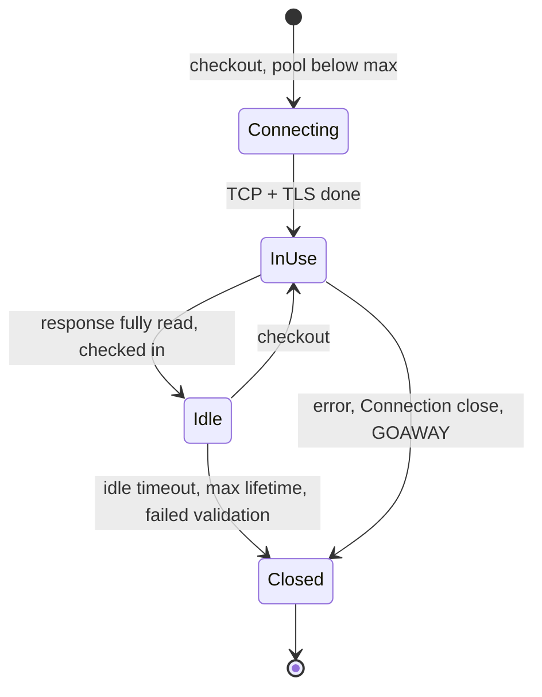

An order service calls a payment service 70 ms away. Opened fresh, each call pays a TCP handshake (one round trip) and a TLS 1.3 handshake (another), so 140 ms pass before the first byte of the request leaves, plus the CPU for the key exchange and certificate verification on both ends. Over a warm connection the same call costs one round trip. That difference is why every serious HTTP client, database driver and proxy keeps a **pool** of open connections, and why the [latency lesson](/learn/networking/networking-in-practice/latency-bandwidth-and-math) counted keep-alive as removing three of four round trips.

A pool is a cache, and it has every problem a cache has. It must be sized. Its entries go stale (the server closed the connection, a NAT forgot it). It needs invalidation (DNS changed, and a pooled connection keeps talking to the old address). And unlike most caches, when it runs dry, callers *wait*, which makes it a queue that no dashboard on the server side can see. This lesson is about those four problems.

## What a pool is

A pool keeps, per origin (scheme, host and port), a set of open connections. A request **checks out** an idle connection or opens a new one if the pool is under its cap, uses it, and **checks it in** when the response is complete. If the pool is at its cap and nothing is idle, the request waits for one.



Every pool exposes some version of the same knobs:

| Setting | What it bounds | Getting it wrong |
|---|---|---|
| Max connections (per host, total) | Concurrency to the dependency | Too low: requests queue in your process. Too high: no protection when the dependency slows |
| Min idle / warm-up | Cold-start latency | Zero: the first requests after a deploy pay every handshake at once |
| Idle timeout | How long an unused connection is kept | Longer than the server's or a middlebox's: you reuse a connection the other side has closed |
| Max lifetime | How long any connection may live | Unbounded: DNS changes and new backends are never picked up |
| Acquire (checkout) timeout | How long a request waits for a connection | Unbounded: pool exhaustion becomes unbounded latency instead of an error |
| Validation | Whether a connection is checked before use | Off: stale connections fail the first request; per-checkout query: an extra round trip each time |

With HTTP/1.1, a connection carries one request at a time, so the number of connections *is* your concurrency to that host. With HTTP/2, one connection multiplexes many streams (servers commonly allow on the order of 100 concurrent streams), so a single connection per origin is often enough, and the pool's job becomes keeping that one connection healthy.

## Keep-alive at the HTTP layer

HTTP/1.1 connections are persistent by default. Either side can end one with `Connection: close`, and servers often advertise their limits with `Keep-Alive: timeout=5, max=1000`. HTTP/2 uses a `GOAWAY` frame to say "finish what you have, open a new connection for anything else", which is how a draining server sheds its long-lived clients.

A connection is only reusable once the previous response has been **read to the end**. A client that stops reading halfway, or never closes the response body, cannot return the connection to the pool; the pool opens another, and another. In Go, forgetting `resp.Body.Close()` (and draining the body) is the classic version; in Python it is `requests` with `stream=True` and no context manager. The symptom is a connection count that grows with traffic until something runs out of file descriptors, with sockets piling up in `CLOSE_WAIT` when servers give up on them.

Two timeouts must be ordered correctly. Each hop's idle timeout must be **shorter on the client side** than on the server side, so the client is always the one that closes an idle connection. Get it backwards and the server closes a connection at the instant the client reuses it, producing sporadic `ECONNRESET` errors and load balancer 502s. The mechanics of that race are in [TCP deep dive](/learn/networking/fundamentals/tcp-deep-dive); the pool setting that fixes it is the idle timeout.

TCP keepalive (`SO_KEEPALIVE`) is a different mechanism with a similar name. It sends empty probes on an idle connection to detect a dead peer and to keep NAT and firewall state alive. Linux's default waits two hours of idleness before the first probe, far longer than the few minutes after which many NAT gateways, firewalls and load balancers forget an idle flow. A pooled connection idle for ten minutes behind such a box may be dead without either end knowing; the next request on it is dropped or reset. Either set keepalive probes below the smallest idle timeout on the path or, more simply, set the pool's idle timeout below it.

## Sizing a pool with Little's law

Little's law says that the average number of requests in a system equals the arrival rate times the time each spends inside: $L = \lambda W$. For a pool, `L` is connections in use, `λ` is requests per second, and `W` is how long each request holds a connection.

Worked example: 2,000 requests per second to a dependency whose mean latency is 12 ms.

- Average connections in use: $2{,}000 \times 0.012 = 24$.
- When the dependency has a bad minute and the mean rises to 50 ms: $2{,}000 \times 0.05 = 100$.
- A reasonable cap is somewhere around 64 to 128: enough for normal peaks and a latency wobble, not enough for 2,000 requests to sit on 2,000 connections.

Run it the other way and you get the pool's capacity. A pool of 10 connections to a service with 20 ms responses carries at most $10 / 0.02 = 500$ requests per second. At 600 requests per second, the waiting line grows by 100 requests every second, and every waiter's latency grows with it. The downstream service's dashboards show 20 ms and a calm 500 requests per second, because the queue is inside your process. When "the dependency is fast but calls to it are slow", check the pool's wait time first.

That same arithmetic is why pools are also **bulkheads**. When the dependency slows from 20 ms to 2 s, the connections needed at the same traffic rise a hundredfold. An uncapped pool opens them all, piling load onto a dependency that is already struggling, while your own threads wait on it. A capped pool with a short acquire timeout fails the excess requests fast, keeps your service responsive for everything that does not need that dependency, and leaves the dependency room to recover. That is the pattern in [Resilience patterns](/learn/system-design/building-blocks/resilience-patterns), implemented by a setting you already have.

```python
import httpx

limits = httpx.Limits(max_connections=100, max_keepalive_connections=20, keepalive_expiry=30)
client = httpx.Client(limits=limits, timeout=httpx.Timeout(1.0, pool=0.1))  # 100 ms to get a connection
```

```exercise
id: connection-pool-queue
title: Watch a pool become a queue
prompt: |
  Simulate a pool of `size` connections. Requests arrive at the times in
  `arrivals` (milliseconds, non-decreasing) and are served in arrival order.
  Each request takes the connection that becomes free earliest, starts at
  max(arrival, that connection's free time), holds it for exactly `hold` ms,
  and then releases it.

  If a request would have to wait longer than `timeout` ms, it gives up
  immediately, never takes a connection, and its result is -1. Otherwise
  its result is how long it waited (0 if a connection was free).

  Return the list of results.
languages: [python, javascript]
entry: simulate_pool
starter:
  python: |
    import heapq

    def simulate_pool(size, hold, timeout, arrivals):
        free_at = [0] * size   # when each connection becomes free
        results = []
        # TODO
        return results
  javascript: |
    function simulate_pool(size, hold, timeout, arrivals) {
      const freeAt = new Array(size).fill(0); // when each connection becomes free
      const results = [];
      // TODO
      return results;
    }
tests:
  - args: [2, 10, 100, [0, 0, 0, 0]]
    expected: [0, 0, 10, 10]
    label: two connections, four simultaneous requests
  - args: [2, 10, 5, [0, 0, 0, 0, 12]]
    expected: [0, 0, -1, -1, 0]
    label: a short acquire timeout fails fast
  - args: [1, 20, 50, [0, 5, 10, 15, 20]]
    expected: [0, 15, 30, 45, -1]
    label: arrivals faster than service, so the wait keeps growing
  - args: [3, 10, 10, []]
    expected: []
    label: no requests
  - args: [1, 10, 0, [0, 10, 15]]
    expected: [0, 0, -1]
    label: zero timeout means never wait
  - args: [3, 30, 25, [0, 0, 0, 0, 5, 10, 31, 40, 45, 70]]
    expected: [0, 0, 0, -1, 25, 20, 0, 20, 15, 0]
    hidden: true
hints:
  - "Keep the free times in a min-heap (or scan for the minimum; pools are small). The earliest-free connection is the one a FIFO waiter gets."
  - "A request that times out must not change any connection's free time."
```

## Database pools: the server is the bottleneck

HTTP pools protect your process from a dependency. Database pools must also protect the database from you, because the database is usually the scarcer resource.

Postgres runs one operating system process per connection, each with its own memory, and its throughput peaks at a modest number of *actively working* connections, a small multiple of the CPU core count. The oft-quoted starting point, from the Postgres wiki and popularised by HikariCP's pool-sizing notes, is `connections = cores × 2 + effective_spindle_count`. Beyond that, more connections add lock contention and context switches, and throughput falls. A few dozen connections on a 16-core database will often outperform a few hundred.

Then multiply. Sixty application pods, each running four worker processes, each with a pool of 10, is 2,400 connections once traffic fills the pools. If `max_connections` is 500, the scale-out that took you to sixty pods is the one that starts failing with `FATAL: sorry, too many clients already`. Two fixes, usually both: size per-process pools from the database's budget divided across the fleet, and put a pooler such as PgBouncer in transaction mode between them, so thousands of client connections share a few dozen server connections. The details, including what transaction pooling breaks (session-level state such as `SET`, advisory locks and `LISTEN`), are in [Connection management](/learn/databases/storage-and-scale/connection-management).

## DNS, load balancers and the connection that never dies

Resolution happens when a connection is **opened**. A pooled connection keeps using the address it was opened to for as long as it lives, whatever the DNS TTL says.

```viz
{"type": "network", "scenario": "dns-resolution", "title": "Resolution happens once per connection, not per request", "caption": "The TTL governs how long resolvers cache the answer. It says nothing about connections already open: a pool reuses them against the old address until they are closed."}
```

Walk through a database failover. The primary is `db.internal`, TTL 30 s, and each application instance holds 20 pooled connections opened hours ago.

| Time | What happens |
|---|---|
| T = 0 | The old primary is demoted and the record is updated to the new primary's address |
| T ≤ 30 s | Every resolver has the new address |
| T = 30 s onwards | The pool still holds 20 connections to the old address |

What happens next depends on how the old primary fails. If it is gone, requests on old connections error or time out, the pool discards them and reconnects, and each connection costs one failed request (or one full timeout if packets are silently dropped). If it is still up but now a read-only replica, the connections are perfectly healthy and every write fails with a read-only error, indefinitely, because nothing ever tells the pool to reconnect. That second case is the one that lasts until someone restarts the service.

**Max lifetime** bounds it. With a lifetime of 5 minutes, every connection is replaced within 5 minutes, and each replacement resolves the name again. Add jitter (say ±10%) so a pool opened all at once does not also reconnect all at once. HikariCP defaults to 30 minutes; for anything in a DNS-based failover plan, shorter is better. Some drivers can also be told to close connections that report the server is read-only, which turns the silent failure into a fast one.

The same stickiness breaks load balancing. Add three new instances behind an L4 load balancer and existing clients keep their pooled connections to the old ones; the new instances idle while the old ones stay hot until connections churn. HTTP/2 and gRPC make it extreme: one connection carries all of a client's requests, and an L4 balancer balances **connections**, not requests, so each client pins all of its traffic to one backend.

```viz
{"type": "network", "scenario": "load-balancer-least-conn", "title": "Least connections counts connections, not work", "caption": "The balancer picks the backend with the fewest open connections. With pooling and HTTP/2, one long-lived connection can carry hundreds of requests per second, so equal connection counts can hide very unequal load."}
```

The fixes, in rough order of preference:

- **Balance per request, at L7.** A proxy or sidecar that understands HTTP/2 spreads streams across backends (see [Service meshes and proxies](/learn/networking/networking-in-practice/service-meshes-and-proxies)).
- **Client-side load balancing.** gRPC clients can resolve every backend address and round-robin across a connection to each.
- **Bound connection age on the server.** gRPC servers support a maximum connection age, after which they send `GOAWAY` and the client reconnects, possibly to a different backend. It is max lifetime, enforced from the other end.

When a server shuts down it should do the same: stop accepting, send `Connection: close` or `GOAWAY` on its remaining connections, finish in-flight requests, then exit. Clients must treat a connection closed underneath them as routine.

## Stale connections and safe retries

However careful the timeouts, some checked-out connections will turn out to be dead. A pool has three ways to find out before a request does: check that an idle socket is not readable (a readable idle connection means the peer sent FIN or RST), run a validation query (correct, but an extra round trip per checkout; prefer validating only connections idle longer than a few seconds), or keep idle timeouts short enough that staleness is rare.

When a request does fail on a reused connection before any response byte arrived, retrying it on a fresh connection is usually right, and some clients do it automatically for idempotent methods (Go's HTTP transport does). For a non-idempotent request, the server may have received it before the connection died, so the retry needs an idempotency key. That judgement is the subject of [Timeouts, retries and backoff](/learn/networking/networking-in-practice/timeouts-retries-and-backoff).

## Library defaults that bite

| Client | Default | What it does to you |
|---|---|---|
| Go `net/http` | `MaxIdleConnsPerHost` is 2, `MaxConnsPerHost` is unlimited | At a concurrency of 100 to one host, 98 connections are closed after every use: a handshake per request and thousands of sockets in `TIME_WAIT` |
| Python `requests` | Pooling only through a `Session`; each adapter keeps 10 connections per host | `requests.get()` in a loop opens a new connection per call; more than 10 threads on one session log "Connection pool is full, discarding connection" |
| Node.js `http` | Recent versions keep connections alive on the global agent; older versions did not; `maxSockets` is unlimited | Older code opened a connection per request; unlimited sockets means no bulkhead |
| HikariCP (JDBC) | Pool size 10, max lifetime 30 minutes, idle timeout 10 minutes | Sensible, but check max lifetime against any proxy or firewall that kills idle connections sooner |

The Go fix is a few lines, and it is worth knowing by heart:

```go
tr := &http.Transport{
    MaxIdleConns:        200,
    MaxIdleConnsPerHost: 64,               // default is 2
    MaxConnsPerHost:     128,              // a bulkhead per host
    IdleConnTimeout:     50 * time.Second, // below the server's keep-alive timeout
}
client := &http.Client{Transport: tr, Timeout: 2 * time.Second}
// Share one client per process, and always drain and close resp.Body.
```

Not pooling at all has a hard ceiling too. Every new outbound connection to the same destination address and port needs a fresh local port, and the side that closes first holds that port in `TIME_WAIT` for 60 seconds on Linux. With the default ephemeral range that caps you at roughly 470 new connections per second to one backend before `connect()` fails with `EADDRNOTAVAIL`. The derivation and the kernel knobs are in [TCP deep dive](/learn/networking/fundamentals/tcp-deep-dive); the real fix is a pool.

## Watching a pool

A pool you cannot see is a queue you cannot see. Export, per pool:

- **In use, idle and waiting.** Waiters above zero for more than a moment means the pool is the bottleneck, not the dependency.
- **Acquire latency** as a histogram. This is the queueing time the downstream's dashboards will never show.
- **Connections opened per second.** In a healthy pool this is near zero at steady state. If it tracks your request rate, you are not reusing connections: look for `Connection: close` from the server, bodies not being drained, or an idle limit that is too small.
- **Errors on reused connections**, which point at idle-timeout ordering or middlebox timeouts.

From a shell, `ss -tan state established '( dport = :5432 )' | wc -l` counts open connections to a port, and `ss -tan state time-wait | wc -l` counts the sockets that pooling should have prevented. [Debugging the network](/learn/networking/networking-in-practice/debugging-the-network) builds these into a method.

## Senior signals

- You size pools with **Little's law** in both directions (connections needed from rate × latency, capacity from size ÷ latency) and you say out loud that an exhausted pool is a queue the server cannot see.
- You treat the pool cap and acquire timeout as a **bulkhead**, and you want acquire latency and waiter counts on a dashboard.
- You do the **fan-in** multiplication (pods × processes × pool size) against the database's connection budget before a scale-out, and you know when to put PgBouncer in the middle.
- You know DNS changes do not reach open connections, so every failover plan you review has a **max connection lifetime** (with jitter) or an explicit reconnect.
- You know **HTTP/2 and gRPC pin traffic** behind an L4 balancer, and you fix it with L7 balancing, client-side balancing or a server-side maximum connection age.
- You order **idle timeouts** so the client side always closes first, and you know the Go and `requests` defaults that silently disable reuse.

## Check yourself

```quiz
- q: >-
    A service makes 1,500 requests per second to a dependency with a mean latency of 40 ms over HTTP/1.1. About how many pooled connections are in use on average?
  options: ["About 1,500", "About 60", "About 6", "About 600"]
  answer: 1
  explanation: >-
    Little's law: 1,500 × 0.04 = 60 connections in use on average. HTTP/1.1 carries one request per connection at a time, so this is also the concurrency. Size the cap above this for peaks and latency spikes, but nowhere near 1,500.
- q: >-
    After scaling a gRPC service from 4 to 8 instances behind an L4 load balancer, the 4 new instances get almost no traffic. Why?
  options: ["Long-lived HTTP/2 connections stay on the old four", "The new instances are failing their health checks", "gRPC clients do not support load balancing at all", "Clients cache DNS answers past the record's TTL"]
  answer: 0
  explanation: >-
    L4 balancing picks a backend only when a connection opens. Existing clients keep their long-lived connections, and HTTP/2 multiplexes every request over them, so all their traffic stays on the original instances. Use L7 or client-side balancing, or a server-side maximum connection age so clients reconnect and redistribute.
- q: >-
    A database fails over by updating a DNS record with a 30-second TTL. Ten minutes later, one service is still failing every write with "read-only transaction" errors. What is the most likely cause?
  options: ["Old pooled connections still reach the demoted primary", "TCP keepalive is disabled on the service's sockets", "Resolvers are ignoring the record's 30-second TTL", "The new primary is too overloaded to accept writes"]
  answer: 0
  explanation: >-
    DNS is consulted when a connection opens. Old connections to a demoted primary that is now a healthy read-only replica never error at the network level, so nothing forces a reconnect and the pool keeps them; keepalive would find them perfectly alive. A bounded max lifetime, or closing connections that report a read-only server, makes the failover converge.
- q: >-
    A Go service calls one backend with 200 concurrent goroutines using the default http.Transport. Which symptom do you expect?
  options: ["High connection churn and many TIME_WAIT sockets", "No effect, as the defaults suit high concurrency", "HTTP/2 is disabled because of the transport defaults", "Requests queue, since only 2 connections may be open"]
  answer: 0
  explanation: >-
    MaxIdleConnsPerHost defaults to 2 while the number of open connections is unlimited, so nothing queues. Under concurrency, most connections are closed on check-in and reopened on the next request, paying handshakes and leaving sockets in TIME_WAIT. Raise MaxIdleConnsPerHost and cap MaxConnsPerHost.
- q: >-
    A dependency's latency jumps from 20 ms to 2 s. Your service's HTTP pool to it is capped at 50 connections with a 100 ms acquire timeout. What does the cap achieve?
  options: ["Nothing, because the dependency itself is the problem", "A bulkhead: bounded stuck work and fast failure", "It makes the slow dependency respond faster", "It guarantees every request eventually succeeds"]
  answer: 1
  explanation: >-
    Without a cap, the connections needed rise a hundredfold and your service's threads and connections drain into one slow dependency. The cap plus a short acquire timeout is a bulkhead: it bounds what can be stuck, fails excess requests quickly so the rest of the service stays healthy, and keeps the dependency from being flooded while it recovers.
- q: >-
    Sixty pods each run 4 worker processes with a database pool of 10, and the database allows 500 connections. What happens once load fills the pools, and what is the standard fix?
  options: ["Connections are refused; put PgBouncer in front", "The database queues the extra connections itself", "Nothing, because the pools connect only lazily", "Throughput roughly doubles with the extra pools"]
  answer: 0
  explanation: >-
    Pools multiply across pods and processes: 60 × 4 × 10 = 2,400 attempted connections. Beyond max_connections, new ones fail with too many clients rather than queueing. Size pools from the database's budget and put a transaction-mode pooler such as PgBouncer in front: it multiplexes many client connections onto a few server connections, which also keeps the database near its throughput peak.
```
