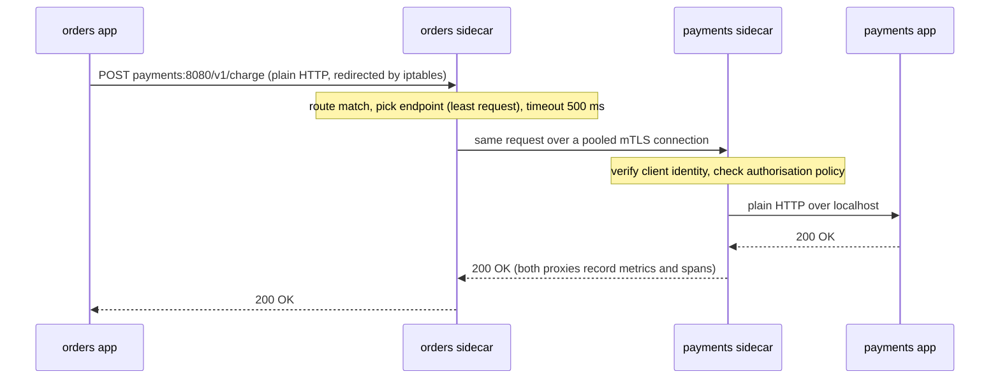

You run forty services written in four languages. Every call between them needs the same things: encryption and authentication, a timeout, retries that do not become a storm, a circuit breaker, load balancing per request rather than per connection, metrics and traces labelled the same way everywhere, and a way to send 1% of traffic to a new version. You can build that as a library and maintain it four times, keeping every version's retry semantics identical. Netflix took that road for years with a set of JVM libraries (Eureka for discovery, Ribbon for client-side load balancing, Hystrix for circuit breaking), and it worked because nearly everything ran on the JVM.

The other road is to put a proxy next to every process and make the proxy do it, in one implementation, for every language. Add a control plane that configures all the proxies and you have a **service mesh**. It moves a great deal of complexity out of application code and into a network hop you now have to understand. This lesson is about what that hop does to each request, what it costs, and how to read it when it fails.

## Proxies: two connections, not one

A **reverse proxy** accepts connections on behalf of servers (NGINX, HAProxy, Envoy, a cloud load balancer, the edge proxy of a platform such as Railway). A **forward proxy** makes connections on behalf of clients (a corporate egress proxy). Either way, a proxy is always *two* connections: downstream, from the client to the proxy, and upstream, from the proxy to the backend. Three consequences follow, and each is a classic production bug.

- **The backend sees the proxy's address.** The original client address has to be carried in a header (`X-Forwarded-For`, `X-Real-IP`) or in the PROXY protocol. A backend must trust only a header that its own proxy sets and overwrites, because anything else is client-supplied. The [rate limiting lesson](/learn/networking/network-algorithms/rate-limiting-algorithms) shows how Ascend reads the client address from the header its edge proxy sets, for exactly this reason.
- **Timeouts and keep-alives exist on both sides**, and they must be ordered so that each client side closes idle connections before its server side does. Get it wrong and the proxy returns 502s at random (the idle-timeout race in [TCP deep dive](/learn/networking/fundamentals/tcp-deep-dive)).
- **The proxy pools upstream connections**, so everything in [Connection pooling and keep-alive](/learn/networking/networking-in-practice/connection-pooling-and-keep-alive) now happens inside the proxy.

The other axis is how much of the traffic the proxy understands.

| | L4 (TCP) proxy | L7 (HTTP/gRPC) proxy |
|---|---|---|
| Sees | Connections and bytes | Requests, headers, status codes |
| Balances | Per connection | Per request |
| Can route by | Address and port (SNI with TLS passthrough) | Path, host, header, cookie, method |
| Can retry | A failed connection attempt | An individual request |
| Observes | Bytes, connection counts, durations | Request rate, error rate, latency per route |
| TLS | Passthrough, or terminate | Must terminate to see requests |
| Cost | Cheap | Parses every request |

For HTTP/2 and gRPC the difference is decisive: one connection carries every request a client makes, so an L4 proxy sends all of them to one backend. Only an L7 proxy balances them.

### Envoy's vocabulary

Envoy is the proxy inside Istio and many other meshes and gateways, and its configuration model is worth knowing because the words show up in every mesh's documentation and error messages.

- A **listener** binds a port and runs a chain of network filters. For HTTP, the key filter is the HTTP connection manager, which runs HTTP filters (authorisation, rate limiting, fault injection) and finally the router.
- A **route** matches a request (by host, path, headers) and sends it to a cluster, with a timeout and a retry policy.
- A **cluster** is a named group of upstream endpoints with a load-balancing policy, connection limits, health checking and outlier detection.
- **Endpoints** are the actual addresses.
- All of these can be delivered dynamically by a control plane over the **xDS** APIs (listener, route, cluster, endpoint and secret discovery), which is how a mesh reconfigures thousands of proxies without restarting any.

A trimmed route and cluster for calls to a payments service:

```yaml
routes:
- match: { prefix: "/v1/charge" }
  route:
    cluster: payments
    timeout: 0.5s                  # total, including retries
    retry_policy:
      retry_on: "connect-failure,refused-stream"   # never reached the app: safe for POST
      num_retries: 2
      per_try_timeout: 0.2s
clusters:
- name: payments
  connect_timeout: 0.25s
  lb_policy: LEAST_REQUEST
  circuit_breakers:
    thresholds:
    - max_connections: 1000
      max_pending_requests: 100
      max_requests: 1000
      retry_budget:
        budget_percent: { value: 20.0 }   # retries at most 20% of active requests
        min_retry_concurrency: 3
  outlier_detection:
    consecutive_5xx: 5
    interval: 10s
    base_ejection_time: 30s
    max_ejection_percent: 50
```

Two things in that configuration catch people out.

First, the `retry_on` list. A proxy cannot know whether `POST /v1/charge` is safe to repeat. Retrying on `5xx` or `reset` means retrying requests that may already have charged a card. Retrying on `connect-failure` and `refused-stream` is safe, because in those cases the request provably never reached the application. Broader retry conditions belong only on routes that are idempotent or carry an idempotency key.

Second, the word "circuit breaker". Envoy's `circuit_breakers` are **concurrency caps**: when a cluster has 100 requests waiting for a connection, the 101st is rejected immediately. That is a bulkhead. The behaviour usually called a circuit breaker, stop calling something that keeps failing and try again later, is closer to **outlier detection**, which ejects an individual endpoint after five consecutive 5xx responses and readmits it after a cooling-off period.

```viz
{"type": "system", "scenario": "circuit-breaker", "title": "The classic breaker: closed, open, half-open", "caption": "In a mesh this behaviour is split in two: outlier detection ejects individual failing endpoints (a breaker per host), while the proxy's circuit_breakers settings cap concurrency to the whole cluster (a bulkhead)."}
```

## The sidecar pattern

In a sidecar mesh, every pod runs the application container and a proxy container. An init container installs `iptables` rules in the pod's network namespace that redirect all outbound TCP to the proxy's outbound listener and all inbound TCP to its inbound listener (Istio uses ports 15001 and 15006). The application calls `http://payments:8080` in plain HTTP, exactly as it would without a mesh, and never knows the proxy exists.



The client sidecar does not use DNS to find payments: it already holds the list of healthy endpoints, pushed by the control plane, and picks one per request. The server sidecar terminates mTLS, checks that the caller's identity is allowed to make this call, and forwards over localhost.

```viz
{"type": "system", "scenario": "service-mesh", "title": "Sidecars, a control plane and one request", "caption": "The control plane pushes routes, policy and certificates to every sidecar. Application code makes a plain HTTP call; the sidecars add mTLS, retries, outlier ejection, traffic splitting and telemetry."}
```

The **control plane** (Istio's istiod, Linkerd's control plane) watches the orchestrator's services and endpoints plus the mesh's own policy objects, compiles them into proxy configuration, pushes it over xDS, and runs the certificate authority. If it goes down, the data plane keeps forwarding with its last known configuration, but new pods cannot get configuration or certificates, endpoint changes stop propagating, and certificates stop rotating. It is a new tier-zero dependency with a delayed blast radius.

### mTLS and workload identity

Each sidecar receives a short-lived certificate whose identity is a SPIFFE ID derived from the workload's namespace and service account, such as `spiffe://cluster.local/ns/payments/sa/payments-api`, and it rotates that certificate automatically. Both sides of every connection present certificates, so authorisation policy is written in terms of identities ("orders may call `POST /v1/charge` on payments") rather than IP addresses, which mean nothing when pods are rescheduled every few minutes. The handshake and certificate mechanics are in [TLS and PKI](/learn/networking/fundamentals/tls-and-pki).

Know what mesh mTLS does not give you. It authenticates *workloads*, not end users, so the payments service still has to check that the user on whose behalf orders is calling may perform this charge. It does not protect you from a compromised pod, which holds a perfectly valid identity. And the hop from the application to its own sidecar is plaintext over localhost. The migration trap is **permissive mode**: during rollout, sidecars accept both plaintext and mTLS so that un-meshed clients keep working, and a mesh left in permissive mode quietly accepts plaintext forever. Verify strict mode with the mesh's own metrics on plaintext connections, not with the configuration you believe you applied.

## What it costs

Every call now crosses two extra proxies, each of which parses the request, applies filters, and copies bytes between sockets in user space.

- **Latency.** Typical per-proxy overhead at the median is well under a millisecond, and the tail is worse, especially when a sidecar's CPU limit is small and it gets throttled. Do the multiplication for your call graph: a request that crosses five service-to-service hops passes through ten proxies. At half a millisecond each, that is 5 ms at the median; a throttled sidecar on the critical path can add tens of milliseconds at p99.
- **Memory and CPU.** Each proxy holds configuration for every service it might call. In a large mesh with no scoping, every sidecar learns about every service, and memory per pod climbs from tens of megabytes towards hundreds. Scoping each workload's configuration to the services it actually calls (Istio's `Sidecar` resource does this) is one of the first optimisations large meshes make.
- **Operations.** Container start order used to be a notorious problem: the application starts before its sidecar is ready and its first calls fail, and batch jobs never complete because the sidecar keeps running after the main container exits. Kubernetes' native sidecar containers (init containers with `restartPolicy: Always`) fix both. And the proxy fleet itself needs upgrades, which means restarting every pod.

## Retries and timeouts in two places

The most common mesh incident is not a mesh bug. It is retry policy configured in two places at once. The application retries up to 3 attempts; its sidecar retries each attempt up to 2 more times. One logical call can now reach the payments service $3 \times 3 = 9$ times. Put that at each of three tiers and a single user request can become $9^3 = 729$ requests at the bottom of the stack during an outage, the amplification arithmetic from [Timeouts, retries and backoff](/learn/networking/networking-in-practice/timeouts-retries-and-backoff).

The rule is to retry in **one** place per hop. The mesh is usually the better place, because it can enforce a **retry budget** (the `retry_budget` above allows retries of at most 20% of active requests, so retries cannot multiply load during an outage), and it applies the same policy to every language. Then make the application not retry, or retry only on errors the mesh cannot see.

Timeouts must nest the same way. If the route's total timeout is 500 ms, the application's own deadline for the call must be longer, or the application gives up while the mesh is still retrying on its behalf, wasting the work. Better still, propagate the deadline: gRPC's `grpc-timeout` header carries the remaining budget, and a proxy or server can refuse work that cannot finish in time.

### Reading a mesh's errors

A 503 from a mesh is not necessarily a 503 from your service. Envoy's access log records a **response flag** that says who produced the response and why:

```text
[2026-09-26T09:12:44.512Z] "POST /v1/charge HTTP/1.1" 503 UO 112 81 0 - "-" "orders/4.2" "5f1c2a77" "payments:8080" "-"
[2026-09-26T09:12:44.530Z] "POST /v1/charge HTTP/1.1" 504 UT 112 24 500 - "-" "orders/4.2" "8d0b9e13" "payments:8080" "10.30.1.8:8080"
[2026-09-26T09:12:44.561Z] "POST /v1/charge HTTP/1.1" 200 - 112 57 31 29 "-" "orders/4.2" "c41e0f52" "payments:8080" "10.30.1.9:8080"
```

The columns after the status are the flags, bytes received, bytes sent, total duration in milliseconds, and the upstream's own service time. The first line is a `UO` (upstream overflow): the *local* sidecar rejected the request in 0 ms because `max_pending_requests` was exceeded, and payments never saw it. The second is `UT`: the 500 ms route timeout expired. The third succeeded in 31 ms, 29 of which were spent upstream, so both proxies and the network added about 2 ms.

| Flag | Meaning | Where to look |
|---|---|---|
| `UO` | The client proxy's concurrency cap overflowed | The caller's cluster limits, or a slow upstream holding requests |
| `UF` | Could not connect upstream | Upstream crashed, port closed, network policy |
| `UH` | No healthy upstream endpoints | Health checks and outlier ejection |
| `UT` | Upstream request timed out | Upstream latency versus the route timeout |
| `URX` | Retry limit or budget exhausted | Upstream errors; the retries already happened |
| `UC` | Upstream closed the connection | Idle-timeout ordering, upstream restarts |
| `NR` | No route matched | Mesh configuration |
| `DC` | The downstream client disconnected | The caller gave up first: check its timeout |

Learning these flags turns "the mesh is returning 503s" into a specific statement about which side and which limit, which is most of an incident.

## Observability at L7, and its blind spot

Because every request passes through two proxies that understand HTTP, the mesh can report the golden signals (request rate, error rate, latency distribution) for every edge in the call graph, with the same labels in every language, without anyone writing instrumentation. That uniform service graph is often the feature that justifies the mesh.

The blind spot is **distributed tracing**. Each sidecar can emit a span for the request it forwarded, but it cannot know that the inbound request to orders *caused* the outbound call to payments; that link exists only inside the application. Unless the application copies the trace context headers (W3C `traceparent`, or the older B3 headers) from each inbound request onto the outbound requests it makes, you get a collection of disconnected one-hop traces. Meshes make tracing cheap; they do not make it automatic.

Mesh metrics also measure from the proxy's point of view. A request that the sidecar retried twice before succeeding looks, to the application, like one slow success. Keep application-level metrics for what users experience, and use the mesh's per-edge metrics to find where. The wider practice is in [Observability](/learn/system-design/building-blocks/observability).

## Beyond sidecars

The sidecar's costs (a proxy per pod, start ordering, restarts to upgrade) have pushed meshes toward other shapes:

- **Per-node proxies.** Istio's ambient mode runs a lightweight per-node proxy (ztunnel) for mTLS and L4 policy and adds full Envoy "waypoint" proxies only for services that need L7 features. Cilium handles L4 in the kernel with eBPF and uses a per-node Envoy for L7. Fewer proxies, but a node-level proxy failure affects every pod on that node.
- **Lighter sidecars.** Linkerd keeps the sidecar model with its own small proxy written in Rust, trading Envoy's feature breadth for lower overhead and simpler operation.
- **Proxyless.** gRPC libraries can consume xDS configuration directly and do mesh-style routing, balancing and security in-process. No extra hop, but it is back to the library model, per language.

## Should you run one?

| Adopt a mesh when | Skip it when |
|---|---|
| Dozens of services in several languages | A handful of services in one language, where a shared client library does the job |
| You need mTLS everywhere for compliance or zero-trust | Network-level isolation already meets the requirement |
| You want uniform telemetry, canaries and traffic shifting without code changes | Nobody would own the control plane and its upgrades |
| A platform team exists to run it | Your latency budget per hop is a millisecond or two |

A common middle path is an **API gateway** at the edge for north-south traffic (authentication, per-key rate limits, request shaping) and client libraries or a lightweight mesh for east-west calls. Whichever you choose, the mechanisms are the same ones this module has covered: timeouts that nest, retries with budgets, pools sized by Little's law, per-request load balancing, and consistent hashing (see [Consistent hashing and routing](/learn/networking/network-algorithms/consistent-hashing-and-routing)) when a request needs to land on a particular instance. The mesh only changes where they are configured.

## Senior signals

- You describe any proxy as **two connections** and immediately ask about client-address headers, timeout ordering and upstream pooling.
- You know L4 balancing pins **HTTP/2 and gRPC** traffic and that only an L7 proxy balances per request.
- You distinguish Envoy's **concurrency caps** from **outlier detection**, and you restrict proxy retries on non-idempotent routes to failures that provably never reached the application.
- You check that retries are configured in **exactly one place** per hop, with a budget, and that application deadlines are longer than the mesh's route timeouts.
- You read **response flags** (`UO`, `UF`, `UT`, `URX`, `DC`) before blaming the upstream, and you know a `UO` 503 was generated by the caller's own sidecar.
- You know the mesh does not propagate **trace context** for you, does not authenticate end users, and can be left in permissive mode; and you can argue when a mesh is not worth its cost.

## Check yourself

```quiz
- q: >-
    The orders application retries a failed call up to 3 attempts in total, and its sidecar is configured with num_retries 2 for every attempt. During a payments outage, how many requests can one logical call send to payments?
  options: ["3", "5", "6", "9"]
  answer: 3
  explanation: >-
    Each of the application's 3 attempts becomes up to 1 + 2 = 3 tries in the sidecar, so 9 requests. Across several tiers this multiplies again. Retry in one place per hop, preferably the mesh with a retry budget.
- q: >-
    An Envoy access log shows "503 UO" with a duration of 0 ms for calls from orders to payments. What does it tell you?
  options: ["The orders sidecar rejected the request locally because a concurrency limit such as max_pending_requests was exceeded; payments never saw it", "Payments returned 503 because it is overloaded", "No route was configured for payments", "The TLS handshake failed"]
  answer: 0
  explanation: >-
    UO is upstream overflow: the local proxy's circuit-breaker thresholds (concurrency caps) were full, so it failed fast. The cause is often a slow upstream holding requests open or limits sized too small, but the 503 itself came from the caller's side.
- q: >-
    After adopting a mesh, the tracing UI shows only single-hop traces: orders to payments, and separately payments to ledger, never linked. What is missing?
  options: ["The sidecars are not emitting spans", "mTLS strips tracing headers", "The applications are not copying trace context headers (such as traceparent) from inbound requests to the outbound requests they make", "The control plane is down"]
  answer: 2
  explanation: >-
    Sidecars see each hop but cannot know which inbound request caused which outbound call inside the process. The application must propagate the trace context; the mesh then stitches the spans together.
- q: >-
    Your mesh enforces strict mTLS between all services. Which risk does that NOT address?
  options: ["Eavesdropping on traffic between nodes", "A service impersonating another service's identity without its key", "A user using the orders service to trigger a charge on someone else's account", "Plaintext traffic from pods outside the mesh being accepted"]
  answer: 2
  explanation: >-
    Mesh mTLS authenticates workloads, not end users. Orders is a legitimate caller of payments, so payments must still authorise the action for the user on whose behalf orders is calling. Strict mode does address eavesdropping, workload impersonation and plaintext callers.
- q: >-
    The mesh's control plane goes down for 20 minutes. What is the most accurate description of the impact?
  options: ["All service-to-service traffic stops immediately", "Existing sidecars keep routing with their last configuration, but new pods cannot get configuration or certificates and endpoint changes stop propagating", "Nothing changes; the control plane is not involved in traffic", "Only telemetry is lost"]
  answer: 1
  explanation: >-
    The data plane is designed to survive with last-known configuration, so steady-state traffic continues. But scale-ups and deploys produce pods that cannot join, endpoint lists go stale as pods move, and certificate rotation stops, which becomes an outage if it lasts long enough.
```
