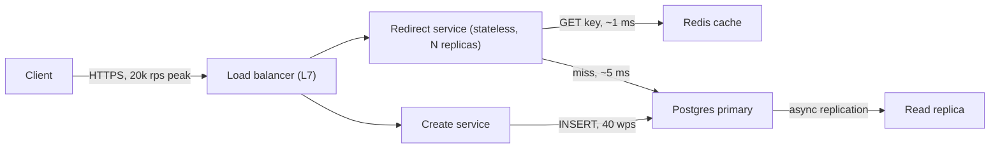

You have 45 minutes, a whiteboard, and a prompt that fits in one sentence: "Design a URL shortener." Nobody can design a production system in 45 minutes, and the interviewer knows it. What they are actually measuring is whether you can turn an ambiguous problem into a set of decisions, justify each decision with a number, and say out loud what will break. The candidates who fail this round mostly do not fail on knowledge. They fail on sequencing: they draw boxes before they know the scale, they optimise the wrong bottleneck, and they run out of time before they have said anything a senior engineer would say.

This lesson is the protocol that fixes the sequencing. It is a fixed order of phases with a time budget for each, the artefact you produce in each phase, and what the interviewer is writing on their scorecard while you do it.

## The seven phases and their time budget

| Phase | Minutes | Artefact you produce | What the interviewer scores |
|---|---|---|---|
| 1. Requirements | 5 | Functional list, non-functional list, explicit out-of-scope | Do you ask before you build; do you separate must-have from nice-to-have |
| 2. Estimates | 5 | QPS, storage, bandwidth, read/write ratio, one sentence on what dominates | Can you put a number on it; do the numbers change your design |
| 3. API | 3 | 3–5 endpoints with request/response shapes | Do you think in contracts; idempotency; pagination |
| 4. Data model | 5 | Tables or key-value schemas with sizes and access patterns | Do you model from the queries, not from the nouns |
| 5. High-level design | 7 | One diagram, every arrow labelled with a protocol and a rough QPS | Can you draw a system that serves the requirements at the estimated scale |
| 6. Deep dive | 15 | Two or three components taken to mechanism level, with failure modes | This is where senior is decided: trade-offs, failures, numbers |
| 7. Wrap-up | 5 | What you would do next, what you would not do, known weaknesses | Honesty, prioritisation, self-awareness |

The numbers total 45. Real interviews drift, and that is fine; the point is that phase 6 gets a third of the time and phase 5 does not eat it. The most common shape of a failed interview is 25 minutes spent on a beautiful high-level diagram followed by a rushed deep dive that never reaches a failure mode.

## Phase 1: requirements (5 minutes)

The prompt is deliberately underspecified. Your first job is to shrink it to something you can design in the time available, and to make the interviewer agree to the shrinking.

Ask these, in roughly this order:

- **Functional**: what are the two or three core operations? For the shortener: create a short link, redirect, maybe analytics. Custom aliases? Expiry?
- **Non-functional**: availability target (99.9% or 99.99%?), latency target for the hot path (a redirect should feel instant: under 100 ms end to end), consistency needs (does a newly created link have to work everywhere immediately?), durability (can we ever lose a link?).
- **Scale**: daily active users, or writes per day and reads per day. Read/write ratio. Data retention.
- **Constraints**: multi-region? Existing infrastructure? Budget sensitivity?

Then state what you are leaving out and why: "I will treat analytics as out of scope for the main design and mention it in the wrap-up; the redirect path is where the risk is." That single sentence is a senior signal. Mid-level candidates try to design everything mentioned; senior candidates pick the hard part and negotiate the rest away.

Write the requirements on the board. You will point back at them in phase 6 when justifying a trade-off, and in phase 7 when admitting which one you did not fully meet.

## Phase 2: estimates (5 minutes)

Estimates are not a ritual. They exist to tell you which of three regimes you are in, because the design is different in each:

1. **One machine is enough.** Below a few thousand QPS and a few hundred GB, a single Postgres with a replica and a cache is the right answer, and saying so is a sign of judgement, not laziness.
2. **One machine is enough for compute but not for storage or availability.** You need replication and probably a cache; you do not need sharding.
3. **Nothing fits on one machine.** Sharding, partitioned queues, and the consistency questions that come with them.

For the shortener, take an interviewer-supplied 100 million new links per month and a 100:1 read/write ratio:

- Writes: $10^8 / (30 \times 86{,}400) \approx 10^8 / 2.6 \times 10^6 \approx 40$ writes/s. Round to 40.
- Reads: $40 \times 100 = 4{,}000$ reads/s average. Peak is typically 2–5× average; call it 10,000–20,000 reads/s.
- Storage: a link row is roughly 500 bytes (short key 7 B, long URL ~200 B average, user id, timestamps, index overhead). $10^8 \times 500\text{ B} = 50\text{ GB per month}$, 600 GB/year, 3 TB over five years. That fits on one large SSD-backed database, so storage does not force sharding; read throughput might.
- Bandwidth: 20,000 redirects/s × ~500 B response ≈ 10 MB/s. Trivial.

The sentence that matters: "This is a read-heavy system at roughly 10–20k reads/s peak, with storage that fits on one node. The design should be a cache in front of a replicated store, and I will not shard on day one." You have just derived the architecture from arithmetic in front of the interviewer. [Back-of-envelope estimation](/learn/system-design/building-blocks/back-of-envelope-estimation) has the reference numbers and more worked cases.

## Phase 3: API (3 minutes)

Three endpoints, written as contracts:

```text
POST /links            body: {long_url, custom_alias?, expires_at?}   -> 201 {short_key, short_url}
GET  /{short_key}      -> 302 Location: long_url   (or 301; see deep dive)
GET  /links/{short_key}/stats -> {clicks, created_at}   (out of scope for deep dive)
```

Say two things while writing it. First, `POST /links` should accept an `Idempotency-Key` header so a client retry does not mint two short links; that is a habit, and interviewers notice habits. Second, the redirect status code is a product decision with a caching consequence: a 301 is cached by browsers, which cuts your read load but makes analytics undercount and makes links effectively un-editable; a 302 (or 307) sends every click through you. Naming a trade-off inside a three-minute phase is exactly the kind of thing that separates levels.

## Phase 4: data model (5 minutes)

Model from the access patterns you wrote in phase 3, not from the nouns in the prompt. There are two queries: look up by `short_key` (hot, 20k/s) and insert (40/s). Everything else is secondary.

```sql
CREATE TABLE links (
  short_key   CHAR(7)      PRIMARY KEY,   -- base62, 62^7 ≈ 3.5 × 10^12 keys
  long_url    TEXT         NOT NULL,      -- cap at 2 KB
  user_id     BIGINT,
  created_at  TIMESTAMPTZ  NOT NULL,
  expires_at  TIMESTAMPTZ
);
```

State the key-space arithmetic: 62 characters, 7 positions, 3.5 trillion keys; at 100 million per month you use 0.03% of the space per decade. State the row size you assumed in phase 2. If the interviewer asks about a key-value store instead of SQL, the honest answer is that this schema is a key-value lookup and either works; you would pick based on what the team already runs, and you would keep the relational store if the analytics requirement ever comes back because it will need joins.

## Phase 5: high-level design (7 minutes)

Draw one diagram. Label every arrow with a protocol and, where you can, a number.



```viz
{"type": "system", "scenario": "request-flow", "title": "A redirect from browser to database and back",
 "caption": "The hot path: load balancer, stateless service, cache hit or a fall-through to the database. Every hop adds latency; the cache is what keeps p99 under 20 ms."}
```

Walk the read path aloud with latencies: TLS-terminated at the load balancer, ~0.5 ms to a service node in the same availability zone, ~1 ms to Redis, and on a miss 2–5 ms to Postgres via an indexed primary-key lookup, then the response. A cache hit round-trip is under 5 ms server-side; a miss is under 15 ms. With a 100:1 read/write ratio and links that are read repeatedly after creation, a 90%+ hit rate is realistic, so Postgres sees around 2,000 reads/s at peak, which a single primary with a replica handles without sharding. You have now closed the loop from estimate to architecture to latency budget.

Do not add components you cannot justify from a requirement or a number. A Kafka cluster on the diagram of a 40-writes-per-second system invites the question "what is that for?", and "for scale" is the wrong answer.

## Phase 6: deep dive (15 minutes)

This phase decides the outcome. Pick two or three components where the interesting decisions live and take each to mechanism level. Choosing well is itself scored: pick the part that is hardest at the stated scale, or the part the interviewer has been nudging you toward.

For the shortener, the candidates are:

- **Key generation.** Random 7-char base62 with a uniqueness check on insert (collision probability at $10^9$ keys in a $3.5 \times 10^{12}$ space is about 0.03% per insert, so retry-on-conflict is fine); or a pre-generated key pool handed out in batches; or a counter plus base62 encode, which is monotonic and therefore guessable, so you would not use it for private links. Say which you pick and why.
- **The cache and its failure.** Cache-aside on read, populate on miss, TTL of a day with jitter. The question that matters: what happens when a hot link's cache entry expires under 20k reads/s? Fifty requests miss simultaneously and hit Postgres for the same key. Request coalescing (one in-flight fetch per key) or stale-while-revalidate fixes it. See [Caching strategies](/learn/system-design/building-blocks/caching-strategies).

```viz
{"type": "system", "scenario": "cache-aside", "title": "Cache-aside on the redirect path",
 "caption": "The service checks Redis, falls through to Postgres on a miss, and writes the result back. Watch what a burst of misses on one key does to the database before you decide the TTL."}
```

- **Availability of the read path when the database is down.** With a 90% hit rate, the cache serves 90% of reads with no database at all; the remaining 10% should fail fast with a 503 rather than pile up. That is the argument for a short database timeout (say 50 ms) and a circuit breaker; it is also the argument for a read replica the service can fall back to. [Resilience patterns](/learn/system-design/building-blocks/resilience-patterns) covers the mechanics.

Each deep dive should end with a failure mode and its mitigation. "The cache is a single Redis node; if it dies, 20k reads/s land on Postgres, which can serve maybe 5k/s of this query, so 75% of redirects fail until the cache warms. Mitigation: Redis with replicas and automatic failover, and a load-shedding path that returns 503 quickly instead of queueing." That paragraph is worth more than any diagram.

## Phase 7: wrap-up (5 minutes)

Say three things:

1. **What you would do next** if you had another hour: analytics via an async click event to a queue, a multi-region read path with the cache replicated and the database primary in one region, abuse controls (rate limiting link creation, malware scanning of destinations).
2. **What you would not do**: not shard on day one, not use a 301 if analytics matters, not put a message queue in the create path at 40 writes/s.
3. **Where the design is weakest** against the stated requirements: the 99.99% availability target is not met by a single-region primary; you would need a cross-region failover story, and you would say what it costs (replication lag, stale reads for a few seconds after failover).

The wrap-up is the interviewer's last impression and it is where honesty is scored. A candidate who says "this design does not meet the availability target as drawn, and here is why" scores higher than one who claims it does.

## Driving versus waiting

The difference between a mid-level and a senior candidate is visible in the first two minutes and stays visible. A mid-level candidate answers questions; a senior candidate runs the meeting. Concretely:

- The senior candidate announces the plan: "I will spend five minutes on requirements, then estimates, then a high-level design, and then go deep on the parts that are hard at this scale. Stop me if you want to go somewhere else."
- When the interviewer asks a question, the senior candidate answers it and then returns to the plan, rather than letting the question become the new agenda.
- When the interviewer hints ("what about when the cache goes down?"), the senior candidate treats it as a redirect to the deep dive the interviewer wants, and follows it. Ignoring hints is one of the most reliable ways to fail; the hint is the rubric leaking.
- The senior candidate volunteers trade-offs before being asked. "I chose 302 over 301; here is what that costs." Every decision comes with its price attached.
- The senior candidate says "I do not know" about specifics they do not know (exact Redis cluster limits, say) and reasons from first principles instead of bluffing.

## Failure modes

These are the ways this round is failed, roughly in order of frequency.

**Over-building.** Drawing Kafka, Elasticsearch and a sharded Cassandra for a system whose numbers fit on one Postgres. Detected by: the interviewer asks "why is that there?" and the answer is "for scale". Mitigation: only add a component when a number from phase 2 or a requirement from phase 1 demands it, and say which one.

**No numbers.** "We add a cache to make it fast." Fast compared to what? Detected by: no QPS, no latency, no storage figure appears in the first ten minutes. Mitigation: phase 2 is mandatory, even if the interviewer says "don't worry about scale"; give a one-line estimate anyway and move on.

**No trade-offs.** Every decision presented as obviously correct. Detected by: the interviewer has to ask "what is the downside?" more than once. Mitigation: attach a cost to each decision as you make it.

**Ignoring the hint.** The interviewer says "what happens under a traffic spike?" and the candidate says "we autoscale" and returns to their diagram. Mitigation: treat every interviewer question as the most important thing in the room for the next three minutes.

**No failure discussion.** Forty-five minutes without the word "fails". Detected by: the deep dive ends with a working mechanism and no "and when this breaks…". Mitigation: each deep-dive component ends with one failure and one mitigation, always.

**Running out of time in the high-level phase.** Detected by: 25 minutes in and still adding boxes. Mitigation: set a hard seven-minute budget and say "that is the high level; now I will go deep on X".

## Interviewer follow-ups

**Q: "You said you would not shard on day one. At what point would you, and what would you shard on?"**

When the primary's write throughput or working set stops fitting: for this workload, writes are 40/s so it is the read working set that grows, and a cache absorbs that. Sharding becomes necessary when the storage crosses what a single node can serve with acceptable failover time, roughly several TB, so around year five at 600 GB/year. I would shard by `short_key` hash because every hot query is a point lookup on that key; range sharding would create a hot shard for recently created keys. Before sharding I would exhaust read replicas and a larger cache, because sharding makes the analytics queries cross-shard and I would rather not pay that until forced.

**Q: "Your cache has a 90% hit rate. What is the p99 latency of a redirect, and what dominates it?"**

The p99 is dominated by misses, not hits. If 10% of requests miss and a miss costs 5–15 ms of database time, then the 99th percentile is a miss plus some queueing: roughly 15–25 ms server-side. To move the p99 you improve the miss path (indexed lookup, connection pool sized so misses never wait for a connection) or raise the hit rate; making hits faster does nothing to p99 once hits are under 1 ms. The client-observed latency adds TLS and network RTT, another 20–80 ms depending on geography, which is why the CDN or edge question comes next.

**Q: "A link is created in the US and clicked in Europe 200 ms later. Does it work?"**

With a single primary in the US and cache-aside, yes: the European service misses its regional cache, reads the primary cross-region (about 80 ms), and serves the redirect. If I had put a read replica in Europe and routed reads there, then a replica lag of even 500 ms would return "not found" for a freshly created link. So the honest design is: reads go to the regional cache, misses go to the primary, replicas are for failover rather than for serving fresh reads, and I would state that read-after-write across regions is guaranteed only via the primary. This is a [consistency model](/learn/system-design/building-blocks/consistency-models) decision and I would name it as one.

**Q: "How do you stop someone enumerating all the short links?"**

Random keys rather than a counter, so the space is sparse: with $10^9$ live keys in $3.5 \times 10^{12}$, a random probe hits a valid link 0.03% of the time, so enumeration costs 3,500 requests per hit. Then rate-limit by client IP and by API key on the redirect path with a token bucket, and alert on a high 404 ratio from a single source. I would not rely on obscurity alone; if links need to be private, that is an authorisation feature, not a key-length feature.

**Q: "What would you measure on day one to know this is healthy?"**

Redirect p50/p99 latency and error rate, split by cache hit and miss; cache hit ratio; database connection pool saturation; replication lag on the replica; and a synthetic probe that creates a link and follows it every 30 seconds from each region. The SLO I would propose is 99.9% of redirects under 100 ms client-observed, and I would page on the error rate and the probe, not on CPU. [Observability](/learn/system-design/building-blocks/observability) goes into what to instrument and why CPU alerts are the wrong ones.

## Senior signals

- You announce a plan with a time budget in the first minute and you keep to it, spending a third of the time on the deep dive.
- You derive the architecture from the estimates, and you say when the numbers mean a single database is the right answer.
- You negotiate scope down and state what is out of scope, rather than trying to design everything mentioned.
- Every decision you make comes with its cost attached, before the interviewer asks.
- Every deep-dive component ends with a failure mode and a mitigation.
- You follow the interviewer's hints and you end with an honest account of what the design does not meet.

The full worked design, with each phase taken further, is the [URL shortener case study](/learn/system-design/case-studies/url-shortener); the craft of running the room is in [Presenting a design](/learn/system-design/senior-design-skills/presenting-a-design).

## Check yourself

```quiz
- q: >-
    Twelve minutes into a 45-minute interview you are still adding boxes to the high-level diagram. What is the best move?
  options: ["Announce the move to deep dives and pick the two hardest parts", "Ask the interviewer to choose which component to draw next", "Keep going; the diagram must be complete before any deep dive", "Restart with a simpler diagram so the remaining time is enough"]
  answer: 0
  explanation: >-
    The deep dive is where the senior signal lives and it needs at least a third of the time. Saying "that is the high level" and choosing the deep-dive targets yourself demonstrates driving; asking the interviewer to choose is acceptable but weaker. A complete diagram with no depth is the most common failing pattern, and restarting spends the time you need for depth.
- q: >-
    Your estimate for a service comes out at 40 writes/s and 4,000 reads/s with 600 GB/year of storage. Which design does the arithmetic justify?
  options: ["A single replicated Postgres with a cache in front of it", "Multi-region active-active databases with a global router", "A sharded Cassandra cluster with a Kafka ingestion pipeline", "An in-memory store with periodic snapshots to object storage"]
  answer: 0
  explanation: >-
    These numbers fit on one node for years; read load is absorbed by a cache and a replica. Adding sharding or a queue invites the question "what is that for?" with no numeric answer. Multi-region is a requirements question (availability target), not something the throughput justifies.
- q: >-
    The interviewer interrupts your deep dive with "what happens when the cache node dies?" The strongest response is to:
  options: ["Say cache failure is out of scope and keep to the agreed plan", "Note it for the wrap-up so the current deep dive is not derailed", "Say a replica would take over, then return to your planned topic", "Make it the deep dive: load on the database, what fails, the fix"]
  answer: 3
  explanation: >-
    Interviewer questions are the rubric leaking; the failure-under-load discussion is exactly what the round scores. Quantify the load that lands on the database, say what fails, and describe the mitigation. A one-line "add a replica" and returning to your plan, or deferring it, signals that you do not think about failure, which is the most expensive signal to send.
- q: >-
    Which redirect status code choice is a genuine trade-off worth naming in the API phase?
  options: ["302 vs 307, because 307 prevents open-redirect attacks on links", "301 vs 302, because browsers cache a 301 and skip your servers", "200 vs 302, because a 200 with a meta refresh saves a round trip", "None; browsers treat 301 and 302 identically for a GET request"]
  answer: 1
  explanation: >-
    A permanent redirect is cached by clients, so subsequent clicks never reach your servers: lower load, but no click counting and no way to change the destination. 302/307 both route every click through you; the difference between them (method preservation) rarely matters for a shortener and has nothing to do with open redirects.
- q: >-
    In the wrap-up you realise the design as drawn does not meet the stated 99.99% availability target. You should:
  options: ["Add a second region to the diagram and move on without comment", "Say so, give the cause, and outline what closing it would cost", "Leave it out; raising a gap unprompted costs more than it earns", "Argue that 99.9% is good enough for this product and move on"]
  answer: 1
  explanation: >-
    Honesty about gaps is explicitly scored. Naming the gap, the cause (a single-region primary) and the cost of closing it is a senior behaviour; silently adding a box or hoping it goes unnoticed reads as either not understanding or not being candid.
```
