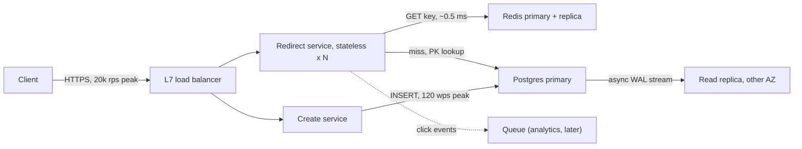

You have 45 minutes, a whiteboard, and a one-sentence prompt: "Design a URL shortener." Nobody designs a production system in 45 minutes, and the interviewer knows it. What they measure is whether you can turn an ambiguous problem into a set of decisions, justify each with a number, and say out loud what will break. Candidates who fail this round rarely fail on knowledge. They fail on sequencing: boxes before scale, the wrong bottleneck optimised, and the clock running out before anything senior has been said.

This lesson is the protocol that fixes the sequencing: seven phases with a time budget, then one complete run on one prompt, minute by minute, with what the interviewer probes at each stage and an answer that earns the signal.

## The seven phases and their time budget

| Phase | Minutes | Artefact you produce | What the interviewer scores |
|---|---|---|---|
| 1. Requirements | 5 | Functional list, non-functional targets, explicit out-of-scope | Do you ask before you build; do you separate must-have from nice-to-have |
| 2. Estimates | 5 | QPS, storage, bandwidth, read/write ratio, one sentence on what dominates | Can you put a number on it; do the numbers change the design |
| 3. API | 3 | 3–5 endpoints with request and response shapes | Contracts, idempotency, status codes |
| 4. Data model | 5 | Tables or key schemas with sizes and access patterns | Modelling from queries, not nouns |
| 5. High-level design | 7 | One diagram, arrows labelled with protocol and rate | A system that serves the requirements at the estimated scale |
| 6. Deep dives | 14 | Two or three components taken to mechanism, each ending in a failure mode | Where senior is decided: trade-offs, failures, numbers |
| 7. Wrap-up | 5 | Next steps, what you would not do, where the design is weak | Honesty and prioritisation |

The budget adds to 44 with a minute to announce the plan. Real interviews drift; the point is that phase 6 gets a third of the time. The commonest failing shape is 25 minutes on a handsome diagram and a rushed deep dive that never reaches a failure.

## A full run: "Design a URL shortener"

Each block below is what you say and write in that window, then the interviewer's probe at about that minute and an answer that scores. The [URL shortener case study](/learn/system-design/case-studies/url-shortener) develops the same design further; here the subject is the method.

### 00:00–01:00: announce the plan

"I'll take about five minutes on requirements and five on estimates, then API, data model and a high-level design by minute 26, then two or three deep dives on what is hard at this scale, and a wrap-up. Stop me if you want to go somewhere else." The interviewer writes "drives the conversation" before you have drawn anything.

### 01:00–06:00: requirements

On the board:

- **Functional:** create a short link for a long URL (optional custom alias, optional expiry); redirect; delete.
- **Out of scope, stated:** the analytics dashboard. The redirect path emits a click event so analytics can be added without touching it.
- **Non-functional:** redirect p99 under 20 ms server-side; redirect availability 99.99%, create 99.9%; a created link is never lost; the creator's link works on their next click, other regions within seconds.
- **Scale (asked, not assumed):** 100 million new links a month, 100 reads per write, keep links for five years.

**Probe at 05:00: "We also want custom aliases, and links should never expire."** Answer: aliases go through the same primary-key insert as generated keys, so uniqueness is enforced in one place; I reserve a denylist (`admin`, `api`, `login`) and cap alias length. "Never expire" makes storage grow without bound, so the five-year storage figure becomes the number to watch. The common wrong answer adds a separate alias table, which creates two sources of uniqueness to keep in sync.

### 06:00–11:00: estimates

| Quantity | Arithmetic | Result |
|---|---|---|
| Writes | $10^8$ per month ÷ $2.6 \times 10^6$ s | 40/s average, about 120/s at a 3× peak |
| Reads | 40 × 100 | 4,000/s average, about 20,000/s at a 5× peak |
| Bytes per link | Measured: 1 million rows with 118-byte URLs took 177 B of heap and 31 B of primary-key index per row on Postgres 17 | Plan 500 B to cover longer URLs, a `user_id` index and bloat |
| Storage | $10^8$ × 500 B per month | 50 GB/month, 600 GB/year, 3 TB in five years; 6 TB with one replica |
| Egress | 20,000/s × ~400 B redirect response | 8 MB/s, about 64 Mbit/s |
| Cache | Last 30 days of links: $10^8$ × ~250 B with Redis overhead | About 25 GB |

The sentence that matters: "Read-heavy, 20,000 reads a second at peak, 3 TB in five years. That is a cache in front of one replicated database. I will not shard on day one." [Back-of-envelope estimation](/learn/system-design/building-blocks/back-of-envelope-estimation) has the reference numbers and their provenance.

**Probe at 10:00: "What if it's 100 times bigger?"** Answer: re-derive, don't hand-wave. Writes become 4,000/s average and 12,000/s peak. On the machine used for this lesson, Postgres 17 committed 16,000 single-row transactions a second with 64 connections sharing each fsync (group commit), so one primary could take it, with no headroom. Reads become 2 million a second at peak, which is a cache cluster of roughly 20 Redis nodes at ~100,000 operations a second each, or redirects cached at the CDN edge. Storage becomes 300 TB over five years, and storage, not throughput, forces sharding by a hash of `short_key`. The design changes in exactly those two places. The wrong answer is "everything scales 100×, so add Kafka and Cassandra".

### 11:00–14:00: API

```text
POST   /links         Idempotency-Key: <uuid>
                      {long_url, custom_alias?, expires_at?} -> 201 {short_key, short_url}
GET    /{short_key}   -> 302 Location: <long_url>
DELETE /links/{short_key}                                     -> 204
```

**Probe at 13:00: "Why 302 and not 301?"** Answer: a 301 is heuristically cacheable ([RFC 9110](https://www.rfc-editor.org/rfc/rfc9110.html), section 15.4.2) and a 302 is not, so browsers stop asking us: less load, but no click events, no way to change a destination, and no way to take down a malware link for users who already cached it. A 302 sends every click through us. If load mattered more than control, I would send a 302 with `Cache-Control: max-age=300`, which bounds how long a takedown takes. I would also require the `Idempotency-Key` so a client retry after a timeout does not mint two links. The wrong answer is "301 because it is faster", which ignores that it is permanent.

### 14:00–19:00: data model

Two access patterns: look up by `short_key` (20,000/s) and insert (120/s). Everything else is secondary.

```sql
CREATE TABLE links (
  short_key   text         PRIMARY KEY,   -- 7 chars of base62: 62^7 = 3.5 x 10^12 keys
  long_url    text         NOT NULL CHECK (length(long_url) <= 2048),
  user_id     bigint,
  created_at  timestamptz  NOT NULL DEFAULT now(),
  expires_at  timestamptz
);
```

At 100 million links a month, five years use $6 \times 10^9$ of $3.5 \times 10^{12}$ keys, 0.17% of the space.

**Probe at 18:00: "SQL or a key-value store?"** Answer: the hot path is a point lookup, which either serves. In DynamoDB this is a table with partition key `short_key`, one read capacity unit per strongly consistent read of an item up to 4 KB, half that for an eventually consistent one. I would choose what the team already operates, and keep a relational store if "list my links" or analytics joins are likely. The wrong answer is "NoSQL because it scales", with no access pattern behind it.

### 19:00–26:00: high-level design



```viz
{"type": "system", "scenario": "request-flow", "variant": "redirect",
 "title": "A redirect from browser to database and back",
 "caption": "The hot path: load balancer, stateless service, cache hit or a fall-through to the database. Every hop adds latency; the cache keeps most requests off the database."}
```

Walk the read path with a latency budget, server-side:

| Hop | Hit path | Miss path | Where the number comes from |
|---|---|---|---|
| L7 balancer to service | ~0.5 ms | ~0.5 ms | One same-AZ round trip plus proxying |
| Service to Redis `GET` | ~0.3–0.5 ms | ~0.3–0.5 ms | Same-AZ RTT; Redis itself spends microseconds |
| Postgres primary-key lookup | – | ~0.5–1 ms | Measured 0.13 ms per query from one connection over a Unix socket; add a network hop |
| Total | ~1–2 ms | ~2–3 ms | Well inside the 20 ms p99 target, which leaves room for tails |

**Probe at 25:00: "Where are the single points of failure?"** Answer, with failover times: the Postgres primary for creates (managed failover takes tens of seconds to minutes: AWS documents 60–120 s for an RDS Multi-AZ instance, during which creates fail and redirects keep working from cache and replica); Redis if it is one node (Sentinel's default `down-after-milliseconds` marks a primary down only after 30 s of failed pings); the balancer, which is a managed multi-AZ service. The wrong answer is "there are none, everything is replicated", which skips the failover window.

### 26:00–40:00: deep dives

Pick what is hard at this scale or what the interviewer has been nudging towards. Here: key generation, the cache under failure, and the cross-region read.

**Key generation (26:00–31:00).**

| Strategy | Coordination | Guessable | Collision handling | Cost |
|---|---|---|---|---|
| Random 7-char base62, insert with unique constraint | None | No | Retry on unique violation | One extra insert per ~3,500 at a billion keys |
| Counter + base62 encoding | A sequence or ID service | Yes: sequential keys enumerate every link | None | A hot sequence, and privacy |
| Pre-generated key pool handed out in blocks | A key service | No | Done offline | Another service to run |
| Truncated hash of the URL | None | No | Frequent, see below | Same URL from two users collides by design |

Random keys with the database's unique constraint win. The collision rate per insert is existing keys ÷ key space: at $10^9$ keys, $10^9 / 3.5 \times 10^{12} = 0.03\%$. The birthday arithmetic says why truncated hashes need the constraint: inserting 1 million 7-hex-character MD5 prefixes (a $16^7 = 2.7 \times 10^8$ space) into the `links` table for this lesson hit 1,846 duplicate keys, against $n^2/2N = 1{,}863$ predicted.

```python
import secrets, string

import psycopg  # psycopg 3

ALPHABET = string.digits + string.ascii_letters          # 62 symbols

def new_key(n: int = 7) -> str:
    # secrets, not random: random's Mersenne Twister output can be predicted
    # from enough observed keys, which would make "unguessable" links guessable
    return "".join(secrets.choice(ALPHABET) for _ in range(n))

def create_link(conn: psycopg.Connection, long_url: str, attempts: int = 5) -> str:
    for _ in range(attempts):
        key = new_key()
        row = conn.execute(
            "INSERT INTO links (short_key, long_url) VALUES (%s, %s) "
            "ON CONFLICT (short_key) DO NOTHING RETURNING short_key",
            (key, long_url),
        ).fetchone()
        conn.commit()
        if row:                      # None means the key existed: draw again
            return key
    raise RuntimeError("five collisions in a row: the key space is too dense")
```

**Probe at 30:00: "Two servers generate the same key at the same instant?"** Answer: both `INSERT`; the primary-key index makes the second wait until the first commits and then fail with a unique violation (or return no row with `ON CONFLICT DO NOTHING`), and that server generates another key. The wrong answer is "check with a `SELECT` first", which is a check-then-act race: both see nothing, both insert.

**The cache under failure (31:00–37:00).** Cache-aside, populate on miss, 24-hour TTL with 10% jitter so a warm-up does not expire all at once ([Caching strategies](/learn/system-design/building-blocks/caching-strategies) traces the races).

```viz
{"type": "system", "scenario": "cache-aside", "title": "Cache-aside on the redirect path",
 "caption": "The service checks Redis, falls through to Postgres on a miss, and writes the result back. Watch what a burst of misses on one key does to the database before choosing the TTL."}
```

**Probe at 33:00: "The Redis primary dies. What happens in the first minute?"** Answer: 20,000 reads a second land on Postgres until failover completes and the cache rewarms. Measure before predicting collapse: the Postgres 17 instance used for this lesson, on a 32-thread workstation, served 53,000 primary-key lookups a second with 32 connections and 69,000 with 90. Reads scale with hardware threads, so an 8-vCPU cloud instance does roughly a quarter of that, so the primary plus a replica can absorb the load. What breaks first is connections: 50 service replicas with HikariCP's default pool of 10 each want 500 connections against a `max_connections` of 100, and requests fail on connection errors, not CPU. So: PgBouncer in front, per-replica pools of 2–5, a 50 ms query timeout, and load shedding that returns 503 fast beyond what the database can take. The wrong answer is "the database falls over, so add more database", which was never measured.

**Cross-region read (37:00–40:00).**

**Probe at 38:00: "A link is created in the US and clicked in Europe 200 ms later. Does it work?"** Answer: with a European read replica 300 ms behind and reads routed to it, no: the click gets a 404, and if 404s are cached the link stays broken. So a miss in Europe falls through to the US primary (a 70–90 ms round trip from Western Europe to the US East Coast), negative results are cached for seconds only, and I state that cross-region read-after-write is guaranteed only through the primary. That is a [consistency model](/learn/system-design/building-blocks/consistency-models) choice and I name it as one. The wrong answer is "it replicates instantly".

### 40:00–45:00: wrap-up

1. **Next:** click events to a queue for analytics; per-API-key rate limits on creation; malware scanning of destinations.
2. **Not doing:** no sharding at 3 TB, no queue in a 120-writes-a-second create path, no 301.
3. **Weakest point:** 99.99% redirect availability is not met by a single-region primary plus cache; it needs a regional failover plan, which costs seconds of replication lag and possible loss of the last writes on failover.

**Probe at 44:00: "What would you alert on?"** Answer: redirect error rate and p99 split by cache hit and miss, cache hit ratio, database pool wait time, replica lag, and a synthetic probe that creates and follows a link every 30 s from each region; page on the error rate and the probe, not on CPU ([Observability](/learn/system-design/building-blocks/observability)). The wrong answer is a list of CPU and memory alerts.

## Under the hood: what the interviewer writes down

At most large companies the interviewer fills in a structured write-up soon after the interview, and a committee or hiring manager who never saw you reads it. The dimensions differ in name but converge on four: problem exploration (did you clarify and scope), design (does it meet the requirements at the stated scale), technical depth (mechanisms, failure modes, numbers), and communication (did you drive, did you respond to hints). Each needs written evidence: "estimated 20k reads/s and concluded no sharding" is evidence; "seemed strong" is not. Two consequences follow. A trade-off you considered but did not say is invisible, so say it. And the level decision is mostly about independence: a mid-level packet shows a working design with prompting; a senior packet shows the candidate choosing the deep dives, quantifying, and naming the weakness before being asked. [The FAANG loop](/learn/senior-craft/getting-the-job/the-faang-loop) covers how the packets are combined.

## The trade-offs you named, in one table

| Decision | Chosen | Alternative | Why here | What would flip it |
|---|---|---|---|---|
| Redirect status | 302 | 301 | Control over destinations and click events | Load dominating and links immutable |
| Store | One Postgres primary + replica | Sharded or key-value store | 3 TB in five years; 120 writes/s | 100× scale: 300 TB forces sharding |
| Keys | Random + unique constraint | Counter, key pool | No coordination, not guessable | A requirement for the shortest possible keys |
| Cache | Cache-aside, jittered 24 h TTL | No cache; write-through | 100:1 reads; misses cost ~1 ms | Links editable with instant effect |
| Cross-region reads | Miss falls through to the primary | Serve from a local replica | Fresh links must resolve | Tolerating a few seconds of 404 for new links |

## Driving versus waiting

- The senior candidate announces the plan and keeps it; mid-level candidates answer questions.
- After answering a question, return to the plan instead of letting the question become the agenda.
- Treat a hint ("what about when the cache goes down?") as the interviewer choosing your next deep dive. Ignoring hints is one of the most reliable ways to fail; the hint is the rubric leaking.
- Attach a cost to every decision as you make it.
- Say "I don't know the exact Redis cluster limit" and reason from first principles instead of bluffing.

## Failure modes of the round

| Failure | Symptom in the room | Diagnosis | Fix |
|---|---|---|---|
| Over-building | "Why is Kafka there?" answered with "for scale" | A component no number or requirement demands | Add a component only when a phase-2 number or a phase-1 requirement needs it, and name which |
| No numbers | "Add a cache to make it fast" | No QPS, latency or storage figure by minute 10 | Always estimate, even when told "don't worry about scale"; one line is enough |
| No trade-offs | The interviewer asks "what's the downside?" twice | Decisions presented as obvious | Price each decision aloud when you make it |
| Ignoring the hint | "We autoscale", then back to the diagram | The question was not treated as a redirect | Make the hinted topic the next deep dive |
| No failure discussion | 45 minutes without "and when this breaks" | Deep dives end at a working mechanism | End every deep dive with one failure and its mitigation |
| High-level overrun | Minute 25, still adding boxes | No time budget | Hard stop at 26:00: "that's the high level; now X" |

## Interviewer follow-ups

**"At what point would you shard, and on what?"** Model answer: writes are 120/s at peak, so storage decides: past a few TB a single node's restore time and index maintenance hurt, around year five at 600 GB/year. Shard by a hash of `short_key` into many logical partitions, because every hot query is a point lookup on it; range sharding would put every new key on the newest shard. Exhaust replicas and cache first. Common wrong answer: "shard from day one to be safe", which buys cross-shard queries for no measured reason.

**"With a 90% hit ratio, what is the redirect p99 and what dominates it?"** Model answer: the misses. With 10% misses, the 99th percentile is a miss plus queueing, a few milliseconds server-side; to move it, speed up the miss path (index, pool sized so a miss never waits for a connection) or raise the hit ratio. Faster hits do nothing for p99. Client-observed latency adds TLS and 20–80 ms of network RTT, which is why edge caching comes next. Common wrong answer: quoting the mean.

**"How do you stop someone enumerating links?"** Model answer: random keys make the space sparse: with $10^9$ live keys in $3.5 \times 10^{12}$, a random probe hits 0.03% of the time, about 3,500 requests per hit; then a token-bucket rate limit per IP and API key, and an alert on a high 404 ratio from one source. Private links are an authorisation feature, not a key-length feature. Common wrong answer: "use longer keys" as the whole answer.

**"Why not let the database generate the key from a sequence?"** Model answer: it works and is simple, but the keys are sequential and therefore enumerable, and the sequence is a single point of coordination; encoding a sequence value through a keyed permutation fixes guessability at the cost of a secret to manage. Common wrong answer: "sequences don't scale", when 120 inserts a second is nothing for a sequence.

## What mid-level engineers get wrong

- Drawing before estimating, then defending a sharded design for 3 TB of data.
- Designing everything mentioned instead of negotiating analytics out of scope.
- Using averages in latency budgets, so the p99 target is never checked.
- Asserting "the database will fall over" without a throughput number; measured, one Postgres serves tens of thousands of key lookups a second, and connections fail before CPU does.
- Checking key uniqueness with a `SELECT` before the `INSERT`.
- Ending the deep dive at "and it works", with no failure.
- Claiming in the wrap-up that the design meets every requirement.

## Senior signals

- You announce a plan with a time budget in the first minute and give the deep dives a third of the time.
- You derive the architecture from estimates, re-derive when a number changes, and say when one database is the right answer.
- You negotiate scope and state what is out of it.
- Every decision carries its cost, said before the interviewer asks.
- Every deep dive ends with a failure mode, a number and a mitigation.
- You treat hints as the rubric and end by naming where the design falls short.

[Presenting a design](/learn/system-design/senior-design-skills/presenting-a-design) covers the craft of running the room.

## Check yourself

```quiz
- q: >-
    Twelve minutes into a 45-minute interview you are still adding boxes to the high-level diagram. What is the best move?
  options: ["Ask the interviewer to choose which component to draw next", "Keep going; the diagram must be complete before any deep dive", "Announce the move to deep dives and pick the two hardest parts", "Restart with a simpler diagram so the remaining time is enough"]
  answer: 2
  explanation: >-
    The deep dive is where the senior signal lives and it needs about a third of the time. Saying "that is the high level" and choosing the deep-dive targets yourself demonstrates driving; asking the interviewer to choose is acceptable but weaker. A complete diagram with no depth is the most common failing pattern, and restarting spends the time you need for depth.
- q: >-
    Your estimate comes out at 120 writes/s and 20,000 reads/s at peak with 3 TB of data after five years. Which design does the arithmetic justify?
  options: ["An in-memory store with periodic snapshots to object storage", "Multi-region active-active databases with a global router", "A single replicated Postgres with a cache in front of it", "A sharded Cassandra cluster with a Kafka ingestion pipeline"]
  answer: 2
  explanation: >-
    One primary handles these write rates with room to spare, the cache and a replica absorb the reads, and 3 TB fits one node. Sharding or a queue invites the question "what is that for?" with no numeric answer. Multi-region is driven by the availability requirement, not by this throughput.
- q: >-
    The interviewer interrupts your deep dive with "what happens when the cache node dies?" The strongest response is to:
  options: ["Say a replica would take over, then return to your planned topic", "Say cache failure is out of scope and keep to the agreed plan", "Make it the deep dive: load on the database, what fails, the fix", "Note it for the wrap-up so the current deep dive is not derailed"]
  answer: 2
  explanation: >-
    Interviewer questions are the rubric leaking; failure under load is exactly what the round scores. Quantify the load that lands on the database, say what fails first (often connections rather than CPU) and describe the mitigation. A one-line "add a replica" or deferring it signals that you do not think about failure.
- q: >-
    Which redirect status code choice is a genuine trade-off worth naming in the API phase?
  options: ["302 vs 307, because 307 prevents open-redirect attacks on links", "200 vs 302, because a 200 with a meta refresh saves a round trip", "301 vs 302, because browsers cache a 301 and skip your servers", "None; browsers treat 301 and 302 identically for a GET request"]
  answer: 2
  explanation: >-
    A permanent redirect is cacheable by default, so later clicks never reach your servers: lower load, but no click events, no destination changes and slow takedowns of malicious links. 302 and 307 both route every click through you; their difference (method preservation) does not matter for a GET shortener and has nothing to do with open redirects.
- q: >-
    Two app servers generate the same random short key at the same moment. With a primary-key constraint on short_key in Postgres, what happens?
  options: ["The database silently appends a suffix so both keys are unique", "Both inserts succeed and the later row overwrites the earlier one", "Both inserts fail, because the unique index detects the conflict", "The second insert waits for the first to commit, then fails"]
  answer: 3
  explanation: >-
    The unique index makes the second insert wait on the first transaction; when it commits, the second fails with a unique violation (or returns no row under ON CONFLICT DO NOTHING) and the application generates a new key. A SELECT-before-INSERT check would not prevent this, because both SELECTs can run before either INSERT.
- q: >-
    In the wrap-up you realise the design as drawn does not meet the stated 99.99% availability target. You should:
  options: ["Leave it out; raising a gap unprompted costs more than it earns", "Argue that 99.9% is good enough for this product and move on", "Add a second region to the diagram and move on without comment", "Say so, give the cause, and outline what closing it would cost"]
  answer: 3
  explanation: >-
    The written feedback records what you said, and naming a gap with its cause (a single-region primary) and the cost of closing it is evidence of senior judgement. Silently adding a box or hoping it goes unnoticed reads as either not understanding the requirement or not being candid.
```
