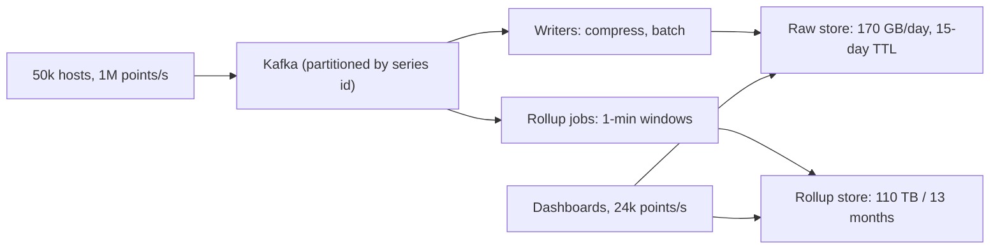

Two candidates are asked to design a photo-sharing service. One says "we'll need a CDN and a sharded database". The other says "300 million photos a day at 2 MB each is 600 TB a day of ingest, so the object store is the whole design; the metadata is 300 million rows a day at 500 bytes, which is 150 GB a day and fits on a single Postgres for a year before I'd think about sharding it." The second candidate has not said anything cleverer. They have said something checkable, and the checkable sentence tells the interviewer where their design will spend its complexity budget and where it will not.

Estimation is not about getting the number right. It is about getting the order of magnitude right fast enough that the design can depend on it, and stating the assumptions so the interviewer can correct one and watch you re-derive.

## The numbers you must carry

You will not be given these; you are expected to know them. They are orders of magnitude, not benchmarks, and hardware moves, so treat each as "about" and be ready to say so.

| Operation | Rough cost | Why it matters |
|---|---|---|
| L1 cache reference | ~1 ns | The floor; everything else is measured in multiples of it |
| Main memory reference | ~100 ns | A pointer chase costs 100 L1 hits |
| Compress 1 KB (fast codec) | ~2–5 µs | Compression is cheap relative to network; compress before sending |
| SSD random read (4 KB) | ~100 µs | A database index probe that misses the buffer pool |
| Read 1 MB sequentially from memory | ~10–50 µs | Sequential beats random by two orders of magnitude |
| Read 1 MB sequentially from SSD | ~1 ms | Streaming a page-sized scan |
| HDD seek | ~5–10 ms | Why spinning disks lose for random access |
| Round trip, same availability zone | ~0.3–0.5 ms | One RPC hop |
| Round trip, cross-AZ same region | ~1–2 ms | Why "just call the other service" adds up |
| Round trip, US East to US West | ~60–70 ms | Cross-continent replication cost |
| Round trip, US to Europe | ~80–100 ms | Multi-region consistency cost |
| Round trip, US to Asia-Pacific | ~150–250 ms | Why a single-region site feels slow from Sydney |
| Send 1 MB over 1 Gbps | ~10 ms | Payload size matters once it exceeds a few hundred KB |
| Redis GET over the network | ~0.5–1 ms | Dominated by the RTT, not by Redis |
| Postgres indexed point read (warm) | ~1–5 ms | Includes connection, parse, buffer-pool hit |
| Postgres write with fsync | ~5–10 ms | The WAL flush to disk bounds single-row commit latency |

Two derived facts fall out of this table and you should say them when relevant. First, the network round trip dominates almost every request: a service that makes five sequential same-region calls spends 5 ms in RTT before doing any work. Second, a cross-region call costs as much as a hundred same-AZ calls, which is why multi-region designs replicate data rather than call across the ocean on the hot path. [Latency, bandwidth and the math](/learn/networking/networking-in-practice/latency-bandwidth-and-math) derives these from first principles.

```viz
{"type": "system", "scenario": "request-flow", "title": "Where a request spends its time",
 "caption": "Load balancer to service ~0.5 ms, service to cache ~1 ms, cache miss to database ~5 ms, and the client's own RTT of 20–200 ms on top. The database is rarely the slowest hop; the geography is."}
```

### Powers and units

- $2^{10} \approx 10^3$ (a thousand), $2^{20} \approx 10^6$ (a million), $2^{30} \approx 10^9$ (a billion), $2^{40} \approx 10^{12}$ (a trillion). KB, MB, GB, TB, PB.
- A day is 86,400 seconds. Round to $10^5$; you lose 14% and gain speed. A month is about $2.6 \times 10^6$ s; a year is about $3 \times 10^7$ s.
- A character is 1 byte in ASCII, up to 4 in UTF-8; a UUID is 16 bytes binary or 36 as text; a timestamp is 8 bytes; a 64-bit integer is 8 bytes; an IPv4 address is 4 bytes.
- A thumbnail is ~10–50 KB; a phone photo ~2–5 MB; a minute of 1080p video ~50–100 MB at streaming bitrates; a tweet-sized text is ~300 bytes with metadata.

### Throughput ceilings

These are the numbers that tell you when one machine stops being enough. They are deliberately conservative; real systems tuned by experts beat them, and untuned ones miss them.

| Component | Comfortable ceiling per node | Notes |
|---|---|---|
| Stateless HTTP service | 1,000–10,000 rps | Depends entirely on work per request; JSON-over-HTTP with one DB call is at the low end |
| Postgres primary, simple indexed writes | ~5,000–10,000 writes/s | Bounded by WAL fsync and lock contention; batching raises it |
| Postgres, indexed reads | ~10,000–50,000/s | Buffer-pool hits; more with replicas |
| Redis / Memcached | ~100,000 ops/s | Single-threaded command execution; pipelining helps |
| Kafka partition | tens of MB/s | Partitions are the parallelism unit; a broker handles many |
| Object store (S3-class) | effectively unbounded aggregate | Per-prefix rate limits of thousands of requests/s |

The rule of thumb: if the estimate is within 3× of a ceiling, design for it; if it is 10× under, do not.

## The derivation pattern

Every estimate follows the same four steps. Practise the steps until they are automatic, because the interviewer is watching the method as much as the result.

1. **Get the driving number.** DAU, or writes per day, or events per second. If it is not given, ask; if the interviewer says "you tell me", pick something defensible and say "I'll assume 10 million DAU; tell me if that is off by 10×".
2. **Convert to per-second.** Divide by $10^5$. State average, then multiply by a peak factor: 2–3× for global consumer traffic, 5–10× for anything with a daily spike (lunchtime, a broadcast event).
3. **Multiply out the dimension you care about.** Reads and writes separately; storage as rows × bytes × replication × retention; bandwidth as requests × payload.
4. **Compare to a ceiling and say what it means for the design.** "That is 400 writes/s; one Postgres. That is 40,000 writes/s; sharded or a log-structured store."

Round aggressively at every step. $86{,}400$ becomes $10^5$; $2.6 \times 10^6$ becomes $3 \times 10^6$; 1.7 becomes 2. Precision you cannot defend is noise, and it slows you down.

## Worked estimate 1: a Twitter-like feed

Prompt: 300 million monthly users, 50% daily active, each posts 0.5 times a day on average and reads their feed 10 times a day, 100 posts per feed page.

**Writes.** DAU = 150 million. Posts per day = $1.5 \times 10^8 \times 0.5 = 7.5 \times 10^7$. Per second = $7.5 \times 10^7 / 10^5 = 750$. Peak ~2,000 posts/s. A single Postgres can take that; the interesting write is the *fan-out*, not the post.

**Reads.** Feed loads per day = $1.5 \times 10^8 \times 10 = 1.5 \times 10^9$. Per second = 15,000. Peak ~40,000 feed loads/s. Each feed load returns 100 posts, so it is 4 million post-reads per second at peak. That number cannot be served by joining at read time; it demands a precomputed feed (fan-out on write) or a cache of hot posts, and now you know why the design is what it is.

**Fan-out arithmetic.** If the average user has 200 followers, each post produces 200 feed inserts: $2{,}000 \times 200 = 400{,}000$ inserts/s at peak. That is a Redis-class number, not a Postgres number, so the feed store is an in-memory list per user. A user with 20 million followers would produce 20 million inserts for one post; the celebrity case gets a different path (fan-out on read for accounts over a follower threshold). You have derived the hybrid design that real feed systems use, from arithmetic.

**Storage.** A post is ~300 bytes of text plus ~200 bytes of metadata: 500 B. $7.5 \times 10^7 \times 500 = 37.5$ GB/day, ~14 TB/year, ~40 TB with 3× replication. Sharded, but not enormous. Feeds: 150 million users × 800 recent post IDs × 8 bytes = ~1 TB of Redis across a cluster. That is 10–20 large nodes, and it is the single largest infrastructure cost in the design; say so.

## Worked estimate 2: a photo upload service

Prompt: 10 million DAU, each uploads 2 photos a day and views 50.

**Ingest.** $2 \times 10^7$ photos/day = 200/s average, ~1,000/s peak. At 3 MB per original that is 3 GB/s peak ingest bandwidth, or 24 Gbps. That number is the design: uploads go directly from the client to object storage via pre-signed URLs, never through your application servers, because 24 Gbps through a fleet of app servers is a fleet you do not want to run.

**Storage.** $2 \times 10^7 \times 3$ MB = 60 TB/day of originals. Per year, ~22 PB. Object storage at roughly $0.02 per GB-month makes that on the order of $400k per month by year end, so the cost line item is the originals, and tiering to cold storage after 30 days is a design requirement, not an optimisation. Thumbnails at 30 KB are 600 GB/day; trivial by comparison.

**Metadata.** One row per photo at ~500 bytes: 10 GB/day, 3.6 TB/year. Fits on one primary for a year or two; shard by `user_id` when it does not, because every query is "photos for user X".

**Reads.** $5 \times 10^8$ views/day = 5,000/s average, 15,000/s peak, each ~50 KB (a display-sized rendition): 750 MB/s. Served from a CDN; the origin sees only misses. At an 95% CDN hit rate the origin sees 750 requests/s and 37 MB/s, a single-node number.

```viz
{"type": "network", "scenario": "cdn-cache", "title": "The CDN absorbs the read bandwidth",
 "caption": "At 15,000 image reads per second and 50 KB each, the edge serves 700+ MB/s while the origin sees only the 5% that miss. The origin's capacity requirement is set by the miss rate, not the user count."}
```

## Worked estimate 3: a metrics ingestion pipeline

Prompt: 50,000 hosts, each emitting 200 metrics every 10 seconds; retain raw data for 15 days and 1-minute rollups for 13 months.

**Ingest rate.** $50{,}000 \times 200 / 10 = 1{,}000{,}000$ data points/s, continuously. There is no peak factor; it is a flat firehose. One million points/s is far beyond a relational database's write ceiling and squarely in the territory of a partitioned log (Kafka) feeding a time-series store.

**Point size.** A point is a timestamp (8 B), a value (8 B), and a series identifier. If the series ID is a 4-byte integer resolved from a tag dictionary, a point is ~20 bytes raw. With a time-series compression codec (delta-of-delta timestamps, XOR floats), real stores get this to ~1.5–2 bytes per point; assume 2.

**Raw storage.** $10^6 \times 2$ B = 2 MB/s = 170 GB/day. 15 days = 2.6 TB, times 2× replication = ~5 TB. Manageable on a small cluster.

**Rollups.** 1-minute rollups reduce 6 points to 1 (with min/max/avg/count, ~5 values, so say 20 bytes compressed per rollup): $10^6/6 \times 20$ B ≈ 3.3 MB/s... which is *larger* than the raw stream because the rollup stores five aggregates. Interesting, and the kind of thing an estimate catches: 13 months of rollups is $3.3 \text{ MB/s} \times 3.4 \times 10^7 \text{ s} \approx 110$ TB. The rollup tier, not the raw tier, is the storage problem, and you now design the rollup schema to store only what dashboards query.

**Query side.** A dashboard rendering 20 panels over the last hour touches 20 series × 360 points = 7,200 points; at 100 dashboards refreshing every 30 s that is 24,000 points/s of reads, negligible next to ingest. The pipeline is write-dominated by three orders of magnitude, which tells you to optimise the storage format for writes and accept slower ad-hoc queries.



## Cost per request

Interviewers at companies with large infrastructure bills increasingly ask "what does this cost?" You do not need cloud price sheets memorised; you need a way to reason.

- A mid-sized cloud VM (8 vCPU, 32 GB) costs on the order of $300 per month. If it serves 2,000 rps, that is 5 billion requests per month, or about $0.06 per million requests for compute.
- Object storage is on the order of $0.02 per GB-month; memory (Redis) roughly 100× that per byte. Keeping 1 TB in Redis costs a few thousand dollars a month; on S3 it costs $20. That ratio is why caches hold the hot 1%, not everything.
- Internet egress is charged per GB, often $0.05–0.10, so the photo service's 750 MB/s of reads is ~2 PB/month of egress and a six-figure monthly bill; the CDN's hit ratio becomes a business decision.

The sentence to say: "The dominant cost is X; the design should minimise X even at the expense of Y." For the photo service, X is storage and egress; for the feed, X is the Redis fleet; for metrics, X is rollup storage.

## Presenting estimates in the interview

- **State assumptions as you make them, and invite corrections.** "I'll assume 500 bytes per row; if the URLs are longer, the storage scales linearly and nothing else changes."
- **Round to one significant figure, loudly.** "Call it 10^5 seconds per day." Interviewers do not want precision; they want to see you know what precision is worth.
- **Sanity-check against something you know.** If your estimate says a single Redis holds a billion feed entries, compare: a billion × 8 bytes is 8 GB, fine; a billion × 500 bytes is 500 GB, not on one node.
- **End every estimate with its design consequence.** An estimate that does not change a decision was not worth making. "So: one Postgres, no sharding" or "so: this cannot be served by joins at read time."
- **Do it in five minutes.** Two or three numbers, not ten. If the interviewer asks for more, you can go deeper; if you spend twelve minutes here you have taken them from the deep dive.

## Failure modes

Estimation mistakes are failure modes of the interview and, later, of the system that was built on them.

**Designing for the average, not the peak.** A system sized for 4,000 rps average falls over at the 15,000 rps lunchtime peak. Detection: the estimate never mentions a peak factor. Mitigation: always state average and peak, and design for peak with headroom (typically 2× peak, because you need to survive losing a zone).

**Forgetting replication and indexes in storage.** 600 GB of rows becomes 1.8 TB with three replicas, and the indexes on a table are commonly 30–100% of the table's size. Detection: storage estimate equals rows × bytes and nothing else. Mitigation: multiply by replication factor and add an index allowance before comparing to a disk size.

**Confusing mean with tail latency.** A hop that averages 2 ms has a p99 of 20 ms; five sequential hops with independent tails give you a request whose p99 is far worse than 5 × 2 ms. Detection: latency budget uses averages. Mitigation: budget with p99 per hop and remember that a fan-out to N services has a p99 roughly equal to the worst p99 among them, seen more often.

**Forgetting that fan-out multiplies.** One post at 2,000/s is fine; one post × 200 followers is 400,000/s. Detection: writes are counted once when the design duplicates them. Mitigation: trace one write through every component and count every copy.

**Getting the unit wrong.** Bits versus bytes (a factor of 8), per-day versus per-second (a factor of 10^5). Detection: the number is absurd (a 1 Gbps link carrying 10 GB/s) and nobody noticed. Mitigation: sanity check against the ceilings table.

## Interviewer follow-ups

**Q: "Your feed estimate gives 400,000 fan-out inserts per second. How would you actually serve that, and what does it cost?"**

In-memory lists per user, in a Redis cluster partitioned by user ID: each fan-out is an `LPUSH` plus an `LTRIM` to cap the list, which is a few microseconds of Redis work, so 400k/s needs 5–10 nodes for throughput before considering memory. Memory is the bigger cost: 150 million users × 800 entries × 8 bytes is about a terabyte, plus per-key overhead, so around 15–20 nodes of 64 GB. That is a few thousand dollars per month per node, so the feed cache is the most expensive line in the design; I would cap feeds at fewer entries for inactive users, and I would not fan out at all for users who have not logged in for 30 days, which cuts the write load by whatever fraction of users are dormant, typically half.

**Q: "You assumed a 95% CDN hit rate for photos. What if it is 70%?"**

Origin load goes from 750 requests/s to 4,500/s and from 37 MB/s to 225 MB/s. That is still a modest origin fleet, so the design survives, but the egress bill roughly triples because the CDN is fetching more from origin, and the p99 for viewers rises because more requests take the origin path (adding 50–100 ms). The hit rate is a function of how long-tailed the access pattern is; a social feed where most views are of photos posted in the last hour will be over 95%, an archive browsing pattern would not be. I would measure it in the first week and treat it as an input to the CDN contract, not as a fixed assumption.

**Q: "The metrics pipeline is a million points per second. Why not write them straight to the time-series database?"**

Because the database's ingest rate is not the only constraint: the writers need to batch and compress, the store needs to be restartable without losing data, and the rollup jobs need to read the same stream. A log in between gives durability (a broker with replication acknowledges in a few ms), decoupling (the store can be down for ten minutes and catch up), and fan-out to multiple consumers. The cost is one more system, and roughly 2 MB/s of extra disk writes per replica, which is nothing. Below perhaps 50,000 points/s I would skip the log and write directly, because the operational cost of a broker cluster is real.

**Q: "You said a Postgres primary can do about 10,000 writes per second. Where does that number come from and when is it wrong?"**

It comes from the WAL: every commit has to be durable, and a single fsync to an SSD takes on the order of a millisecond, so serial commits are bounded around a thousand per second; group commit lets many transactions share one fsync, which lifts it to several thousand or tens of thousands for small rows. It is wrong in both directions: batched inserts inside one transaction can reach hundreds of thousands of rows per second, and a workload with contended rows or heavy secondary indexes can fall well under 1,000. The number I quote is the one for "many small independent transactions", which is what a web service generates, and I would say that caveat out loud.

**Q: "Give me the cost of this system per user per month."**

Take the dominant cost and divide. For the photo service, storage is roughly 22 PB at the end of year one; at $0.02 per GB-month that is about $440,000 per month, and with 10 million DAU, roughly 4–5 cents per active user per month for storage alone, before egress, which is likely similar. That is the number that decides whether the product can be free with ads or needs a subscription tier, and it is why tiering originals to cold storage (roughly a quarter of the price) after 30 days is the first optimisation I would ship. [Capacity planning and cost](/learn/system-design/senior-design-skills/capacity-planning-and-cost) goes further into growth modelling.

## Senior signals

- You know the latency table as orders of magnitude and you know which two facts matter most: the RTT dominates, and cross-region costs a hundred same-AZ calls.
- Every estimate ends with a design consequence; you never estimate for its own sake.
- You count every copy of a write through the system, and you always state a peak factor.
- You can name the dominant cost of a design and say what you would sacrifice to reduce it.
- You state your assumptions as invitations to correct them and re-derive instantly when one changes.
- You know when the estimate says "one machine", and you say it, rather than sharding to look sophisticated.

## Check yourself

```quiz
- q: >-
    A service handles 500 million requests per day. What is a reasonable design target in requests per second?
  options: ["About 5,000/s average, so design for roughly 15,000/s peak", "About 500/s average, so design for roughly 1,500/s peak", "About 5,000/s, so design for exactly 5,000/s to avoid waste", "About 50,000/s average, so design for roughly 150,000/s peak"]
  answer: 0
  explanation: >-
    500 million / 10^5 seconds ≈ 5,000/s average. Consumer traffic peaks at 2–5× average, so you design for the peak, not the mean; designing for exactly the average fails at lunchtime. The 500/s and 50,000/s options are off by a factor of ten in the seconds-per-day conversion.
- q: >-
    A table has 2 billion rows of 200 bytes each. Which storage figure should you compare against a disk size?
  options: ["About 1.2 TB, allowing for 3x replication", "About 4 TB, since indexes are usually 10x the table size", "About 1.5–2 TB, with replication and indexes", "About 400 GB of raw rows, since indexes are negligible"]
  answer: 2
  explanation: >-
    Raw data is 400 GB; three replicas make it 1.2 TB; indexes commonly add 30–100% of the table size, not 10x. Forgetting replication and indexes is the most common storage-estimation error, and the 1.2 TB figure is the tempting half-way answer that still leaves out indexes.
- q: >-
    A request makes five sequential calls to services in the same availability zone, each with a p50 of 2 ms and a p99 of 20 ms. What is the best statement about the request's latency?
  options: ["p99 is exactly 100 ms, because five calls at 20 ms each add up", "p99 is about 10 ms, because five calls at 2 ms each add up", "p99 is 20 ms or more; about 5% of requests hit a slow call", "p99 is under 20 ms, since the tails average out over five calls"]
  answer: 2
  explanation: >-
    Tails compound: with five independent calls, the probability that at least one is in its worst 1% is roughly 5%, so the request's tail is at least one slow call and worse than any single call's. Budget with p99s, not means; the naive 5 x 2 ms answer is the mistake, and summing five p99s assumes every call is slow at once.
- q: >-
    An estimate for a feed system shows 2,000 posts per second and 200 average followers. Which conclusion follows?
  options: ["The system is read-dominated, so a CDN is the main component to size", "Storage is the bottleneck, so the posts table must be sharded first", "Fan-out makes it ~400,000 inserts/s, so feeds need an in-memory store", "Postgres handles 2,000 writes/s, so a single database is enough"]
  answer: 2
  explanation: >-
    Counting every copy of a write reveals the real load: 2,000 x 200 = 400,000/s, an in-memory number. Users with millions of followers would produce millions of inserts per post, which is why real systems add a fan-out-on-read path for them. The 2,000 writes/s figure alone is misleading, and post storage (tens of GB a day) is not the constraint.
- q: >-
    Which is the most useful sentence to end an estimate with?
  options: ["\"So the numbers are large enough to need careful design.\"", "\"So we need to scale horizontally across several regions.\"", "\"So the total is exactly 4,217 requests per second at peak.\"", "\"So one replicated Postgres with a cache fits; no sharding.\""]
  answer: 3
  explanation: >-
    An estimate exists to change a decision. Naming the decision (and the thing you will not do) is the senior move; a precise number with no consequence, or a vague "scale horizontally", shows the arithmetic was ritual.
```
