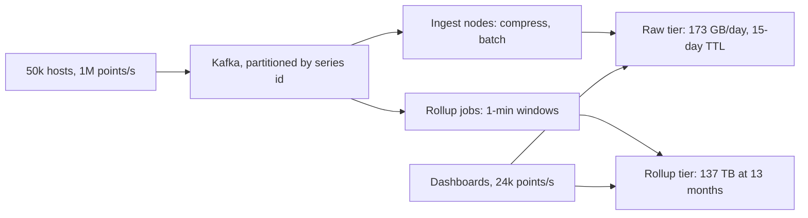

Two candidates are asked to design a photo-sharing service. One says "we'll need a CDN and a sharded database". The other says "20 million uploads a day at 3 MB is 60 TB a day of originals, so the object store is the whole storage design; the metadata is 10 GB a day and fits one Postgres for years". The second candidate has not said anything cleverer. They have said something checkable, and the checkable sentence tells the interviewer where the design will spend its complexity budget and where it will not.

Estimation is not about the right number. It is about the right order of magnitude, fast enough for the design to depend on it, with the assumptions stated so the interviewer can change one and watch you re-derive.

## The reference numbers, and where they come from

Carry these as orders of magnitude. The provenance column is what lets you defend a number when challenged, and tells you what it depends on.

| Operation | Rough cost | Where the number comes from |
|---|---|---|
| L1 cache hit | ~1 ns | About 4 cycles at 3–4 GHz; the "latency numbers every programmer should know" table (Norvig, 2001; popularised by Jeff Dean) |
| Main memory reference | ~100 ns | DRAM latency of 60–100 ns on current servers; a pointer chase costs about 100 L1 hits |
| Compress 1 KB (LZ4, Snappy) | ~1–2 µs | These codecs run at 0.5–1 GB/s per core |
| Read 1 MB sequentially from memory | ~50 µs | 10–20 GB/s for one thread |
| NVMe random 4 KB read | ~20–100 µs | Local flash; cloud network block storage is 0.5–1 ms |
| Durable write (write + fsync) | 0.05–5 ms | Measured 4.2 ms median on this lesson's workstation (WSL2 virtual disk, snippet below); NVMe with power-loss protection acknowledges in tens of µs; cloud block volumes ~1 ms |
| Read 1 MB sequentially from NVMe | ~0.3–1 ms | 1–3 GB/s sequential |
| HDD seek | ~5–10 ms | Half a rotation at 7,200 rpm is 4.2 ms, plus arm movement |
| Round trip, same availability zone | ~0.1–0.5 ms | Switch hops plus both kernels' network stacks |
| Round trip, across AZs in a region | ~0.5–2 ms | AWS places AZs within about 100 km of each other |
| Round trip, US East to US West | ~60–70 ms | ~4,000 km; light in fibre covers ~200 km per ms, so 40 ms is the floor and real routes are longer |
| Round trip, US East to Western Europe | ~70–90 ms | New York to London is 5,570 km: a 56 ms floor |
| Round trip, US to Australia | ~150–200 ms | Pacific cable paths of 12,000+ km |
| Send 1 MB over 1 Gbps | ~8 ms | Serialisation alone, before RTTs and TCP slow start |
| Redis `GET` from a service | ~0.2–0.5 ms | The RTT; Redis executes a `GET` in about a microsecond |
| Postgres primary-key lookup | 0.13 ms | Measured: one connection over a Unix socket, warm buffer pool, Postgres 17 |
| Postgres single-row commit | 2.9 ms | Measured: one connection, `synchronous_commit = on`; 0.1 ms with it off |

Two facts fall out and are worth saying when relevant. The round trip dominates almost every request: five sequential same-AZ calls cost 1–2 ms before any work. And a cross-region call costs as much as a hundred same-AZ calls, which is why multi-region designs replicate data rather than call across an ocean on the hot path. [Latency, bandwidth and the math](/learn/networking/networking-in-practice/latency-bandwidth-and-math) derives the network numbers.

```viz
{"type": "system", "scenario": "request-flow", "title": "Where a request spends its time",
 "caption": "Load balancer to service ~0.5 ms, service to cache ~0.5 ms, cache miss to database ~1 ms, and the client's own RTT of 20–200 ms on top. The database is rarely the slowest hop; the geography is."}
```

### Units

- $2^{10} \approx 10^3$, $2^{20} \approx 10^6$, $2^{30} \approx 10^9$, $2^{40} \approx 10^{12}$.
- A day is 86,400 s: round to $10^5$ and you are 14% low, which is within the noise. A month is $2.6 \times 10^6$ s; a year $3.2 \times 10^7$ s.
- A UUID is 16 bytes binary or 36 as text; a timestamp or 64-bit integer 8 bytes; an IPv4 address 4.
- A thumbnail is 10–50 KB; a phone photo 2–5 MB; a minute of 1080p streaming video 50–100 MB; a short post with metadata ~500 B.

### Throughput ceilings

| Component | Ceiling per node | Provenance and what it depends on |
|---|---|---|
| Stateless HTTP service | 1,000–10,000 rps | CPU per request: 1 ms of CPU on 8 vCPUs is 8,000 rps at 100% |
| Postgres primary-key reads | 53,000/s at 32 connections, 69,000/s at 90 | Measured with `pgbench -S` on a 32-thread workstation; scales with cores, so roughly a quarter on 8 vCPUs |
| Postgres single-row commits | 343/s on 1 connection, 3,800/s on 16, 16,000/s on 64 | Measured; concurrent commits share one fsync (group commit); batching many rows per transaction goes far higher |
| Redis / Memcached | ~100,000–200,000 simple ops/s per instance | One read and one write system call per unpipelined request; pipelining reaches over a million |
| Kafka partition | tens of MB/s | A partition is a sequential log on one broker; a broker carries hundreds of MB/s across partitions |
| S3 | 3,500 writes/s and 5,500 reads/s per key prefix | AWS's documented per-prefix rates; aggregate throughput scales with prefixes |

Rule of thumb: within 3× of a ceiling, design for it; 10× under, do not.

## Under the hood: why these numbers are what they are

**Commits cost an fsync.** A database acknowledges a commit only when its write-ahead log record is on stable storage, so the floor for serial commits is one device flush. Measure it yourself:

```python
import os, statistics, tempfile, time

def fsync_latency(n=500, size=4096):
    """Append `size` bytes and fsync, n times; return (median_ms, p99_ms)."""
    fd, path = tempfile.mkstemp(dir=".")
    buf = os.urandom(size)
    samples = []
    try:
        for _ in range(n):
            t0 = time.perf_counter()
            os.write(fd, buf)
            os.fsync(fd)                 # returns when the device reports the data durable
            samples.append((time.perf_counter() - t0) * 1000)
    finally:
        os.close(fd)
        os.remove(path)
    samples.sort()
    return statistics.median(samples), samples[int(0.99 * (n - 1))]

med, p99 = fsync_latency()
print(f"median {med:.2f} ms, p99 {p99:.2f} ms -> at most {1000 / med:,.0f} serial commits/s")
```

On this lesson's workstation it printed a 4.2 ms median: at most about 240 serial durable writes a second. Postgres's measured 2.9 ms commit matches that order.

**Group commit is why concurrency raises write throughput.** When a backend flushes the WAL up to its commit record, every other commit record already in the WAL buffer becomes durable in the same flush. The measurement shows it: 1 connection, 343 commits/s at 2.9 ms each; 16 connections, 3,800/s at 4.2 ms; 64 connections, 16,000/s at 4.0 ms. Latency stayed flat while throughput grew 47×, because each flush carried more commits. `commit_delay` makes a backend wait briefly to gather more, which helps only on slow devices.

**Reads saturate CPU, then queue.** One connection did 7,700 primary-key lookups a second, 0.13 ms each; 32 connections did 53,000/s at 0.6 ms; 90 connections did 69,000/s at 1.3 ms. Past about one connection per hardware thread, throughput grew 30% while latency doubled. That is Little's law (in flight = rate × latency) meeting a CPU limit, and it is the numeric argument for small connection pools in [Database scaling](/learn/system-design/building-blocks/database-scaling).

**Redis is bounded by system calls, not data structures.** Commands execute on one thread in microseconds, but each unpipelined request costs a read and a write system call plus a network round trip. Pipelining amortises the calls, and I/O threads (Redis 6 and later) move socket work off the main thread.

**Distance is physics.** Light in fibre travels at about two-thirds of its vacuum speed, 200 km per millisecond, so every 100 km of path adds at least 1 ms of round trip. No protocol removes it; only moving data closer does.

## The derivation pattern

1. **Get the driving number.** DAU, writes per day, events per second. If it is not given, ask; if the answer is "you tell me", say "I'll assume 10 million DAU; tell me if that is off by 10×".
2. **Convert to per second, then peak.** Divide by $10^5$; multiply by a peak factor: 2–3× for global consumer traffic, 5–10× for a daily spike or a broadcast event.
3. **Multiply out each dimension separately.** Reads and writes; storage as items × bytes × replication × retention; bandwidth as requests × payload.
4. **Compare to a ceiling and name the consequence.** "400 writes/s: one Postgres. 40,000 writes/s: shard or use a log-structured store."

Round at every step: 1.7 becomes 2, $2.6 \times 10^6$ becomes $3 \times 10^6$. Precision you cannot defend slows you down.

## Estimate 1: a social feed

| Assumption | Value |
|---|---|
| Users | 300M monthly, 150M daily |
| Behaviour | 0.5 posts and 10 feed loads per daily user per day; 20 posts per feed page |
| Graph | 200 followers on average; accounts above a threshold are fanned out on read |
| Sizes | 1 KB stored per post with indexes; 8-byte post IDs in feeds, ~10 B each in a Redis list |
| Capacity | 1,000 feed loads/s per 8-vCPU app server; 50 GB usable per 64 GB Redis node |
| Peak factor | 2.5 |

| Quantity | Arithmetic | Result |
|---|---|---|
| Posts | 75M/day ÷ 86,400 × 2.5 | 870/s average, 2,200/s peak |
| Feed loads | 1.5B/day ÷ 86,400 × 2.5 | 17,000/s average, 43,000/s peak |
| Fan-out inserts | 2,200 × 200 | 434,000/s peak: an in-memory number, not a Postgres one |
| Post reads | 43,000 × 20 | 870,000/s: a post cache with multi-get, never joins |
| Feed memory | 150M users × 800 entries × 10 B | 1.2 TB |
| Post storage | 75M × 1 KB | 75 GB/day, 27 TB/year, 82 TB with 3 copies |
| Egress | 43,000 × 20 × 1 KB | 870 MB/s, 7 Gbit/s before gzip, ~2 Gbit/s after |

**Bill of materials:** 44 app servers for peak, 66 so that losing one of three zones still carries it; 24 Redis primaries plus 24 replicas for feeds (1.2 TB ÷ 50 GB), each primary taking ~20,000 ops/s; about 6 post-cache nodes; posts sharded across 8 Postgres primaries with 2 replicas each for the first year, at about 4 TB per shard, and 7 more shards' worth of data every year. The feed cache is the most expensive line, so say it: capping feeds for inactive users, and not fanning out to users absent for 30 days, is the first cost cut.

## Estimate 2: photo uploads

| Assumption | Value |
|---|---|
| Users | 10M daily; 2 uploads and 50 views per user per day |
| Sizes | 3 MB original; 30 KB thumbnail and 200 KB display rendition |
| Peaks | 5× for uploads (evenings), 3× for views |
| Processing | ~0.2 s of CPU to decode a 12 MP JPEG and write two renditions with a libvips-class library |
| Prices | Object storage on the order of $0.02 per GB-month at list price |

| Quantity | Arithmetic | Result |
|---|---|---|
| Uploads | 20M/day ÷ 86,400 × 5 | 230/s average, 1,200/s peak |
| Ingest bandwidth | 1,200 × 3 MB | 3.5 GB/s, 28 Gbit/s: clients upload straight to object storage with pre-signed URLs |
| Storage | 20M × (3 MB + 230 KB) | 65 TB/day, 24 PB/year |
| Storage cost | 24 PB × $0.02/GB-month | ~$470,000/month by year end |
| Resize CPU | 1,200 × 0.2 s | 240 cores at peak: 30 workers of 8 vCPUs, 40 with headroom, scaled on queue depth |
| Metadata | 20M rows × 500 B | 10 GB/day, 3.7 TB/year: one primary with replicas |
| Views | 500M/day ÷ 86,400 × 3 × 200 KB | 17,000/s peak, 3.5 GB/s (28 Gbit/s) at the CDN edge |
| Origin | 5% CDN misses | 870 req/s, 174 MB/s (1.4 Gbit/s) |

```viz
{"type": "network", "scenario": "cdn-cache", "title": "The CDN absorbs the read bandwidth",
 "caption": "At 17,000 image reads per second and 200 KB each, the edge serves about 3.5 GB/s while the origin sees only the 5% that miss. The origin's capacity is set by the miss rate, not the user count."}
```

**Bill of materials:** ~10 API servers (signing URLs and writing metadata), 40 resize workers, one Postgres primary and two replicas, 28 Gbit/s of CDN edge at peak and 1.4 Gbit/s of origin, and an object store growing 65 TB a day. The dominant cost is storage: moving originals to an infrequent-access or archive tier after 30 days (a quarter to a tenth of the price) is a requirement, not an optimisation.

## Estimate 3: a metrics pipeline

| Assumption | Value |
|---|---|
| Sources | 50,000 hosts × 200 metrics every 10 s; flat, no peak factor |
| Wire format | ~40 B per point uncompressed (series ID, timestamp, value, framing); 4× compression in Kafka |
| Stored size | Facebook's Gorilla paper reports 1.37 B per point with delta-of-delta timestamps and XOR-encoded floats; plan 2 B with index overhead |
| Rollups | 1-minute min, max, sum, count per series at ~2 B per value |
| Retention | Raw 15 days, rollups 13 months, 3 copies of each |
| Capacity | ~250,000 points/s per ingest node, an order-of-magnitude figure that varies widely by engine |

| Quantity | Arithmetic | Result |
|---|---|---|
| Ingest | 50,000 × 200 ÷ 10 | 1,000,000 points/s, continuously |
| Kafka | 1M × 40 B ÷ 4 × 3 copies | 30 MB/s of broker disk writes; 2.6 TB for 24 h of retention |
| Raw tier | 1M × 2 B × 86,400 × 15 × 3 | 2 MB/s; 7.8 TB |
| Rollup tier | 10M series ÷ 60 s × 4 values × 2 B × 13 months × 3 | 1.3 MB/s; 137 TB |
| Dashboard reads | 100 dashboards × 20 panels × 360 points ÷ 30 s | 24,000 points/s, 40× below ingest |

The rollup tier writes less per second than the raw tier and still holds 18× the data, because it keeps data 26× longer. The estimate caught what intuition misses: design the rollup schema to store only what dashboards query, and put it on object storage.

**Bill of materials:** 6 Kafka brokers, 6 ingest nodes (4 for throughput plus headroom), 7.8 TB of raw storage and 137 TB of rollups after 13 months, 40 MB/s of ingress.



## Estimate 4: driver locations, where memory is not the constraint

A ride-hailing app shows riders the cars near them and matches trips against where drivers are right now. It is the opposite shape to the feed: tiny state, relentless writes.

| Assumption | Value |
|---|---|
| Drivers | 3M online at the global peak, 1.5M averaged over the day |
| Updates | One GPS fix every 4 s per online driver; ~40 B stored (ID, coordinates, time, heading), ~150 B on the wire with framing and TLS |
| Readers | 500,000 riders on the map screen at peak, each polling for nearby cars every 10 s |
| Movement | 10 m/s in town; the geo index uses 1 km cells |
| History | Kept for trips only (about 40% of online time), for receipts, disputes and ETA models |

| Quantity | Arithmetic | Result |
|---|---|---|
| Location writes | 3M ÷ 4 s | 750,000/s, and this is already the peak |
| Nearby queries | 500,000 ÷ 10 s | 50,000/s: writes outnumber reads 15 to 1 |
| Ingress | 750,000 × 150 B | 112 MB/s, 0.9 Gbit/s |
| Live state | 3M × ~100 B including the index entry | 300 MB: fits on any machine |
| Cell changes | 40 m per update, so 25 updates per 1 km cell | 30,000 index moves/s; 96% of updates overwrite a position in place |
| If every update were a commit | 750,000 ÷ 16,000 group commits/s per Postgres primary | 47 primaries, for data superseded 4 s later |
| History log | 750,000 × 40 B × 3 copies | 90 MB/s of broker disk at peak |
| History stored | 375,000/s average × 40 B × 86,400 × 40% | 0.52 TB/day, ~190 TB/year per copy before compression |

The "does it fit in memory" check passes by three orders of magnitude and decides nothing. The design is set by the write rate and by how much durability each write deserves. A position is worthless four seconds later, so it gets no fsync: live state sits in memory, sharded by city or cell over about 8–15 Redis-class nodes (750,000 updates plus index maintenance, at 100,000–200,000 simple operations per node), and needs no replica for durability, because a lost shard refills from the next round of updates within 4 s. Only the history, which someone will ask for in a dispute, is durable, and it is written as batched appends to a log (30 MB/s before replication is a few Kafka partitions), never as a row per fix.

**Bill of materials:** ~20 ingest gateways holding 150,000 persistent connections each (37,500 updates/s per node), ~12 in-memory location shards, a Kafka cluster sized for 90 MB/s of disk writes, and 0.5 TB a day of trip history into object storage. The feed in Estimate 1 was sized by memory; this system, with a four-thousandth of the feed's memory, is sized by writes. The sentence: "750,000 ephemeral writes a second: memory, sharded by geography, no per-write durability; the durable part is a batched log."

```exercise
id: capacity-estimate
title: Build the estimate calculator
prompt: |
  Implement `estimate(dau, writes_per_user, read_write_ratio, peak_factor,
  bytes_per_write, retention_days, replication, rps_per_server)` returning an
  object with integer fields. Compute in this order so both languages agree:

  - `daily_writes = dau * writes_per_user`
  - `write_rps = ceil(daily_writes / 86400)`
  - `read_rps = ceil(daily_writes * read_write_ratio / 86400)`
  - `peak_rps = ceil(daily_writes * (1 + read_write_ratio) / 86400 * peak_factor)`
  - `storage_gb = ceil(daily_writes * bytes_per_write * retention_days * replication / 1e9)`
  - `servers = ceil(peak_rps / rps_per_server) + 1` (one spare so losing a server
    still carries the peak; use the integer `peak_rps`)

  Return `{"write_rps", "read_rps", "peak_rps", "storage_gb", "servers"}`.
languages: [python, javascript]
entry: estimate
starter:
  python: |
    import math

    def estimate(dau, writes_per_user, read_write_ratio, peak_factor,
                 bytes_per_write, retention_days, replication, rps_per_server):
        # your code here
        return {}
  javascript: |
    function estimate(dau, writes_per_user, read_write_ratio, peak_factor,
                      bytes_per_write, retention_days, replication, rps_per_server) {
      // your code here
      return {};
    }
tests:
  - args: [10000000, 2, 10, 3, 500, 365, 3, 2000]
    expected: {"write_rps": 232, "read_rps": 2315, "peak_rps": 7639, "storage_gb": 10950, "servers": 5}
  - args: [150000000, 0.5, 20, 2.5, 1000, 365, 3, 1000]
    expected: {"write_rps": 869, "read_rps": 17362, "peak_rps": 45573, "storage_gb": 82125, "servers": 47}
    label: feed-sized service
  - args: [1000000, 100, 0, 1, 200, 30, 2, 5000]
    expected: {"write_rps": 1158, "read_rps": 0, "peak_rps": 1158, "storage_gb": 1200, "servers": 2}
    label: write-only ingestion
  - args: [1000, 1, 1, 10, 100, 1, 1, 1000]
    expected: {"write_rps": 1, "read_rps": 1, "peak_rps": 1, "storage_gb": 1, "servers": 2}
    label: a tiny service still needs two servers
  - args: [86400, 1, 0, 1, 1000000, 1, 1, 1]
    expected: {"write_rps": 1, "read_rps": 0, "peak_rps": 1, "storage_gb": 87, "servers": 2}
    hidden: true
  - args: [500000000, 3, 50, 4, 300, 1825, 3, 4000]
    expected: {"write_rps": 17362, "read_rps": 868056, "peak_rps": 3541667, "storage_gb": 2463750, "servers": 887}
    hidden: true
hints:
  - "Round up with ceil at each step; a fractional server or request per second still needs a whole one."
  - "Compute servers from the already-rounded peak_rps, then add the spare."
```

## How wrong can an estimate be?

Every factor in an estimate is a guess. If each of four factors is within 2× of the truth, the product is within 16× only in the worst case, where every guess errs in the same direction; independent errors partly cancel. Simulated, with each factor's error drawn uniformly on a log scale between ½× and 2× and 100,000 trials per row:

| Factors multiplied | Median error | 90th percentile | 99th percentile | Worst case |
|---|---|---|---|---|
| 1 | 1.4× | 1.9× | 2.0× | 2× |
| 2 | 1.5× | 2.6× | 3.5× | 4× |
| 4 | 1.75× | 3.7× | 7.1× | 16× |
| 6 | 2.0× | 5.1× | 11.6× | 64× |

Errors multiply, so they add in log space, and the spread grows with the square root of the number of factors rather than linearly: a four-factor estimate lands within about 4× nine times in ten. Three consequences:

- **Fewer, better factors beat many.** Each guessed multiplier widens the band. One number from a comparable system's telemetry can replace three guessed ones.
- **Challenge the widest factor first.** Daily users are usually known to within 20%; per-post fan-out is not. The [news feed case study](/learn/system-design/case-studies/news-feed) simulates fan-out per post at 1.7× to 31× the average follower count, depending on a tail you must measure. When an interviewer asks "what if you're wrong?", name the factor with the widest band and the component it resizes.
- **Correlated errors do not cancel.** The model assumes independence. A launch plan whose every behavioural guess is optimistic in the same direction sits at the worst-case column, so run the estimate once with every factor at its pessimistic end and check which component breaks first.

## Peaks and tails that averages hide

**The peak factor depends on the rate.** Requests from many independent users arrive close to a Poisson process, whose count per second fluctuates by about its square root. The busiest second of a day, the 99.99th percentile of 86,400 seconds, computed from the Poisson distribution:

| Average rate | Busiest second (p99.99) | Ratio to the average |
|---|---|---|
| 10/s | 24 | 2.4× |
| 100/s | 139 | 1.39× |
| 1,000/s | 1,120 | 1.12× |
| 10,000/s | 10,374 | 1.04× |
| 100,000/s | 101,178 | 1.01× |

That is randomness alone, before the daily curve. A small service needs proportionally more headroom than a large one: a worker pool sized for exactly 10 jobs a second is overloaded for several seconds every day. Real traffic is burstier than Poisson (retries, cron jobs on the minute, push notifications landing at once), so treat the table as a floor.

**Fan-out turns rare slowness into common slowness.** A request that waits for N parallel calls is as slow as the slowest. If each call is slow 1% of the time, the chance of hitting at least one slow call is $1 - 0.99^N$: 1% for one call, 4.9% for 5, 18% for 20 and 63% for 100. Dean and Barroso's "The Tail at Scale" (2013) uses the 100-call case to motivate hedged requests ([Resilience patterns](/learn/system-design/building-blocks/resilience-patterns)). In Estimate 1, a page that hydrates 20 posts from 20 cache shards meets a slow shard on 18% of loads, so the per-shard p99, not its median, is the number to budget.

**Concurrency, not rate, sizes pools.** Little's law turns a rate into requests in flight: 43,000 feed loads a second at 50 ms each is 2,150 in flight, 33 per server across 66 servers, which sizes each server's threads and cache connections ([Scalability primitives](/learn/system-design/building-blocks/scalability-primitives)).

## Presenting estimates in the room

- **State assumptions as you make them and invite correction:** "500 bytes per row; if URLs are longer, storage scales linearly and nothing else changes."
- **Round loudly:** "call it $10^5$ seconds a day" shows you know what precision is worth.
- **Sanity-check against something known:** a billion 8-byte IDs is 8 GB, fine on one Redis node; a billion 500-byte values is 500 GB, not on one node.
- **End with the consequence:** "so one Postgres, no sharding" or "so feeds cannot be joins at read time".
- **Keep it to five minutes:** two or three numbers that choose the architecture, not ten.

## Cost per request

You do not need price sheets memorised; you need a way to reason.

- An 8 vCPU, 32 GB cloud VM costs on the order of $300 a month. At 2,000 rps that is 5 billion requests a month, about $0.06 per million requests of compute.
- Object storage is on the order of $0.02 per GB-month; RAM in a managed cache is roughly 100× that per byte. A terabyte in Redis costs thousands a month; in S3, about $20. That ratio is why caches hold the hot few per cent, not everything.
- Internet egress is charged per GB, often $0.05–0.09 at list price. The photo service's edge traffic averages 1.2 GB/s (a third of its peak), about 3 PB a month: a CDN contract, not a line item.

The sentence to say: "The dominant cost is X; the design minimises X even at the expense of Y." For the photo service X is storage, for the feed the Redis fleet, for metrics the rollup tier.

## Ways to get a number

| Source | Time to get | Typical accuracy | Use when |
|---|---|---|---|
| Arithmetic from DAU and behaviour | Minutes | Within 3× | Interviews, first design review |
| A comparable system's telemetry | An hour | Within 2–5× | A new product shaped like an existing one |
| Component microbenchmark (`pgbench`, `redis-benchmark`) | Hours | Good for the component, optimistic for the system | Before trusting a ceiling |
| Load test of the real service | Days | Within 20–30% | Before a launch or a large event |
| Production telemetry | Continuous | Exact for today's traffic | Capacity planning and cost work |

## Failure modes

| Failure | Symptom | Diagnosis | Fix |
|---|---|---|---|
| Sized for the average | Falls over at the lunchtime or broadcast peak | The estimate has no peak factor | State average and peak; design for peak with a zone's worth of headroom |
| Storage without copies | Disks fill a year early | Rows × bytes only, no replicas, indexes or bloat | Multiply by replication; add 30–100% for indexes; the measured `links` table carried 18% index overhead with a single key |
| Means in latency budgets | p99 target missed with every hop "at 2 ms" | Averages summed | Budget per-hop p99s; five calls each slow 1% of the time make about 5% of requests slow |
| Fan-out counted once | The feed store melts on launch | Writes counted per post, not per copy | Trace one write through every component and count copies |
| Wrong unit | A 1 Gbps link "carrying" 10 GB/s | Bits versus bytes (8×), per day versus per second (86,400×) | Sanity-check every result against the ceilings table |
| Benchmarks as ceilings | Production does a third of the benchmark | Microbenchmark on warm cache, local socket, no contention | Treat benchmarks as upper bounds; load test the real path |
| Small service sized for its average | A worker pool built for 10 jobs/s falls behind for seconds several times a day | Per-second arrival counts show bursts over twice the average that the per-minute graph smooths away | Size from the Poisson peak, or put a queue in front that absorbs bursts |
| Durability for ephemeral data | A location or presence service needs dozens of database primaries | Every update is a commit, though the next update supersedes it within seconds | Keep superseded state in memory; make only the history durable, as batched log appends |

## Interviewer follow-ups

**"Your feed needs 434,000 fan-out inserts a second. How do you serve that, and what does it cost?"** Model answer: per-user lists in a Redis cluster partitioned by user ID; each fan-out is `LPUSH` plus `LTRIM`, microseconds of Redis work, pipelined from fan-out workers. Spread over 24 primaries that is about 20,000 ops/s each with the feed reads, so memory (1.2 TB), not throughput, sets the node count, and it is the largest cost; skipping dormant users cuts both. Common wrong answer: "Postgres with a good index", at 434,000 inserts a second.

**"You assumed a 95% CDN hit ratio. What if it's 70%?"** Model answer: origin requests go from 870/s to 5,200/s and origin egress from 174 MB/s to 1 GB/s; the origin fleet grows about 6× and viewers' p99 rises by the origin round trip. The ratio depends on how long-tailed viewing is: a feed of recent photos stays above 95%, archive browsing does not. Measure it in week one. Common wrong answer: "about the same, 70% is still most of it", ignoring that origin load scales with the miss rate, which went from 5% to 30%.

**"Where does your Postgres write ceiling come from, and when is it wrong?"** Model answer: from the WAL flush: one connection is bounded by fsync latency (measured 2.9 ms, 343 commits/s), and group commit lets concurrent commits share a flush (16,000/s at 64 connections on the same machine). It is wrong upwards for batched inserts (thousands of rows per commit) and downwards for contended rows or many secondary indexes. Common wrong answer: a single number with no mechanism, such as "Postgres does 10,000 writes a second".

**"Give me the cost per user per month."** Model answer: take the dominant cost and divide: photo storage at year end is ~$470,000/month for 10 million daily users, about 5 cents each, before egress, which decides whether the product can be ad-funded. Common wrong answer: summing every component to the dollar, which takes ten minutes and hides the one line that matters.

**"Your estimate turns out 10× low after launch. What do you check first?"** Model answer: the factors with the widest error band and the most leverage: per-post fan-out, the peak factor, and bytes per item including indexes and replicas; daily users are rarely the culprit. Then which component the error resizes: 10× more posts is a worker count and a queue, a scaling knob; 10× more fan-out per post resizes the feed cache, the most expensive line. A good estimate names in advance the assumption that, if wrong, forces a redesign. Common wrong answer: "we would scale out", without saying what, or whether the design survives it.

**"750,000 location updates a second: Postgres, Cassandra or Redis?"** Model answer: none of them as a durable write per update. A position is superseded in 4 s, so per-update durability buys nothing and would take about 47 Postgres primaries at the measured group-commit rate. Live positions go in memory, sharded by geography, and refill themselves from the next updates after a node loss; history goes to a log in batches. Cassandra would absorb the rate but spends commit-log writes and compaction on data nobody reads again. Common wrong answer: picking the store with the best write benchmark and writing every fix to it.

## What mid-level engineers get wrong

- Quoting numbers without a unit of time ("a million requests") or without the peak.
- Carrying a 2009 latency table uncritically: cloud block storage is closer to 1 ms than to the table's SSD figure.
- Treating a benchmark on a Unix socket with a warm cache as production capacity.
- Forgetting replication and indexes, then running out of disk.
- Spending twelve minutes on precise arithmetic that changes no decision.
- Estimating everything instead of the two or three numbers that choose the architecture.
- Checking only whether the data fits in memory, when the write rate and the durability each write needs set the node count.
- Presenting the product of every factor's worst case as the estimate, or a six-factor estimate as accurate to 10%; the honest band for four factors each within 2× is about 4×.

## Senior signals

- You know the latency table as orders of magnitude and say where a number comes from and what it depends on.
- You can explain a write ceiling from fsync and group commit, and a read ceiling from cores and Little's law.
- Every estimate ends in a bill of materials and a design consequence; you never estimate for its own sake.
- You count every copy of a write, state a peak factor, and name the dominant cost.
- You state assumptions as invitations to correct them and re-derive instantly.
- You know how error compounds, challenge the widest factor first, and add headroom for Poisson bursts on small services and fan-out tails on large ones.
- You say "one machine" when the numbers say so. [Capacity planning and cost](/learn/system-design/senior-design-skills/capacity-planning-and-cost) extends this into growth modelling.

## Check yourself

```quiz
- q: >-
    An estimate multiplies four independent factors, each within 2x of the truth. How far off is the product likely to be?
  options: ["Within 2x, since no factor is off by more than 2x", "Within about 16x, because the four 2x bounds multiply", "Within about 8x, since four 2x errors add up linearly", "Within about 4x in 90% of cases; errors partly cancel"]
  answer: 3
  explanation: >-
    Errors multiply, so they add on a log scale, and independent errors partly cancel: the spread grows with the square root of the number of factors. The simulation put the 90th percentile at 3.7x. 16x is the worst case, where every factor errs in the same direction, which is why correlated optimism is the real danger.
- q: >-
    One Postgres connection commits 343 single-row transactions a second with fsync on. With 64 connections it commits about 16,000 a second at nearly the same latency. What explains this?
  options: ["The 64 connections write to 64 separate WAL files", "Postgres switches to asynchronous commit under load", "Concurrent commits share one WAL flush to disk", "The operating system caches the WAL and skips fsync"]
  answer: 2
  explanation: >-
    Group commit: when one backend flushes the WAL up to its commit record, every commit record already in the buffer becomes durable in the same flush, so throughput grows with concurrency while latency stays near one flush. Postgres never silently drops durability, and there is a single WAL stream.
- q: >-
    A request makes five sequential calls, each with a p50 of 2 ms and a p99 of 20 ms. What is the best statement about the request's latency?
  options: ["p99 is about 10 ms, because five calls at 2 ms each add up", "p99 is 20 ms or more; about 5% of requests hit a slow call", "p99 is under 20 ms, since the tails average out over five calls", "p99 is exactly 100 ms, because five calls at 20 ms each add up"]
  answer: 1
  explanation: >-
    With five independent calls, the chance that at least one is in its slowest 1% is about 5%, so the request's tail contains at least one slow call. Budget with p99s; summing means is the mistake, and summing five p99s assumes every call is slow at once.
- q: >-
    A feed estimate shows 2,000 posts per second and 200 average followers. Which conclusion follows?
  options: ["Fan-out makes it ~400,000 inserts/s, so feeds need an in-memory store", "Storage is the bottleneck, so the posts table must be sharded first", "Postgres handles 2,000 writes/s, so a single database is enough", "The system is read-dominated, so a CDN is the main component to size"]
  answer: 0
  explanation: >-
    Counting every copy of a write gives 2,000 x 200 = 400,000 inserts a second, an in-memory number. Users with millions of followers would produce millions of inserts per post, which is why real feeds fan out on read for them. The 2,000 posts/s figure alone is misleading.
- q: >-
    A metrics pipeline writes 2 MB/s of raw points kept 15 days and 1.3 MB/s of rollups kept 13 months. Which tier dominates storage?
  options: ["Neither, since both tiers end up at about the same size", "The raw tier, because it writes more bytes every second", "The rollup tier, because it is kept 26 times longer", "The raw tier, because raw points compress worse than rollups"]
  answer: 2
  explanation: >-
    Stored bytes are rate times retention: 2 MB/s for 15 days is about 2.6 TB, while 1.3 MB/s for 395 days is about 46 TB before replication. Retention, not write rate, decides storage, which is why the rollup schema should keep only what dashboards query.
- q: >-
    Which is the most useful sentence to end an estimate with?
  options: ["\"So we need to scale horizontally across several regions.\"", "\"So the total is exactly 4,217 requests per second at peak.\"", "\"So one replicated Postgres with a cache fits; no sharding.\"", "\"So the numbers are large enough to need careful design.\""]
  answer: 2
  explanation: >-
    An estimate exists to change a decision. Naming the decision and the thing you will not do is the senior move; a precise number with no consequence, or a vague "scale horizontally", shows the arithmetic was ritual.
```
