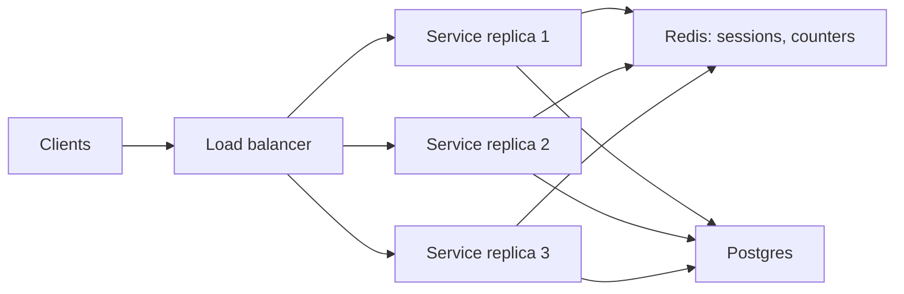

Your single application server handles 800 requests per second at 60% CPU. Marketing has a campaign next week that will triple traffic. You can buy a bigger machine, or you can run three of the current one behind a load balancer. The second option sounds obviously better until you ask where the user's shopping cart lives (in the process memory of server one), what happens when the load balancer sends the user's next request to server two (cart gone), and what the three servers do to the one database they all share (triple the connections, and the database, not the application, becomes the bottleneck).

Horizontal scaling is a set of disciplines rather than a feature. This lesson is those disciplines: making services stateless so any replica can serve any request, putting a load balancer in front that spreads load and routes around failure, adding capacity automatically without making things worse, and doing the arithmetic that says how many replicas you actually need.

## Vertical first, then horizontal

Vertical scaling (a bigger machine) is underrated in interviews. A server with 64 cores and 512 GB of RAM is a lot of computer, and a database that fits in memory on one will outperform a sharded cluster of small nodes on latency and operational cost. The limits are hard, though: there is a biggest machine you can buy, it is one failure domain, and its price grows faster than linearly at the top end.

Horizontal scaling (more machines) has no ceiling in principle and gives fault tolerance for free, at the price of three problems this lesson is about: state has to live somewhere shared, something has to distribute requests, and the shared things (database, cache) now get the aggregate load. Interviewers want to hear vertical scaling taken seriously for the database and horizontal scaling by default for stateless compute.

## Stateless services

A service is stateless when no request depends on which replica served a previous request. Practically, that means the process holds nothing between requests that another replica would need: no sessions, no user-scoped caches that must be coherent, no local files that later requests read, no in-memory counters that mean anything. Every replica is interchangeable, which is the property that makes the load balancer, autoscaling and rolling deploys all work.

State does not vanish; it moves. There are three places for it:

| Where the state goes | Latency to reach it | Good for | Bad for |
|---|---|---|---|
| **The database** | 1–5 ms | Anything durable: orders, profiles, carts that must survive a crash | Per-request hot data at high QPS |
| **A shared cache** (Redis, Memcached) | ~1 ms | Sessions, rate-limit counters, precomputed views | Data you cannot afford to lose on eviction |
| **The client** (signed cookie, JWT) | 0 ms, it arrives with the request | Identity, small preferences, a few hundred bytes | Anything that must be revocable instantly, anything large |

The client-token option deserves attention because it is the one that makes the service *truly* stateless. A signed session token carries the user ID and expiry; any replica can verify the signature with a shared key and needs no lookup at all. The cost: you cannot revoke a token before it expires without a server-side deny list, which reintroduces state. Short expiry (minutes) with a refresh token is the usual compromise. [Security in design](/learn/system-design/building-blocks/security-in-design) covers the trade-off in depth.

In-process caches are allowed in a stateless service as long as they are *only* an optimisation: if a replica loses its cache the request still succeeds, just slower. What is not allowed is correctness depending on the cache being coherent across replicas.



Look at the fan-in on the right. Three replicas is fine; thirty replicas each holding a pool of twenty connections is 600 database connections, and Postgres allocates a process per connection. This is the shape of the horizontal scaling limit: the stateless tier scales out cleanly, and everything it talks to gets the sum. [Connection management](/learn/databases/storage-and-scale/connection-management) is where that bill comes due; a connection pooler such as PgBouncer sits between the fleet and the database for exactly this reason.

## Load balancers

A load balancer does three jobs: it presents one address for many replicas, it chooses a replica per request or per connection, and it stops sending traffic to replicas that are unhealthy. The choice of layer decides what it can see.

**Layer 4** (transport) balancers work on TCP connections: they see IP addresses and ports and forward bytes without parsing them. They are fast (millions of connections, negligible added latency), cheap, and blind: they cannot route by URL path, cannot retry a failed HTTP request, and balance *connections*, not requests, which matters when connections are long-lived.

**Layer 7** (application) balancers terminate HTTP (and usually TLS). They see the path, headers and cookies, so they can route `/api/*` to one pool and `/static/*` to another, retry idempotent requests against another replica, add tracing headers, and balance individual requests even over a single keep-alive connection. They cost more CPU per request and add on the order of a millisecond, which is almost always worth it for HTTP services. [Load balancing](/learn/networking/application-protocols/load-balancing) covers the L4/L7 mechanics in depth.

### Choosing a replica

| Algorithm | Mechanism | When it wins | When it fails |
|---|---|---|---|
| Round robin | Next replica in the list, cyclically | Uniform requests, uniform replicas | Requests that vary 100× in cost; one slow replica keeps getting its share |
| Weighted round robin | Round robin with replica weights | Mixed instance sizes, canary releases at 1% | Weights go stale as load changes |
| Least connections | Replica with fewest in-flight requests | Variable request cost; slow replicas automatically get less | Needs per-replica state in the balancer; L4 "connections" are not requests |
| Least response time / peak EWMA | Weight by recent observed latency | Heterogeneous or degrading replicas | Feedback loops if latency is measured badly |
| Consistent hashing on a key | Same key always goes to the same replica | Cache-affinity, session-heavy legacy apps | Hot keys; a replica change remaps 1/N of keys |
| Random with two choices | Pick two at random, send to the less loaded | Many balancers with no shared state | Nothing serious; this is the default for a reason at large scale |

```viz
{"type": "network", "scenario": "load-balancer-least-conn", "title": "Least connections routes around a slow replica",
 "caption": "A replica whose requests take three times longer accumulates in-flight connections and stops receiving new ones. Round robin would keep feeding it a third of the traffic and a third of all users would see the slowness."}
```

The important observation, visible in the animation: least-connections is a *health signal in disguise*. A replica that is slow (garbage collection pause, noisy neighbour, a cold cache) drains itself of new traffic without anyone marking it unhealthy. Round robin has no such feedback, which is why it is fine for ten identical replicas and wrong for a hundred replicas of varying age and load.

### Health checks

Active health checks hit an endpoint (`/healthz`) every few seconds and remove a replica after N consecutive failures; passive checks watch real traffic and eject a replica after a burst of 5xx or connection errors. Both are needed. The design decision is what `/healthz` checks: only "the process is up" (shallow), or "the process can reach its database and cache" (deep). Deep checks catch more, and they cause a classic outage: the database has a hiccup, every replica's deep check fails simultaneously, the load balancer marks the entire fleet unhealthy, and the site is down even though the database recovered in two seconds. The usual compromise is a shallow liveness check for the balancer and a deep readiness check that only gates *new* replicas joining the pool.

### Connection draining

When a replica is removed (deploy, scale-in, failure), in-flight requests should finish. The balancer stops sending new connections, waits up to a drain timeout (typically 10–60 s), then closes. Without draining, every deploy produces a small burst of errors, and if you deploy fifty times a day that is a visible error budget line.

## Session affinity, and why you avoid it

Sticky sessions make the balancer send a given client to the same replica, usually by cookie. They exist to make stateful legacy applications work behind a balancer, and they undermine what horizontal scaling gives you: load is only as balanced as the client population, a replica failure logs out every user on it, scaling in kills sessions, and deploys become a session-migration exercise. If a design needs affinity, the question is "what state is on the replica, and why is it not in Redis?" The exceptions are narrow (WebSocket connections are pinned by nature; some cache-heavy workloads benefit from key affinity) and even then the affinity is an optimisation the system must survive losing.

## Autoscaling

Autoscaling adds and removes replicas based on a metric. It sounds simple and it is a control loop, with all the pathologies of control loops.

**The metric.** CPU utilisation is the default and it is wrong for I/O-bound services, where a replica can be at 20% CPU with every thread blocked on the database. Better signals are request concurrency (in-flight requests per replica), queue depth for workers, or p99 latency against a target. Target-tracking on concurrency ("keep 50 in-flight per replica") is the most robust general choice because it is what Little's law (below) actually sizes.

**The delays.** A new replica takes time to exist: 30–120 s for a VM, 5–30 s for a container, plus application start-up and cache warming. Traffic spikes take seconds. Autoscaling therefore cannot handle a spike; it handles a *ramp*. For spikes you need headroom (run at 50% of capacity, not 80%) or a warm pool of pre-provisioned replicas.

**Cooldowns and hysteresis.** Scale-out and scale-in must have different thresholds and different cooldowns (scale out fast, scale in slowly, e.g. after 10 minutes below threshold) or the fleet oscillates: add replicas, load per replica drops, remove replicas, load rises, repeat.

**Scale-in is the dangerous direction.** Removing 30% of replicas because the last ten minutes were quiet means the next spike hits a smaller fleet, and the replicas removed take their warm caches with them. Cap scale-in to a small percentage per step, and never scale in during a deploy.

**The thundering herd on scale-out.** Ten new replicas start simultaneously, each opens twenty database connections and warms its cache with the same queries. The database sees 200 new connections and a burst of cold reads at the exact moment it is already under load, which is why scaling was triggered. Stagger start-up, use a connection pooler, and warm caches lazily.

## Sizing with Little's law

Little's law says that for any stable system, the average number of items in it equals the arrival rate times the average time each spends inside:

$$L = \lambda W$$

For a service: in-flight requests = requests per second × average latency in seconds. It is the single most useful equation in capacity planning because it links the three things you can measure.

**Worked example: thread pool.** A service receives 2,000 rps, and each request takes 50 ms of wall-clock time (most of it waiting on the database). In-flight = $2{,}000 \times 0.05 = 100$ requests at any moment. If each request occupies a thread, you need at least 100 threads across the fleet; with a 2× headroom for variance, 200. At 20 threads per replica, that is 10 replicas. If latency doubles to 100 ms because the database slows, in-flight doubles to 200, the pools fill, and requests queue: this is why latency degradation turns into unavailability, and why the thread pool size is also a load-shedding limit.

**Worked example: connection pool.** The same service makes one database call per request, averaging 5 ms. Concurrent database calls = $2{,}000 \times 0.005 = 10$. A pool of 10–20 connections across the fleet is enough; the 600-connection fleet from earlier is 30× oversized, and each idle connection still costs the database memory. This is the argument for a small pool per replica plus a pooler, and for treating the pool size as a capacity number derived from λW, not a default copied from a tutorial.

**Worked example: what a slow dependency does.** One downstream call goes from 5 ms to 500 ms (a timeout). Concurrent calls to it become $2{,}000 \times 0.5 = 1{,}000$. If your pool caps at 200, 800 requests per second are rejected or queued. That is the mechanism behind "one slow service took down the site", and the mitigation is a timeout that bounds W, a bulkhead that bounds L per dependency, and shedding the excess rather than queueing it. [Resilience patterns](/learn/system-design/building-blocks/resilience-patterns) works through each.

```viz
{"type": "system", "scenario": "bulkhead", "title": "Isolating a slow dependency",
 "caption": "Each dependency gets its own bounded pool. When the recommendations service slows to 500 ms, its pool fills and requests to it fail fast; the checkout pool next to it is untouched."}
```

## Where horizontal scaling stops

Add replicas and the stateless tier scales roughly linearly. The database does not, and every replica added moves the bottleneck toward it. The order in which you address that is a design decision interviewers probe directly:

1. Make the stateless tier do less to the database: cache reads, batch writes, fix N+1 queries.
2. Put a pooler in front to cap connections.
3. Add read replicas and route reads to them, accepting replication lag for reads that tolerate it.
4. Scale the primary vertically; it is the one place a bigger box is the right first move.
5. Only then partition. [Database scaling](/learn/system-design/building-blocks/database-scaling) is the next lesson for a reason.

A senior answer to "how do you scale this?" walks that list, with the number that triggers each step, rather than jumping to "shard it".

```viz
{"type": "system", "scenario": "request-flow", "title": "Aggregate load lands on shared components",
 "caption": "Every replica added to the stateless tier adds its connections, its cache misses and its write rate to the same database and cache. The load balancer distributes requests; nothing distributes the database."}
```

## Failure modes

**Health-check flapping.** A replica at the edge of its capacity times out the health check under load, is removed, recovers because it has no traffic, is re-added, and is overloaded again. Detection: replica membership churn in the balancer's logs. Mitigation: health-check timeouts longer than the p99 of the check, several failures before removal, and a health endpoint that does not do real work.

**Uneven load from long-lived connections.** With HTTP/2 or gRPC, a client opens one connection and multiplexes thousands of requests over it. An L4 balancer places the *connection* once, so a client that happens to land on replica three sends all its traffic there forever. Detection: per-replica QPS varies by 5–10× with equal weights. Mitigation: L7 balancing that spreads requests, or client-side load balancing with a max connection age (say 5 minutes) forcing periodic rebalancing.

**Retry storms during scale-out.** Capacity is short, requests time out, clients retry, load doubles, autoscaling is triggered but new replicas take 90 seconds, and the retries make the shortfall worse than the original spike. Detection: request rate rises faster than user activity. Mitigation: retry budgets on clients (no more than 10% of requests may be retries), exponential backoff with jitter, and load shedding at the balancer so excess requests fail fast instead of piling up. [Timeouts, retries and backoff](/learn/networking/networking-in-practice/timeouts-retries-and-backoff) has the arithmetic.

**Cold-start latency.** New replicas serve their first few hundred requests slowly: JIT warm-up, empty in-process caches, unopened connection pools. Under least-connections balancing they may even attract *more* traffic at first because they have zero in-flight. Detection: p99 rises on every scale-out event. Mitigation: readiness checks that warm the replica before it joins, slow-start ramping in the balancer (gradually increase a new replica's weight over 30–60 s).

**Cascading overload from one slow node.** With round robin, a replica in a 10-second GC pause still receives its share; those requests time out; clients retry against other replicas, which are now carrying 100% of the load plus retries. Detection: one replica's latency spikes and fleet-wide error rate follows. Mitigation: least-connections or latency-aware balancing, outlier ejection, and short per-request timeouts with a retry to a different replica.

**Shared dependency becomes the bottleneck.** The fleet doubles, the database saturates, adding replicas makes it worse. Detection: added capacity does not improve latency. Mitigation: the ordered list above, and an [I/O-bound vs CPU-bound](/learn/systems/performance-engineering/io-bound-vs-cpu-bound) diagnosis before scaling anything.

## Interviewer follow-ups

**Q: "Your service is at 70% CPU and latency is climbing. Do you add replicas?"**

First I would check whether the latency is coming from the replicas or from behind them: if database latency has doubled, adding replicas adds connections and makes it worse. The test is whether per-request latency changes with per-replica load; if it does not, the bottleneck is downstream. If the replicas are the bottleneck, yes, and I would look at why it took 70% CPU to notice: the autoscaling target should have fired at 50% with the scale-out lead time we have. I would also check whether this is a spike or a ramp, because for a spike autoscaling cannot help and I need headroom or load shedding today.

**Q: "Why not just use sticky sessions and keep the cart in memory? It is faster."**

It is faster for one request and slower for the business. A replica failure loses every cart on it; every deploy is a controlled version of that failure; scale-in becomes a decision about how many carts to drop; and load is as skewed as the users. Reading a cart from Redis costs about a millisecond, which is invisible next to the 50–100 ms of network RTT the user already pays. I would keep the cart in Redis keyed by session, with a write to the database on checkout, and I would treat any request for affinity as a symptom of state that has not been moved out yet.

**Q: "You said scale out fast and scale in slowly. Put numbers on that, and say what breaks if you get them wrong."**

Scale out when the concurrency target is exceeded for 30–60 seconds, by 20–50% of the current fleet per step, with a 2–3 minute cooldown that matches the replica start-up time so we do not double-provision. Scale in when utilisation is under half the target for 10–15 minutes, by no more than 10% per step, with a 10-minute cooldown. Too-fast scale-in produces oscillation and destroys warm caches ahead of the next spike; too-slow scale-out means the spike is served by timeouts and retries, which multiply the load. If I had to choose one direction to be wrong in, it is over-provisioned, because compute is cheaper than an outage.

**Q: "You have 40 replicas each with a 20-connection pool and the database has max_connections=500. Now what?"**

800 wanted, 500 available, and the database is spending memory on every one. Little's law says how many I actually need: at 2,000 rps and 5 ms per query, about 10 concurrent connections, so the pools are 80× oversized. I would put PgBouncer in transaction-pooling mode in front with a server-side pool of 50–100, and drop each replica's pool to 5. The trap is that per-replica pools must still cover the replica's share of concurrency at peak plus the tail: at 50 rps per replica and 5 ms that is 0.25 average, but the p99 query at 100 ms with a burst is where 5 comes from. I would also set a pool-acquire timeout so that a database slowdown fails requests fast instead of stacking threads.

**Q: "Least connections at the load balancer versus client-side load balancing in a service mesh: when does each win?"**

A central L7 balancer wins when the clients are browsers or untrusted, when you want one place for TLS termination and routing rules, and when the fleet is small enough that one balancer's view of connections is accurate. Client-side balancing (Envoy sidecars, a gRPC resolver) wins for internal service-to-service traffic at scale: it removes a hop (saving ~1 ms and a failure domain), and each client can do latency-aware picking using its own observations. Its weakness is that each client sees only its own connections, so "least connections" is local; the fix is power-of-two-choices with a shared load signal in the response headers, which is what large meshes actually do. [Service meshes and proxies](/learn/networking/networking-in-practice/service-meshes-and-proxies) covers the mechanics.

## Senior signals

- You say where every piece of state goes before you draw a second replica, and you treat sticky sessions as a smell.
- You choose a load-balancing algorithm for a reason (variable request cost, long-lived connections, canaries) and you know why least-connections is a disguised health signal.
- You size pools and fleets with Little's law and you can say what happens to in-flight requests when a dependency's latency triples.
- You know autoscaling handles ramps, not spikes, and you can put numbers on thresholds, step sizes and cooldowns.
- You walk the ordered list of what to do before sharding, with the number that triggers each step.
- You know the deep-health-check outage and the L4-plus-HTTP/2 imbalance, because you have seen them.

## Check yourself

```quiz
- q: >-
    A service receives 3,000 requests per second with an average latency of 40 ms. Roughly how many requests are in flight at any moment?
  options: ["About 120", "About 12", "About 1,200", "About 75"]
  answer: 0
  explanation: >-
    Little's law: L = λW = 3,000 x 0.04 = 120. This is the number of threads or connections the fleet needs to have available before requests start queueing; 12 would forget the unit conversion, 1,200 would be latency of 400 ms.
- q: >-
    Your gRPC clients each hold one long-lived HTTP/2 connection through an L4 load balancer to a fleet of 10 replicas. Per-replica load varies 8x. Why?
  options: ["The replicas have different CPU speeds, so they drain at uneven rates", "Round robin skips replicas that are slow to accept connections", "L4 balances connections, so a client's requests all hit one replica", "gRPC pins each method to one replica for ordering guarantees"]
  answer: 2
  explanation: >-
    An L4 balancer places connections, not requests, and cannot see individual multiplexed requests. Once a connection lands, every request on it goes to that replica, so load follows the client population. Fixes are L7 balancing or client-side balancing with a maximum connection age. Uneven CPU speeds would not produce an 8x spread across identical replicas.
- q: >-
    Your health check verifies that the replica can query the database. The database has a 3-second hiccup. What most likely happens?
  options: ["Nothing; a 3-second blip ends before the next check can see it", "The balancer marks the database unhealthy and routes around it", "Only replicas that were mid-query fail their checks and are removed", "Every replica fails its check at once and the whole fleet is ejected"]
  answer: 3
  explanation: >-
    Deep health checks share a failure domain: a dependency blip fails every check at once and the balancer ejects everything, so the site is down until checks pass again. Use a shallow liveness check for the balancer and reserve deep checks for gating new replicas' readiness. The balancer knows nothing about the database; it only sees replicas failing.
- q: >-
    Which autoscaling configuration is most likely to oscillate?
  options: ["Scale out at 60% utilisation, scale in at 30%, 10-minute scale-in cooldown", "Scale out on request concurrency, scale in on CPU", "Scale out at 60% and scale in at 55%, with no cooldown", "Scale out by 50% per step, scale in by 10% per step"]
  answer: 2
  explanation: >-
    Close thresholds and no cooldown mean each scaling action flips the metric across the other threshold, so the fleet grows and shrinks continuously, destroying warm caches. Separated thresholds, asymmetric step sizes and slow scale-in are the standard hysteresis.
- q: >-
    You double the number of stateless replicas and p99 latency gets worse. The most likely explanation is:
  options: ["A too-short autoscaling cooldown is now churning the replicas", "The new replicas are running a different, slower code version", "The load balancer's per-replica bookkeeping now dominates latency", "The shared database was the real bottleneck and is now overloaded"]
  answer: 3
  explanation: >-
    Horizontal scaling of the stateless tier moves the bottleneck to shared components: the added connections and cold-cache misses push the database past its limit. If adding capacity does not help, the constraint is downstream, and the fixes are caching, pooling, read replicas and vertical scaling of the database before partitioning. Balancer overhead per replica is negligible at this scale.
```
