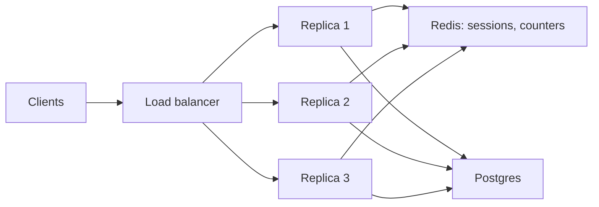

Your single application server handles 800 requests per second at 60% CPU. A campaign next week will triple traffic. You can buy a bigger machine, or run three of the current one behind a load balancer. The second sounds better until you ask where the user's shopping cart lives (in server one's memory), what happens when the balancer sends the user's next request to server two (the cart is gone), and what three servers do to the one database they share (three times the connections, and the database becomes the bottleneck).

Horizontal scaling is a set of disciplines, not a feature: make services stateless so any replica serves any request, spread load and route around failure, add capacity automatically without making things worse, and do the arithmetic that says how many replicas you need and at what utilisation they stop keeping their latency promise.

## Vertical versus horizontal: the arithmetic

| Axis | Vertical (bigger machine) | Horizontal (more machines) |
|---|---|---|
| Cost per core | Flat within a cloud instance family: AWS `m7i` prices scale linearly from 2 to 192 vCPUs | Flat, plus the balancer and the coordination the tier needs |
| Ceiling | The largest instance: 192 vCPUs and 768 GiB for `m7i.48xlarge`; high-memory families go further at a premium | None in principle; the shared dependencies become the ceiling |
| Failure domain | One machine: its failure is an outage, its upgrade a maintenance window | N machines: losing one costs 1/N of capacity |
| What must change in the software | Nothing, if it scales across cores | State must leave the process |
| Where it wins | Databases and anything stateful | Stateless compute |

The textbook claim that big machines cost more per core is mostly false in the cloud; the real limits are the ceiling, the blast radius, and software that does not use extra cores. Measured on Postgres 17 on a 32-thread workstation, primary-key lookups ran at 7,700/s on one connection, 53,000/s on 32 and 69,000/s on 90: 9× the throughput for 90× the concurrency, because the machine ran out of cores. Vertical scaling is the right first move for the database and the wrong one for stateless compute, where a single machine is a single failure.

Horizontal capacity has its own tax: headroom for losing a replica. If $N$ replicas must carry peak with one down, each can run at most at $(N-1)/N$ of its safe utilisation at peak. With the latency knee at about 80% (next sections), that is 53% with 3 replicas, 72% with 10 and 77% with 30. Small fleets pay the most for redundancy.

## Stateless services

A service is stateless when no request depends on which replica served a previous one: no sessions, no user-scoped caches that must be coherent, no local files a later request reads. Every replica is interchangeable, which is the property load balancing, autoscaling and rolling deploys all rely on. State does not vanish; it moves:

| Where the state goes | Latency to reach it | Good for | Bad for |
|---|---|---|---|
| The database | ~1 ms | Anything durable: orders, profiles, carts that must survive a crash | Per-request hot data at high rates |
| A shared cache (Redis, Memcached) | ~0.5 ms | Sessions, rate-limit counters, precomputed views | Data you cannot lose on eviction |
| The client (signed cookie, JWT) | 0, it arrives with the request | Identity, small preferences, a few hundred bytes | Anything that must be revocable instantly, anything large |

A signed token makes the service truly stateless: any replica verifies the signature with a shared key and needs no lookup. The price is revocation: a stolen token is valid until it expires unless you keep a server-side deny list, which reintroduces state. Short expiry (minutes) plus a refresh token is the usual compromise ([Security in design](/learn/system-design/building-blocks/security-in-design)). In-process caches are allowed if they are only an optimisation: a replica that loses its cache serves the request more slowly, never wrongly.



Look at the fan-in. Thirty replicas each holding HikariCP's default pool of 10 connections want 300 database connections, and Postgres runs a process per connection with a default `max_connections` of 100. The stateless tier scales out cleanly; everything it talks to receives the sum. [Connection management](/learn/databases/storage-and-scale/connection-management) is where that bill comes due.

## Load balancers in one screen

A balancer presents one address for many replicas, picks a replica per request or connection, and stops sending to unhealthy ones. [Load balancing](/learn/networking/application-protocols/load-balancing) covers L4 versus L7, the algorithms with numbers and health-check arithmetic; four decisions matter for scaling:

- **Balance requests, not connections**, for HTTP/2 and gRPC, or long-lived connections pin load to whichever replicas existed when clients connected.
- **Least outstanding requests with two random choices** is the default for good reason: a slow replica accumulates in-flight work and receives less, so it is a health signal in disguise.
- **Shallow liveness, local readiness.** A readiness check that queries a shared database ejects the whole fleet when the database blips.
- **Drain on removal.** Fail readiness first, wait for balancers to notice, finish in-flight requests, then exit.

```viz
{"type": "network", "scenario": "load-balancer-least-conn", "title": "Least connections routes around a slow replica",
 "caption": "A replica whose requests take three times longer accumulates in-flight requests and stops receiving new ones. Round robin would keep feeding it its full share."}
```

## Affinity without sticky sessions

Statelessness has a price you can measure: every replica's in-process cache sees the whole key space. Route requests by a hash of the key instead, and each replica caches only its share, so the fleet's caches add up instead of duplicating each other. Simulated with 20 replicas, each holding an LRU cache of 10,000 entries, 1.5 million requests over a million keys drawn from a Zipf distribution, hit ratios measured after a 20% warm-up:

| Routing | Hit ratio, Zipf s = 1.0 | Busiest replica ÷ average | Hit ratio, Zipf s = 0.8 | Busiest ÷ average |
|---|---|---|---|---|
| Random (or round robin) | 58% | 1.01 | 23% | 1.01 |
| `hash(key) mod 20` | 83% | 2.21 | 61% | 1.24 |
| Consistent hash, 100 virtual nodes per replica | 83% | 2.51 | 60% | 1.32 |
| Consistent hash with bounded load, ε = 0.25 | 81% | 1.25 | 60% | 1.25 |
| Consistent hash with bounded load, ε = 0.1 | 80% | 1.10 | 59% | 1.10 |

Hash routing cut misses from 42% to 17% at s = 1.0 and from 77% to 39% at s = 0.8: the flatter the popularity curve, the more affinity pays. The price is load skew. At s = 1.0 the most popular key alone is 6.9% of all requests, and pure hashing sends all of it, plus that replica's ordinary 5% share, to one replica. **Consistent hashing with bounded loads** (Mirrokni, Thorup and Zadimoghaddam, 2016) caps each replica at $(1 + \varepsilon)$ times the average and walks clockwise on the ring when the owner is full, so the hottest keys spill onto a neighbour, which caches them too. At ε = 0.25 it kept 81% of the hit ratio with the busiest replica at 1.25× average. HAProxy exposes it as `hash-balance-factor`.

This is not a sticky session. Affinity here is an optimisation: when a replica dies, its keys move to their next owner, which serves them from the shared cache or the database, slower for a minute and never wrong. A sticky session that holds the only copy of a cart is state; a key-affine cache is not. Use affinity when a local cache or a per-key batching buffer is worth it, and keep every replica able to serve every request.

## A load test, simulated

Where is the knee? A discrete-event simulation of 10 replicas, each with 8 worker threads and a service time of 15 ms plus an exponential tail averaging 5 ms (20 ms mean, so the fleet's capacity is 4,000 rps), fed by Poisson arrivals, 120,000 requests per point, discarding the first 10% as warm-up:

| Offered load | Utilisation | Random routing p50 / p99 | Least-of-two-choices p50 / p99 |
|---|---|---|---|
| 2,000 rps | 50% | 18.6 / 38.6 ms | 18.5 / 38.2 ms |
| 2,800 rps | 70% | 19.6 / 41.8 ms | 18.5 / 38.2 ms |
| 3,200 rps | 80% | 21.2 / 48.6 ms | 18.8 / 38.5 ms |
| 3,600 rps | 90% | 25.7 / 78.1 ms | 19.8 / 39.9 ms |
| 3,800 rps | 95% | 34.7 / 127 ms | 21.4 / 42.6 ms |
| 3,920 rps | 98% | 59.5 / 211 ms | 26.8 / 52.6 ms |
| 4,200 rps | 105% | 841 / 1,636 ms and growing | 836 / 1,349 ms and growing |

Three readings. With random routing each replica is an independent queue, and the p99 more than doubles between 80% and 95%. Routing to the less loaded of two replicas pools the queues, so the fleet behaves more like one big server and keeps its p99 nearly flat up to 95%. Above 100% no algorithm helps: the queue grows by 200 requests every second, and after 30 seconds the median request had waited 0.8 s. Losing one of the ten replicas at 3,200 rps pushes utilisation to 89%; with two-choice routing the simulated p99 was 40 ms, which is why 80% on ten replicas is a defensible target and 80% on three is not.

## Sizing with Little's law

For any stable system, items inside = arrival rate × time each spends inside:

$$L = \lambda W$$

**Thread pool.** 2,000 rps at 50 ms of wall-clock time each: $2{,}000 \times 0.05 = 100$ requests in flight. At 20 threads per replica and a 70% target that is 8 replicas, and 12 to survive losing one of three zones:

```python
import math

def replicas_needed(peak_rps, latency_s, threads_per_replica, target_util=0.7, zones=3):
    in_flight = peak_rps * latency_s                     # Little's law: L = lambda * W
    busy = in_flight / threads_per_replica               # replicas' worth of busy threads
    n = math.ceil(busy / target_util)                    # stay below the latency knee
    return math.ceil(n * zones / (zones - 1))            # still enough with one zone down

print(replicas_needed(2000, 0.05, 20))                   # 12
```

**Connection pool.** One 5 ms query per request: $2{,}000 \times 0.005 = 10$ concurrent queries across the whole fleet. Thirty replicas with pools of 10 hold 300 connections to do the work of 10, and each idle Postgres connection still costs a process. Size pools from $\lambda W$, then put PgBouncer in front.

**A slow dependency.** One downstream call slows from 5 ms to a 500 ms timeout: concurrent calls become $2{,}000 \times 0.5 = 1{,}000$. With a pool capped at 200, 800 requests a second queue or fail. That is the mechanism behind "one slow service took the site down"; the fixes bound $W$ (a timeout) and $L$ per dependency (a bulkhead) and shed the excess. [Resilience patterns](/learn/system-design/building-blocks/resilience-patterns) works through each.

```viz
{"type": "system", "scenario": "bulkhead", "title": "Isolating a slow dependency",
 "caption": "Each dependency gets its own bounded pool. When the recommendations service slows to 500 ms, its pool fills and requests to it fail fast; the checkout pool next to it is untouched."}
```

## Autoscaling is a control loop

**The metric.** CPU is the default and it is wrong for I/O-bound services, where a replica sits at 20% CPU with every thread blocked on the database. In-flight requests per replica, queue depth for workers, or latency against a target track what Little's law actually sizes.

**The delays.** A VM takes 30–120 s to serve, a container 5–30 s, plus application start and cache warm-up. Traffic spikes take seconds. The simulation below runs the Kubernetes autoscaler's formula every 15 s with pods serving 60 s after they are requested, 400 rps per pod, a 60% target, and CPU capped at 100% as real CPU is:

| Scenario | Seconds over capacity | Requests above capacity | Worst demand ÷ capacity |
|---|---|---|---|
| Ramp 2,000 → 6,000 rps over 10 minutes, 8 pods | 0 | 0 | 0.81 |
| Step 2,000 → 6,000 rps, 8 pods | 120 | 192,000 | 1.88 |
| Same step, starting at 12 pods | 60 | 72,000 | 1.25 |
| Same step, 8 pods booting in 20 s | 50 | 68,000 | 1.88 |

The step trace shows why it took two rounds. At 6,000 rps, 8 pods can only report 100% CPU, so the formula asks for $\lceil 8 \times 1.0 / 0.6 \rceil = 14$ pods, not the 25 needed: a saturated metric under-reports demand. Sixty seconds later 14 pods report 100% again and the next step asks for 24. Autoscaling handles ramps; spikes need headroom, faster boots, or load shedding. Netflix built Scryer, a predictive autoscaler, for this reason: it scales ahead of the daily demand curve it forecasts instead of reacting to a metric that lags.

**Hysteresis.** Scale out fast and in slowly, with separated thresholds, or the fleet oscillates: add replicas, per-replica load drops, remove replicas, load rises. Scale-in is the dangerous direction: removing 30% of the fleet after a quiet ten minutes meets the next spike smaller and with cold caches. Cap scale-in per step and never scale in during a deploy.

**The herd on scale-out.** Ten new replicas start together; each opens 10 connections and warms its cache with the same queries, at the moment the database is already loaded. Stagger starts, pool through PgBouncer, warm lazily, and use the balancer's slow start.

## Deploys are capacity events

A rolling deploy removes replicas from service on purpose. A Kubernetes Deployment defaults to `maxUnavailable: 25%` and `maxSurge: 25%`: up to a quarter of the desired pods may be down at once, while up to a quarter extra may be created. On a 20-pod fleet at 70% utilisation, the worst moment of a rollout leaves 15 serving pods, which is 93% utilisation, past the knee in the load test above; if new pods also start cold, the p99 of every deploy shows it. Two fixes: `maxUnavailable: 0` with a surge, so capacity never drops below 100% (the rollout needs spare cluster capacity instead), or a utilisation target that already allows for a quarter of the fleet being away. Deploy fifty times a day and this is not an edge case; it is the fleet's normal state for hours.

## Draining a replica without dropping requests

Every scale-in and every rolling deploy removes replicas, and the removal races with routing. When a pod is deleted, Kubernetes does two things in parallel: the kubelet runs the pod's `preStop` hook and then sends `SIGTERM`, while the endpoints machinery marks the pod as terminating and every router learns about it in its own time. Traced for an application that exits as soon as `SIGTERM` arrives:

| t | Control plane and routers | The pod | Traffic |
|---|---|---|---|
| 0 | API server marks the pod terminating | | |
| ~0.1 s | EndpointSlice updated: endpoint not ready | No `preStop`: `SIGTERM` arrives; the server finishes 2 in-flight requests and exits at 0.3 s | |
| 0.3 s to ~2 s | kube-proxy on each node rewrites its iptables or IPVS rules as the update reaches it | Gone | Connections through nodes not yet updated are refused |
| up to several seconds | Ingress controllers, mesh sidecars and cloud load balancers that target pod IPs update their upstream lists | Gone | 502s from each of them until it catches up |

The lags are typically sub-second to a few seconds and grow with cluster size and controller load, so measure yours. The cost adds up: 20 pods serving 1,000 requests a second (50 each), 50 deploys a day, is 1,000 pod terminations; a 2-second window of misrouted traffic per termination is $1{,}000 \times 50 \times 2 = 100{,}000$ failed requests a day, 0.12% of the 86.4 million served, more than a 99.9% availability target's entire error budget, spent on deploys alone.

The fix is an ordering, not a bigger fleet:

1. **`preStop`: wait.** Sleep 5–15 s, longer than the slowest router's update lag, while still serving normally. Recent Kubernetes versions offer a built-in sleep action for this hook; older ones run `sleep` in the container.
2. **On `SIGTERM`: stop accepting, finish what is in flight.** Close idle keep-alive connections (`Connection: close` on the next HTTP/1.1 response, `GOAWAY` on HTTP/2) so clients reconnect elsewhere instead of reusing a socket that is about to close.
3. **Exit before `terminationGracePeriodSeconds`** (30 s by default), after which the kubelet sends `SIGKILL`. The sleep plus the longest request must fit inside it; long-running requests need a longer grace period or a design that lets them resume.

A cloud balancer adds its own drain: an AWS target group keeps in-flight requests on a deregistering target for `deregistration_delay` (300 s by default) but sends it no new ones. The failure is never the drain itself; it is exiting before every router has stopped sending.

## Long-lived connections do not rebalance themselves

Request-level balancing spreads load the moment a replica joins. Connection-level load does not: WebSockets, gRPC streams and database connections stay where they were opened. Add 5 replicas to 10 that hold 50,000 WebSocket connections each and the new ones start at zero; only reconnections land on them. If 2% of connections close and reconnect every minute (mobile churn), the old replicas decay towards the new average of 33,333 and take $\ln(50{,}000 / 36{,}667) / 0.02 \approx 15.5$ minutes to come within 10% of it; at 0.2% a minute (desktop clients on stable networks) it takes 155 minutes.

Two consequences. An autoscaler that scales on CPU adds replicas that receive almost nothing, sees the old replicas still hot, and adds more: an overshoot that ends at the maximum replica count. And the fix is active: old replicas ask a controlled fraction of their clients to reconnect (a close frame with a "reconnect elsewhere" code, or a gRPC `GOAWAY` after a maximum connection age), paced so the new replicas' TLS handshakes stay within their capacity. The [chat system case study](/learn/system-design/case-studies/chat-system) runs this at 200,000 connections per gateway.

## Under the hood: the Kubernetes Horizontal Pod Autoscaler

The HPA controller runs every 15 s (`--horizontal-pod-autoscaler-sync-period`) and computes

$$\text{desired} = \left\lceil \text{current} \times \frac{\text{current metric}}{\text{target}} \right\rceil$$

skipping the change when the ratio is within 10% of 1.0 (the tolerance). Defaults shape its behaviour:

- **Scale-up** has no stabilisation window; the default policy adds the larger of 100% of current pods or 4 pods per 15 s.
- **Scale-down** uses a 300 s stabilisation window: the controller takes the highest recommendation from the last five minutes, so a brief dip never removes pods.
- **Pods not yet ready** are treated conservatively when computing CPU, so a scale-up does not immediately look like it has fixed the problem.

AWS target tracking behaves similarly: it creates CloudWatch alarms from the target and scales out faster than in, with an instance warm-up period during which new instances do not count towards the metric.

```exercise
id: hpa-control-loop
title: Replay a Horizontal Pod Autoscaler
prompt: |
  Implement `autoscale(start, target_pct, demand, min_replicas, max_replicas, window)`.
  Each element of `demand` is one 15-second period's total CPU demand in percent of one
  replica (450 means four and a half replicas' worth of work). Starting from `start`
  replicas, for each period:

  1. `util = min(demand, 100 * current)`: a saturated fleet cannot report more than 100% per replica.
  2. If `abs(util - target_pct * current) * 10 <= target_pct * current` (within 10% of target),
     the recommendation is `current`; otherwise it is `ceil(util / target_pct)`.
  3. Clamp the recommendation to `[min_replicas, max_replicas]` and record it.
  4. If it is above `current`, scale up to it, but to at most `max(2 * current, current + 4)`.
     Otherwise set `current` to `min(current, highest recommendation among the last window periods)`.
     Treat the `window - 1` periods before the first sample as having recommended `start`.

  Return the list of replica counts after each period. Use integer arithmetic.
languages: [python, javascript]
entry: autoscale
starter:
  python: |
    def autoscale(start, target_pct, demand, min_replicas, max_replicas, window):
        current = start
        out = []
        # your code here
        return out
  javascript: |
    function autoscale(start, target_pct, demand, min_replicas, max_replicas, window) {
      let current = start;
      const out = [];
      // your code here
      return out;
    }
tests:
  - args: [4, 60, [240, 250, 230, 260], 1, 50, 4]
    expected: [4, 4, 4, 4]
    label: within tolerance, nothing moves
  - args: [4, 60, [300, 420, 600, 900, 1200], 1, 50, 4]
    expected: [5, 7, 10, 15, 20]
    label: a ramp is tracked
  - args: [4, 60, [1500, 1500, 1500, 1500, 1500], 1, 50, 4]
    expected: [7, 12, 20, 25, 25]
    label: saturation under-reports a step
  - args: [20, 60, [600, 300, 300, 300, 300, 300, 300], 1, 50, 4]
    expected: [20, 20, 20, 10, 5, 5, 5]
    label: scale-down waits for the window
  - args: [10, 50, [2000, 5000, 9000], 2, 30, 3]
    expected: [20, 30, 30]
    hidden: true
  - args: [6, 70, [100, 0, 0, 0, 0], 3, 20, 2]
    expected: [6, 3, 3, 3, 3]
    label: min_replicas floor
    hidden: true
  - args: [10, 60, [640, 560, 900, 200, 200, 200, 200], 1, 40, 3]
    expected: [10, 10, 15, 15, 15, 4, 4]
    hidden: true
hints:
  - "Keep a list of recommendations pre-filled with window - 1 copies of start, and look at its last `window` entries when scaling down."
  - "Integer ceil(a / b) for non-negative a is (a + b - 1) // b."
```

## Where horizontal scaling stops

Add replicas and the stateless tier scales roughly linearly; the database does not, and every replica moves the bottleneck towards it. The order of moves, each with its trigger, is what interviewers probe:

1. Make each request do less to the database: cache reads, batch writes, fix N+1 queries.
2. Pool connections when they pass a few hundred.
3. Add read replicas for reads that tolerate lag.
4. Scale the primary vertically; it is the one place a bigger box is the right first move.
5. Only then partition. [Database scaling](/learn/system-design/building-blocks/database-scaling) is the next step for a reason.

```viz
{"type": "system", "scenario": "request-flow", "title": "Aggregate load lands on shared components",
 "caption": "Every replica added to the stateless tier adds its connections, cache misses and writes to the same database and cache. The load balancer distributes requests; nothing distributes the database."}
```

## Failure modes

| Failure | Symptom | Diagnosis | Fix |
|---|---|---|---|
| Health-check flapping | Replicas leave and rejoin the pool every few minutes under load | Check timeout below the check's own p99 at high load; membership churn in balancer logs | Timeouts above the check's p99, several failures before removal, a check that does no real work |
| Long-lived connection imbalance | Per-replica request rates differ 5–10× with equal weights | HTTP/2 or gRPC through an L4 balancer; requests per connection very high | L7 or client-side balancing; a jittered maximum connection age |
| Retry storm during scale-out | Request rate rises faster than user activity while new replicas boot | Timeouts trigger client retries that multiply load | Retry budgets, backoff with jitter, shedding at the balancer ([Idempotency and retries](/learn/system-design/building-blocks/idempotency-and-retries) simulates it) |
| Cold-start herd | p99 rises on every scale-out; new replicas fail right after joining | Least-requests sends zero-in-flight replicas a burst before JIT and caches warm | Readiness that warms first; slow start over 30–60 s |
| Saturated metric | Autoscaler adds too few pods during a spike | CPU pinned at 100% hides true demand | Scale on concurrency or queue depth; step policies; headroom |
| Shared dependency saturates | Adding replicas makes latency worse | Database connections and CPU climb with fleet size | The ordered list above; diagnose [I/O-bound versus CPU-bound](/learn/systems/performance-engineering/io-bound-vs-cpu-bound) before scaling |
| 502s on every deploy | Error spikes lasting a few seconds that line up with rollouts and scale-ins | Errors from the ingress or balancer naming pods that no longer exist; the app exits on `SIGTERM` at once | `preStop` sleep longer than the routers' update lag, then drain in-flight work and close keep-alives |
| New replicas idle after scale-out | Old replicas stay hot while new ones sit near zero; the autoscaler keeps adding pods | Per-replica connection counts; long-lived WebSocket or gRPC connections | Paced reconnect requests from overloaded replicas; maximum connection age; scale on connections, not CPU |
| Hot key under affinity routing | One replica at 2–3× the others' load after switching to hash routing | Per-replica request rates; the top keys by request count | Bounded-load consistent hashing; replicate or locally cache the hottest keys |

## Interviewer follow-ups

**"Your service is at 70% CPU and latency is climbing. Do you add replicas?"** Model answer: first find where the latency lives. If database latency doubled, more replicas add connections and make it worse. If the replicas are the constraint, yes, and I would ask why the autoscaler had not fired earlier, and whether this is a ramp it can follow or a spike that needs headroom or shedding today. Common wrong answer: "yes, scale out", without checking the downstream.

**"Why not sticky sessions with the cart in memory? It's faster."** Model answer: faster by a Redis round trip of about half a millisecond, next to 50–100 ms of user RTT. In exchange a replica failure loses every cart on it, every deploy becomes that failure, scale-in becomes a decision about which carts to drop, and load is as skewed as the users. Carts go in Redis keyed by session and in the database at checkout. Common wrong answer: "sticky sessions are fine if the balancer supports them".

**"Put numbers on 'scale out fast, scale in slowly' and say what breaks if you get them wrong."** Model answer: scale out on 30–60 s above target, up to doubling per step, with the cooldown matched to boot time; scale in after 5–15 minutes below, by at most 10% per step. Too-fast scale-in oscillates and destroys warm caches; too-slow scale-out serves the spike with timeouts that retries multiply. In the simulation, a 3× step with 8 pods and 60 s boots spent 120 s over capacity; starting at 12 pods halved it. Common wrong answer: symmetric thresholds with no cooldown.

**"40 replicas with 20-connection pools, and `max_connections` is 500. Now what?"** Model answer: 800 wanted, 500 available. Little's law says what is needed: 2,000 rps × 5 ms is 10 concurrent queries, so the pools are 80× oversized. PgBouncer in transaction mode with a server pool of 50–100, per-replica pools of about 5 to cover bursts and the query p99, and a pool-acquire timeout so a slow database fails requests instead of stacking threads. Common wrong answer: raising `max_connections` to 1,000, which adds processes and memory to a database that needed fewer connections, not more.

**"Every deploy causes a burst of 502s for a few seconds. Why, and what do you change?"** Model answer: pod termination and endpoint removal run in parallel, so the pod gets `SIGTERM` and exits while kube-proxy, the ingress and the cloud balancer are still sending it traffic. Add a `preStop` sleep longer than the slowest router's update lag, stop accepting on `SIGTERM` while finishing in-flight requests, close keep-alive connections, and keep the whole sequence inside the grace period. With 1,000 terminations a day at 50 rps a pod, a 2-second window costs 100,000 failed requests, more than a 99.9% target's budget. Common wrong answer: "add retries at the client", which hides the bug and adds load during every deploy.

**"Would you route requests by user ID so each replica's cache stays warm?"** Model answer: yes, if the hit-ratio gain is worth it and correctness never depends on it: in the simulation hashing lifted a 58% local hit ratio to 83%. Use consistent hashing with bounded loads, because pure hashing put 2.5× the average load on the replica that owned the hottest keys, and keep every replica able to serve any user from shared state when ownership moves. Common wrong answer: "that is sticky sessions, so no", or "yes" with plain `hash mod N`, which remaps almost every key when N changes.

## What mid-level engineers get wrong

- Keeping sessions or carts in process memory and adding sticky sessions to hide it.
- Running three replicas at 80%, so losing one means 120%.
- Autoscaling I/O-bound services on CPU.
- Expecting autoscaling to absorb a spike that arrives faster than a pod boots.
- Copying default pool sizes, so the fleet holds hundreds of idle database connections.
- Deep health checks against shared dependencies, turning a database blip into a fleet-wide ejection.
- Rolling deploys with the default 25% unavailable on a fleet already near its knee.
- Scaling the stateless tier when the database is the bottleneck.
- Exiting on `SIGTERM` immediately, so every deploy sends a few seconds of traffic to a pod that no longer listens.
- Scaling long-lived-connection services on CPU, and expecting new replicas to receive connections that are already open elsewhere.

## Senior signals

- You say where every piece of state goes before drawing a second replica, and treat sticky sessions as a smell.
- You compare vertical and horizontal on ceiling, blast radius and software scaling, not on a myth about cost per core.
- You know the latency knee (p99 doubling from 80% to 95% with independent queues) and size utilisation targets for N-1.
- You size pools and fleets with Little's law and say what happens to in-flight work when a dependency's latency triples.
- You describe autoscaling as a control loop with delays and a saturating sensor, and you know the HPA's 15 s loop, 10% tolerance and 5-minute scale-down window.
- You treat every replica removal as a drain with an ordering (`preStop` wait, stop accepting, finish in flight, exit inside the grace period) and use key affinity with bounded loads as an optimisation, never as state.
- You walk the ordered list before sharding, with the number that triggers each step.

## Check yourself

```quiz
- q: >-
    A service receives 3,000 requests per second with an average latency of 40 ms. Roughly how many requests are in flight at any moment?
  options: ["About 120", "About 12", "About 1,200", "About 75"]
  answer: 0
  explanation: >-
    Little's law: L = λW = 3,000 x 0.04 = 120. That is the number of threads or connections the fleet needs before requests queue; 12 forgets the unit conversion and 1,200 would be a 400 ms latency.
- q: >-
    In the simulated load test, random routing's p99 went from 49 ms at 80% utilisation to 127 ms at 95%, while least-of-two-choices stayed near 43 ms. Why the difference?
  options: ["Random routing forces requests to retry more often under load", "Two-choice routing gives every replica extra worker threads", "Random routing leaves one replica's queue full while others idle", "Two-choice routing sends fewer requests to the fleet as a whole"]
  answer: 2
  explanation: >-
    With random routing each replica is an independent queue, so one can be backed up while its neighbours are idle. Picking the less loaded of two pools the queues and the fleet behaves more like one large server, which keeps queueing low until close to 100%. Total load and thread counts are the same in both runs.
- q: >-
    During a sudden 3x traffic step, a CPU-based autoscaler with a 60% target and 8 saturated pods first asks for only 14 pods, although 25 are needed. Why?
  options: ["Saturated pods report 100% CPU, hiding the real demand", "The 10% tolerance suppresses most of the increase", "The pods report more CPU than they are really using", "The autoscaler caps any single step at 14 pods by default"]
  answer: 0
  explanation: >-
    CPU cannot exceed 100%, so eight saturated pods look like 8 x 1.0 / 0.6 = 14 pods of demand. Only after those pods boot does the metric reveal more. Scaling on concurrency or queue depth, step policies, or headroom avoid this. The default scale-up limit here is the larger of doubling or 4 pods, which allows 16.
- q: >-
    Your health check verifies that the replica can query the database. The database has a 3-second hiccup. What most likely happens?
  options: ["Nothing; a 3-second blip ends before the next check can see it", "The balancer marks the database unhealthy and routes around it", "Only replicas that were mid-query fail their checks and are removed", "Every replica fails its check at once and the whole fleet is ejected"]
  answer: 3
  explanation: >-
    A deep check shares a failure domain: a dependency blip fails every check at once and the balancer ejects everything. Use shallow liveness and local readiness for the balancer. The balancer knows nothing about the database; it only sees replicas failing.
- q: >-
    A service must survive losing one replica at peak, and replicas keep a good p99 up to about 80% utilisation. With 3 replicas, what is the highest safe peak utilisation per replica?
  options: ["About 72%", "About 80%", "About 27%", "About 53%"]
  answer: 3
  explanation: >-
    After losing one of three, the other two carry the load, so each normal utilisation is scaled by 3/2; to stay at or below 80% it must be at most 80% x 2/3 = 53%. Ten replicas allow 72%, which is why small fleets pay the most for redundancy.
- q: >-
    Your pods exit as soon as they receive SIGTERM, and every rolling deploy produces a few seconds of 502s. What is the cause?
  options: ["Routers keep sending to the pod until they see its removal", "The liveness probe fails the moment SIGTERM arrives", "New pods pass readiness before their caches are warm", "maxSurge schedules more new pods than the nodes can hold"]
  answer: 0
  explanation: >-
    Kubernetes sends SIGTERM and updates endpoints in parallel, and kube-proxy, ingress controllers and cloud balancers each learn of the removal seconds later, so a pod that exits at once receives traffic it can no longer serve. A preStop sleep longer than that lag, then draining in-flight work, removes the errors. Cold caches raise latency rather than causing 502s, and liveness probes play no part in a deletion.
```
