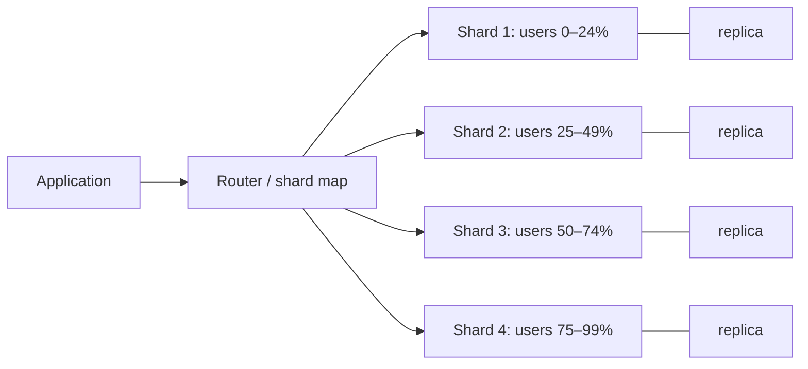

The stateless tier scaled to forty replicas in an afternoon. The database did not: it is one primary, its CPU is at 80%, the read replica lags by four seconds at peak, and the product team wants a "find all orders for this merchant" query that touches every row. Every large system reaches this point, and the interesting design decisions live here, because the database is where the state is and state cannot be scaled by copying a process.

This lesson is the sequence of moves that scales a database, in the order you should make them, with the numbers that justify each move and the specific ways each one fails. It ends at sharding, because sharding is the last resort and the one that changes every query you will ever write.

## The order of operations

Interviewers ask "how would you scale the database?" and the mid-level answer is "shard it". The senior answer is a list with a trigger for each item, because each step is 10× cheaper than the next and most systems never need the last one.

| Step | Typical gain | Cost | Do it when |
|---|---|---|---|
| 1. Fix queries and indexes | 10–1000× on specific queries | Engineering time | Always first; `EXPLAIN` the slow log |
| 2. Connection pooling | Removes connection overhead, caps concurrency | A pooler to run | Connections exceed a few hundred |
| 3. Cache reads | 5–100× read reduction | Staleness, another system | Read-heavy, hit rate above 90% plausible |
| 4. Scale vertically | 2–8× | Money, a bigger failure domain | Primary CPU or memory bound and a bigger box exists |
| 5. Read replicas | Linear read scaling | Replication lag, read-your-writes | Reads dominate and tolerate lag |
| 6. Partition tables (same node) | Faster scans and drops on time-series | Schema complexity | Tables over ~100 GB with time-based access |
| 7. Shard | Unbounded write and storage scaling | Every cross-shard query, transaction and index | Write rate or storage exceeds one node |

A Postgres primary on a large instance handles on the order of 10,000 small writes per second and tens of thousands of indexed reads; with a warm cache in front, that covers a system with tens of millions of daily users. Say that number in the interview and then say what would push you past it: write rate (not read rate, which replicas solve), or a dataset that no longer fits on one node's disk with acceptable restore time (roughly several TB, because restoring a 10 TB database from backup takes hours). [Indexes](/learn/databases/relational-fundamentals/indexes) and [connection management](/learn/databases/storage-and-scale/connection-management) cover steps 1 and 2; this lesson takes 5 and 7.

## Read replicas

A replica receives the primary's write-ahead log and applies it, producing a copy that lags the primary by the time it takes to ship and apply the log. In steady state on the same network that is milliseconds; under a write burst or a long transaction on the replica it stretches to seconds, and during a bulk load it can be minutes.

```viz
{"type": "system", "scenario": "replication-leader-follower", "replicas": 2, "title": "Leader-follower replication and the lag window",
 "caption": "Writes go to the leader, which streams its log to followers. A read routed to a follower before the log applies returns the old value; the lag is the window in which the two answers differ."}
```

Routing reads to replicas gives linear read scaling: three replicas absorb three times the read traffic, each at a few milliseconds. The cost is that a replica read can return data older than what the same client just wrote, and users notice: they post a comment, the page reloads from a replica, and the comment is missing.

### Read-your-writes

Three mechanisms, in order of cost:

1. **Route to the primary after a write.** For N seconds after a user writes (tracked by a cookie or a session flag), send that user's reads to the primary. Simple, and it moves the most active users' reads back to the primary, which is the load you were trying to shed.
2. **Replication position tokens.** After a write, the primary returns its log position (Postgres: the LSN; MySQL: the GTID). The client sends it on subsequent reads; the router picks a replica whose applied position is at or past that token, or waits briefly for one. This is precise and costs one comparison per read; it is what "session consistency" means in most managed databases.
3. **Read from the primary for the read-after-write path only.** Design the API so the write returns the new state and the client renders it, avoiding the immediate re-read altogether.

The senior point is that lag is not a bug to be eliminated; it is a number to be measured (`pg_stat_replication`, the replica's `replay_lag`) and designed around, with an explicit statement of which reads tolerate it. [Consistency models](/learn/system-design/building-blocks/consistency-models) gives the vocabulary.

### Failover

When the primary dies, a replica is promoted. Automated failover (Patroni, a managed service's failover) takes 10–60 seconds and involves three risks: the promoted replica was lagging, so committed writes not yet shipped are lost (asynchronous replication loses data on failover; synchronous replication to at least one replica prevents it at the cost of write latency); two nodes both believe they are primary (split brain) if the old primary was merely partitioned, and clients write to both; and the application's connection strings, DNS or proxy must move, which is where the 60 seconds goes. [Replication](/learn/databases/storage-and-scale/replication) in the databases track goes into the mechanics of each.

## Sharding

Sharding partitions the data across nodes so that each holds a subset of rows and, therefore, a subset of the write load and storage. Every row has a home determined by a shard key, and the system must be able to find that home from the query.



Each shard is itself a replicated primary, so a four-shard system is at least eight nodes. That is the first cost: operational surface multiplies.

### Strategies for mapping key to shard

**Range.** Rows with keys in `[a, b)` go to shard 1, `[b, c)` to shard 2. Range queries on the key touch one or few shards; the boundaries can be rebalanced by splitting a range. The failure: keys that increase (timestamps, auto-increment IDs) send *every* write to the last shard, so the write load is not distributed at all.

```viz
{"type": "system", "scenario": "sharding-range", "title": "Range sharding and the hot tail",
 "caption": "Keys are assigned by range. Range scans stay on one shard, but monotonically increasing keys pile every insert onto the last range while the others sit idle."}
```

**Hash.** Shard = `hash(key) mod N` (or a hash range). Writes spread uniformly regardless of key distribution. The failure: range queries on the key now touch every shard, and changing N remaps almost every key, which is why hash sharding is paired with consistent hashing or a fixed large number of virtual partitions.

```viz
{"type": "system", "scenario": "sharding-hash", "title": "Hash sharding spreads writes uniformly",
 "caption": "The hash scrambles adjacent keys onto different shards, so an increasing key sequence no longer creates a hot tail. A query for a range of keys must now ask every shard."}
```

**Directory (lookup).** A table maps each key (or tenant) to a shard explicitly. Maximum flexibility: a huge tenant can have its own shard, and moving a tenant is a row update plus a data copy. The failure: the directory is a dependency on every request and a single point of failure, so it is cached aggressively and replicated.

**Consistent hashing.** Hash keys and shards onto a ring; each key belongs to the next shard clockwise. Adding a shard moves only about $1/N$ of keys, and virtual nodes even out the distribution. This is how Cassandra, DynamoDB and most distributed caches place data; [partitioning and rebalancing](/learn/system-design/distributed-systems/partitioning-and-rebalancing) covers it in full.

```viz
{"type": "system", "scenario": "consistent-hashing", "nodes": 4, "keys": 12, "title": "Adding a shard moves one Nth of the keys",
 "caption": "Keys and shards share a hash ring. When a fifth shard joins, only the keys between it and its predecessor move; with modulo hashing almost all of them would."}
```

### Choosing the shard key

The shard key is the most consequential decision in a sharded design, because it fixes which queries are cheap forever. Three tests:

1. **Does every hot query include it?** A query without the shard key is a scatter-gather across all shards.
2. **Does it distribute writes?** Cardinality must be high and access must not concentrate on a few values.
3. **Does it keep related rows together?** Rows that are joined or transacted together should share a shard.

Worked example: an order system with 50 million users, 200,000 merchants, and 20,000 orders per second at peak.

| Candidate key | Hot query "my orders" | Hot query "merchant's orders" | Write distribution | Verdict |
|---|---|---|---|---|
| `user_id` | One shard | All shards (scatter) | Uniform: 50M values | Good for consumer app; merchant dashboard needs an index |
| `merchant_id` | All shards | One shard | Skewed: top merchant does 5% of orders = 1,000 wps on one shard | Hot shard risk |
| `order_id` (random) | All shards | All shards | Perfectly uniform | Everything is scatter-gather; only point lookups are cheap |
| `created_at` | All shards | All shards | All writes to the newest shard | Wrong for writes; right for archival |
| `(merchant_id, order_id)` with hashing | All shards | One shard per merchant chunk | Spread if hashed on both | Directory-managed; complex |

The honest answer is `user_id` for the consumer-facing path, plus a separate mechanism for the merchant view: either a global secondary index, or a materialised copy of orders in a merchant-keyed store fed by a change stream. There is rarely a key that serves every access pattern, and saying so is the senior move; picking one and building the second access path explicitly is the design.

### Hot keys and the celebrity problem

Even with a good key, some values are hot: a merchant running a flash sale, a user with 50 million followers, a tenant that is 30% of the business. A hash puts all their rows on one shard, and that shard becomes the bottleneck at exactly the moment it matters. Mitigations:

- **Salting.** Append a small suffix to the key for hot values (`merchant_42#0` … `merchant_42#15`), spreading writes over 16 shards; reads for that merchant fan out to 16. Only the hot values are salted, which requires a hot-key detector fed by request sampling.
- **Isolating.** With a directory scheme, move the hot tenant to its own shard or cluster.

Cassandra's advice to bound partition sizes (under ~100 MB) is the same problem seen from the store's side; [wide-column stores](/learn/databases/nosql-and-specialised/wide-column-stores) covers the partition-design rules.

## Secondary indexes across shards

Point lookups by shard key are cheap; everything else is the problem. Suppose orders are sharded by `user_id` and you need `WHERE merchant_id = ?`.

**Local secondary index (document-partitioned).** Each shard maintains an index over its own rows. A query by `merchant_id` is sent to every shard, each uses its local index, and the router merges. This is scatter-gather. Cost: with 32 shards, one logical query is 32 physical queries; the latency is the slowest of the 32 (tail amplification: if each shard has a 1% chance of a 100 ms hiccup, 27% of scatter-gather queries see it); and throughput is divided by the fan-out: 32 shards each capable of 5,000 queries/s give the cluster 5,000 scatter-gather queries/s, not 160,000. Fine for a merchant dashboard at 50 queries/s; catastrophic for a hot path.

**Global secondary index (term-partitioned).** The index itself is sharded by the indexed value: all entries for `merchant_id = 42` live on the index shard for 42, pointing at the rows' primary shards. A query hits one index shard and then the row shards it points to. Cost: a write to an order now updates the row on its shard *and* the index on a different shard, which is either a distributed transaction (slow, and the subject of [distributed transactions](/learn/system-design/distributed-systems/distributed-transactions)) or asynchronous, meaning the index lags the data. DynamoDB's global secondary indexes are asynchronous and eventually consistent for exactly this reason, and an interviewer who asks "what happens if I write an order and immediately query the GSI?" wants to hear "you may not see it for some milliseconds, and the design must tolerate that".

The general principle: a sharded system supports one access pattern natively and every other one is either a scatter-gather, an asynchronous derived copy, or a distributed transaction. Choosing among those three, per query, is the design.

## Cross-shard joins and transactions

A join between two tables sharded on the same key (`orders` and `order_items` both by `user_id`, co-located) is a local join on each shard. A join across different keys is a distributed join, and most sharded systems avoid it by denormalising: store the merchant name on the order row so the dashboard does not join.

Transactions that touch one shard are ordinary ACID transactions. Transactions across shards need two-phase commit, which adds two round trips and a coordinator that can leave participants holding locks if it crashes between prepare and commit. The practical answer is to choose the shard key so that the transactions you need are single-shard (a user's order and their balance together), and to use sagas with compensation for the rest.

## Resharding

You chose 8 shards; two years later you need 32. Resharding is a live migration of data with the application running.

The mechanics that make it survivable:

1. **Choose the shard count so that splits are clean.** Doubling (8 to 16) means each shard's data goes to exactly two new shards; with hash-range sharding each range splits in half. Some systems pre-create a large fixed number of logical partitions (say 1,024) and map many logical partitions to each physical node, so that "resharding" is moving whole logical partitions rather than splitting rows. Vitess, Cassandra and Kafka all use variations of this.
2. **Copy, then catch up, then cut over.** Snapshot-copy the rows for the moving range to the new shard (hours for terabytes), then replay the change stream from the snapshot point until the new shard is caught up (lag falls to milliseconds), then flip the router. Vitess's `MoveTables`/`Reshard` workflows and Postgres logical replication both work this way.
3. **Prefer stream replay to dual writes.** Writing every row to both old and new is simple to describe and dangerous in practice: a write that succeeds on one and fails on the other leaves them divergent, and you need a reconciliation job to find out. Change-stream replay has one source of truth.
4. **Verify before cutover.** Checksums per range, and a day of shadow reads comparing both sides.

The reason to think about resharding at design time is that it decides the shard count and the hashing scheme. Picking `hash mod 8` today means every key moves at 16; picking 1,024 logical partitions over 8 nodes today means moving 512 partitions' worth of data at 16 with no key ever changing its logical partition. That sentence is worth saying early in a design.

## When to leave the relational model

Sharding a relational database keeps SQL, joins within a shard, and the tooling you know, at the cost of building the router, the resharding and the cross-shard index handling yourself (or adopting Vitess or Citus, which build them for you). Two alternatives are worth naming:

- **Distributed SQL** (Spanner, CockroachDB, YugabyteDB): automatic range sharding, consensus-replicated writes, cross-shard transactions, at the cost of write latency in the tens of milliseconds and a system whose tail behaviour you must learn. Right when transactional semantics across shards are non-negotiable and the write rate is moderate.
- **Wide-column / key-value stores** (Cassandra, DynamoDB): partition by key with consistent hashing, no joins, tunable consistency, and linear scaling to millions of writes per second. Right when every access pattern is known up front and can be modelled as a partition key plus a sort key, and wrong when the product will ask for a new query next quarter. [Choosing a database](/learn/databases/nosql-and-specialised/choosing-a-database) has the decision framework.

The trigger is the same either way: a write rate or data size that a single primary cannot hold, *after* the cheaper steps are exhausted. Below that, a replicated Postgres with a cache is the answer, and defending it is a senior signal, not a lack of ambition.

## Failure modes

**Hot shard.** One shard at 100% while others idle; its latency climbs, and because scatter-gather queries wait for the slowest shard, every cross-shard query is now slow too. Detection: per-shard QPS and CPU; a top-keys sampler. Mitigation: salting hot keys, isolating hot tenants, and a shard key chosen for write distribution in the first place.

**Replica lag surfacing stale data.** A write burst pushes lag to 5 seconds; users see their edits vanish and reappear. Detection: replay lag metric with an alert at 1 second; user-visible error reports clustered by time. Mitigation: LSN tokens for read-your-writes, routing sensitive reads to the primary, and pausing bulk jobs when lag exceeds a threshold.

**Split brain on failover.** The old primary was partitioned, not dead; automation promoted a replica; when the partition heals, both accept writes. Detection: two nodes reporting as primary; divergent data found by a consistency check. Mitigation: fencing (the old primary must be stopped or its storage detached before promotion), a consensus-based leader election as in Patroni, and a write path that refuses to write to a node without a valid lease. [Failure detection and leases](/learn/system-design/distributed-systems/failure-detection-and-leases) explains fencing tokens.

**Resharding backfill mistakes.** The snapshot copy took 6 hours; the change-stream replay missed the last minute before the snapshot because the position was recorded after the copy began. Rows updated in that minute are stale on the new shard. Detection: checksum comparison per range before cutover; shadow reads. Mitigation: record the stream position *before* starting the snapshot and replay from there, accepting duplicate applies as idempotent.

**Unbounded scatter-gather.** A new "search my orders by status" endpoint fans out to all 64 shards on every request; at 500 rps that is 32,000 shard queries/s and the cluster's headroom is gone. Detection: shard QPS far exceeds application QPS. Mitigation: a global index or a search engine for that access pattern; a fan-out budget enforced in the router.

## Interviewer follow-ups

**Q: "Your orders table is sharded by user_id. The merchant dashboard needs the last 100 orders for a merchant, sorted by time. How do you serve it?"**

Not by scatter-gather on the hot path: 32 shards per request with tail amplification, and the sort has to merge across shards. I would maintain a merchant-keyed copy: either a global secondary index keyed by `(merchant_id, created_at)` updated asynchronously from the order table's change stream, or a materialised `merchant_orders` table in a separate store fed by CDC. The dashboard reads one partition, sorted by the clustering key, in a few milliseconds. The cost is that the copy lags the truth by tens to hundreds of milliseconds, which a dashboard tolerates. If the requirement were "the merchant must see the order the instant it is placed", I would route that specific read to the order's primary shard using the order ID the merchant just received, rather than making the whole index synchronous.

**Q: "Why not shard by merchant_id, since merchants are the paying customers?"**

Because the write load is skewed: the largest merchant does something like 5% of all orders, which at 20,000 orders/s is 1,000 writes/s on one shard, and during their flash sale it is 10,000/s, which is a single-primary's entire capacity. User-keyed sharding spreads that sale across every shard. If merchant isolation were a business requirement (a tenant SLA), I would use a directory scheme so that the largest merchants get dedicated shards and the long tail is packed, which is how multi-tenant SaaS systems usually end up.

**Q: "What is the replication lag right now, and what is your alert threshold?"**

I would expect single-digit milliseconds on a healthy same-region replica and I would alert at one second, because at one second users start to notice read-your-writes failures and because lag that passes one second usually keeps growing (it means the replica is applying slower than the primary is writing, which does not fix itself). I would also alert on replay lag *rate*, since a jump from 5 ms to 500 ms in a minute tells me a bulk job started somewhere. The number I would not accept without a design conversation is anything above ten seconds, because at that point failover would lose ten seconds of committed writes.

**Q: "You have 8 shards and need 16. Walk me through the cutover and what you check before flipping."**

Provision 8 new primaries with replicas. For each existing shard, start logical replication of the half of its key range that will move, recording the stream position before the snapshot begins. Snapshot-copy that half (hours, throttled to protect the primary). Replay the stream until lag is under 100 ms. Run a checksum per key range and a day of shadow reads comparing old and new. Then flip the router for that range, in the direction old-to-new, with the router able to flip back within seconds if error rates rise. Delete the moved rows from the old shard only after a week. If I had designed this system from scratch I would have used 1,024 logical partitions mapped to 8 nodes so that this whole exercise is "move 64 logical partitions each to a new node" with no key range arithmetic.

**Q: "At what point would you move from sharded Postgres to Cassandra or DynamoDB, and what would you lose?"**

When writes exceed what a shard can absorb and the resharding cadence becomes the team's main job, typically somewhere past a few hundred thousand writes per second across the cluster, or when multi-region active-active writes become a requirement, which sharded Postgres does not do well. I would lose ad-hoc queries, joins and transactions across partitions, and I would gain linear scaling, tunable consistency and much simpler operations for the access patterns I designed for. The risk is the next product requirement, because a wide-column store makes a new access pattern a new table maintained by a new pipeline. I would only do it with the access patterns enumerated and agreed in writing, and I would keep a relational or analytical copy for the queries nobody predicted.

## Senior signals

- You walk the ordered list before sharding and you can name the number that triggers each step.
- You treat replication lag as a measured quantity with an alert threshold and a read-your-writes strategy, not as a bug.
- You evaluate shard keys against the hot queries, the write distribution and co-location, and you say when no key serves every pattern.
- You know that secondary indexes are the hard part of sharding, and you can explain scatter-gather tail amplification and the asynchronous global index trade-off.
- You design the shard count and hashing scheme for the resharding you will do in two years.
- You can say precisely what you lose when leaving the relational model, and you would not leave it early.

## Check yourself

```quiz
- q: >-
    An orders table is hash-sharded across 32 nodes by user_id. A query for all orders of a given merchant is served by scatter-gather. Each shard has a 1% chance of a 200 ms stall on any query. Roughly what fraction of merchant queries take 200 ms or more?
  options: ["About 50%", "About 1%", "About 3%", "About 27%"]
  answer: 3
  explanation: >-
    The query waits for the slowest shard, so it stalls if any of the 32 does: 1 - 0.99^32 ≈ 0.27. Tail amplification is the core cost of scatter-gather and the reason for a global index on hot cross-shard access patterns.
- q: >-
    Which shard key choice produces a hot shard for an append-heavy events table?
  options: ["Hash of user id", "Consistent hash of session id", "Hash of event id", "Range on event timestamp"]
  answer: 3
  explanation: >-
    Range sharding on a monotonically increasing key sends every insert to the newest range, so one shard takes all the write load. Hashing scrambles adjacent keys across shards; the cost is that time-range scans become scatter-gather.
- q: >-
    A user posts a comment, and the next page load (served from a read replica) does not show it. Which fix keeps most reads on replicas while guaranteeing the user sees their own write?
  options: ["Send the user's reads to a replica past their write's position", "Add a cache in front of the replicas with a short TTL on each key", "Add more replicas so that each one has less lag to work through", "Route every read to the primary so that no read is ever stale"]
  answer: 0
  explanation: >-
    Return the primary's log position after the write and route that user's reads to a replica that has applied at least that position. This gives read-your-writes precisely: only reads that need freshness wait for a caught-up replica. Routing everything to the primary forfeits the read scaling; more replicas do not reduce lag; a cache adds another stale copy.
- q: >-
    DynamoDB's global secondary indexes are updated asynchronously. What does that imply for a design that writes an item and immediately queries the GSI?
  options: ["The query always sees it, because the write blocks on the index", "The GSI is locked against queries until it has caught up", "It may briefly miss the item; read the base table by key", "The write is rejected until the index update has finished"]
  answer: 2
  explanation: >-
    A term-partitioned index on a different node than the row is either updated in a distributed transaction (slow) or asynchronously (eventually consistent). With an asynchronous GSI the query may not see the item for some milliseconds, so the design must tolerate that; reading the base table by its key is the consistent path. Nothing blocks or rejects the write.
- q: >-
    You are choosing a sharding scheme for a system that will start on 4 nodes and might grow to 64. Which choice makes future growth cheapest?
  options: ["hash(key) mod N, and re-hash all keys whenever N changes", "Range sharding on a sequential primary key across the nodes", "Fixed logical partitions (say 1,024) mapped onto physical nodes", "One shard per customer, created on demand as customers sign up"]
  answer: 2
  explanation: >-
    With fixed logical partitions, a key's partition never changes; growth reassigns whole partitions to nodes and copies them. Modulo hashing remaps almost every key on each resize, range sharding on a sequential key concentrates writes on the newest range, and one shard per customer does not distribute the long tail.
```
