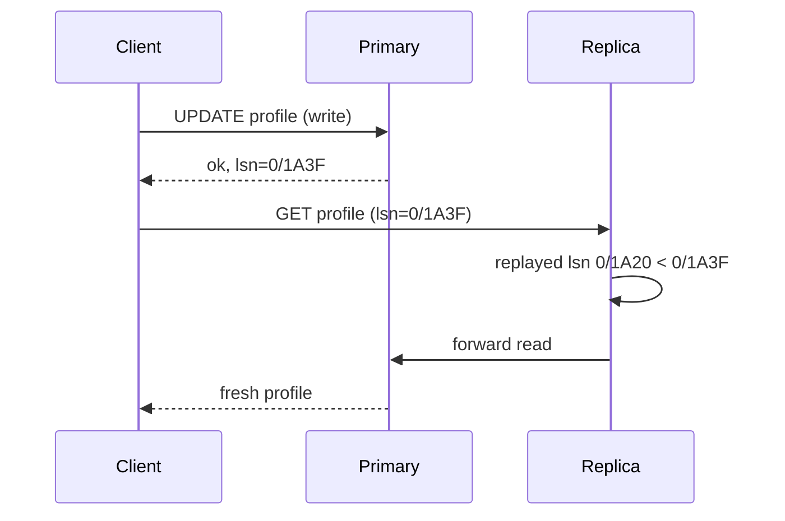

A user posts a comment, refreshes the page, and the comment is gone. Two seconds later it is back. Nothing crashed and nothing was lost, and every engineer on the team will say the system is "eventually consistent" as if that explained it. It does not. The comment went to the primary; the refresh was served by a replica 400 ms behind. The system kept every promise it made, because it never promised the user would see their own write.

A consistency model is exactly that: a rule about which values reads may return, given the writes around them. Every replicated system has one, written down or not. The senior skill is naming the model each operation needs, knowing its price in latency and availability, and knowing where a weaker one is safe. This lesson makes the models concrete by judging histories, the way Jepsen does.

## How to judge a history

A **history** is a list of operations on a register `x` (initially 0), each with the client that issued it, what it did, and its real-time interval from invocation to response:

```text
A: w(1)   [0, 20]      client A wrote 1; the call started at t=0 and returned at t=20
B: r → 0  [50, 60]     client B read and got 0
```

A model is legal for a history if you can find **one total order** of all the operations that (a) respects the model's ordering rule and (b) is *legal*: every read returns the value of the latest write before it in that order. The models differ only in the ordering rule:

| Model | The total order must respect | In words |
|---|---|---|
| Linearizable | Real time: if one operation returned before another began, it comes first | As if there were one copy and each operation took effect at an instant inside its interval |
| Sequential | Each client's own program order | One order everybody agrees on, but it may disagree with the clock |
| Causal | Happens-before: program order plus "read the value written by" | Causes before effects; concurrent writes may be seen in different orders |
| Eventual | Nothing, while writes continue | Replicas converge once writes stop |

## Linearizability: one copy, real time

**History H1** (a stale read after an acknowledged write):

```text
A: w(1)   [0, 20]
B: r → 0  [50, 60]
```

1. A's write returned at 20; B's read began at 50. Real time forces `w(1)` before `r`.
2. In that order the read must return 1. It returned 0. **Not linearizable.**
3. Sequential only needs program order, and A and B each did one thing: the order `r → 0`, `w(1)` is legal. **Sequentially consistent.** A replica that had not yet applied the write produced it.

**History H3** (concurrent reads that disagree):

```text
A: w(1)   [0, 30]
B: r → 1  [10, 20]
C: r → 0  [15, 25]
```

1. Nothing finished before anything else began, so real time imposes no order.
2. Choose instants inside each interval: C at 15, the write at 16, B at 17. C reads 0, then the write, then B reads 1. **Linearizable.** Reads overlapping a write may return either value, even in "opposite" order.

**History H3b**: the same, but C's read is at [25, 35], after B's returned.

1. B returned 1 at 20, so the write took effect before 20. C began at 25, after B finished, so it must come after B and after the write.
2. C returned 0. **Not linearizable**; still sequentially consistent (put C's read before the write). This is the new-then-old inversion across clients that linearizability exists to forbid.

The mechanism that pays for it is coordination on every operation: a single leader serving reads only after confirming it is still the leader, or a quorum protocol with read repair before returning. Its cost is a round trip to a majority, which is 1–2 ms across availability zones and 60–80 ms across US regions. Adding a read replica to a Postgres primary and routing `SELECT`s to it leaves linearizability without changing one line of application code.

```viz
{"type": "system", "scenario": "quorum", "replicas": 3,
 "title": "Quorum reads and writes (W=2, R=2, N=3)", "caption": "R + W > N guarantees the read set overlaps the write set, so some replica in every read has the latest write. Step through and notice that overlap alone does not fix the moment when a write has reached one replica but not two: a read can still return the old value, which is why quorums are not automatically linearizable."}
```

### Why a quorum is not linearizable, traced

Three replicas hold `x = 0` at version 0; writes need W = 2 acknowledgements and reads query R = 2 replicas and return the highest version they see:

| t (ms) | Event | R1 | R2 | R3 | Returned |
|---|---|---|---|---|---|
| 0 | A starts `w(1)`: the coordinator sends version 1 to all three | 0 | 0 | 0 | |
| 1 | R1 applies it; the messages to R2 and R3 are delayed | 1 | 0 | 0 | |
| 2–3 | B reads R1 and R2, sees versions 1 and 0, returns the newer | 1 | 0 | 0 | B: 1 |
| 4–5 | C reads R2 and R3, both at version 0 | 1 | 0 | 0 | C: 0 |
| 6 | R2 applies version 1: two acknowledgements, A's write returns | 1 | 1 | 0 | A: ok |

The history is `A: w(1) [0, 6]`, `B: r → 1 [2, 3]`, `C: r → 0 [4, 5]`: H3b again. The write had not been acknowledged, but B's read fixed its moment before t = 3, and C began after that. R + W > N guarantees that a read overlaps the last *completed* write, not one in flight.

The fix is the second phase of the ABD algorithm (Attiya, Bar-Noy and Dolev, 1995): a reader that sees replicas disagree writes the newest value back to a write quorum before returning. B writes version 1 to R2, waits for two acknowledgements, and returns at about t = 4; C's quorum then contains R2 and sees 1. The price is a second round trip on every read that finds a disagreement. Cassandra repairs mismatches it finds during quorum reads before answering (its `read_repair` table option, blocking by default), which removes this inversion, yet its quorum operations are still not linearizable: a write that reached fewer than W replicas and was reported as failed can surface later through repair, and concurrent writes are ordered by client-supplied timestamps.

## Sequential consistency: one order, not real time

**History H4** (writes reordered against the clock):

```text
A: w(1)   [0, 10]
B: w(2)   [20, 30]
C: r → 2  [40, 50]
C: r → 1  [60, 70]
```

1. Linearizable? The write of 1 finished before the write of 2 began, so the final value is 2 and C's second read must return 2. **No.**
2. Sequential? Only C has two operations, and they stay in order. The order `w(2)`, `r → 2`, `w(1)`, `r → 1` is legal. **Yes**: every client sees one agreed order, it is not the clock's.

ZooKeeper offers this by default: writes are totally ordered through the leader by `zxid`, and each server answers reads from its own state, a prefix of that order. Reads scale with servers; writes do not.

## Causal consistency: causes before effects

**History H6** uses two registers. Alice posts; Bob reads the post and replies; Carol reads the reply, then the post:

```text
Alice: w(post = "spare ticket?")   [0, 10]
Bob:   r(post) → "spare ticket?"   [20, 30]
Bob:   w(reply = "yes please")     [40, 50]
Carol: r(reply) → "yes please"     [60, 70]
Carol: r(post) → (nothing)         [80, 90]
```

1. Bob read Alice's post before writing his reply, so the post *happens before* the reply.
2. Carol saw the reply, so the post is in her causal past; her later read of the post must return it. It did not. **Not causal**, and therefore not sequential or linearizable either.
3. Eventual consistency allows it: the reply's partition replicated first. On a timeline it looks like an orphaned "yes please".

The mechanism is dependency tracking: each write carries the versions it depended on (a vector clock, or a session's "I have seen up to here" token), and a replica delays applying a write until its dependencies are applied. That metadata and the held-back writes are why few systems offer full causal consistency; MongoDB's causally consistent sessions do it per session by tagging reads with `afterClusterTime`, so a secondary waits until it has applied everything the session has seen. [Time and ordering](/learn/system-design/distributed-systems/time-and-ordering) covers vector clocks.

### Causal but not sequential: H7

Two clients write concurrently, and two observers see the writes in opposite orders:

```text
A: w(1)   [0, 10]
B: w(2)   [0, 10]
C: r → 1  [20, 30]
D: r → 2  [20, 30]
C: r → 2  [40, 50]
D: r → 1  [40, 50]
```

1. Neither writer read the other's value, so `w(1)` and `w(2)` are concurrent: no happens-before edge between them.
2. Causal? Each observer's view must respect happens-before, and there is none between the writes, so C may apply 1 then 2 and D may apply 2 then 1. **Causal.**
3. Sequential? One total order must explain both observers. C's reads force `w(1)` before `w(2)`; D's force `w(2)` before `w(1)`. **Not sequential**, and so not linearizable.

This is the anomaly of multi-leader replication: two regions each apply their local write first and ship it to the other. Plain causal consistency allows the history forever; systems that also promise convergence (COPS called it causal+) add a conflict rule. With last-writer-wins, the replica that already holds the write with the higher timestamp ignores the other one when it arrives, so one of the two observers never sees the flip; with siblings, both observers eventually read `{1, 2}` and the application merges. Either way the observers disagreed for a while, which is the price of accepting writes without coordinating them ([CAP and PACELC](/learn/system-design/building-blocks/cap-and-pacelc) traces the multi-leader case).

## Eventual consistency: convergence, sometime

Eventual consistency promises only that replicas converge if writes stop. The honest description of "eventually" is a number:

```viz
{"type": "system", "scenario": "replication-leader-follower", "replicas": 2,
 "title": "One leader, two asynchronous followers", "caption": "The leader acknowledges the write before followers apply it. A read routed to a follower in that window returns the old value; that window is the replication lag."}
```

| Setting | Lag when healthy | Lag under stress |
|---|---|---|
| Postgres streaming replica, same AZ | 1–10 ms | Seconds to minutes during bulk loads, long transactions or replay conflicts |
| Cross-region asynchronous replica | 50–200 ms | Minutes if the link saturates |
| DynamoDB eventually consistent read | Usually under a second | Not bounded by the documentation |
| Cassandra read at `ONE` | Milliseconds | Until repair, possibly hours, for a write a replica missed |

It is right for view counts, recommendations, search indexes and dashboards, and a bug for anything a user just changed and is about to look at.
**How stale, how often.** Bailis and colleagues called the answer probabilistically bounded staleness (PBS, 2012): the probability that a read issued t milliseconds after a write was acknowledged misses it. Simulated for three replicas, each applying a write 0.5 ms plus an exponential delay averaging 2 ms after it is sent, with 1% of deliveries stalled an extra 50 ms (a GC pause or a busy disk), read requests taking 0.5 ms on average to arrive, and 200,000 trials per cell:

| Read and write quorums | t = 0 | 1 ms | 5 ms | 10 ms | 50 ms |
|---|---|---|---|---|---|
| R = 1, W = 1 | 53% | 33% | 5.3% | 1.3% | 0.55% |
| R = 1, W = 2 | 27% | 17% | 3.1% | 1.2% | 0.27% |
| R = 2, W = 1 | 21% | 8.1% | 0.20% | 0.015% | 0.002% |
| R = 2, W = 2 (R + W > N) | 0 | 0 | 0 | 0 | 0 |

Three readings. Immediately after a write, a single-replica read is stale about half the time, so read-your-writes cannot be left to luck. Staleness decays fast, 5% after 5 ms, and then hits a floor set by the stall rate, not the average delay: after 50 ms the only stale reads left are those that landed on a stalled replica. And reading two replicas buys more freshness than writing to two, because a read that sees any fresh copy wins while a write that waits for two still leaves the third behind. With stalls a hundred times rarer the floor drops accordingly; the shape, a fast decay onto a tail set by pauses, is what to expect from any real store.

## Session guarantees: the ones you implement

Four guarantees scoped to one client's session cover the anomalies users notice, each cheaply:

| Guarantee | Promise | Implementation |
|---|---|---|
| Read-your-writes | After you write, your reads see it | Carry the write's log position; read from a replica that has applied it, else the primary |
| Monotonic reads | Once you see version 5 you never see version 4 | Carry the highest position seen; reject replicas behind it (or stick to one replica) |
| Monotonic writes | Your writes apply in the order you issued them | Free with a single leader; per-session sequence numbers with several |
| Writes-follow-reads | A write issued after reading `v` is ordered after `v` | Attach the positions read as the write's dependencies |

**History H2** is time travel for one reader: `A: w(1) [0, 10]`, then `B: r → 1 [20, 30]` and `B: r → 0 [40, 50]`. B's two reads must stay in order, the first needs the write before it and the second needs the write after it, so no order exists under sequential or causal consistency; only eventual allows it, and it happens whenever a balancer sends B's second request to a replica further behind. Monotonic reads forbids it.

**History H5** is the vanishing comment: `A: w(1) [0, 10]`, then `A: r → 0 [20, 30]`. Program order puts A's write before A's read, so every model except eventual forbids it, and read-your-writes is exactly the guarantee that does. Implemented with log positions:

```python
class Primary:
    def __init__(self):
        self.log, self.state = [], {}

    def write(self, key, value):
        self.log.append((key, value))
        self.state[key] = value
        return len(self.log)                     # the commit's log position (its LSN)

class Replica:
    def __init__(self, primary):
        self.primary, self.applied, self.state = primary, 0, {}

    def replay(self, upto):                      # apply the primary's log up to a position
        for key, value in self.primary.log[self.applied:upto]:
            self.state[key] = value
        self.applied = max(self.applied, upto)

def read(key, replica, primary, token=0):
    if replica.applied >= token:                 # replica has seen this session's last write
        return replica.state.get(key), "replica"
    return primary.state.get(key), "primary"     # behind the token: go to the primary

p = Primary()
r = Replica(p)
p.write("name", "Adelaide")
r.replay(1)
token = p.write("name", "Ada")                   # the API returns this position to the client
print(read("name", r, p))                        # ('Adelaide', 'replica'): stale, no token
print(read("name", r, p, token))                 # ('Ada', 'primary'): the token forces freshness
r.replay(token)
print(read("name", r, p, token))                 # ('Ada', 'replica'): caught up, replica serves it
```

In Postgres the position is `pg_current_wal_lsn()` on the primary and `pg_last_wal_replay_lsn()` on the replica; [Database scaling](/learn/system-design/building-blocks/database-scaling) traces it with real LSNs. Other users still see the stale replica, which is usually fine: they cannot know a write happened.



**Sessions span devices.** A token held by the client gives read-your-writes per session, not per user: the user edits their profile on a phone, opens a laptop, and the laptop's session has no token. When the product promises "your change shows everywhere you are signed in", keep the user's last write position on the server, in a small key-value entry (`user:42:lsn`) that expires after the longest lag you tolerate, and check it on every read for that user. Almost every read finds no entry and goes to a replica at no cost.

## Caches are replicas too

Clients observe the whole path, not the database. A linearizable primary behind a cache-aside layer gives users whatever the cache says, and the classic race leaves the cache stale until its TTL:

| t | Reader R | Writer W | Database | Cache |
|---|---|---|---|---|
| 0 | `GET k`: miss | | v1 | – |
| 1 | Reads the database: v1 | | v1 | – |
| 2 | Pauses (GC, a slow network) | `UPDATE k = v2`; commit | v2 | – |
| 3 | | `DELETE k` from the cache | v2 | – |
| 4 | `SET k = v1` | | v2 | **v1** |
| 4 to TTL | Every reader gets v1 | | v2 | v1 |

The writer did everything right; the reader wrote back a value it had read before the invalidation. Facebook's memcache paper (2013) describes the fix it used, **leases**: a miss hands the reader a token, a delete invalidates outstanding tokens, and a `SET` carrying an invalidated token is refused. A version-conditional set ("store only if newer than what is cached") achieves the same, and a TTL bounds the damage when both fail. [Caching strategies](/learn/system-design/building-blocks/caching-strategies) covers the patterns.

HTTP caches are replicas with no invalidation at all. `Cache-Control: max-age=60` on a profile page means the browser and any CDN serve the old profile for up to a minute after the user edits it, however consistent the database is. Resources a user can change get `no-cache` with an ETag (revalidate every time, and receive a cheap 304 when nothing changed), or a version in the URL that changes when the content does.

## Which anomalies each model allows

| Anomaly | History | Linearizable | Sequential | Causal | Session guarantees | Eventual |
|---|---|---|---|---|---|---|
| Another client reads stale data after the write was acknowledged | H1 | No | Yes | Yes | Yes | Yes |
| A read returns old after another client's read returned new | H3b | No | Yes | Yes | Yes | Yes |
| Writes observed in an order contradicting real time | H4 | No | Yes | Yes, if concurrent | Yes | Yes |
| Two observers see two concurrent writes in different orders | | No | No | Yes | Yes | Yes |
| An effect visible before its cause (another client's chain) | H6 | No | No | No | Yes | Yes |
| New then old for the same reader | H2 | No | No | No | No (monotonic reads) | Yes |
| Your own write missing from your next read | H5 | No | No | No | No (read-your-writes) | Yes |

Read the table bottom-up when designing: session guarantees remove the two anomalies a user can see about their own actions; causal adds the "reply before question" anomaly across users (DDIA calls the fix consistent prefix reads); only linearizability removes the real-time anomalies that matter when clients coordinate, such as two users both booking the last seat.

```exercise
id: history-checker
title: Check a history for linearizability or sequential consistency
prompt: |
  Implement `check_history(history, model)` for a single register whose initial
  value is 0. Each operation is `[client, kind, value, start, end]`: `kind` is
  `"w"` (wrote `value`) or `"r"` (read and got `value`); `start < end` are real
  times. Written values are distinct.

  Return `true` if there is a total order of all operations in which every read
  returns the value of the most recent write before it (0 if none), and which
  respects:

  - `"linearizable"`: if operation a's `end` is less than b's `start`, a comes before b.
  - `"sequential"`: operations by the same client stay in order of their `start`.

  Histories have at most 10 operations, so a backtracking search is fine.
languages: [python, javascript]
entry: check_history
starter:
  python: |
    def check_history(history, model):
        # your code here
        return False
  javascript: |
    function check_history(history, model) {
      // your code here
      return false;
    }
tests:
  - args: [[["A", "w", 1, 0, 20], ["B", "r", 0, 50, 60]], "linearizable"]
    expected: false
    label: stale read after an acknowledged write
  - args: [[["A", "w", 1, 0, 20], ["B", "r", 0, 50, 60]], "sequential"]
    expected: true
  - args: [[["A", "w", 1, 0, 30], ["B", "r", 1, 10, 20], ["C", "r", 0, 15, 25]], "linearizable"]
    expected: true
    label: reads overlapping a write may split
  - args: [[["A", "w", 1, 0, 30], ["B", "r", 1, 10, 20], ["C", "r", 0, 25, 35]], "linearizable"]
    expected: false
    label: old after new across clients
  - args: [[["A", "w", 1, 0, 10], ["B", "w", 2, 20, 30], ["C", "r", 2, 40, 50], ["C", "r", 1, 60, 70]], "sequential"]
    expected: true
    label: sequential ignores real time between clients
  - args: [[], "linearizable"]
    expected: true
    label: empty history
  - args: [[["A", "w", 1, 0, 10], ["B", "r", 1, 20, 30], ["B", "r", 0, 40, 50]], "sequential"]
    expected: false
    hidden: true
  - args: [[["A", "w", 1, 0, 100], ["B", "r", 0, 10, 20], ["B", "r", 1, 30, 40], ["C", "r", 1, 50, 60]], "linearizable"]
    expected: true
    hidden: true
hints:
  - "Precompute, for each operation, the set of operations that must come before it under the chosen model; an operation can be placed next only when all of those are placed."
  - "Search depth-first carrying the register's current value; memoise on (set of placed operations, current value) to prune repeated states."
```

## What each model costs

| Model | Read cost | Write cost | During a partition | Metadata | Typical implementation |
|---|---|---|---|---|---|
| Linearizable | Leader confirmation or quorum round trip | Majority round trip | Only the majority side answers | The replicated log | etcd, Spanner, a single leader serving all reads |
| Sequential | Local | Through the leader | Reads may be stale anywhere; writes on the majority side | A log position | ZooKeeper |
| Causal | Local, sometimes waiting for dependencies | Local, replicated asynchronously | Both sides keep working | Dependencies per write | COPS (research), MongoDB causal sessions |
| Session guarantees | Local, or the primary when behind the token | The leader | Mostly, while the session reaches its side | One token per session | LSN or version tokens |
| Eventual | Local | Local, replicated asynchronously | Both sides keep working | A version per value for merging | Dynamo-style stores, asynchronous replicas |

The dividing line is the partition column. Mahajan, Alvisi and Dahlin showed (2011) that no model stronger than a real-time variant of causal consistency can be offered by a system that stays available on both sides of a partition and still converges. Everything above causal in the table pays for its guarantee by refusing some requests when the network splits.

## Under the hood: how systems implement their promises

| System | Default | Mechanism | Stronger option and its cost |
|---|---|---|---|
| Postgres + replicas | Linearizable on the primary, eventual on replicas | Physical WAL streaming | `synchronous_commit = remote_apply`: commits wait until standbys replay, so every replica read sees them; each commit pays the slowest standby's apply time |
| etcd | Linearizable reads | ReadIndex: the leader notes its commit index, confirms leadership with a heartbeat round to a majority, waits until that index is applied, then answers | Serializable reads (`--consistency=s`) skip the round and may be stale |
| ZooKeeper | Sequential, with each client's operations in FIFO order | Writes ordered by the leader (ZAB); reads from the connected server | `sync()` before a read: the server catches up with the leader first |
| DynamoDB | Eventually consistent reads | Three replicas per partition across AZs, one leader | `ConsistentRead=true`: served by the leader, twice the read units, not available on global secondary indexes |
| Cassandra | Per query: `ONE`, `QUORUM`, `ALL` | Leaderless replicas, timestamps per cell | `QUORUM` reads and writes overlap but are not linearizable; lightweight transactions run Paxos per partition at about four round trips |
| Spanner | External consistency (linearizable, transactional) | TrueTime: a commit waits until the clock's uncertainty interval (a few ms) has passed its timestamp | Already the strongest; latency depends on replica placement |
| MongoDB | Reads from the primary | Replica-set oplog | Causally consistent sessions (`afterClusterTime`), with majority read and write concerns for the full guarantee |

"Strong" is not one thing: DynamoDB's strongly consistent read is linearizable for one item, not for a query spanning items. And the price is always paid in the same currencies: an extra round trip, a heavier read unit, or refusing requests during a partition, which is the subject of [CAP and PACELC](/learn/system-design/building-blocks/cap-and-pacelc). To test a claim rather than read the documentation, record histories like the ones above from concurrent clients and search for a legal order; Jepsen's Knossos (linearizability) and Elle (transactional isolation) checkers have found documented guarantees violated in many widely used databases.

## Consistency is not isolation

Interviewers conflate them on purpose. Isolation (the I in ACID) is about concurrent *transactions* on one database: dirty reads, write skew, phantoms ([Isolation levels and anomalies](/learn/databases/relational-fundamentals/isolation-levels-and-anomalies)). Replication consistency is about *copies* on different machines. A serializable primary with an asynchronous replica gives serializable transactions on the primary and eventual reads on the replica at the same time. Spanner's external consistency is both: serializable isolation plus linearizable ordering across replicas.

## Failure modes

| Failure | Symptom | Diagnosis | Fix |
|---|---|---|---|
| Vanishing edit | "My comment disappeared, then came back" | Reads after writes routed to lagging replicas; no session token | Read-your-writes with LSN tokens or primary pinning after writes |
| Time travel between replicas | A user sees a new value, then an old one, on consecutive requests | Balancer spreads a session over replicas with different lag; log replica ID and position per response | Carry the highest position seen (monotonic reads) or pin sessions to a replica |
| Lost update via replica read | Counters and stock levels drift below reality | Read-modify-write computed from a replica value | Atomic `UPDATE ... SET n = n - 1` or a conditional write on the primary |
| Stale reads after failover | Previously read data "un-happens" | Asynchronous replica promoted while behind | Synchronous standby for data that must survive; alert on lag before failover |
| Linearizability everywhere | Leader saturated at ~10,000 queries/s while replicas idle | Every read pinned to the leader "to be safe" | Classify reads; only the ones that feed decisions need the leader |
| Cache holds a pre-update value | A changed price or profile stays wrong for exactly the cache TTL, then fixes itself | Cache value older than the database row; a slow reader's `SET` after the writer's delete in traces | Leases or version-conditional sets; TTLs short enough to bound the damage |
| Edit invisible on another device | "I changed it on my phone and my laptop still shows the old one" | Read-your-writes token held per session, not per user | Last-write position per user on the server, checked on reads |
| Quorum read inversion | A value appears, then disappears for another client moments later, during writes | Quorum reads without write-back; histories with an in-flight write | Blocking read repair (write back to a quorum before returning), or a leader for operations that need it |

## Interviewer follow-ups

**"The feed is eventually consistent. What does a user see when they post and refresh?"** Model answer: their post, because the posting session gets read-your-writes: the write returns its log position and the next read is served only by a replica that has applied it, otherwise by the primary. Other users may miss it for up to the lag, under 100 ms in region, which is invisible to them. Common wrong answer: "eventually they see it", which is the bug.

**"Which operations here need linearizability?"** Model answer: those where two clients acting on a stale value produce a wrong outcome: the last seat, an inventory decrement, a lock, a balance before a transfer. They go to the leader or through a conditional write that fails on a version mismatch; everything else, usually over 95% of reads, tolerates staleness. Common wrong answer: "all writes", which confuses durability with ordering.

**"How would you test that a store is linearizable?"** Model answer: record a history of concurrent operations with real-time intervals from many clients, including through partitions and failovers, and search for a legal total order that respects real time, as Knossos does; any history with none is a counterexample. In CI, a smaller version: a few clients on one key, checking that no client reads a value older than one already observed. Common wrong answer: "check that all replicas end with the same value", which only tests convergence.

**"Causal consistency sounds ideal. Why is it rare?"** Model answer: tracking dependencies across all clients means metadata on every write and replicas holding writes back until dependencies arrive, so one slow partition stalls unrelated writes. Session guarantees give the user-visible part (causality within one client) with one token. Common wrong answer: "it is too slow", with no mechanism.

**"DynamoDB strongly consistent reads cost twice as much. When are they worth it?"** Model answer: when the read feeds a decision that writes: reading a cart before applying a coupon, reading an item's version before a conditional update. The extra read unit is trivial next to a wrong decision. Display reads stay eventual, and anything served through a global secondary index is eventual whatever the flag says. Common wrong answer: "always, to be safe", which doubles the read bill for pages nobody can tell are a second stale.

**"N = 3, W = 2, R = 2. Is it linearizable?"** Model answer: no. Overlap guarantees a read sees the last *completed* write; during a write in flight, one read can see the new value on the single replica that has it and a later read can miss it on the other two, which is a real-time inversion. Making it linearizable takes a write-back phase: a reader that sees disagreement writes the newest value to a quorum before returning (ABD), paying a second round trip on those reads, plus a total order for concurrent writes that is not wall-clock timestamps. Common wrong answer: "yes, because R + W > N".

**"The database is linearizable, yet a user sees their old display name after changing it. Where do you look?"** Model answer: at every copy between the database and the screen: the replica that served the read, the cache-aside layer (the race where a slow reader writes back a pre-update value after the invalidation), a CDN or browser cache honouring `max-age`, and the client's own state store. Clients observe the path, not the primary; log which layer served each response. Common wrong answer: "the database must have a bug".

## What mid-level engineers get wrong

- Adding read replicas and not noticing that the application's consistency model changed.
- Saying "eventually consistent" without a lag number or a session guarantee.
- Read-modify-write from a replica, losing updates.
- Believing `QUORUM` reads and writes are linearizable.
- Confusing isolation levels with replication consistency.
- Pinning every read to the leader instead of classifying reads.
- Guaranteeing read-your-writes per session and then promising it across a user's devices.
- Forgetting that caches, CDNs and browsers are replicas, so a consistent database still serves stale pages.

## Senior signals

- You define a model by the histories it allows and can judge a small history by hand.
- You know the anomaly each model admits, and pick the weakest model that forbids the anomalies your product cannot tolerate.
- You implement read-your-writes and monotonic reads with log positions rather than routing everything to the primary.
- You choose consistency per operation and name the two or three operations that need linearizability.
- You quote lag as a number with a distribution, and know failover can break a guarantee the healthy system keeps.
- You can explain how etcd, ZooKeeper, DynamoDB and Spanner pay for their guarantees.
- You treat staleness as a distribution (fast decay onto a tail set by pauses), know why quorum overlap is not linearizability, and count caches as replicas.

## Check yourself

```quiz
- q: >-
    A write of x = 1 returns at t = 20 ms. A different client starts a read at t = 50 ms and receives 0. Which models permit this history?
  options: ["Only eventual consistency, since the others forbid stale reads", "Sequential, causal and eventual, but not linearizable", "All of them, because reads overlapping writes may return either value", "None, because an acknowledged write must be visible to all"]
  answer: 1
  explanation: >-
    Linearizability orders operations by real time, so a read that begins after the write returned must see it. Sequential and causal consistency only need an order consistent with each client's program order, and the read can be placed before the write. The read does not overlap the write, so the "either value" rule does not apply.
- q: >-
    N = 3, W = 2, R = 2. A write has reached one replica so far. Client B reads replicas 1 and 2 and gets the new value; after B returns, client C reads replicas 2 and 3 and gets the old one. Which statement is right?
  options: ["It violates only read-your-writes, since C never wrote anything", "It is linearizable, since the write had not yet been acknowledged", "It cannot happen, since R + W > N guarantees the quorums overlap", "It violates linearizability; B's read fixed the write's moment"]
  answer: 3
  explanation: >-
    Once B returned the new value, the write must take effect before B's response, and C began afterwards, so C must see it too. Quorum overlap covers the last completed write, not one in flight. A write-back phase, where a reader that sees disagreement writes the newest value to a quorum before returning, removes the inversion at the cost of a second round trip.
- q: >-
    Client C reads a reply to a post, then reads the post and finds nothing. Which is the weakest model that forbids this?
  options: ["Read-your-writes", "Causal consistency", "Eventual consistency", "Linearizability"]
  answer: 1
  explanation: >-
    The reply was written by someone who had read the post, so the post happens before the reply; causal consistency requires anyone who sees the reply to see the post. Linearizability also forbids it but is stronger than needed. Read-your-writes covers only a client's own writes, and eventual consistency allows it.
- q: >-
    A user sees a new profile value on one request and the old one on the next, as the balancer alternates between two replicas with different lag. Which guarantee is missing, and what is the cheap fix?
  options: ["Read-your-writes; add more replicas to cut the lag", "Monotonic writes; number every write in the session", "Linearizability; route all reads through the leader", "Monotonic reads; carry the highest log position seen"]
  answer: 3
  explanation: >-
    Seeing a newer state and then an older one violates monotonic reads. Carrying the highest position seen and refusing replicas behind it (or pinning the session to one replica) fixes it with one token. The user did not write anything, so read-your-writes and monotonic writes are not the issue; routing everything to the leader works but gives up the replicas.
- q: >-
    A service reads an inventory count from a replica, subtracts one, and writes the result to the primary. The likely bug is:
  options: ["A lost update, from computing on a stale replica value", "A phantom read, from rows inserted during the transaction", "Write amplification, from updating the primary and replicas", "A deadlock, from reading and writing on two different nodes"]
  answer: 0
  explanation: >-
    The replica value may lag the primary; writing a value computed from it overwrites decrements the replica had not seen. An atomic UPDATE on the primary or a conditional write (WHERE version = expected) prevents it. No locks span the two nodes, so there is nothing to deadlock.
- q: >-
    How does etcd serve a linearizable read without writing to its log?
  options: ["The read waits for the next log compaction to finish", "The follower that receives it answers from its locally applied state", "The leader confirms it still leads, then waits for its commit index", "The client reads from a majority and takes the newest value"]
  answer: 2
  explanation: >-
    ReadIndex: the leader records its commit index, confirms with a heartbeat round that a majority still follows it (so no newer leader has committed anything), waits until its state machine has applied that index, and answers. A follower answering locally is etcd's serializable read, which may be stale.
```
