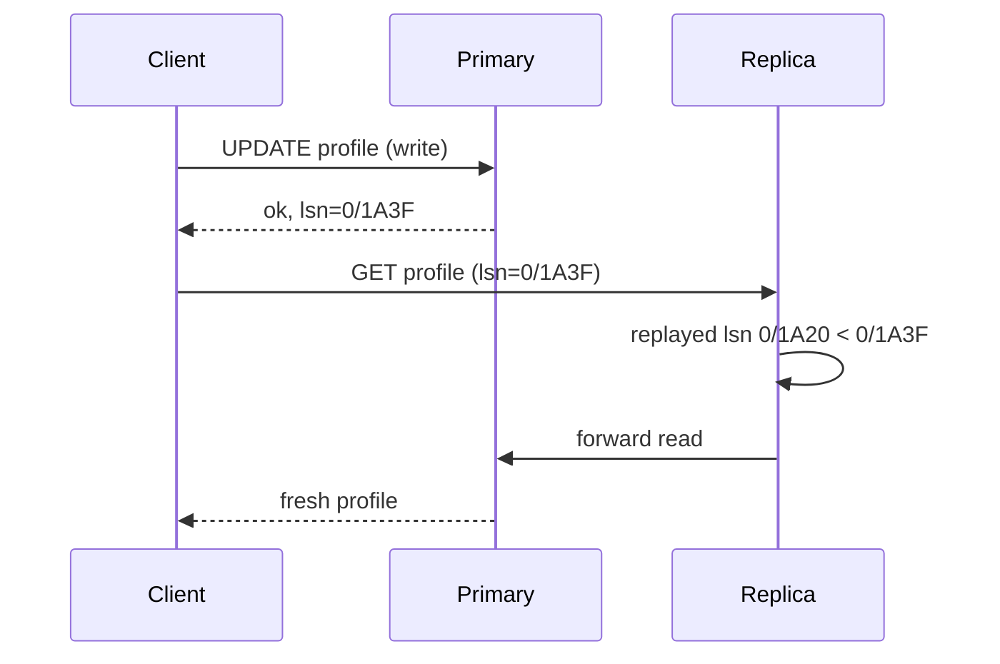

A user posts a comment, refreshes the page, and the comment is gone. Two seconds later it is back. Nothing crashed, nothing was lost, and every engineer on the team will say the system is "eventually consistent" as if that explained it. It does not. The comment went to the primary; the refresh was served by a replica that was 400 ms behind. The system kept every promise it made, because it never promised the user would see their own write.

A consistency model is exactly that: a promise about which values a read is allowed to return, given the writes that happened around it. Every replicated system has one, whether or not anyone wrote it down. The senior skill is naming the model your product needs per operation, knowing what it costs in latency and availability, and knowing which of the weaker models you can afford where.

## The question every model answers

Take one register `x`, three replicas, and two clients. Client A writes `x = 1` at 10:00:00.000; the write is acknowledged at 10:00:00.020. Client B reads `x` at 10:00:00.010, while A's write is in flight, and again at 10:00:00.050, after it was acknowledged.

Which values may B's reads return? The first read overlaps the write, so any model lets it return 0 or 1. The second read starts after the write completed. Whether it must return 1, or is allowed to return 0, is the entire difference between the models below.

```viz
{"type": "system", "scenario": "replication-leader-follower", "replicas": 2,
 "title": "One leader, two async followers", "caption": "The leader acknowledges the write before followers apply it. A read routed to a follower in that window returns the old value; that window is the replication lag."}
```

## Linearizability: one copy, real time

Linearizability says the system behaves as if there were a single copy of the data and every operation took effect atomically at some instant between its start and its completion. Once a write has been acknowledged, every subsequent read anywhere returns it or something newer. B's second read must return 1.

The mechanism that pays for this is coordination on every operation. A single-leader database gives you linearizable reads and writes only when reads go to the leader (or to a follower that first confirms it has caught up to the leader's latest commit). A quorum system gives it only with extra work: read repair before returning, or a read that waits for the write it observed to reach a quorum. A consensus system (etcd, ZooKeeper with `sync()`) gives it by routing reads through the leader's log position.

The cost is latency, and it scales with distance. Same-availability-zone coordination costs on the order of 0.5 to 1 ms per round trip; cross-region, 60 to 80 ms for US-East to US-West and more to Europe. A linearizable write that must reach a majority of replicas spread across three regions pays the second-fastest cross-region RTT on every commit, which is why Spanner-style systems put regional replicas close together and accept ~10 ms writes rather than 100 ms ones.

```viz
{"type": "system", "scenario": "quorum", "replicas": 3,
 "title": "Quorum reads and writes (W=2, R=2, N=3)", "caption": "R + W > N guarantees the read set overlaps the write set, so at least one replica in every read has the latest write. Step through and notice that overlap alone does not fix the moment when a write has reached one replica but not two: a read can still return the old value, which is why quorums are not automatically linearizable."}
```

It is also the model most engineers assume they have when they do not. A Postgres primary behind a connection pool is linearizable per key. The moment you add a read replica and route `SELECT`s to it, you have left linearizability without changing a line of application code.

## Sequential consistency: one order, not real time

Sequential consistency keeps "a single total order that every client agrees on, consistent with each client's own program order", but drops the real-time requirement. B's second read may return 0 as long as B never later sees a history that contradicts it: once B sees 1, it can never see 0 again, and every client agrees on the order of writes.

This is what ZooKeeper offers by default. Writes go through the leader and are totally ordered by `zxid`; reads are served from whichever server the client is connected to, which may lag. The client always sees a prefix of the true history, and the prefix only grows. That is sequential (plus the FIFO client order ZooKeeper adds), and it is the reason ZooKeeper reads scale linearly with servers while its writes do not.

## Causal consistency: if it could have caused it, you see it

Causal consistency requires that writes related by *happens-before* are seen in that order by everyone. Concurrent writes may be seen in different orders by different replicas.

The canonical example: Alice posts "Anyone want my spare ticket?" and Bob replies "Yes please". Bob's reply was caused by Alice's post; Bob read the post before writing his reply. Under causal consistency no replica may show Bob's reply without Alice's post. Under eventual consistency, a replica that received Bob's reply first (they went to different partitions, or a different region) shows an orphaned "Yes please" for a few hundred milliseconds.

The mechanism is dependency tracking. Each write carries the versions it depended on (a vector clock, or a per-session "I have read up to here" token), and a replica delays applying a write until its dependencies have been applied. That is a real cost: metadata per write and the possibility of holding a write back. It is why most production systems implement a narrower subset, the session guarantees, rather than full causal consistency across all clients. [Time and ordering](/learn/system-design/distributed-systems/time-and-ordering) covers how happens-before is tracked.

## Eventual consistency: convergence, eventually

Eventual consistency promises only that if writes stop, all replicas converge to the same value. It says nothing about what any read returns in the meantime. The honest description of "eventually" is a number: replication lag.

| Setting | Typical lag when healthy | Lag under stress |
|---|---|---|
| Postgres streaming replica, same AZ | 1 to 10 ms | Seconds to minutes during a long transaction, DDL or a replica I/O stall |
| Cross-region async replica | 50 to 200 ms | Minutes if the link saturates |
| DynamoDB eventually consistent read | Typically under a second | The documentation only promises "usually within a second" |
| Cassandra with `ONE` reads | Milliseconds | Until anti-entropy repair runs, which can be hours for a dropped write |

Eventual consistency is fine for data where a stale read is invisible or harmless: view counts, recommendation rows, search indexes, dashboards. It is a bug for anything the user just changed and is about to look at, which brings us to the guarantees that fix that.

## Session guarantees: the ones you actually implement

Full causal consistency is expensive. The four session guarantees give you the cases users notice, scoped to a single client session, and each has a cheap implementation.

| Guarantee | What it promises | How to get it |
|---|---|---|
| Read-your-writes | After you write, your reads see it | Route reads to the leader for N seconds after a write; or carry the write's LSN/version and only read from a replica that has applied it |
| Monotonic reads | Once you see version 5 you never see version 4 | Stick a session to one replica; or carry the highest version seen and reject older replicas |
| Monotonic writes | Your writes apply in the order you issued them | Single leader does this; multi-leader needs per-session sequencing |
| Writes-follow-reads | A write you issue after reading `v` is ordered after `v` | Attach the versions read to the write as dependencies |

Read-your-writes is the one to remember. The comment-vanishes bug at the top of this lesson is a missing read-your-writes guarantee. Two implementations are common. The simple one is time-based: after any write, the client (or the gateway, keyed on the user) sends reads to the primary for, say, 5 seconds, which comfortably exceeds normal lag. The precise one is token-based: the primary returns the write's log position (Postgres `pg_current_wal_lsn()`, MySQL GTID); the client sends it with the next read; the replica compares it with `pg_last_wal_replay_lsn()` and either serves the read or forwards it to the primary. The token version costs one extra header and gives you correctness rather than probability.

```python
def read_user_profile(user_id, session):
    replica = pick_replica()
    if session.last_write_lsn and replica.replayed_lsn() < session.last_write_lsn:
        replica = primary          # replica has not caught up to this session's write
    return replica.query("SELECT ... WHERE id = %s", user_id)
```



Note what this does not fix. Another user reading Alice's profile still sees the stale replica. That is usually fine: they have no way of knowing a write just happened.

## A worked timeline

Three replicas R1 (leader), R2, R3, with async replication. Client A writes `x = 1` at t = 0, acknowledged by R1 at t = 5 ms. R2 applies it at t = 20 ms, R3 at t = 400 ms (it is in another region).

| Read | Time | Served by | Linearizable | Sequential | Causal | Read-your-writes (A) | Eventual |
|---|---|---|---|---|---|---|---|
| A reads x | 10 ms | R2 | must be 1 | 0 or 1 | 0 or 1 | must be 1 | 0 or 1 |
| B reads x | 10 ms | R3 | must be 1 | 0 or 1 | 0 or 1 | 0 or 1 | 0 or 1 |
| B reads x after seeing 1 | 30 ms | R3 | must be 1 | must be 1 | must be 1 | 0 or 1 | 0 or 1 |
| B reads x | 500 ms | R3 | must be 1 | must be 1 | must be 1 | 0 or 1 | must be 1 (converged) |

The third row is the one that separates sequential and causal from eventual: once B has seen 1, a system that lets B see 0 again has broken monotonic reads. The first row is the one that separates read-your-writes from everything weaker: A must not see its own write missing.

## Where real systems sit

| System | Default reads | Strongest available | Cost of the strongest |
|---|---|---|---|
| Postgres primary + replicas | Linearizable on primary, eventual on replicas | Linearizable (route to primary or LSN-check) | Primary read load; replica pinning |
| DynamoDB | Eventually consistent | Strongly consistent read (`ConsistentRead=true`) | Twice the read capacity units, slightly higher latency, not available on global secondary indexes |
| Cassandra | Tunable per query (`ONE`, `QUORUM`, `ALL`) | `QUORUM` reads and writes give overlap, not linearizability; lightweight transactions (Paxos) give linearizable per partition at roughly 4x the round trips | Latency and throughput |
| Spanner | Externally consistent (linearizable across the whole database) | Same | Commit wait tied to TrueTime uncertainty, ~ several ms; regional configuration matters |
| ZooKeeper / etcd | Sequential (ZK) / serializable-from-any-member (etcd) | Linearizable via `sync()` / linearizable read through leader | One extra round trip to the leader |
| Redis replica | Eventual | Reads from the primary | Primary load |

Two things to notice. First, "strong" is not one thing: DynamoDB's strongly consistent read is linearizable for a single item, not for a query spanning items. Second, the price is always expressed in the same currencies: an extra round trip, a heavier read unit, or less availability during a partition, which is the subject of [CAP and PACELC](/learn/system-design/building-blocks/cap-and-pacelc).

## Consistency is not isolation

Interviewers deliberately conflate these to see if you separate them. Isolation (the I in ACID) is about concurrent *transactions* on one database: dirty reads, write skew, phantoms; see [Isolation levels and anomalies](/learn/databases/relational-fundamentals/isolation-levels-and-anomalies). Consistency in the replication sense is about *copies* of data on different machines. A serializable database with an async replica gives you serializable transactions on the primary and eventual consistency on the replica, at the same time, and the two do not interact. Spanner's "external consistency" is the combination: serializable isolation plus linearizable ordering across replicas.

## Failure modes

**Stale read after failover.** The primary dies; a replica 2 seconds behind is promoted. Every write in those 2 seconds is gone, and clients that had read them now see an older state. This is a consistency violation even a linearizable-in-normal-operation system can commit if failover is asynchronous. Detect: monitor replication lag and alert before failover, not after. Mitigate: synchronous or semi-synchronous replication to at least one replica, or accept the loss window explicitly and make it visible in the postmortem template.

**Lost update via replica read.** Service reads a counter from a replica (value 10, stale; primary is at 12), increments, writes 11 to the primary. Two updates lost. Detect: compare-and-set on write (`UPDATE ... WHERE version = 10`) fails loudly. Mitigate: never read-modify-write from a replica; do it in one statement on the primary, or use a conditional write.

**The vanishing comment.** Missing read-your-writes. Detect: user reports and a test that writes then immediately reads through the replica path. Mitigate: primary pinning for N seconds or LSN tokens, as above.

**Linearizability where it is not needed.** A team routes every read through the leader "to be safe". The leader saturates at roughly 10k queries per second while three replicas sit idle, and p99 latency doubles under load. Detect: leader CPU and connection saturation with idle replicas. Mitigate: classify reads; move eventual-tolerant reads to replicas, keep read-your-writes for the session that just wrote.

## Interviewer follow-ups

**Q: "You said the feed is eventually consistent. What does the user see when they post and refresh?"**

They see their post, because I implement read-your-writes for the posting session: the write returns the primary's log position, the client sends it on the next read, and the replica either has applied that position or the read is forwarded to the primary. Other users may not see the post for up to the replication lag, which I would budget at under 100 ms in region and under a second cross-region, and which is invisible to them. I would not route all feed reads to the primary; that throws away the read scaling that was the reason for replicas.

**Q: "Which operations in this design need linearizability?"**

The ones where two clients acting on a stale value produce a wrong outcome: checking out the last seat, decrementing inventory, acquiring a lock, reading a balance before a transfer. Those go to the leader, or through a conditional write that fails on version mismatch. Everything else, which is usually over 95% of reads by volume, tolerates staleness. I would say out loud that I am choosing consistency per operation, not per system.

**Q: "How would you test that a system is actually linearizable?"**

Not by reading the docs. Record a history of concurrent operations with their start and end times from many clients, then check whether there exists a single sequential order consistent with real time that explains every result. That is what Jepsen does with its Knossos and Elle checkers, and it has found violations in most databases that claimed the property. In practice I would run a smaller version in CI: a few clients hammering one key, with a checker that flags any read returning a value older than one previously observed by the same client.

**Q: "Causal consistency sounds ideal. Why does almost nobody run it?"**

Because tracking causality across all clients means shipping dependency metadata with every write and holding writes back on replicas until dependencies arrive, which turns one slow partition into stalled writes everywhere. Systems that offer it (COPS in research, some MongoDB session modes) restrict the scope. The pragmatic version is session guarantees: causal consistency for one client's own operations, which covers the anomalies users notice, implemented with a token or a sticky route rather than a vector clock per write.

**Q: "DynamoDB strongly consistent reads cost twice as much. When is that worth paying?"**

When the read feeds a decision that writes: read the current cart before applying a coupon, read the item version before a conditional update. For those the doubling in read units is trivial next to the cost of a wrong decision. For display reads I use eventual reads, and I remember that global secondary indexes only offer eventual reads, so if a query goes through a GSI, it is eventually consistent regardless of the flag.

## Senior signals

- You describe consistency as a promise about **what reads may return**, and you can draw the timeline where linearizable, sequential, causal and eventual give different answers.
- You know that adding a **read replica changes the consistency model** of an existing system without any code change, and you say so during the design.
- You reach for **read-your-writes** by name, and you can implement it with an LSN token rather than "route everything to the primary".
- You choose consistency **per operation**, and you can name the two or three operations in a design that actually need linearizability.
- You never confuse replication consistency with **transaction isolation**, and you can say what Spanner's external consistency combines.
- You quote replication lag as a **number with a distribution**, and you know failover can violate a guarantee the healthy system keeps.

## Check yourself

```quiz
- q: >-
    A write to x = 1 is acknowledged at t = 20 ms. A different client starts a read of x at t = 50 ms and receives 0. Which models permit this?
  options: ["Only eventual consistency, since the others forbid stale reads", "None, because an acknowledged write must be visible to all", "Sequential, causal and eventual, but not linearizable", "All of them, because reads overlapping writes may return either value"]
  answer: 2
  explanation: >-
    Linearizability alone requires real-time ordering: a read that starts after the write completes must return it. Sequential and causal consistency allow a lagging replica to return the old value as long as the client never later sees a contradiction. The read does not overlap the write, so the "either value" option does not apply.
- q: >-
    A user updates their display name and immediately reloads their profile page, which is served from a replica. They see the old name. Which guarantee is missing?
  options: ["Linearizability across all users", "Monotonic writes", "Read-your-writes", "Serializable isolation"]
  answer: 2
  explanation: >-
    The user's own read did not reflect their own write: that is read-your-writes. Full linearizability would fix it but is far more than needed; isolation is about concurrent transactions on one node and is unrelated.
- q: >-
    The cheapest correct way to give read-your-writes with Postgres replicas is:
  options: ["Wait two seconds after each write so replicas can catch up", "Use synchronous replication so every replica has each write first", "Return the write's LSN; serve reads only from replicas past it", "Route every read to the primary, where the write landed"]
  answer: 2
  explanation: >-
    Returning the write's WAL position (LSN) to the client and serving its next reads only from a replica that has replayed at least that position costs one header and keeps replicas in use. Routing all reads to the primary throws away read scaling; synchronous replication to all replicas makes every write wait for the slowest replica; a sleep is a probabilistic guess that fails under lag spikes.
- q: >-
    A service reads an inventory count from a replica, subtracts one, and writes the result to the primary. The likely bug is:
  options: ["A lost update, from computing on a stale replica value", "A phantom read, from rows inserted during the transaction", "Write amplification, from updating the primary and replicas", "A deadlock, from reading and writing on two different nodes"]
  answer: 0
  explanation: >-
    This is a read-modify-write on stale data. The replica value may be behind the primary; writing a computed result overwrites updates the replica had not seen. A conditional write (WHERE version = expected) or a single atomic UPDATE on the primary prevents it. No locks are held across the two nodes, so there is nothing to deadlock.
- q: >-
    Why is linearizability more expensive in a three-region deployment than in a single region?
  options: ["Each operation needs a majority, so it waits on a cross-region RTT", "Each replica needs synchronous fsyncs, which are slower in far regions", "Each region must store a full copy, tripling disk space", "Caches must be disabled because they would serve stale data"]
  answer: 0
  explanation: >-
    The single-copy illusion needs coordination on each operation; when the majority spans regions, each commit waits on cross-region RTTs (60 to 150 ms). Disk usage is unchanged, caching is unaffected in principle, and fsync costs the same in one region as in three.
```
