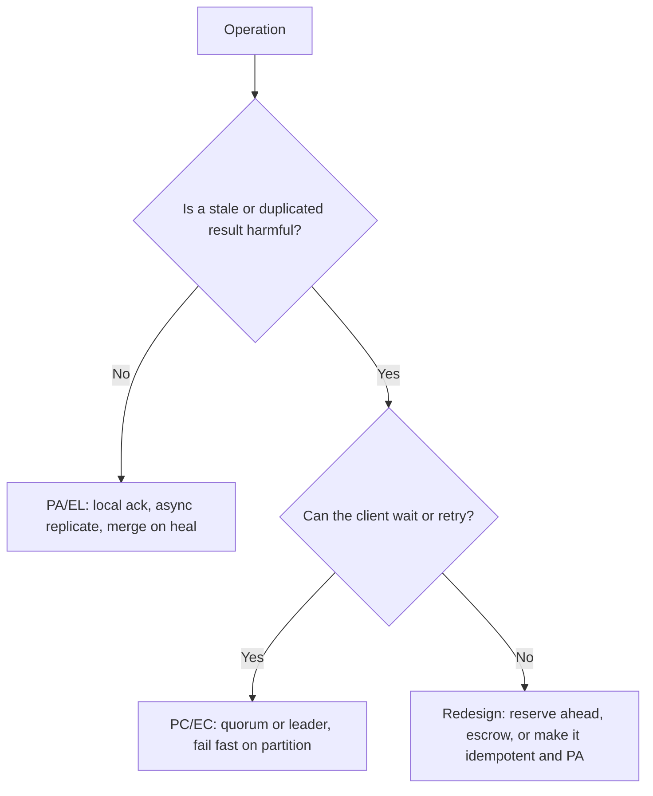

An interviewer asks "is your system CP or AP?" and the answer they are listening for is not two letters. They are checking whether you know the question is malformed. CAP is about one moment: the network has split, a node has a request in hand, and it must either answer with what it has (and risk being wrong) or refuse (and be unavailable). Everything else attributed to CAP, "pick two", "CA databases", the idea that it describes normal operation, is folklore.

The real decision is made per operation, with numbers: how long partitions last, what a quorum round trip costs, what the user sees either way. This lesson states the theorem precisely, traces a partition through a real CP store and a real AP store, adds PACELC for the 99.9% of the time when nothing is partitioned, and gives a method for choosing.

## What CAP says

Gilbert and Lynch's formal statement (2002) concerns a single register replicated across nodes in an asynchronous network:

- **Consistency** means linearizability: every read returns the latest acknowledged write, as if there were one copy ([Consistency models](/learn/system-design/building-blocks/consistency-models)). Not ACID's C.
- **Availability** means every request to a non-failed node eventually gets a non-error response. Not "fast", and not "the service is up": every node must answer.
- **Partition tolerance** means operating while messages between nodes are dropped or delayed indefinitely.

The proof is one paragraph. Split the nodes into two groups that cannot talk. A client writes `x = 1` to group one; another reads `x` from group two, which has not heard of the write. If group two answers, it answers 0 and violates linearizability; if it refuses or waits for the partition to heal, it violates availability.

The consequences most descriptions get wrong:

- **P is not a choice.** Switches fail, a firewall drops one direction, a 20-second GC pause makes a node look partitioned with no packet lost. A system that "chose CA" has not decided what it does during a partition, so it does something arbitrary.
- **It says nothing about normal operation.** With a healthy network nothing stops a system being both. The everyday trade-off is PACELC's.
- **It is per operation.** A store can refuse writes to a key whose leader is unreachable and serve every other key; "is Cassandra AP?" is only answerable per consistency level and query.
- **Availability is binary in the theorem and continuous for users.** A node that answers after 30 s is available to the theorem and down to users. The moment you set a timeout you have chosen: a CP store returns errors, an AP store returns stale data.

## A partition, traced through a CP store: etcd

Three etcd members, n1 (leader), n2, n3, with the defaults: heartbeats every 100 ms, election timeout 1,000 ms, and Raft's CheckQuorum on. At t = 0 a switch failure isolates n1:

| t | n1 (minority side) | n2, n3 (majority side) | Client on n1's side | Client on the majority side |
|---|---|---|---|---|
| 0 | Leader, term 5; its heartbeats stop arriving | Followers | `PUT x=1` appended to n1's log, cannot reach a majority, not committed | Requests forwarded to n1 time out |
| 0–1.0 s | Still believes it leads | No heartbeat for an election timeout (randomised, 1–2 s) | Waits | Waits |
| ~1.0 s | CheckQuorum: no majority heard for an election timeout, so steps down to follower | n2 times out, starts pre-vote then an election for term 6; n3 votes | `PUT` fails: no leader, request timed out | – |
| ~1.2 s | Follower with no leader | n2 leads term 6 | All reads and writes fail; serializable (stale) reads still answer | Writes commit on n2 + n3 again |
| 5 min | Partition heals; hears term 6 and follows n2 | Leader n2 | – | – |
| 5 min + | Truncates its uncommitted `x=1` entry, catches up from n2 | | The client was never told `x=1` succeeded, so nothing acknowledged is lost | |

Majority-side clients lost about 1–2 s to the election; minority-side clients lost the whole partition. That is what CP means: refuse on the side that cannot reach a quorum, never acknowledge what might be lost. Pre-vote keeps n1 from disrupting the cluster with a higher term when it rejoins.

## A partition, traced through an AP store: Cassandra

Three replicas of a key, A and B in region 1 and C in region 2, clients reading and writing at consistency level `ONE`. At t = 0 the inter-region link fails:

| t | Region 1 (A, B) | Region 2 (C) | Notes |
|---|---|---|---|
| 0 | `settings.theme = dark`, timestamp 1000; A and B apply it | – | The coordinator stores a *hint* for C |
| 30 s | Reads return `dark` | Reads return `light` (old) | Both sides available; region 2 is stale |
| 60 s | – | `settings.theme = blue`, timestamp 998 (C's clock runs 5 ms slow) | The coordinator in region 2 stores hints for A and B |
| 20 min | Link heals; hints replay in both directions | | Hints are stored only while a replica has been unreachable for less than `max_hint_window` (3 hours by default) |
| 20 min + | Every replica compares cell timestamps: 1000 beats 998 | | Last write wins per cell |
| Result | `dark` everywhere | The user in region 2 who chose `blue` a minute later sees `dark` | No error was ever returned |

Both sides stayed available and the replicas converged, to the wrong answer: the later write lost because its node's clock was behind. A partition longer than the hint window leaves replicas divergent until an anti-entropy repair (`nodetool repair`, Merkle-tree comparison) runs, and a repair skipped for longer than `gc_grace_seconds` (10 days) can resurrect deleted data. Choosing AP is half a decision; the merge rule is the other half.

## Which clients a CP choice actually affects

A CP store is unavailable only to clients that can reach nothing but the minority. If a partition splits off a single rack, the balancer routes around it and nobody notices; if it splits a region from the rest, that region's users lose writes for the duration. Budget it with orders of magnitude (your own incident history is the real input):

| Event | How often | How long | A CP store refuses | An AP store serves |
|---|---|---|---|---|
| A node pauses or its NIC saturates | Weekly | Seconds | That node's clients until an election, 1–2 s | Stale reads from that node |
| An availability zone is isolated | A few times a year | Minutes | Nobody, if each quorum spans three zones | Stale reads in that zone |
| A region is isolated | Rarely | Minutes to an hour | Writers in that region, if their quorum lives elsewhere | Everyone, with conflicting writes to merge on heal |

Put numbers on the worst row: a region holding a third of the users, isolated for 30 minutes a year, costs a CP design 30 minutes of writes for those users, 99.994% write availability for them over the year; it costs an AP design 30 minutes of writes that may conflict. Place quorums so that the common events never cost a quorum: three replicas in three zones survive any single-zone loss.

```viz
{"type": "system", "scenario": "quorum", "replicas": 3,
 "title": "A write during a partition", "caption": "With N=3 and W=2, the side of the partition holding two replicas can still commit; the side with one replica cannot reach a quorum and must either reject the write (C) or accept it locally and reconcile later (A)."}
```

## PACELC: the latency you pay every day

Abadi's extension: if there is a **P**artition, choose **A** or **C**; **E**lse, choose **L**atency or **C**onsistency. A write that waits for a majority is consistent and pays the round trip to the second-fastest replica; a write acknowledged locally and replicated asynchronously is fast and allows stale reads and lost writes on failover. Simulated, with a coordinator co-located with one replica, 10% jitter on every round trip and an assumed 2% chance per replica per request of a 50–300 ms stall (a GC pause or disk hiccup):

```python
import math, random

rng = random.Random(11)

def ack_ms(base_ms):
    t = base_ms * math.exp(rng.gauss(0, 0.1))       # round trip with 10% jitter
    if rng.random() < 0.02:                         # assumed: 2% of acks hit a stall
        t += rng.uniform(50, 300)
    return t

def pct(values, q):
    values = sorted(values)
    return values[int(q * (len(values) - 1))]

for label, bases in (("3 AZs", (1.0, 1.6, 2.1)), ("3 regions", (1.0, 65.0, 75.0))):
    local, majority, everyone = [], [], []
    for _ in range(200_000):
        acks = [ack_ms(b) for b in bases]           # acks[0] is the coordinator's own replica
        local.append(acks[0])
        majority.append(sorted(acks)[1])            # second-fastest of three
        everyone.append(max(acks))
    for name, v in (("local", local), ("majority", majority), ("all", everyone)):
        print(label, name, round(pct(v, .5), 1), round(pct(v, .99), 1))
```

| Write waits for | 3 AZs: p50 / p99 | 3 regions (US East, US West, EU West): p50 / p99 |
|---|---|---|
| The local replica only (EL) | 1.0 / 179 ms | 1.0 / 175 ms |
| A majority, 2 of 3 (EC) | 1.6 / 2.3 ms | 64.7 / 82.0 ms |
| All three | 2.1 / 261 ms | 76.2 / 309 ms |

Two readings. Across regions a consistent write costs about 65× a local one at the median, every time, which is why Spanner-style systems keep a row's quorum inside the region that writes it. And a majority hides one slow replica while waiting for all three exposes you to every stall, so with any non-trivial stall rate a 2-of-3 quorum can have a better tail than a single node; the exact p99s depend on the stall assumption, the shape does not.

## Real systems, classified, with caveats

| System | During a partition | Else | Caveat |
|---|---|---|---|
| etcd, ZooKeeper, Consul | PC | EC | ZooKeeper reads are local and may be stale unless preceded by `sync()`; etcd serializable reads likewise |
| Spanner, CockroachDB | PC | EC | Write latency is set by quorum placement; follower or stale reads trade freshness for latency |
| Postgres or MySQL with a synchronous standby | PC | EC | Only if failover is fenced; reads from asynchronous replicas are EL |
| MongoDB, majority write concern | PC | EC | The default since 5.0; with `w: 1`, a primary that loses its seat rolls back unreplicated writes |
| Cassandra at `ONE` or `LOCAL_QUORUM` | PA | EL | `QUORUM` both ways gives overlap, not linearizability; lightweight transactions are PC per partition |
| DynamoDB | PC within a region | EL by default | Strongly consistent reads make a read EC; global tables replicate between regions with last-writer-wins, and a newer multi-Region strong consistency mode makes writes wait for a second Region |
| Riak, Dynamo-style stores | PA | EL | Merge by siblings, vector clocks or CRDTs |
| Cosmos DB | Tunable | Tunable | Five named levels from strong to eventual, chosen per request |

The real lesson is the "tunable" rows: modern stores expose the choice per request, so "which database" is the wrong level to decide at.

## Choose per operation

For each operation ask what the user sees if it returns stale data, and what they see if it errors for the duration of a partition, say two minutes. Pick the cheaper failure.

| Operation | Stale answer costs | Two minutes of errors costs | Choice |
|---|---|---|---|
| Add to cart | Nothing; the item shows on the next sync | Lost sales | PA/EL: accept locally, merge by union |
| View cart | An item briefly missing | Cart page down | PA/EL |
| Apply a single-use coupon | Coupon used twice | A retry | PC/EC on the coupon's counter |
| Reserve inventory at checkout | An oversold item | A retry | PC/EC: conditional write on the leader |
| Show balance | Wrong by a recent transaction | Page down | PA/EL, labelled "as of 10:32" |
| Transfer money | Overdraft from a stale balance | The transfer fails and can be retried | PC/EC |
| Like counter | A few likes briefly missing | Buttons fail | PA/EL with a CRDT counter that sums both sides ([CRDTs](/learn/system-design/distributed-systems/crdts-and-collaboration)) |

Amazon's Dynamo paper made the cart call: never refuse an add, merge concurrent versions by union, and accept that a deleted item occasionally reappears.



The bottom-right box is the senior move: remove the coordination instead of paying for it. Ticket sales can give each region a pre-allocated block of seats (escrow); rate limits can tolerate a few per cent of overshoot; ID generation can pre-allocate ranges per node.

## Multi-leader: the honest AP design

```viz
{"type": "system", "scenario": "replication-multi-leader", "nodes": 2,
 "title": "Two leaders accept writes to the same key", "caption": "Each region commits locally in about a millisecond and ships the write asynchronously. When the same key is written on both sides, the system needs a merge rule; last-writer-wins silently discards one of them."}
```

Merge rules, worst to best: last-writer-wins on wall-clock timestamps (loses data, and clock skew picks which, as the Cassandra trace showed; [Time and ordering](/learn/system-design/distributed-systems/time-and-ordering)); keep both versions as siblings and let the application merge (Riak, the original Dynamo); a data type whose merge is defined (CRDTs); or give each key a home region and forward writes to it, which is AP only for keys whose home is reachable. Choosing AP without naming one of these is the gap interviewers look for.

## Under the hood

- **etcd** runs Raft with CheckQuorum, so a leader cut off from a majority steps down after an election timeout rather than accepting writes it can never commit, and with pre-vote (the default since 3.5), so a rejoining member cannot force an election by bumping its term. Linearizable reads go through ReadIndex, which needs a majority heartbeat; serializable reads answer locally.
- **Cassandra** lets the coordinator acknowledge at the requested consistency level and store hints for unreachable replicas; hints do not count towards the level (except `ANY`). Each cell carries a microsecond write timestamp, and reconciliation keeps the highest. Read repair fixes divergence the reads touch; scheduled repair fixes the rest.
- **DynamoDB** keeps three replicas of each partition across availability zones with a leader per partition, so a single-zone partition does not stop writes. Global tables replicate asynchronously between regions and resolve concurrent writes by last-writer-wins, unless configured for multi-Region strong consistency.
- **MongoDB** elects primaries with a Raft-like protocol; with majority write concern an acknowledged write survives any election, while `w: 1` writes can be rolled back into rollback files when a deposed primary rejoins.

## Failure modes

| Failure | Symptom | Diagnosis | Fix |
|---|---|---|---|
| CP for everything | A 90-second cross-region flap takes down browsing, search and cart, not just payments | Unrelated features share one strongly consistent store | Classify operations; isolate the few PC ones |
| AP with no merge rule | Settings changed during a partition silently revert | Last-writer-wins by default; clocks skewed | Choose a merge rule per data type; count conflicts on heal |
| Timeouts that make CP "neither" | Services that never touched the partitioned store run out of threads | 30-second client timeouts hold threads during a partition | Short timeouts and circuit breakers ([Resilience patterns](/learn/system-design/building-blocks/resilience-patterns)) |
| Partitions assumed rare | A GC pause triggers an election and a burst of failed writes | Failure detector timeouts shorter than real pauses | Tune detection to observed pauses; game-day the partition behaviour |
| Zombie data after repair lapses | Deleted rows reappear | Repair not run within `gc_grace_seconds` after a long partition | Scheduled repair shorter than the grace period |

## Interviewer follow-ups

**"Is your design CP or AP?"** Model answer: neither as a whole. Checkout and inventory reservation refuse rather than oversell during a partition: PC, a leader with a conditional write. Browsing, cart edits and the feed keep serving: PA, with a named merge rule (union for carts, CRDT counters for likes). In normal operation, reads take the latency side and the two critical writes take consistency, about 2 ms in-region and 65 ms cross-region, so their leaders stay near their users. Common wrong answer: "AP, because availability matters more", with no merge rule.

**"Which partitions do you expect, and for how long?"** Model answer: seconds-long single-node partitions from pauses, frequently; zone-level events occasionally; cross-region partitions of minutes to an hour a few times a year. Three replicas in three zones keep a quorum through any single-zone loss at about 2 ms; cross-region replicas are for disaster recovery unless the product requires zero data loss when a region is lost, which I would confirm first because it puts ~65 ms on every write. Common wrong answer: "partitions are rare in the cloud".

**"How do you keep multi-region writes fast without losing data on a partition?"** Model answer: give each key a home region near its writer, commit with an in-region quorum, replicate asynchronously for reads elsewhere; a partition makes that key's writes fail on the far side rather than fork. Where that is unacceptable, make the data mergeable. Common wrong answer: multi-leader with last-writer-wins, called "availability".

**"Can a system be CA?"** Model answer: only a single node, whose availability is one machine's. With two nodes and a network, the partition behaviour is C or A whether chosen or not; "CA" usually means "undecided". Common wrong answer: "yes, a single-region relational database".

## What mid-level engineers get wrong

- Answering "CP or AP" with two letters for a whole system.
- Treating CAP's C as ACID's C.
- Choosing AP and leaving last-writer-wins on, with clocks deciding which user's write survives.
- Assuming CP means the whole system is down during a partition, rather than the minority side.
- Ignoring PACELC: putting cross-region quorums on every write "for safety" and paying 65 ms each time.
- Letting long client timeouts turn a CP refusal into a cascading outage.

## Senior signals

- You state that P is not optional, that CAP constrains only behaviour during a partition, and that PACELC names the everyday cost.
- You can trace what a Raft store and a Dynamo-style store each do minute by minute through a partition and its healing.
- You choose per operation and name the few that must be PC.
- You attach numbers: election time, partition durations, in-region versus cross-region quorum latency.
- When you choose AP you name the merge rule and refuse last-writer-wins for anything users care about.
- You look for ways to remove coordination from the hot path: escrow, pre-allocation, idempotent appends.

## Check yourself

```quiz
- q: >-
    A three-replica system with a quorum of two suffers a partition that isolates one replica. Under a CP design, which clients are affected?
  options: ["All clients, since the system refuses requests during any partition", "Only clients that can reach the isolated replica alone", "Only writing clients; reads continue everywhere", "No clients, because a quorum of two still exists"]
  answer: 1
  explanation: >-
    The majority side keeps a quorum and serves reads and writes after at most an election. The isolated replica cannot reach a quorum and refuses. Linearizable reads on the minority side must also refuse, or they could return stale data.
- q: >-
    An etcd leader is cut off from both followers. What does it do, given etcd's defaults?
  options: ["Keeps accepting and committing writes until the partition heals", "Steps down after an election timeout with no majority contact", "Forces a new election by raising its term on every heartbeat", "Promotes itself to a single-node cluster to stay available"]
  answer: 1
  explanation: >-
    With CheckQuorum, a leader that has not heard from a majority for an election timeout steps down, so it stops appearing available for writes it can never commit. Its uncommitted entries are truncated when it rejoins, and pre-vote stops it disrupting the cluster with a higher term.
- q: >-
    During a partition, two Cassandra replicas accept different values for the same cell. The later write came from a node whose clock ran 5 ms slow. After the partition heals, what is stored?
  options: ["Both values, kept as siblings for the application to merge", "The later write, since hinted handoff replays in arrival order", "An error, since reconciliation detects the conflicting writes", "The earlier write, since its timestamp is higher"]
  answer: 3
  explanation: >-
    Cassandra reconciles per cell by write timestamp, highest wins. The slow clock gave the later write a lower timestamp, so it silently loses. Siblings are a Riak-style design; Cassandra reports no conflict.
- q: >-
    Why does a strongly consistent write in a three-region deployment cost around 65 times the median latency of a local acknowledgement?
  options: ["Each cross-region hop needs a fresh TLS handshake per write", "Cross-region links have far lower bandwidth than local ones", "It waits for a majority, which needs a cross-region round trip", "It must fsync to disk three times, once in each region"]
  answer: 2
  explanation: >-
    A majority of three waits for the second-fastest acknowledgement; with replicas in other regions that is a 60–80 ms round trip versus about 1 ms locally. A small write is latency-bound, not bandwidth-bound, and each replica fsyncs in parallel.
- q: >-
    In the simulation, waiting for 2 of 3 replicas had a far better p99 than waiting for all 3. Why?
  options: ["A majority write sends less data to each replica", "Waiting for any two hides a single stalled replica", "Majority writes skip the fsync on the slowest replica", "Waiting for all three adds extra round trips per write"]
  answer: 1
  explanation: >-
    The write completes at the second-fastest acknowledgement, so one replica stalling (a GC pause, a disk hiccup) does not delay it; waiting for all three makes every replica's stall your stall. The exact p99 depends on the stall rate assumed, but the shape holds for any non-trivial rate.
- q: >-
    A team chooses AP for user settings with default last-writer-wins. What is the most likely consequence after a 20-minute partition?
  options: ["Both sides' writes conflict on heal and the merge step deadlocks", "Some writes are silently discarded, with clock skew picking which", "Nothing; LWW guarantees convergence to the truly newest value", "Settings are unavailable on the minority side during the partition"]
  answer: 1
  explanation: >-
    Last-writer-wins converges, but to the highest timestamp, which under skew may be the older write, and no error is raised. AP requires a merge rule that preserves both sides' intent. Unavailability on the minority side is the CP outcome, not this one.
```
