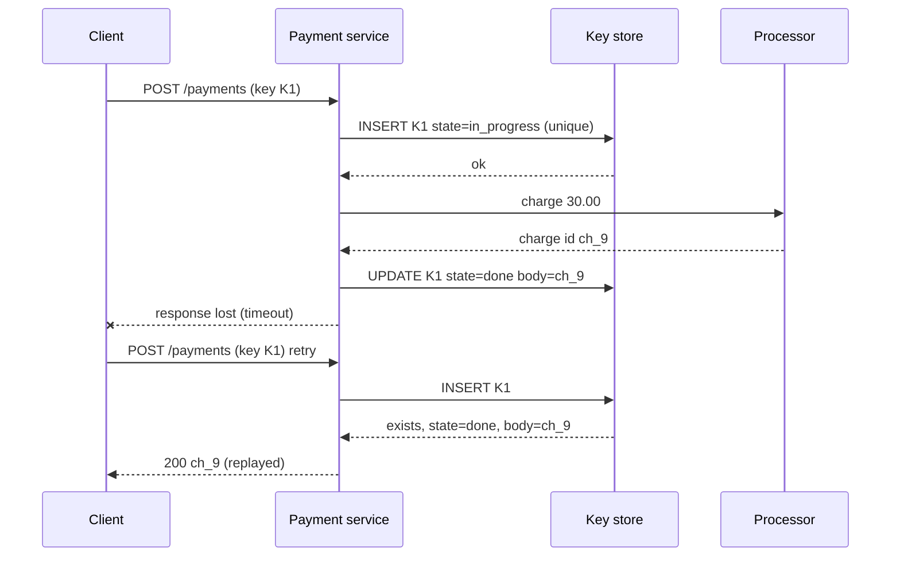

Your payment service calls the card processor. After two seconds the call times out. Did the customer get charged? There are exactly three possibilities and you cannot tell them apart from where you stand: the request never arrived; it arrived, the charge happened, and the response was lost; or it is still in flight and will complete after you gave up. Retry blindly and you risk a double charge. Do not retry and you risk a customer who paid and got nothing.

Every network call has this ambiguity. Idempotency is the property that makes the retry safe: performing an operation twice has the same effect as performing it once. Most operations are not naturally idempotent, so you engineer it, and the engineering is where the interesting details live: keys, dedupe stores, concurrency, and the discipline of retrying in one place with a budget.

## Which operations are already idempotent

| Operation | Idempotent? | Why |
|---|---|---|
| `SET balance = 100` | Yes | Absolute state; repeating it changes nothing |
| `PUT /users/42` with the full document | Yes | Same reason; this is why REST specifies PUT as idempotent |
| `DELETE /users/42` | Yes in effect | The second call returns 404 but the state is the same; treat 404-after-delete as success |
| `balance = balance - 30` | No | Each execution subtracts again |
| `POST /payments` | No | Each execution creates a new payment |
| `INSERT INTO events ...` without a unique key | No | Each execution inserts a row |
| Send an email | No | And you cannot un-send it |

The pattern: operations expressed as *absolute state* are idempotent; operations expressed as *deltas or creations* are not. When you own the API you can sometimes redesign the second kind into the first: instead of "decrement stock by 1" send "set stock to 41, if it is currently 42". That conditional write (compare-and-set) is idempotent and detects the concurrent update too. When you cannot, you add a key.

## Idempotency keys end to end

The mechanism, as Stripe and most payment APIs implement it:

1. The client generates a unique key per logical operation (a UUIDv4, or better a key derived from the business intent such as `order-7781-capture`) and sends it in a header: `Idempotency-Key: 5c2d...`.
2. The server, before doing any work, atomically records the key as *in progress*. Atomically matters: a unique index insert or a Redis `SET key value NX PX 86400000` that fails if the key exists.
3. If the insert succeeded, the server performs the operation, then stores the result (status code, response body) against the key.
4. If the insert failed because the key exists and is *complete*, the server returns the stored response without redoing anything. If the key exists and is *in progress*, the server returns 409 Conflict (or waits briefly), because a concurrent duplicate is running.
5. Keys expire after a window; 24 hours is the common choice, long enough to cover any client retry policy.

```viz
{"type": "system", "scenario": "idempotency-key", "requests": 3,
 "title": "Three deliveries of one payment request", "caption": "The first request records the key and executes. The retries find the key, skip execution and return the stored response. The charge happens once regardless of how many times the request arrives."}
```



Details that separate a working implementation from a demo:

**Scope the key to the caller.** Two tenants can both send key `1`. Store `(account_id, key)`, not the bare key, or one customer's retry replays another's response.

**Fingerprint the body.** If the same key arrives with a different payload (amount 30 the first time, 300 the second), that is a client bug, not a retry. Store a hash of the request and return 422 on mismatch. Stripe does exactly this.

**Decide the concurrent-duplicate behaviour.** A client that times out at 2 seconds and retries while the first attempt is still running at second 3 produces two concurrent requests with the same key. The atomic insert makes the second one see `in_progress`. Returning 409 with `Retry-After` is simplest; waiting on the first attempt's completion is friendlier but holds a connection.

**Make the key store durable enough.** If the key store is a Redis primary without replication and it dies, every in-flight retry after failover re-executes. For payments the key store should have the same durability as the payment record, which usually means the same database, in the same transaction as the side effect.

**Put the key and the effect in one transaction where you can.**

```sql
BEGIN;
INSERT INTO idempotency_keys (account_id, key, request_hash, state)
  VALUES ($1, $2, $3, 'in_progress');           -- unique (account_id, key)
INSERT INTO payments (id, account_id, amount, ...) VALUES (...);
UPDATE idempotency_keys SET state = 'done', response = $4
  WHERE account_id = $1 AND key = $2;
COMMIT;
```

If the transaction aborts, neither the key nor the payment exists, and a retry starts clean. If it commits, both exist. There is no window where the payment happened and the key does not say so. The external call to the card processor sits outside this transaction, which is why the processor must *also* accept an idempotency key (they all do); you pass yours through.

**Size the store.** 2,000 payments per second, 24-hour retention, roughly 300 bytes per key with its stored response: 2,000 x 86,400 x 300 B ≈ 52 GB per day of live keys. That fits a Redis cluster or a partitioned table with a TTL job, and it tells you why the window is 24 hours and not 30 days.

## The "exactly once" illusion

No network protocol can deliver a message exactly once; the two-generals argument shows that any acknowledgement can itself be lost. What systems can offer is **at-least-once delivery combined with idempotent processing**, whose observable effect is exactly once. Kafka's "exactly-once semantics" is precisely this: the producer attaches a sequence number so the broker deduplicates retries, and consumer offsets are committed in the same transaction as the output. The [exactly-once semantics](/learn/system-design/distributed-systems/exactly-once-semantics) lesson goes deep; the principle to carry into any design discussion is that exactly-once is a property you build at the consumer, not one you buy from the queue.

## Deduplication in consumers

A consumer that pulls from a queue with at-least-once delivery will see duplicates: after a crash mid-batch, after a visibility timeout expires before the ack, after a rebalance. It needs the same idempotency discipline as the HTTP server, keyed on something the producer supplied.

**Producer-assigned IDs.** Every message carries an ID chosen at creation (event ID, order ID plus event type). Kafka's idempotent producer uses `(producer_id, partition, sequence)` and the broker keeps the last five sequence numbers per producer per partition.

**A dedupe store with a window.** The consumer records processed IDs with a TTL. The window must exceed the maximum redelivery delay: if a message can be retried from a dead-letter queue three days later, a one-day window will let the duplicate through. Storage is the same arithmetic as above: IDs per day x bytes per ID.

**A cheap pre-check.** A Bloom filter in front of the dedupe store answers "definitely not seen" with no I/O and "possibly seen" with a false-positive rate you choose (1% at ~10 bits per element). A possible-hit goes to the exact store. This matters at millions of messages per second where a Redis lookup per message would dominate.

```viz
{"type": "system", "scenario": "bloom-filter", "keys": ["evt-1","evt-2","evt-3","evt-9"],
 "title": "Bloom filter as a dedupe pre-check", "caption": "A miss in the filter means the ID was never seen, so the consumer skips the exact lookup. A hit might be a false positive, so it is confirmed against the dedupe store before the message is dropped."}
```

**Or make the effect itself idempotent.** An upsert keyed by event ID (`INSERT ... ON CONFLICT (event_id) DO NOTHING`) needs no separate store: the unique constraint is the dedupe. This is the best option whenever the sink is a database you control.

## Retry design

Idempotency makes retries safe; it does not make them wise. A retry is extra load on a system that just failed to answer, and the amplification is multiplicative across layers.

**Retry at one layer.** If the client retries 3 times, the gateway retries 3 times per client attempt, and the service retries 3 times per gateway attempt, one user action can generate 27 calls to the database that is already struggling. Decide where retries live (usually as close to the failure as sensible: the service retries its DB call; the client retries the whole request; the gateway does not) and make every other layer pass failures through.

**Retry only retryable errors.** Timeouts, 503, 429 with Retry-After, connection resets: yes. 400, 401, 404, 422: never; the second attempt returns the same answer. 500 is a judgement call; retry once if the operation is idempotent.

**Exponential backoff with jitter.** Delay before attempt `n`: `min(cap, base x 2^n)` multiplied by a random factor in `[0, 1]` (full jitter). Without jitter, every client that failed at the same instant retries at the same instant, and the retry wave is as synchronised as the original failure.

| Attempt | base 100 ms, no jitter | With full jitter (range) |
|---|---|---|
| 1 | 200 ms | 0 to 200 ms |
| 2 | 400 ms | 0 to 400 ms |
| 3 | 800 ms | 0 to 800 ms |
| 4 | 1,600 ms | 0 to 1,600 ms |
| 5 | 3,200 ms (cap 3 s) | 0 to 3,000 ms |

```viz
{"type": "system", "scenario": "retry-backoff", "requests": 6,
 "title": "Backoff with and without jitter", "caption": "Synchronised retries arrive as a second spike on a dependency that has just failed. Jitter spreads them out so the dependency sees a smooth ramp rather than a wave."}
```

**Budget retries.** A retry budget caps retries as a fraction of primary traffic, say 10%. When a dependency is fully down, blind per-call retry policies multiply load by the retry count; a budget keeps the extra load at 1.1x instead of 4x. Envoy and Finagle implement this; you can implement it with a token bucket that refills at 10% of the request rate.

**Propagate deadlines.** If the caller gave up at 1 second, a retry that starts at 900 ms and takes 500 ms wastes the work. Pass the deadline down (gRPC does this natively) and do not start an attempt that cannot finish in time. [Timeouts, retries and backoff](/learn/networking/networking-in-practice/timeouts-retries-and-backoff) covers timeout budgets in detail.

## Failure modes

**Double charge from two retrying layers.** The mobile client retries on timeout; so does the API gateway; the payment service has no idempotency key. Detect: duplicate payments with identical amounts within seconds; reconciliation against the processor. Mitigate: the client generates the key at the moment the user taps Pay and reuses it across every retry; the server dedupes on it; the processor gets the same key.

**Dedupe store lost on failover.** Redis primary dies; the replica had not received the last 200 ms of keys; retries in that window re-execute. Detect: duplicates clustered around a failover timestamp. Mitigate: keep keys for critical effects in the same transactional store as the effect; accept Redis for keys protecting cheap, re-doable work.

**Key reuse across tenants or payloads.** Client library generates keys from a counter that restarts at process start; two instances send key `1` with different payloads. Detect: request-hash mismatches (if you check) or "wrong response replayed" reports (if you do not). Mitigate: UUIDs or intent-derived keys, scoped by account, with body fingerprinting.

**Retry storm during an outage.** A dependency returns 503 for 30 seconds; 10,000 clients each retry 5 times with no jitter; the dependency comes back and is immediately hit with 50,000 requests and falls over again. Detect: sawtooth traffic on the dependency after recovery. Mitigate: jitter, retry budgets, circuit breakers; see [Resilience patterns](/learn/system-design/building-blocks/resilience-patterns).

**Idempotent in name only.** `PUT /orders/7/confirm` is declared idempotent but sends a confirmation email each call. Detect: customers with three identical emails. Mitigate: side effects inside the idempotent boundary must themselves be keyed; the email send gets the same idempotency key and the mail service dedupes.

## Interviewer follow-ups

**Q: "The payment call timed out. What does your service do?"**

It does not know whether the charge happened, so it does not guess. Every payment request carries an idempotency key generated by the client when the user confirmed; the service recorded that key in the same transaction as the pending payment row, and passed it to the processor. The retry, whether from the client or from our own retry logic, replays with the same key: our store returns the stored result if we finished, the processor returns the original charge if it finished but we lost the response, and if neither finished the operation runs once. I would also reconcile asynchronously against the processor's records for anything stuck in `in_progress` beyond a few minutes, because a crash between the processor call and our status update leaves a key that needs a human or a job to resolve.

**Q: "Why not just make the queue deliver exactly once?"**

Because it cannot: an acknowledgement can be lost, and the broker must then choose between redelivering (duplicate) or not (loss). Kafka's exactly-once is at-least-once delivery plus broker-side dedupe of producer retries plus offsets committed transactionally with the output, and it only holds when the sink is Kafka. For any external sink, the consumer dedupes on a producer-assigned ID or does an idempotent upsert. I design the consumer to be idempotent and then treat the queue's guarantee as a performance detail.

**Q: "How big is the idempotency store, and what happens when it is full?"**

At 2,000 requests per second with 24-hour retention and ~300 bytes per entry, about 50 GB live. That is a Redis cluster of a few nodes or a partitioned Postgres table with a nightly drop of old partitions. If the store is unavailable, I fail closed for payments (refuse the request with a retryable 503) rather than execute without dedupe, because a duplicate charge is worse than a delayed one; for low-value operations I would fail open and log.

**Q: "Where do retries live in this architecture?"**

In exactly one place per hop. The service retries its own database and cache calls with a short budget because it knows which errors are transient. The gateway does not retry service calls; it passes 503s through with Retry-After. The client retries the whole request with exponential backoff and full jitter, capped at three attempts, reusing the idempotency key. I would set a retry budget of about 10% at the service so a dead dependency cannot multiply load, and I propagate the client's deadline so a retry never starts with less time than the call's p99.

**Q: "A message can be replayed from the dead-letter queue days later. Does your dedupe still work?"**

Only if the dedupe window is longer than the maximum replay delay, so I either size the window to cover DLQ retention (7 days of IDs is 7 times the storage) or make the effect idempotent by construction, an upsert on event ID, so no window is needed. The upsert is the answer I prefer; a TTL-based dedupe store is a probabilistic guarantee and I say so.

## Senior signals

- You start from the **three outcomes of a timeout** and design for not knowing which one happened.
- You put the idempotency key and the side effect in the **same transaction**, and you pass the key through to downstream providers.
- You scope keys per caller, **fingerprint the payload**, and define the concurrent-duplicate behaviour.
- You say "exactly once" only as **at-least-once plus idempotent processing**, and you can explain what Kafka's version does and does not cover.
- You retry in **one layer** with jitter, a budget and deadline propagation, and you can quantify the 27x amplification of retrying at every layer.
- You size the dedupe store from **rate x window x bytes** and choose a window longer than the longest possible redelivery.

## Check yourself

```quiz
- q: >-
    A client sends POST /orders with idempotency key K, times out after 2 s, and retries at 2.1 s while the first attempt is still executing. The server should:
  options: ["Return the stored response for K from the first attempt", "See K marked in progress; return 409 or wait for the first", "Reject the retry with 400, because a key may be used only once", "Execute the second request too, since the first has not completed"]
  answer: 1
  explanation: >-
    The atomic insert of the key makes the second attempt see an in-progress record, so it returns 409 (with Retry-After) or waits for the first attempt. Executing it would create two orders; there is no stored response yet to return; and reusing a key on retry is exactly what keys are for, not an error.
- q: >-
    Which change makes a stock-decrement operation idempotent without an idempotency key?
  options: ["Sending it through a FIFO queue so it is applied in order", "Wrapping the decrement in a serializable transaction", "Making it a conditional write: set stock to 41 if it is 42", "Retrying it at most once, with backoff between attempts"]
  answer: 2
  explanation: >-
    Expressing the update as absolute state with a precondition makes a repeat a no-op (the precondition fails) and also catches concurrent updates. A transaction gives atomicity, not idempotency; FIFO gives order, not dedupe; retry counts do not change semantics.
- q: >-
    Three layers each retry three times on failure. During a dependency outage, one user action can generate how many calls to the dependency?
  options: ["12", "3", "27", "9"]
  answer: 2
  explanation: >-
    Retries multiply across layers, they do not add: 3 x 3 x 3 = 27. This is why retries should live in one layer per hop and be capped by a budget.
- q: >-
    Why add jitter to exponential backoff?
  options: ["To satisfy the HTTP spec's Retry-After semantics for 503s", "To reduce the total number of retries each client makes", "To stop clients that failed together retrying in lockstep", "To make retries complete faster on average for each client"]
  answer: 2
  explanation: >-
    Without jitter, a synchronised failure produces synchronised retries at exactly base x 2^n, a second wave on a recovering dependency. Jitter spreads them. It does not reduce retry count or average delay meaningfully.
- q: >-
    A consumer's dedupe store keeps event IDs for 24 hours. The dead-letter queue can replay a message after 3 days. What is the risk?
  options: ["None; the dead-letter queue deduplicates replays on its own", "The dedupe store fills up because replays extend the window", "The consumer rejects the replay as expired and drops it", "The replay looks new and its effect is applied twice"]
  answer: 3
  explanation: >-
    Once the ID expires from the window, the consumer has no memory of it and treats the replay as new. The window must exceed the longest possible redelivery delay, or the effect must be idempotent by construction (upsert on event ID). Nothing in the consumer knows the message is old, so it cannot reject it as expired.
```
