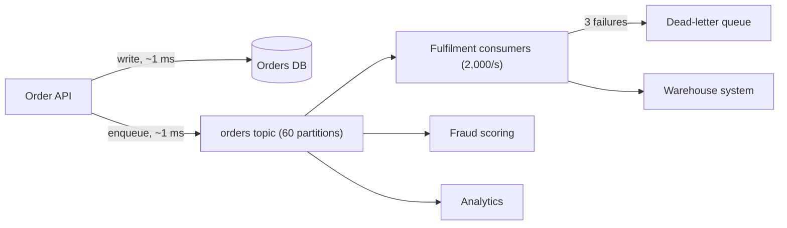

A flash sale starts and orders arrive at 10,000 per second. The fulfilment pipeline, which talks to a warehouse system built in 2009, can process 2,000 per second on a good day. If the order API calls fulfilment synchronously, the API's latency becomes the warehouse's latency, its threads fill with waiting requests, and at 10,000 per second it falls over within seconds. Every customer gets an error even though the order database was fine.

A queue between them changes the shape of the problem. The API writes the order and enqueues a message in about a millisecond; the fulfilment consumers drain at 2,000 per second; the backlog grows at 8,000 per second for the ten minutes the sale lasts, peaks at 4.8 million messages, and drains in 40 minutes. Customers see instant confirmations and slightly delayed shipping emails. That arithmetic (arrival rate minus service rate, times duration, divided by drain rate) is the first thing to write down whenever you propose a queue, because it tells you whether the delay is acceptable and how much storage the backlog needs.

## Why a queue

Four distinct benefits, and a design should be able to say which ones it is buying:

1. **Buffering.** Absorb bursts a downstream cannot handle, as above. Requires the delay to be acceptable to the product.
2. **Decoupling in time and availability.** The producer succeeds even when the consumer is down. Requires the producer to not need the consumer's answer.
3. **Fan-out.** One event, many independent consumers (fulfilment, analytics, fraud, email) each at their own pace. Requires each consumer to keep its own position.
4. **Retry isolation.** A failed piece of work is retried by the consumer without the original caller's involvement, with a dead-letter path for the poisonous ones.



The cost is the same in every case: the work happens *later*, the caller cannot see its result synchronously, and you now operate a broker with its own failure modes.

```viz
{"type": "system", "scenario": "message-queue", "requests": 12,
 "title": "Producers, a queue, and slower consumers", "caption": "Messages arrive faster than the consumers drain them. Watch the depth grow; that depth is the delay every message will experience, and its growth rate is the number to alert on."}
```

## Three models, not one

"Message queue" hides three different architectures, and choosing between them is most of the design.

| | Kafka (log) | RabbitMQ (broker-managed queue) | SQS (managed queue) |
|---|---|---|---|
| Storage model | Append-only partitioned log, retained by time or size (days) | Queue; messages deleted on ack | Queue; messages deleted on ack; 14-day max retention |
| Consumer position | Consumer group tracks an offset per partition; replay by rewinding | Broker pushes; per-message ack; no replay after ack | Consumer polls; visibility timeout; no replay after delete |
| Ordering | Per partition, strict | Per queue with one consumer; lost with competing consumers | Standard: best-effort; FIFO: per message group |
| Throughput | Very high: a partition sustains tens of MB/s; clusters do GB/s | Tens of thousands of messages/s per node in practice | Standard: effectively unlimited; FIFO: on the order of hundreds of msg/s per message group, thousands with batching |
| Fan-out | Free: each consumer group reads the same log | Exchanges route copies to multiple queues | SNS in front, or one queue per consumer |
| Routing | By partition key only | Rich: topic exchanges, headers, dead-letter exchanges | Minimal |
| Best fit | Event streams, audit logs, CDC, multiple consumers, replay | Task queues with per-message routing, RPC-style work, priority | Simple task queues with no ops budget |

The distinction that matters most: a **log** keeps messages after consumption and lets any number of consumer groups read them independently, at their own offset, including from the beginning. A **queue** hands each message to one consumer and forgets it. Fan-out and replay push you toward a log; per-message routing, priorities and delayed delivery push you toward a broker; nobody-on-call pushes you toward SQS.

### Kafka's partition mechanics

A topic is split into partitions; each partition is an ordered, immutable sequence of records with offsets. Producers choose a partition by key (hash of the key mod partition count) or round-robin. A consumer group assigns each partition to exactly one consumer in the group, so parallelism equals partition count, and each consumer commits the offset it has processed up to. Retention is by time (7 days is a common default) or size, independent of whether anyone has consumed the data.

```viz
{"type": "system", "scenario": "kafka-partitions", "nodes": 3,
 "title": "Topic with three partitions and a consumer group", "caption": "Records with the same key always land in the same partition, so order holds per key. Each partition is owned by one consumer in the group; adding a fourth consumer to a three-partition topic leaves it idle."}
```

Partition count arithmetic: if a consumer processes 500 messages per second and you need 20,000 per second, you need at least 40 partitions, and the count is hard to change later without breaking key-to-partition mapping. Over-provision modestly (to perhaps 60) but not wildly: every partition costs file handles, replication traffic, and rebalance time, and thousands of partitions per broker is where operations get painful. See [Kafka internals](/learn/big-data/streaming/kafka-internals) for replication, ISR and retention.

## Delivery guarantees

The guarantee is decided by *when the consumer acknowledges*, not by the broker.

| Guarantee | Consumer behaviour | Failure consequence |
|---|---|---|
| At-most-once | Ack (commit offset) before processing | A crash after ack, before the side effect: message lost |
| At-least-once | Ack after processing | A crash after the side effect, before ack: message redelivered, effect duplicated |
| Effectively-once | At-least-once plus idempotent processing | Duplicates arrive and are neutralised |

At-least-once is the default you want, and it means every consumer must be idempotent. That is the whole content of [Idempotency and retries](/learn/system-design/building-blocks/idempotency-and-retries): dedupe on a producer-assigned ID, or make the effect an upsert. Kafka's transactional "exactly-once" covers the consume-transform-produce loop where the output is also Kafka; the moment a consumer writes to Postgres or calls an HTTP API, you are back to idempotent consumers. [Exactly-once semantics](/learn/system-design/distributed-systems/exactly-once-semantics) gives the full mechanism.

The producer side has its own duplicate source: a producer that times out waiting for the broker's ack and resends. Kafka's idempotent producer (`enable.idempotence=true`) attaches a sequence number so the broker drops the resend; SQS FIFO deduplicates on a `MessageDeduplicationId` within a 5-minute window; RabbitMQ has publisher confirms but no dedupe, so the consumer must handle it.

## Ordering

Global ordering across a high-throughput queue does not exist at scale; you get ordering per key. The rule: everything that must be processed in order shares a key (all events for `order_7781` go to the same partition, or the same SQS FIFO message group), and the consumer processes a key's messages sequentially.

The cost is head-of-line blocking. If one message for order 7781 fails and is retried for a minute, everything behind it in that partition waits, including thousands of unrelated orders that hashed to the same partition. Two mitigations: keep partitions numerous so each carries fewer keys, and move a repeatedly failing message to a dead-letter queue quickly (three attempts, not thirty) so the partition unblocks. FIFO queues that block per message group (SQS FIFO) isolate the blocking to one key, which is why they cost throughput.

Rebalances break your ordering assumptions temporarily. When a consumer joins or leaves a Kafka group, partitions are reassigned; the new owner starts from the last committed offset, which may be behind what the old owner processed but had not committed. That replays a few messages, another reason the consumer must be idempotent. Cooperative rebalancing (incremental assignment) reduces the pause from "every consumer stops" to "only moved partitions pause"; enable it.

## Designing the consumer

**Batch.** Pulling one message at a time costs a round trip per message; at 1 ms that caps a consumer at ~1,000 per second. Pull 100 to 500, process, commit once. Kafka's `max.poll.records`, SQS's `MaxNumberOfMessages=10` with long polling.

**Commit after the side effect, not before.** And commit the *batch's* position only after every message in the batch is done, or process-then-commit per message if the batch is large and failures are common.

**Match the visibility timeout to processing time.** SQS hides a message for the visibility timeout (default 30 s) once a consumer receives it. If processing takes 45 s, the message reappears at 30 s and a second consumer starts it. Set the timeout above p99 processing time, or extend it from the consumer while working. Kafka's equivalent is `max.poll.interval.ms`: a consumer that does not poll within it is considered dead and loses its partitions.

**Bound concurrency and apply backpressure.** A consumer with an unbounded in-memory buffer between "pulled" and "processed" will run out of memory during a backlog. Pull only when there is capacity; that is backpressure applied by the consumer to the broker.

```viz
{"type": "system", "scenario": "backpressure", "requests": 20,
 "title": "Consumer pulls only what it can process", "caption": "A bounded in-flight window lets the queue hold the backlog instead of the consumer's heap. When the window is full the consumer stops polling and the depth grows on the broker, where it is durable and observable."}
```

**Handle poison messages.** A message that fails deterministically (malformed payload, a foreign key that will never exist) will fail every retry. After N attempts route it to a dead-letter queue with the error attached and move on.

## Dead-letter queues

A DLQ is where messages go after they have failed too many times. Three rules make it useful rather than a graveyard:

1. **Alert on DLQ depth, not just on writes.** One message in the DLQ is a bug report; a thousand in a minute is an outage. Both need a human, and neither should be discovered a month later.
2. **Keep the reason.** Attach the exception, the attempt count and the consumer version as message attributes. Without them, triage means re-running the message and hoping to reproduce.
3. **Build the replay tool before you need it.** After the bug is fixed, the DLQ messages need to go back to the source queue, in order per key, without duplicating the ones that partially succeeded. That is a small tool with a big payoff, and writing it during an incident is the wrong time.

## Lag as the SLI

The health of an async system is measured by **consumer lag**: for Kafka, the difference between the latest offset and the committed offset per partition; for SQS, `ApproximateNumberOfMessagesVisible` and the age of the oldest message. Lag in messages is hard to interpret; lag in *time* (how old is the oldest unprocessed message) is what the product cares about and what to alert on. A shipping-email pipeline that tolerates 5 minutes gets an alert at 3 minutes of lag, computed by the consumer stamping `now() - message.timestamp` as a metric.

Lag also tells you when to scale. If lag grows at 8,000 per second and each consumer drains 500 per second, you need 16 more consumers to stop the growth, and more than that to drain the backlog within your target. Autoscaling consumers on lag works as long as partition count (for Kafka) is high enough to give the new consumers something to own.

## Failure modes

**Crash mid-batch, duplicates on restart.** A consumer processes 300 of a 500-message batch, crashes, restarts from the last commit and reprocesses all 500. Detect: duplicate side effects clustered after a restart. Mitigate: idempotent processing; smaller batches; per-message commits where duplicates are expensive.

**Poison message blocks a partition.** A malformed event is retried indefinitely; everything behind it in the partition is delayed for hours. Detect: lag rising on one partition while others are flat. Mitigate: bounded retries with DLQ; alert on per-partition lag.

**Queue growth hides an outage.** Consumers died at 02:00; the queue absorbed everything silently; at 09:00 there are 3 million messages and the first complaint arrives. Detect: alert on lag *age* and on consumer heartbeat, not on producer errors (there were none). Mitigate: the queue's purpose is to absorb bursts, not to hide dead consumers.

**Hot partition.** A partition key of `country` puts 60% of traffic in one partition; one consumer is saturated while the others idle. Detect: per-partition throughput skew. Mitigate: choose a high-cardinality key with even distribution; salt hot keys; see [Partitioning and rebalancing](/learn/system-design/distributed-systems/partitioning-and-rebalancing).

**Rebalance storm.** Consumers with slow processing exceed `max.poll.interval.ms`, get kicked from the group, trigger a rebalance, rejoin, trigger another. Nothing gets processed. Detect: rebalance count metric, consumer group state flapping. Mitigate: raise the poll interval, reduce batch size, or move slow work off the poll thread with bounded concurrency.

**DLQ never drained.** Messages accumulate for months; the retention limit deletes them; the data is gone. Detect: DLQ age. Mitigate: DLQ depth is a ticket, replay tooling exists, DLQ retention is the maximum.

## Interviewer follow-ups

**Q: "Why Kafka and not SQS here?"**

Because the design has three consumers of the same order events (fulfilment, fraud scoring, analytics) and I want replay: when the fraud model changes I re-score the last 7 days from the log. SQS would need an SNS fan-out to three queues and cannot replay after delete. If there were one consumer and no replay requirement, I would pick SQS and spend the operational budget elsewhere; running Kafka is a real cost and I would say that out loud.

**Q: "How do you guarantee an order's events are processed in order?"**

Partition by `order_id`, so every event for one order lands in one partition and is consumed by one consumer sequentially. I accept head-of-line blocking within a partition and mitigate it with a small retry limit and a DLQ. I do not promise global order across orders because nothing in the product needs it, and providing it would mean one partition and one consumer.

**Q: "What happens to the 4.8 million backlog if a consumer bug corrupts data for an hour?"**

With a log I stop the consumers, fix the bug, reset the consumer group's offset to before the corruption, and replay; the downstream writes are idempotent upserts keyed by event ID so the replay overwrites the bad rows. With a queue the messages are gone after ack, so I would need the producer to re-emit from its own records. This is the argument for retention longer than your worst detection time: 7 days, not 1.

**Q: "How many partitions, and what if you need more later?"**

From the numbers: target 20,000 per second, 500 per consumer, so 40 consumers and at least 40 partitions; I would start with 60 for headroom. Increasing partitions later changes which partition a key hashes to, so in-order processing per key breaks across the boundary; if I must, I drain the topic, or I create a new topic with more partitions and migrate producers then consumers. Choosing generously up front is cheaper than that migration.

**Q: "The consumer calls a third-party API that sometimes takes 40 seconds. What breaks?"**

With SQS, the 30-second visibility timeout expires and a second consumer receives the same message: duplicate calls. I set the visibility timeout above p99 processing time and extend it from the consumer for long-running work. With Kafka, exceeding `max.poll.interval.ms` gets the consumer evicted and triggers a rebalance; I move the slow call off the poll loop into a bounded worker pool and keep polling with backpressure, or raise the interval and accept slower failure detection. Either way the call gets an idempotency key so the duplicate is harmless.

## Senior signals

- You justify a queue with **arithmetic**: arrival minus service rate, peak backlog, drain time, and whether the product tolerates that delay.
- You distinguish a **log** from a **queue** and choose based on fan-out and replay, not familiarity.
- You state that delivery guarantees are decided by **when the consumer acks**, and that every consumer is idempotent because at-least-once is the only sane default.
- You order by **key**, accept head-of-line blocking, and bound it with retry limits and a DLQ.
- You alert on **lag age** and on DLQ depth, and you have a replay tool before the incident.
- You know **partition count is hard to change**, why, and how you would migrate if you had to.

## Check yourself

```quiz
- q: >-
    Orders arrive at 10,000/s for 10 minutes; consumers drain 2,000/s. What is the peak backlog and how long after the burst ends does it clear?
  options: ["8 million messages, 40 minutes", "4.8 million messages, 24 minutes", "4.8 million messages, 40 minutes", "6 million messages, 30 minutes"]
  answer: 2
  explanation: >-
    Backlog grows at 10,000 - 2,000 = 8,000/s for 600 s: 4.8 million. After arrivals stop it drains at 2,000/s: 4.8M / 2,000 = 2,400 s = 40 minutes.
- q: >-
    A consumer commits its Kafka offset before processing each batch. Which guarantee does it have?
  options: ["At-most-once", "At-least-once", "Exactly-once", "Ordered delivery"]
  answer: 0
  explanation: >-
    Committing first means a crash after the commit and before the side effect loses those messages; they are never redelivered. Committing after processing gives at-least-once, which combined with idempotent processing is the usual target.
- q: >-
    You need three independent services to react to every order event, and to re-process the last week when a model changes. The best fit is:
  options: ["A Kafka topic with three consumer groups", "Direct HTTP calls from the order service to each", "A RabbitMQ queue with three competing consumers", "An SQS queue that all three services poll"]
  answer: 0
  explanation: >-
    A log retains messages after consumption, so multiple consumer groups read independently and any group can rewind. SQS and RabbitMQ delete on ack, so consumers sharing one queue compete for messages rather than each seeing all of them, and they need fan-out plumbing; direct calls couple availability and lose replay.
- q: >-
    One message in a partition fails deterministically and is retried forever. The observable symptom is:
  options: ["The producer starts getting errors once the partition is full", "Lag grows on that partition only, stalling the keys behind it", "Every partition of the topic stops until the message succeeds", "Kafka moves the message to another partition after a timeout"]
  answer: 1
  explanation: >-
    Kafka processes a partition sequentially, so a stuck message blocks everything behind it in that partition only, delaying every key that shares the partition while the others stay healthy. Bounded retries with a dead-letter queue unblock it; per-partition lag alerts detect it. The log keeps accepting writes, so the producer sees nothing.
- q: >-
    An SQS consumer takes 45 s to process a message with the default 30 s visibility timeout. What happens?
  options: ["SQS deletes the message at 30 s, so the work is lost", "SQS extends the timeout automatically while work continues", "The consumer gets an error at 30 s and must restart the work", "It reappears at 30 s and a second consumer processes it too"]
  answer: 3
  explanation: >-
    Visibility timeout is a lease; when it expires before deletion the message reappears and is delivered again, so another consumer processes it concurrently. Set it above p99 processing time or extend it from the consumer explicitly (SQS does not do this for you), and make processing idempotent.
```
