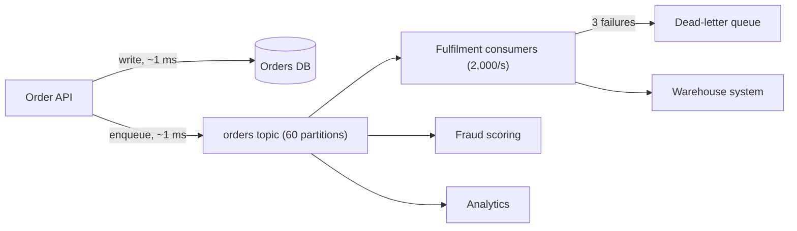

A flash sale starts and orders arrive at 10,000 per second. The fulfilment pipeline, which talks to a warehouse system built in 2009, can process 2,000 per second on a good day. If the order API calls fulfilment synchronously, the API's latency becomes the warehouse's latency, its threads fill with waiting requests, and at 10,000 per second it falls over within seconds. Every customer gets an error even though the order database was fine.

A queue between them changes the shape of the problem. The API writes the order and enqueues a message in about a millisecond; the fulfilment consumers drain at 2,000 per second; the backlog grows at 8,000 per second for the ten minutes the sale lasts, peaks at 4.8 million messages, and drains in 40 minutes. Customers see instant confirmations and slightly delayed shipping emails. That arithmetic (arrival rate minus service rate, times duration, divided by drain rate) is the first thing to write down whenever you propose a queue. The second is the queueing curve that says how slow the queue is when it is *not* overloaded, and the third is what happens to a message when the consumer holding it dies.

## Why a queue

Four distinct benefits, and a design should say which ones it is buying:

1. **Buffering.** Absorb bursts a downstream cannot handle. Requires the delay to be acceptable to the product.
2. **Decoupling in time and availability.** The producer succeeds while the consumer is down. Requires the producer not to need the consumer's answer.
3. **Fan-out.** One event, many independent consumers (fulfilment, analytics, fraud, email), each at its own pace and position.
4. **Retry isolation.** Failed work is retried by the consumer without the original caller, with a dead-letter path for the poisonous ones.



The cost is the same in every case: the work happens *later*, the caller cannot see its result synchronously, and you now operate a broker with its own failure modes.

```viz
{"type": "system", "scenario": "message-queue", "requests": 12,
 "title": "Producers, a queue, and slower consumers", "caption": "Messages arrive faster than the consumers drain them. Watch the depth grow; that depth is the delay every message will experience, and its growth rate is the number to alert on."}
```

## Utilisation decides latency

The flash-sale arithmetic treats the consumer as a pipe with a fixed rate. Real arrivals are bursty and real processing times vary, and that variance makes a queue slow long before it is full. The standard model is **M/M/1**: random (Poisson) arrivals at rate $\lambda$, one consumer with exponentially distributed service at rate $\mu$, utilisation $\rho = \lambda/\mu$. The mean time a message spends waiting plus being processed is

$$W = \frac{1}{\mu - \lambda} = \frac{1/\mu}{1 - \rho}$$

and that time is exponentially distributed, so its p99 is $\ln 100 \approx 4.6$ times the mean. A consumer that needs 10 ms per message ($\mu = 100$/s):

| Utilisation | Arrivals/s | Mean (formula) | p99 (formula) | Mean (simulated) | p99 (simulated) |
|---|---|---|---|---|---|
| 50% | 50 | 20 ms | 92 ms | 19.9 ms | 92 ms |
| 70% | 70 | 33 ms | 154 ms | 33.0 ms | 155 ms |
| 80% | 80 | 50 ms | 230 ms | 48.8 ms | 227 ms |
| 90% | 90 | 100 ms | 461 ms | 95.0 ms | 431 ms |
| 95% | 95 | 200 ms | 921 ms | 179 ms | 737 ms |
| 99% | 99 | 1,000 ms | 4,605 ms | 675 ms | 2,121 ms |

The simulation pushed 400,000 messages through one consumer (seed 7, first 10% discarded as warm-up). Up to 90% it matches the formula within 5%. At 95% and 99% it reads low because the queue has not reached steady state in 400,000 messages, and a queue that needs millions of messages to settle is itself the warning. Going from 50% to 90% busy buys 1.8× the throughput and costs 5× the latency. That is why consumers are provisioned for 60–70% at peak, the same curve [capacity planning](/learn/system-design/senior-design-skills/capacity-planning-and-cost) uses for servers.

```python
import heapq, random

def simulate(lam, mu, consumers, n, seed=7):
    """FIFO queue, Poisson arrivals, exponential service; returns time in system per message."""
    rng, t, free, out = random.Random(seed), 0.0, [0.0] * consumers, []
    for _ in range(n):
        t += rng.expovariate(lam)                 # next arrival
        start = max(t, heapq.heappop(free))       # earliest-free consumer takes it
        done = start + rng.expovariate(mu)
        heapq.heappush(free, done)
        out.append(done - t)
    return sorted(out[n // 10:])                  # drop warm-up, sort for percentiles

xs = simulate(lam=90, mu=100, consumers=1, n=400_000)
print(f"mean {sum(xs)/len(xs)*1000:.1f} ms, p99 {xs[int(len(xs)*0.99)]*1000:.1f} ms")
```

### Little's law

$L = \lambda W$ holds for any stable system, whatever the distributions: the average number of items inside equals the arrival rate times the average time each spends inside. It answers three design questions directly:

- **Backlog to delay.** 4.8 million messages drained at 2,000/s means the last one waits 2,400 s.
- **Concurrency to throughput.** A consumer whose warehouse call takes 50 ms must keep 2,000 × 0.05 = 100 messages in flight to sustain 2,000/s: 25 processes with 4 workers each, for example. With 40 in flight it tops out at 800/s and the backlog never drains.
- **Lag to age.** Kafka reports lag in messages; divided by the consume rate it becomes seconds, the number the product cares about.

### Partitions give up pooling

A Kafka consumer group assigns each partition to exactly one consumer, so four consumers on four partitions are four separate M/M/1 queues. An SQS or RabbitMQ queue with four competing consumers is one M/M/4 queue: any idle consumer takes the next message. Same total load (320/s), same consumers (100/s each), same simulation:

| Layout | Utilisation per consumer | Mean | p99 |
|---|---|---|---|
| One shared queue, 4 consumers | 80% | 17 ms | 68 ms |
| 4 partitions, keys spread evenly | 80% | 49 ms | 227 ms |
| 4 partitions, key shares 30/25/25/20% | 96/80/80/64% | 106 ms | 809 ms |

Pooling cuts the p99 by more than 3× at identical cost, because no message waits behind a busy consumer while another sits idle. The skewed row is the realistic one: five points of key skew put one partition at 96% and multiplied its mean fivefold. Per-key ordering is what that loss buys; a workload that does not need ordering should not pay for it. Kafka's share groups (KIP-932, early access in Kafka 4.0) exist to give Kafka topics this queue-style consumption.

## Three models, not one

"Message queue" hides three architectures, and choosing between them is most of the design.

| | Kafka (log) | RabbitMQ (broker-managed queue) | SQS (managed queue) |
|---|---|---|---|
| Storage model | Append-only partitioned log, retained by time or size (days) | Queue; messages deleted on ack | Queue; deleted on ack; 4-day default, 14-day max retention |
| Consumer position | Consumer group commits an offset per partition; replay by rewinding | Broker pushes; per-message ack; no replay after ack | Consumer polls; visibility timeout; no replay after delete |
| Ordering | Per partition, strict | Per queue with one consumer; lost with competing consumers | Standard: best-effort; FIFO: per message group |
| Throughput | A partition sustains tens of MB/s; clusters do GB/s | Tens of thousands of messages/s per node | Standard: effectively unlimited; FIFO: 300 operations/s per queue (3,000 messages/s in batches of 10), more in high-throughput mode |
| Fan-out | Free: each consumer group reads the same log | Exchanges route copies to several queues | SNS in front, or one queue per consumer |
| Routing | By partition key only | Rich: topic exchanges, headers, dead-letter exchanges | Minimal |
| Best fit | Event streams, audit logs, CDC, many consumers, replay | Task queues with routing, priorities, RPC-style work | Simple task queues with no ops budget |

A **log** keeps messages after consumption and lets any number of consumer groups read them independently, including from the beginning. A **queue** hands each message to one consumer and forgets it. Fan-out and replay push you toward a log; per-message routing, priorities and delayed delivery toward a broker; nobody-on-call toward SQS.

### Kafka's partition mechanics

A topic is split into partitions, each an ordered, immutable sequence of records with offsets. Producers choose a partition by key (a hash of the key mod the partition count) or spread keyless records. A consumer group assigns each partition to one consumer in the group, so parallelism equals partition count. Retention is by time (7 days is the default) or size, independent of consumption.

```viz
{"type": "system", "scenario": "kafka-partitions", "nodes": 3,
 "title": "Topic with three partitions and a consumer group", "caption": "Records with the same key always land in the same partition, so order holds per key. Each partition is owned by one consumer in the group; adding a fourth consumer to a three-partition topic leaves it idle."}
```

Partition count arithmetic: a consumer that processes 500 messages per second and a target of 20,000 per second need at least 40 partitions, and the count is hard to change later because adding partitions changes which partition a key hashes to. Over-provision modestly (60, say): every partition costs file handles, replication traffic and rebalance time. [Kafka internals](/learn/big-data/streaming/kafka-internals) covers replication, ISR and retention.

## Delivery guarantees

The guarantee is decided by *when the consumer acknowledges*, not by the broker.

| Guarantee | Consumer behaviour | Failure consequence |
|---|---|---|
| At-most-once | Ack (commit offset) before processing | A crash after ack, before the side effect: message lost |
| At-least-once | Ack after processing | A crash after the side effect, before ack: message redelivered, effect duplicated |
| Effectively-once | At-least-once plus idempotent processing | Duplicates arrive and are neutralised |

At-least-once is the default you want, and it means every consumer must be idempotent: dedupe on a producer-assigned ID, or make the effect an upsert ([Idempotency and retries](/learn/system-design/building-blocks/idempotency-and-retries)). Kafka's transactional "exactly-once" covers consume-transform-produce loops whose output is also Kafka; once a consumer writes to Postgres or calls an HTTP API, you are back to idempotent consumers ([Exactly-once semantics](/learn/system-design/distributed-systems/exactly-once-semantics)).

The producer has its own duplicate source: a send that times out waiting for the broker's ack and is resent. Kafka's idempotent producer (on by default since 3.0) attaches a producer ID and sequence number so the broker drops the resend; SQS FIFO deduplicates on a `MessageDeduplicationId` within a 5-minute window; RabbitMQ publisher confirms tell you a message arrived but do not dedupe, so the consumer must.

### At-least-once, traced through a crash

An SQS standard queue, visibility timeout 30 s, and message m1 "ship order 7781". Consumer A is OOM-killed between the side effect and the delete:

| t (s) | Event | Receive count | Message state | Shipments created |
|---|---|---|---|---|
| 0.0 | Producer sends m1 | 0 | Visible | 0 |
| 0.1 | A receives m1 with receipt handle h1 | 1 | In flight until 30.1 | 0 |
| 2.0 | A calls the warehouse API; shipment created | 1 | In flight | 1 |
| 2.1 | A is killed before `DeleteMessage(h1)` | 1 | In flight | 1 |
| 30.1 | Visibility timeout expires | 1 | Visible | 1 |
| 30.4 | B receives m1 with a new handle h2 | 2 | In flight until 60.4 | 1 |
| 30.9 | B calls the warehouse API | 2 | In flight | **2** |
| 31.0 | B calls `DeleteMessage(h2)` | 2 | Deleted | 2 |

Nothing was lost and the customer gets two parcels. B cannot tell that A did the work, because A's only record of it is on the warehouse's side. The fix therefore lives there: B sends the same idempotency key A sent (`ship-7781`, derived from the order, not generated per attempt), and the warehouse returns the existing shipment. A local dedupe table works only when the side effect is a write to the *same* database, committed in the same transaction as the dedupe row.

Kafka redelivers by position instead of by lease. Partition 7 has committed offset 1,000 (the next offset to read). A polls and gets 1,000–1,499, writes 1,000–1,299 to the database, and is killed. Its heartbeats stop; after `session.timeout.ms` (45 s by default since Kafka 3.0) the group coordinator declares it dead and reassigns partition 7 to B, which reads from committed offset 1,000. Result: 300 duplicate writes and a 45-second stall on that partition. A graceful shutdown (`close()` on SIGTERM) commits and leaves the group at once, which is why deploys should stop consumers with SIGTERM and a grace period, not SIGKILL.

## Under the hood: leases, offsets and prefetch

**SQS: a lease with a receipt handle.** `ReceiveMessage` marks the message in flight, returns a fresh receipt handle and increments `ApproximateReceiveCount`. `DeleteMessage` needs the most recent handle; the documentation warns that an older one may not delete the message, so a slow consumer whose lease expired can finish its work and still leave the message to be processed again. `ChangeMessageVisibility` extends the lease, up to 12 hours from the original receive. A standard queue is spread over many servers and a short poll samples a subset of them, so it can return nothing while messages exist; long polling (`WaitTimeSeconds` up to 20) queries all of them and cuts billed empty receives.

**Kafka: the broker keeps no per-message state.** A consumer's position is an offset it commits to the internal compacted topic `__consumer_offsets`. Liveness has two timers: a background thread's heartbeats (`heartbeat.interval.ms`, 3 s) must arrive within `session.timeout.ms`, and the application must call `poll()` within `max.poll.interval.ms` (5 minutes) or the client leaves the group itself. With `enable.auto.commit=true` (the default, every 5 s), `poll()` commits the offsets returned by the *previous* poll. That is at-least-once if you finish processing before polling again, and silently at-most-once the moment you hand records to another thread: the next poll commits offsets whose processing has not happened.

**RabbitMQ: the broker pushes, bounded by prefetch.** `basic.qos` sets how many unacknowledged messages the broker may have outstanding on a consumer's channel. That is backpressure in the protocol: a consumer with 100 concurrent 50 ms handlers and prefetch 100 sustains 2,000/s by Little's law, and a slow consumer stops receiving rather than buffering. Unacked messages return to the queue, flagged `redelivered`, when the channel closes. Quorum queues count deliveries and dead-letter a message past `x-delivery-limit` (20 by default since RabbitMQ 4.0), and a consumer holding a message past `consumer_timeout` (30 minutes by default) has its channel closed.

## Ordering

Global ordering across a high-throughput queue does not exist at scale; you get ordering per key. Everything that must be processed in order shares a key (all events for `order_7781` go to one partition or one SQS FIFO message group), and the consumer processes a key's messages sequentially.

The cost is head-of-line blocking. If one message for order 7781 is retried for a minute, everything behind it in that partition waits, including thousands of unrelated orders that hashed there. Keep partitions numerous so each carries fewer keys, and send a repeatedly failing message to a dead-letter path after three attempts, not thirty. SQS FIFO blocks per message group, isolating the stall to one key, which is part of why it costs throughput.

Rebalances replay messages. When a consumer joins or leaves, partitions move, and the new owner starts from the last committed offset, which may trail what the old owner processed. Cooperative (incremental) rebalancing pauses only the moved partitions instead of the whole group, static membership (`group.instance.id`) lets a restarted consumer rejoin without a rebalance at all, and Kafka 4.0 made the broker-driven group protocol of KIP-848 generally available, which is incremental by design.

## Designing the consumer

**Batch.** Pulling one message per round trip at 1 ms caps a consumer near 1,000 per second. Pull 100 to 500, process, commit once (`max.poll.records`, 500 by default; SQS returns at most 10 per receive).

**Commit after the side effect, not before**, and commit a batch's position only after every message in it is done.

**Match the lease to processing time.** Set the SQS visibility timeout above p99 processing time, or extend it from a heartbeat while working. Kafka's equivalent is `max.poll.interval.ms`.

**Bound concurrency.** A consumer with an unbounded buffer between "pulled" and "processed" runs out of memory during a backlog. Size the in-flight window with Little's law (throughput × processing time), pull only when there is capacity, and the backlog stays on the broker, where it is durable and observable.

```viz
{"type": "system", "scenario": "backpressure", "requests": 20,
 "title": "Consumer pulls only what it can process", "caption": "A bounded in-flight window lets the queue hold the backlog instead of the consumer's heap. When the window is full the consumer stops polling and the depth grows on the broker, where it is durable and observable."}
```

## Poison messages and dead-letter queues

A message that fails deterministically (malformed payload, a foreign key that will never exist) fails every retry. Trace one on SQS with visibility 30 s and a redrive policy of `maxReceiveCount` 3:

| t (s) | Event | Receive count |
|---|---|---|
| 0 | Received by A; parsing throws; no delete | 1 |
| 30 | Visible again; received by B; throws | 2 |
| 60 | Received by C; throws | 3 |
| 90 | The next receive would make it 4, above 3: SQS moves it to the DLQ | 3 |

The poison message cost three attempts and 90 seconds, and blocked nothing, because a standard queue has no order to block. On a Kafka partition the same retries stall every message behind it, and Kafka has no broker-side DLQ, so the consumer builds one: catch the failure, publish the record with error headers to `orders.retry-1m`, commit, move on. A retry consumer processes each retry topic after its delay and forwards to `orders.dlq` after the last; Uber's engineering blog has described this tiered design publicly. It unblocks the partition at a price: a later event for the same key can overtake the one being retried. When per-key order matters, park the key: mark it blocked and route its later events down the same retry path until the head is resolved.

Four rules make a DLQ useful rather than a graveyard:

1. **Alert on DLQ depth and age.** One message is a bug report; a thousand in a minute is an outage.
2. **Keep the reason.** Attach the exception, attempt count and consumer version as attributes, or triage means re-running the message and hoping.
3. **Outlive the source.** For SQS standard queues a message keeps its original enqueue timestamp in the DLQ, so a DLQ with the source's 4-day retention deletes a message that spent 3 days failing one day after it arrives. Set it to the 14-day maximum.
4. **Build the replay tool first.** SQS's redrive (`StartMessageMoveTask`) moves messages back but neither dedupes nor preserves per-key order; the consumer's idempotency has to cover both.

## Lag as the SLI

The health of an async system is **consumer lag**: for Kafka, the latest offset minus the committed offset per partition; for SQS, `ApproximateNumberOfMessagesVisible` and `ApproximateAgeOfOldestMessage`. Lag in *time* is what the product cares about and what to alert on. A shipping-email pipeline that tolerates 5 minutes pages at 3 minutes of age, measured by the consumer as `now() - message.timestamp`.

Lag also sizes the fleet. If lag grows at 8,000 per second and each consumer drains 500, 16 more consumers stop the growth, and more drain the backlog within the target. Autoscaling on lag works while there are partitions for the new consumers to own.

## Failure modes

| Failure | Symptom | Diagnosis | Fix |
|---|---|---|---|
| Crash mid-batch | Duplicate side effects clustered after a restart or deploy | Duplicates match the uncommitted range: batch size × crashed consumers | Idempotent writes; smaller batches; SIGTERM with a grace period so `close()` commits |
| Lease shorter than work | Duplicates rise with the latency of a downstream call, not with crashes | `ApproximateReceiveCount` > 1 on messages that eventually succeed | Visibility above p99 processing time, extended by heartbeat; idempotency key on the call |
| Auto-commit with async handoff | Messages vanish after a consumer crash; no errors, no DLQ entries | Committed offset ahead of processed offset; worker pool fed from the poll loop | Disable auto-commit; commit only offsets whose processing finished |
| Poison message blocks a partition | Lag rises on one partition while others are flat | The same offset retried in consumer logs | Bounded retries, retry topics and a DLQ; per-partition lag alerts |
| Queue growth hides dead consumers | Consumers died at 02:00; at 09:00 there are 3 million messages and the first complaint | No producer errors; oldest-message age climbing all night | Alert on lag age and consumer heartbeats, not producer errors |
| Hot partition | One consumer saturated, others idle | Per-partition throughput skew; a low-cardinality key such as `country` | High-cardinality key; salt hot keys ([Partitioning and rebalancing](/learn/system-design/distributed-systems/partitioning-and-rebalancing)) |
| Rebalance storm | Nothing processed; the group's state flaps | Rebalance count rising; consumers exceeding `max.poll.interval.ms` | Smaller batches; slow work off the poll thread with bounded concurrency; static membership |
| DLQ expiry | Failed messages gone when someone finally looks | DLQ retention equal to the source's | 14-day DLQ retention; depth and age alerts |

## Interviewer follow-ups

**"Why Kafka and not SQS here?"** Model answer: three consumers need the same order events and I want replay: when the fraud model changes I re-score the last 7 days from the log. SQS needs SNS fan-out to three queues and cannot replay after delete. With one consumer and no replay I would pick SQS and spend the operational budget elsewhere. Common wrong answer: "Kafka is faster", when SQS standard throughput is effectively unlimited and the deciding axes are fan-out, replay and operating cost.

**"How do you guarantee an order's events are processed in order?"** Model answer: partition by `order_id` so one consumer handles an order sequentially; accept head-of-line blocking and bound it with a small retry limit and a parked-key retry path. Common wrong answer: "one partition", which gives global order nobody asked for at the throughput of one consumer.

**"A consumer bug corrupts data for an hour. Recover."** Model answer: with a log, stop the consumers, fix the bug, reset the group's offsets to before the corruption and replay; writes are idempotent upserts keyed by event ID, so the replay overwrites the bad rows. With a queue the messages are gone after ack and the producer must re-emit. Retention must exceed your worst detection time: 7 days, not 1. Common wrong answer: "restore the database from backup", which also discards an hour of correct writes from everything else.

**"Four consumers are 80% busy and the p99 is 230 ms. The team wants to add partitions. What else?"** Model answer: each partition is its own M/M/1 queue; the same four consumers on a shared queue measured 68 ms at the same load. If ordering is not needed, a competing-consumer queue (or share groups) buys pooling; if it is, add consumers to bring utilisation to 60–70% and fix key skew first. Common wrong answer: "the consumers are only 80% busy, so latency must be the downstream", which ignores queueing delay.

**"The consumer calls a third-party API that sometimes takes 40 seconds. What breaks?"** Model answer: on SQS the 30-second lease expires and a second consumer takes the message, and the first one's late delete may not remove it; raise the visibility timeout above p99 and extend it while working. On Kafka, exceeding `max.poll.interval.ms` evicts the consumer and rebalances; move the call to a bounded worker pool and commit only finished offsets. Either way the call carries an idempotency key. Common wrong answer: "raise the timeout to 12 hours", which turns a crashed consumer's message into a 12-hour delay.

## What mid-level engineers get wrong

- **Provisioning consumers for 90% utilisation.** The mean latency is 5× the 50% figure and the p99 is worse; bursts push it past 100% and the backlog never drains.
- **Generating the idempotency key per attempt.** A UUID created inside the consumer is different on redelivery, so it dedupes nothing.
- **Turning on auto-commit and a thread pool together.** Offsets commit ahead of processing and a crash loses messages silently.
- **Unbounded retries on an ordered partition.** One malformed event stalls every key that shares its partition for hours.
- **Treating the DLQ as done.** Without alerts, retention longer than the source's and a replay path, it is a slower way to lose data.
- **Choosing Kafka by default.** A single-consumer task queue on Kafka pays for partitions, rebalances and a cluster to get what SQS gives with no operations.

## Exercise: follow one message through leases and a DLQ

```exercise
id: sqs-lifecycle
title: Simulate a visibility timeout, redelivery and a dead-letter queue
prompt: |
  Model one message on an SQS-style queue. It is visible at t = 0.
  `polls` lists consumer attempts `[t, duration, outcome]`, sorted by `t`.

  - A poll at time `t` receives the message only if it is visible (not in
    flight, not deleted, not in the DLQ). A poll that gets nothing does
    nothing else.
  - The message is visible again once `t >= receive time + visibility`.
  - If the message has already been received `max_receives` times, the next
    poll that finds it visible moves it to the DLQ and receives nothing.
  - Otherwise the poll receives it: the receive count goes up by one, this
    poll becomes the latest receipt, and the poll finishes at
    `t + duration` with its outcome:
    - `"ok"`: the side effect happens, then a delete. The delete only works
      if this poll still holds the latest receipt and the message is not in
      the DLQ; a stale delete is ignored.
    - `"crash_after_effect"`: the side effect happens; no delete.
    - `"fail"`: no side effect, no delete.
  - Process events in time order. At equal times, completions happen before
    polls, and earlier polls before later ones.

  Return `{"received": [indices of polls that received the message],
  "side_effects": count, "final": "deleted" | "dlq" | "pending"}`.
languages: [python, javascript]
entry: sqs_lifecycle
starter:
  python: |
    def sqs_lifecycle(visibility, max_receives, polls):
        received, side_effects, final = [], 0, "pending"
        # your code here
        return {"received": received, "side_effects": side_effects, "final": final}
  javascript: |
    function sqs_lifecycle(visibility, max_receives, polls) {
      const received = [];
      let side_effects = 0, final = "pending";
      // your code here
      return { received, side_effects, final };
    }
tests:
  - args: [30, 3, [[0, 5, "ok"]]]
    expected: {"received": [0], "side_effects": 1, "final": "deleted"}
    label: the happy path
  - args: [30, 3, [[0, 3, "crash_after_effect"], [31, 2, "ok"]]]
    expected: {"received": [0, 1], "side_effects": 2, "final": "deleted"}
    label: crash after the side effect duplicates it
  - args: [30, 3, [[0, 45, "ok"], [31, 5, "ok"]]]
    expected: {"received": [0, 1], "side_effects": 2, "final": "deleted"}
    label: a consumer slower than the lease
  - args: [30, 3, [[0, 1, "fail"], [31, 1, "fail"], [62, 1, "fail"], [93, 1, "ok"]]]
    expected: {"received": [0, 1, 2], "side_effects": 0, "final": "dlq"}
    label: a poison message reaches the DLQ on the fourth receive
  - args: [30, 3, [[0, 5, "ok"], [2, 1, "ok"]]]
    expected: {"received": [0], "side_effects": 1, "final": "deleted"}
    label: a poll during the lease gets nothing
  - args: [30, 3, []]
    expected: {"received": [], "side_effects": 0, "final": "pending"}
    label: no polls
  - args: [30, 3, [[0, 40, "ok"], [30, 20, "fail"], [45, 1, "ok"]]]
    expected: {"received": [0, 1], "side_effects": 1, "final": "pending"}
    hidden: true
    label: the work succeeded but the stale delete leaves the message pending
  - args: [10, 1, [[0, 11, "ok"], [10, 1, "ok"]]]
    expected: {"received": [0], "side_effects": 1, "final": "dlq"}
    hidden: true
    label: processed successfully yet dead-lettered
hints:
  - "Keep a priority queue of events `(time, kind, index)` with completions ordered before polls at equal times."
  - "Before handling any event, flip an in-flight message back to visible if `t >= invisible_until`."
  - "Remember which poll holds the latest receipt; an `ok` completion from any other poll still counts its side effect but cannot delete."
```

## Senior signals

- You justify a queue with **arithmetic**: arrival minus service rate, peak backlog, drain time, and whether the product tolerates that delay.
- You know latency is a function of **utilisation**, quote the $1/(1-\rho)$ curve, and provision consumers for 60–70% at peak; you use **Little's law** to size in-flight windows and to turn lag into seconds.
- You distinguish a **log** from a **queue**, choose on fan-out, replay and operations, and know that partitions trade pooling for per-key order.
- You state that delivery guarantees are decided by **when the consumer acks**, can trace a redelivery through a lease or an offset, and derive idempotency keys from the business entity.
- You bound retries, park keys when order matters, alert on **lag age** and DLQ depth, and give the DLQ longer retention and a replay path before the incident.
- You know **partition count is hard to change**, why, and how you would migrate if you had to.

## Check yourself

```quiz
- q: >-
    Orders arrive at 10,000/s for 10 minutes; consumers drain 2,000/s. What is the peak backlog and how long after the burst ends does it clear?
  options: ["6 million messages, 30 minutes", "8 million messages, 40 minutes", "4.8 million messages, 40 minutes", "4.8 million messages, 24 minutes"]
  answer: 2
  explanation: >-
    Backlog grows at 10,000 - 2,000 = 8,000/s for 600 s: 4.8 million. After arrivals stop it drains at 2,000/s: 4.8M / 2,000 = 2,400 s = 40 minutes.
- q: >-
    A consumer takes 10 ms per message on average. Traffic grows from 50 to 90 messages per second. Under the M/M/1 model, what happens to the mean time a message spends in the system?
  options: ["It rises from 20 ms to 100 ms, five times", "It rises from 20 ms to 36 ms, in line with load", "It doubles from 20 ms to 40 ms as the load nearly doubles", "It stays near 10 ms until the consumer is full"]
  answer: 0
  explanation: >-
    W = 1 / (mu - lambda): 1 / (100 - 50) = 20 ms and 1 / (100 - 90) = 100 ms. Latency grows with 1 / (1 - rho), not with load, which is why consumers are provisioned for 60-70% at peak; the lesson's simulation measured 19.9 ms and 95 ms.
- q: >-
    An SQS consumer takes 45 s to process a message with the default 30 s visibility timeout, then calls DeleteMessage. What happens?
  options: ["The first consumer gets an error at 30 s and has to restart its work", "SQS deletes the message at 30 s because the lease has expired", "SQS extends the lease automatically while the first consumer is still working", "It is redelivered at 30 s and the late delete may not remove it"]
  answer: 3
  explanation: >-
    The visibility timeout is a lease. When it expires the message is delivered again with a new receipt handle, so two consumers process it; the first consumer's delete uses a stale handle, which the documentation warns may not delete it. Extend visibility explicitly and make processing idempotent.
- q: >-
    A Kafka consumer uses enable.auto.commit=true and hands each polled batch to a thread pool, returning to poll() immediately. What delivery guarantee does it have?
  options: ["At-most-once: a crash can lose handed-off records", "At-least-once: the thread pool retries on failure", "At-least-once: offsets are committed after processing", "Exactly-once: Kafka commits and processes atomically"]
  answer: 0
  explanation: >-
    Auto-commit commits the offsets returned by the previous poll during the next poll. With processing on another thread, the next poll arrives before processing finishes, so offsets run ahead of work and a crash loses those records. Synchronous processing in the poll loop would give at-least-once.
- q: >-
    Four consumers each handle 100 messages/s; total load is 320/s. Why did four Kafka partitions measure a p99 of 227 ms while one shared SQS-style queue measured 68 ms?
  options: ["Kafka adds broker latency on every fetch that SQS avoids", "The shared queue drops slow messages to protect its p99", "Each partition queues alone while other consumers sit idle", "Partitions process messages in order, which doubles service time"]
  answer: 2
  explanation: >-
    A consumer group gives each partition to one consumer, making four M/M/1 queues; a shared queue lets any idle consumer take the next message (M/M/4). Pooling removes waiting behind a busy consumer while another is idle. Service time is the same in both; ordering costs pooling, not per-message work.
- q: >-
    A standard SQS queue retains messages for 4 days and its DLQ also retains for 4 days. A message fails for 3 days before moving to the DLQ. When is it deleted?
  options: ["About 7 days after it was first sent", "About 1 day after it reaches the DLQ", "About 4 days after it reaches the DLQ", "Never, since DLQ messages do not expire"]
  answer: 1
  explanation: >-
    For standard queues the enqueue timestamp is unchanged when a message moves to the DLQ, so its expiry is still 4 days after it was first sent: about 1 day after arriving in the DLQ. Set DLQ retention longer than the source's, up to the 14-day maximum.
```
