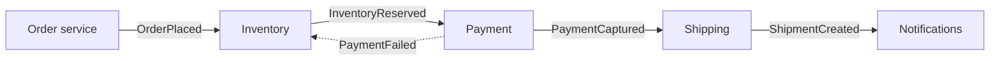
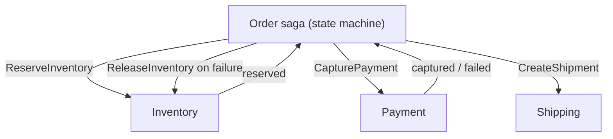

The order service saves an order and then publishes `OrderPlaced` to Kafka. One afternoon the broker is slow; the publish times out after the database commit has succeeded. The order exists, fulfilment never hears about it, and the customer gets a receipt for something that will not ship. Reverse the order of operations and you get the opposite bug: an event for an order whose insert was then rolled back. This is the dual-write problem, and any architecture that says "write to the database and publish an event" has it until it is designed away.

Event-driven architecture is worth its complexity because it lets teams and services evolve independently: a new consumer subscribes without the producer knowing. But that independence is only real if events are reliably produced, carry the right information, and can change shape without breaking everyone downstream. This lesson is about those three things.

## Events, commands and what they carry

An **event** is a fact about the past: `OrderPlaced`, `PaymentCaptured`, `ShipmentDelayed`. Its producer does not know or care who consumes it. A **command** is a request to do something: `ReserveInventory`, `SendReceipt`. It has one intended handler and an outcome the sender wants to know about. Mixing them up produces the worst of both: a producer emitting "events" that are really instructions to a specific service, which couples them as tightly as an RPC while hiding the coupling.

Events also differ in how much they carry:

| Style | Payload | Consumer does | Trade-off |
|---|---|---|---|
| Notification | `{order_id: 7781}` | Calls the producer's API for details | Small events; consumer depends on producer availability; a burst of events becomes a burst of API calls |
| Event-carried state transfer | Full order snapshot | Uses the payload; no callback | Larger events; consumers keep their own copies; the producer's schema becomes a public contract |
| Event sourcing | Every state change as an event; the event log *is* the store | Rebuilds state by replaying | Perfect audit and replay; queries need projections; snapshots to bound replay |

Event-carried state is the usual choice for cross-service events: a 1 KB order snapshot at 500 orders per second is 500 KB/s, trivial, and it removes the availability coupling of callbacks. Event sourcing is a storage decision for one service's own data, not an integration style; a service can event-source internally and publish event-carried-state events externally.

```viz
{"type": "system", "scenario": "event-sourcing", "requests": 6,
 "title": "State as a fold over events", "caption": "The current balance is not stored; it is computed by replaying every event. A snapshot every N events bounds the replay cost so a hot entity does not replay a year of history on each load."}
```

Event sourcing numbers: 1,000 events per second at 300 bytes is 26 GB per day, 9.5 TB per year before compression, and the log is append-only, so that is the storage plan. Replay of an entity with 50,000 events at 1 microsecond per apply is 50 ms, acceptable; at 5 million events it is not, hence snapshots.

## Choreography vs orchestration

Take order fulfilment: reserve inventory, capture payment, create shipment, send confirmation.

**Choreography**: each service reacts to events and emits its own. No one owns the flow; it emerges from subscriptions.



**Orchestration**: a coordinator (the order saga) issues commands and tracks state.



| | Choreography | Orchestration |
|---|---|---|
| Where the flow lives | Spread across subscriptions | In one state machine |
| Adding a step | Subscribe a new service; nobody else changes | Change the orchestrator |
| Seeing where an order is | Trace across five services | Query the saga's state |
| Compensation on failure | Every service listens for failure events from every later step | The orchestrator issues compensations in reverse |
| Coupling | Low, until the flow has conditionals | The orchestrator knows every service's API |
| Failure mode | Cyclic subscriptions, "who emits what" nobody can answer | Orchestrator becomes a god service |

The senior default: choreography for simple fan-out where consumers are genuinely independent (analytics, search indexing, notifications), orchestration for any multi-step flow with compensation. A flow with more than three steps that must be undone on failure is a saga, and a saga wants an owner; [Distributed transactions](/learn/system-design/distributed-systems/distributed-transactions) covers compensation design.

```viz
{"type": "system", "scenario": "saga", "nodes": 3,
 "title": "Orchestrated saga with compensation", "caption": "Each step is a local transaction. When payment fails, the orchestrator runs the compensations for completed steps in reverse order; inventory is released, the order is marked failed."}
```

## The dual-write problem and the outbox

Back to the opening bug. The database commit and the broker publish are two systems; there is no transaction spanning both; one can succeed while the other fails. Two-phase commit across a database and Kafka is technically possible with XA and practically avoided (blocking, slow, poorly supported).

The **transactional outbox** removes the second system from the transaction. The service writes the business row *and* an outbox row (`id, aggregate_id, event_type, payload, created_at`) in the same database transaction. A separate relay reads the outbox and publishes to the broker, marking rows as published. If the commit fails, no outbox row exists. If the relay fails, the row waits. The event is published at least once (the relay might crash after publishing and before marking), so consumers dedupe on the event ID, which is the outbox row's primary key.

```viz
{"type": "system", "scenario": "outbox", "requests": 4,
 "title": "Transactional outbox", "caption": "Business row and outbox row commit atomically. The relay publishes from the outbox and marks rows sent; a crash between publish and mark causes a redelivery, which the consumer's event-ID dedupe absorbs."}
```

```sql
BEGIN;
INSERT INTO orders (id, customer_id, total, status) VALUES (7781, 42, 89.00, 'placed');
INSERT INTO outbox (id, aggregate_type, aggregate_id, event_type, payload)
  VALUES ('e1c4...', 'order', 7781, 'OrderPlaced', '{"order_id":7781,"total":89.00,...}');
COMMIT;
```

Two relay designs:

**Polling relay.** A worker selects unpublished rows every 100 ms, publishes in order per aggregate, marks them. Simple; adds up to the poll interval of latency; scales by partitioning the outbox by aggregate ID. At 500 events per second and 100 ms polls, each poll handles ~50 rows.

**CDC relay.** Debezium tails the database's write-ahead log, sees the outbox insert, and publishes it (with Kafka Connect's outbox event router). No polling, latency in the tens of milliseconds, order preserved from the WAL, and the outbox table can be truncated immediately after insert because Debezium reads the log, not the table. [Change data capture](/learn/big-data/streaming/change-data-capture) covers the mechanics.

```viz
{"type": "system", "scenario": "cdc", "requests": 4,
 "title": "CDC tailing the write-ahead log", "caption": "Every committed change appears in the log in commit order. The connector reads it once and publishes; the database is unaware. Latency is bounded by log shipping, typically tens of milliseconds."}
```

CDC is also how you keep caches, search indexes and read models in sync without dual writes: the row change is the event.

## Schema evolution

An event's schema is a public API with potentially dozens of consumers you do not control and cannot deploy in lockstep. The rules, which Protobuf and Avro enforce mechanically and JSON does not:

**Backward compatibility** (new producer, old consumer): the consumer must ignore fields it does not know, so only *add optional fields with defaults*. Never remove a field a consumer might read, never rename (a rename is a remove plus an add), never change a type.

**Forward compatibility** (old producer, new consumer): the consumer must handle a missing new field, so new fields need defaults on the reading side too.

**Full compatibility**: both, which is the mode to run a schema registry in for any topic with more than one consumer team.

```text
Safe:    add optional field `discount_code` (default null)
Safe:    add enum value `status = 'backordered'` IF consumers treat unknown values as "other"
Unsafe:  rename `total` -> `amount`          (old consumers read null)
Unsafe:  change `total` from string to number
Unsafe:  make an optional field required
Unsafe:  remove `customer_id`                 (someone joins on it)
```

A schema registry (Confluent's, or Buf for Protobuf) checks every new schema version against these rules at publish time and rejects a breaking one before it reaches a consumer. Put the check in CI so the rejection happens in a pull request, not at deploy.

When a breaking change is truly needed, version the topic (`orders.v2`) and run both for a migration window, or version the event type within a topic and have consumers dispatch on it. Both are painful, which is the incentive to design additive changes. Deleting an event type means a tombstone or a deprecation event, not silence; consumers cannot tell "no more events" from "the producer died".

**The tolerant reader.** Consumers read only the fields they need, ignore the rest, and treat unknown enum values as a recognised "unknown". A consumer that deserialises the entire payload into a strict class fails on any addition.

## Ordering, causality and replay

Events for one aggregate must be consumed in order (an `OrderCancelled` before its `OrderPlaced` is a bug), which means partitioning by aggregate ID as in [Queues and async processing](/learn/system-design/building-blocks/queues-and-async-processing). Across aggregates, causality is not guaranteed: a consumer may see `PaymentCaptured` for an order before it has processed `OrderPlaced` if they live on different topics. Consumers handle that by treating out-of-order arrival as a temporary state (buffer the payment until the order arrives, or write the payment with a foreign key that will resolve) rather than an error.

Replay is the superpower: a new read model, a fixed bug, a new consumer that needs history. It requires retention long enough (days to weeks on Kafka; forever if the events are archived to object storage) and consumers whose effects are idempotent so a replay overwrites rather than duplicates. Design the archive on day one; the first time you need a replay of 90 days you do not want to discover retention was 7.

## Failure modes

**Dual write loses an event.** The opening story. Detect: reconciliation job comparing orders to emitted events; consumers' counts vs producer's. Mitigate: outbox or CDC; never publish from application code after a commit.

**Consumers coupled to producer internals.** The `OrderPlaced` payload is the ORM's serialised entity; a column rename in the order service breaks fraud, analytics and shipping on a Tuesday. Detect: consumer deserialisation errors after a producer deploy. Mitigate: events are a deliberately designed contract, checked in a registry, separate from the storage schema.

**Event storms and feedback loops.** Service A emits an update on every change; B reacts by updating its copy, which emits an event; A subscribes to B. Each event triggers another forever. Detect: message rates that rise without traffic; the same aggregate ID cycling. Mitigate: events carry a causation ID; consumers do not re-emit for changes they did not originate; rate limits per aggregate.

**Breaking schema change ships.** A required field is added; every consumer on the old schema fails to deserialise and stops. Detect: consumer error rate spike coinciding with a producer deploy. Mitigate: registry compatibility checks in CI; the tolerant reader.

**Unbounded outbox or event store.** The outbox is never pruned; after a year the polling query scans 400 million rows. Detect: relay latency rising with table size. Mitigate: delete published rows or partition by day and drop; with CDC, truncate immediately.

**"Eventually" reaches the user.** The order page reads from a projection fed by events; the user places an order and the page shows nothing for two seconds. Detect: user-visible staleness right after a write. Mitigate: read-your-writes for the writing session (route to the source, or wait for the projection to catch up to the event's offset), as in [Consistency models](/learn/system-design/building-blocks/consistency-models).

## Interviewer follow-ups

**Q: "The order service commits and then publishes to Kafka. What is wrong with that?"**

Two systems, no shared transaction. If the publish fails after the commit, the order exists and nobody downstream knows; if I publish first and the commit fails, downstream acts on a phantom order. I write the event to an outbox table in the same transaction as the order, and a relay, ideally Debezium reading the WAL, publishes it. Delivery is at least once, so every consumer dedupes on the outbox row's ID. I would say that dual writes are the most common bug I see in event-driven systems and that the outbox is not optional.

**Q: "Choreography or orchestration for the order flow?"**

Orchestration, because the flow has four steps and three of them need compensation on failure, and I want one place that can answer "where is order 7781". A saga state machine issues commands and records each step's outcome in its own table, so recovery after a crash is reading that table. I use choreography for the side consumers that do not participate in the flow, analytics, search, notifications; they subscribe to the saga's events and the orchestrator does not know they exist. The trap I avoid is the orchestrator becoming a service that knows every API in the company; it owns one flow.

**Q: "A consumer team needs a field renamed. How do you ship it?"**

I do not rename. I add the new field with a default, run both for a deprecation window measured in consumer deploys not calendar weeks, watch the registry's consumer metrics to see when nobody reads the old field, then remove it in a version that the registry's compatibility check allows because no active consumer schema references it. If the registry rejects the removal, someone is still reading it and I go talk to them. The check runs in CI so a breaking change cannot merge.

**Q: "How do you rebuild the search index from scratch?"**

Replay. The order topic has 30-day retention and is archived to object storage beyond that, so I start a new consumer group for the index at the earliest offset (or from the archive), it builds the index with idempotent upserts keyed by order ID, and when its lag reaches zero I cut reads over. During the rebuild the old index keeps serving. The throughput number: 500 million events at a consumer doing 20,000 per second is about 7 hours, so I run 20 consumers over 60 partitions and finish in under an hour.

**Q: "What does the user see between placing an order and the projection updating?"**

Up to the pipeline's latency, which I budget at under a second: CDC in tens of milliseconds, Kafka in a few, the projection consumer in tens. For the user who just placed the order I do not rely on that: the confirmation page reads the order from the order service directly, or the client waits for the projection to reach the event's offset with a short timeout. Everyone else sees the projection and does not know a write just happened.

## Senior signals

- You name the **dual-write problem** unprompted and reach for the outbox or CDC, never "publish after commit".
- You distinguish **events from commands** and choose event-carried state to avoid availability coupling, with the byte arithmetic to justify it.
- You pick **orchestration for sagas** and choreography for independent side consumers, and you can say why each fails when misapplied.
- You treat event schemas as **public APIs** with registry-enforced compatibility and the tolerant reader on the consumer side.
- You design for **replay** on day one: retention, archive, idempotent consumers, partition by aggregate ID.
- You know that "eventually consistent" projections need **read-your-writes** for the session that wrote.

## Check yourself

```quiz
- q: >-
    A service inserts an order, commits, then publishes OrderPlaced to Kafka. The publish times out. What is the state of the system?
  options: ["The order was rolled back", "The order exists and downstream consumers never learn of it", "Kafka will retry the publish automatically", "The consumer receives a partial event"]
  answer: 1
  explanation: >-
    The commit already succeeded; the publish is a separate system with no shared transaction. Nothing retries it unless the application does, and a crash loses even that. The transactional outbox makes the event part of the commit.
- q: >-
    Which change to an event schema is safe for existing consumers?
  options: ["Renaming total to amount", "Changing quantity from string to integer", "Adding an optional discount_code field with a default", "Making customer_id required"]
  answer: 2
  explanation: >-
    Adding optional fields with defaults is backward and forward compatible. Renames are a remove plus an add, type changes break deserialisation, and making a field required breaks old producers' events.
- q: >-
    An order flow has four steps, three of which must be undone if a later step fails. The better structure is:
  options: ["Choreography, so services stay decoupled", "Orchestration, so one state machine owns the flow and its compensations", "A single distributed transaction across all four services", "Synchronous REST calls in sequence"]
  answer: 1
  explanation: >-
    Compensation logic spread across subscriptions is hard to reason about and to observe; an orchestrator records each step and runs compensations in reverse. Distributed transactions across services block and couple; synchronous chains lose availability isolation.
- q: >-
    Why can a CDC-based outbox relay truncate the outbox table right after insert?
  options: ["Because the event is stored in the consumer", "Because Debezium reads the write-ahead log, not the table, so the row only needs to be committed once", "Because Kafka acknowledges synchronously", "It cannot; rows must be kept until consumers ack"]
  answer: 1
  explanation: >-
    The connector sees the insert in the WAL in commit order regardless of what happens to the row afterwards. A polling relay, by contrast, needs the row to exist until it is read and marked.
- q: >-
    Service A emits an event on every update; service B updates its copy and emits an event; A subscribes to B and updates. What is the failure and its fix?
  options: ["Deadlock; add timeouts", "An event feedback loop; carry causation IDs and do not re-emit for changes you did not originate", "Schema incompatibility; use a registry", "Head-of-line blocking; add partitions"]
  answer: 1
  explanation: >-
    Each event triggers another indefinitely with no traffic driving it. Causation IDs let a consumer recognise its own echo and stop; rate limits per aggregate are a backstop.
```
