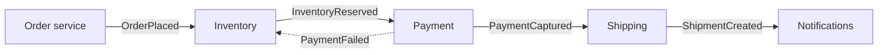
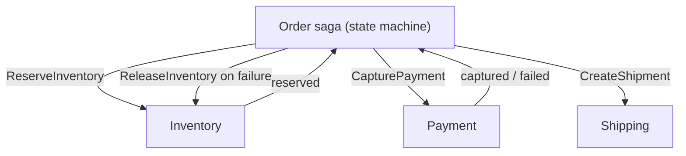

The order service saves an order and then publishes `OrderPlaced` to Kafka. One afternoon the broker is slow; the publish times out after the database commit has succeeded. The order exists, fulfilment never hears about it, and the customer gets a receipt for something that will not ship. Reverse the order of operations and you get the opposite bug: an event for an order whose insert was then rolled back. This is the dual-write problem, and any architecture that says "write to the database and publish an event" has it until it is designed away.

Event-driven architecture is worth its complexity because it lets teams and services evolve independently: a new consumer subscribes without the producer knowing. That independence is only real if events are reliably produced, carry the right information, arrive in an order consumers can rely on, and can change shape without breaking everyone downstream. This lesson traces each of those on concrete data.

## Events, commands and what they carry

An **event** is a fact about the past: `OrderPlaced`, `PaymentCaptured`. Its producer does not know who consumes it, and nobody can reject it; it already happened. A **command** is a request: `ReserveInventory`. It has one intended handler, which may refuse it. A producer emitting "events" that are really instructions to one service couples them as tightly as an RPC while hiding the coupling.

| Style | Payload | Consumer does | Trade-off |
|---|---|---|---|
| Notification | `{order_id: 7781}` | Calls the producer's API for details | Small events; availability coupling; a burst of events becomes a burst of API calls |
| Event-carried state transfer | Full order snapshot | Uses the payload; no callback | Larger events; consumers keep copies; the payload is a public contract |
| Event sourcing | Every state change; the log *is* the store | Rebuilds state by replaying | Complete history and replay; queries need projections; snapshots bound replay |

Event-carried state is the usual choice between services: a 1 KB snapshot at 500 orders per second is 500 KB/s, and it removes the callback's availability coupling. Event sourcing is a storage decision inside one service; a service can event-source internally and publish event-carried-state events externally.

## Event sourcing, traced

An event-sourced account stores no balance. Stream `acc-42` holds its facts, and the balance is a left fold over them:

| Version | Event | Balance after | Note |
|---|---|---|---|
| 1 | `Opened {initial: 100}` | 100 | |
| 2 | `Deposited {50}` | 150 | |
| 3 | `Withdrawn {30}` | 120 | |
| 4 | `Deposited {10}` | 130 | Snapshot written: `{balance: 130, version: 4}` |
| — | Command `Withdraw 200` | 130 | Rejected by the handler; no event is written |
| 5 | `Withdrawn {20}` | 110 | |
| 6 | `Deposited {5}` | 115 | |

Loading `acc-42` reads the snapshot and then only events after version 4: two applies instead of six. Snapshots are a cache: they carry the projection code's version, and changing the fold means discarding and rebuilding them.

```viz
{"type": "system", "scenario": "event-sourcing", "requests": 6,
 "title": "State as a fold over events", "caption": "The current balance is not stored; it is computed by replaying every event. A snapshot every N events bounds the replay cost so a hot entity does not replay a year of history on each load."}
```

**Rebuilding a projection.** A read model such as `balances(account, balance, version)` is built by a projector that reads the store's global log in order and records a checkpoint. Two accounts, interleaved, with a crash:

| Position | Event | `acc-42` row | `acc-7` row | Checkpoint |
|---|---|---|---|---|
| 1 | acc-42 v1 `Opened 100` | 100 @ v1 | — | 1 |
| 2 | acc-7 v1 `Opened 20` | 100 @ v1 | 20 @ v1 | 2 |
| 3 | acc-42 v2 `Deposited 50` | 150 @ v2 | 20 @ v1 | 3 |
| 4 | acc-7 v2 `Withdrawn 5` | 150 @ v2 | 15 @ v2 | crash before saving 4 |
| 4 (again) | acc-7 v2 `Withdrawn 5` | 150 @ v2 | v2 ≤ v2: skipped | 4 |
| 5 | acc-42 v3 `Withdrawn 30` | 120 @ v3 | 15 @ v2 | 5 |

The projector is at-least-once, like any consumer. Storing the stream version on each row makes redelivery harmless without a transaction spanning the row and the checkpoint. A brand-new read model is the same loop started at position 0 while the old one keeps serving; you switch reads when its lag reaches zero.

**The numbers.** On Python 3.14, a fold over one million in-memory events measured 100 ns per event, and 830 ns once each 73-byte JSON event was decoded with `json.loads`: decoding, not applying, dominates, and fetching from the store adds more. A 50,000-event stream replays in tens of milliseconds; a 5-million-event stream costs seconds of CPU per load, which is what snapshots every few hundred events prevent. Storage: 1,000 events per second at 300 bytes is 26 GB per day and 9.5 TB per year before compression, append-only. Netflix has written publicly about an event-sourced service behind download licensing, where the history of every licence action is the product requirement.

### Optimistic concurrency on append

Two withdrawals for `acc-42` race. The store enforces `UNIQUE (stream_id, version)`, and each handler appends at the version it loaded plus one:

| Step | Handler 1 (withdraw 100) | Handler 2 (withdraw 50) |
|---|---|---|
| 1 | Loads balance 115, version 6 | |
| 2 | | Loads balance 115, version 6 |
| 3 | 100 ≤ 115; appends `Withdrawn 100` at version 7: succeeds | |
| 4 | | 50 ≤ 115; appends at version 7: unique violation |
| 5 | | Reloads balance 15, version 7; 50 > 15: rejects the command |

Without the version check both appends succeed and the balance becomes −35. The conflict is the invariant being enforced, and it happens only between writers of the same stream, which is why aggregates are kept small.

## CQRS: one write model, many read models

Command Query Responsibility Segregation splits the model that accepts writes from the models that answer reads. Commands go to the write side, which validates against the aggregate and appends events (or updates rows); projectors turn those changes into read models shaped for one query each: balance per account in Postgres, transactions in a search index, monthly totals in a column store. Reads are stale by the projector's lag, typically tens to hundreds of milliseconds.

| | CRUD on one schema | CQRS, CRUD write side + CDC | Event sourcing + CQRS |
|---|---|---|---|
| History | Whatever you log separately | Change stream, bounded by retention | Complete and authoritative |
| Read shapes | One schema, indexes, joins | Any number, fed from the change stream | Any number, rebuildable from position 0 |
| Read consistency | Read-your-writes by default | Lagged; read-your-writes needs work | Lagged; read-your-writes needs work |
| Schema change | Migrate rows | Migrate rows; rebuild projections | Events are immutable: upcast old versions at read time |
| Operational cost | Lowest | Connector, topics, projectors | Store, snapshots, projectors, upcasters |
| Fits | Most services | Search, caches, analytics beside an OLTP store | Ledgers, audit-heavy domains, workflows |

CQRS does not require event sourcing; most teams that need it want the middle column. Event sourcing without a real need for history is the most expensive way to build CRUD.

## Under the hood: an event store on Postgres

```sql
CREATE TABLE events (
  position  bigserial PRIMARY KEY,           -- global order for projectors
  stream_id text   NOT NULL,
  version   int    NOT NULL,                 -- per-stream order
  type      text   NOT NULL,
  data      jsonb  NOT NULL,
  UNIQUE (stream_id, version)                -- the optimistic concurrency check
);
-- load an aggregate: SELECT * FROM events WHERE stream_id = $1 AND version > $2 ORDER BY version;
-- projector:         SELECT * FROM events WHERE position > $checkpoint ORDER BY position LIMIT 500;
```

The projector query hides a trap: `bigserial` values are allocated when a row is inserted, not when its transaction commits, so positions become visible out of order.

| Time | Transaction A | Transaction B | Projector |
|---|---|---|---|
| t1 | Inserts, gets position 100 | | Checkpoint 99 |
| t2 | | Inserts position 101, commits | |
| t3 | | | Reads `position > 99`: sees only 101; checkpoint 101 |
| t4 | Commits; 100 becomes visible | | |
| t5 | | | Reads `position > 101`: nothing. Event 100 is never projected |

The fixes: record each row's transaction ID (`pg_current_xact_id()`) and have the projector read only rows older than the oldest in-progress transaction (`pg_snapshot_xmin(pg_current_snapshot())`); serialise appends with a lock and accept the throughput cap; or tail the write-ahead log, which is in commit order. Dedicated stores (EventStoreDB, now KurrentDB) assign the global position at commit. The same trap catches polling outbox relays, below.

## Choreography vs orchestration

Take order fulfilment: reserve inventory, capture payment, create shipment, send confirmation.

**Choreography**: each service reacts to events and emits its own. The flow emerges from subscriptions.



**Orchestration**: a coordinator (the order saga) issues commands and records each outcome.



| | Choreography | Orchestration |
|---|---|---|
| Where the flow lives | Spread across subscriptions | In one state machine |
| Adding a step | Subscribe a new service | Change the orchestrator |
| Where is order 7781? | Trace across five services | Query the saga's state |
| Compensation | Every service listens for every later failure | The orchestrator compensates in reverse |
| Failure mode | Cyclic subscriptions nobody can map | The orchestrator becomes a god service |

Choreography suits fan-out to genuinely independent consumers (analytics, search, notifications); a multi-step flow that must be undone on failure is a saga and wants an owner. [Distributed transactions](/learn/system-design/distributed-systems/distributed-transactions) covers compensation design.

The saga's persisted state is what makes it recoverable. Order 7781, where payment is declined and the orchestrator crashes mid-flow:

| Step | Saga state (in its own table) | Command sent | Reply |
|---|---|---|---|
| 1 | `STARTED` | `ReserveInventory(7781)`, key `s1-inv` | Reserved as `r9` |
| 2 | `INVENTORY_RESERVED` | `CapturePayment(7781)`, key `s1-pay` | Orchestrator crashes before recording it |
| 3 | Restart reads `INVENTORY_RESERVED` | `CapturePayment(7781)` again, same key `s1-pay` | Payment returns its stored result: declined |
| 4 | `COMPENSATING` | `ReleaseInventory(r9)`, key `s1-rel` | Released |
| 5 | `FAILED`; emits `OrderFailed` | — | — |

Step 3 works only because the key is derived from the saga and the step, not generated per attempt, so the payment service can return the first attempt's outcome instead of charging again.

```viz
{"type": "system", "scenario": "saga", "nodes": 3,
 "title": "Orchestrated saga with compensation", "caption": "Each step is a local transaction. When payment fails, the orchestrator runs the compensations for completed steps in reverse order; inventory is released, the order is marked failed."}
```

## The dual write and the outbox

The database commit and the broker publish are two systems with no transaction spanning both. Two-phase commit across the two would make every order wait on a coordinator and block behind it when it fails, and Kafka does not take part in XA transactions. The **transactional outbox** takes the broker out of the transaction: the service writes the business row and an outbox row in one local transaction, and a relay publishes the outbox. Traced through a relay crash:

| Step | What happens | Orders | Outbox `e1` | Kafka | Consumer |
|---|---|---|---|---|---|
| 1 | `BEGIN`; insert order 7781 and outbox row `e1` | Uncommitted | Uncommitted | — | — |
| 2 | `COMMIT` | 7781 | Unpublished | — | — |
| 3 | Relay selects unpublished rows (`FOR UPDATE SKIP LOCKED`) | | Locked | — | — |
| 4 | Relay produces `e1`; broker acks offset 88 | | Unpublished | 88: `e1` | — |
| 5 | Relay crashes before marking `e1` published | | Unpublished | 88 | — |
| 6 | New relay produces `e1` again: offset 89 | | Published | 88, 89: `e1` twice | — |
| 7 | Consumer reads 88: `e1` unseen; applies and records `e1` in one transaction | | | | Applied |
| 8 | Consumer reads 89: `e1` already recorded; skips | | | | Skipped |

If step 2 fails, there is no event; if the relay is down, the event waits. Delivery is at least once, so the outbox row's ID is the event ID consumers dedupe on. Kafka's idempotent producer does not save step 6: the restarted relay is a new producer with a new producer ID.

```viz
{"type": "system", "scenario": "outbox", "requests": 4,
 "title": "Transactional outbox", "caption": "Business row and outbox row commit atomically. The relay publishes from the outbox and marks rows sent; a crash between publish and mark causes a redelivery, which the consumer's event-ID dedupe absorbs."}
```

The same trace, runnable with SQLite standing in for the database and a list for the topic:

```python
import json, sqlite3, uuid

db = sqlite3.connect(":memory:")
db.executescript("""
CREATE TABLE orders (id INTEGER PRIMARY KEY, total REAL);
CREATE TABLE outbox (seq INTEGER PRIMARY KEY AUTOINCREMENT, id TEXT UNIQUE,
                     payload TEXT, published INTEGER DEFAULT 0);
CREATE TABLE shipments (order_id INTEGER);
CREATE TABLE processed (event_id TEXT PRIMARY KEY);
""")
topic = []                                         # stands in for a Kafka partition

def place_order(order_id, total):
    with db:                                       # one local transaction: both rows or neither
        db.execute("INSERT INTO orders VALUES (?, ?)", (order_id, total))
        db.execute("INSERT INTO outbox (id, payload) VALUES (?, ?)",
                   (str(uuid.uuid4()), json.dumps({"order_id": order_id})))

def relay(crash_before_mark=False):
    rows = db.execute("SELECT seq, id, payload FROM outbox WHERE published = 0 ORDER BY seq").fetchall()
    for seq, event_id, payload in rows:
        topic.append((event_id, payload))          # the broker has it now
        if crash_before_mark:
            return                                 # process dies: row stays unpublished
        with db:
            db.execute("UPDATE outbox SET published = 1 WHERE seq = ?", (seq,))

def consume(offset):
    event_id, payload = topic[offset]
    with db:                                       # effect and dedupe record commit together
        if db.execute("SELECT 1 FROM processed WHERE event_id = ?", (event_id,)).fetchone():
            return "skipped duplicate"
        db.execute("INSERT INTO shipments VALUES (?)", (json.loads(payload)["order_id"],))
        db.execute("INSERT INTO processed VALUES (?)", (event_id,))
        return "applied"

place_order(7781, 89.0)
relay(crash_before_mark=True)                      # published, never marked
relay()                                            # restarted relay publishes it again
print("messages on topic:", len(topic))            # 2
print([consume(i) for i in range(len(topic))])     # ['applied', 'skipped duplicate']
print("shipments:", db.execute("SELECT COUNT(*) FROM shipments").fetchone()[0])  # 1
```

The consumer's dedupe works because `shipments` and `processed` live in the same database and commit together. If the effect were an HTTP call, the event ID would travel as the call's idempotency key instead.

**Polling relay.** Every 100 ms, select unpublished rows in order, publish, mark. At 500 events per second each poll handles about 50 rows and adds up to 100 ms of latency. It inherits the commit-order trap from the event store: order by insertion ID and a slow transaction's row can be published after later ones for the same aggregate, so order per aggregate by a per-aggregate sequence or publish only below the in-progress transaction horizon.

**CDC relay.** Debezium tails the write-ahead log and routes outbox inserts to topics (its outbox event router), in commit order, with tens of milliseconds of latency. The outbox table can be deleted from right after insert, because the connector reads the log, not the table. [Change data capture](/learn/big-data/streaming/change-data-capture) covers the mechanics.

```viz
{"type": "system", "scenario": "cdc", "requests": 4,
 "title": "CDC tailing the write-ahead log", "caption": "Every committed change appears in the log in commit order. The connector reads it once and publishes; the database is unaware. Latency is bounded by log shipping, typically tens of milliseconds."}
```

## Schema evolution

An event's schema is a public API with consumers you cannot deploy in lockstep. Compatibility is defined between a writer's schema and a reader's, and registries name the modes by which side may upgrade first. Confluent Schema Registry's modes, with BACKWARD as its default:

| Mode | Guarantee | Allowed changes | Deploy first |
|---|---|---|---|
| BACKWARD | Readers on the new schema read data written with the previous one | Delete fields; add fields with defaults | Consumers |
| FORWARD | Readers on the previous schema read data written with the new one | Add fields; delete fields that had defaults | Producers |
| FULL | Both | Add or delete fields that have defaults | Either |
| `*_TRANSITIVE` | Against every earlier version, not only the last | Same, checked across history | Required when consumers replay old data |

A topic with many consumer teams cannot choose a deploy order, so it runs FULL, and FULL_TRANSITIVE if anyone replays from the beginning. Renaming is a delete plus an add; changing a type or making a field required breaks one direction or both.

**Under the hood, Avro.** Confluent's wire format prefixes each message with a magic byte `0` and a 4-byte schema ID. The consumer fetches the writer's schema by ID (cached), and Avro's schema resolution walks writer and reader schemas together, matching fields by name: a writer field the reader lacks is skipped; a reader field the writer lacks takes the reader's default, and without a default the read fails. An unknown enum symbol fails too, unless the reader's enum declares a default (Avro 1.9+).

A worked resolution: the producer writes with v1 `{order_id: long, total: double, coupon: string = ""}`; a consumer reads with v2 `{order_id: long, total: double, currency: string = "USD"}`.

| Field | In writer | In reader | Result |
|---|---|---|---|
| `order_id`, `total` | Yes | Yes | Decoded |
| `coupon` | Yes | No | Bytes skipped |
| `currency` | No | Yes, default `"USD"` | Filled with `"USD"` |

Had `currency` no default, every v1 message would fail to decode on the v2 consumer: a BACKWARD violation the registry rejects when v2 is registered.

**Under the hood, Protobuf.** Fields are matched by number, not name. A rename is harmless in binary and breaking in the JSON mapping; reusing a deleted field's number makes old bytes decode as the wrong field, which is why removed numbers go in `reserved`. Proto3 has no required fields and unset scalars read as zero, so "missing" and "0" are indistinguishable unless the field is declared `optional`.

**Event-sourced stores cannot migrate.** Events are immutable and replayed forever, so a v1 event is **upcast** at read time: a function turns `Withdrawn v1 {amount}` into `Withdrawn v2 {amount, currency: "USD"}` before the fold sees it. Every upcaster ever written stays in the codebase.

The consumer's half is the **tolerant reader**: read only the fields you need, ignore the rest, map unknown enum values to "unknown". A consumer that deserialises the whole payload into a strict class fails on any addition. When a break is unavoidable, publish to `orders.v2` alongside `orders.v1` for a migration window and retire v1 when its consumer groups stop committing.

## Ordering, causality and replay

Events for one aggregate must be consumed in order (`OrderCancelled` before `OrderPlaced` is a bug), so partition by aggregate ID, as in [Queues and async processing](/learn/system-design/building-blocks/queues-and-async-processing), and carry the stream version so a consumer can detect a gap or a duplicate. Across aggregates and topics nothing is ordered: `PaymentCaptured` can arrive before `OrderPlaced`. Treat that as a temporary state (buffer the payment until its order appears), not an error.

Replay needs retention longer than your worst detection time (days to weeks on Kafka, indefinitely with an archive to object storage) and idempotent consumers, so a replay overwrites rather than duplicates. Decide the archive on day one; the first 90-day replay is the wrong time to learn retention was 7.

## Failure modes

| Failure | Symptom | Diagnosis | Fix |
|---|---|---|---|
| Dual write loses events | Orders with no downstream activity; counts diverge between producer and consumers | Reconciliation between the orders table and emitted events | Outbox or CDC; never publish from application code after a commit |
| Projection skips events | A few balances permanently wrong; replaying from zero fixes them | Checkpoint by `bigserial` position with concurrent writers | Read below the in-progress transaction horizon, or tail the WAL |
| Consumers coupled to internals | Fraud, analytics and shipping break on the producer's Tuesday deploy | Payload is the serialised ORM entity | Designed event contracts checked in a registry, separate from storage schema |
| Feedback loop | Event rate rises with no traffic; one aggregate ID cycling | A subscribes to B, which re-emits A's changes | Causation IDs; do not re-emit changes you did not originate |
| Breaking schema ships | Deserialisation errors across consumers right after a producer deploy | Registry mode NONE, or the check not in CI | FULL compatibility checked in the pull request; tolerant readers |
| Unbounded outbox | Relay latency rises with table size | The polling query scans hundreds of millions of rows | Delete or partition-and-drop published rows; with CDC, delete at once |
| Stale read after write | The user's new order is missing for two seconds | Order page reads a lagging projection | Read-your-writes for the writer ([Consistency models](/learn/system-design/building-blocks/consistency-models)) |

## Interviewer follow-ups

**"The order service commits and then publishes to Kafka. What is wrong?"** Model answer: two systems, no shared transaction; a failed publish after commit loses the event, and publishing first announces orders that may roll back. Write the event to an outbox in the same transaction, relay it (ideally CDC), and dedupe consumers on the outbox ID. Common wrong answer: "retry the publish until it succeeds", which still loses the event when the process dies between commit and retry.

**"Choreography or orchestration for the order flow?"** Model answer: orchestration, because three of four steps need compensation and someone must answer "where is order 7781"; the saga records each step in its own table, so crash recovery is reading that table. Side consumers (analytics, search) subscribe to the saga's events by choreography. Common wrong answer: "choreography, because it is more decoupled", until compensation logic is spread over five services.

**"Why not event-source every service?"** Model answer: it buys complete history and replayable read models at the price of snapshots, upcasters, projections and lagged reads. Use it where the history is the product (ledgers, licences, workflows); elsewhere CRUD plus CDC gives the read models without the cost. Common wrong answer: "event sourcing is needed for event-driven architecture", which confuses storage with integration.

**"A consumer team needs a field renamed. How do you ship it?"** Model answer: never rename. Add the new field with a default under FULL compatibility, dual-populate, watch which consumer versions still read the old field, and delete it only when the registry accepts the change. Common wrong answer: "coordinate a deploy of every consumer", which fails the first time one team is on holiday.

**"Rebuild the search index from scratch."** Model answer: a new consumer group from the earliest offset (or the archive) with idempotent upserts keyed by order ID, while the old index serves; cut reads over at zero lag. At 500 million events and 20,000 per second per consumer that is about 7 hours, so 20 consumers over 60 partitions finish in under an hour. Common wrong answer: "dump the database into the index", which misses deletes that happen during the dump.

## What mid-level engineers get wrong

- **Publishing after commit and calling it reliable.** A process crash between the two loses the event with no error anywhere.
- **Checkpointing projectors by auto-increment position.** Concurrent writers commit out of order and the projector skips events forever.
- **Reading "backward compatible" as "old consumers keep working".** In Confluent's registry BACKWARD means new readers can read old data, and it allows deleting fields old consumers still read.
- **Emitting commands disguised as events.** `SendWelcomeEmail` as an "event" has one consumer and an expected outcome; it is an RPC with worse error handling.
- **Event-sourcing for fashion.** Upcasters and projections are forever; CRUD plus CDC delivers most of the benefit.
- **Assuming cross-topic order.** A payment can arrive before its order; a consumer that errors on that drops real data.

## Exercise: rebuild a projection from an event log

```exercise
id: rebuild-projection
title: Rebuild account balances from an at-least-once event log
prompt: |
  A projector replays a log of account events into a `balances` read model.
  Each event is `[stream, version, type, amount]`; `type` is `"Opened"`
  (balance becomes `amount`), `"Deposited"` (add) or `"Withdrawn"`
  (subtract). Events are facts: apply them even if a balance goes negative.

  `snapshot` maps a stream to `[balance, version]` to start from; streams
  not in it start with no balance at version 0.

  For each event, with `last` the stream's current version:
  - `version <= last`, or the same version is already waiting: a duplicate.
    Count it in `skipped`.
  - `version == last + 1`: apply it (count in `applied`), then apply any
    waiting events that are now next in sequence, counting each.
  - `version > last + 1`: a gap. Hold it until the missing versions arrive.

  Return `{"balances": {stream: balance}, "applied": n, "skipped": n,
  "stalled": [...]}`, where `balances` has every stream with a snapshot or
  at least one applied event, and `stalled` lists, sorted, the streams that
  still have held events at the end.
languages: [python, javascript]
entry: rebuild
starter:
  python: |
    def rebuild(events, snapshot):
        balances, applied, skipped, stalled = {}, 0, 0, []
        # your code here
        return {"balances": balances, "applied": applied, "skipped": skipped, "stalled": stalled}
  javascript: |
    function rebuild(events, snapshot) {
      const balances = {};
      let applied = 0, skipped = 0;
      const stalled = [];
      // your code here
      return { balances, applied, skipped, stalled };
    }
tests:
  - args: [[["a", 1, "Opened", 100], ["a", 2, "Deposited", 50], ["a", 3, "Withdrawn", 30]], {}]
    expected: {"balances": {"a": 120}, "applied": 3, "skipped": 0, "stalled": []}
  - args: [[["a", 1, "Opened", 100], ["a", 2, "Deposited", 50], ["a", 2, "Deposited", 50], ["a", 3, "Withdrawn", 30]], {}]
    expected: {"balances": {"a": 120}, "applied": 3, "skipped": 1, "stalled": []}
    label: a redelivered event is skipped
  - args: [[["a", 1, "Opened", 100], ["a", 2, "Deposited", 50], ["a", 3, "Withdrawn", 30], ["a", 4, "Deposited", 10]], {"a": [120, 3]}]
    expected: {"balances": {"a": 130}, "applied": 1, "skipped": 3, "stalled": []}
    label: starting from a snapshot
  - args: [[["a", 1, "Opened", 10], ["b", 1, "Opened", 5], ["a", 3, "Deposited", 7], ["a", 2, "Deposited", 1], ["b", 2, "Deposited", 5]], {}]
    expected: {"balances": {"a": 18, "b": 10}, "applied": 5, "skipped": 0, "stalled": []}
    label: an early event waits for the gap to fill
  - args: [[["a", 1, "Opened", 10], ["a", 3, "Deposited", 7], ["a", 4, "Deposited", 1]], {}]
    expected: {"balances": {"a": 10}, "applied": 1, "skipped": 0, "stalled": ["a"]}
    label: an unfilled gap stalls the stream
  - args: [[], {}]
    expected: {"balances": {}, "applied": 0, "skipped": 0, "stalled": []}
    label: empty log
  - args: [[["a", 4, "Deposited", 5], ["a", 4, "Deposited", 5], ["a", 2, "Deposited", 1], ["a", 3, "Withdrawn", 20], ["b", 2, "Deposited", 3]], {"a": [50, 2]}]
    expected: {"balances": {"a": 35}, "applied": 2, "skipped": 2, "stalled": ["b"]}
    hidden: true
  - args: [[["a", 1, "Opened", 10], ["a", 2, "Withdrawn", 25]], {}]
    expected: {"balances": {"a": -15}, "applied": 2, "skipped": 0, "stalled": []}
    hidden: true
    label: facts are applied, not validated
hints:
  - "Keep per stream: the current version, the balance, and a map of held events keyed by version."
  - "After applying an event, loop while `version + 1` is in the held map, popping and applying."
  - "A stream is stalled if its held map is non-empty at the end; a stream that only ever had held events has no balance."
```

## Senior signals

- You name the **dual-write problem** unprompted, reach for the outbox or CDC, and can trace a relay crash to the duplicate the consumer must absorb.
- You distinguish **events from commands** and choose event-carried state to avoid availability coupling, with the byte arithmetic to justify it.
- You treat **event sourcing** as a storage decision with a cost (snapshots, upcasters, projections), can trace a fold and an optimistic-concurrency conflict, and know most teams want CQRS over CDC instead.
- You know projections are **at-least-once consumers** and that auto-increment positions commit out of order.
- You pick **orchestration for sagas** and choreography for independent side consumers.
- You can say what BACKWARD, FORWARD and FULL mean in a registry, which side deploys first, and why many-consumer topics run **FULL**.

## Check yourself

```quiz
- q: >-
    A service inserts an order, commits, then publishes OrderPlaced to Kafka. The publish times out. What is the state of the system?
  options: ["Consumers receive a partial event missing the order body", "The order is committed, but consumers never learn of it", "Kafka retries the publish until the event is delivered", "The order was rolled back when the publish timed out"]
  answer: 1
  explanation: >-
    The commit already succeeded; the publish is a separate system with no shared transaction, so nothing rolls back. Nothing retries it unless the application does, and a crash loses even that. The transactional outbox makes the event part of the commit.
- q: >-
    An outbox relay produces event e1, the broker acks, and the relay crashes before marking e1 published. What happens next?
  options: ["The restarted relay publishes e1 again; consumers dedupe by ID", "Kafka's idempotent producer drops the second copy automatically", "The outbox row is rolled back, so e1 is never delivered", "The broker returns the offset of e1, so the relay skips it"]
  answer: 0
  explanation: >-
    The row is still unpublished, so the next relay run produces it again and the topic holds two copies. The idempotent producer only dedupes retries within one producer session; the restarted relay has a new producer ID. Consumers must dedupe on the outbox row's ID.
- q: >-
    A projector reads events WHERE position > checkpoint, where position is a bigserial and many transactions append concurrently. What can go wrong?
  options: ["It can skip an event committed after a higher position was read", "It can apply an event twice because bigserial values repeat", "It can read uncommitted events from in-progress transactions", "Nothing, since bigserial values are always assigned in commit order"]
  answer: 0
  explanation: >-
    Sequence values are allocated at insert, not commit. If position 101 commits before 100, the projector advances its checkpoint past 100 and never sees it. Reading below the oldest in-progress transaction, serialising appends, or tailing the WAL avoids it. Sequences do not repeat, and uncommitted rows are invisible.
- q: >-
    Two handlers both load account acc-42 at version 6 and each appends a withdrawal at version 7. The store has UNIQUE (stream_id, version). What happens?
  options: ["One succeeds; the other fails, reloads and rechecks the command", "Both appends succeed, and the projection merges them in order later", "Both appends fail, and the account is locked until a retry", "The later append overwrites the earlier one at version 7"]
  answer: 0
  explanation: >-
    The unique constraint admits one row at version 7. The loser gets a violation, reloads at version 7 and re-validates the command against the new balance, which may now reject it. That is optimistic concurrency: the conflict is the invariant being enforced.
- q: >-
    Your topic's registry runs in Confluent's BACKWARD mode. Which statement is true?
  options: ["Consumers on the new schema can read data written with the old", "Consumers on the old schema can read data written with the new", "Every change must be readable in both directions, all the way back", "Only renames are rejected, since fields are matched by name"]
  answer: 0
  explanation: >-
    BACKWARD means new readers can read old data, so consumers upgrade first, and it permits deleting a field that old consumers may still read. FORWARD is the old-reader guarantee; FULL is both; transitive modes check every earlier version.
- q: >-
    Service A emits an event on every update; service B updates its copy and emits an event; A subscribes to B and updates. What is the failure and its fix?
  options: ["Head-of-line blocking; add more partitions to spread the load", "A feedback loop; use causation IDs and skip echoed changes", "Schema drift between A and B; enforce a schema registry", "A distributed deadlock; add timeouts to each handler"]
  answer: 1
  explanation: >-
    Each event triggers another indefinitely with no traffic driving it. Causation IDs let a consumer recognise its own echo and not re-emit for changes it did not originate. Nothing is waiting on a lock, so it is not a deadlock: the services are busy, not stuck.
```
