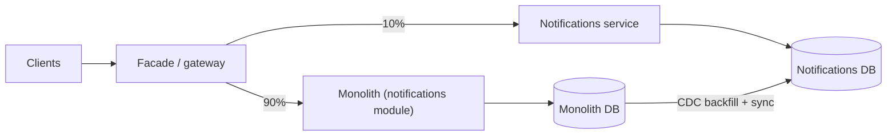

A team of eight engineers ships a monolith. It deploys twice a day, has one database, and handles 2,000 requests per second on four machines. Someone proposes splitting it into services "for scale". Eighteen months later there are 23 services, deploys need a coordination spreadsheet, a checkout request touches nine of them in sequence, p99 latency has tripled, and the on-call rotation has burned out two people. The system still handles 2,000 requests per second.

Nothing about that story is unusual. Microservices solve a specific problem, which is that too many people are changing one codebase and one database for it to be deployed safely and independently. They do not solve scale (a monolith scales horizontally just fine), and they introduce a set of costs that are paid on every request and every deploy. The senior position is to know exactly which problem you are solving, to default to a modular monolith until that problem arrives, and when you do split, to split along boundaries that hold.

## What the split is actually for

| Claimed reason | Does splitting help? |
|---|---|
| "We need to scale" | Rarely. Run more copies of the monolith. Splitting helps only when one component's scaling profile (CPU-heavy video encoding, memory-heavy search) differs so much that co-locating it wastes hardware |
| "Deploys are risky" | Yes, if the risk comes from unrelated teams' changes shipping together. No, if the risk comes from missing tests |
| "Teams block each other" | Yes. This is the real reason: independent deployability for independent teams |
| "We want to use Go for one part" | Sometimes; a real but small benefit |
| "Blast radius" | Yes, if a bug in recommendations should not take down checkout, and if you actually isolate them (separate processes, pools and databases) |
| "Resume" | No |

Netflix's move to services in the late 2000s was driven by the monolith being a single point of failure for a fast-growing engineering organisation, plus the need to run in the cloud with independent scaling and failure isolation. The result is on the order of a thousand services behind an edge gateway (Zuul), with service discovery (Eureka) and client-side load balancing. That scale of organisation is the context in which the pattern pays; [Netflix microservices and resilience](/learn/system-design/case-studies/netflix-microservices-and-resilience) looks at the machinery it required.

## The modular monolith as the default

A modular monolith is one deployable unit with strictly enforced internal boundaries: modules with public interfaces, no cross-module database access, dependency direction enforced by the build (Bazel visibility, Java modules, a lint rule). It gets you most of the design benefit of services (clear ownership, explicit contracts) with none of the runtime cost. In-process calls cost about a microsecond; a network call costs about a millisecond plus serialisation, a thousand times more. A single transaction can span modules. One deploy, one on-call, one set of dashboards.

The extraction test: if a module could be moved to its own process by changing only its call sites from in-process to RPC, it is well bounded. If extraction would require untangling shared tables, it is not, and it is not ready to be a service either.

## What a service boundary is

A service boundary is a **data ownership boundary**. A service owns its tables; nobody else reads or writes them. Other services get the data through the service's API or its published events. That single rule is what makes independent deployment possible: the service can change its schema without coordinating, because nobody else depends on the schema.

The boundaries that hold tend to follow bounded contexts from domain-driven design: the concepts that change together (an "order" in checkout, in fulfilment and in accounting are three different models with three lifecycles) and the teams that own them. Boundaries that do not hold are drawn around technical layers (a "database service", a "validation service") or around nouns shared by everyone (the "User service" that 40 services call synchronously, so that its 99.9% availability caps everyone at 99.9%).

Sizing heuristics: one team owns it end to end (two-pizza scale); it has a distinct change frequency or scaling profile; it can fail without taking the core product down; it has a small, stable API. If a proposed service fails all four, it is a module.

## The arithmetic of distribution

Every network hop costs availability and latency, and the costs compound.

**Availability in series.** Five services, each 99.9% available, called in sequence: 0.999^5 = 99.5%. That is 3.6 hours of downtime per month instead of 43 minutes. Ten services: 99.0%. The monolith had one availability number; the chain has the product.

**Latency in series.** A request that calls five services in sequence, each with a p50 of 5 ms and a p99 of 50 ms, has a p50 around 25 ms and a p99 that is not 50 ms: the probability of at least one of five independent calls hitting its own p99 is 1 - 0.99^5 ≈ 5%, so the chain's p95 is already at the single-service p99, and its p99 is worse.

**Fan-out.** A page that fans out to 20 services in parallel has p(at least one hits p99) = 1 - 0.99^20 ≈ 18%. Nearly one in five page loads waits for somebody's tail. Tail latency amplification is the reason large fan-out systems (search, feeds) use hedged requests, tight per-call timeouts and partial results.

**Cost per call.** In-process: ~1 microsecond. Same-host loopback with serialisation: ~100 microseconds. Cross-host in one AZ: ~0.5 to 1 ms plus serialisation of the payload (JSON at tens of MB/s per core, Protobuf faster). A request that used to make 50 in-process calls to a module now makes 50 RPCs: 50 ms of pure overhead, before any work.

```viz
{"type": "system", "scenario": "request-flow", "nodes": 5,
 "title": "One request across a service chain", "caption": "Each hop adds a network round trip, serialisation and a chance of hitting that service's tail. Five sequential hops turn 99.9% per service into 99.5% end to end."}
```

## The distributed monolith

The failure mode has a name because it is so common. A distributed monolith is a system with the runtime costs of microservices and none of the independence:

- **Synchronous chains.** Checkout calls order, which calls inventory, which calls pricing, which calls customer. Every request is a tour of the fleet; every service's outage is everyone's outage.
- **Shared database.** Services read each other's tables. A schema change requires coordinating every reader; the "independent" services deploy in lockstep.
- **Lockstep releases.** A feature needs changes in four services that must go out together, with a release manager and a rollback plan spanning all four.
- **Chatty APIs.** N+1 across the network: fetch 100 orders, then call the customer service 100 times. Each call is a millisecond; the page takes 100 ms doing what one join did in 2.

The tell in a design review is a sequence diagram with more than three synchronous hops for a user request, or an entity that appears in several services' schemas. The fix is at the boundary: events instead of synchronous calls where the caller does not need an answer now ([Event-driven architecture](/learn/system-design/building-blocks/event-driven-architecture)), data replicated into the consumer via events instead of read across, and batch endpoints instead of per-item calls ([API design](/learn/system-design/building-blocks/api-design-and-versioning)).

## Extracting a service: the strangler fig

Big-bang rewrites fail often enough that the safe approach has a name. The strangler fig routes traffic through a facade, moves one capability at a time behind it, and retires the old path when the new one has taken all the traffic.

```viz
{"type": "system", "scenario": "strangler-fig", "requests": 8,
 "title": "Migrating one capability at a time", "caption": "The facade routes a growing share of a capability's traffic to the new service while the monolith keeps serving the rest. Each step is reversible by flipping the route back."}
```

The order of operations for extracting, say, the notifications module:

1. **Define the interface** the rest of the monolith uses to call notifications; make all callers go through it (this is the modular-monolith step and it may take most of the effort).
2. **Stand up the service** implementing that interface, initially reading the monolith's tables (a temporary violation of ownership, explicitly time-boxed).
3. **Route traffic** through a facade or feature flag: 1%, then 10%, then 100%, comparing results in shadow mode where possible.
4. **Move data ownership.** Create the service's own tables; dual-write from the monolith and the service during the transition; backfill history; verify counts and checksums; cut reads over to the service's tables; stop the dual write; drop the monolith's copy. Every step has a rollback.
5. **Retire** the module in the monolith.

Step 4 is where the risk is. Dual writes have the dual-write problem from the event-driven lesson: use the outbox or CDC to replicate, not two application writes. [Migrations and evolution](/learn/system-design/senior-design-skills/migrations-and-evolution) works through the backfill and cutover in detail.



## Discovery, mesh and the platform you now need

Once there are services, each needs to find the others (service discovery: DNS, Eureka, Consul, Kubernetes services), to call them with timeouts, retries and circuit breakers ([Resilience patterns](/learn/system-design/building-blocks/resilience-patterns)), to authenticate to them (mTLS), and to be observed across hops (distributed tracing). Doing that in every service's code in every language is what led to the sidecar proxy and the service mesh: Envoy next to each service, handling discovery, mTLS, retries and telemetry uniformly, configured by a control plane (Istio, Linkerd).

```viz
{"type": "system", "scenario": "service-mesh", "nodes": 4,
 "title": "Sidecars handling the cross-cutting concerns", "caption": "Each service talks to its local proxy; the proxies do discovery, mTLS, retries and tracing. The cost is an extra hop per call, on the order of a millisecond, and a control plane to operate."}
```

The mesh is not free: an extra proxy hop per call (about 0.5 to 1 ms), memory per sidecar (tens to hundreds of MB), and a control plane that is itself a distributed system. It pays for itself at dozens of services in several languages; at five services in one language, a shared client library does the same job for less. [Service meshes and proxies](/learn/networking/networking-in-practice/service-meshes-and-proxies) covers the mechanics.

## A decision framework

| Signal | Stay monolithic | Split |
|---|---|---|
| Team size | Under ~15 engineers on the codebase | Multiple teams blocked on each other's deploys |
| Deploy frequency | Daily deploys work | Deploys batch changes from many teams and fail together |
| Scaling profile | Uniform | One component needs 10x the hardware or a different kind |
| Failure isolation | Acceptable that a bug anywhere affects everything | A non-core feature must not take down the core |
| Data | One schema with cross-entity transactions | Clear ownership; cross-entity consistency can be eventual |
| Platform | No mesh, no tracing, no per-service on-call | Those exist or the organisation will build them |

The honest summary for an interview: "I would start with a modular monolith, enforce the module boundaries in the build, and extract a service when a specific team or scaling or isolation problem appears, using the strangler pattern. I would not split to be ready for scale."

## Failure modes

**The distributed monolith.** Described above. Detect: lockstep deploys, shared tables, synchronous chains over three hops. Mitigate: move to events and data replication at the boundaries; enforce ownership.

**Chatty APIs.** N+1 over the network: 100 ms pages, tens of thousands of internal calls per second for modest traffic. Detect: internal request rate vs external; traces with hundreds of spans. Mitigate: batch endpoints, data replicated into the consumer, GraphQL-style aggregation at the edge.

**Retry amplification through the chain.** Each hop retries three times; a slow database at the bottom sees 27x load. Detect: request rate at the bottom far exceeding the top during an incident. Mitigate: retry at one layer, budgets, deadline propagation.

**Version skew.** Service A deploys a change assuming B's new field; B's deploy is delayed; A fails. Detect: errors correlated with one service's deploy. Mitigate: backward-compatible contracts, consumers deploy before producers remove, contract tests in CI.

**Entity services.** The "User service" every request touches synchronously; its 99.9% caps the product. Detect: one service in every trace. Mitigate: replicate the user data consumers need via events; cache aggressively; make the call optional with a degraded path.

**Ownership drift.** After two years, three services write the orders table "just this once". Detect: database grants and query logs by application user. Mitigate: one database role per service, with no grants to others' tables, enforced.

## Interviewer follow-ups

**Q: "Would you build this as microservices?"**

Not at the start. The requirements describe one product team and a few thousand requests per second; a modular monolith with enforced module boundaries and one database handles that with one deploy pipeline and one on-call. I would draw the module boundaries as if they were services (orders, catalogue, payments, notifications), with each module owning its tables, so that extraction later is a routing change and a data migration rather than a rewrite. I would extract the first service when a concrete trigger appears: a team blocked on another's deploys, a component with a different scaling profile such as media processing, or a need to isolate a risky feature's failures.

**Q: "You have a checkout request calling six services in sequence. What is its availability and what do you do about it?"**

If each is 99.9%, the chain is 0.999^6 ≈ 99.4%, about 4.3 hours of downtime a month. I would first ask which of those calls need to be synchronous. Inventory reservation and payment do; sending the receipt and updating analytics do not, so they become events. That leaves three hops at 99.7%. Then I make the remaining calls resilient: timeouts from p99, one layer of retries, circuit breakers with a degraded path (checkout can proceed with default shipping options if the shipping-rate service is down), which raises the effective availability of checkout above the product of its dependencies.

**Q: "How do you split the database when you extract a service?"**

Ownership first: identify the tables the new service owns and every other reader and writer of them. Give the service its own database, replicate from the monolith via CDC while the service runs in shadow, backfill history with checksums, cut reads to the service, then cut writes with a short dual-write window driven by the outbox rather than two application writes. Foreign keys across the boundary become IDs plus eventual consistency, and I list the queries that used to join across them and decide for each whether the consumer keeps a replicated copy or calls an API. Every step has a rollback, and I do not delete the monolith's copy until the service has run alone for a full business cycle.

**Q: "What do you lose when you go from in-process calls to RPC?"**

Three things with numbers. Latency: a microsecond becomes a millisecond, so a code path with 50 module calls goes from unnoticeable to 50 ms. Transactions: an atomic update across two modules becomes a saga or an eventually consistent pair of writes. Simplicity of failure: an in-process call fails by exception; an RPC can time out with unknown outcome, so every call needs an idempotency story. The compensation is independent deployability and failure isolation, which is worth those costs only when the organisation needs them.

**Q: "Do you need a service mesh?"**

At five services in one language, no: a shared client library with timeouts, retries, circuit breaking and tracing is cheaper than running a control plane and paying a millisecond per hop. At fifty services in three languages, the library gets reimplemented and drifts, and the mesh's uniformity wins. I would also count the platform I need regardless of mesh: service discovery, distributed tracing, per-service dashboards and alerts, and a deploy pipeline per service. If the organisation cannot fund that platform, it cannot fund microservices.

## Senior signals

- You say that microservices solve **organisational** scaling, not traffic scaling, and you can name the specific trigger that would make you split.
- You define a boundary as **data ownership** and you enforce it with database roles, not documentation.
- You do the **availability and latency arithmetic** of a call chain unprompted, and you convert synchronous hops to events where the caller does not need an answer.
- You recognise the **distributed monolith** from its symptoms and you know which boundary decision caused each.
- You extract with the **strangler fig** and migrate data with CDC and checksums, never a big-bang rewrite.
- You price the **platform** (discovery, mesh, tracing, per-service on-call) as part of the decision.

## Check yourself

```quiz
- q: >-
    A user request calls five services in sequence, each with 99.9% availability. The request's availability is approximately:
  options: ["99.9%", "99.5%", "95%", "99.98%"]
  answer: 1
  explanation: >-
    Availabilities in series multiply: 0.999^5 ≈ 0.995. That is about 3.6 hours of downtime per month versus 43 minutes for one service. This is the core cost of synchronous chains.
- q: >-
    Which of these is the strongest signal that a system is a distributed monolith?
  options: ["It uses gRPC instead of REST", "Several services read and write the same database tables", "It has more than ten services", "It runs on Kubernetes"]
  answer: 1
  explanation: >-
    A shared database means schema changes require coordinating every service, which removes independent deployability, the one benefit that justified the split. Protocol, count and platform are neutral.
- q: >-
    A page fans out to 20 services in parallel, each with p99 of 50 ms and p50 of 5 ms. Roughly what fraction of page loads wait at least 50 ms?
  options: ["1%", "5%", "18%", "50%"]
  answer: 2
  explanation: >-
    The probability that none of 20 independent calls hits its p99 is 0.99^20 ≈ 0.82, so about 18% of pages see at least one tail. This is tail latency amplification, the reason for hedged requests and partial results in fan-out systems.
- q: >-
    The safest way to move the notifications module out of a monolith is:
  options: ["Rewrite it as a service and switch all traffic on release day", "Put a facade in front, route a growing share of traffic to the new service, migrate data ownership with CDC and checksums, then retire the module", "Copy the monolith and delete everything except notifications", "Have the new service read the monolith's tables permanently"]
  answer: 1
  explanation: >-
    The strangler fig makes each step reversible and observable. A big-bang switch has no rollback granularity; forking the monolith duplicates everything; permanently sharing tables recreates the distributed monolith.
- q: >-
    An in-process module call costs about 1 microsecond; a same-AZ RPC about 1 ms. A code path making 50 such calls per request moves from monolith to services. The added latency per request is roughly:
  options: ["50 microseconds", "5 ms", "50 ms", "500 ms"]
  answer: 2
  explanation: >-
    50 calls x (1 ms - 1 microsecond) ≈ 50 ms of pure overhead, before serialisation of larger payloads. This is why chatty interfaces must become batch calls or replicated data when a boundary becomes a network.
```
