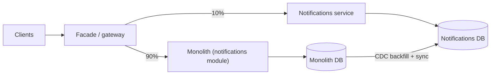

A team of eight engineers ships a monolith. It deploys twice a day, has one database, and handles 2,000 requests per second on four machines. Someone proposes splitting it into services "for scale". Eighteen months later there are 23 services, deploys need a coordination spreadsheet, a checkout request touches nine of them in sequence, p99 latency has tripled, and the on-call rotation has burned out two people. The system still handles 2,000 requests per second.

Nothing about that story is unusual. Microservices solve a specific problem: too many people changing one codebase and one database for it to be deployed safely and independently. They do not solve traffic scale (a stateless monolith scales horizontally), and they add costs paid on every request and every deploy. The senior position is to know which problem you are solving, default to a modular monolith until it arrives, and when you split, split along boundaries that hold. This lesson puts numbers on each of those costs.

## What the split is actually for

| Claimed reason | Does splitting help? |
|---|---|
| "We need to scale" | Rarely. Run more copies of the monolith. Splitting helps when one component's scaling profile (CPU-heavy encoding, memory-heavy search) differs enough that co-locating it wastes hardware |
| "Deploys are risky" | Yes, if the risk is unrelated teams' changes shipping together. No, if it is missing tests |
| "Teams block each other" | Yes. This is the real reason: independent deployability for independent teams |
| "We want Go for one part" | Sometimes; a real but small benefit |
| "Blast radius" | Yes, if a bug in recommendations must not take down checkout, and only if isolation is real: separate processes, pools and databases |

Netflix's move to services started with an outage: in August 2008 a database corruption stopped it shipping DVDs for three days, and it decided to move away from vertically scaled single points of failure in its own data centres. By the time it [completed its cloud migration](https://about.netflix.com/en/news/completing-the-netflix-cloud-migration) in 2016 it described the result as a move "from a monolithic app to hundreds of micro-services", reached through an edge gateway (Zuul) and finding each other through a discovery service (Eureka), both of which it open-sourced. The same pattern has run in reverse: Amazon's Prime Video team wrote in March 2023 about moving a stream-monitoring service, whose components were orchestrated by AWS Step Functions and passed video frames to each other through S3, into a single process on EC2 and ECS. Step Functions charged per state transition and the service made several per second of every stream; the team reported that the move "reduced our infrastructure cost by over 90%". Distribution is a cost you pay for organisational independence; [Netflix microservices and resilience](/learn/system-design/case-studies/netflix-microservices-and-resilience) shows the machinery it requires.

## The modular monolith as the default

A modular monolith is one deployable unit with enforced internal boundaries: modules with public interfaces, no module touching another's tables, dependency direction checked by the build. It gives most of the design benefit of services (ownership, explicit contracts) with none of the runtime cost: calls are function calls, one transaction can span modules, and there is one deploy, one on-call and one set of dashboards.

"Enforced" means a failing build, not a wiki page. Real codebases use Bazel visibility, Java modules or ArchUnit, import-linter in Python, or Packwerk, the tool Shopify open-sourced for its Rails monolith. The mechanism is small enough to write:

```python
import ast, pathlib

# Which other modules' public APIs each module may import.
ALLOWED = {"orders": {"payments.api", "catalogue.api"}, "payments": set(), "catalogue": set()}

def boundary_violations(root):
    root = pathlib.Path(root)
    for path in root.rglob("*.py"):
        owner = path.relative_to(root).parts[0]              # orders/..., payments/...
        for node in ast.walk(ast.parse(path.read_text())):
            if isinstance(node, ast.ImportFrom) and node.module:
                target = node.module.split(".")[0]
                if target in ALLOWED and target != owner and node.module not in ALLOWED[owner]:
                    yield f"{path}:{node.lineno} {owner} imports {node.module}"

if __name__ == "__main__":
    problems = list(boundary_violations("src"))
    print("\n".join(problems) or "boundaries clean")
    raise SystemExit(1 if problems else 0)                   # fail CI on any violation
```

`orders` may call `payments.api` but not `payments.models` or `payments.db`, so payments can change its internals without a coordinated change. The extraction test follows: if a module could move to its own process by changing only its call sites from in-process to RPC, it is well bounded. If extraction would require untangling shared tables, it is not ready to be a service.

## What a service boundary is

A service boundary is a **data ownership boundary**. A service owns its tables; nobody else reads or writes them; others get the data through its API or its published events. That rule is what makes independent deployment possible: the service can change its schema because nobody depends on it. Enforce it where it cannot be bypassed, in the database:

```sql
CREATE ROLE orders_svc LOGIN;
REVOKE ALL ON orders, order_lines FROM PUBLIC;
GRANT SELECT, INSERT, UPDATE, DELETE ON orders, order_lines TO orders_svc;
-- billing_svc gets no grant here: it keeps its own copy from OrderPlaced events
```

Boundaries that hold follow bounded contexts from domain-driven design: concepts that change together, owned by one team. An "order" in checkout, in fulfilment and in accounting is three models with three lifecycles. Boundaries that fail are drawn around technical layers (a "validation service") or around nouns everyone needs synchronously: a "User service" called by 40 services at 99.9% availability caps each of them at 99.9% for every request that needs it.

Sizing heuristics: one team owns it end to end; it has a distinct change frequency or scaling profile; it can fail without taking the core product down; its API is small and stable. A proposed service that fails all four is a module.

Worked on an e-commerce monolith, boundaries come out of a table of writers and readers, not a list of nouns:

| Table | Written by | Read by | Owner | How the others get it |
|---|---|---|---|---|
| `orders`, `order_lines` | Checkout | Fulfilment, billing, support UI | Orders | `OrderPlaced` and `OrderShipped` events; support reads through the Orders API |
| `inventory_levels` | Fulfilment **and** checkout | Catalogue (in-stock badge) | Inventory | Checkout calls a `Reserve` API because it needs the answer now; catalogue keeps a boolean from `StockChanged` events |
| `products`, `prices` | Catalogue admin | Checkout, search | Catalogue | Checkout copies the price into the order at purchase, deliberately; search consumes `ProductChanged` |
| `customers` | Accounts | Nearly everyone | Accounts | Events carry the few fields each consumer needs; no synchronous "get customer" on a hot path |

Two writers on `inventory_levels` is the finding: a table needs one owner, so the second writer becomes a caller of the owner's API. Every query that joined across a new boundary then gets its own decision. The support UI's "orders from the last 30 days with customer names" either reads a customer name that Orders keeps from `CustomerChanged` events, or composes two API calls; a nightly report can read the warehouse instead. Writing those decisions down is most of the design work of a split.

## Under the hood: the cost of a network hop, measured

Moving a call across a process boundary adds serialisation, system calls and a network round trip. Measured on one machine (Python 3.14 on WSL2; client and server in the same process, so thread hand-offs are included), with a 723-byte JSON order:

| Call | p50 | Relative to in-process |
|---|---|---|
| In-process function computing the order total | 0.37 µs | 1× |
| `json.dumps` + `json.loads` of the payload, once each way | 9.3 µs | 25× |
| Raw TCP echo of the payload over loopback, persistent connection | 174 µs | 470× |
| HTTP/1.1 keep-alive POST with JSON both ways, loopback | 372 µs (p99 496 µs) | 1,000× |
| The same HTTP call with Nagle left on at the server | 44 ms | 120,000× |

The loopback numbers are generous: a real hop adds the wire. A same-zone round trip in a cloud is on the order of 100–500 µs depending on provider and instance type; a cross-zone one is typically around a millisecond, and AWS itself promises only ["single-digit millisecond"](https://docs.aws.amazon.com/whitepapers/latest/aws-fault-isolation-boundaries/availability-zones.html) latency between zones that can be up to 100 km apart. TLS adds a handshake on each new connection. A compiled service does its own share of the work in tens of microseconds rather than hundreds, but the wire is the same for every language. The rule of thumb survives: **a microsecond becomes a millisecond**. A request that made 50 calls into a module now makes 50 RPCs, 20 to 50 ms of overhead before any work, unless the interface becomes a batch call.

The last row is a real trap. `http.server` writes headers and body in two `send()` calls; with Nagle's algorithm on, the second small write waits for the ACK of the first, and the client's kernel delays that ACK: on Linux the minimum delayed-ACK timeout is 40 ms (`TCP_DELACK_MIN` is `HZ/25` in `include/net/tcp.h`), and the timer can stretch to 200 ms. Most runtimes now set `TCP_NODELAY` on server sockets (Go's `net` package does by default, and Node's HTTP server has since Node 18); a stack that does not turns every internal call into 40 ms.

## The arithmetic of distribution

**Availability in series.** Five services, each 99.9% available, called in sequence: $0.999^5 = 99.5\%$, 3.6 hours of downtime a month instead of 43 minutes. Ten: 99.0%.

**Latency in series and fan-out.** Simulated with 200,000 requests (seed 7), each call lognormal with a p50 of 5 ms and a p99 of 50 ms:

| Shape | p50 | p95 | p99 | Share of requests ≥ 50 ms |
|---|---|---|---|---|
| One call | 5.0 ms | 25.6 ms | 49.9 ms | 1% |
| Five calls in sequence | 35.3 ms | 83.6 ms | 124.4 ms | 25% |
| Twenty calls in parallel (wait for all) | 30.4 ms | 80.2 ms | 131.3 ms | 18% |

Two surprises. The sequential p50 is 35 ms, not 5 × 5 = 25 ms: latency is skewed, so each call's mean (8.2 ms) exceeds its median and the sum inherits the means. And a quarter of five-hop requests take longer than any single service's p99. The fan-out figure matches $1 - 0.99^{20} = 18\%$; it is why search and feed systems use hedged requests, tight per-call timeouts and partial results.

```viz
{"type": "system", "scenario": "request-flow", "nodes": 5, "variant": "chain",
 "title": "One request across a service chain",
 "caption": "Each hop adds a network round trip, serialisation and a chance of hitting that service's tail. Five sequential hops turn 99.9% per service into 99.5% end to end."}
```

## The distributed monolith, traced

A distributed monolith has the runtime costs of microservices and none of the independence. Its most expensive symptom is the cascade. A gateway with a shared pool of 300 threads serves browse (800 req/s at 25 ms: 20 threads busy by Little's law) and checkout (200 req/s). Checkout has 100 threads and calls pricing synchronously with a 5-second timeout. Pricing's database slows and its latency goes from 20 ms to 2 s:

| t | Event | Checkout threads busy | Gateway threads busy | Browse |
|---|---|---|---|---|
| 0 s | Pricing latency rises to 2 s | 4, then +200 per second | ~25 | Healthy |
| 0.5 s | Checkout pool full: 200 req/s × 2 s would need 400 | 100 | Rising by 200/s as requests wait on checkout | Healthy |
| 1.9 s | Gateway pool full of requests waiting on checkout | 100 | 300 | Requests find no thread: errors |
| 2 s on | Pricing answers at 100 threads / 2 s = 50/s against 200/s arriving | 100 | 300 | Down |
| 5 s | First timeouts; callers retry three times | 100 | 300 | Down, now with 3× checkout load |

Browse never called pricing, and it went down 1.9 seconds after pricing slowed. Three decisions caused it, each with its fix in [Resilience patterns](/learn/system-design/building-blocks/resilience-patterns): a timeout far above the dependency's p99 (a 100 ms timeout caps checkout's pricing concurrency at 200 × 0.1 = 20 threads), one shared gateway pool instead of a bulkhead per route, and retries at every layer.

The other symptoms, and the boundary decision behind each:

- **Shared database.** Services read each other's tables, so a schema change needs every reader to deploy in step.
- **Lockstep releases.** A feature needs four services to ship together, with a release manager and a four-way rollback plan.
- **Chatty APIs.** Fetch 100 orders, then call the customer service 100 times: 100 ms of round trips for what one join did in 2 ms.

The tell in a design review is more than three synchronous hops on a user request, or one entity in several services' schemas. The fixes are at the boundary: events where the caller does not need an answer now ([Event-driven architecture](/learn/system-design/building-blocks/event-driven-architecture)), data replicated into the consumer instead of read across, and batch endpoints instead of per-item calls ([API design](/learn/system-design/building-blocks/api-design-and-versioning)).

## Extracting a service: the strangler fig

Big-bang rewrites fail often enough that the safe approach has a name. The strangler fig routes traffic through a facade, moves one capability at a time behind it, and retires the old path when the new one has all the traffic.

```viz
{"type": "system", "scenario": "strangler-fig", "requests": 8,
 "title": "Migrating one capability at a time", "caption": "The facade routes a growing share of a capability's traffic to the new service while the monolith keeps serving the rest. Each step is reversible by flipping the route back."}
```

Extracting the notifications module:

1. **Define the interface** every caller in the monolith uses, and route all calls through it. This is the modular-monolith step and often most of the effort.
2. **Stand up the service** behind that interface, temporarily reading the monolith's tables, with a date by which that stops.
3. **Route traffic** through a facade or flag: 1%, 10%, 100%, comparing results in shadow mode where possible.
4. **Move data ownership.** Create the service's own tables, replicate with CDC or the outbox (never two application writes), backfill history, verify counts and checksums, cut reads, then writes, then drop the monolith's copy. Each step has a rollback.
5. **Retire** the module.

Step 4 carries the risk; [Migrations and evolution](/learn/system-design/senior-design-skills/migrations-and-evolution) traces the dual-write race and the backfill.



## Discovery, mesh and the platform you now need

Services must find each other (DNS, Eureka, Consul, Kubernetes services), call each other with timeouts, retries and circuit breakers, authenticate each other (mTLS), and be observed across hops (distributed tracing). Doing that in every service in every language led to the sidecar proxy and the service mesh: Envoy beside each service, configured by a control plane (Istio, Linkerd).

```viz
{"type": "system", "scenario": "service-mesh", "nodes": 4,
 "title": "Sidecars handling the cross-cutting concerns", "caption": "Each service talks to its local proxy; the proxies do discovery, mTLS, retries and tracing. The cost is an extra hop per call, on the order of a millisecond, and a control plane to operate."}
```

A mesh costs two extra proxy traversals per call (together on the order of a millisecond or less, depending on load, payload and features such as telemetry), memory per sidecar (Istio's [published benchmark](https://istio.io/latest/docs/ops/deployment/performance-and-scalability/) for version 1.24 measured about 0.20 vCPU and 60 MB per sidecar at 1,000 requests per second, and memory grows with the routes and clusters each proxy is told about), and a control plane that is itself a distributed system. It pays at dozens of services in several languages; at five services in one language a shared client library does the same job. [Service meshes and proxies](/learn/networking/networking-in-practice/service-meshes-and-proxies) covers the mechanics.

## A decision framework

| Signal | Stay monolithic | Split |
|---|---|---|
| Team size | Under ~15 engineers on the codebase | Several teams blocked on each other's deploys |
| Deploys | Daily deploys work | Deploys batch many teams' changes and fail together |
| Scaling profile | Uniform | One component needs 10× the hardware, or a different kind |
| Failure isolation | A bug anywhere affecting everything is acceptable | A non-core feature must not take down the core |
| Data | One schema with cross-entity transactions | Clear ownership; cross-entity consistency can be eventual |
| Platform | No tracing, no per-service on-call | Discovery, tracing, per-service pipelines exist or will be funded |

The interview summary: "I would start with a modular monolith with boundaries enforced in the build, and extract a service with the strangler fig when a specific team, scaling or isolation problem appears. I would not split to be ready for scale."

## Failure modes

| Failure | Symptom | Diagnosis | Fix |
|---|---|---|---|
| Cascade through a synchronous chain | Unrelated endpoints fail seconds after one dependency slows | Thread or connection pools saturated upstream; Little's law says the pool needs rate × latency | Timeouts from p99, bulkheads per dependency, circuit breakers, events for non-urgent calls |
| Chatty APIs | 100 ms pages; internal request rate tens of times external | Traces with hundreds of spans, one per item | Batch endpoints; replicate the data into the consumer |
| Retry amplification | The bottom tier sees many times user traffic during an incident | Attempt counts per hop; retries configured at every layer | Retry at one layer with a budget; propagate deadlines |
| Version skew | Errors correlated with one service's deploy | A consumer assumes a field the producer has not shipped, or removed | Backward-compatible contracts; contract tests in CI; consumers deploy first |
| Entity service bottleneck | One service in every trace; its outage is everyone's | Synchronous "get user" on every request path | Replicate needed fields via events; cache; make the call optional |
| Ownership drift | A schema change in one service breaks three others | Query logs show other services' roles on its tables | One role per service; no grants on others' tables |
| 40 ms internal calls | Every call to one service takes about 40 ms regardless of payload | Packet capture shows the response body waiting for a delayed ACK | `TCP_NODELAY`, or one write per response |

## Interviewer follow-ups

**"Would you build this as microservices?"** Model answer: not at the start. One product team at a few thousand requests per second fits a modular monolith with enforced boundaries, each module owning its tables, so extraction later is a routing change and a data migration, not a rewrite. I would extract on a concrete trigger: a blocked team, a different scaling profile such as media processing, or a feature whose failures must be isolated. Common wrong answer: "yes, so each part can scale independently", when stateless copies of the monolith already scale.

**"Checkout calls six services in sequence. What is its availability, and what do you do?"** Model answer: $0.999^6 \approx 99.4\%$, about 4.3 hours a month, and a quarter of requests slower than any one service's p99. I ask which calls need an answer now: inventory and payment do; receipts and analytics become events. The remaining calls get timeouts from p99, one layer of retries and breakers with a degraded path (default shipping options if the rate service is down), which lifts checkout above the product of its dependencies. Common wrong answer: "make each service 99.99%", which is the most expensive way to fix a structural problem.

**"How do you split the database when you extract a service?"** Model answer: list the tables it will own and every other reader and writer; replicate them to the service's database with CDC while it runs in shadow; backfill with per-chunk checksums; cut reads, then writes; keep the old copy until the service has run alone for a business cycle. Queries that joined across the boundary each get a decision: a replicated copy in the consumer or an API call. Common wrong answer: "both services write to both databases during the transition", which is the dual-write race.

**"What do you lose going from in-process calls to RPC?"** Model answer: latency (0.4 µs to hundreds of microseconds on loopback and around a millisecond across a zone, so 50 calls cost tens of milliseconds); atomicity (a cross-module transaction becomes a saga); and simple failure (an RPC can time out with an unknown outcome, so every call needs an idempotency story). Common wrong answer: "only some latency", which misses the transaction and failure semantics.

**"Do you need a service mesh?"** Model answer: at five services in one language, no: a shared client library with timeouts, retries, breakers and tracing is cheaper than a control plane. At fifty services in three languages the libraries drift and the mesh's uniformity wins. Either way I count the platform: discovery, tracing, per-service dashboards and pipelines. Common wrong answer: "yes, it is how microservices communicate", which treats an operational tool as a requirement.

## What mid-level engineers get wrong

- **Splitting "for scale".** A stateless monolith scales horizontally; the split adds a millisecond per hop and a quarter of requests past the p99, and traffic was never the constraint.
- **Drawing services around nouns.** A User or Product service called synchronously by everyone becomes everyone's availability ceiling.
- **Sharing the database "temporarily".** Without revoked grants, temporary becomes permanent and every schema change is a coordinated release.
- **Keeping in-process call patterns across the network.** Loops of single-item RPCs turn a 2 ms join into a 100 ms page.
- **One shared thread pool for every route.** One slow dependency exhausts it and takes down endpoints that never call that dependency.
- **Adding the mesh before the platform.** A mesh without tracing and per-service on-call is complexity without visibility.

## Exercise: find the services that must deploy together

```exercise
id: deploy-coupling
title: Find ownership violations and lockstep groups from table access
prompt: |
  `access` lists which service touches which table: `[service, table, mode]`
  with `mode` either `"r"` or `"w"`. Two services that touch the same table
  (in any mode) are coupled: a schema change to that table needs both to
  deploy together. Coupling is transitive through chains of shared tables.

  Return:
  - `multi_writer`: tables written by two or more different services,
    sorted.
  - `lockstep_groups`: every group of two or more services connected by
    shared tables, each group sorted, and the list of groups sorted.

  A service touching a table twice, or alone, couples it to nothing.
languages: [python, javascript]
entry: coupling
starter:
  python: |
    def coupling(access):
        multi_writer, lockstep_groups = [], []
        # your code here
        return {"multi_writer": multi_writer, "lockstep_groups": lockstep_groups}
  javascript: |
    function coupling(access) {
      const multi_writer = [], lockstep_groups = [];
      // your code here
      return { multi_writer, lockstep_groups };
    }
tests:
  - args: [[["orders", "orders_t", "w"], ["billing", "invoices", "w"]]]
    expected: {"multi_writer": [], "lockstep_groups": []}
    label: clean ownership
  - args: [[["orders", "orders_t", "w"], ["billing", "orders_t", "r"], ["billing", "invoices", "w"]]]
    expected: {"multi_writer": [], "lockstep_groups": [["billing", "orders"]]}
    label: a reader is coupled to the owner's schema
  - args: [[["A", "t1", "w"], ["B", "t1", "r"], ["B", "t2", "w"], ["C", "t2", "r"], ["D", "t3", "w"]]]
    expected: {"multi_writer": [], "lockstep_groups": [["A", "B", "C"]]}
    label: coupling is transitive
  - args: [[["A", "t1", "w"], ["B", "t1", "w"]]]
    expected: {"multi_writer": ["t1"], "lockstep_groups": [["A", "B"]]}
  - args: [[]]
    expected: {"multi_writer": [], "lockstep_groups": []}
    label: no access at all
  - args: [[["A", "t1", "r"], ["A", "t1", "w"]]]
    expected: {"multi_writer": [], "lockstep_groups": []}
    hidden: true
  - args: [[["x", "t9", "w"], ["y", "t9", "r"], ["b", "t1", "w"], ["a", "t1", "w"], ["a", "t1", "w"]]]
    expected: {"multi_writer": ["t1"], "lockstep_groups": [["a", "b"], ["x", "y"]]}
    hidden: true
hints:
  - "Group services by table first; every table touched by several services links them."
  - "Union-find (or a BFS over a service graph) turns those links into connected groups."
  - "Count writers per table with a set, so one service writing twice is still one writer."
```

## Senior signals

- You say microservices solve **organisational** scaling, not traffic scaling, and name the trigger that would make you split.
- You default to a **modular monolith** and can say how its boundaries are enforced: a failing build and revoked database grants.
- You define a boundary as **data ownership** and draw it around bounded contexts, not layers or shared nouns.
- You quantify a hop (**a microsecond becomes a millisecond**), multiply availabilities, and know a five-hop chain puts a quarter of requests past each service's p99.
- You recognise the **distributed monolith** from its symptoms and can trace the cascade to the pool, timeout and retry decisions behind it.
- You extract with the **strangler fig**, migrate data with CDC and checksums, and price the **platform** as part of the decision.

## Check yourself

```quiz
- q: >-
    A user request calls five services in sequence, each with 99.9% availability. The request's availability is approximately:
  options: ["99.9%", "99.98%", "95%", "99.5%"]
  answer: 3
  explanation: >-
    Availabilities in series multiply: 0.999^5 ≈ 0.995. That is about 3.6 hours of downtime per month versus 43 minutes for one service. This is the core cost of synchronous chains.
- q: >-
    Which of these is the strongest signal that a system is a distributed monolith?
  options: ["It runs every service on one shared Kubernetes cluster", "It has grown to more than ten separately deployed services", "Several services read and write the same tables", "Its services call each other over gRPC instead of REST"]
  answer: 2
  explanation: >-
    A shared database means schema changes require coordinating every service, which removes independent deployability, the one benefit that justified the split. Protocol, count and platform are neutral; ten services that deploy independently are not a monolith.
- q: >-
    Each service call has a p50 of 5 ms and a p99 of 50 ms, with a skewed distribution. Five are made in sequence. In the lesson's simulation, what was the chain's p50?
  options: ["About 250 ms, since every call lands in its tail", "Exactly 25 ms, because the medians of sequential calls add up", "About 5 ms, since sequential calls overlap in time", "About 35 ms, since skew makes each mean exceed its median"]
  answer: 3
  explanation: >-
    Medians do not add for skewed distributions: each call's mean is about 8.2 ms, and the sum of five behaves like the sum of means, so the simulated p50 was 35.3 ms and a quarter of requests exceeded 50 ms. Sequential calls do not overlap, and most calls are not in their tail.
- q: >-
    Pricing slows from 20 ms to 2 s. Checkout (200 req/s, 100 threads) calls it synchronously, and a shared gateway pool also serves browse. Why does browse fail within about two seconds?
  options: ["Gateway threads fill up waiting on a saturated checkout", "Browse calls pricing indirectly through a shared cache layer", "Pricing's slow database also serves every browse request", "The load balancer marks the whole gateway unhealthy at once"]
  answer: 0
  explanation: >-
    By Little's law checkout would need 200 × 2 = 400 threads, so its 100 fill in half a second; requests then wait in the gateway's shared pool, which fills too, leaving no thread for browse. A bulkhead per route and a timeout near pricing's p99 would have contained it.
- q: >-
    The safest way to move the notifications module out of a monolith is:
  options: ["Rewrite it as a service and switch all of the traffic on release day", "Have the new service keep reading the monolith's tables for good", "Move traffic over gradually behind a facade, then retire the module", "Fork the monolith and delete everything except notifications"]
  answer: 2
  explanation: >-
    The strangler fig puts a facade in front, routes a growing share of traffic to the new service, migrates data ownership with CDC and checksums, and only then retires the module, so each step is reversible and observable. A big-bang switch has no rollback granularity; forking the monolith duplicates everything; permanently sharing tables recreates the distributed monolith.
- q: >-
    Every call to one internal service takes about 40 ms, whatever the payload size, while the service's own handler time is under 1 ms. What is the likely cause?
  options: ["Nagle's algorithm holding a second write until a delayed ACK", "Cross-zone routing that adds a fixed 40 ms to each hop", "TLS renegotiation on every request over a kept-alive connection", "Serialising JSON payloads on a slow single-threaded server"]
  answer: 0
  explanation: >-
    A response written in two small sends, with Nagle on, waits for the ACK of the first; the client's kernel delays that ACK, by at least 40 ms on Linux. The lesson measured 44 ms per call on loopback. TCP_NODELAY or a single write fixes it. Serialisation scales with payload size, and cross-zone latency is on the order of a millisecond.
```
