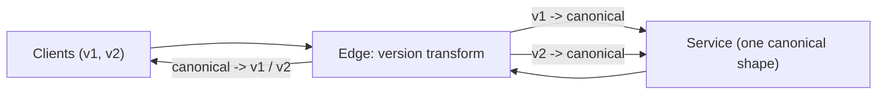

Your public API has 3,000 integrations. A field is misnamed, a list endpoint uses offset pagination that falls over past page 10,000, and errors are free-text strings that customers have started parsing with regular expressions. You cannot fix any of it, because every change breaks someone, and the someones do not upgrade. This is what an API is: a contract whose other party you do not control and cannot schedule.

The design work is therefore front-loaded. Get the resource model, the error shape, the pagination, the retry contract and the compatibility rules right before the first client ships, and evolution is additive for years. Get them wrong and every improvement is a migration. This lesson is the checklist a senior engineer runs on a new API, with the measurements that justify each item.

## Resources, methods and the choice of style

Model the API as nouns with a lifecycle: `GET /orders/{id}`, `POST /orders`, `PATCH /orders/{id}`, and `POST /orders/{id}/cancel` for the one transition that is not a plain update. Choose conventions once: plural nouns, one case style, ISO 8601 timestamps in UTC, money as integer minor units with a currency code, IDs as opaque prefixed strings (`ord_9f2`). Each removes a category of client bugs.

| Style | Best for | Cost |
|---|---|---|
| REST over HTTP/JSON | Public APIs, browser clients, CRUD with caching | Over- and under-fetching; verbs squeezed into nouns |
| gRPC with Protobuf | Service-to-service, streaming, deadlines, typed contracts | Browsers need a proxy; binary payloads are opaque in logs |
| GraphQL | Clients with varied data needs, aggregation across services | HTTP caching is harder; server N+1 needs dataloaders; query cost limits required |

The choice is per audience: gRPC inside, REST at the public edge, GraphQL at the product edge if client teams want it. [API styles](/learn/networking/application-protocols/api-styles) and [gRPC and Protobuf](/learn/networking/application-protocols/grpc-and-protobuf) cover the wire; this lesson is the contract, whatever the style.

## Idempotency in the contract

`GET`, `PUT` and `DELETE` are idempotent by specification; `POST` is not. Any `POST` a client might retry needs a documented `Idempotency-Key` header with the semantics from [Idempotency and retries](/learn/system-design/building-blocks/idempotency-and-retries). Traced for one key:

| Attempt | Key | Body | Server's record for the key | Response |
|---|---|---|---|---|
| 1 | `k1` | Cart A | None → in progress → done (201, `ord_1`) | Lost: the client's read timed out |
| 2, concurrent with 1 | `k1` | Cart A | In progress | 409: retry shortly |
| 3, the client's retry | `k1` | Cart A | Done | Replays 201 `ord_1`, byte for byte |
| 4, a client bug | `k1` | Cart B | Done, body hash differs | 422: key reused with a different body |

The server stores the key, a hash of the body and the response, and keeps them for a documented window (Stripe documents that keys may be pruned after 24 hours), which bounds how long a client may retry. Put it in the contract on day one; adding it later leaves every existing client unsafe to retry.

```viz
{"type": "system", "scenario": "idempotency-key", "requests": 3,
 "title": "POST with an Idempotency-Key", "caption": "The contract promises that a retried POST with the same key is a replay, not a new resource. That promise is what makes client-side retries safe, and it must be in the API before the first client ships."}
```

## Errors as a contract

An error response is read by code more often than by people. RFC 9457 (Problem Details for HTTP APIs, 2023, replacing RFC 7807) gives a standard envelope, `application/problem+json` with `type`, `title`, `status`, `detail` and `instance`, and allows extension members for the fields clients need:

```json
{
  "type": "https://api.example.com/errors/insufficient-funds",
  "title": "Insufficient funds",
  "status": 402,
  "detail": "Account balance is 12.50; 30.00 required.",
  "instance": "/payments/req_8f3a2c",
  "code": "insufficient_funds",
  "retryable": false,
  "request_id": "req_8f3a2c",
  "balance": 1250,
  "required": 3000
}
```

The HTTP status carries the class (400 malformed, 401 unauthenticated, 403 forbidden, 404, 409 conflict, 422 semantically invalid, 429 rate limited, 500, 503 with `Retry-After`). The `code` (or `type` URI) is a documented enum that never changes meaning. `detail` is for humans and may change at any time, and the docs say so. `retryable` tells a client what to do without a lookup table, which prevents both the client that retries validation errors forever and the one that gives up on a transient 503. `request_id` is the join key to your logs and traces.

## Conditional requests: ETags against lost updates

Two support agents open order `ord_9f2` and each changes something. Without a precondition the second `PATCH` silently overwrites the first, the lost update from [Isolation levels and anomalies](/learn/databases/relational-fundamentals/isolation-levels-and-anomalies) replayed over HTTP. The contract fixes it with an ETag, an opaque version of the representation, and `If-Match`:

| Step | Agent 1 | Agent 2 | Stored version |
|---|---|---|---|
| 1 | `GET /orders/ord_9f2` → 200, `ETag: "v7"` | `GET` → 200, `ETag: "v7"` | 7 |
| 2 | `PATCH` status = hold, `If-Match: "v7"` → 200, `ETag: "v8"` | | 8 |
| 3 | | `PATCH` address = new, `If-Match: "v7"` → **412 Precondition Failed** | 8 |
| 4 | | `GET` → `"v8"`, re-applies the address change, `PATCH` with `If-Match: "v8"` → 200 | 9 |

On the server the precondition is one conditional write, `UPDATE orders SET ..., version = version + 1 WHERE id = $1 AND version = $2`, answering 412 when it touches zero rows, so the check and the write cannot race. Two details matter. `If-Match` requires a strong comparison, so a weak ETag (`W/"v7"`, meaning "semantically equivalent") never matches it; derive strong ETags from a row version, not from a hash of a serialisation that changes whenever a field is added. And where lost updates are unacceptable, reject writes that carry no precondition with `428 Precondition Required` (RFC 6585) instead of hoping clients send one. The same header family makes reads cheap: `If-None-Match: "v9"` on a `GET` returns `304 Not Modified` with no body when nothing changed.

## Pagination, measured

Every list endpoint paginates, with a documented maximum page size (100 is common) and a default (20).

**Offset**: `GET /orders?offset=100000&limit=100` runs `ORDER BY created_at DESC, id DESC LIMIT 100 OFFSET 100000`. **Cursor (keyset)**: `GET /orders?limit=100&cursor=eyJj...` runs:

```sql
SELECT id, created_at, total_cents FROM orders
WHERE (created_at, id) < ($cursor_created_at, $cursor_id)
ORDER BY created_at DESC, id DESC
LIMIT 101;          -- one extra row says whether a next page exists
```

Measured on SQLite 3.53 (in memory, one million orders, three per second so timestamps tie, an index on `(created_at DESC, id DESC)`, median of 7 runs, both queries asserted to return identical rows):

| Rows skipped | Offset page | Keyset page |
|---|---|---|
| 0 | 0.03 ms | 0.025 ms |
| 10,000 | 0.13 ms | 0.026 ms |
| 100,000 | 1.14 ms | 0.026 ms |
| 500,000 | 5.66 ms | 0.027 ms |
| 999,000 | 11.55 ms | 0.026 ms |

Offset cost is linear in depth, about 11.5 ns per skipped row here; keyset cost is flat. Walking the whole collection by keyset took 0.28 s; the first 1,000 offset pages alone took 0.58 s, and the full offset walk, whose cost sums to about $n^2 / (2 \times \text{page})$ = 5 billion row-skips, extrapolates to about a minute. A disk-resident Postgres table with wider rows skips more slowly per row; the shape is the same.

Offset also lies under concurrent writes. Page 1 of the rows `(id 2, 100), (1, 100), (4, 90), (3, 90)` at two per page is ids `[2, 1]`. An order `(6, 110)` arrives. Page 2 at offset 2 is now `[1, 4]`: order 1 appears twice, and a deletion would have skipped one instead. The keyset cursor `(100, 1)` still returns `[4, 3]`, because it names a position in the sort order, not a count.

The tiebreaker is mandatory. With `WHERE created_at < 100` alone, order 1 is skipped whenever order 2, with the same timestamp, ended the previous page. Encode the cursor opaquely (base64 of `{"c": 100, "i": 1}`) so its contents can change later.

### Under the hood: what the database does with OFFSET

In Postgres the plan is a `Limit` node over an `Index Scan`. `Limit` pulls rows from its child one at a time and throws away the first `OFFSET` of them, so the index scan still walks, and usually fetches from the heap, every skipped row. SQLite's plan reads `SCAN orders USING INDEX`. The keyset query gets an index condition instead (`SEARCH orders USING INDEX orders_created_id (created_at<?)` in SQLite, a row comparison in the `Index Cond` in Postgres), so the B-tree descends straight to the cursor: $O(\log n + \text{page})$ at any depth ([Indexes](/learn/databases/relational-fundamentals/indexes)). Some databases, older MySQL among them, do not use the index for the row-value form; `created_at < ? OR (created_at = ? AND id < ?)` is the portable spelling.

| | Offset | Cursor |
|---|---|---|
| Cost of page k | O(k × page size) | O(log n + page size) |
| Jump to page 50 | Yes | No; next and previous only |
| Stable under inserts and deletes | No | Yes |
| Sort orders | Any column | Each needs an index on `(sort_col, id)` |

Public APIs use cursors. Admin UIs that need "page 7 of 43" can use offset with a hard cap (say 10,000) and an error beyond it, which is what search engines do. A total count is a separate `COUNT(*)`, as expensive as the deepest offset; make it optional.

### When the sort key changes under the cursor

Keyset pagination is stable only if a row's sort key does not change while someone pages. Sort a ticket list by `updated_at DESC` and walk it two at a time:

| Step | Rows in sort order | Page returned | Cursor |
|---|---|---|---|
| 1 | A 10:05, B 10:04, C 10:03, D 10:02, E 10:01 | A, B | (10:04, B) |
| 2 | Ticket C is edited at 10:06 and moves to the top: C 10:06, A, B, D, E | | |
| 3 | | D, E (everything below the cursor) | end |

C was never returned: it jumped from below the cursor to above it. For a list a human scrolls, that is acceptable and should be documented. For a client syncing "everything that changed", sort ascending by a change sequence instead and treat the cursor as a high-water mark, so an edited row reappears later rather than vanishing. Timestamps make poor high-water marks for the reason the event-store trap in [Event-driven architecture](/learn/system-design/building-blocks/event-driven-architecture) shows: a transaction that started earlier can commit a smaller `updated_at` after the cursor has passed it. Either assign the sequence at commit (a change log) or read only up to a few seconds before now and overlap pages, deduplicating by ID.

## Filtering, sorting, partial responses and batching

Offer a fixed set of documented filters, each backed by an index, rather than a query language that lets a client force a table scan, and an enumerated set of sort orders, each with a cursor-compatible index. Partial responses (`?fields=id,status,total`, or Protobuf field masks) cut payload for mobile clients. Batch endpoints (`POST /orders:batchGet` with up to 100 IDs) prevent the N+1 that turns a 100-item list into 100 round trips at a millisecond each.

## Rate limits as part of the contract

A limit clients discover through errors is a support ticket; one in the contract is a feature. Document it per API key and endpoint class, return `429 Too Many Requests` with `Retry-After`, and send the remaining quota on every response so good clients pace themselves. The de facto headers are `X-RateLimit-Limit`, `-Remaining` and `-Reset` (GitHub's API sends these); an IETF HTTPAPI working-group draft standardises `RateLimit-Policy` and `RateLimit` fields.

`-Reset` is where clients break: some APIs send epoch seconds, others seconds remaining. A client that reads an epoch timestamp as a delay waits for decades; one that reads a delay as a timestamp retries at once. `Retry-After` is unambiguous (seconds, or an HTTP date); document which one `-Reset` is.

A token bucket with capacity 2 and refill 1 per second, traced:

| t (ms) | Tokens before | Result | `Remaining` | `Retry-After` |
|---|---|---|---|---|
| 0 | 2.0 | 200 | 1 | — |
| 0 | 1.0 | 200 | 0 | — |
| 0 | 0.0 | 429 | 0 | 1 (needs 1,000 ms) |
| 500 | 0.5 | 429 | 0 | 1 (needs 500 ms, rounded up) |
| 1,000 | 1.0 | 200 | 0 | — |
| 3,000 | 2.0 (capped) | 200 | 1 | — |

Capacity is the permitted burst and refill the sustained rate. Limit by API key, not IP: many customers share a NAT address and one customer uses many. Distributed enforcement is in [Rate-limiting algorithms](/learn/networking/network-algorithms/rate-limiting-algorithms) and the [rate limiter](/learn/system-design/case-studies/rate-limiter) case study.

```viz
{"type": "system", "scenario": "token-bucket", "requests": 12,
 "title": "Token bucket per API key", "caption": "Tokens refill at the sustained rate; the bucket size is the permitted burst. A client that spends its burst then sees 429 until enough tokens refill, and the headers tell it exactly when."}
```

Keep the rate limit (per-client fairness, in the contract, 429) separate from load shedding (protecting the server, 503). A rate-limited client did something wrong and waits exactly `Retry-After`; a shed client did nothing wrong and backs off with jitter. State per-endpoint latency targets and the server's timeout too: a client that does not know it sets its own, and if it is shorter, every slow request is retried while the server is still working on it.

## The breaking-change catalogue

A change is breaking if any correct client written against the old contract behaves differently. The obvious ones:

| Change | Safe? | Why |
|---|---|---|
| Add an optional response field | Yes | Clients are required to ignore unknown fields (the tolerant reader) |
| Add an optional request parameter with a default | Yes | Old clients omit it |
| Add an endpoint | Yes | |
| Remove or rename a field | No | A rename is a remove |
| Change a field's type or format | No | `"123"` to `123`, seconds to milliseconds |
| Make an optional parameter required | No | Old requests now fail |
| Change an error `code`'s meaning | No | Clients branch on it |

The subtle ones, which pass a schema diff and still break clients:

| Change | Why it breaks |
|---|---|
| Add an enum value | Exhaustive `switch` statements hit their default or throw |
| Tighten validation (max length 255 → 100) | Requests that succeeded now fail |
| Change the default sort order or page size | Clients that stop at "first page" or rely on order get different data |
| Make a field nullable, or omit it instead of sending `null` | `order.total.amount` throws; absent and `null` are different in most JSON decoders |
| Change a status code (404 → 403 for another tenant's resource) | Clients branch on status |
| Return an error where you used to return an empty list | Callers that treated empty as normal now page someone |
| Change rounding or precision | Reconciliation jobs stop matching |
| Lower a rate limit, shorten the idempotency window or a timeout | Clients sized to the old numbers start failing |
| Make a synchronous operation asynchronous (201 → 202) | The resource is not there when the client reads it back |

Protobuf enforces the type rules by construction, and `buf breaking` checks a schema against the previous version; an OpenAPI diff does the same for REST. Both catch the first table and almost none of the second, which is why consumer-driven contract tests and a changelog reviewed by someone who owns clients also exist.

## Versioning strategies

Versioning is for the breaking change you cannot avoid. In rough order of preference:

**Additive evolution, no version.** New fields and endpoints, deprecations. Covers most changes if the catalogue is respected.

**Date-pinned versions with edge transforms.** Stripe has written publicly about its approach: each account is pinned to the API version current at its first request; the code serves one canonical shape; each breaking change ships with a small transform that converts a response back to the previous version, and the edge applies transforms newest-first until it reaches the client's pinned date.

```python
# Newest first: (date the change shipped, transform that undoes it for older clients)
CHANGES = [
    ("2026-06-01", lambda r: {**{k: v for k, v in r.items() if k != "amount"}, "total": r["amount"]}),
    ("2025-01-15", lambda r: {k: v for k, v in r.items() if k != "shipping_notes"}),
]

def render(canonical, pinned_version):
    response = dict(canonical)
    for shipped, undo in CHANGES:
        if pinned_version < shipped:          # ISO dates compare correctly as strings
            response = undo(response)
    return response

order = {"id": "ord_1", "amount": 8900, "shipping_notes": "leave at door"}
print(render(order, "2026-07-01"))  # {'id': 'ord_1', 'amount': 8900, 'shipping_notes': 'leave at door'}
print(render(order, "2025-06-01"))  # {'id': 'ord_1', 'shipping_notes': 'leave at door', 'total': 8900}
print(render(order, "2024-12-01"))  # {'id': 'ord_1', 'total': 8900}
```

The cost is a transform per change forever; the benefit is that no client is ever forced to migrate and the core never branches on version.

**URL versioning: `/v2/orders`.** Explicit, cacheable, easy to route. It maintains two surfaces and tempts teams to bundle unrelated changes into the bump, which turns migration into a project nobody schedules. **Header versioning** (`Accept: application/vnd.example+json; version=2`) keeps URLs clean at the same maintenance cost.

A version needs a retirement plan from the day it is created: announce a date; send `Deprecation` and `Sunset` headers on old-version responses; measure callers by API key; contact the stragglers; brown out (errors for minutes a day, escalating) before shutdown; remove. [Migrations and evolution](/learn/system-design/senior-design-skills/migrations-and-evolution) works through a full deprecation timeline.



## Retiring a version, with telemetry

`/v1/orders` returns `total` as a decimal string of dollars; `/v2/orders` returns `amount` in minor units with a currency. v1 must go. The plan is a sequence of measurements, each gating the next step:

| Week | Action | Signal that gates the next step |
|---|---|---|
| 0 | Announce the sunset date in the changelog and by email; every v1 response carries `Deprecation`, `Sunset` and a `Link` to the migration guide | Every v1 key has been emailed and its owner's contact bounced or confirmed |
| 0 onwards | Log every request with API key, resolved version, endpoint and deprecated parameters used | A dashboard of v1 requests and distinct keys per day |
| 8 | Contact every key still on v1, largest first | Remaining v1 keys, their share of traffic, and who owns each |
| 10 | Brown-outs: v1 returns 410 with a problem document for 10 minutes on one weekday, then an hour, then a day | Keys that were still on v1 during each brown-out, and whether they came back on v2 |
| 12 | Remove v1 | v1 requests near zero, and every remaining key contacted or knowingly accepted as broken |

The headers are standard. RFC 9745 (2025) defines `Deprecation: @1767225600`, a structured date in epoch seconds saying when the resource was or will be deprecated, and the `deprecation` link relation; RFC 8594 defines `Sunset: Wed, 01 Jul 2026 00:00:00 GMT`, when it will stop responding. SDKs can log a warning when they see them, which reaches the developers no email reaches.

Brown-outs work because of their arithmetic. Suppose week 10 finds 45 keys still on v1, sending 0.8% of all requests. A 10-minute brown-out fails $0.8\% \times 10 / 1{,}440 = 0.0056\%$ of the day's requests, invisible in your error rate, but it fails every request those 45 integrations make for 10 minutes, which is exactly what fires their alerts and gets the migration scheduled.

What the telemetry cannot see decides the design. You observe what clients *send*: endpoints, parameters, headers, the version they pin. You never observe which response fields they *read*. So a request-side deprecation (a parameter, an endpoint) can be measured down to zero, while a response-field removal can be measured only through a proxy: a version or date pin that says "this client was built against the shape with `total`", or an explicit field selection (`?fields=`) that makes reads visible. That asymmetry is the practical argument for versions or pins even in an API that otherwise evolves additively.

## Failure modes

| Failure | Symptom | Diagnosis | Fix |
|---|---|---|---|
| Deep offset pages | List endpoints dominate the slow-query log; a crawler saturates the database | Latency grows linearly with `offset` | Cursor pagination; hard offset cap for admin views |
| Unbounded page size | Multi-gigabyte responses, memory spikes | Response-size percentiles show a few huge requests | Documented maximum, enforced |
| Silent breaking change | 40 clients fail at once after a refactor | Schema diff between releases; errors by API key | `buf breaking` or OpenAPI diff in CI; contract tests |
| Clients parsing messages | A copy edit breaks a customer's retry logic | Support tickets after a wording change | Stable codes; messages documented as unstable |
| Reset-header confusion | Some clients never retry, others hammer after a 429 | Their wait equals an epoch timestamp, or zero | Document `-Reset` semantics; prefer `Retry-After` |
| N+1 across the network | 100 ms pages; internal request rate far above external | Traces with a hundred sibling spans | Embed summaries, or a batch endpoint |
| Versions that never die | v1 from 2019 serves 3% of traffic and blocks a schema change | Traffic per version per key | Sunset headers, brown-outs, a retirement date set at creation |
| Lost update over HTTP | One agent's edit silently disappears after a colleague saves | Two `PATCH` requests on the same resource within seconds, neither conditional | ETags from a row version, `If-Match`, 412 on mismatch, 428 when the precondition is missing |
| Rows missing from a sync | A client's mirror lacks records that exist, and a full resync fixes it | Cursor on `updated_at`; rows edited during the walk or committed late with an older timestamp | Page by a commit-ordered change sequence, or overlap the window and dedupe |

## Interviewer follow-ups

**"Offset or cursor pagination for the orders list?"** Model answer: cursor. Offset makes the database walk and discard every skipped row (measured 11.5 ms at depth 999,000 against a flat 0.026 ms for keyset) and shifts pages under inserts. Keyset on `(created_at, id)` with a matching index is $O(\log n + \text{page})$ and stable; the cursor is opaque; the `id` tiebreaker stops equal timestamps being skipped. Common wrong answer: "offset with a bigger page size", which divides the page count but leaves each deep page linear and unstable.

**"A partner needs a field renamed. What do you ship?"** Model answer: nothing that removes the old name. Add the new field, populate both, mark the old one deprecated with a sunset date, measure readers by API key, and remove it (or add a date-pinned transform) when usage reaches zero. Common wrong answer: "a `/v2` with the rename", which forces 3,000 integrations to migrate for one field.

**"How do rate limits interact with retries?"** Model answer: a 429 carries `Retry-After`, and the client waits exactly that; `Remaining` lets it pace itself and never see a 429. A 503 from load shedding gets jittered backoff because no exact time is known. Limit per API key with a token bucket sized for the allowed burst. Common wrong answer: "retry every error with exponential backoff", which treats a precise instruction as a guess.

**"Is adding an enum value a breaking change?"** Model answer: for clients that switch exhaustively, yes, and no schema diff catches it. The contract must say unknown values are possible and must be handled, generated SDKs must map them to an `unknown` case, and a new value ships to clients' test environments first. Common wrong answer: "no, it is additive", which is true of the schema and false of the code that consumes it.

**"What is in your error response?"** Model answer: an RFC 9457 envelope with the status for the class, a stable `code`, a human `detail` documented as unstable, `retryable`, `request_id`, and structured extension members such as the failing field. Common wrong answer: "a message and the status code", which forces clients to parse prose.

**"How do you know it is safe to turn v1 off?"** Model answer: telemetry per API key, not a date. Every request is logged with its resolved version; v1 responses carry `Deprecation` and `Sunset`; the remaining keys are contacted largest first; brown-outs of 10 minutes, then an hour, then a day, flush out the integrations nobody reads email for, because they fail every request those clients make while costing a thousandth of a per cent of total traffic. Off when v1 traffic is near zero and every remaining key is known. And I remember that response-field reads are invisible, so removals of response fields ride on versions or pins. Common wrong answer: "announce it six months ahead and switch it off on the day".

**"Two clients edit the same resource. What does the API guarantee?"** Model answer: nothing, unless the contract has preconditions. Every representation carries a strong ETag from the row version, writes send `If-Match`, the server does a conditional update and answers 412 on a mismatch, and endpoints where a lost update is unacceptable answer 428 to writes without a precondition. Common wrong answer: "last write wins, the database is transactional", which is exactly the lost update.

## What mid-level engineers get wrong

- **Offset pagination on a public list.** Cost grows with depth, pages shift under writes, and cursors cannot be retrofitted without breaking clients that store offsets.
- **Keyset without a tiebreaker.** Rows sharing a timestamp at a page boundary vanish, a bug that shows up only on busy days.
- **Adding idempotency keys after launch.** Every existing client's retries are unsafe until it upgrades, and many never do.
- **Trusting the schema diff.** It catches renames and type changes, not new enum values, tightened validation or changed defaults.
- **Big-bang `/v2` for small changes.** It bundles unrelated breaks and strands clients on v1 for years.
- **Rate limiting by IP.** Customers behind one NAT share a quota, and one customer with many addresses has none.
- **Writes without preconditions.** Concurrent edits overwrite each other with a 200 for both.
- **Sunsetting by calendar.** A retirement date without per-key telemetry and brown-outs breaks the integrations whose owners never read the announcement.

## Exercise: a keyset page with a tiebreaker

```exercise
id: keyset-page
title: Return one keyset page ordered by (created_at, id) descending
prompt: |
  `rows` is a list of `[id, created_at]` pairs in any order; ids are unique
  integers, timestamps are integers and may repeat. The collection is sorted
  by `created_at` descending, then `id` descending.

  `cursor` is `null` for the first page, or `[created_at, id]` of the last
  row of the previous page; the next page starts strictly after it in the
  sort order.

  Return `{"ids": [...], "next": cursor or null}`: the ids of at most
  `limit` rows, and the cursor for the following page, which is `null` when
  no rows remain after this page. Decide that by looking for one row beyond
  the page, not by comparing the page size to `limit`.
languages: [python, javascript]
entry: keyset_page
starter:
  python: |
    def keyset_page(rows, limit, cursor):
        ids, next_cursor = [], None
        # your code here
        return {"ids": ids, "next": next_cursor}
  javascript: |
    function keyset_page(rows, limit, cursor) {
      const ids = [];
      let next = null;
      // your code here
      return { ids, next };
    }
tests:
  - args: [[[1, 100], [2, 100], [3, 90], [4, 90], [5, 80]], 2, null]
    expected: {"ids": [2, 1], "next": [100, 1]}
    label: first page, ties broken by id
  - args: [[[1, 100], [2, 100], [3, 90], [4, 90], [5, 80]], 2, [100, 1]]
    expected: {"ids": [4, 3], "next": [90, 3]}
  - args: [[[1, 100], [2, 100], [3, 90], [4, 90], [5, 80]], 2, [90, 3]]
    expected: {"ids": [5], "next": null}
    label: last page
  - args: [[[1, 100], [2, 100], [3, 90], [4, 90], [5, 80], [6, 110]], 2, [100, 1]]
    expected: {"ids": [4, 3], "next": [90, 3]}
    label: a new row at the top does not shift the next page
  - args: [[], 10, null]
    expected: {"ids": [], "next": null}
    label: empty collection
  - args: [[[1, 100], [2, 100], [3, 90], [4, 90], [5, 80]], 5, null]
    expected: {"ids": [2, 1, 4, 3, 5], "next": null}
    hidden: true
    label: an exact fit has no next page
  - args: [[[10, 50], [11, 50], [12, 50]], 1, [50, 12]]
    expected: {"ids": [11], "next": [50, 11]}
    hidden: true
hints:
  - "Sort by the pair (created_at, id), descending."
  - "A row comes after the cursor when (created_at, id) is lexicographically smaller than (cursor created_at, cursor id)."
  - "Take limit + 1 rows; if you got more than limit, there is a next page and its cursor is the last row you return."
```

## Senior signals

- You put **idempotency keys, cursor pagination, an error envelope and rate-limit headers** in the contract before the first client, because none can be added safely later.
- You can write the **keyset SQL**, say why the tiebreaker is mandatory, and quote what offset costs at depth.
- You know the **subtle breaking changes** (enum values, defaults, nullability, status codes) that pass a schema diff, and add contract tests for them.
- You prefer **additive evolution**, can explain date-pinned versions with edge transforms, and set a sunset date when you create a version.
- You separate **429 from 503**, document `Retry-After` and reset semantics, and limit per key.
- You design **batch endpoints** to prevent N+1 across the network.
- You put **preconditions** (ETags, `If-Match`, 412) in the contract, and retire versions with per-key telemetry, `Deprecation` and `Sunset` headers and escalating brown-outs, knowing response-field reads are invisible.

## Check yourself

```quiz
- q: >-
    A client walks an entire collection of 1,000,000 rows using offset pagination with pages of 100. Roughly how many rows does the database scan in total?
  options: ["10,000,000", "10,000,000,000", "5,000,000,000", "1,000,000"]
  answer: 2
  explanation: >-
    Page k scans about k x 100 rows; summing over 10,000 pages gives roughly 100 x 10,000^2 / 2 = 5 x 10^9 rows (forgetting the / 2 gives the 10^10 option). Keyset pagination scans about 1,000,000 plus index lookups.
- q: >-
    Why must a keyset cursor include a unique tiebreaker such as id alongside created_at?
  options: ["Because an index on a timestamp alone cannot be range-scanned", "So that clients can jump straight to an arbitrary page number", "So rows sharing a created_at are not skipped or repeated", "To keep the encoded cursor short and opaque to clients"]
  answer: 2
  explanation: >-
    The cursor is a position in a total order; timestamps are not unique, so rows with equal created_at at a page boundary would otherwise be skipped or repeated. The order must be made total with a unique column. Keyset pagination still cannot jump to page N.
- q: >-
    Two clients read the same order at version 7 and each sends a PATCH with If-Match set to that version's ETag. What happens?
  options: ["Both fail with 409, since the two edits conflict with each other", "Both succeed, and the later PATCH overwrites the earlier one", "The first succeeds; the second gets 412 and must re-read", "The second waits on a lock until the first commits, then succeeds"]
  answer: 2
  explanation: >-
    The server applies each PATCH as a conditional update on the stored version. The first moves it to 8; the second's precondition no longer holds, so it gets 412 Precondition Failed and re-reads, re-applies and retries with the new ETag. Without If-Match both would succeed and one edit would be lost; nothing holds a lock across two HTTP requests.
- q: >-
    Which change passes an OpenAPI or Protobuf schema diff but can still break correct clients?
  options: ["Changing a field from a string to an integer", "Removing a field from the response", "Adding a new value to an existing enum", "Making an optional parameter required"]
  answer: 2
  explanation: >-
    A new enum value is additive to the schema, so diff tools accept it, but clients that switch exhaustively hit a default branch or throw. The other changes are exactly what diff tools reject. The contract must say unknown values can appear.
- q: >-
    A client receives a 429 with Retry-After: 30. The correct client behaviour is:
  options: ["Wait at least 30 seconds, then retry", "Treat it as a permanent failure and stop", "Retry immediately with exponential backoff", "Switch to a different API key and retry"]
  answer: 0
  explanation: >-
    429 with Retry-After is the server telling the client exactly when its quota refills; honouring it avoids further rejections. Backoff with jitter is for 503 load shedding, where no exact time is known. Rotating keys to evade limits is abuse.
- q: >-
    An API pins each account to a dated version and serves one canonical response shape internally. How are older clients served?
  options: ["Clients are forced onto the newest version when they next deploy", "The database keeps one copy of each record for every version", "Transforms undo newer changes, newest first, down to the pinned date", "Each dated version runs as a separate deployment of all the service code"]
  answer: 2
  explanation: >-
    Each breaking change ships with a small transform that converts a response back to the previous version, and the edge applies them newest-first until it reaches the client's date. The core never branches on version; the cost is keeping every transform. Separate deployments or copies per version are what this design avoids.
```
