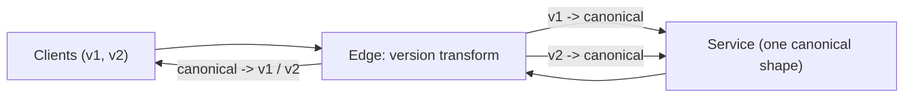

Your public API has 3,000 integrations. A field is misnamed, a list endpoint uses offset pagination that falls over past page 10,000, and errors are free-text strings that customers have started parsing with regular expressions. You cannot fix any of it, because every change breaks someone, and the someones do not upgrade. This is what an API is: a contract whose other party you do not control and cannot schedule.

The design work is therefore front-loaded. Get the resource model, the error shape, the pagination and the compatibility rules right before the first client ships, and evolution is additive for years. Get them wrong and every improvement is a migration. This lesson is the checklist a senior engineer runs on a new API and the arithmetic that justifies each item.

## Resources, methods and the choice of style

Model the API as nouns with a lifecycle, not verbs: `/orders/{id}` with `GET`, `POST /orders`, `PATCH /orders/{id}`, `POST /orders/{id}/cancel` for the one state transition that is not a plain update. Consistent naming (plural nouns, kebab or snake case chosen once, ISO 8601 timestamps in UTC, money as integer minor units with a currency code, IDs as opaque strings) removes an entire category of client bugs.

| Style | Best for | Cost |
|---|---|---|
| REST over HTTP/JSON | Public APIs, browser clients, CRUD with caching | Over- and under-fetching; verbs squeezed into nouns |
| gRPC with Protobuf | Service-to-service, streaming, low latency, strong typing | Browser support needs a proxy; binary payloads are opaque in logs |
| GraphQL | Clients with varied data needs (mobile vs web), aggregation over many services | Caching is harder; N+1 on the server needs dataloaders; complexity limits required |

The choice is per audience, not per company. A typical shape: gRPC inside, REST at the public edge, GraphQL at the product edge if the client teams want it. [API styles](/learn/networking/application-protocols/api-styles) and [gRPC and Protobuf](/learn/networking/application-protocols/grpc-and-protobuf) cover the wire-level trade-offs; this lesson is about the contract regardless of style.

## Idempotency in the contract

`GET`, `PUT` and `DELETE` are idempotent by specification; `POST` is not. Any `POST` that creates something a client might retry needs an `Idempotency-Key` header, documented, with the semantics from [Idempotency and retries](/learn/system-design/building-blocks/idempotency-and-retries): same key plus same body replays the stored response; same key plus different body is a 422; a key currently in progress is a 409. Put this in the contract on day one; adding it later means every existing client is unsafe to retry.

```viz
{"type": "system", "scenario": "idempotency-key", "requests": 3,
 "title": "POST with an Idempotency-Key", "caption": "The contract promises that a retried POST with the same key is a replay, not a new resource. That promise is what makes client-side retries safe, and it must be in the API before the first client ships."}
```

## Errors as a contract

An error response is read by code more often than by humans. Give it a stable, machine-readable shape:

```json
{
  "error": {
    "code": "insufficient_funds",
    "message": "Account balance is 12.50; 30.00 required.",
    "retryable": false,
    "request_id": "req_8f3a2c",
    "details": {"balance": 1250, "required": 3000, "currency": "USD"}
  }
}
```

Rules: the HTTP status carries the class (400 client error, 401 unauthenticated, 403 unauthorised, 404, 409 conflict, 422 semantically invalid, 429 rate limited, 500, 503 with `Retry-After`); the `code` is a documented enum that never changes meaning; the `message` is for humans and may change any time, and the docs say so; `retryable` tells the client what to do without parsing anything; `request_id` is the correlation key for support. A client that switches on `code` keeps working when you improve the message. A client that regexes the message breaks, and you told them not to.

## Pagination

Every list endpoint paginates, with a documented maximum page size (100 is common) and a default (20). The two mechanisms differ in cost by orders of magnitude.

**Offset pagination**: `GET /orders?offset=100000&limit=100`.

```sql
SELECT * FROM orders ORDER BY created_at DESC OFFSET 100000 LIMIT 100;
```

The database must produce and discard 100,000 rows to return 100. Cost is O(offset) per page; page 1,000 at 100 per page reads 100,000 rows to return 100, and a client walking the whole collection does O(n²/page) work in total. Under concurrent writes it also skips and duplicates: an insert at the top between page 1 and page 2 shifts every row by one, so the last row of page 1 reappears as the first of page 2.

**Cursor (keyset) pagination**: `GET /orders?limit=100&cursor=eyJjIjoi...`.

```sql
SELECT * FROM orders
WHERE (created_at, id) < ($cursor_created_at, $cursor_id)
ORDER BY created_at DESC, id DESC
LIMIT 100;
```

With an index on `(created_at, id)` this is O(log n + page) regardless of depth: page 1,000 costs the same as page 1. The cursor encodes the last row's sort key, opaque to the client (base64 of `{"c":"2026-09-01T10:00:00Z","i":"ord_9"}`), so you can change its contents later. The tiebreaker column `id` is mandatory: without it, two rows with the same `created_at` straddling a page boundary are skipped or repeated. Inserts at the top do not shift pages, because the cursor is a position in the sort order, not a count.

| | Offset | Cursor |
|---|---|---|
| Cost of page k | O(k x page size) | O(log n + page size) |
| Jump to page 50 | Yes | No (only next/previous) |
| Stable under inserts | No | Yes |
| Total-count header | Cheap to add (but a `COUNT(*)` on a large table is itself expensive) | Same caveat |
| Sort by arbitrary column | Yes | Needs an index on `(sort_col, id)` per supported sort |

Public APIs use cursors. Admin UIs that need "page 7 of 43" can use offset with a hard cap on offset (say 10,000) and an error beyond it, which is what search engines do.

## Filtering, sorting, partial responses and batching

Filtering: a fixed set of documented filter parameters, each backed by an index, rather than a generic query language that lets a client force a table scan. Sorting: an enumerated set of sort orders, each with a cursor-compatible index. Partial responses (`?fields=id,status,total`, or Protobuf field masks) reduce payload for mobile clients and reduce the server's join work if implemented properly. Batch endpoints (`POST /orders:batchGet` with up to 100 IDs) prevent the N+1 that turns a 100-item list into 100 round trips at a millisecond each.

## Rate limits as part of the contract

A rate limit that clients discover by getting errors is a support ticket; one in the contract is a feature. Document the limit (per API key, per endpoint class, per minute), return `429 Too Many Requests` with `Retry-After` in seconds, and send `X-RateLimit-Limit`, `X-RateLimit-Remaining` and `X-RateLimit-Reset` on every response so well-behaved clients can pace themselves before hitting the wall.

```viz
{"type": "system", "scenario": "token-bucket", "requests": 12,
 "title": "Token bucket per API key", "caption": "Tokens refill at the sustained rate; the bucket size is the permitted burst. A client that spends its burst then sees 429 until enough tokens refill, and the headers tell it exactly when."}
```

The token bucket is the usual algorithm: capacity is the burst (say 100), refill rate the sustained limit (say 10 per second). It permits short bursts without permitting sustained overload. Limit by API key, not IP, for authenticated APIs (many customers share an IP behind a corporate NAT; one customer uses many IPs). Distributed enforcement (a counter in Redis with a Lua script, or a local bucket per gateway node with a tolerance for slight over-admission) is covered in [Rate-limiting algorithms](/learn/networking/network-algorithms/rate-limiting-algorithms) and the [rate limiter](/learn/system-design/case-studies/rate-limiter) case study.

Distinguish the rate limit (per-client fairness, in the contract) from load shedding (protecting the server, not in the contract, returns 503). A client that is rate limited did something wrong; a client that is shed did nothing wrong and should retry with backoff.

## Timeouts and deadlines

The contract should state how long a call may take (p99 targets per endpoint) and what happens when it does not. gRPC carries deadlines natively; for HTTP, an `X-Request-Deadline` or simply a documented server-side timeout with a 504 tells clients what to expect. A client that does not know the server's timeout will set its own, and if the client's is shorter, every slow request is retried while the server is still working on it.

## Backwards compatibility

The rules, which apply equally to JSON, Protobuf and GraphQL:

| Change | Safe? | Why |
|---|---|---|
| Add an optional response field | Yes | Clients ignore unknown fields (make this a documented requirement: the tolerant reader) |
| Add an optional request parameter with a default | Yes | Old clients omit it |
| Add a new endpoint | Yes | |
| Add a value to an enum | Risky | Clients that switch exhaustively break; document that unknown values must be handled |
| Remove or rename a field | No | A rename is a remove |
| Change a field's type or format | No | `"123"` to `123` breaks parsers |
| Make an optional parameter required | No | Old clients stop working |
| Tighten validation | No | Requests that used to succeed now fail |
| Change an error `code`'s meaning | No | Clients switch on it |
| Loosen validation, raise a limit | Usually | Unless a client depended on the rejection |

Protobuf enforces the type rules by construction (field numbers, never reuse them), and `buf breaking` checks a schema against the previous version in CI. For REST, an OpenAPI diff tool does the same. Put the check in the pull request pipeline: a breaking change should be impossible to merge by accident.

## Versioning strategies

Versioning is what you do when a breaking change is unavoidable. Options, in rough order of preference:

**Additive evolution, no version bump.** New fields, new endpoints, deprecations. Covers the large majority of changes if the compatibility rules are followed. This is the goal.

**Per-field or per-feature versioning.** A new `shipping_address_v2` structure alongside the old; clients migrate field by field. Stripe's approach is close to this: the API is versioned by date per account, and each version is a set of small transformations applied at the edge, so the core serves one shape.

**URL versioning: `/v2/orders`.** Explicit and cacheable; clients opt in. The cost is maintaining two full surfaces, and the temptation to bundle unrelated changes into the version bump, which makes migration a large project nobody schedules. Big-bang versions are where APIs go to accumulate zombie clients.

**Header versioning (`Accept: application/vnd.api+json; version=2`).** Cleaner URLs; harder to test with a browser; same maintenance cost as URL versioning.

Whatever the mechanism, a version needs a deprecation process: announce with a date, return a `Deprecation` and `Sunset` header on old-version responses, measure which clients still call it (by API key), contact the stragglers, brown-out (return errors for a few minutes a day, escalating) before the shutdown, then remove. A version that is never retired costs a maintenance tax forever; budget the retirement when you create the version.



## Failure modes

**Offset pagination past page 1,000.** The `OFFSET 100000` query takes seconds, holds a connection, and a crawler walking the whole collection saturates the database. Detect: slow-query log dominated by list endpoints with large offsets. Mitigate: cursor pagination for public APIs; a hard offset cap for the rest.

**Unbounded page size.** `?limit=1000000` returns the whole table into a 2 GB response. Detect: response size percentiles. Mitigate: a documented maximum, enforced.

**Silent breaking change.** A field renamed in a refactor ships; 40 clients break at once; the postmortem is about process. Detect: too late, unless CI checks. Mitigate: schema diff in CI, contract tests run by consumers.

**Error strings parsed by clients.** The message "Card declined" becomes "Card was declined" and a customer's retry logic stops working. Detect: customer reports after a copy change. Mitigate: machine codes, and documentation that messages are not stable.

**Chatty API driving N+1.** A list of 100 orders followed by 100 customer lookups: 100 ms of round trips per page and 10,000 internal requests per second at modest traffic. Detect: internal request rate far above external; traces with hundreds of sibling spans. Mitigate: embed the customer summary in the order, or a batch endpoint.

**Versions that never die.** v1 from 2019 still serves 3% of traffic and blocks a schema change. Detect: per-version traffic by key. Mitigate: sunset headers, brown-outs, a retirement date set at creation.

## Interviewer follow-ups

**Q: "Offset or cursor pagination for the orders list, and why?"**

Cursor. Offset costs O(offset) per page because the database materialises and discards the skipped rows, so page 1,000 at 100 per page scans 100,000 rows; and inserts between requests shift the pages, so clients see duplicates and gaps. A keyset cursor on `(created_at, id)` with a matching index makes every page O(log n + page), stable under writes. I encode the cursor opaquely so I can change what it contains, and I include the `id` tiebreaker because equal timestamps at a page boundary would otherwise skip rows. The one thing I lose is random access to page N, which a public API does not need and an admin UI can get with a capped offset.

**Q: "A partner needs a field renamed. What do you ship?"**

Nothing that removes the old name. I add the new field, populate both, mark the old one deprecated in the schema and the docs with a sunset date, and measure by API key who still reads it. Unknown fields are ignored by clients per the contract, so adding is safe. When usage of the old field reaches zero, or the sunset date passes and the remaining callers have been contacted, I remove it. The schema diff in CI would reject a straight rename, which is the point of having it.

**Q: "How do rate limits interact with retries?"**

The 429 carries `Retry-After` and the client's retry policy honours it rather than backing off blindly; the `X-RateLimit-Remaining` header lets a good client pace itself and never hit 429 at all. I limit per API key, with a token bucket sized for the burst I want to allow, and I distinguish 429 (you exceeded your quota; wait exactly this long) from 503 (we are shedding load; back off with jitter). A client that retries a 429 immediately is a client I will eventually have to block, so the docs are explicit.

**Q: "Should the service-to-service APIs be REST too?"**

Internally I would use gRPC: Protobuf gives typed contracts with a mechanical breaking-change check, deadlines propagate natively, streaming is built in, and the encoding is several times smaller and faster than JSON at the internal call volumes. At the public edge I keep REST/JSON because integrators expect it and browsers can call it without a proxy. The two are generated from the same Protobuf definitions where possible, so the public REST is a transcoding of the internal contract rather than a second one to keep in sync.

**Q: "What is in your error response and why?"**

An HTTP status for the class, a stable machine-readable `code`, a human `message` documented as unstable, a `retryable` boolean so clients do not have to know which codes are transient, a `request_id` for support, and a `details` object for structured context such as which field failed validation. The `retryable` flag is the one people skip; it prevents both the client that retries validation errors forever and the client that gives up on a transient 503.

## Senior signals

- You put **idempotency keys, cursor pagination, an error envelope and rate-limit headers** in the contract before the first client, because they cannot be added safely later.
- You can write the **keyset SQL** and explain why the tiebreaker column is not optional.
- You treat **compatibility rules** as CI checks (buf breaking, OpenAPI diff), not review comments.
- You prefer **additive evolution** and per-field migration over big-bang versions, and you set a sunset date when you create a version.
- You separate **429 from 503** and design the retry contract for each.
- You design **batch endpoints** to prevent N+1 across the network, with the latency arithmetic to show why.

## Check yourself

```quiz
- q: >-
    A client walks an entire collection of 1,000,000 rows using offset pagination with pages of 100. Roughly how many rows does the database scan in total?
  options: ["10,000,000", "10,000,000,000", "5,000,000,000", "1,000,000"]
  answer: 2
  explanation: >-
    Page k scans about k x 100 rows; summing over 10,000 pages gives roughly 100 x 10,000^2 / 2 = 5 x 10^9 rows (forgetting the / 2 gives the 10^10 option). Keyset pagination scans about 1,000,000 plus index lookups.
- q: >-
    Why must a keyset cursor include a unique tiebreaker such as id alongside created_at?
  options: ["Because an index on a timestamp alone cannot be range-scanned", "So that clients can jump straight to an arbitrary page number", "So rows sharing a created_at are not skipped or repeated", "To keep the encoded cursor short and opaque to clients"]
  answer: 2
  explanation: >-
    The cursor is a position in a total order; timestamps are not unique, so rows with equal created_at at a page boundary would otherwise be skipped or repeated. The order must be made total with a unique column. Keyset pagination still cannot jump to page N.
- q: >-
    Which change can be shipped without a version bump under the compatibility rules?
  options: ["Making the currency request parameter required", "Renaming total to amount in the response body", "Changing order_id from a string to an integer", "Adding an optional shipping_notes response field"]
  answer: 3
  explanation: >-
    Additions with defaults are backward compatible when clients are tolerant readers. Renames, type changes and tightening requirements all break existing clients.
- q: >-
    A client receives a 429 with Retry-After: 30. The correct client behaviour is:
  options: ["Wait at least 30 seconds, then retry", "Treat it as a permanent failure and stop", "Retry immediately with exponential backoff", "Switch to a different API key and retry"]
  answer: 0
  explanation: >-
    429 with Retry-After is the server telling the client exactly when its quota refills; honouring it avoids further rejections. Backoff with jitter is for 503 load shedding, where no exact time is known. Rotating keys to evade limits is abuse.
- q: >-
    Why should error responses carry a machine-readable code separate from the human message?
  options: ["So clients can branch on a stable value, not on wording", "So the payload stays small when messages are long", "Because HTTP status codes are deprecated for API errors", "So that status codes can be localised for each client"]
  answer: 0
  explanation: >-
    Clients that parse messages break when wording changes. A documented enum of codes is the stable surface; the message is explicitly unstable and can be improved freely. Status codes still carry the class but are too coarse for client logic.
```
