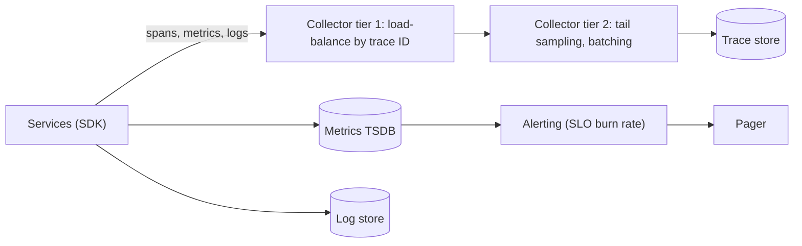

At 03:10 the pager fires: "CPU > 80% on api-7". The engineer on call logs in, sees CPU at 82%, sees no customer impact, silences it, and goes back to sleep. At 03:40 checkout error rate has been 12% for half an hour and nobody was paged, because no alert was watching the thing customers experience. The system had dashboards for everything and observability for nothing.

Observability is the ability to ask a new question of a running system without shipping new code, and to be told, reliably and early, when users are being hurt. It is built from three signals with different costs and different answers, and aimed by service level objectives that say what "hurt" means in numbers. The senior skill is choosing which signal answers which question, keeping the cost bounded with arithmetic, and alerting on symptoms rather than causes.

## Three signals, three questions

| Signal | Answers | Cost per event | Cardinality | Retention |
|---|---|---|---|---|
| Metrics | How much, how fast, how often, over time | Near zero (a counter increment) | Must be bounded | Months to years, downsampled |
| Logs | What happened in this specific case | Bytes per line, storage and indexing | Unbounded | Days to weeks |
| Traces | Where the time went, across services | A span per hop, sampled | Unbounded | Days |

### Metrics

A metric is a number aggregated over time and labelled by a small set of dimensions: `http_requests_total{route="/orders", status="500"}`. Counters are monotonic (you query their rate), gauges are levels (queue depth, memory), histograms are distributions (latency, payload size). A time series database stores each unique label combination as a separate series.

**Percentiles need histograms.** A service with p50 5 ms and p99 500 ms has a mean near 10 ms that describes nobody's experience. Record latency as bucket counts and compute percentiles at query time. **You cannot average percentiles**: the mean of ten instances' p99s is not the fleet's p99, and neither is their maximum. Sum the buckets across instances first, then take the percentile. A panel showing `avg(p99)` is the most common observability mistake in design reviews. Forty-nine healthy instances and one sick one:

```python
import bisect, random

BOUNDS = [0.05, 0.1, 0.25, 0.5, 1.0, 2.5, 5.0]            # seconds; a +Inf bucket is implied

def histogram(samples):
    counts = [0] * (len(BOUNDS) + 1)
    for s in samples:
        counts[bisect.bisect_left(BOUNDS, s)] += 1        # bucket i holds BOUNDS[i-1] < s <= BOUNDS[i]
    return counts

def quantile(q, counts):                                  # the interpolation histogram_quantile does
    rank, seen = q * sum(counts), 0
    for i, c in enumerate(counts):
        if c and seen + c >= rank:
            lo = BOUNDS[i - 1] if i else 0.0
            hi = BOUNDS[i] if i < len(BOUNDS) else BOUNDS[-1]
            return lo + (hi - lo) * (rank - seen) / c
        seen += c

rng = random.Random(7)
fleet = [histogram(rng.uniform(0.01, 0.2) for _ in range(10_000)) for _ in range(49)]
fleet.append(histogram(rng.uniform(3.0, 5.0) for _ in range(10_000)))     # one sick instance
p99s = [quantile(0.99, h) for h in fleet]
merged = [sum(bucket) for bucket in zip(*fleet)]                            # sum buckets, then quantile
print(f"avg of p99s {sum(p99s) / len(p99s):.2f} s")                        # looks healthy
print(f"fleet p99   {quantile(0.99, merged):.2f} s")                        # what 1% of users get
print(f"max of p99s {max(p99s):.2f} s")                                     # finds the sick instance
```

The average says 0.34 s. The sick instance serves 2% of requests at 3 to 5 s, so the real fleet p99 is 3.75 s, and only the merged histogram shows it.

### Cardinality, worked

A Prometheus histogram with the 11 default buckets produces 14 series per label combination: 12 cumulative buckets (the 11 plus `+Inf`), `_sum` and `_count`. Label `http_request_duration_seconds` by instance (200), route (40) and status code (8 distinct values observed):

$$200 \times 40 \times 8 \times 14 = 896{,}000 \text{ series}$$

Scraped every 15 s that is about 60,000 samples per second. The [Prometheus storage documentation](https://prometheus.io/docs/prometheus/latest/storage/) puts compressed storage at an average of 1–2 bytes per sample, so roughly 5–10 GB a day on disk, and each active series costs on the order of kilobytes of memory in the head block, so several gigabytes of RAM. Managed vendors bill per series. At list prices at the time of writing (September 2026), Grafana Cloud's Pro tier charges from $6.50 per 1,000 active series a month, about $6,500 for a million, and Datadog charges $5 per 100 custom metrics (its name for a unique metric-name and tag-value combination, which is a series), about $50,000 for a million: a four- or five-figure monthly line item. That is one histogram.

Now someone adds `customer_id`. Series exist only for combinations that occur, but a load balancer spreads each customer over every instance: 50,000 active customers × 5 routes each × 2 statuses × 200 instances × 14 ≈ 1.4 billion series. The TSDB runs out of memory within hours. The fixes: status as a class (`2xx`, `4xx`, `5xx`: 3 values, not 8), instance dropped by a recording rule that sums by route for long-term storage, and per-customer detail in trace attributes and exemplars, where cardinality costs nothing. A label is for dimensions with tens or hundreds of values.

### Logs

A log line records one event. Make it structured (JSON or key-value), with `timestamp`, `service`, `level`, `request_id`, `trace_id` and the event's own fields, so you can filter rather than grep for wording.

The cost is volume: 10,000 requests per second at one 1 KB line each is 10 MB/s, 864 GB a day, 26 TB a month before indexing, which multiplies it. Priced at Datadog's list rates at the time of writing (September 2026), ingestion is $0.10 per GB, about $2,600 a month, and indexing with the shortest (3-day) retention is $1.06 to $1.59 per million events: 25.9 billion lines a month makes that $27,000 to $41,000 more, and longer retention costs more per event. That is a five-figure monthly bill for one service's access logs, and six figures once retention or a second service is added. Keep 100% of errors with context, sample routine successes at around 1%, and move anything you count into metrics, which cost almost nothing per event.

### Traces

A trace follows one request across services: a tree of spans (start, duration, service, operation, attributes) joined by a trace ID propagated in headers. The W3C `traceparent` header carries it: `00-4bf92f3577b34da6a3ce929d0e0e4736-00f067aa0ba902b7-01` is version, a 16-byte trace ID, the 8-byte parent span ID, and flags whose low bit means "sampled". A trace answers "this request took 900 ms, 700 of them in one inventory query", which no metric can, because metrics have discarded per-request association.

```viz
{"type": "system", "scenario": "request-flow", "nodes": 4,
 "title": "Trace context propagating across hops", "caption": "The gateway starts a trace and sends the traceparent header downstream. Each service creates a child span and forwards the header. The collector stitches spans into one tree keyed by trace ID; a hop that drops the header breaks the tree."}
```

**Exemplars** join the two worlds: a histogram bucket carries a sample trace ID, so the p99 spike on a dashboard opens a trace from that bucket instead of a search by timestamp.

## Head versus tail sampling, traced

Five requests arrive; a 1% budget of traces is the goal:

| Request | Outcome | Head sampling at 1% (decided at the gateway) | Tail sampling: all errors, all over 500 ms, 0.1% of the rest |
|---|---|---|---|
| r1 | 200 in 40 ms | Dropped (hash of trace ID says no) | Dropped |
| r2 | 500 after 120 ms | Dropped: the decision was made before the error | **Kept**: error |
| r3 | 200 in 1,900 ms | Dropped | **Kept**: slow |
| r4 | 200 in 35 ms | **Kept**: hash says yes | Dropped, unless in the 0.1% |
| r5 | 200 in 38 ms | Dropped | Dropped |

**Head sampling** decides at the root. The gateway sets the sampled flag in `traceparent`, and every downstream SDK with a parent-based sampler obeys it, so the tree is always complete. Ratio samplers hash the trace ID, so independent services make the same decision. It is cheap, but blind: it keeps 1% of boring requests and 1% of interesting ones.

**Tail sampling** decides after the trace completes. Every span goes to a collector tier, a load-balancing exporter routes all spans of one trace ID to the same collector, and that collector buffers the trace for a `decision_wait` (30 s by default in the OpenTelemetry tail-sampling processor) before applying policies. Simulated over 1,000,000 requests (seed 7) with 0.5% errors and 1% slow: head sampling at 1% kept 10,065 traces containing 57 of the 5,027 errors; tail sampling kept 16,118 traces containing all 5,027.

The price is memory in flight. At 10,000 requests per second, 30 s of buffering is 300,000 traces; at 8 spans of about 1 KB each in memory, roughly 2.4 GB spread across the collector tier. The processor's `num_traces` defaults to 50,000; set below the in-flight count, it evicts traces before deciding, and you silently lose exactly the long, slow traces tail sampling exists to keep.

Storage arithmetic for the kept traces: 10,000 requests per second, 8 spans, 500 bytes per span stored, 1% kept is 400 KB/s, 35 GB a day. Keeping everything is 3.5 TB a day, which is why nobody does.



## Under the hood: how percentiles are computed from buckets

Prometheus's `histogram_quantile` finds the bucket containing the requested rank and interpolates linearly between its bounds, assuming observations are spread evenly inside it. The answer is only as good as the bucket boundaries. Simulated with 200,000 lognormal latencies (median 40 ms, seed 7):

| Quantile | True value | Default buckets (5 ms … 10 s, 11 bounds) | 17 buckets placed between 10 ms and 1 s |
|---|---|---|---|
| p50 | 40.1 ms | 41.8 ms | 40.1 ms |
| p90 | 127.4 ms | 162.0 ms (+27%) | 128.1 ms |
| p99 | 324.1 ms | 399.4 ms (+23%) | 334.4 ms (+3%) |

The default p99 falls in the 250–500 ms bucket and is interpolated a quarter too high. An SLI of "requests under 300 ms" needs a bucket boundary *at* 300 ms, so that the SLI is an exact bucket count rather than an interpolation. Native histograms (experimental from Prometheus 2.40 in November 2022, a stable but optional feature since 3.8 in November 2025) use exponential buckets instead of hand-placed boundaries. The Go client's recommended starting factor of 1.1 gives eight buckets per power of two, each at most about 9% wider than the one before, so an interpolated quantile's relative error is bounded by a bucket's width wherever the latency falls.

On disk, Prometheus appends samples to per-series chunks with Gorilla-style compression (delta-of-delta timestamps, XOR-encoded values), which is how regular scrapes get to 1–2 bytes per sample. Recent samples live in an in-memory head block, cut into two-hour blocks on disk and compacted later; memory tracks active series, not stored history, which is why cardinality, not retention, is what takes a Prometheus server down.

## What to instrument on day one

1. **RED per endpoint**: rate, errors, duration. A request counter by route and status class, and a latency histogram by route with a boundary at the SLO threshold.
2. **RED per dependency**: the same for each database, cache, downstream service and queue, so "we are slow" becomes "inventory is slow".
3. **USE per resource**: utilisation, saturation, errors for thread and connection pools, queues and consumer lag, memory, file descriptors.
4. **Business signals**: orders per minute, payments captured. A 30% drop in orders with every technical metric green is an outage.
5. **Correlation**: a `request_id` from the edge on every log line, and trace context on every outbound call, including in queue message headers.
6. **Deploy markers**: version as a label or annotation, so "p99 doubled" lines up with "v2.14 at 14:01".

[Observability in code](/learn/senior-craft/software-craft/observability-in-code) shows this instrumentation inside a real service.

## SLIs, SLOs and error budgets

An **SLI** measures user-facing behaviour: the fraction of requests that succeed within 300 ms, computed from the RED metrics. An **SLO** is a target for it over a window: 99.9% over 30 days. The **error budget** is the allowed failure: 0.1% of requests, or 43 minutes of full outage in 30 days. An **SLA** is a contract with penalties, looser than the SLO so the SLO breaks first.

| SLO | Downtime per 30 days | Per week |
|---|---|---|
| 99% | 7.2 hours | 1.7 hours |
| 99.9% | 43 minutes | 10 minutes |
| 99.95% | 22 minutes | 5 minutes |
| 99.99% | 4.3 minutes | 1 minute |

The budget is a decision tool: while it remains, ship and take risks; when it is spent, feature work stops for reliability work. Choose the number from what users notice and what dependencies allow: a 99.99% SLO over a 99.9% hard dependency is a promise you cannot keep without a fallback.

## Burn-rate alerts, worked

**Burn rate** is the error rate divided by the budgeted rate. At 99.9%, burn rate 1 is a 0.1% error rate and spends the 30-day budget in exactly 30 days; burn rate 14.4 is 1.44% and spends it in 50 hours. The thresholds come from deciding what fraction of the monthly budget may be spent before someone is told. Spending fraction $f$ of the budget in a window of $w$ hours out of a 720-hour month means

$$\text{burn} = f \times \frac{720}{w}: \quad 0.02 \times \frac{720}{1} = 14.4, \quad 0.05 \times \frac{720}{6} = 6, \quad 0.10 \times \frac{720}{24} = 3$$

This is the multi-window, multi-burn-rate configuration from the Google SRE Workbook's chapter on [alerting on SLOs](https://sre.google/workbook/alerting-on-slos/): its recommended table for a 99.9% SLO has the two pages and the 3-day ticket, and its example alerting rules add the 1-day ticket:

| Severity | Burn rate | Long window | Short window | Budget spent when it fires |
|---|---|---|---|---|
| Page | 14.4 | 1 h | 5 min | 2% |
| Page | 6 | 6 h | 30 min | 5% |
| Ticket | 3 | 1 day | 2 h | 10% |
| Ticket | 1 | 3 days | 6 h | 10% |

Both windows must exceed the threshold. The long window gives precision (a 3-minute blip cannot spend 2% of a month); the short window, a twelfth of the long one, makes the alert stop soon after the problem does. Simulated per minute at 1,000 requests per minute, after three healthy days, against a naive "5-minute error rate above 1%" page:

| Incident | 14.4× page | 6× page | 3× ticket | Naive 5-min > 1% |
|---|---|---|---|---|
| 100% errors | 1 min | 3 min | 5 min | 1 min |
| 10% errors | 9 min (2.1% spent) | 22 min | 44 min | 1 min |
| 2% errors | 44 min (2.0% spent) | 108 min | 216 min | 3 min |
| 0.3% errors for 3 days | Never | Never | 24 h (10% spent) | Never |
| 2% errors for 3 minutes | Never | Never | Never | 3 min: a page for nothing |

Detection time for the fast page is $0.864 / e$ minutes at error rate $e$: 9 minutes at 10%, 44 at 2%. That is the trade: burn-rate alerts are slower on moderate incidents and never page for blips or miss slow burns. If 44 minutes at a 20× burn is too slow for your product, add a higher tier (say burn 30 over 15 minutes), not a threshold on raw error rate. Cause alerts (CPU, disk, queue depth) become dashboards and tickets, except leading indicators with a proven link to an SLO breach, such as a disk that will be full in hours. Every page links a runbook: what it means, the dashboard, the first three checks, the mitigation.

## Release verification

Changes cause most incidents: the Google SRE book's [introduction](https://sre.google/sre-book/introduction/) reports that "roughly 70% of outages are due to changes in a live system". Compare the new version's SLIs with the old one's during a canary: 1% of traffic to the new version, error and latency histograms against the baseline for 15 minutes, promote or roll back automatically ([Migrations and evolution](/learn/system-design/senior-design-skills/migrations-and-evolution) covers the rollout side). Kayenta, open-sourced by Google and Netflix in 2018 and now part of Spinnaker, does this with a Mann-Whitney U test per metric; a threshold check catches most regressions. The comparison needs traffic: at 1% of 1,000 requests per second, 15 minutes is 9,000 requests, enough to see a 1% error rate and not a 0.01% one.

```viz
{"type": "system", "scenario": "canary", "requests": 10,
 "title": "Canary compared with baseline", "caption": "A small fraction of traffic goes to the new version. Its RED metrics are compared with the old version's on the same traffic mix; a worse error rate or latency triggers an automatic rollback before the rollout continues."}
```

## Aggregating at scale

Ten thousand instances emitting a thousand series each is ten million series and, at a 10-second interval, a million samples per second. Systems at that scale (Netflix's Atlas, Prometheus with Thanos or Mimir, commercial vendors) pre-aggregate at the edge (sum by route, drop instance), downsample old data, and compute real-time views with the same windowed aggregation as any stream processor, with the same late-data choices ([Stream processing model](/learn/big-data/streaming/stream-processing-model), [Metrics and logging platform](/learn/system-design/case-studies/metrics-and-logging-platform)).

```viz
{"type": "system", "scenario": "stream-windowing", "requests": 12,
 "title": "Windowed aggregation of request metrics", "caption": "Events are bucketed into fixed windows and summed per label set. A late event lands in an already-emitted window; the pipeline either updates that window or counts it in the next, and the choice shows up as a small discrepancy between dashboards."}
```

## Failure modes

| Failure | Symptom | Diagnosis | Fix |
|---|---|---|---|
| Averages hide the tail | Dashboard green; 1% of users timing out | Plot the histogram; compare mean with p99 | Histograms everywhere; merged-bucket percentiles, never `avg(p99)` |
| Cardinality explosion | Metrics server OOMs at 02:00 after a deploy | Series count by metric name; a new high-cardinality label | Label allow-lists and per-metric series limits in the collector |
| Alert fatigue | 40 pages a night; the real one silenced with the rest | Pages per engineer per week; fraction acted on | Page only on burn rate; delete cause pages; review every page |
| Sampling bias | "We have no traces of the errors" | Head sampling at 1% against a 0.5% error rate | Tail sampling that keeps errors and slow traces |
| Tail sampler evicting | Slow traces missing though policy keeps them | Collector eviction counter; in-flight traces above `num_traces` | Raise `num_traces` from rate × `decision_wait`; scale the tier |
| Broken propagation | Traces end at the queue or at one service | Spans without parents; a hop that drops `traceparent` | Propagate through message headers; context-passing checks in review |
| Telemetry dies with the system | A blind incident: dashboards down with the product | Telemetry shares network, storage or auth with production | Separate failure domain; external synthetic probes |

## Interviewer follow-ups

**"What is the first alert you would set up?"** Model answer: a burn-rate page on the primary SLI, 14.4× over 1 hour confirmed over 5 minutes, which fires when about 2% of the monthly budget has gone; then a 6× page and slower tickets. CPU, memory and queue depth go on the runbook's dashboard. Common wrong answer: "error rate above 1%", which pages for 3-minute blips and never sees a 0.3% slow burn that spends the month's budget in ten days.

**"Your dashboard averages p99 across 50 instances. What is wrong?"** Model answer: percentiles do not average; one instance at 5 s and 49 at 50 ms average to 150 ms and hide the fire. Sum the buckets, then take the percentile, and add a max-of-p99 panel for single bad instances. Also check the bucket boundaries: default buckets put the p99 a quarter high in the lesson's simulation. Common wrong answer: "use the max instead", which is still not the fleet's p99.

**"Head or tail sampling?"** Model answer: head sampling at a low rate for baseline shape, because it is cheap and always complete; tail sampling in a collector tier to keep every error and slow trace, sized as rate × `decision_wait` traces in memory, with spans routed by trace ID. Common wrong answer: "raise the head sampling rate", which multiplies cost and still keeps 90% of nothing interesting.

**"An engineer wants `customer_id` on the request metrics. What do you say?"** Model answer: multiply it out: tens of thousands of customers × routes × statuses × instances × 14 series per histogram is a billion series. Put the customer in trace attributes and exemplars; if a per-customer SLI is needed, compute it in a stream job over events or logs for the top few hundred customers. Common wrong answer: "fine, the TSDB compresses labels", which confuses bytes per sample with memory per series.

**"How do you pick the SLO number?"** Model answer: from what users notice (around 300 ms for an interactive call) and what the business accepts (43 minutes a month at 99.9%), checked against the weakest hard dependency; start slightly loose, measure a quarter, tighten with evidence. Common wrong answer: "whatever we achieved last quarter, plus a nine", which yields an SLO nobody can meet and everyone ignores.

## What mid-level engineers get wrong

- **Paging on causes.** CPU at 80% with no user impact trains the rotation to silence pages.
- **Averaging percentiles.** `avg(p99)` has no statistical meaning and hides the one instance on fire.
- **Unbounded labels.** `user_id` or `request_path` with raw IDs turns one metric into millions of series.
- **Default histogram buckets.** No boundary at the SLO threshold makes the SLI an interpolation off by tens of percent.
- **Head sampling as the only strategy.** The rare failing request is exactly the one it drops.
- **Counting from logs.** Business numbers go wrong the day sampling starts; counts belong in metrics.

## Exercise: when does the burn-rate alert fire?

```exercise
id: burn-rate-alerts
title: Evaluate multi-window burn-rate alerts over per-minute data
prompt: |
  `budget_ppm` is the SLO's error budget in parts per million (1000 for a
  99.9% SLO). `minutes` is a list of `[total, errors]` request counts, one
  per minute. Each rule is `[long, short, burn_x10]`: two window lengths in
  minutes and the burn-rate threshold times ten (144 means 14.4).

  A window of length `w` ending at minute `i` covers minutes `i - w + 1`
  through `i`, and only exists if `i - w + 1 >= 0`. It is burning when its
  total is above zero and its error ratio is at least
  `(burn_x10 / 10) * (budget_ppm / 1,000,000)`. Use integer arithmetic:
  `errors * 10_000_000 >= burn_x10 * budget_ppm * total`.

  A rule fires at the first minute where both its long and its short window
  are burning. Return, for each rule in order, that minute's index, or -1
  if it never fires.
languages: [python, javascript]
entry: first_alerts
starter:
  python: |
    def first_alerts(budget_ppm, minutes, rules):
        result = []
        # your code here
        return result
  javascript: |
    function first_alerts(budget_ppm, minutes, rules) {
      const result = [];
      // your code here
      return result;
    }
tests:
  - args: [1000, [[1000, 0], [1000, 0], [1000, 0], [1000, 0], [1000, 0], [1000, 0], [1000, 0], [1000, 0], [1000, 0], [1000, 0]], [[6, 2, 144]]]
    expected: [-1]
    label: healthy
  - args: [1000, [[1000, 0], [1000, 0], [1000, 0], [1000, 0], [1000, 0], [1000, 20], [1000, 20], [1000, 20], [1000, 20], [1000, 20]], [[6, 2, 144]]]
    expected: [9]
    label: a 2% error rate needs the long window to fill
  - args: [1000, [[1000, 50], [1000, 50], [1000, 50], [1000, 50], [1000, 0], [1000, 0], [1000, 0], [1000, 0]], [[6, 2, 144]]]
    expected: [-1]
    label: the short window stops a page for something that ended
  - args: [1000, [[1000, 0], [1000, 0], [1000, 0], [1000, 100], [1000, 100], [1000, 100], [1000, 100], [1000, 100], [1000, 100], [1000, 100]], [[4, 1, 144], [8, 2, 60]]]
    expected: [3, 7]
    label: fast and slow rules
  - args: [1000, [[0, 0], [0, 0], [0, 0]], [[2, 1, 10]]]
    expected: [-1]
    label: no traffic never alerts
  - args: [1000, [[10000, 144]], [[1, 1, 144]]]
    expected: [0]
    hidden: true
    label: exactly at the threshold fires
  - args: [1000, [[100, 100]], [[2, 1, 10]]]
    expected: [-1]
    hidden: true
    label: a window longer than the data never fires
hints:
  - "Prefix sums of totals and errors make every window sum O(1)."
  - "Check that the window starts at or after minute 0 before summing it."
  - "Compare with multiplication, not division, so there is no floating-point edge at the threshold."
```

## Senior signals

- You alert on **SLO burn rate**, can derive 14.4, 6 and 3 from the fraction of budget and the window, and know the fast page takes $0.864/e$ minutes at error rate $e$.
- You record latency as **histograms** with a boundary at the SLO threshold, compute fleet percentiles from merged buckets, and flinch at `avg(p99)`.
- You multiply out **cardinality** before adding a label, and put per-user detail in traces and exemplars.
- You use **tail sampling** for errors and slow requests, size its buffer from rate × decision wait, and route spans by trace ID.
- You do the **cost arithmetic** for logs and traces and choose sampling rates from it.
- You keep telemetry in a **separate failure domain** with an external probe.

## Check yourself

```quiz
- q: >-
    A dashboard panel shows the average of per-instance p99 latency across 50 instances. Why is this misleading?
  options: ["The p99 needs a longer window than the panel uses", "Per-instance series are too high-cardinality to plot", "Percentiles do not average; merge histograms first", "The panel should show the fleet p50 instead of p99"]
  answer: 2
  explanation: >-
    The average of percentiles has no statistical meaning, and one very slow instance is hidden by it. Merge the histogram buckets first, then take the percentile; add a max panel to catch a single bad instance. A longer window does not fix averaging something that cannot be averaged.
- q: >-
    A service has a 99.9% availability SLO over 30 days. Its error rate has been 1.5% for the last hour and still is. What should happen?
  options: ["A ticket, since only about 2% of the budget is gone", "A page, since the budget burns about 15x too fast", "Nothing yet; the monthly budget is not exhausted", "An automatic rollback of the most recent deploy"]
  answer: 1
  explanation: >-
    Burn rate = 1.5% / 0.1% = 15, above the 14.4 threshold for the 1-hour window, and the 5-minute window confirms it; about 2% of the monthly budget went in one hour and the rest goes in two days. Waiting for exhaustion finds the outage days late. A rollback may be the fix, but the alert is what starts the response.
- q: >-
    Why is the fast page's threshold 14.4 for a 1-hour window?
  options: ["It spends 2% of a 720-hour budget in one hour", "It is 99.9% expressed as a burn multiplier per hour", "It is the error rate that exhausts the budget in a day", "It is chosen so the page fires within five minutes"]
  answer: 0
  explanation: >-
    Burn rate = fraction of budget × (window of the SLO / alert window) = 0.02 × 720 / 1 = 14.4. At that rate the whole budget lasts 50 hours, not a day. Detection time depends on the error rate: 0.864 / e minutes, so 9 minutes at 10% errors.
- q: >-
    An engineer adds user_id as a label on the http_requests_total counter. The likely consequence is:
  options: ["Slightly higher scrape latency on each instance", "A series explosion that overloads the metrics system", "Nothing; labels are compressed away by the TSDB", "More precise per-user dashboards at almost no extra cost"]
  answer: 1
  explanation: >-
    Each unique label combination is a separate time series with its own memory in the head block: one per user per route per status per instance. Compression reduces bytes per sample, not the number of series. Per-user detail belongs in trace attributes or exemplars.
- q: >-
    You need traces of the 0.5% of requests that fail, but head sampling at 1% almost never captures them. The fix is:
  options: ["Tail sampling that keeps every error or slow trace", "Sample consistently by user ID across services", "Raise head sampling to 10% so more failures get caught", "Log the failing requests instead of tracing them"]
  answer: 0
  explanation: >-
    Tail sampling decides after the trace completes, so it keeps exactly the interesting ones; in the lesson's simulation it kept all 5,027 errors where 1% head sampling kept 57. Raising head sampling multiplies cost while still missing most failures.
- q: >-
    An SLI is requests under 300 ms, measured with Prometheus's default latency buckets. What is the risk?
  options: ["Counters reset on restart and the SLI goes negative", "Default buckets overflow above 10 seconds and drop samples", "No bucket boundary at 300 ms, so the SLI is interpolated", "Histogram series cannot be summed across instances"]
  answer: 2
  explanation: >-
    Default boundaries are 250 ms and 500 ms, so the count under 300 ms is a linear interpolation inside that bucket; the lesson's simulation put the default-bucket p99 23% too high. Put a boundary exactly at the SLO threshold. Buckets sum across instances correctly, and rate() handles counter resets.
```
