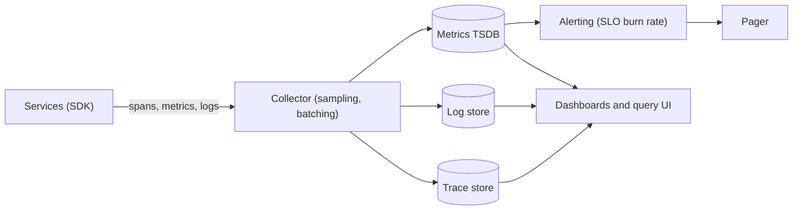

At 03:10 the pager fires: "CPU > 80% on api-7". The engineer on call logs in, sees CPU at 82%, sees no customer impact, silences it, and goes back to sleep. At 03:40 checkout error rate has been 12% for half an hour and nobody was paged, because no alert was watching the thing customers experience. The system had dashboards for everything and observability for nothing.

Observability is the ability to ask a new question of a running system without shipping new code, and to be told, reliably and early, when users are being hurt. It is built from three signals with different costs and different answers, and it is aimed by service level objectives that say what "hurt" means in numbers. The senior skill is choosing which signal answers which question, keeping the cost bounded, and alerting on symptoms rather than causes.

## Three signals, three questions

| Signal | Answers | Cost per event | Cardinality | Retention |
|---|---|---|---|---|
| Metrics | How much, how fast, how often, over time | Near zero (a counter increment) | Must be bounded | Months to years, downsampled |
| Logs | What happened in this specific case | Bytes per line, storage and indexing | Unbounded | Days to weeks |
| Traces | Where did the time go, across services | A span per hop, sampled | Unbounded | Days |

### Metrics

A metric is a number aggregated over time, labelled by a small set of dimensions: `http_requests_total{service="checkout", route="/orders", status="500"}`. Three types: counters (monotonic; rate them), gauges (a level: queue depth, memory), histograms (a distribution: latency, payload size). A time series database stores each unique label combination as a separate series; a scrape every 15 seconds costs a few bytes per series per sample, so a million series is manageable and a hundred million is not.

**Percentiles need histograms.** The mean latency of a service with p50 5 ms and p99 500 ms is roughly 10 ms, which describes nobody's experience. Record latency as a histogram with bucket boundaries chosen for the service (1, 2, 5, 10, 20, 50, 100, 200, 500, 1000, 5000 ms), and compute percentiles from bucket counts at query time. Prometheus histograms do this; the newer native histograms adapt bucket boundaries automatically.

**You cannot average percentiles.** The p99 of each of 10 instances, averaged, is not the fleet's p99. Neither is the maximum. The fleet's p99 comes from summing the histogram buckets across instances and then taking the percentile. Any dashboard showing `avg(p99)` is showing a number with no meaning; this is the single most common observability mistake in design reviews.

**Cardinality is the budget.** A label with 10 values multiplies series by 10. `user_id` as a label on a request counter creates one series per user: 10 million users x 20 routes x 5 statuses is a billion series, and the metrics system falls over. Labels are for dimensions with tens or hundreds of values (route, status, region, instance); anything per-user, per-request or per-ID goes in logs or traces.

### Logs

A log line is a record of one event with arbitrary structure. Make it structured (JSON or key-value, not printf), with the fields that let you filter: timestamp, service, level, `request_id`, `trace_id`, `user_id`, and the specific event's data. Structured logs are queryable; "Error processing order 7781 for user 42" is grep-able only if you know the wording.

The cost is volume. 10,000 requests per second, one 1 KB log line per request: 10 MB/s, 864 GB per day, about 26 TB a month before compression and indexing, and indexing multiplies storage. At a managed logging provider's price per GB ingested, that is a five- or six-figure monthly bill for one service's access logs. So: sample the routine (keep 1% of successful request logs, 100% of errors), keep the important (every error with its context), and put counts in metrics rather than in logs that you then count.

### Traces

A trace follows one request across services: a tree of spans, each with a start time, duration, service, operation and attributes, linked by a trace ID that is propagated in headers (W3C `traceparent` is the standard, carrying trace ID, parent span ID and sampling flag). A trace answers "this request took 900 ms; 700 of them were a single database call in the inventory service", which no metric can, because metrics have lost the per-request association.

```viz
{"type": "system", "scenario": "request-flow", "nodes": 4,
 "title": "Trace context propagating across hops", "caption": "The gateway starts a trace and sends the traceparent header downstream. Each service creates a child span and forwards the header. The collector stitches spans into one tree keyed by trace ID; a hop that drops the header breaks the tree."}
```

Sampling decides cost. **Head sampling** decides at the first span (keep 1% of traces): cheap and simple, but it keeps 1% of the boring requests and drops 99% of the interesting ones. **Tail sampling** buffers the whole trace and decides at the end (keep every trace with an error or over 500 ms, plus 0.1% of the rest): keeps what you want, costs a buffering collector with memory proportional to traces in flight. Storage arithmetic: 10,000 requests per second, 8 spans per trace, 500 bytes per span, 1% head sampling: 400 KB/s, 35 GB a day. At 100% sampling it is 3.5 TB a day, which is why nobody does that.



**Exemplars** link the two worlds: a histogram bucket can carry a sample trace ID, so clicking the p99 spike on a dashboard opens a trace from that bucket. Without exemplars, you go from "p99 rose at 14:02" to searching traces by time and hoping.

## What to instrument on day one

A service that ships without these is not observable, and adding them during an incident is too late.

1. **Per endpoint: rate, errors, duration** (the RED method). A request counter labelled by route and status, and a latency histogram labelled by route. That is the dashboard and the SLI.
2. **Per dependency: the same three.** Database, cache, each downstream service, each queue: calls, errors, latency histogram. When the service is slow, this tells you who is slow.
3. **Saturation.** Thread or connection pool usage vs capacity, queue depth and consumer lag, memory, file descriptors (the USE method: utilisation, saturation, errors, for each resource).
4. **Business signals.** Orders placed per minute, payments captured, signups. A 30% drop in orders with all technical metrics green is an outage.
5. **Correlation.** A `request_id` generated at the edge and logged on every line; trace context propagated on every outbound call, including through queues (put the trace ID in the message headers).
6. **Build and deploy markers.** Version as a label or an annotation, so that "the p99 doubled" can be lined up with "v2.14 rolled out at 14:01".

## SLIs, SLOs and error budgets

An **SLI** (service level indicator) is a measurement of user-facing behaviour: the fraction of requests that succeed within 300 ms, computed from the RED metrics. An **SLO** is a target for it over a window: 99.9% over 30 days. The **error budget** is the allowed failure: 0.1% of 30 days is 43 minutes of full outage, or equivalently 0.1% of requests over the month. A **SLA** is a contract with penalties, and it is looser than the SLO so the SLO breaks first.

| SLO | Downtime per 30 days | Per week |
|---|---|---|
| 99% | 7.2 hours | 1.7 hours |
| 99.9% | 43 minutes | 10 minutes |
| 99.95% | 22 minutes | 5 minutes |
| 99.99% | 4.3 minutes | 1 minute |

The budget is a decision tool: while budget remains, ship features and take risks; when it is exhausted, the team stops feature work and pays down reliability. That makes reliability a negotiated number rather than an argument. Choose the SLO from what users notice and what the business needs, not from what the system happens to do: a 99.99% SLO on a service whose dependency is 99.9% is a promise you cannot keep, and a 99.9% SLO on a service that has done 99.99% for a year gives you budget to spend on faster deploys.

## Alert on symptoms, with burn rates

The 03:10 page was a cause alert (CPU) with no user impact. The 03:40 outage had no page because nobody wrote an alert for the symptom. The fix is to page on the SLI: the rate at which the error budget is being consumed.

Burn rate is how fast you are spending budget relative to the SLO's allowed rate. Burn rate 1 spends exactly the monthly budget in a month. Burn rate 14.4 spends it in 50 hours; over a one-hour window, that means 2% of the monthly budget went in an hour, which is worth waking someone. The standard multi-window, multi-burn-rate configuration:

| Severity | Burn rate | Long window | Short window (confirm still burning) | Budget consumed by the time it fires |
|---|---|---|---|---|
| Page | 14.4 | 1 h | 5 min | 2% |
| Page | 6 | 6 h | 30 min | 5% |
| Ticket | 3 | 1 day | 2 h | 10% |
| Ticket | 1 | 3 days | 6 h | 10% |

For a 99.9% SLO, burn rate 14.4 over an hour means an error rate of 14.4 x 0.1% = 1.44% sustained for an hour. The short window prevents paging for something that already stopped. Fast burns page fast; slow burns become tickets. Cause alerts (CPU, disk, queue depth) become dashboards and tickets, not pages, unless they are leading indicators of an SLO breach with a proven correlation (disk at 95% full will become an outage; page on that).

Every page has a runbook: what this alert means, the dashboard to open, the first three things to check, and how to mitigate. A page without a runbook is a page that trains people to silence it.

## Release verification

Deploys cause most incidents. Observability's cheapest win is comparing the new version's SLIs against the old one's during a canary: route 1% of traffic to the new version, compare error rate and latency histograms with the baseline for 15 minutes, promote or roll back automatically. Netflix's Kayenta does this with statistical comparison; a simpler threshold check catches most regressions.

```viz
{"type": "system", "scenario": "canary", "requests": 10,
 "title": "Canary compared with baseline", "caption": "A small fraction of traffic goes to the new version. Its RED metrics are compared with the old version's on the same traffic mix; a worse error rate or latency triggers an automatic rollback before the rollout continues."}
```

Metrics for canary analysis need the version label, and the comparison needs enough traffic to be statistically meaningful: at 1% of 1,000 requests per second, 15 minutes is 9,000 requests, enough to see a 1% error rate but not a 0.01% one.

## Aggregating at scale

Ten thousand instances emitting a thousand series each is ten million series and, at a 10-second interval, a million samples per second. Systems at that scale (Netflix's Atlas, Prometheus with Thanos or Mimir, Datadog) pre-aggregate at the edge (sum by route, drop instance), downsample old data (1-second resolution for a day, 1-minute for a month, 1-hour for a year), and use streaming aggregation for real-time views. The streaming pipeline is the same windowed aggregation as any stream processor: tumbling windows over event time with late-data handling.

```viz
{"type": "system", "scenario": "stream-windowing", "requests": 12,
 "title": "Windowed aggregation of request metrics", "caption": "Events are bucketed into fixed windows and summed per label set. A late event lands in an already-emitted window; the pipeline either updates that window or counts it in the next, and the choice shows up as a small discrepancy between dashboards."}
```

## Failure modes

**Averages hide the tail.** Mean latency 12 ms, p99 2 seconds, dashboard green, 1% of users furious. Detect: someone finally plots the histogram. Mitigate: histograms everywhere; dashboards show p50/p95/p99, never mean alone.

**Alert fatigue.** 40 cause alerts a night; the real one is silenced with the rest. Detect: pages per week per engineer, fraction acted on. Mitigate: delete cause pages; page on burn rate only; every page has a runbook and a review.

**Missing correlation IDs.** An error in the payment service cannot be matched to the request that caused it; the investigation takes hours. Detect: the first incident. Mitigate: request ID at the edge, propagated and logged everywhere, including into queue messages.

**Logs as a database.** A team counts orders by grepping logs; the count is wrong after sampling starts. Detect: business numbers disagree between systems. Mitigate: counts are metrics; logs are for the specific case.

**The observability stack dies with the system.** Metrics scraped over the same network that partitioned; the log cluster on the same failing storage; the dashboard behind the same auth service that is down. Detect: a blind incident. Mitigate: separate failure domains for telemetry; a minimal external probe (synthetic checks from outside) that does not depend on anything internal.

**Sampling bias.** 1% head sampling never captures the rare failing request; traces show only healthy paths. Detect: "we have no traces of the errors". Mitigate: tail sampling that keeps all errors and slow traces; or 100% sampling for a specific endpoint during an investigation.

**Cardinality explosion.** Someone adds `customer_id` to a label; the metrics system OOMs at 02:00. Detect: series count alert. Mitigate: cardinality limits in the collector; label allow-lists; code review for new labels.

## Interviewer follow-ups

**Q: "What is the first alert you would set up for this service?"**

A burn-rate alert on the primary SLI: the fraction of requests that fail or exceed the latency target, page when burn rate is over 14.4 across a one-hour window and still over 14.4 in the last five minutes. That fires when about 2% of the monthly error budget has gone in an hour, which is the point where a human beats waiting. I would not page on CPU, memory or queue depth; those go on the dashboard the runbook points to. The second alert is a slower burn as a ticket, so a gradual degradation is noticed in a day rather than at the end of the month.

**Q: "How do you find where a slow request spent its time across nine services?"**

Distributed tracing with context propagated in the `traceparent` header on every hop, including through Kafka message headers. Tail sampling keeps every trace over the latency target, so I search traces by endpoint and duration, open one, and read the span tree: the critical path is the chain of longest child spans. Exemplars on the latency histogram take me from the p99 spike on the dashboard straight to a representative trace. Without propagation across the queue I would have two half-traces and a guess, so the propagation is a code-review requirement.

**Q: "Your dashboard shows average p99 across 50 instances. What is wrong?"**

Percentiles do not average: the mean of 50 per-instance p99s is neither the fleet p99 nor anything else with a definition. One instance with a p99 of 5 seconds and 49 at 50 ms averages to 150 ms and hides an instance that is on fire. I compute fleet percentiles by summing histogram buckets across instances and taking the percentile of the merged distribution, and I add a max-of-p99 panel to catch the single bad instance.

**Q: "Logging every request costs too much. What do you keep?"**

At 10,000 requests per second and 1 KB per line, full logging is close to a terabyte a day; the provider bill makes the decision for me. I keep 100% of errors and slow requests with their full context, sample successful requests at around 1%, and move anything I was counting from logs into metrics, which cost almost nothing per event. Traces cover "what happened to this request" better than logs for the cross-service case, so the logs get shorter and structured, keyed by request ID and trace ID so the three signals join.

**Q: "How do you pick the SLO number?"**

From users and dependencies, not from the current graph. What latency do users notice: for an interactive endpoint, around 300 ms is where it starts to feel slow, so the SLI is "under 300 ms". What availability does the product need: a checkout at 99.9% loses 43 minutes a month, which the business can decide is acceptable or not. Then I check feasibility: an SLO above my weakest hard dependency is a promise I cannot keep unless I add fallbacks. I start slightly loose, measure for a quarter, and tighten with evidence, because an SLO nobody can meet gets ignored.

## Senior signals

- You alert on **SLO burn rate** and treat cause alerts as dashboards, and you can state the 14.4x / 6x windows and what budget they correspond to.
- You record latency as **histograms**, compute fleet percentiles from merged buckets, and you flinch at `avg(p99)`.
- You keep **cardinality** bounded by design, and you know why `user_id` belongs in a trace attribute, not a metric label.
- You propagate **trace context** through every hop including queues, and you use tail sampling to keep the traces that matter.
- You do the **cost arithmetic** for logs and traces and choose sampling rates from it.
- You put the telemetry stack in a **separate failure domain** and keep an external probe that depends on nothing internal.

## Check yourself

```quiz
- q: >-
    A dashboard panel shows the average of per-instance p99 latency across 50 instances. Why is this misleading?
  options: ["The panel should show the fleet p50 instead of p99", "The p99 needs a longer window than the panel uses", "Percentiles do not average; merge histograms first", "Per-instance series are too high-cardinality to plot"]
  answer: 2
  explanation: >-
    The average of percentiles has no statistical meaning, and one very slow instance is hidden by it. Merge the histogram buckets first, then take the percentile; add a max panel to catch a single bad instance. A longer window does not fix averaging something that cannot be averaged.
- q: >-
    A service has a 99.9% availability SLO over 30 days. Its error rate has been 1.5% for the last hour. What should happen?
  options: ["A page, since the budget burns about 15x too fast", "A ticket, since only about 2% of the budget is gone", "An automatic rollback of the most recent deploy", "Nothing yet; the monthly budget is not exhausted"]
  answer: 0
  explanation: >-
    Burn rate = 1.5% / 0.1% = 15, above the 14.4 threshold for the 1-hour window; roughly 2% of the monthly budget went in one hour, and at that rate the whole budget is gone in about two days. Waiting for budget exhaustion means discovering the outage days later. Rollback may be the fix, but the alert is what starts the response.
- q: >-
    An engineer adds user_id as a label on the http_requests_total counter. The likely consequence is:
  options: ["Nothing; labels are compressed away by the TSDB", "More precise per-user dashboards at almost no extra cost", "Slightly higher scrape latency on each instance", "A series explosion that overloads the metrics system"]
  answer: 3
  explanation: >-
    Each unique label combination is a separate time series: one per user per route per status. Millions of users multiplied by routes and statuses is hundreds of millions of series. Per-user detail belongs in trace attributes or sampled logs.
- q: >-
    You need traces of the 0.5% of requests that fail, but head sampling at 1% almost never captures them. The fix is:
  options: ["Sample consistently by user ID across services", "Log the failing requests instead of tracing them", "Tail sampling that keeps every error or slow trace", "Raise head sampling to 10% so more failures get caught"]
  answer: 2
  explanation: >-
    Tail sampling decides after the trace completes, so it can keep exactly the interesting ones (errors, requests over the latency threshold) plus a small random sample. Raising head sampling multiplies cost while still missing most failures.
- q: >-
    Which of these is the best candidate for a paging alert?
  options: ["A checkout deploy finishing outside business hours", "Disk usage above 60% on the checkout database", "CPU above 80% on any checkout instance for over 5 minutes", "Checkout burn rate over 14.4 for 1 h and still over 5 min"]
  answer: 3
  explanation: >-
    It measures user impact and its rate, confirms the problem is ongoing, and corresponds to a defined fraction of the error budget. CPU and disk at those levels are causes with no confirmed impact; a deploy is an annotation, not an alert.
```
