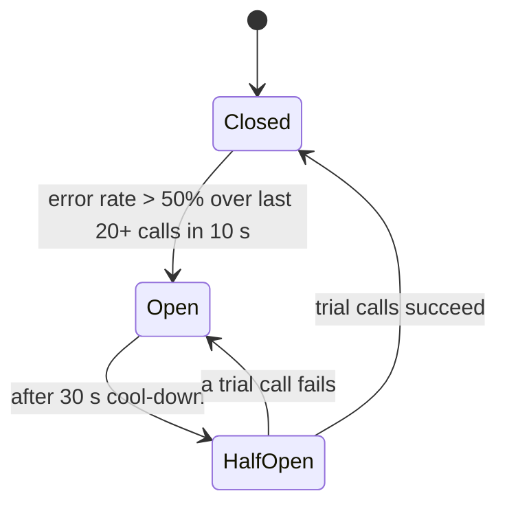

The recommendations service starts responding in 8 seconds instead of 80 milliseconds. Nothing is down. But the home page calls recommendations synchronously with a 30-second timeout, so every home page request now holds a thread for 8 seconds. The home page service has 200 threads; at 50 requests per second it needs 400 threads to keep up, so within four seconds every thread is waiting on recommendations, and the home page, the search bar, and the login flow that share the service all return errors. A non-critical feature being slow has taken down the product.

Slow is worse than dead. A dead dependency fails fast and the caller moves on; a slow one consumes the caller's capacity while giving nothing back. Every resilience pattern in this lesson is a way of turning slow into fast-failing, of bounding how much of your capacity any one dependency can consume, and of choosing what to drop when there is not enough to go round.

## Timeouts: every call has one, and they form a budget

A call without a timeout can wait forever; a call with the wrong timeout waits longer than anyone upstream cares. The rule: set timeouts from the dependency's latency distribution, not from a guess, and make them shrink as you go deeper.

**Set from p99, not mean.** If a dependency's p99 is 120 ms, a 150 ms timeout cuts off 1% of legitimate calls (which you then retry or degrade) and prevents the long tail from occupying threads. A 5-second timeout "to be safe" protects nothing: by the time it fires, the caller's own caller has given up.

**Budget the chain.** The user's client waits 1 second. The gateway gets 900 ms, leaving margin for its own work. The service it calls gets 700 ms. The database call inside gets 300 ms. Each layer's timeout is strictly less than its caller's remaining budget, so a timeout at the bottom surfaces as an error at the top *before* the top times out and retries into a system that is still working on the first attempt. gRPC propagates deadlines automatically; for HTTP, pass the remaining budget in a header and honour it.

**Connect vs read.** Connection timeouts are short (tens of milliseconds in-region: the SYN either comes back or the host is gone). Read timeouts are the p99-derived number. Conflating them into one value means either connections hang or reads are cut short.

[Timeouts, retries and backoff](/learn/networking/networking-in-practice/timeouts-retries-and-backoff) covers the network layer; retries themselves, with jitter and budgets, are in [Idempotency and retries](/learn/system-design/building-blocks/idempotency-and-retries). The one line to carry here: retries multiply load on a dependency that is already failing, so they need a budget (around 10% of primary traffic) and they belong in one layer.

```viz
{"type": "system", "scenario": "retry-backoff", "requests": 5,
 "title": "Bounded retries with jitter inside a deadline", "caption": "Each attempt is spaced by growing, jittered delays, and no attempt starts once the remaining deadline is shorter than the call's expected latency. Retrying past the caller's deadline is wasted work on a struggling dependency."}
```

## Circuit breakers

A timeout still spends the timeout. If recommendations is down, every call waits 150 ms to find out. At 50 requests per second that is 7.5 thread-seconds per second wasted on a known-dead dependency. A circuit breaker remembers that the dependency is failing and fails immediately instead.



**Closed**: calls pass through; the breaker counts outcomes over a sliding window. **Open**: calls fail instantly with a breaker-open error (or return a fallback) without touching the dependency; a timer runs. **Half-open**: after the cool-down, a few trial calls go through; success closes the breaker, failure reopens it.

The thresholds are where implementations differ and where interviewers probe. An error-rate threshold (50%) needs a minimum volume (at least 20 calls in the window) or one failure out of one call trips it. Slow calls should count as failures (a call over the timeout threshold is a failure whether or not it eventually returned). The window is sliding, either count-based (last 100 calls) or time-based (last 10 seconds). The cool-down should be longer than the dependency's typical recovery time and short enough to notice recovery; 30 seconds is a common start.

```viz
{"type": "system", "scenario": "circuit-breaker", "requests": 15,
 "title": "Breaker tripping and recovering", "caption": "Failures accumulate until the error rate crosses the threshold; the breaker opens and calls fail in microseconds instead of waiting for the timeout. After the cool-down, trial calls test the dependency and the breaker closes when they succeed."}
```

**One breaker per dependency, not per service.** A breaker around "all outbound calls" opens for everything when one dependency fails. Key breakers by dependency (and sometimes by operation: reads vs writes to the same database behave differently).

**What to return when open.** This is a product decision made in advance: a cached value (stale recommendations are better than none), a default (popular items instead of personalised), an empty section with the page still rendering, or an error only if the feature is essential. The fallback must not itself depend on something that might be down.

Netflix's Hystrix made this pattern mainstream, with per-dependency thread pools and breakers; it is now in maintenance and Netflix moved toward adaptive concurrency limits (the `concurrency-limits` library), which infer the dependency's capacity from latency changes rather than from fixed thresholds, and libraries like resilience4j carry the breaker pattern forward. The idea survived the implementation.

## Bulkheads

A ship's hull is divided into compartments so one breach does not sink it. In a service, the compartments are pools: threads, connections, queue slots, allocated per dependency so that one dependency's slowness cannot consume the capacity needed by another.

The opening story is a missing bulkhead. With a shared pool of 200 threads, recommendations at 8 seconds and 50 requests per second consumes 400 thread-equivalents and starves everything. With a bulkhead of 20 threads for recommendations, it saturates its own 20 (callers get an immediate rejection, which the fallback handles), and the other 180 threads keep serving search and login untouched. The arithmetic is Little's law: concurrency = throughput x latency; 50 x 8 s = 400, capped at 20 by the bulkhead, so the damage is bounded to 20.

```viz
{"type": "system", "scenario": "bulkhead", "nodes": 3,
 "title": "Per-dependency pools", "caption": "One dependency slows to a crawl and fills its own pool; requests to it are rejected immediately. The other pools are untouched and their features keep working."}
```

Bulkheads apply at every level: separate connection pools per downstream database, separate consumer groups per queue, separate deployments for user-facing and batch traffic, separate clusters for tenants that might misbehave. Each one is a capacity decision (what share of resources does this dependency get?) that you make explicitly instead of letting the slowest dependency make it for you.

## Backpressure and bounded queues

An unbounded queue turns overload into memory exhaustion. A service that accepts every request into an in-memory queue and processes them at its own pace looks fine until the queue holds 2 million requests whose clients gave up minutes ago, and the process is either out of memory or doing work nobody wants.

Backpressure means the consumer tells the producer to slow down, and the mechanism is a bound: a queue of fixed size, a semaphore of N permits, a TCP receive window. When the bound is hit the producer blocks (in a pipeline) or is rejected (at a request boundary), and the rejection propagates up until something with a user in front of it decides what to do. Reactive Streams, Kafka consumers pulling only what they can process, and gRPC flow control are all this.

```viz
{"type": "system", "scenario": "backpressure", "requests": 20,
 "title": "Bounded queue rejecting at the edge", "caption": "The queue holds a fixed number of requests. Once full, new arrivals are rejected immediately with a clear signal, instead of waiting in a queue whose latency already exceeds every caller's timeout."}
```

Queue sizing follows from the latency you are willing to add: with a service rate of 1,000 per second, a queue of 100 adds up to 100 ms of waiting. A queue of 100,000 adds 100 seconds, and nothing waiting that long is still wanted. Small queues fail fast; that is the point.

## Load shedding

When demand exceeds capacity, you can serve everyone badly or some people well. Load shedding chooses the second: drop a fraction of requests deliberately so the rest are served within SLO.

**Which to drop.** Priority: health checks and payments before browsing before analytics beacons. Cost: drop the expensive requests first. Freshness: drop requests that have already waited longer than their deadline (a queue timeout in the CoDel style: if the minimum queue delay over the last interval exceeds a target, drop until it recovers). Client: shed the tenant that is over its fair share.

**Adaptive shedding.** Fixed limits ("reject above 800 requests per second") go stale as the code and hardware change. Adaptive approaches watch latency or queue delay and shed when it climbs, which tracks actual capacity. Netflix's adaptive concurrency limits do this using the same idea as TCP congestion control: probe upward while latency stays flat, back off when it rises.

Shedding differs from rate limiting: rate limiting enforces a per-client contract (429, the client did something wrong); shedding protects the server (503 with `Retry-After`, the client did nothing wrong and should retry with backoff). [Rate-limiting algorithms](/learn/networking/network-algorithms/rate-limiting-algorithms) covers the per-client side; the leaky bucket is the smoothing shape shedding often takes.

```viz
{"type": "system", "scenario": "leaky-bucket", "requests": 14,
 "title": "Smoothing a burst into a steady rate", "caption": "Arrivals fill the bucket; it drains at a fixed rate. When the bucket is full, new arrivals are dropped. The drain rate is the capacity you are protecting; the bucket depth is the burst you tolerate."}
```

## Graceful degradation

Every pattern above ends with a rejection, and the rejection is only graceful if the product has a plan for it. The plan is a list, made before the incident, of what each feature does when its dependency is unavailable:

| Feature | Dependency down | Degraded behaviour |
|---|---|---|
| Personalised home rows | Recommendations | Show popular-by-region rows from cache |
| Search | Search cluster | Show browse categories; hide the search box |
| Checkout shipping options | Rate service | Offer standard shipping at a default price |
| Playback | Auth token refresh | Honour existing tokens for a grace period |
| Analytics beacons | Analytics ingest | Drop; never block the user |

Netflix's version: if personalisation is down, everyone sees the same popular titles, and the metric that matters (stream starts) barely moves. The degraded mode is tested, because a fallback that has never run is a fallback that has a bug.

## Health checks that do not make things worse

A load balancer removes instances that fail health checks. A health check that verifies every dependency ("return 200 only if the database, cache and three downstream services respond") means that when the database is slow, every instance fails its check simultaneously and the load balancer removes all of them, converting a degraded service into no service. Liveness checks (is the process alive) should be shallow; readiness checks (can this instance take traffic) may check local state but never a shared dependency that all instances share, or they fail together.

## Chaos engineering

Resilience that has not been exercised is a hypothesis. Chaos engineering tests the hypothesis in production, on purpose, with a bounded blast radius: kill an instance (Chaos Monkey), add 200 ms of latency to one dependency for 5% of traffic, fail a region's traffic over to another (Netflix does this regularly). The method is an experiment: state the steady-state metric (stream starts per second), introduce the failure to a small segment, watch the metric, stop immediately if it moves. Game days do the same with the humans in the loop, so the runbooks and the on-call get tested too. [Designing for failure](/learn/system-design/senior-design-skills/designing-for-failure) goes into blast radius and multi-region.

## Failure modes

**Retry storm.** A dependency blips for 10 seconds; every caller retries three times without jitter; the dependency recovers into 4x its normal load and falls over again. Detect: sawtooth load on the dependency after each recovery. Mitigate: jitter, retry budgets, breakers that hold open through the recovery.

**Cascading failure through a shared pool.** The opening story. Detect: thread pool saturation on a service whose own dependencies are mostly fine. Mitigate: bulkheads per dependency; timeouts from p99.

**Breaker that never closes.** Cool-down 30 seconds, but the half-open trial goes to the one endpoint that is still broken while the rest recovered; the breaker flaps or stays open for hours. Detect: breaker-open duration metric. Mitigate: key breakers by operation; use several trial calls; alert on breakers open longer than N minutes.

**Timeouts longer than the caller's.** Service timeout 5 s, gateway timeout 2 s: the gateway gives up and retries while the service is still working, doubling load with zero benefit. Detect: server-side completions of requests the client already abandoned. Mitigate: budgets that shrink down the chain; deadline propagation.

**Fallback that is a dependency.** "If recommendations fails, read from Redis" — and Redis is what recommendations was stuck on. Detect: fallback error rate. Mitigate: fallbacks use local state (in-process cache, static defaults) or nothing.

**Deep health checks remove the whole fleet.** Described above. Detect: all instances leaving the load balancer within seconds of a dependency slowdown. Mitigate: shallow liveness; readiness that checks only instance-local state.

**Load shedding that sheds the wrong thing.** Random 20% drop at the edge sheds 20% of payments along with 20% of beacons. Detect: revenue dropping during shedding. Mitigate: priority tiers, with payments and auth never shed before analytics.

## Interviewer follow-ups

**Q: "The recommendations service becomes slow. What happens to the home page?"**

Nothing the user notices. The call has a 150 ms timeout derived from its p99, its own bulkhead of 20 threads so it cannot starve the other 180, and a circuit breaker per dependency that opens after the error rate (with slow calls counted as errors) crosses 50% over at least 20 calls in 10 seconds. When the breaker is open, the home page renders popular rows from an in-process cache instead of personalised ones, and the breaker probes recommendations every 30 seconds to close again. Stream starts, the metric I watch, should not move. I would have tested this exact scenario with latency injection before the incident.

**Q: "How do you pick the timeout values?"**

From the latency histogram of each dependency: p99 plus a margin for calls I am willing to cut off and retry or degrade. Then I check the chain: the client's 1-second budget leaves the gateway 900 ms, the service 700 ms, the database 300 ms, each strictly less than the caller's remainder so a timeout always fires bottom-up. Connect timeouts are separate and short, tens of milliseconds in-region. I revisit the numbers when the histogram moves, and I propagate the remaining deadline downstream so no call starts with less time than it needs.

**Q: "What is the difference between a bulkhead and a circuit breaker, and do you need both?"**

A breaker is temporal: it remembers that a dependency has been failing and stops calling it for a while. A bulkhead is spatial: it caps how much of my capacity any one dependency can hold at once, whether or not it is failing. They cover different failures. A dependency that is slow but under the breaker's error threshold (say 40% of calls at 5 seconds) will not trip the breaker but will fill a shared pool; the bulkhead catches that. A dependency that is hard down trips the breaker so calls fail in microseconds rather than filling even the bulkhead's small pool. I want both, and the fallback behind them is the same.

**Q: "You are at capacity and traffic is still rising. What do you drop?"**

Requests that have already waited past their deadline first, since nobody wants them; then by priority tier, with analytics beacons and prefetches before browsing before checkout and auth, which are never shed while anything lower remains. I shed at the edge where it is cheapest and return 503 with `Retry-After` so clients back off with jitter rather than retrying immediately. I prefer an adaptive limit that watches queue delay over a fixed number, because the fixed number is wrong within a month. And I know that shedding 10% of traffic to serve 90% within SLO is a better outcome than serving 100% at 8-second latency, which is effectively 0%.

**Q: "How do you know these patterns work before the outage?"**

I inject the failure. Add 500 ms of latency to recommendations for 5% of traffic in production during business hours, with the team watching stream starts and error rates and a kill switch. Kill an instance every hour and check that nobody notices. Run a game day where a region is failed over and the on-call follows the runbook. Hystrix-style dashboards showed breaker state in real time for a reason: a breaker you have never seen open is one you cannot trust. If the organisation cannot tolerate small experiments in production, it is not going to tolerate the real failure either.

## Senior signals

- You say **slow is worse than dead** and design every pattern to convert slow into a fast, bounded failure.
- You derive timeouts from **p99** and arrange them as a **shrinking budget** down the call chain, with deadline propagation.
- You quote **breaker thresholds** with a minimum volume, count slow calls as failures, key breakers per dependency, and define the fallback in advance.
- You size **bulkheads** with Little's law and can show how one slow dependency saturates a shared pool.
- You bound every queue and choose **what to shed** by deadline and priority, distinguishing shedding from rate limiting.
- You have **tested the degraded modes** with fault injection and can describe the experiment and the metric you watched.

## Check yourself

```quiz
- q: >-
    A service with 200 shared threads calls a dependency at 50 requests per second. The dependency's latency rises to 8 seconds. Roughly how long until every thread is blocked on it?
  options: ["About 4 seconds", "About 8 seconds", "About 40 seconds", "It never fully blocks because requests time out"]
  answer: 0
  explanation: >-
    Little's law: concurrency = 50/s x 8 s = 400 needed; the pool has 200, which fills at 50 new blocked calls per second, so in about 4 seconds. A 30-second timeout does not help. A bulkhead of 20 threads would cap the damage at 20.
- q: >-
    A circuit breaker trips after a single failed call. What is most likely misconfigured?
  options: ["The cool-down period", "The minimum call volume before the error rate is evaluated", "The fallback", "The half-open trial count"]
  answer: 1
  explanation: >-
    Error rate over a window needs a minimum number of samples (say 20) or one failure out of one call is a 100% error rate. Cool-down and half-open settings affect recovery, not the initial trip.
- q: >-
    The gateway's timeout is 2 s and the service it calls has a 5 s timeout on its database call. During database slowness:
  options: ["Requests fail cleanly at the gateway with no wasted work", "The gateway gives up and retries while the service is still working, multiplying load for no benefit", "The database timeout never fires", "The service returns partial results"]
  answer: 1
  explanation: >-
    Timeouts must shrink down the chain. A longer inner timeout means the caller abandons and retries while the original attempt still consumes capacity; deadline propagation prevents starting work that cannot finish in time.
- q: >-
    A readiness check returns 200 only if the shared database responds within 100 ms. When the database slows, the consequence is:
  options: ["Only the slowest instances are removed", "All instances fail the check together and the load balancer removes the entire fleet", "The load balancer routes around the database", "Nothing; readiness checks do not affect routing"]
  answer: 1
  explanation: >-
    Every instance shares the same dependency, so they fail together, converting degraded into down. Readiness should check instance-local state; dependency failures are handled by breakers and fallbacks.
- q: >-
    Traffic exceeds capacity by 30%. Which shedding policy best protects the business?
  options: ["Reject a random 30% of all requests", "Reject requests that have exceeded their deadline first, then lowest-priority tiers (analytics, prefetch) before browsing, never checkout or auth while lower tiers remain", "Reject all requests from the busiest client", "Queue everything and process in order"]
  answer: 1
  explanation: >-
    Deadline-expired work is worthless; priority tiers preserve revenue-bearing requests. Random shedding drops payments; blocking one client may be unfair and insufficient; unbounded queues add latency until everything times out.
```
