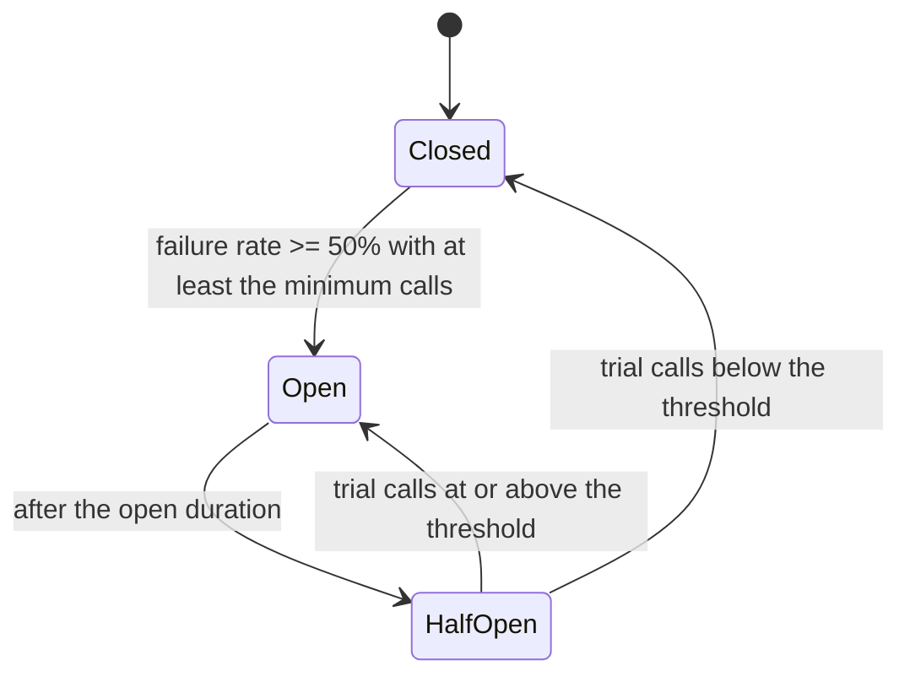

The recommendations service starts responding in 8 seconds instead of 80 milliseconds. Nothing is down. But the home page calls recommendations synchronously with a 30-second timeout, so every home page request now holds a thread for 8 seconds. The home page service has 200 threads; at 50 requests per second it needs 400 threads to keep up, so within four seconds every thread is waiting on recommendations, and the home page, the search bar and the login flow that share the service all return errors. A non-critical feature being slow has taken down the product.

Slow is worse than dead. A dead dependency fails fast and the caller moves on; a slow one consumes the caller's capacity while giving nothing back. Every pattern in this lesson turns slow into fast-failing, bounds how much of your capacity one dependency can hold, or chooses what to drop when there is not enough to go round, and each comes with the arithmetic that sets its numbers.

## Timeouts: every call has one, and they form a budget

A call without a timeout can wait forever; a call with the wrong timeout waits longer than anyone upstream cares. Set timeouts from the callee's latency distribution, and make them nest.

**Set from p99, not the mean.** If a dependency's p99 is 120 ms, a 150 ms timeout cuts off about 1% of calls (which you retry or degrade) and stops the tail from occupying threads. A 5-second timeout "to be safe" protects nothing: by the time it fires, your own caller has given up. Connect timeouts are separate and short (well under a second in-region); read timeouts carry the p99-derived number.

**Budget the chain bottom-up.** Each layer's timeout must exceed the worst case of the layer below, so the callee fails first with a clean error instead of being abandoned mid-work, and each layer's worst case must fit inside its caller's timeout. A 1,000 ms client budget, with retries in exactly one layer:

| Layer | Calls | Callee p99 | Timeout per attempt | Attempts | Worst case for this layer |
|---|---|---|---|---|---|
| Database | — | — | 60 ms statement timeout | 1 | 60 ms |
| Pricing | Database | 40 ms | 70 ms, above the 60 ms statement timeout | 1 | 30 ms own work + 70 = 100 ms |
| Checkout | Pricing | 70 ms | 120 ms | 2, with 20 ms backoff | 60 + 2 × 120 + 20 = 320 ms |
| Edge | Checkout | 250 ms | 400 ms | 1 | 30 + 400 = 430 ms |
| Client | Edge | 300 ms | 1,000 ms deadline | 1 | 430 ms, with 570 ms of slack |

Checkout retries because it sits next to the flaky dependency; nobody else does, so a hard-down pricing service receives at most 2× its traffic, not the $2^4$ that four retrying layers would send. The per-attempt numbers are defaults; the real bound is the propagated deadline. gRPC carries it natively; over HTTP, pass the remaining milliseconds in a header, and a hop whose remaining budget is below its own p50 rejects at once instead of starting work that cannot finish. [Timeouts, retries and backoff](/learn/networking/networking-in-practice/timeouts-retries-and-backoff) measures the network layer and retry budgets.

```viz
{"type": "system", "scenario": "retry-backoff", "requests": 5,
 "title": "Bounded retries with jitter inside a deadline", "caption": "Each attempt is spaced by growing, jittered delays, and no attempt starts once the remaining deadline is shorter than the call's expected latency. Retrying past the caller's deadline is wasted work on a struggling dependency."}
```

## Circuit breakers

A timeout still spends the timeout. If recommendations is down, every call waits 150 ms to find out; at 50 requests per second that is 7.5 thread-seconds per second spent on a known-dead dependency. A circuit breaker remembers that the dependency is failing and fails in microseconds instead.



Traced at 50 requests per second, with a count window of the last 6 calls, a minimum of 4 calls, a 50% threshold, a 5-second open duration, 2 trial calls, and any call slower than 150 ms counted as a failure:

| Call | t (s) | Outcome | Window after | Failure rate | State after |
|---|---|---|---|---|---|
| 1 | 0.00 | 200 in 40 ms | ok | 1 call, not judged | Closed |
| 2 | 0.02 | 200 in 45 ms | ok ok | 2 calls, not judged | Closed |
| 3 | 0.04 | 503 | ok ok ✗ | 3 calls, not judged | Closed |
| 4 | 0.06 | 200 in 900 ms: slow | ok ok ✗ ✗ | 50% | **Open** until 5.06; window cleared |
| 5 to 254 | 0.08 to 5.04 | Not sent | — | — | Open: 250 calls fail in microseconds, fallback served |
| 255 | 5.06 | Trial: 503 | trial ✗ | — | Half-open |
| 256 | 5.08 | Trial: 200 in 50 ms | trial ✗ ok | 50% | **Open** until 10.08 |
| 257 | 10.08 | Trial: 200 | trial ok | — | Half-open |
| 258 | 10.10 | Trial: 200 | trial ok ok | 0% | **Closed**; window cleared |

The minimum-calls rule is why calls 1 to 3 cannot trip it: without it, one failure out of one call is a 100% failure rate. Call 4 shows why slow calls must count: it succeeded, eventually, while holding a thread for 900 ms. While open, 250 calls cost nothing downstream and the dependency gets quiet time to recover.

```viz
{"type": "system", "scenario": "circuit-breaker", "requests": 15,
 "title": "Breaker tripping and recovering", "caption": "Failures accumulate until the error rate crosses the threshold; the breaker opens and calls fail in microseconds instead of waiting for the timeout. After the cool-down, trial calls test the dependency and the breaker closes when they succeed."}
```

### Under the hood: what the libraries actually do

resilience4j keeps a ring buffer of outcomes (count-based, 100 calls by default) or per-second buckets (time-based), so the failure rate is an O(1) update per call. Its defaults are a 50% failure threshold evaluated only after 100 calls, slow calls defined at 60 seconds, 60 seconds in open, and 10 permitted calls in half-open, evaluated together. Hystrix, which Netflix open-sourced and has kept in maintenance mode since 2018, used a 10-second rolling window, a 20-request volume threshold, a 50% error threshold and a 5-second sleep window. Both sets of defaults are starting points: a 60-second slow-call threshold is useless for a 150 ms dependency, and 100 minimum calls never trips on an endpoint that gets 20 calls a minute.

Three configuration decisions carry most of the weight. Key breakers per dependency and often per operation, because a breaker around "all outbound calls" opens for everything when one dependency fails. Decide the fallback in advance: a cached value, a default (popular items instead of personalised), an empty section, or an error only for essential features, and make sure the fallback does not depend on the thing that failed. And alert on breakers open longer than a few minutes, because a breaker that never closes is an outage the dashboard shows as green.

## Bulkheads

A ship's hull is divided into compartments so one breach does not sink it. In a service the compartments are pools: threads, connections, queue slots, allocated per dependency so one dependency's slowness cannot consume the capacity another needs.

The opening story is a missing bulkhead. Little's law gives the concurrency a dependency demands: throughput × latency = 50/s × 8 s = 400 threads, against a shared pool of 200. With a bulkhead of 20 threads for recommendations, it saturates its own 20, further calls are rejected at once and the fallback renders, and the other 180 threads keep serving search and login. Size each bulkhead as rate × p99 × a margin: 50/s × 0.12 s × 3 ≈ 20.

Two implementations. A **thread-pool bulkhead** (Hystrix's default) runs the call on a separate pool, so the caller's thread can walk away at the timeout even if the call cannot be interrupted, at the cost of a thread hand-off per call. A **semaphore bulkhead** caps concurrent calls on the caller's own thread, cheaper, but a call stuck in a non-interruptible read holds its permit until the socket timeout fires. Bulkheads apply at every level: connection pools per database, separate deployments for user-facing and batch traffic, separate clusters for tenants that might misbehave.

```viz
{"type": "system", "scenario": "bulkhead", "nodes": 3,
 "title": "Per-dependency pools", "caption": "One dependency slows to a crawl and fills its own pool; requests to it are rejected immediately. The other pools are untouched and their features keep working."}
```

## Backpressure and bounded queues

An unbounded queue turns overload into memory exhaustion: it looks fine until it holds two million requests whose clients gave up minutes ago. Backpressure means the consumer tells the producer to slow down, and the mechanism is a bound: a queue of fixed size, a semaphore, a TCP receive window, a Kafka consumer that polls only what it can process. When the bound is hit, a pipeline stage blocks and a request boundary rejects, and the rejection travels up until something with a user in front of it decides what to do.

Size a queue from the delay you will tolerate: at a service rate of 1,000 per second, 100 slots add at most 100 ms of waiting; 100,000 slots add 100 seconds, and nothing that has waited 100 seconds is still wanted. Small queues fail fast; that is the point.

```viz
{"type": "system", "scenario": "backpressure", "requests": 20,
 "title": "Bounded queue rejecting at the edge", "caption": "The queue holds a fixed number of requests. Once full, new arrivals are rejected immediately with a clear signal, instead of waiting in a queue whose latency already exceeds every caller's timeout."}
```

## Load shedding and adaptive concurrency

When demand exceeds capacity you can serve everyone badly or some people well. Shedding chooses the second, in this order: requests already past their deadline (nobody is waiting for them), then by priority tier (analytics beacons and prefetches, then browsing, never checkout or auth while lower tiers remain), then tenants above their fair share. Shed at the edge, where it is cheapest, with 503 and `Retry-After`. Shedding protects the server and is not in the contract; rate limiting enforces a per-client contract with 429 ([API design and versioning](/learn/system-design/building-blocks/api-design-and-versioning)).

The hard part is knowing where capacity ends. A fixed limit ("at most 32 requests in flight") is right on the day it is measured and wrong after the next deploy, instance-type change or noisy neighbour. **Adaptive concurrency limits** infer it from latency, the way TCP congestion control infers bandwidth. Simulated: a server with 16 workers, Poisson arrivals at 1,200 per second, service times with a floor (half the mean fixed, half exponential), and a 500 ms client deadline. For 30 s the mean service time is 10 ms (capacity 1,600/s); then a slow dependency doubles it to 20 ms (capacity 800/s) for 30 s. Seed 7:

| Admission policy | Goodput, second half | Rejected fast | Finished after the client gave up | p99 of admitted |
|---|---|---|---|---|
| No limit, unbounded queue | 39/s | 0/s | 1,168/s | 15.2 s |
| Fixed limit 1,000 in flight | 39/s | 375/s | 793/s | 1.3 s |
| Fixed limit 32, sized for the slow phase | 800/s | 407/s | 0/s | 74 ms |
| AIMD: +1 per success, ×0.9 when latency > 50 ms | 666/s | 541/s | 0/s | 95 ms |
| Gradient, naive: shrink when RTT > 2 × minimum RTT | 397/s | 810/s | 0/s | 65 ms |

In the first half every policy served all 1,200 per second with a p99 near 29 ms. In the second half, without a limit, the queue grows by 400 per second, every request waits past its deadline, and the server spends 97% of its capacity on work nobody will read: goodput collapses to 39 per second, the metastable failure from the [timeouts lesson](/learn/networking/networking-in-practice/timeouts-retries-and-backoff). A limit that is too high behaves the same. The fixed limit of 32 is perfect because it was sized knowing the answer (800/s × 40 ms). AIMD found about 83% of capacity without being told, and seeds 1 to 3 gave the same picture (518–532 rejected per second, p99 92–96 ms).

AIMD is small enough to read in full. Against a server that completes 800 requests per second, it settles where Little's law says it should, near 800/s × 50 ms = 40 in flight:

```python
class AIMDLimit:
    """Concurrency limit: additive increase, multiplicative decrease on a latency target."""
    def __init__(self, initial=20, minimum=4, maximum=1000, target_s=0.050, backoff=0.9):
        self.limit, self.minimum, self.maximum = float(initial), minimum, maximum
        self.target_s, self.backoff, self.inflight = target_s, backoff, 0

    def try_acquire(self):
        if self.inflight >= int(self.limit):
            return False                          # shed now: a fast 503, not a slow timeout
        self.inflight += 1
        return True

    def release(self, latency_s):
        self.inflight -= 1
        if latency_s > self.target_s:
            self.limit = max(self.minimum, self.limit * self.backoff)
        elif self.inflight * 2 >= self.limit:     # grow only while the limit is actually in use
            self.limit = min(self.maximum, self.limit + 1)

# A server that completes 800 requests/s: with n in flight a request takes about n / 800 s.
lim, history = AIMDLimit(), []
for _ in range(5_000):
    while lim.try_acquire():                      # overload: callers always want more
        pass
    lim.release(max(0.020, lim.inflight / 800))
    history.append(lim.limit)
print(f"limit oscillates between {min(history[-500:]):.0f} and {max(history[-500:]):.0f}")
```

The gradient row is the warning: a gradient limiter computes $\text{limit} \times \min(1, \text{tolerance} \times \text{baseline RTT} / \text{current RTT})$ plus a small probe, and with a baseline taken from the fastest sample and a tolerance of 2 it held latency low by admitting half of capacity, varying from 400 to 570 per second across seeds. Netflix's open-source `concurrency-limits` library ships AIMD, Vegas and gradient variants; its second-generation gradient limiter uses a smoothed long-term RTT as the baseline instead of the minimum, because a minimum-RTT baseline misbehaves in exactly this way, and allows a small queue on top. The choice of baseline is the whole game. Adaptive limits remove the stale-number problem and replace it with a tuning problem you test under load before trusting.

## Graceful degradation

Every pattern above ends in a rejection, and the rejection is graceful only if the product planned for it:

| Feature | Dependency down | Degraded behaviour |
|---|---|---|
| Personalised home rows | Recommendations | Popular-by-region rows from an in-process cache |
| Search | Search cluster | Browse categories; search box hidden |
| Checkout shipping options | Rate service | Standard shipping at a default price |
| Playback | Auth token refresh | Honour existing tokens for a grace period |
| Analytics beacons | Analytics ingest | Drop; never block the user |

Netflix has described this publicly: when personalisation fails, members see popular titles, and stream starts barely move. A fallback that has never run has a bug, so degraded modes are exercised.

## Health checks that do not make things worse

A readiness check that returns 200 only if the shared database answers means that when the database slows, every instance fails together and the load balancer removes the whole fleet, turning degraded into down. Liveness checks are shallow (the process answers); readiness checks look at instance-local state only. Shared dependencies are the breakers' and fallbacks' job.

## Chaos engineering

Resilience that has not been exercised is a hypothesis. Chaos engineering tests it in production with a bounded blast radius: kill an instance (Netflix's Chaos Monkey), add 200 ms of latency to one dependency for 5% of traffic, evacuate a region. State the steady-state metric (stream starts per second), inject into a small segment, watch, stop the moment it moves. Game days add the humans, so runbooks and on-call are tested too. [Designing for failure](/learn/system-design/senior-design-skills/designing-for-failure) covers blast radius and multi-region.

## Choosing patterns

| Pattern | Protects against | Cost when healthy | Behaviour in failure | Tuned by |
|---|---|---|---|---|
| Timeout + deadline | Unbounded waits, orphaned work | None | Fails after the p99-based bound | Callee's latency histogram |
| Retry with budget | Transient single-call failures | Near zero | Bounded extra load (10–20%) | Error rate, idempotency |
| Circuit breaker | Hard-down dependencies holding threads | Bookkeeping per call | Fails in microseconds; fallback | Window, minimum calls, threshold |
| Bulkhead | One slow dependency starving others | Idle reserved capacity | Rejects above the partition's share | Little's law per dependency |
| Bounded queue | Memory blow-up, stale work | None | Rejects when full | Tolerable queueing delay |
| Adaptive limit | Overload when capacity is unknown or moving | Occasional probe rejections | Keeps latency near baseline, sheds the rest | Latency target, backoff ratio |

A breaker does not catch a dependency that is slow but under its failure threshold; a bulkhead does. A bulkhead does not stop you calling a dead dependency; a breaker does. You want both, with one fallback behind them.

## Failure modes

| Failure | Symptom | Diagnosis | Fix |
|---|---|---|---|
| Retry storm | Sawtooth load on a dependency after each recovery | Attempts per call rising; retries at several layers | Retry in one layer with a budget and jitter; breakers |
| Cascade through a shared pool | Thread-pool saturation on a service whose own work is fine | Pool occupancy by dependency; Little's law | Bulkheads per dependency; timeouts from p99 |
| Breaker never closes | Feature degraded for hours after the dependency recovered | Breaker-open duration; trials hitting the one bad endpoint | Several trial calls; per-operation breakers; alert on long-open |
| Inner timeout longer than outer | Server completes requests the client abandoned | Completions after the caller's deadline | Nested budgets; deadline propagation |
| Fallback is a dependency | Fallback error rate rises with the primary's | The fallback reads the store the primary was stuck on | Fallbacks use local state or static defaults |
| Deep health checks | Whole fleet leaves the load balancer within seconds | Readiness calls a shared dependency | Shallow liveness; instance-local readiness |
| Shedding the wrong thing | Revenue drops during shedding | Random drops across tiers | Priority tiers; deadline-expired work first |
| Stale fixed limit | Rejections at low load, or collapse at high load, after a deploy | Limit unchanged while latency per request moved | Adaptive limit, or limits re-derived from load tests each release |

## Interviewer follow-ups

**"Recommendations becomes slow. What happens to the home page?"** Model answer: nothing the user notices. The call has a 150 ms timeout from its p99, a bulkhead of 20 threads, and a per-dependency breaker counting slow calls as failures; when open, the page renders popular rows from an in-process cache, and stream starts, the metric I watch, do not move. I have injected this latency before. Common wrong answer: "raise the thread pool to 1,000", which by Little's law only delays exhaustion by seconds.

**"How do you pick the timeout values?"** Model answer: bottom-up from each callee's p99 and worst case, so every inner worst case fits inside its caller's timeout and every callee fails before its caller abandons it; retries in one layer; the propagated deadline is the real bound. Common wrong answer: "the same 5 seconds everywhere", which lets callers abandon work that callees keep doing.

**"Bulkhead or circuit breaker?"** Model answer: both. A breaker is temporal (it stops calling a dependency that has been failing); a bulkhead is spatial (it caps the capacity one dependency can hold, failing or not). A dependency at 40% errors and 5 s latency never trips a 50% breaker but fills a shared pool; the bulkhead catches it. Common wrong answer: "the breaker covers it", which misses slow-but-under-threshold.

**"You are at capacity and traffic is still rising. What do you drop, and how do you know where capacity is?"** Model answer: expired work, then low tiers, 503 with `Retry-After` at the edge. For the limit, an adaptive concurrency limit tested under load, because a fixed number goes stale; in the lesson's simulation an unlimited server delivered 39 good responses per second at 1.5× overload while AIMD delivered 666. Common wrong answer: "queue everything and autoscale", when the queue makes every request late long before new instances arrive.

**"How do you know these patterns work before the outage?"** Model answer: inject the failure in production with a small blast radius and a kill switch (latency on one dependency for 5% of traffic), watch the steady-state metric, and review breaker and bulkhead dashboards during it; run game days for the humans. Common wrong answer: "we have unit tests for the fallback", which never exercises the timeouts, pools and breakers together.

## What mid-level engineers get wrong

- **Defaulting timeouts.** Library defaults are 30 seconds or infinite; a slow dependency then holds every thread.
- **Retrying at every layer.** Three layers of three attempts send 27× traffic to the dependency that is already failing.
- **Breakers without a minimum call count.** One failure trips them; a low-traffic endpoint flaps all day.
- **Not counting slow calls as failures.** A dependency at 5 s latency and 0% errors never trips the breaker.
- **Unbounded queues "for resilience".** They convert overload into latency and memory exhaustion.
- **Untested fallbacks.** The first time the fallback runs is during the outage, and it reads from the same failing store.

## Exercise: implement the breaker's state machine

```exercise
id: circuit-breaker
title: Replay calls through a count-based circuit breaker
prompt: |
  Replay `events`, a list of `[t_ms, outcome]` sorted by time, through a
  circuit breaker. `outcome` is `"ok"`, `"fail"` or `"slow"`; slow calls
  count as failures.

  - **closed**: the call goes through (label `"pass"`). Record whether it
    failed in a window holding the last `window` outcomes. Then, if the
    window holds at least `min_calls` outcomes and
    `failures * 100 >= threshold_pct * size`, open the breaker at time `t`
    and clear the window.
  - **open**: if `t - opened_at >= open_ms`, move to half-open and handle
    this call there. Otherwise reject it (label `"reject"`); it is not
    recorded.
  - **half_open**: the call is a trial (label `"trial"`). After `trials`
    trial calls, if `failures * 100 >= threshold_pct * trials` open again at
    this call's time; otherwise close with an empty window.

  Return `{"calls": [label per event], "state": final state}` with states
  named `"closed"`, `"open"` and `"half_open"`.
languages: [python, javascript]
entry: breaker
starter:
  python: |
    def breaker(events, window, min_calls, threshold_pct, open_ms, trials):
        calls, state = [], "closed"
        # your code here
        return {"calls": calls, "state": state}
  javascript: |
    function breaker(events, window, min_calls, threshold_pct, open_ms, trials) {
      const calls = [];
      let state = "closed";
      // your code here
      return { calls, state };
    }
tests:
  - args: [[[0, "ok"], [10, "ok"], [20, "fail"], [30, "ok"]], 4, 4, 50, 1000, 2]
    expected: {"calls": ["pass", "pass", "pass", "pass"], "state": "closed"}
    label: below the threshold
  - args: [[[0, "ok"], [10, "fail"], [20, "fail"], [30, "ok"], [40, "ok"]], 4, 4, 50, 1000, 2]
    expected: {"calls": ["pass", "pass", "pass", "pass", "reject"], "state": "open"}
    label: trips at 50% of four calls
  - args: [[[0, "fail"], [10, "fail"], [20, "fail"]], 4, 4, 50, 1000, 2]
    expected: {"calls": ["pass", "pass", "pass"], "state": "closed"}
    label: too few calls to judge
  - args: [[[0, "ok"], [10, "fail"], [20, "fail"], [30, "ok"], [40, "ok"], [1030, "ok"], [1040, "ok"], [1050, "ok"]], 4, 4, 50, 1000, 2]
    expected: {"calls": ["pass", "pass", "pass", "pass", "reject", "trial", "trial", "pass"], "state": "closed"}
    label: recovers through half-open
  - args: [[[0, "ok"], [10, "fail"], [20, "fail"], [30, "ok"], [40, "ok"], [1030, "fail"], [1500, "ok"], [2030, "ok"], [2500, "ok"], [2510, "ok"]], 4, 4, 50, 1000, 2]
    expected: {"calls": ["pass", "pass", "pass", "pass", "reject", "trial", "trial", "reject", "trial", "trial"], "state": "closed"}
    label: a failed trial reopens it
  - args: [[], 4, 4, 50, 1000, 2]
    expected: {"calls": [], "state": "closed"}
    label: no calls
  - args: [[[0, "slow"], [1, "slow"], [2, "ok"], [3, "ok"], [4, "ok"]], 4, 4, 50, 1000, 2]
    expected: {"calls": ["pass", "pass", "pass", "pass", "reject"], "state": "open"}
    hidden: true
    label: slow calls count as failures
  - args: [[[0, "fail"], [1, "ok"], [2, "ok"], [3, "ok"], [4, "fail"], [5, "ok"]], 4, 4, 50, 1000, 2]
    expected: {"calls": ["pass", "pass", "pass", "pass", "pass", "pass"], "state": "closed"}
    hidden: true
    label: old outcomes slide out of the window
hints:
  - "A deque with maxlen (Python) or an array you shift (JavaScript) gives the count-based window."
  - "Check the open-to-half-open transition before deciding what to do with the call."
  - "Rejected calls are not recorded anywhere; trial results live in their own list, not the window."
```

## Senior signals

- You say **slow is worse than dead** and design every pattern to convert slow into a fast, bounded failure.
- You derive timeouts from **p99**, nest them bottom-up so callees fail first, retry in one layer, and propagate deadlines.
- You can trace a **breaker** call by call, quote a minimum call count, count slow calls as failures, key breakers per dependency, and define the fallback in advance.
- You size **bulkheads** with Little's law and know thread-pool from semaphore isolation.
- You bound every queue, shed by **deadline and priority**, and know a fixed concurrency limit goes stale; you can say what AIMD and gradient limiters do and that they need load testing.
- You have **tested the degraded modes** with fault injection and can name the steady-state metric you watched.

## Check yourself

```quiz
- q: >-
    A service with 200 shared threads calls a dependency at 50 requests per second. The dependency's latency rises to 8 seconds. Roughly how long until every thread is blocked on it?
  options: ["About 4 seconds", "Never; calls time out", "About 40 seconds", "About 8 seconds"]
  answer: 0
  explanation: >-
    Little's law: concurrency = 50/s x 8 s = 400 needed; the pool has 200, which fills at 50 new blocked calls per second, so in about 4 seconds. A 30-second timeout does not help, because the calls are blocked long before it fires. A bulkhead of 20 threads would cap the damage at 20.
- q: >-
    A circuit breaker trips after a single failed call. What is most likely misconfigured?
  options: ["The number of half-open trial calls", "The minimum number of calls per window", "The fallback that runs when a call fails", "The cool-down period before it tries again"]
  answer: 1
  explanation: >-
    Error rate over a window needs a minimum number of samples before it is evaluated, or one failure out of one call is a 100% error rate. Cool-down and half-open settings affect recovery, not the initial trip, and the fallback runs after the trip.
- q: >-
    A dependency's latency rises to 5 s but only 30% of calls fail outright. The breaker's threshold is 50% failures and slow calls are not counted. What happens to the caller?
  options: ["It stays closed while slow calls fill the caller's pool", "The breaker opens at once, since latency is above the timeout", "The load balancer removes the dependency from rotation", "Nothing, because 70% of the calls still succeed"]
  answer: 0
  explanation: >-
    Failures stay under the threshold, so the breaker never opens, yet each call holds a thread for 5 s and Little's law fills the pool. Counting slow calls as failures, and a bulkhead that caps the dependency's share of threads, both catch it.
- q: >-
    The gateway's timeout is 2 s and the service it calls has a 5 s timeout on its database call. During database slowness:
  options: ["The service returns partial results within the 2 s budget", "Requests fail cleanly at the gateway with no wasted work", "The gateway retries while the service is still working", "The database timeout fires first and protects the gateway"]
  answer: 2
  explanation: >-
    Timeouts must nest so the inner worst case fits inside the outer timeout. A longer inner timeout means the caller abandons and retries while the original attempt still consumes capacity, multiplying load for no benefit; deadline propagation prevents starting work that cannot finish in time.
- q: >-
    In the lesson's simulation, capacity halves while offered load stays at 1,200 requests per second. Why did the server with no concurrency limit deliver only 39 good responses per second?
  options: ["Its queue grew until every wait exceeded the deadline", "It rejected most arrivals once its sixteen workers were busy", "The workers crashed from memory pressure as the queue grew", "Retries from clients tripled the load it had to serve"]
  answer: 0
  explanation: >-
    The queue grew by 400 requests per second, so waits quickly exceeded the 500 ms deadline and the server spent nearly all its capacity finishing requests nobody was waiting for. There were no rejections and no retries in the model. A limit near capacity kept goodput at 666 to 800 per second.
- q: >-
    Traffic exceeds capacity by 30%. Which shedding policy best protects the business?
  options: ["Reject every request from the single busiest client", "Queue the excess and process everything in arrival order", "Drop expired requests first, then the lowest-priority tiers", "Reject a random 30% of requests, spread evenly across tiers"]
  answer: 2
  explanation: >-
    Deadline-expired work is worthless; priority tiers (analytics and prefetch before browsing, never checkout or auth while lower tiers remain) preserve revenue-bearing requests. Random shedding drops payments; blocking one client may be unfair and insufficient; unbounded queues add latency until everything times out.
```
