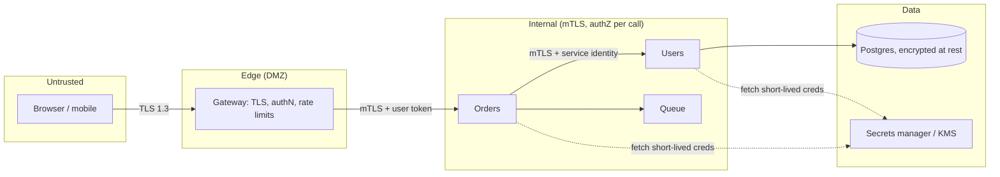

A design review is going well. The architecture has a gateway, a dozen services, a queue, two databases and a cache. Someone asks: "when the reporting service calls the user service, how does the user service know it is the reporting service, and what stops it from asking for any user's data?" Silence. The internal network was trusted, every service could call every other with any argument, and the one compromised container (a dependency with a known vulnerability in the image) could read the entire user table through an API that was never meant to be called by anyone but the mobile app.

Security in design is not a checklist applied after the diagram is drawn; it is a set of questions asked while drawing it. Where are the trust boundaries? What is the identity of each caller, and how is it proven? What is each identity allowed to do? Where do secrets live and how do they rotate? What does an attacker who gets past one boundary gain? This lesson gives you the questions, the standard mechanisms for answering them, and the failures a senior interviewer will probe for.

## Threat modelling on the diagram

Start with the architecture diagram and draw the trust boundaries: the edges where the level of trust changes. Internet to gateway. Gateway to internal services. Service to database. Your account to a third-party API. Each boundary crossing is where authentication and authorization happen, and where data changes from untrusted to validated.



Then, per boundary, run STRIDE as a prompt list: **S**poofing (can a caller pretend to be someone else?), **T**ampering (can data be modified in transit or at rest?), **R**epudiation (can an actor deny an action? do you have an audit log?), **I**nformation disclosure (what leaks in logs, errors, caches?), **D**enial of service (what happens under abuse?), **E**levation of privilege (what does one compromised component reach?). Name the assets (user PII, payment tokens, session keys, the signing key for tokens) and the attacker (an anonymous internet user, a malicious tenant, a compromised container, an insider with read access to logs). Ten minutes of this on a whiteboard finds the reporting-service hole above.

```viz
{"type": "system", "scenario": "request-flow", "nodes": 4,
 "title": "A request crossing three trust boundaries", "caption": "At each boundary the caller is authenticated and its request authorised. The gateway verifies the user; each internal hop verifies the calling service's identity and checks that the user context permits this operation on this resource."}
```

## Authentication: who is calling

**Users.** Passwords hashed with a slow, salted hash (argon2id or bcrypt with a cost tuned to ~100 ms), never reversible encryption; multi-factor for anything that matters; passwordless (passkeys/WebAuthn) where the product allows. Credential stuffing (replaying leaked passwords from other sites) is the dominant attack on login endpoints; rate limits per account and per IP, breached-password checks and MFA are the defences.

**Sessions vs JWTs.** After login the client needs something to present on each request.

| | Server-side session | JWT (stateless token) |
|---|---|---|
| Verification | Lookup in a session store (Redis, ~1 ms) | Signature check, no I/O (~50 microseconds) |
| Revocation | Delete the session: immediate | Cannot revoke before expiry without a denylist, which reintroduces the lookup |
| Scaling | Session store must be shared and available | Any instance verifies with the public key |
| Payload | Server holds state | Claims travel with the token: user ID, roles, expiry |
| Typical lifetime | Hours, sliding | Access token 5 to 15 minutes; refresh token days, stored server-side and revocable |

The senior pattern is the hybrid: short-lived JWT access tokens (verified statelessly by every service) issued from a longer-lived refresh token that is stored server-side and can be revoked. Logout or compromise revokes the refresh token; the access token's remaining minutes are the accepted exposure. A JWT with a 24-hour expiry and no revocation is the mistake to name.

Browser storage: a cookie with `HttpOnly; Secure; SameSite=Lax` is unreadable by JavaScript (XSS cannot steal it) but is sent automatically (so CSRF protection is needed: SameSite plus a CSRF token for state-changing requests). A token in `localStorage` is immune to CSRF and completely exposed to XSS. For browsers, the cookie wins.

**OAuth 2.0 and OIDC.** OAuth 2.0 is delegation: a user lets application A access their data at service B without giving A their B password. OIDC layers identity on top: an ID token (a JWT about who the user is) alongside the access token (a credential for calling APIs). The flows to know:

- **Authorization code with PKCE**: for web, mobile and single-page apps. The client redirects to the identity provider, the user authenticates there, the provider redirects back with a one-time code, the client exchanges the code for tokens. PKCE (a hashed secret bound to the request) stops a stolen code being exchanged by someone else. Implicit flow is deprecated; do not propose it.
- **Client credentials**: for service-to-service with no user; the service authenticates with its own credential and gets an access token scoped to what it may do.

Scopes (`orders:read`) limit what the token may do; claims (`sub`, `tenant_id`, `roles`) say who it is for. A downstream service validates the signature, the issuer, the audience (is this token meant for me?) and the expiry, on every request, in about 50 microseconds.

**Services.** Inside the perimeter, every call carries a service identity. Mutual TLS gives each workload a certificate (short-lived, minutes to hours, issued by an internal CA and rotated automatically; SPIFFE/SPIRE is the standard shape, and a service mesh makes it uniform) so the user service knows the caller is the reporting service, and can refuse it. The user's context travels separately, as the user's token or a signed assertion forwarded by the gateway, so the user service can check both "is this service allowed to call me" and "is this user allowed to see this record".

```viz
{"type": "network", "scenario": "https-tls-handshake",
 "title": "TLS 1.3 handshake", "caption": "One round trip establishes keys and authenticates the server; with mutual TLS the client also presents a certificate and the server verifies it. Inside a mesh this happens between sidecars for every connection, giving each hop a proven identity."}
```

## Authorization: what the caller may do

Authentication without authorization is the reporting-service hole: known caller, unlimited access.

| Model | Mechanism | Fits | Weakness |
|---|---|---|---|
| RBAC | User has roles; roles have permissions | Small fixed set of roles (admin, support, viewer) | Role explosion when permissions depend on the resource |
| ABAC | Policy over attributes of subject, resource, action, context (`allow if resource.owner == subject.id and time in business hours`) | Rich rules, compliance | Policies get hard to audit; evaluation cost |
| ReBAC | Relationships as tuples: `doc:42#viewer@user:7`, `folder:9#viewer@group:eng#member`; check by graph walk | Sharing, hierarchies, multi-tenant (Google Zanzibar, its open-source descendants) | Check latency at scale requires caching and a consistent snapshot ("new enemy" problem) |

The check must happen at the resource, on every request, with the resource ID: `can(user, "read", order_7781)`, not `is_admin(user)`. Insecure direct object references (change the ID in the URL and read someone else's order) remain one of the most common real vulnerabilities, and they are an authorization check that was never written. Multi-tenant systems make `tenant_id` part of every query by construction (row-level security in Postgres, or a repository layer that refuses queries without it).

Least privilege applies to services and infrastructure too: the reporting service's database role can read the reporting schema and nothing else; its cloud role can read one bucket; a compromised reporting container gets exactly that. Over-broad IAM roles ("this pod can do anything in the account, it was easier") are the elevation-of-privilege path in most cloud breaches.

## Secrets and keys

**Where secrets live.** In a secrets manager (Vault, a cloud KMS-backed store), fetched at startup or on demand by a workload that authenticates with its own identity (the mTLS certificate, the cloud instance identity). Never in the repository, never in a container image, never in an environment file checked into anything; `.env` in git is a breach waiting for the first public fork. Secrets in logs are the second most common leak: redact at the logging library, and grep your logs for `password=` and `Bearer ` once a quarter.

**Rotation.** A secret that cannot be rotated without downtime will not be rotated. Design for two valid versions at once: the consumer accepts old and new, the producer switches, the old is retired. Short-lived credentials (database credentials issued for 1 hour by Vault, cloud credentials from instance identity, mTLS certs for 24 hours) make rotation continuous and a leaked credential worth little.

**Envelope encryption.** Encrypting terabytes with a single master key is slow (the KMS is a network call) and makes rotation a full rewrite. Instead: each object or row is encrypted with its own data encryption key (DEK); the DEK is encrypted with a key encryption key (KEK) held in the KMS; the encrypted DEK is stored beside the data. To read: fetch the encrypted DEK, ask the KMS to unwrap it (one small call, cacheable briefly), decrypt locally. To rotate the KEK: re-wrap the DEKs, not the data. To delete a user's data in a system that cannot delete (backups, an event log): destroy their DEK, and the ciphertext is noise. That last trick, crypto-shredding, is how event-sourced and backed-up systems meet deletion requirements.

**Encryption in transit and at rest.** TLS 1.3 everywhere, including inside the data centre; "the internal network is trusted" is the assumption every lateral-movement attack relies on. At rest: disk encryption stops the stolen-drive attack and nothing else (the database reads it transparently, so a SQL injection reads it too); field-level encryption for the columns that matter (card numbers, national IDs) limits what a database read exposes, at the cost of not being able to index or query those fields.

## Rate limiting and abuse

Every unauthenticated endpoint is an abuse surface: login (credential stuffing), signup (account farming), password reset (enumeration), search (scraping), anything expensive (denial of wallet). Limits per identity where there is one, per IP with care (a university NAT is thousands of users on one IP; a botnet is one attacker on thousands), per device fingerprint, and per expensive resource. A token bucket per key with the burst sized for legitimate use; tighter buckets for login attempts per account (say 5 per minute, then a delay, then a lock with notification).

```viz
{"type": "system", "scenario": "token-bucket", "requests": 10,
 "title": "Per-account bucket on the login endpoint", "caption": "Legitimate users never exhaust a bucket of five attempts per minute. A credential-stuffing run against one account is throttled after five, and a distributed run across many accounts is caught by a second bucket keyed on IP range and device."}
```

Bot mitigation beyond limits: proof-of-work or CAPTCHA challenges triggered by risk signals, breached-credential detection at login, and anomaly detection on behaviour (10,000 password resets from one ASN). Responses should not reveal whether an account exists ("if that email is registered, we sent a link").

## Input, injection and SSRF

Everything crossing a trust boundary is validated against a schema before use, and passed to interpreters (SQL, shell, HTML, LDAP, templating) through parameterised interfaces, never string concatenation. The OWASP Top 10 is the list to check a design against ([Security fundamentals](/learn/senior-craft/software-craft/security-fundamentals) works through each); two deserve a place in every cloud design review:

**SSRF (server-side request forgery).** A feature that fetches a user-supplied URL (webhooks, link previews, image import) can be pointed at internal addresses, including the cloud metadata endpoint at `169.254.169.254`, which hands out the instance's credentials. Mitigations: resolve and validate the destination against an allow-list of public ranges, block link-local and private ranges, fetch through an egress proxy with no internal access, and require the metadata service's hardened mode (IMDSv2-style session tokens).

**Deserialisation and template injection.** Accepting serialised objects or templates from users is remote code execution with extra steps. Accept data (JSON against a schema), not code.

## Audit and PII

An audit log records who did what to which resource when, written to an append-only store that the application cannot modify, retained for the compliance period, and reviewed. Repudiation (an admin denies deleting the records) is only answerable with it.

PII handling is a design constraint: collect the minimum, tag it in the schema, encrypt the sensitive fields, restrict which services can read them (the recommendations pipeline does not need email addresses), set retention and enforce deletion. Deletion requests (GDPR and its relatives) must reach every copy: the primary database, replicas, caches (TTL bounds the exposure), search indexes, the data warehouse, backups (crypto-shredding), and the event log (tombstones plus crypto-shredding). A design that cannot enumerate every copy of a user's data cannot delete it.

## Failure modes

**Long-lived JWTs with no revocation.** A stolen 24-hour token is a 24-hour breach with no off switch. Detect: token lifetime in the auth config. Mitigate: 5 to 15 minute access tokens plus revocable refresh tokens.

**Secrets in logs or images.** A `docker history` or a log search reveals the database password. Detect: secret scanners on repos, images and log stores. Mitigate: secrets manager, redaction at the logger, short-lived credentials so a leak expires.

**Over-broad cloud roles.** A compromised pod with `*:*` permissions exfiltrates every bucket. Detect: IAM access analysis, unused-permission reports. Mitigate: one role per workload with the minimum set; deny by default.

**SSRF to the metadata endpoint.** Link-preview feature fetches `http://169.254.169.254/...` and returns the instance credentials to the attacker. Detect: egress logs to link-local addresses. Mitigate: egress allow-lists, an isolated fetcher, hardened metadata access.

**Missing authorization on internal APIs.** Any service (or anyone on the network) can call `GET /internal/users/{id}`. Detect: the threat model question above; internal endpoints without an authorization check in code review. Mitigate: mTLS service identity plus per-call authorization with the user context; no "internal means trusted".

**Rate limiting by IP behind a NAT.** A corporate customer's 5,000 users share one IP and get blocked; a botnet with 50,000 IPs walks through. Detect: 429s concentrated on one legitimate ASN; stuffing succeeding at low per-IP rates. Mitigate: key on account and device signals; use IP as one input to a risk score, not the key.

**Unindexed encrypted fields.** Card numbers encrypted field-level, then a feature needs to search by last four digits and the team decrypts the whole table into memory. Detect: the design review. Mitigate: store a separately derived searchable token (last four in clear, or an HMAC of the value) alongside the ciphertext.

## Interviewer follow-ups

**Q: "How does the orders service authenticate to the users service, and what stops it reading any user?"**

Two things, both checked on every call. Service identity: each workload has a short-lived mTLS certificate issued by the internal CA, so the users service knows the caller is orders and can enforce an allow-list of which services may call which endpoints. User context: the gateway validated the user's access token and forwards it (or a signed assertion of the user ID and tenant) with the request; the users service checks that the requested user record belongs to that user or tenant. The internal network is not trusted for anything: a compromised container has one service identity with one narrow allow-list and no user token, so it gets nothing.

**Q: "JWT or sessions for the web app?"**

Both, in their places. A short-lived JWT access token, 10 minutes, verified statelessly by every service with the identity provider's public key, so authorization needs no session-store lookup on each hop. A refresh token, stored server-side and revocable, that the client exchanges for new access tokens; logout, password change or compromise revokes it, and the exposure is the remaining minutes on the access token. In the browser the tokens live in `HttpOnly; Secure; SameSite` cookies, with a CSRF token on state-changing requests, not in `localStorage` where any XSS reads them. What I would not do is a 24-hour JWT with no revocation, which is a design where "log out" does not work.

**Q: "Where do the database credentials live, and what happens when one leaks?"**

Nowhere permanent. Each service authenticates to the secrets manager with its workload identity and receives a database credential valid for an hour, issued by the manager against the database; the credential rotates continuously and a leaked one is dead within an hour. The database role is scoped to the service's schema. If a leak is detected earlier, the manager revokes that lease immediately. No credential is in the repository, the image or an environment file, and the logging library redacts anything that looks like one.

**Q: "A user requests deletion. Where is their data?"**

I list the copies from the design: the primary and replicas (delete the rows), caches (TTL-bounded, plus an explicit purge), the search index (delete by user ID), the analytics warehouse (a scheduled deletion job against the user dimension), backups and the event log, which cannot delete individual records, so their per-user data is encrypted with a per-user DEK that I destroy, making those copies unreadable. The design has a data inventory that names every store holding PII, because a deletion I cannot enumerate is a deletion I cannot do.

**Q: "The link-preview feature fetches URLs users paste. What is the risk?"**

SSRF: a user pastes an internal address or the cloud metadata endpoint, and my fetcher, running with the service's network access and instance identity, returns internal data or credentials. The fetcher runs in an isolated environment with no route to internal ranges, resolves the hostname and checks the resolved IP against an allow-list of public ranges before connecting (and again after redirects, since a redirect can point anywhere), goes through an egress proxy that blocks link-local and private addresses, and the instances require hardened metadata access so even a request that gets through cannot obtain credentials.

## Senior signals

- You draw **trust boundaries** on the architecture diagram and run STRIDE across each one before anyone asks.
- You separate **authentication from authorization** and insist on a per-resource check with the resource ID on every call, including internal ones.
- You propose **short-lived access tokens plus revocable refresh tokens**, cookies over `localStorage` for browsers, and you can say what a 24-hour JWT costs.
- You give every service an **identity** (mTLS) and a **least-privilege role**, and you treat the internal network as hostile.
- You know **envelope encryption** and use it for rotation and crypto-shredding, and you keep secrets in a manager with short leases.
- You name **SSRF to the metadata endpoint** as the cloud-specific risk of any URL-fetching feature.

## Check yourself

```quiz
- q: >-
    A web app uses JWT access tokens valid for 24 hours with no server-side state. A user reports their laptop stolen. What can the system do?
  options: ["Force the token to expire by logging the user out everywhere", "Nothing before expiry, unless each request checks a denylist", "Rotate the signing key, which invalidates only that user's token", "Revoke the token immediately at the identity provider"]
  answer: 1
  explanation: >-
    Stateless verification means no per-request check against revocation, so there is nothing to revoke or log out server-side. A denylist reintroduces the lookup; rotating the signing key logs out every user, not just this one. Short-lived access tokens with revocable refresh tokens bound the exposure to minutes.
- q: >-
    Why is a service-to-service call authenticated with mTLS still insufficient on its own?
  options: ["It only works at the edge gateway, not between services", "mTLS authenticates the caller but leaves traffic unencrypted", "Its certificates expire too quickly to be relied on alone", "It proves which service calls, not what the user may access"]
  answer: 3
  explanation: >-
    Authentication answers who; authorization answers what they may do. A legitimate service can still be asked for another user's data unless the user context is checked per resource. mTLS does encrypt the traffic; that is not the gap.
- q: >-
    What is the purpose of envelope encryption (per-object data keys wrapped by a KMS key)?
  options: ["It makes bulk encryption faster than calling AES directly", "It removes the need for TLS between services and storage", "It lets encrypted fields be indexed and queried directly", "Key rotation re-wraps small data keys, not all the data"]
  answer: 3
  explanation: >-
    Data stays encrypted under its own key; only the small wrapped keys touch the KMS or need rewriting on rotation. It also lets you delete data by destroying its key: that renders every copy, including backups, unreadable (crypto-shredding). The data keys are still AES keys, so it is not a faster cipher.
- q: >-
    A feature fetches user-supplied URLs to render previews. The most important cloud-specific control is:
  options: ["Rate limiting preview fetches per user and per domain", "Fetching over HTTPS only, rejecting plain HTTP URLs", "Blocking private and metadata IPs after resolving DNS", "Caching previews so each URL is fetched only once"]
  answer: 2
  explanation: >-
    SSRF against the instance metadata endpoint yields instance credentials. Validation must block link-local and private ranges on resolved addresses and on every redirect, from an isolated fetcher and egress proxy with no internal reach. Rate limiting helps abuse but not this attack.
- q: >-
    Why should login attempts be rate limited per account rather than only per IP?
  options: ["Per-account counters are cheaper to store than per-IP ones", "Client IPs are hidden from the gateway by TLS termination", "Per-IP limits breach privacy rules on storing addresses", "Users share NAT IPs; attackers spread across many IPs"]
  answer: 3
  explanation: >-
    Many legitimate users share IPs behind NAT, while credential stuffing is distributed across thousands of IPs by design, so IP alone both over-blocks and under-blocks. Per-account buckets stop brute force on one account; device and ASN signals catch distributed campaigns; IP is one input to a risk score, not the key.
```
