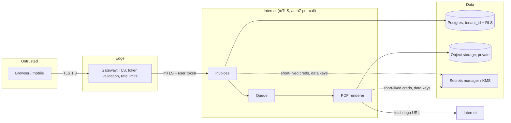

A design review is going well. The architecture has a gateway, a dozen services, a queue, two databases and a cache. Someone asks: "when the reporting service calls the user service, how does the user service know it is the reporting service, and what stops it from asking for any user's data?" Silence. The internal network was trusted, every service could call every other with any argument, and the one compromised container (a dependency with a known vulnerability in the image) could read the entire user table through an API that was never meant to be called by anyone but the mobile app.

Security in design is a set of questions asked while drawing the diagram, not a checklist applied afterwards. Where are the trust boundaries? What is each caller's identity, and how is it proven? What may each identity do? Where do secrets live and how do they rotate? What does an attacker who gets past one boundary gain? This lesson works those questions through one concrete design, with the mechanisms that answer them and the failures a senior interviewer probes for.

## Trust boundaries and STRIDE

Draw the trust boundaries on the architecture diagram: the edges where the level of trust changes. Each crossing is where authentication and authorization happen and where data goes from untrusted to validated.



**STRIDE** is the prompt list per element and flow: **S**poofing, **T**ampering, **R**epudiation, **I**nformation disclosure, **D**enial of service, **E**levation of privilege. Name the assets (invoice data, bank details, tokens, the signing key) and the attackers (an anonymous user, a malicious tenant, a compromised container, an insider reading logs). Worked on the design above, an invoicing API for a B2B SaaS where tenants render PDFs with their own logo and receive webhooks:

| Element | STRIDE | Threat | Mitigation |
|---|---|---|---|
| Browser → gateway | S | Stolen token replayed from another machine | 10-minute access tokens in `HttpOnly` cookies; rotating refresh tokens with reuse detection |
| Gateway → invoices | S, E | Client sends its own `X-Tenant-Id` header | Tenant taken only from the validated token; gateway strips inbound identity headers |
| Invoices API | E | `GET /invoices/{id}` with another tenant's ID (IDOR) | Lookup by `(tenant_id, id)`; row-level security as a second wall |
| Postgres | I | Pooled connection carries the previous tenant's setting | `SET LOCAL` inside the transaction; policies fail closed (traced below) |
| Queue → renderer | T | Forged render job for another tenant's invoice | Queue writable only by invoices' identity; renderer re-reads the invoice under the job's tenant |
| PDF renderer | I, E | Logo URL points at `169.254.169.254` (SSRF) | Isolated fetcher, egress proxy, IP checks after DNS and redirects, hardened metadata service |
| Object storage | I | Guessable PDF URLs or a public bucket | Private bucket; random keys; pre-signed URLs valid for minutes |
| Webhooks out | S | Tenant cannot tell our webhook from a forgery | HMAC signature with a per-tenant secret and a timestamp to stop replays |
| Admin actions | R | An admin denies voiding an invoice | Append-only audit log written by a role that cannot update or delete |
| Export endpoint | D | One tenant's bulk export starves the rest | Per-tenant token bucket; exports as quota-limited async jobs |

Ten rows, about fifteen minutes on a whiteboard, and every row is a design decision you would otherwise make in a postmortem. The reporting-service hole from the opening is the "Gateway → invoices" and "Invoices API" rows.

```viz
{"type": "system", "scenario": "request-flow", "nodes": 4,
 "title": "A request crossing three trust boundaries", "caption": "At each boundary the caller is authenticated and its request authorised. The gateway verifies the user; each internal hop verifies the calling service's identity and checks that the user context permits this operation on this resource."}
```

## Authentication: who is calling

**Passwords** are stored with a slow, salted, preferably memory-hard hash, never reversible encryption. Measured with Python 3.14's `hashlib` on one core: one SHA-256 takes 0.19 µs, PBKDF2-SHA256 at OWASP's 600,000 iterations takes 49 ms, and scrypt with $N = 2^{17}$, $r = 8$ takes 202 ms and 128 MB. The slowdown is the point: a GPU that tries on the order of ten billion plain SHA-256 guesses per second manages on the order of ten thousand PBKDF2 guesses, and a memory-hard function also limits how many guesses run in parallel. argon2id is the current recommendation where a library is available. Credential stuffing (replaying passwords leaked elsewhere) is the dominant attack on logins; per-account limits, breached-password checks and MFA or passkeys are the defences.

**Sessions versus JWTs.**

| | Server-side session | JWT access token |
|---|---|---|
| Verification | Session-store lookup, about a millisecond over the network | Signature check, no I/O: 2.6 µs for HS256 measured in pure Python; tens of µs for RS256 or ES256 |
| Revocation | Delete the session: immediate | Not before expiry without a denylist, which reintroduces the lookup |
| Scaling | Store must be shared and available | Any instance verifies with the issuer's public key |
| Lifetime | Hours, sliding | 5–15 minutes, renewed from a revocable refresh token |

The senior pattern is the hybrid: short-lived access tokens verified statelessly by every service, issued from a refresh token held server-side. Logout or compromise revokes the refresh token; the access token's remaining minutes are the accepted exposure. Refresh tokens rotate on each use, and presenting an already-used one revokes the whole family, which turns a stolen refresh token into a detected one. A 24-hour JWT with no revocation is the mistake to name. In browsers, tokens live in `HttpOnly; Secure; SameSite=Lax` cookies (unreadable by injected script) with a CSRF token on state-changing requests, not in `localStorage`, where any XSS reads them.

### OAuth 2.0 and OIDC, traced

OAuth 2.0 is delegation: application A gets scoped access to a user's data at service B without the user's password. OIDC adds identity: an ID token (a JWT saying who the user is) beside the access token (a credential for APIs). The authorization-code flow with PKCE, for web, mobile and single-page apps, using the example verifier from RFC 7636:

| Step | Who | What happens |
|---|---|---|
| 1 | Client | Generates a random `code_verifier` (`dBjftJeZ4CVP-mB92K27uhbUJU1p1r_wW1gFWFOEjXk`) and `code_challenge` = base64url(SHA-256(verifier)) = `E9Melhoa2OwvFrEMTJguCHaoeK1t8URWbuGJSstw-cM` |
| 2 | Client → IdP | Redirects to `/authorize?response_type=code&client_id=…&redirect_uri=…&scope=openid invoices:read&state=r4nd&code_challenge=E9Mel…&code_challenge_method=S256` |
| 3 | User ↔ IdP | Authenticates at the identity provider (password and MFA, or a passkey); the client never sees the credentials |
| 4 | IdP → client | Redirects to `redirect_uri?code=SplxlO&state=r4nd`; the client checks `state` matches, which stops login CSRF |
| 5 | Client → IdP | `POST /token` with the code, `redirect_uri` and the `code_verifier` |
| 6 | IdP | Checks SHA-256(verifier) equals the stored challenge, the code is unused and seconds to minutes old, and the redirect URI matches; returns access token, ID token and refresh token |
| 7 | Client → API | `Authorization: Bearer …`; the API checks signature (keys cached from the IdP's JWKS endpoint), `iss`, `aud`, `exp`, scope and tenant on every request |

An attacker who intercepts the code at step 4, through a malicious app registered for the same redirect scheme or a leaked log line, cannot complete step 5 without the verifier, which never left the client. The implicit flow, which returned tokens in the redirect, is deprecated. For service-to-service calls with no user, the **client-credentials** flow authenticates the service itself and returns a token scoped to what it may do. Sessions stored as hashed opaque tokens, timing-uniform login and CSRF layers are worked through in real application code in [Security fundamentals](/learn/senior-craft/software-craft/security-fundamentals).

**Services.** Inside the perimeter every call carries a service identity. Mutual TLS gives each workload a certificate valid for minutes to hours, issued by an internal CA and rotated automatically (SPIFFE/SPIRE is the standard shape; a mesh makes it uniform), so the user service knows the caller is reporting and can refuse it ([TLS and PKI](/learn/networking/fundamentals/tls-and-pki) covers certificates and chains). The user's context travels separately, as the user's token or a signed assertion from the gateway, so the callee checks both "may this service call me" and "may this user see this record".

```viz
{"type": "network", "scenario": "https-tls-handshake",
 "title": "TLS 1.3 handshake", "caption": "One round trip establishes keys and authenticates the server; with mutual TLS the client also presents a certificate and the server verifies it. Inside a mesh this happens between sidecars for every connection, giving each hop a proven identity."}
```

## Authorization: what the caller may do

| Model | Mechanism | Fits | Weakness |
|---|---|---|---|
| RBAC | Users have roles; roles have permissions | A small fixed set of roles | Role explosion when permission depends on the resource |
| ABAC | Policy over attributes of subject, resource, action, context | Rich rules, compliance | Hard to audit; evaluation cost |
| ReBAC | Relationship tuples (`doc:42#viewer@user:7`), checked by graph walk | Sharing, hierarchies (Google's published Zanzibar design and its open-source descendants) | Check latency needs caching and consistent snapshots |

The check happens at the resource, on every request, with the resource ID: `can(user, "read", invoice_7781)`, not `is_admin(user)`. Insecure direct object references (change the ID in the URL, read another customer's invoice) remain one of the most common real vulnerabilities, and each one is an authorization check nobody wrote. Least privilege applies to infrastructure too: a workload's database role reads its schema and nothing else, and its cloud role reads one bucket. Over-broad roles ("the pod can do anything, it was easier") are the elevation-of-privilege path in most cloud breaches.

## Multi-tenant isolation

| Model | Isolation | Cost per tenant | Noisy neighbour | Operations |
|---|---|---|---|---|
| Silo: database (or account) per tenant | Strongest; a bug leaks one tenant | Highest; idle capacity per tenant | None | N migrations, N backups, fleet tooling |
| Bridge: schema per tenant | Good; relies on connection routing | Medium | Shared hardware | Migrations × N schemas; catalogue bloat past thousands |
| Pool: shared tables with `tenant_id` | Only as good as every query | Lowest | Real; needs per-tenant quotas | One schema; isolation lives in code and policy |

Most SaaS runs the pool model for the long tail and silos the largest or most regulated tenants. In the pool model, Postgres row-level security puts a second wall under the application's `WHERE tenant_id = …`:

```sql
ALTER TABLE invoices ENABLE ROW LEVEL SECURITY;
ALTER TABLE invoices FORCE ROW LEVEL SECURITY;          -- apply to the table owner too
CREATE POLICY tenant_isolation ON invoices
  USING (tenant_id = current_setting('app.tenant_id', true)::uuid);
-- per request:
BEGIN;
SET LOCAL app.tenant_id = '6f1c2a9e-0000-4000-8000-000000000001';
SELECT * FROM invoices WHERE id = $1;                   -- another tenant's id: zero rows
COMMIT;                                                  -- SET LOCAL ends here
```

The trap is the connection pool. Traced with plain `SET` instead of `SET LOCAL`:

| Step | Pooled connection c1 | Request | Rows visible |
|---|---|---|---|
| 1 | `SET app.tenant_id = A` (session-wide) | Tenant A lists invoices | A's |
| 2 | Returned to the pool; the setting persists | — | — |
| 3 | Borrowed by a job that forgets to set the tenant | Lists invoices | **A's**, to the wrong caller |

With `SET LOCAL` the setting dies at `COMMIT`, so at step 3 `current_setting('app.tenant_id', true)` returns null, the policy compares to null, and the query returns zero rows: it fails closed. Two further holes: superusers and roles with `BYPASSRLS` ignore policies, so the application's role must have neither, and table owners ignore them unless `FORCE` is set. Isolation also covers capacity: per-tenant rate limits and query timeouts, so one tenant's export cannot starve the others.

## Secrets and keys

**Where secrets live.** In a secrets manager (Vault, a cloud store backed by a KMS), fetched by a workload that authenticates with its own identity. Never in the repository, the image or a committed environment file. Secrets in logs are the second most common leak: redact in the logging library and scan log stores.

**Rotation.** A secret that cannot rotate without downtime will not be rotated. Accept two versions at once: consumers accept old and new, the producer switches, the old one is retired. Short-lived credentials (database users issued for an hour by Vault, cloud credentials from instance identity, mTLS certificates for a day) make rotation continuous and a leak short-lived.

### Under the hood: envelope encryption, traced

Encrypting terabytes directly under a KMS key would make every read a network call and every rotation a rewrite. Envelope encryption keeps the key-encryption key (KEK) inside the KMS and encrypts data with data keys (DEKs):

| Step | Operation | KMS calls | Data touched |
|---|---|---|---|
| Write | KMS generates a DEK and returns it plaintext and wrapped under `tenant-a/v1`; the app encrypts locally with AES-256-GCM and stores the wrapped DEK beside the ciphertext | 1 | Encrypted once |
| Read | KMS unwraps the DEK; the app decrypts locally (cache the DEK for minutes to avoid a call per read) | 1, or 0 when cached | None rewritten |
| Rotate KEK to `v2` | KMS re-wraps each DEK from v1 to v2 without revealing it | 1 per DEK | **None**: ciphertext unchanged |
| Crypto-shred | Destroy the tenant's KEK (or a user's DEK) | 1 | Every copy, including backups and event logs, becomes unreadable |

The number of DEKs is a design choice: per row makes rotation a call per row (ten million calls, against account quotas of thousands to tens of thousands per second and a list price on the order of a few cents per ten thousand requests), per tenant or per file keeps it small. Runnable against the `cryptography` package, with a toy class in place of the cloud KMS:

```python
import os
from cryptography.hazmat.primitives.ciphers.aead import AESGCM   # pip install cryptography

class ToyKMS:
    """Stands in for a cloud KMS: key-encryption keys never leave it; every call is a network round trip."""
    def __init__(self):
        self.keks, self.calls = {}, 0
    def create_key(self, key_id):
        self.keks[key_id] = AESGCM.generate_key(bit_length=256)
    def generate_data_key(self, key_id):
        self.calls += 1
        dek = AESGCM.generate_key(bit_length=256)
        nonce = os.urandom(12)
        wrapped = nonce + AESGCM(self.keks[key_id]).encrypt(nonce, dek, key_id.encode())
        return dek, wrapped                              # plaintext DEK for local use, wrapped DEK to store
    def decrypt(self, key_id, wrapped):
        self.calls += 1
        return AESGCM(self.keks[key_id]).decrypt(wrapped[:12], wrapped[12:], key_id.encode())
    def re_encrypt(self, old_id, new_id, wrapped):      # rotation: the DEK is re-wrapped inside the KMS
        self.calls += 1
        dek = AESGCM(self.keks[old_id]).decrypt(wrapped[:12], wrapped[12:], old_id.encode())
        nonce = os.urandom(12)
        return nonce + AESGCM(self.keks[new_id]).encrypt(nonce, dek, new_id.encode())
    def schedule_deletion(self, key_id):
        del self.keks[key_id]                            # real KMSs enforce a waiting period first

def encrypt_record(kms, key_id, record_id, plaintext):
    dek, wrapped = kms.generate_data_key(key_id)
    nonce = os.urandom(12)
    body = AESGCM(dek).encrypt(nonce, plaintext, record_id.encode())   # record id as associated data
    return {"kek": key_id, "wrapped_dek": wrapped, "nonce": nonce, "body": body}

def decrypt_record(kms, record_id, row):
    dek = kms.decrypt(row["kek"], row["wrapped_dek"])
    return AESGCM(dek).decrypt(row["nonce"], row["body"], record_id.encode())

kms = ToyKMS()
kms.create_key("tenant-a/v1"); kms.create_key("tenant-a/v2")
row = encrypt_record(kms, "tenant-a/v1", "inv_1", b"IBAN GB33BUKB20201555555555")
print(decrypt_record(kms, "inv_1", row))                                 # the plaintext
row["wrapped_dek"] = kms.re_encrypt("tenant-a/v1", "tenant-a/v2", row["wrapped_dek"])
row["kek"] = "tenant-a/v2"                                               # rotated: body bytes untouched
print(decrypt_record(kms, "inv_1", row), "| KMS calls so far:", kms.calls)   # 4
kms.schedule_deletion("tenant-a/v2")                                     # crypto-shred the tenant
try:
    decrypt_record(kms, "inv_1", row)
except KeyError:
    print("unreadable: every copy of the body, including backups, is noise")
```

The record ID passed as associated data binds each ciphertext to its row, so an attacker with database write access cannot swap one tenant's encrypted IBAN into another's row. Cloud KMSs make key deletion deliberately slow (AWS KMS enforces a waiting period of 7 to 30 days), which protects against accidental shredding.

**At rest and in transit.** TLS 1.3 everywhere, inside the data centre too; "the internal network is trusted" is the assumption every lateral-movement attack relies on. Disk encryption stops the stolen-drive attack and nothing else, since the database decrypts transparently for any query, including an injected one. Field-level encryption protects the columns that matter at the cost of indexing them; store a separate searchable token (an HMAC of the value, or the last four digits) when a feature must look them up.

## Abuse, injection and SSRF

Every unauthenticated endpoint is an abuse surface: login (credential stuffing), signup (account farming), password reset (enumeration), anything expensive (denial of wallet). Limit per account and device with the algorithms in [Rate-limiting algorithms](/learn/networking/network-algorithms/rate-limiting-algorithms), use IP as one signal in a risk score rather than the key (thousands of users share a university NAT; a botnet is one attacker on thousands of addresses), and never reveal whether an account exists.

```viz
{"type": "system", "scenario": "token-bucket", "requests": 10,
 "title": "Per-account bucket on the login endpoint", "caption": "Legitimate users never exhaust a bucket of five attempts per minute. A credential-stuffing run against one account is throttled after five, and a distributed run across many accounts is caught by a second bucket keyed on IP range and device."}
```

Everything crossing a trust boundary is validated against a schema and reaches interpreters (SQL, shell, templates) through parameterised interfaces. Accept data, never serialised objects or templates. **SSRF** deserves its own line in every cloud review: a feature that fetches a user-supplied URL can be pointed at internal addresses, including the metadata endpoint at `169.254.169.254` that hands out the instance's credentials. Fetch from an isolated worker with no route inside, resolve the name and check the resolved IP against public ranges before connecting and again after every redirect, go through an egress proxy that blocks link-local and private ranges, and require session-token metadata access (IMDSv2 on AWS).

**Audit and PII.** An append-only audit log (who did what to which resource, when) is the only answer to repudiation. Collect the minimum PII, tag it in the schema, and keep an inventory of every store that holds it: primary and replicas, caches, search indexes, the warehouse, backups and event logs. Deletion must reach all of them, and for backups and event logs ([Event-driven architecture](/learn/system-design/building-blocks/event-driven-architecture)) that means crypto-shredding. [Authentication and security](/learn/case-study-ascend/the-system/authentication-and-security) walks through these decisions in this platform's own code.

## Failure modes

| Failure | Symptom | Diagnosis | Fix |
|---|---|---|---|
| Long-lived JWTs | A stolen token works for a day after "log out" | Access-token lifetime in the IdP config | 5–15 minute access tokens; rotating, revocable refresh tokens |
| Cross-tenant read via the pool | A customer sees another tenant's invoice, rarely and unreproducibly | Session-level `SET` of the tenant on pooled connections | `SET LOCAL` in a transaction; policies that fail closed; tests with two tenants |
| Missing authorization on internal APIs | A compromised service reads any user | Internal endpoints with no per-resource check | mTLS identity plus per-call authorization with user context |
| Secrets in logs or images | A password found by `docker history` or a log search | Secret scanners on repos, images, log stores | Secrets manager, redaction at the logger, short leases |
| Over-broad cloud roles | One pod exfiltrates every bucket | IAM analysis shows unused wildcard permissions | One role per workload, deny by default |
| SSRF to metadata | Instance credentials used from outside the account | Egress to link-local addresses in flow logs | Isolated fetcher, post-DNS IP checks, hardened metadata |
| Rate limiting by IP | A corporate customer blocked while stuffing succeeds | 429s concentrated on one legitimate ASN | Key on account and device; IP as a risk signal |

## Interviewer follow-ups

**"How does orders authenticate to users, and what stops it reading any user?"** Model answer: service identity from a short-lived mTLS certificate, checked against an allow-list of callers per endpoint; user context forwarded from the gateway, checked against the record's owner or tenant on every call. A compromised container gets one identity with a narrow allow-list and no user token. Common wrong answer: "they are on a private network", the assumption every lateral movement exploits.

**"JWT or sessions?"** Model answer: both: 10-minute access tokens verified statelessly (microseconds, no I/O), refresh tokens held server-side, rotated on use and revocable, in `HttpOnly` cookies with CSRF protection. Common wrong answer: "JWTs, because they scale", with a 24-hour lifetime and no way to log out.

**"Why does PKCE matter if the code is single-use?"** Model answer: single-use stops replay after the legitimate client redeems it, not an attacker who redeems it first; PKCE binds the code to a verifier that never left the client, so a stolen code is worthless. Common wrong answer: "it replaces the client secret", which misses that it protects public clients who cannot keep one.

**"Pool or silo for tenants?"** Model answer: pool for the long tail, with `tenant_id` in every key, row-level security with `SET LOCAL` as a second wall, per-tenant quotas; silo the largest or regulated tenants who pay for it. Common wrong answer: "a database per tenant for everyone", which is thousands of migrations and idle instances for tenants paying a few dollars a month.

**"A user requests deletion. Where is their data?"** Model answer: I read it off the PII inventory: primary and replicas (delete), caches (purge, TTL-bounded), search (delete by user), warehouse (scheduled job), backups and event log (crypto-shred the user's key). Common wrong answer: "delete the user row", which leaves copies in six other stores.

## What mid-level engineers get wrong

- **Trusting the internal network.** One compromised container then reaches everything.
- **Authentication without per-resource authorization.** Known callers read any record by changing an ID.
- **Tenant from a header.** A client-supplied `X-Tenant-Id` makes every tenant any other tenant.
- **`SET` instead of `SET LOCAL` behind a pool.** The previous tenant's context leaks into the next request.
- **Fast hashes for passwords.** A plain or single-round hash turns a leaked table into cracked passwords within hours.
- **Encrypting at rest and calling it done.** Disk encryption does nothing against an injected query.

## Exercise: validate an access token's claims

```exercise
id: validate-claims
title: Check a decoded access token's claims before trusting it
prompt: |
  The signature has already been verified with a pinned algorithm. Check the
  decoded `claims` against `expected` at time `now` (seconds), in this order,
  and return the first failure, or `"ok"`:

  1. `iss` must equal `expected["iss"]`, else `"bad_issuer"`.
  2. `aud` may be a string or a list; it must contain `expected["aud"]`,
     else `"bad_audience"`.
  3. Expired if `exp` is missing or `now >= exp + leeway`: `"expired"`.
  4. If `nbf` is present and `now < nbf - leeway`: `"not_yet_valid"`.
  5. `scope` is a space-separated string; it must contain
     `expected["scope"]` as a whole token, else `"insufficient_scope"`.
  6. `tenant` must equal `expected["tenant"]`, else `"wrong_tenant"`.

  `leeway` is `expected["leeway"]`, the tolerated clock skew in seconds.
languages: [python, javascript]
entry: validate_claims
starter:
  python: |
    def validate_claims(claims, now, expected):
        # your code here
        return "ok"
  javascript: |
    function validate_claims(claims, now, expected) {
      // your code here
      return "ok";
    }
tests:
  - args: [{"iss": "https://id.example.com", "aud": "orders-api", "exp": 1000, "nbf": 0, "scope": "orders:read orders:write", "tenant": "t1"}, 900, {"iss": "https://id.example.com", "aud": "orders-api", "scope": "orders:read", "tenant": "t1", "leeway": 30}]
    expected: "ok"
    label: a valid token
  - args: [{"iss": "https://id.example.com", "aud": "orders-api", "exp": 1000, "nbf": 0, "scope": "orders:read orders:write", "tenant": "t1"}, 1030, {"iss": "https://id.example.com", "aud": "orders-api", "scope": "orders:read", "tenant": "t1", "leeway": 30}]
    expected: "expired"
    label: expired once now reaches exp plus leeway
  - args: [{"iss": "https://id.example.com", "aud": ["billing-api", "orders-api"], "exp": 1000, "nbf": 0, "scope": "orders:read orders:write", "tenant": "t2"}, 900, {"iss": "https://id.example.com", "aud": "orders-api", "scope": "orders:read", "tenant": "t1", "leeway": 30}]
    expected: "wrong_tenant"
    label: audience list accepted, tenant checked
  - args: [{"iss": "https://id.example.com", "aud": "billing-api", "exp": 1000, "nbf": 0, "scope": "orders:read orders:write", "tenant": "t1"}, 900, {"iss": "https://id.example.com", "aud": "orders-api", "scope": "orders:read", "tenant": "t1", "leeway": 30}]
    expected: "bad_audience"
    label: token minted for another API
  - args: [{"iss": "https://id.evil.example", "aud": "orders-api", "exp": 1000, "nbf": 0, "scope": "orders:read orders:write", "tenant": "t1"}, 900, {"iss": "https://id.example.com", "aud": "orders-api", "scope": "orders:read", "tenant": "t1", "leeway": 30}]
    expected: "bad_issuer"
    label: issuer is not the one you trust
  - args: [{"iss": "https://id.example.com", "aud": "orders-api", "exp": 1000, "nbf": 0, "scope": "orders:readonly", "tenant": "t1"}, 900, {"iss": "https://id.example.com", "aud": "orders-api", "scope": "orders:read", "tenant": "t1", "leeway": 30}]
    expected: "insufficient_scope"
    label: scopes are whole tokens, not substrings
  - args: [{"iss": "https://id.example.com", "aud": "orders-api", "exp": 1000, "nbf": 0, "scope": "orders:read orders:write", "tenant": "t1"}, 1029, {"iss": "https://id.example.com", "aud": "orders-api", "scope": "orders:read", "tenant": "t1", "leeway": 30}]
    expected: "ok"
    hidden: true
    label: inside the leeway
  - args: [{"iss": "https://id.example.com", "aud": "orders-api", "exp": 1000, "nbf": 1000, "scope": "orders:read orders:write", "tenant": "t1"}, 950, {"iss": "https://id.example.com", "aud": "orders-api", "scope": "orders:read", "tenant": "t1", "leeway": 30}]
    expected: "not_yet_valid"
    hidden: true
    label: not valid yet, beyond the leeway
hints:
  - "Normalise `aud` to a list before checking membership."
  - "Split `scope` on spaces; `\"orders:read\" in \"orders:readonly\"` is true for a substring check and wrong."
  - "Apply the leeway in the token's favour on both time checks."
```

## Senior signals

- You draw **trust boundaries** on the diagram and run STRIDE per element and flow, and can produce a table like the one above in fifteen minutes.
- You separate **authentication from authorization**, check per resource with the resource ID on every call, and take the tenant only from a validated token.
- You propose **short-lived access tokens with rotating, revocable refresh tokens**, can trace the authorization-code flow and say what PKCE defeats.
- You give every service an **identity** and a **least-privilege role**, and treat the internal network as hostile.
- You can defend a **tenancy model**, and you know the row-level-security pooling trap and how `SET LOCAL` fails closed.
- You use **envelope encryption** for rotation and crypto-shredding, keep secrets in a manager with short leases, and name **SSRF** for any URL-fetching feature.

## Check yourself

```quiz
- q: >-
    A web app uses JWT access tokens valid for 24 hours with no server-side state. A user reports their laptop stolen. What can the system do?
  options: ["Rotate the signing key, which invalidates only that user's token", "Nothing before expiry, unless each request checks a denylist", "Revoke the token immediately at the identity provider", "Force the token to expire by logging the user out everywhere"]
  answer: 1
  explanation: >-
    Stateless verification means no per-request check against revocation, so there is nothing to revoke or log out server-side. A denylist reintroduces the lookup; rotating the signing key logs out every user, not only this one. Short-lived access tokens with revocable refresh tokens bound the exposure to minutes.
- q: >-
    An attacker intercepts the authorization code in the redirect of an authorization-code flow that uses PKCE. Why can they not obtain tokens?
  options: ["The token request needs the verifier the client kept", "The code is encrypted with the client's public key", "The identity provider rejects codes from new IP addresses", "The state parameter binds the code to the user's cookie"]
  answer: 0
  explanation: >-
    The identity provider stored the challenge, a hash of the verifier, and only issues tokens to a request presenting a verifier that hashes to it. The verifier never left the client. The state parameter protects the client against login CSRF; it does not stop a stolen code being redeemed.
- q: >-
    A pooled service sets the tenant with SET app.tenant_id at the start of each request, and Postgres RLS filters on it. What can go wrong?
  options: ["A request that skips the SET sees the previous tenant's rows", "RLS policies are ignored when a connection pool is used", "Every query is slowed by a full scan to check the policy", "The setting is lost between the statements of a single transaction"]
  answer: 0
  explanation: >-
    A session-level SET persists on the pooled connection, so the next borrower inherits the last tenant. SET LOCAL ends at commit, and a policy using current_setting with the missing-ok flag then compares to null and returns no rows, failing closed. RLS still applies with a pool; the leak comes from session state.
- q: >-
    What is the purpose of envelope encryption (per-object data keys wrapped by a KMS key)?
  options: ["It lets encrypted fields be indexed and queried directly", "It removes the need for TLS between services and storage", "Key rotation re-wraps small data keys, not all the data", "It makes bulk encryption faster than calling AES directly"]
  answer: 2
  explanation: >-
    Data stays encrypted under its own key; only the small wrapped keys touch the KMS or need rewriting on rotation. It also lets you delete data by destroying its key: that renders every copy, including backups, unreadable (crypto-shredding). The data keys are still AES keys, so it is not a faster cipher.
- q: >-
    A feature fetches user-supplied URLs to render previews. The most important cloud-specific control is:
  options: ["Rate limiting preview fetches per user and per domain", "Fetching over HTTPS only, rejecting plain HTTP URLs", "Caching previews so each URL is fetched only once", "Blocking private and metadata IPs after resolving DNS"]
  answer: 3
  explanation: >-
    SSRF against the instance metadata endpoint yields instance credentials. Validation must block link-local and private ranges on resolved addresses and on every redirect, from an isolated fetcher and egress proxy with no internal reach. Rate limiting helps abuse but not this attack.
- q: >-
    Why is PBKDF2 with 600,000 iterations used for stored passwords instead of a single SHA-256?
  options: ["Each guess costs an attacker 600,000 times more work", "SHA-256 has known collisions that expose stored passwords", "PBKDF2 output is reversible for password resets", "A single SHA-256 is too slow for login at scale"]
  answer: 0
  explanation: >-
    The lesson measured 0.19 microseconds for one SHA-256 and 49 ms for PBKDF2 at 600,000 iterations: negligible per login, but it cuts an attacker's guess rate by the same factor. SHA-256 has no practical collisions, and password hashes are never reversible.
```
