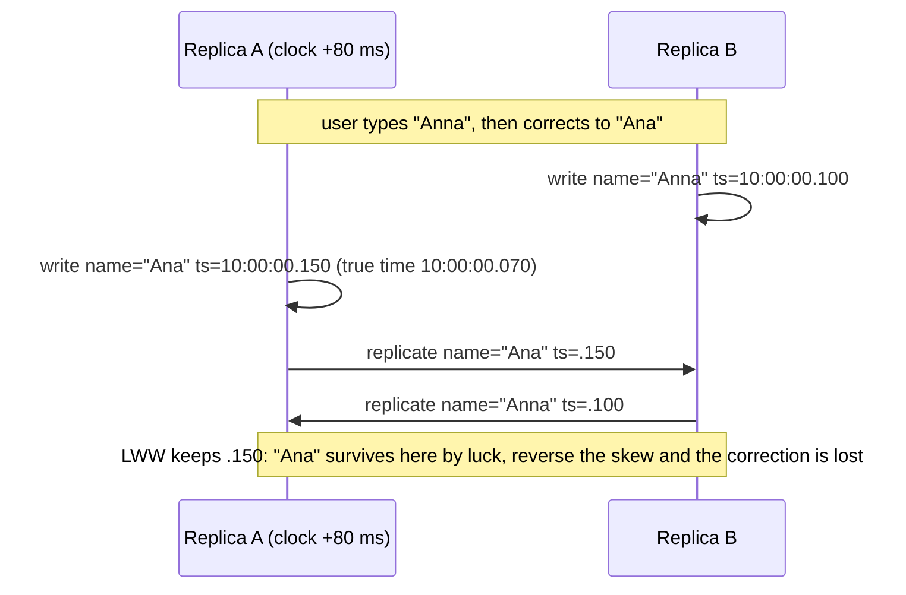

Two replicas of a user's profile receive updates at nearly the same moment: one sets the display name to "Ana", the other to "Anna". The system resolves the conflict by keeping the write with the later timestamp. Replica A's clock is 80 ms fast. "Ana", which the user typed second, loses. No error, no log line, no way to know it happened except that a user is now confused about why their correction did not stick.

Every distributed system needs to order events, and the obvious tool, the wall clock, is the wrong one. Clocks on different machines disagree by milliseconds on a good day and by seconds when something is wrong, and no protocol can tell you which clock is right. This lesson is about what clocks actually provide, what "before" can mean without them, and the logical clocks that let a system order events correctly, with the cases where physical time is nonetheless the right tool.

## What a physical clock actually gives you

A server's clock is a quartz oscillator counting ticks. Its frequency is off by a few to a few tens of parts per million: at 20 ppm, the clock drifts about 1.7 seconds per day if nothing corrects it. Temperature changes the rate. Two machines in the same rack drift apart from each other, not just from true time.

NTP corrects the drift by periodically asking a reference and slewing the clock toward it. On a LAN with a good local time source, accuracy is on the order of a millisecond; over the public internet it is tens of milliseconds, with excursions of hundreds under load or bad routes. NTP can also *step* the clock: if it is too far off, it jumps, which means wall time can go backwards. Leap seconds have caused a minute of 61 seconds to crash software that assumed otherwise; the large providers now "smear" the leap second across a day so no single second is abnormal, which means their clocks deliberately disagree with UTC by up to half a second during the smear.

The consequences for code:

**Wall clock vs monotonic clock.** `time.time()` / `Date.now()` / `CLOCK_REALTIME` reads wall time, which NTP can jump forwards or backwards. `time.monotonic()` / `performance.now()` / `CLOCK_MONOTONIC` reads a counter that only moves forwards, with no relation to calendar time. Durations (timeouts, latency measurements, lease lengths) use the monotonic clock; timestamps for humans and logs use the wall clock. Mixing them produces the classic bug: a timeout computed as `deadline = time.time() + 30` fires immediately when NTP steps the clock forward 40 seconds, or never when it steps back.

```python
# Wrong: a clock step changes how long this waits
deadline = time.time() + 30
while time.time() < deadline: ...

# Right: monotonic time is unaffected by NTP
deadline = time.monotonic() + 30
while time.monotonic() < deadline: ...
```

**No two machines share a clock.** A timestamp assigned on machine A and compared with one assigned on machine B carries A's and B's errors. When the events are minutes apart the comparison is fine; when they are within the clocks' error bound (say 10 ms) the comparison is noise. The "Ana"/"Anna" example is that noise deciding a user's data.

## Happens-before

Leslie Lamport's 1978 insight was that you do not need a clock to define order; you need causality. Define the relation "a happened before b", written a → b, by three rules:

1. If a and b are events in the same process and a comes first in that process's execution, a → b.
2. If a is the sending of a message and b is the receipt of that message, a → b.
3. If a → b and b → c, then a → c.

If neither a → b nor b → a, the events are **concurrent**: neither could have influenced the other. This is a partial order. It captures exactly what a distributed system can know about ordering without a shared clock: information flows only through messages, so an event can only have been influenced by events that reach it through a chain of messages.

Concurrency in this sense is not "at the same time". Two writes an hour apart on two replicas that have not communicated are concurrent: neither knew about the other. That is the situation in which a system needs a conflict rule, and it is the situation a logical clock is designed to detect.

## Lamport clocks

A Lamport clock assigns each event an integer such that if a → b then L(a) < L(b). The rules:

- Each process keeps a counter, starting at 0.
- Before each local event, increment the counter; the event's timestamp is the new value.
- When sending a message, include the sender's counter.
- On receiving a message with timestamp t, set the counter to max(counter, t) + 1; the receive event gets that value.

```viz
{"type": "system", "scenario": "lamport-clock", "nodes": 3,
 "title": "Lamport clocks across three processes", "caption": "Each process increments on local events and jumps forward on receipt of a message carrying a larger timestamp. Any causal chain has strictly increasing timestamps; two events with unrelated timestamps may or may not be concurrent."}
```

A worked example with three processes:

| Step | P1 | P2 | P3 | Notes |
|---|---|---|---|---|
| P1 local event a | 1 | | | |
| P1 sends m1 (t=1) to P2 | | | | |
| P2 local event b | | 1 | | P2 had not received m1 yet |
| P2 receives m1 | | max(1,1)+1 = 2 | | |
| P2 sends m2 (t=2) to P3 | | | | |
| P3 local event c | | | 1 | |
| P3 receives m2 | | | max(1,2)+1 = 3 | |
| P1 local event d | 2 | | | |

Check the guarantee: a → (receive m1) → (send m2) → (receive m2), and the timestamps run 1, 2, 2, 3. Good. Now look at b (P2, timestamp 1) and d (P1, timestamp 2). L(b) < L(d), but b did not happen before d; nothing from P2 ever reached P1. The Lamport clock is **consistent with** happens-before but does not **characterise** it: L(a) < L(b) tells you b did not happen before a, and nothing more. You cannot use Lamport timestamps to detect that two writes were concurrent.

What they are good for is a total order that respects causality. Break ties by process ID: order events by (timestamp, process_id). Every process computes the same order, and any causally related pair is ordered correctly. That is enough for a replicated state machine to apply operations in the same order everywhere, for Lamport's mutual exclusion algorithm, and for the intuition behind ZooKeeper's zxid (an epoch and a counter that totally order all writes) and Raft's (term, index) pairs.

## Vector clocks

To detect concurrency, each process tracks what it knows about every process. A vector clock is an array with one counter per process:

- Each process keeps a vector V, all zeros initially.
- On a local event, increment your own entry: V[i] += 1.
- When sending, attach V.
- On receipt of vector W, set V[j] = max(V[j], W[j]) for every j, then increment your own entry.

Compare two vectors: V ≤ W if every entry of V is ≤ the corresponding entry of W. Then a → b if and only if V(a) < V(b) (≤ and not equal). If neither V(a) ≤ V(b) nor V(b) ≤ V(a), a and b are concurrent. This is the characterisation Lamport clocks lack.

```viz
{"type": "system", "scenario": "vector-clock", "nodes": 3,
 "title": "Vector clocks detecting concurrency", "caption": "Each process tracks a counter per process. Two events whose vectors are incomparable, each larger in some entry, are concurrent: neither could have known about the other. That is the case that needs a merge rule."}
```

The same scenario as above, with vectors [P1, P2, P3]:

| Event | Vector | Reasoning |
|---|---|---|
| a (P1 local) | [1,0,0] | |
| P1 sends m1 with [1,0,0] | | |
| b (P2 local) | [0,1,0] | |
| P2 receives m1 | [1,2,0] | max([0,1,0],[1,0,0]) then increment own |
| P2 sends m2 with [1,2,0] | | |
| c (P3 local) | [0,0,1] | |
| P3 receives m2 | [1,2,2] | max([0,0,1],[1,2,0]) then increment own |
| d (P1 local) | [2,0,0] | |

Now compare b = [0,1,0] and d = [2,0,0]: b has a larger P2 entry, d has a larger P1 entry, so they are incomparable, so **concurrent**. Correct: nothing linked them. Compare a = [1,0,0] and (receive m2) = [1,2,2]: a ≤ it and not equal, so a → receive m2. Correct: a chain of two messages links them.

This is what Amazon's Dynamo and Riak use to detect that two clients wrote the same key concurrently. Instead of picking one, the store keeps both versions as siblings and returns them on the next read, and the client merges (for a shopping cart: union). When a client writes after reading, its write's vector dominates both siblings and they collapse. The cost is O(n) metadata per object in the number of writers, and in a system where clients are the writers, that grows without bound; Riak prunes old entries by timestamp and size, trading exactness for bounded metadata. **Version vectors** are the variant with one entry per replica rather than per client, which is what most production systems actually use, and dotted version vectors fix a subtle sibling-explosion problem in the plain version.

## Hybrid logical clocks and TrueTime

Logical clocks order events but say nothing about when they happened, which people and time-based queries ("as of 10:32") care about. Two approaches combine physical and logical time.

**Hybrid logical clocks (HLC)** carry a physical component (wall time, roughly synchronised) and a logical counter. The physical part is the max of the local clock and any timestamp received; the logical counter breaks ties and advances when the physical part cannot. The result is close to wall time (within the clock error), never goes backwards, and preserves happens-before like a Lamport clock. CockroachDB uses HLCs for transaction timestamps, with a configured maximum clock offset (500 ms by default) that bounds how much uncertainty a read must tolerate: a read may have to restart if it encounters a write with a timestamp within the uncertainty window.

**TrueTime** is Google's answer for Spanner: GPS and atomic clocks in every data centre, and an API that returns not a timestamp but an interval [earliest, latest] guaranteed to contain true time, with ε on the order of a few milliseconds. A transaction takes its commit timestamp from the interval's latest bound and then **waits out the uncertainty** (commit wait, ~ε) before releasing its locks, so that any transaction that starts after this one finished will see a strictly greater timestamp. That is how Spanner provides external consistency, linearizability across the whole database, without a global coordinator: the physical clock is good enough, and the system knows exactly how good.

The lesson from both: physical time is usable for ordering *only* if you know its error bound and design for it. Ordinary NTP does not give you the bound, which is why ordinary systems should not use timestamps for correctness.

## What to do in practice

| Need | Use |
|---|---|
| Timeouts, durations, latency, lease lengths | Monotonic clock, always |
| Timestamps in logs, events, for humans | Wall clock, UTC, with the knowledge that they are approximate across machines |
| TTLs and expiry | Wall clock is fine; a few seconds of error is harmless |
| Total order of operations in one replicated log | A sequence number from the leader (Raft index, zxid), not a timestamp |
| Detecting concurrent writes across replicas | Version vectors, or a single-writer design that avoids the question |
| Resolving concurrent writes | A merge rule: CRDT, application merge, or an explicit "last writer by logical order wins" with the understanding that it discards data |
| Cross-node ordering with wall-clock meaning | HLC, with a configured maximum offset and reads that handle uncertainty |

The rule that covers most of it: **never let a wall-clock comparison decide correctness between machines**. Last-writer-wins with NTP timestamps is a data-loss policy that fires silently and at random, and it is the default in several popular stores (Cassandra resolves cell conflicts by timestamp). Choosing it is legitimate for data where losing a concurrent write is acceptable (a user's "last seen" time); it is negligent for data where it is not.



[Replication strategies](/learn/system-design/distributed-systems/replication-strategies) covers where conflicts come from; [CRDTs](/learn/system-design/distributed-systems/crdts-and-collaboration) covers merges that never lose data; [Failure detection and leases](/learn/system-design/distributed-systems/failure-detection-and-leases) covers the other place clocks matter, where a lease holder and a lease grantor must agree on when time is up.

## Failure modes

**LWW drops the newer write.** The opening story. Detect: hard, which is the problem; conflict counters on replication, and user reports of "my change reverted". Mitigate: version vectors with sibling merge, CRDTs, or single-writer per key.

**Lease computed with wall time across machines.** Holder thinks its lease runs to 10:00:30 by its clock; grantor thinks it expired at 10:00:29.9 by its own; both act at once. Detect: two holders observed via fencing-token rejections. Mitigate: leases measured as durations on monotonic clocks, with a safety margin for drift, plus fencing tokens.

**Monotonic and wall time mixed.** A latency histogram shows negative values after an NTP step, or a timeout never fires. Detect: negative durations in metrics; stuck workers after a clock step. Mitigate: lint for `time.time()` in duration code; use the monotonic clock.

**Vector clocks that grow unbounded.** Every client that ever wrote is an entry; objects carry kilobytes of metadata. Detect: object size growing with writer count. Mitigate: version vectors per replica; pruning with an explicit policy.

**NTP step fires every timer.** The clock jumps forward two minutes; every wall-clock-based scheduler runs everything at once; cron jobs double-run or skip. Detect: bursts of scheduled work coinciding with clock adjustments. Mitigate: slew-only NTP configuration where possible; monotonic scheduling; idempotent jobs.

**Ordering by timestamp in a queue consumer.** Events from two producers are sorted by their timestamps to "restore order"; the producers' clocks differ by 40 ms; causally later events are applied first. Detect: state that contradicts the producer's own history. Mitigate: order by the log's sequence number; partition by key so one producer's events are already ordered.

## Interviewer follow-ups

**Q: "Two data centres update the same record within 50 ms of each other. Which wins?"**

Neither, by timestamp: the clocks may differ by more than 50 ms, so the comparison is meaningless, and last-writer-wins would discard a write at random. If the record has a single home region, the other region's write is forwarded there and the home orders them by its own sequence, which is a real order. If both regions must accept writes locally, I keep a version vector per replica, detect that the writes are concurrent, and merge: a CRDT if the type allows, or the application's merge, or in the worst case a deterministic rule the product has agreed to, documented as lossy. The thing I say explicitly is that "later timestamp wins" is a data-loss policy, not a conflict-resolution strategy.

**Q: "What is the difference between a Lamport clock and a vector clock, and when would you pay for the vector?"**

A Lamport clock gives one integer per event, consistent with happens-before: if a caused b, L(a) < L(b). It cannot tell you that two events were concurrent, because unrelated events also get ordered integers. A vector clock carries one counter per participant and characterises happens-before exactly: incomparable vectors mean concurrent. I pay for the vector when I need to detect conflicts, in a multi-writer store. I use the Lamport-style single integer when I only need a consistent total order, which is what a leader's log index gives me for free.

**Q: "Why can Spanner use physical time when nobody else can?"**

Because it knows the error. TrueTime returns an interval that provably contains true time, kept to a few milliseconds by GPS and atomic clocks, and every commit waits out that interval before releasing locks. So two transactions that do not overlap in real time get timestamps in the right order, no matter which machine assigned them. Without the bound, waiting makes no sense: you do not know how long to wait. CockroachDB approximates it with hybrid logical clocks and a configured maximum offset, and restarts reads that fall inside the uncertainty window.

**Q: "You have a 10-second lease. How do you make sure the old holder stops before the new one starts?"**

I do not trust the clocks to agree, so the holder stops acting at, say, 7 seconds by its own monotonic clock, the grantor does not reassign until 10 seconds plus a drift margin by its own, and the resource being protected checks a fencing token that increases with every grant and rejects anything older. Even if a GC pause makes the old holder wake up believing it still has time, its stale token is rejected. Clocks give me the probable safety; the token gives me the guarantee.

**Q: "Where in your design do you use wall-clock time, and why is it safe there?"**

For TTLs on cache entries and idempotency keys, where a few seconds of error changes nothing; for event timestamps in logs and analytics, where humans want calendar time and small skew is acceptable; for "as of" queries against an HLC-timestamped store, where the uncertainty is bounded and handled. Nowhere in ordering, conflict resolution, or lease safety. Every duration in the code is measured on the monotonic clock, and that is a lint rule, not a convention.

## Senior signals

- You quote **clock error as numbers**: ppm drift, NTP accuracy on a LAN vs the internet, and you know clocks can step backwards.
- You reach for the **monotonic clock** for every duration and can name the bug that happens when someone does not.
- You define **happens-before** by the three rules and describe concurrency as "neither could have known about the other", not "at the same time".
- You can work a **Lamport clock and a vector clock by hand** and say exactly what each can and cannot detect.
- You call **last-writer-wins by wall clock** a data-loss policy and offer version vectors, CRDTs or single-writer designs instead.
- You know why **TrueTime's commit wait** works and why plain NTP cannot substitute for it.

## Check yourself

```quiz
- q: >-
    Event a has Lamport timestamp 3 and event b has Lamport timestamp 5. What can you conclude?
  options: ["a happened before b, because 3 is less than 5", "a and b are causally related, but the direction is unknown", "a and b are concurrent, since Lamport clocks ignore causality", "b did not happen before a; they may still be concurrent"]
  answer: 3
  explanation: >-
    Lamport clocks are consistent with happens-before (causal order implies increasing timestamps) but do not characterise it: unrelated events also get distinct integers. Only the reverse direction is ruled out; a and b may be causally related or concurrent. Vector clocks would decide.
- q: >-
    Two events have vector clocks [2,1,0] and [1,3,0]. They are:
  options: ["The second happened before the first, as entry two is larger", "The first happened before the second, as its sum is smaller", "Causally related, but a merge is needed to find the order", "Concurrent, since each exceeds the other in some entry"]
  answer: 3
  explanation: >-
    Neither vector is less than or equal to the other in every entry, so no causal path connects them. Sums and single entries do not decide order; only an entry-wise comparison does. This is exactly the case where a conflict rule or merge is required.
- q: >-
    A service computes a request deadline as time.time() + 30 and NTP steps the clock forward by 45 seconds during the request. What happens?
  options: ["Nothing; NTP adjustments are too small to matter", "The runtime recomputes the deadline against the new time", "The request waits 75 seconds, the sum of both intervals", "It times out at once, since the deadline is now in the past"]
  answer: 3
  explanation: >-
    Wall time jumped past the deadline. Durations must be measured on the monotonic clock, which NTP does not adjust. A backward step would have the opposite effect: the timeout fires late or never.
- q: >-
    Why can a multi-region store that resolves concurrent writes by comparing NTP timestamps lose data?
  options: ["Regions strip timestamps when forwarding replicated writes", "Skew can exceed the gap between writes, so the wrong one wins", "Each region rewrites the timestamps into its own local time zone", "Timestamps overflow and wrap around under a heavy write load"]
  answer: 1
  explanation: >-
    With tens of milliseconds of skew, writes within that window are ordered by clock error rather than reality: the write chosen as later may actually be earlier, and the loser is dropped silently. Version vectors detect the concurrency; CRDTs merge without loss.
- q: >-
    Spanner waits out the TrueTime uncertainty interval after choosing a commit timestamp. The purpose is:
  options: ["To let every replica apply the write before it is visible", "To batch concurrent commits into one Paxos round for throughput", "To give the GPS and atomic clocks time to resynchronise", "So any later transaction gets a strictly larger timestamp"]
  answer: 3
  explanation: >-
    Commit wait ensures the assigned timestamp is in the past on every machine's clock before the transaction becomes visible, so any transaction starting after this one completes receives a larger timestamp: real-time order and timestamp order agree (external consistency). It works only because the uncertainty is bounded and known.
```
