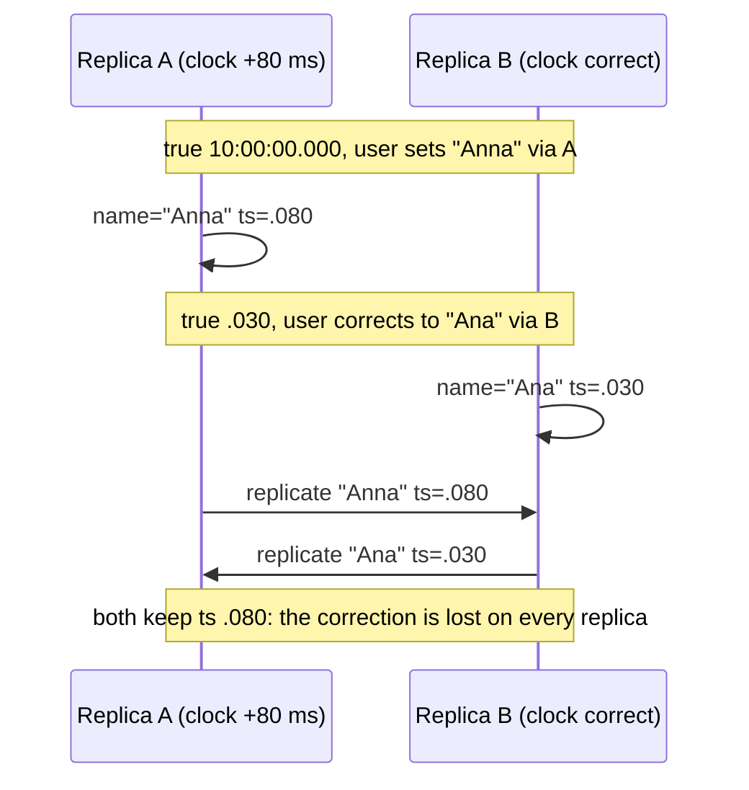
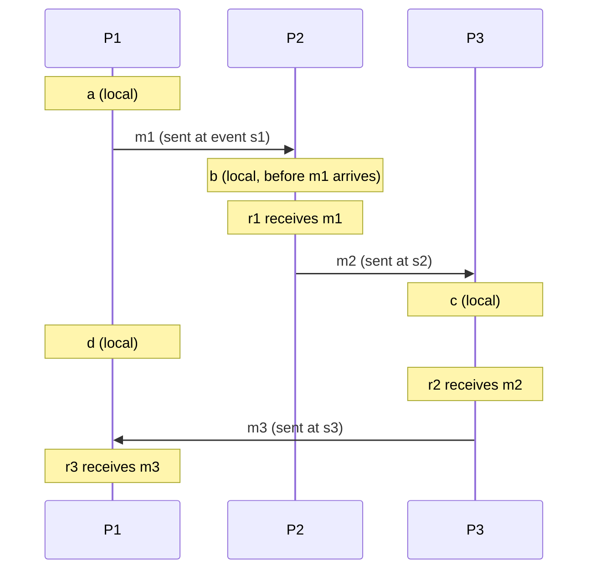

A user sets their display name to "Anna" through replica A, whose clock runs 80 ms fast, and 30 ms later corrects it to "Ana" through replica B, whose clock is right. A stamps the first write 10:00:00.080; B stamps the correction 10:00:00.030. The store resolves the conflict by keeping the later timestamp, so "Anna" wins on both replicas. No error, no log line, no way to know it happened except that a user is now confused about why their correction did not stick.

Every distributed system needs to order events, and the obvious tool, the wall clock, is the wrong one. Clocks on different machines disagree by milliseconds on a good day and by seconds when something is wrong, and no protocol can tell you which clock is right. This lesson measures how wrong clocks are, simulates what that does to last-writer-wins, traces the logical clocks that order events without physical time, and then shows the two designs (hybrid logical clocks and TrueTime) that use physical time safely because they know its error.

## What a physical clock actually gives you

A server's clock is a quartz oscillator counting ticks. Its frequency is off by a few to a few tens of parts per million (ppm), and temperature moves it. At 20 ppm an uncorrected clock drifts 20 × 10⁻⁶ × 86,400 s ≈ 1.7 s per day. Two machines in the same rack drift apart from each other, not only from true time. Spanner's time daemons assume a worst case of 200 ppm, ten times the typical figure, because a bound you rely on for correctness must cover bad hardware too.

**NTP** estimates the offset to a reference from four timestamps. The client sends at t1 (client clock), the server receives at t2 and replies at t3 (server clock), the client receives at t4:

$$\theta = \frac{(t_2 - t_1) + (t_3 - t_4)}{2}, \qquad \delta = (t_4 - t_1) - (t_3 - t_2)$$

Worked: t1 = 0, t2 = 30, t3 = 31, t4 = 12 (ms). The estimated offset θ = (30 + 19) / 2 = 24.5 ms (the server is ahead); the round-trip delay δ = 12 − 1 = 11 ms. NTP assumes the two directions took equal time. If the request actually took 10 ms and the reply 1 ms, the true offset is 20 ms, and the estimate is 4.5 ms off. The error is bounded by δ/2 = 5.5 ms, which is why accuracy tracks network delay and path asymmetry: on the order of a millisecond or less on a LAN with a local time source, tens of milliseconds over the internet, hundreds when a route is congested. PTP (IEEE 1588) with hardware timestamping in the NIC removes most of the software delay and reaches sub-microsecond accuracy on a LAN.

### Slew, step and smear

Having an estimate, the daemon corrects the clock in one of two ways. It **slews**, running the clock slightly fast or slow until the offset is gone: ntpd slews offsets under 128 ms at no more than 500 ppm, so removing 100 ms takes at least 200 s. Or it **steps**, jumping the clock, which ntpd does above 128 ms and chrony does under its `makestep` setting (commonly at start-up only). A step can move wall time backwards.

Leap seconds add a 61-second minute that has crashed software assuming otherwise. Google and AWS **smear** the leap second across 24 hours by running their clocks about 11.6 ppm slow, so their clocks disagree with unsmeared UTC by up to half a second at the midpoint. A fleet that mixes smeared and unsmeared time sources disagrees with itself by that much.

### Wall clock versus monotonic clock

| Clock (Linux) | Moves backwards? | NTP effect | Use for | Language API |
|---|---|---|---|---|
| `CLOCK_REALTIME` | Yes, on a step | Stepped and slewed | Timestamps for humans, logs, TTLs | `time.time()`, `Date.now()`, `System.currentTimeMillis()` |
| `CLOCK_MONOTONIC` | Never | Slewed only | Timeouts, latency, lease durations | `time.monotonic()`, `performance.now()`, `System.nanoTime()` |
| `CLOCK_MONOTONIC_RAW` | Never | Untouched hardware rate | Measuring the oscillator itself | `time.clock_gettime(time.CLOCK_MONOTONIC_RAW)` |
| `CLOCK_BOOTTIME` | Never | Slewed; counts suspend | Durations that must include sleep | `time.clock_gettime(time.CLOCK_BOOTTIME)` |

Go hides the choice: since Go 1.9 `time.Now()` carries both readings, and `time.Since` subtracts the monotonic one. Everywhere else, mixing them produces the classic bug: a deadline computed on the wall clock fires immediately when NTP steps the clock forward 40 seconds, or late when it steps back.

```python
import time

# Wrong: a clock step changes how long this waits
deadline = time.time() + 30
while time.time() < deadline:
    time.sleep(0.1)

# Right: monotonic time is unaffected by NTP steps
deadline = time.monotonic() + 30
while time.monotonic() < deadline:
    time.sleep(0.1)
```

## What skew does to last-writer-wins

The opening story is not bad luck; it is a probability you can compute. Model two replicas whose clock offsets are independent. The user writes on B at true time 0 and on A at true time g. Last-writer-wins (LWW) keeps the older write when A's offset plus g is still below B's offset. With offsets uniform in [−E, E], the difference of two offsets is triangular and P(older write wins) = (2E − g)² / 8E² for g < 2E. A 200,000-trial simulation per cell agreed with the formula to three decimals; the normal-distribution rows are simulated only:

| Offset model | g = 1 ms | g = 5 ms | g = 10 ms | g = 20 ms | g = 50 ms | g = 100 ms |
|---|---|---|---|---|---|---|
| Uniform, E = 10 ms | 45% | 28% | 12.5% | 0 | 0 | 0 |
| Uniform, E = 50 ms | 49% | 45% | 40% | 32% | 12.5% | 0 |
| Normal, σ = 0.5 ms (good LAN) | 7.7% | 0 | 0 | 0 | 0 | 0 |
| Normal, σ = 5 ms | 44% | 24% | 7.8% | 0.2% | 0 | 0 |
| Normal, σ = 25 ms (internet NTP) | 49% | 44% | 39% | 29% | 7.9% | 0.2% |

Two conclusions. When writes are closer together than the skew, LWW is close to a coin flip: 40% of corrections made 10 ms apart are lost with ±50 ms clocks. And no amount of NTP tuning makes the rate zero, only smaller: the pairs that matter (a user correcting themselves, two services racing) are exactly the close ones.



## Happens-before

Leslie Lamport's 1978 insight was that ordering does not need a clock; it needs causality. Define "a happened before b", written a → b, by three rules:

1. If a and b are events in the same process and a comes first, a → b.
2. If a is the sending of a message and b is its receipt, a → b.
3. If a → b and b → c, then a → c.

If neither a → b nor b → a, the events are **concurrent**: neither could have influenced the other. This partial order captures exactly what a system can know without a shared clock, because information flows only through messages. Concurrency is not "at the same time". Two writes an hour apart on replicas that have not communicated are concurrent, and that is precisely the situation that needs a conflict rule.

## Lamport clocks, traced on three processes

A Lamport clock gives each event an integer such that a → b implies L(a) < L(b). Each process keeps a counter from 0; every event, including a send or a receive, increments it; a message carries the sender's value; a receive first sets the counter to max(counter, received) and then increments. The timeline used for the rest of the lesson:



| # | Event | Process | Rule | Lamport value |
|---|---|---|---|---|
| 1 | a | P1 | local: 0 + 1 | 1 |
| 2 | s1, send m1 carrying 2 | P1 | send: 1 + 1 | 2 |
| 3 | b | P2 | local: 0 + 1 | 1 |
| 4 | r1, receive m1 | P2 | max(1, 2) + 1 | 3 |
| 5 | s2, send m2 carrying 4 | P2 | 3 + 1 | 4 |
| 6 | c | P3 | 0 + 1 | 1 |
| 7 | d | P1 | 2 + 1 | 3 |
| 8 | r2, receive m2 | P3 | max(1, 4) + 1 | 5 |
| 9 | s3, send m3 carrying 6 | P3 | 5 + 1 | 6 |
| 10 | r3, receive m3 | P1 | max(3, 6) + 1 | 7 |

The causal chain a → s1 → r1 → s2 → r2 → s3 → r3 has values 1, 2, 3, 4, 5, 6, 7: strictly increasing, as promised. Now take b (1) and d (3). L(b) < L(d), yet nothing from P2 reached P1 before d; they are concurrent. And d and r1 both have 3. A Lamport clock is **consistent with** happens-before but does not **characterise** it: L(x) < L(y) rules out y → x and says nothing else.

What it does give is a **total order that respects causality**: sort by (L, process id), and every process computes the same order with every causal pair in the right place. That is enough for a replicated state machine, for Lamport's mutual-exclusion algorithm, and it is the idea behind ZooKeeper's zxid (epoch, counter) and Raft's (term, index).

```viz
{"type": "system", "scenario": "lamport-clock", "nodes": 3,
 "title": "Lamport clocks across three processes", "caption": "Each process increments on local events and jumps forward on receipt of a message carrying a larger timestamp. Any causal chain has strictly increasing timestamps; two events with unrelated timestamps may or may not be concurrent."}
```

## Vector clocks: the same timeline, with concurrency visible

A vector clock keeps one counter per process. On any event, increment your own entry; a message carries the sender's whole vector; on receipt, take the entry-wise maximum with the attached vector, then increment your own entry. Compare entry-wise: V(x) < V(y) when every entry of V(x) is ≤ the matching entry of V(y) and they differ. Then x → y **if and only if** V(x) < V(y); if neither dominates, the events are concurrent.

| # | Event | Vector [P1, P2, P3] | Working |
|---|---|---|---|
| 1 | a | [1,0,0] | own entry |
| 2 | s1 | [2,0,0] | m1 carries [2,0,0] |
| 3 | b | [0,1,0] | |
| 4 | r1 | [2,2,0] | max([0,1,0], [2,0,0]) = [2,1,0], then own + 1 |
| 5 | s2 | [2,3,0] | m2 carries [2,3,0] |
| 6 | c | [0,0,1] | |
| 7 | d | [3,0,0] | |
| 8 | r2 | [2,3,2] | max([0,0,1], [2,3,0]) = [2,3,1], then own + 1 |
| 9 | s3 | [2,3,3] | m3 carries [2,3,3] |
| 10 | r3 | [4,3,3] | max([3,0,0], [2,3,3]) = [3,3,3], then own + 1 |

The pairs the Lamport clock could not decide:

| Pair | Lamport | Vectors | Verdict |
|---|---|---|---|
| b, d | 1 < 3 | [0,1,0] vs [3,0,0]: each larger somewhere | concurrent |
| d, r1 | 3 = 3 | [3,0,0] vs [2,2,0] | concurrent |
| d, r2 | 3 < 5 | [3,0,0] vs [2,3,2] | concurrent: d is after s1, but r2 only knows P1 up to s1 |
| s1, r2 | 2 < 5 | [2,0,0] ≤ [2,3,2] | s1 → r2, through m1 and m2 |
| c, r3 | 1 < 7 | [0,0,1] ≤ [4,3,3] | c → r3, through m3 |

The replay below produces both tables; it is the whole algorithm.

```python
N = 3
EVENTS = [  # (name, process, kind, message), in an order consistent with causality
    ("a", 0, "local", None), ("s1", 0, "send", "m1"), ("b", 1, "local", None),
    ("r1", 1, "recv", "m1"), ("s2", 1, "send", "m2"), ("c", 2, "local", None),
    ("d", 0, "local", None), ("r2", 2, "recv", "m2"), ("s3", 2, "send", "m3"),
    ("r3", 0, "recv", "m3"),
]

def replay(events):
    lam, vec, in_flight, stamped = [0] * N, [[0] * N for _ in range(N)], {}, {}
    for name, p, kind, msg in events:
        if kind == "recv":
            l_m, v_m = in_flight.pop(msg)
            lam[p] = max(lam[p], l_m)
            vec[p] = [max(x, y) for x, y in zip(vec[p], v_m)]
        lam[p] += 1                     # every event ticks, sends and receives included
        vec[p][p] += 1
        if kind == "send":
            in_flight[msg] = (lam[p], vec[p][:])  # the message carries a copy, not a reference
        stamped[name] = (lam[p], vec[p][:])
    return stamped

def relation(u, v):
    if u == v:
        return "equal"
    if all(x <= y for x, y in zip(u, v)):
        return "before"
    if all(x >= y for x, y in zip(u, v)):
        return "after"
    return "concurrent"

s = replay(EVENTS)
for x, y in [("b", "d"), ("d", "r2"), ("s1", "r2"), ("c", "r3")]:
    print(x, y, s[x][0], s[y][0], relation(s[x][1], s[y][1]))
# b d 1 3 concurrent / d r2 3 5 concurrent / s1 r2 2 5 before / c r3 1 7 before
```

```viz
{"type": "system", "scenario": "vector-clock", "nodes": 3,
 "title": "Vector clocks detecting concurrency", "caption": "Each process tracks a counter per process. Two events whose vectors are incomparable, each larger in some entry, are concurrent: neither could have known about the other. That is the case that needs a merge rule."}
```

## Under the hood: version vectors in real stores

Stores track versions of a *key*, not events of a process, so they use **version vectors**: one entry per replica (or coordinator) that has written the key.

- **Dynamo** (Amazon's 2007 paper) attached a vector clock of (coordinator node, counter) pairs to each object. A read returning incomparable versions hands all of them to the client as siblings; the client merges (the shopping cart takes the union) and writes back with a vector that dominates both, collapsing them. The paper truncates a vector once it reaches about 10 entries, dropping the oldest, and accepts that truncation can misreport concurrency.
- **Riak** used the same model, pruning vectors by size and age (`small_vclock`, `big_vclock`, `young_vclock`, `old_vclock`). Keying entries by client caused unbounded growth; keying by server vnode caused **sibling explosion**, where a server acting for two clients could not tell their writes apart and piled up false siblings. Riak 2.0's **dotted version vectors** add a "dot" (replica, counter) naming the exact write, which keeps the sibling count bounded by the real number of concurrent writers.
- **Cassandra** keeps no vectors at all: every cell carries a microsecond timestamp (supplied by the client or the coordinator) and the larger one wins, with ties broken in favour of the tombstone, then the larger value. **DynamoDB global tables** resolve concurrent cross-region writes by last-writer-wins as well. These are the stores where the simulation above applies directly.

Metadata cost is entries × (replica id + counter), a few dozen bytes for three replicas. It becomes a problem only when the entry set grows with clients, which is why production systems key by replica.

## Hybrid logical clocks

Logical clocks order events but carry no calendar meaning, and people and "as of 10:32" queries need one. A **hybrid logical clock** (Kulkarni et al., 2014) is a pair (l, c): l is the largest physical time the node has seen, c counts events since l last changed.

- Local or send event at physical time pt: l' = max(l, pt). If l' = l, c += 1; else c = 0.
- Receive (l_m, c_m) at pt: l' = max(l, l_m, pt). If l' equals both l and l_m, c = max(c, c_m) + 1; if only l, c += 1; if only l_m, c = c_m + 1; otherwise c = 0.

Trace it on the opening's clocks: A runs 80 ms fast, B is correct (times in ms past the second):

| True time | Event | Physical clock | HLC (l, c) | Why |
|---|---|---|---|---|
| 103 | B local write | 103 | (103, 0) | physical time is ahead of everything seen |
| 100 | A local write | 180 | (180, 0) | A's fast clock |
| 101 | A sends m | 181 | (181, 0) | |
| 105 | B receives m | 105 | (181, 1) | l jumps to A's 181; c = c_m + 1 |
| 110 | B local write | 110 | (181, 2) | B's clock is still behind 181, so c counts |
| 190 | B local write | 190 | (190, 0) | physical time overtakes l; c resets |

B's write at true time 110 happened after it received A's message. Pure physical timestamps would order it at 110, before A's 181, violating causality; the HLC stamps it (181, 2), after. The stamps never go backwards, l stays within the maximum clock skew of true time, and the pair fits in 64 bits (the paper suggests 48 bits of milliseconds and 16 of counter), so it replaces a timestamp column without a schema change.

**CockroachDB** stamps transactions with HLCs and configures a maximum clock offset (`--max-offset`, 500 ms by default). A read at timestamp 1,000 that finds a value written at 1,200 cannot tell whether that write happened before the read in real time, because the writer's clock may have been up to 500 ms ahead. Anything in the **uncertainty interval** (1,000, 1,500] forces an uncertainty restart: the read moves its timestamp above 1,200 and retries, which is the latency cost of not having TrueTime. Correctness now rests on the bound, so each node measures its offset against its peers and shuts itself down if it is more than 80% of the maximum offset away from at least half of them. MongoDB's cluster time and YugabyteDB use HLCs for the same reasons.

## TrueTime and commit wait

Spanner replaces the guess with a guarantee. `TT.now()` returns an interval [earliest, latest] that contains true time, maintained by GPS receivers and atomic clocks in every data centre. The Spanner paper (OSDI 2012) reports the uncertainty ε as a sawtooth of roughly 1 to 7 ms: the daemons poll every 30 seconds and, between polls, assume the 200 ppm worst-case drift, which adds up to 6 ms.

A read-write transaction picks its commit timestamp s = `TT.now().latest`, then **waits until `TT.now().earliest` > s** before releasing locks and acknowledging. Traced with ε = 4 ms:

| True time (ms) | Event | Interval | Consequence |
|---|---|---|---|
| 1000 | T1 asks to commit | [996, 1004] | s1 = 1004 |
| 1000–1008 | Commit wait, overlapped with the Paxos round to replicas | | waits about 2ε |
| 1008 | earliest passes 1004 | [1004, 1012] | s1 is now in the past on every correct clock; release, acknowledge |
| 1009 | T2 starts elsewhere, after seeing T1's result | [1005, 1013] or, with ε = 1, [1008, 1010] | s2 ≥ 1010 > 1004 in either case |

Because any later transaction's `latest` is at least true time, and true time is past s1, s2 > s1 always: timestamp order matches real-time order across the whole database, which is **external consistency**. Drop the wait and it breaks: T1 releases at true time 1000 with s1 = 1004; T2 starts at 1001 on a server with ε = 1 and takes s2 = 1002 < 1004. A snapshot read at 1003 sees T2 without T1. If T1 removed Bob from an album's audience and T2 posted a photo to it, that read shows Bob the photo.

The price is about 2ε per read-write commit, largely hidden behind replication, and specialised hardware. AWS's Time Sync Service with the open-source ClockBound daemon exposes a similar error-bounded interval on commodity instances, with a bound that depends on the instance type and time source.

## Choosing a clock

| Mechanism | Size per stamp | Detects concurrency | Relation to wall time | Depends on bounded skew | Where you meet it |
|---|---|---|---|---|---|
| NTP wall-clock timestamp | 8 bytes | No, and misorders close events | Is wall time | Silently, for correctness | Cassandra cells, DynamoDB global tables, logs |
| Lamport clock | 8 bytes | No | None | No | Total-order broadcast, the idea behind zxid and Raft indexes |
| Vector or version vector | 8–16 bytes × writers | Yes, exactly | None | No | Dynamo, Riak, CRDT causality |
| Hybrid logical clock | 8 bytes | No, but preserves causality | Within max skew | Yes, enforced by self-shutdown | CockroachDB, MongoDB, YugabyteDB |
| TrueTime interval | Two timestamps | No | Is wall time, with a proven bound | Yes, by hardware | Spanner |

| Need | Use |
|---|---|
| Timeouts, durations, latency, lease lengths | Monotonic clock, always |
| Timestamps in logs and for humans | Wall clock in UTC, known to be approximate across machines |
| TTLs and expiry | Wall clock; seconds of error are harmless |
| Total order within one replicated log | The leader's sequence number (Raft index, zxid) |
| Detecting concurrent writes | Version vectors, or a single writer per key |
| Resolving concurrent writes | A merge: CRDT, application merge, or LWW chosen knowingly as lossy |
| Cross-node order with calendar meaning | HLC with a configured maximum offset |

The rule behind both tables: **never let a wall-clock comparison between machines decide correctness.** LWW on NTP timestamps is a data-loss policy that fires at random, at the rates simulated above. It is a legitimate choice for "last seen at"; it is negligent for a bank balance or a user's correction. [Replication strategies](/learn/system-design/distributed-systems/replication-strategies) shows where concurrent writes come from, [CRDTs](/learn/system-design/distributed-systems/crdts-and-collaboration) merge them without loss, [failure detection and leases](/learn/system-design/distributed-systems/failure-detection-and-leases) covers the other place clocks matter, and [consistency models](/learn/system-design/building-blocks/consistency-models) defines what "linearizable" and "causal" promise clients.

## Failure modes

| Failure | Symptom | Diagnosis | Fix |
|---|---|---|---|
| LWW drops the newer write | "My change reverted", with no error anywhere | Compare replica clock offsets (`chronyc tracking`) against the gap between the two writes; the loser's timestamp is lower though it was written later | Version vectors with sibling merge, a CRDT, or a single writer per key |
| Duration measured on the wall clock | Negative latencies in histograms; a timeout that fires at once or never; a batch of jobs all run at once | Spikes line up with clock steps in the NTP daemon's log | Monotonic clock for every duration; lint `time.time()` out of timing code |
| Lease checked with two machines' wall clocks | Two nodes act as leader; writes interleave | The holder's and grantor's clocks disagree by more than the lease margin | Durations on monotonic clocks with a drift margin, plus fencing tokens |
| Mixed leap-smear sources | Around a leap second, ordering and TTL bugs on part of the fleet, offsets near 0.5 s | Some hosts sync to a smearing source, others to raw UTC | One time source policy for the whole fleet |
| HLC store with a drifting node | CockroachDB node exits with a clock-offset error; read latency rises from uncertainty restarts | Node offset near 80% of `--max-offset`; a VM paused or a broken NTP source | Fix time sync; keep offsets far below the maximum offset |
| Consumer re-sorts events by producer timestamp | State contradicts the producer's own history | Producers' clocks differ by more than their event spacing | Order by log offset; partition by key so one producer's events arrive in order |
| Vector metadata grows without bound | Object size grows with the number of writers | Vectors keyed by client id | Key by replica; use dotted version vectors; prune with an explicit policy |

## Interviewer follow-ups

**"Two data centres update the same record within 50 ms of each other. Which wins?"** Model answer: neither by timestamp, because skew can exceed 50 ms and at ±25 ms of offset noise about 8% of such pairs would be ordered backwards. Either the record has a home region that serialises its writes, or both regions accept writes and a version vector detects the concurrency so a CRDT or application merge resolves it; if the product accepts LWW, say it is lossy. Common wrong answer: "the later timestamp, after we tune NTP," which lowers the loss rate but never removes it.

**"What is the difference between a Lamport clock and a vector clock, and when would you pay for the vector?"** Model answer: a Lamport clock is consistent with happens-before but cannot show concurrency (b and d in the trace got 1 and 3 while being concurrent); a vector characterises it exactly, at one counter per writer. Pay for vectors to detect conflicts in a multi-writer store; use a single counter when you need a total order, which a leader's log index already provides. Common wrong answer: "vector clocks are more accurate timestamps."

**"Why can Spanner use physical time when nobody else can?"** Model answer: TrueTime returns an interval that provably contains true time (ε about 1–7 ms), and each commit waits until its timestamp is below every correct clock's earliest bound, about 2ε, so later transactions always get larger timestamps. CockroachDB approximates this with HLCs, a 500 ms maximum offset and uncertainty restarts. Common wrong answer: "because Google's NTP is better," which misses that the bound, not the accuracy, is what makes waiting meaningful.

**"Where in your design is wall-clock time safe?"** Model answer: TTLs, human-facing timestamps, analytics, and "as of" reads against an HLC store with bounded uncertainty. Never in ordering, conflict resolution or lease safety; every duration uses the monotonic clock. Common wrong answer: "everywhere, since we run NTP."

## What mid-level engineers get wrong

- **Treating concurrency as simultaneity.** Consequence: conflict handling is tested with writes a millisecond apart and never with the hour-apart concurrent writes a partition produces.
- **Using `time.time()` for timeouts and latency.** Consequence: negative latencies and mass timeouts on the next NTP step.
- **Choosing a store's LWW default for user-edited data.** Consequence: tens of percent of close-together edits silently lost, with nothing to alert on.
- **Sorting a merged event stream by producer timestamps.** Consequence: causally later events applied first whenever producers' clocks disagree by more than their event spacing.
- **Keying vector clocks by client.** Consequence: metadata grows with every client that ever wrote, and truncation starts misreporting concurrency.
- **Assuming an HLC removes the clock problem.** Consequence: correctness still depends on the maximum offset, and a node beyond it either shuts down or breaks the guarantee.

## Exercises

```exercise
id: vector-clock-replay
title: Stamp a timeline with vector clocks
prompt: |
  `n` processes are numbered 0 to n-1. `events` lists events in an order
  consistent with causality; each is one of

  - `["local", p]`: a local event on process p
  - `["send", p, msg]`: process p sends message `msg`
  - `["recv", p, msg]`: process p receives `msg` (sent earlier in the list)

  Every event, including sends and receives, increments the process's own
  entry. A message carries a copy of the sender's vector after its increment;
  a receive first takes the entry-wise maximum with that vector, then
  increments. Messages may be received in any order.

  Return `{"clocks": [...], "relations": [...]}`: the vector of every event in
  order, and for each query `[i, j]` the relation of event i to event j:
  `"before"`, `"after"`, `"concurrent"` or `"equal"` (same vector).
languages: [python, javascript]
entry: vector_clocks
starter:
  python: |
    def vector_clocks(n, events, queries):
        # one vector per process, plus the vectors carried by in-flight messages
        return {"clocks": [], "relations": []}
  javascript: |
    function vector_clocks(n, events, queries) {
      // one vector per process, plus the vectors carried by in-flight messages
      return { clocks: [], relations: [] };
    }
tests:
  - args: [3, [["local",0],["send",0,"m1"],["local",1],["recv",1,"m1"],["send",1,"m2"],["local",2],["local",0],["recv",2,"m2"],["send",2,"m3"],["recv",0,"m3"]], [[2,6],[1,7],[6,7],[5,9],[9,5],[3,3]]]
    expected: {"clocks": [[1,0,0],[2,0,0],[0,1,0],[2,2,0],[2,3,0],[0,0,1],[3,0,0],[2,3,2],[2,3,3],[4,3,3]], "relations": ["concurrent","before","concurrent","before","after","equal"]}
    label: the lesson's three-process timeline
  - args: [2, [["local",0],["local",1],["local",0]], [[0,1],[1,2],[0,2]]]
    expected: {"clocks": [[1,0],[0,1],[2,0]], "relations": ["concurrent","concurrent","before"]}
    label: no messages, so nothing crosses processes
  - args: [1, [["local",0],["local",0],["local",0]], [[0,2],[2,0],[1,1]]]
    expected: {"clocks": [[1],[2],[3]], "relations": ["before","after","equal"]}
    label: a single process is a chain
  - args: [3, [["local",0]], []]
    expected: {"clocks": [[1,0,0]], "relations": []}
    label: no queries
  - args: [2, [["send",0,"x"],["send",0,"y"],["recv",1,"y"],["recv",1,"x"],["local",0]], [[0,3],[1,2],[4,3],[3,4]]]
    expected: {"clocks": [[1,0],[2,0],[2,1],[2,2],[3,0]], "relations": ["before","before","concurrent","concurrent"]}
    hidden: true
    label: messages delivered out of order
  - args: [4, [["send",0,"a"],["recv",1,"a"],["send",1,"b"],["local",3],["recv",2,"b"],["send",2,"c"],["recv",3,"c"],["local",0]], [[0,6],[3,6],[7,6],[7,4],[0,0]]]
    expected: {"clocks": [[1,0,0,0],[1,1,0,0],[1,2,0,0],[0,0,0,1],[1,2,1,0],[1,2,2,0],[1,2,2,2],[2,0,0,0]], "relations": ["before","before","concurrent","concurrent","equal"]}
    hidden: true
    label: a chain across four processes
hints:
  - "Keep a dictionary from message name to the vector it carries, copied at send time."
  - "x is before y when every entry of x is at most the matching entry of y and the vectors differ; if neither is before the other, they are concurrent."
```

```exercise
id: hlc-timestamps
title: Compute hybrid logical clock timestamps
prompt: |
  Each event is `["local", node, pt]`, `["send", node, pt, msg]` or
  `["recv", node, pt, msg]`, where `pt` is the node's physical clock reading.
  Every node starts at (l, c) = (0, 0). Apply the hybrid logical clock rules:

  - local or send: l' = max(l, pt); if l' == l then c += 1 else c = 0
  - receive (lm, cm): l' = max(l, lm, pt); if l' equals both l and lm,
    c = max(c, cm) + 1; else if l' == l, c += 1; else if l' == lm,
    c = cm + 1; else c = 0

  A sent message carries the sender's (l, c) after the update. Return the
  list of `[l, c]` for every event in order.
languages: [python, javascript]
entry: hlc_stamps
starter:
  python: |
    def hlc_stamps(events):
        state = {}  # node -> (l, c)
        return []
  javascript: |
    function hlc_stamps(events) {
      const state = new Map(); // node -> [l, c]
      return [];
    }
tests:
  - args: [[["local","B",103],["local","A",180],["send","A",181,"m"],["recv","B",105,"m"],["local","B",110],["local","B",190]]]
    expected: [[103,0],[180,0],[181,0],[181,1],[181,2],[190,0]]
    label: the lesson's trace, A 80 ms fast
  - args: [[["local","A",10],["local","A",20],["local","A",35]]]
    expected: [[10,0],[20,0],[35,0]]
    label: physical time always ahead
  - args: [[["local","A",100],["local","A",90],["local","A",95],["local","A",101]]]
    expected: [[100,0],[100,1],[100,2],[101,0]]
    label: the clock steps backwards
  - args: [[["send","A",50,"m"],["local","B",50],["recv","B",50,"m"]]]
    expected: [[50,0],[50,0],[50,1]]
    label: all three l values equal
  - args: [[["send","A",200,"x"],["recv","B",150,"x"],["send","B",151,"y"],["recv","C",140,"y"],["local","C",205]]]
    expected: [[200,0],[200,1],[200,2],[200,3],[205,0]]
    hidden: true
    label: a fast clock's l propagates down a chain
  - args: [[["send","A",10,"m"],["recv","B",500,"m"]]]
    expected: [[10,0],[500,0]]
    hidden: true
    label: the receiver's physical clock is ahead of the message
hints:
  - "Store each node's (l, c) in a dictionary and each message's (l, c) in another."
  - "On receive, compute the new l first, then decide c by comparing it with the old l and the message's l."
```

## Senior signals

- You quote clock error as numbers: ppm drift and what it means per day, NTP's δ/2 error bound, LAN versus internet accuracy, and that a step can move time backwards.
- You measure every duration on the monotonic clock and can name the bug when someone does not.
- You define happens-before by its three rules, describe concurrency as "neither could have known about the other", and can trace Lamport and vector clocks by hand, saying what each can and cannot detect.
- You call last-writer-wins on wall clocks a data-loss policy, can estimate how often it loses for a given skew, and offer version vectors, CRDTs or a single writer instead.
- You explain HLCs as "Lamport clock that stays near wall time" and name the maximum-offset assumption CockroachDB enforces.
- You can do TrueTime's commit-wait arithmetic and explain why it needs a bound, not merely accuracy.

## Check yourself

```quiz
- q: >-
    In the lesson's timeline, event b on P2 has Lamport value 1 and event d on P1 has Lamport value 3. What can you conclude?
  options: ["b happened before d, because 1 is less than 3", "b and d are causally related, direction unknown", "b and d are concurrent, as Lamport values differ", "d did not happen before b; they may be concurrent"]
  answer: 3
  explanation: >-
    Lamport clocks are consistent with happens-before (causal order implies increasing values) but do not characterise it, so a smaller value only rules out the reverse direction. Here the vectors [0,1,0] and [3,0,0] are incomparable, so b and d are in fact concurrent; with other histories the same values could belong to causally related events.
- q: >-
    Two events have vector clocks [3,0,0] and [2,3,2]. What is their relation?
  options: ["The second happened before the first, having the larger sum", "The first happened before the second, as P1 moved first", "Concurrent, since each is larger in some entry", "Equal, because both have seen at least two P1 events"]
  answer: 2
  explanation: >-
    Neither vector is less than or equal to the other in every entry: the first is larger in P1's entry, the second in P2's and P3's. So no causal path connects them. Sums and single entries never decide order; only the entry-wise comparison does.
- q: >-
    NTP measures t1 = 0, t2 = 30, t3 = 31 and t4 = 12 (ms). What offset does it estimate and how far off can that estimate be?
  options: ["24.5 ms, off by at most 1 ms", "24.5 ms, off by at most 5.5 ms", "30 ms, off by at most 12 ms", "19 ms, off by at most 11 ms"]
  answer: 1
  explanation: >-
    The offset is ((t2 − t1) + (t3 − t4)) / 2 = (30 + 19) / 2 = 24.5 ms and the round-trip delay is (t4 − t1) − (t3 − t2) = 11 ms. NTP assumes equal one-way delays, so an asymmetric path can make the estimate wrong by up to half the delay, 5.5 ms. The 1 ms server processing time is not the error bound.
- q: >-
    Replica clocks have independent offsets of up to ±50 ms. A user's two writes land on different replicas 10 ms apart. Roughly how often does last-writer-wins keep the older write?
  options: ["Never, since NTP keeps the clocks within 50 ms", "Always, since the older write carries more skew", "About 40% of the time, close to a coin flip", "About 1% of the time, only in rare clock steps"]
  answer: 2
  explanation: >-
    With uniform offsets the loss probability is (2E − g)² / 8E² = 90² / 20,000 ≈ 0.40, which the simulation reproduced. When writes are closer together than the skew, their timestamp order is mostly noise. A tighter clock bound lowers the rate but never reaches zero for close writes.
- q: >-
    Node A's clock is 80 ms fast. B receives a message stamped with HLC (181, 0) when its own physical clock reads 105, and its last stamp was (103, 0). What does B stamp the receive?
  options: ["(182, 0), one millisecond past the sender", "(103, 1), since B's own l is unchanged", "(181, 1), taking the message's l and c + 1", "(105, 0), since B trusts its own physical clock"]
  answer: 2
  explanation: >-
    The new l is max(103, 181, 105) = 181, which equals only the message's l, so c becomes the message's c plus 1. Stamping 105 would order B's receive before A's send and violate causality; the HLC never invents physical time it has not seen.
- q: >-
    With TrueTime uncertainty ε = 4 ms, a Spanner transaction takes s = TT.now().latest at true time 1000. When may it release its locks, and why wait?
  options: ["At once, since Paxos replication already orders the writes", "After 30 s, when the time daemons next poll the masters", "After about 8 ms, once s is past on every correct clock", "After 4 ms, when s equals true time on the coordinator"]
  answer: 2
  explanation: >-
    s = 1004. The transaction waits until TT.now().earliest > 1004, at true time 1008, about 2ε. After that, any transaction that starts later gets a latest bound above true time and therefore above 1004, so timestamp order matches real-time order. Releasing at once lets a later transaction on a precise clock take a smaller timestamp, and a snapshot read can see it without the earlier one.
```
