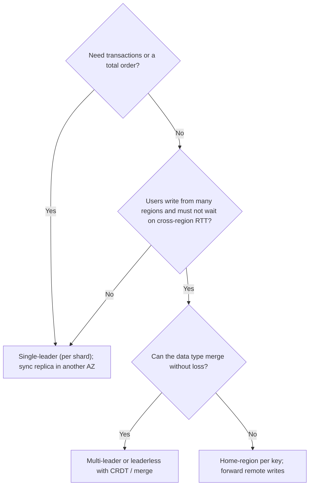

A single database can serve perhaps 10,000 writes and 50,000 indexed reads per second before hardware becomes the limit, and it has one disk, one power supply and one network port between your product and an outage. Replication is the answer to both problems: copies on other machines take reads, survive the first machine's death, and can sit near users in other regions. The price is that there are now several copies and they cannot all be updated at the same instant, so every replicated system must answer three questions: who accepts writes, how do the others find out, and what does a client see in between.

The three answers (one leader, several leaders, no leader) are the three strategies in this lesson. Each is a different position on the trade between write latency, consistency, and what happens when a node or link fails, and interviewers at the senior bar expect you to know the mechanics well enough to say what each one loses during a failover.

## Single-leader replication

One replica, the leader, accepts all writes. It records each write in its log and ships the log to followers, which apply it in order. Reads can go to the leader (fresh) or to followers (possibly stale). Postgres, MySQL, MongoDB's replica sets, Kafka's partitions and most managed databases work this way.

```viz
{"type": "system", "scenario": "replication-leader-follower", "replicas": 2,
 "title": "Leader ships its log to followers", "caption": "The write is durable on the leader first. With asynchronous replication the client is acknowledged before followers apply it; with synchronous replication the leader waits for at least one follower. The gap between the two is what a failover can lose."}
```

### Synchronous, asynchronous, semi-synchronous

| Mode | Leader acknowledges after | Write latency cost | Data loss on leader failure |
|---|---|---|---|
| Asynchronous | Local commit | None | Every write not yet shipped: typically ms of writes, seconds under lag |
| Synchronous (all followers) | Every follower confirms | Slowest follower's RTT plus fsync; a slow or dead follower blocks all writes | None, but availability suffers |
| Semi-synchronous | At least one follower confirms | Fastest follower's RTT (~1 ms same AZ, ~2 ms cross-AZ, 60+ ms cross-region) | None if that follower survives |

Semi-synchronous is the production default for anyone who cannot lose acknowledged writes: one synchronous follower in another availability zone (a couple of milliseconds), the rest asynchronous. Cross-region synchronous replication adds tens of milliseconds to every write and is chosen only when a regional loss must not lose data, a requirement that should be stated, not assumed.

### What travels in the log

Statement-based replication ships the SQL; it breaks on non-determinism (`NOW()`, `RANDOM()`, auto-increment races). Write-ahead-log shipping sends the physical byte changes; followers must run the same version and storage engine. Logical (row-based) replication sends "row with key K changed from X to Y"; it works across versions and feeds CDC tools ([Change data capture](/learn/big-data/streaming/change-data-capture)). Postgres offers both physical (streaming) and logical; [Replication](/learn/databases/storage-and-scale/replication) covers the operational details.

### Lag

Replication lag is the delay between a write on the leader and its visibility on a follower. Healthy: single-digit milliseconds in a region, tens to a few hundred cross-region. It spikes when the follower cannot keep up: a long-running transaction on the follower blocking replay, DDL, a burst of writes, I/O contention, or the follower being restored. Under a spike, lag reaches seconds or minutes, and every read routed to that follower is that stale. The consistency effects (read-your-writes, monotonic reads) are covered in [Consistency models](/learn/system-design/building-blocks/consistency-models); the operational rule is to expose lag as a metric per follower and route around followers over a threshold.

### Failover

When the leader dies, a follower is promoted. The sequence: detect the failure (heartbeats with a timeout; 10 to 30 seconds is typical because shorter timeouts promote on every GC pause), choose the new leader (the follower with the most up-to-date log, via a consensus system or an orchestrator), redirect writes (update DNS, a proxy, or client configuration), and turn the old leader into a follower when it returns.

Two things go wrong. With asynchronous replication, writes acknowledged by the old leader but not yet shipped are lost when a follower that lacks them is promoted; if the old leader comes back with them, they conflict with what the new leader has done since and are usually discarded. And if the old leader did not actually die but was merely partitioned, both nodes believe they are leader: **split brain**, with two divergent histories. The defence is fencing, covered in [Failure detection and leases](/learn/system-design/distributed-systems/failure-detection-and-leases): the promoted leader gets a higher epoch, and storage and clients reject writes from a lower one. Automated failover that lacks fencing is more dangerous than no automated failover.

## Multi-leader replication

Several nodes accept writes, each replicating to the others asynchronously. The use cases are specific: one leader per region so users write locally (~1 ms instead of a cross-region 70 ms); clients that work offline and sync later (a calendar app, a note-taking app, where every device is a leader); collaborative editing.

```viz
{"type": "system", "scenario": "replication-multi-leader", "nodes": 2,
 "title": "Two leaders replicating to each other", "caption": "Each leader commits locally and ships to the other. When both accept a write to the same key before hearing of the other's, the writes conflict and something has to decide the outcome."}
```

The price is conflicts: the same key written on two leaders before either has seen the other's write. Conflict detection requires knowing that two writes were concurrent (version vectors, [Time and ordering](/learn/system-design/distributed-systems/time-and-ordering)); resolution requires a rule:

| Rule | Mechanism | Loses data? |
|---|---|---|
| Last-writer-wins | Highest timestamp survives | Yes, silently, chosen by clock skew |
| Highest replica ID wins | Deterministic tiebreak | Yes, silently |
| Keep siblings | Store both; return both on read; client merges | No, but every reader must merge |
| Merge function | Application-defined merge per type (union, max, custom) | No, if the merge is right |
| CRDT | Data type whose merge is commutative and idempotent | No; [CRDTs](/learn/system-design/distributed-systems/crdts-and-collaboration) |
| Avoid | Route all writes for a key to one home leader | No conflicts, but cross-region latency for non-home writes |

The last row is what most "multi-region active-active" deployments actually do: the topology is multi-leader, but each key has a home, and only a partition forces true multi-leader writes.

Topology matters too. All-to-all replication is fastest but can deliver writes out of causal order (leader C receives B's update before A's insert that it depends on); circular and star topologies serialise but have a single point of failure in the chain. Version vectors on writes, applied only when dependencies are present, fix the ordering at the cost of buffering.

## Leaderless replication

No node is special. A client (or a coordinator node acting for it) sends each write to all N replicas and waits for W acknowledgements; each read is sent to all N and waits for R responses, taking the newest version. Amazon's Dynamo defined the model; Cassandra, Riak and Voldemort implement it.

```viz
{"type": "system", "scenario": "quorum", "replicas": 3,
 "title": "N=3, W=2, R=2", "caption": "The write succeeds once two replicas acknowledge; the read consults two. Any two-of-three read set overlaps any two-of-three write set in at least one replica, so the read sees the latest write, in the absence of concurrent activity and failures."}
```

### The quorum condition

With N replicas, if W + R > N, every read set overlaps every write set in at least one replica, so a read is guaranteed to include at least one replica with the latest acknowledged write. The reader compares versions and returns the newest.

| Configuration | Write latency | Read latency | Tolerates | Typical use |
|---|---|---|---|---|
| N=3, W=2, R=2 | Second-fastest replica | Second-fastest replica | One replica down for both | Default balance |
| N=3, W=3, R=1 | Slowest replica | Fastest replica | Zero for writes, two for reads | Read-heavy, writes rare |
| N=3, W=1, R=1 | Fastest | Fastest | Two down, but W + R = 2 ≤ 3: no overlap; stale reads possible | Speed over consistency |
| N=3, W=1, R=3 | Fastest | Slowest | Zero for reads | Rarely sensible |

Latency arithmetic: waiting for the second-fastest of three same-region replicas costs about the median RTT, roughly 1 ms; waiting for all three costs the max, which includes the occasional 50 ms GC stall. Choosing W=2 rather than 3 is choosing to not wait for the stragglers, and it is why quorum systems have good tail latency.

### Sloppy quorums and hinted handoff

If a replica for a key is unreachable, a strict quorum fails the write. A **sloppy quorum** accepts the write on some other reachable node instead, which stores it with a hint ("this belongs to replica 3") and hands it off when replica 3 returns. Availability goes up; the guarantee that R and W overlap goes down, because the hinted node is not in the read set. Cassandra enables hinted handoff by default; understanding that it weakens the quorum is a senior signal.

### Read repair and anti-entropy

Replicas that missed a write (they were down, or were not in the W set) are brought up to date two ways. **Read repair**: when a read sees different versions across replicas, it writes the newest back to the stale ones; hot keys get repaired quickly, cold keys never. **Anti-entropy**: a background process compares replicas (Merkle trees over key ranges) and copies missing data, covering cold keys at the cost of I/O; [Gossip and anti-entropy](/learn/system-design/distributed-systems/gossip-and-anti-entropy) covers the mechanism.

### Why a quorum is not linearizable

R + W > N guarantees overlap, not linearizability, and this is the question interviewers use to separate people who have run these systems from people who have read about them. Two ways it fails:

1. **A write in progress.** Client A writes x=1 with W=2; replica 1 has applied it, replica 2 has not yet. Client B reads with R=2 from replicas 1 and 3 and sees x=1 (newest). Client C then reads from replicas 2 and 3 and sees x=0. B saw the new value before C saw the old one: a linearizability violation, because the write was not atomic across the replicas.
2. **Concurrent writes.** Two clients write concurrently to different W-sets; versions are decided by timestamp (LWW) or kept as siblings; either way, no single order that respects real time necessarily exists.

Fixing case 1 requires the reader to perform read repair *and wait for it to reach a quorum* before returning (an extra round trip on every read), and even that does not handle case 2. Cassandra's lightweight transactions get linearizability per partition by running Paxos for the operation, at roughly four round trips instead of one. The honest summary: quorums give you overlap and tunable staleness; linearizability needs consensus, which is [Raft](/learn/system-design/distributed-systems/consensus-raft).

### Tunable consistency in Cassandra

Cassandra exposes the per-query choice: `ONE`, `QUORUM`, `LOCAL_QUORUM` (quorum within the local data centre), `EACH_QUORUM` (a quorum in every data centre), `ALL`. `LOCAL_QUORUM` for both reads and writes is the multi-region default: a few milliseconds, overlap within the DC, asynchronous cross-DC replication with eventual consistency across DCs. `EACH_QUORUM` writes wait for every DC, paying the cross-region RTT on each write, and fail if any DC is unreachable, which is usually not what anyone wants. [Wide-column stores](/learn/databases/nosql-and-specialised/wide-column-stores) has the data-model side.

## Comparison and choice

| | Single-leader | Multi-leader | Leaderless |
|---|---|---|---|
| Write path | One node, ordered | Any leader, conflicts possible | Any W of N, conflicts possible |
| Write latency | Local to leader; cross-region for remote users | Local everywhere | Second-fastest of N |
| Consistency available | Linearizable via leader | Eventual, with merge | Tunable; overlap not linearizability |
| Failure of a node | Followers: nothing; leader: failover with loss risk | That leader's region degrades | Quorum continues if enough remain |
| Conflicts | None | Yes, must resolve | Yes, must resolve |
| Best fit | Transactions, ordered logs, anything needing a total order | Multi-region write-local, offline clients | High write availability, simple key-value access, wide-column data |



Three products: a read-heavy social feed is single-leader with many followers and read-your-writes for the author; a financial ledger is single-leader with a synchronous follower and consensus-based failover, never multi-leader; a multi-region collaborative whiteboard is multi-leader with CRDTs, because users must write locally and every edit must survive.

## Failure modes

**Async failover loses acknowledged writes.** Leader acknowledges 300 writes in the 50 ms before it dies; the promoted follower lacks them. Detect: the old leader's log on recovery has entries the new leader does not; reconciliation reports. Mitigate: semi-synchronous replication to a follower in another AZ; accept and document the loss window otherwise.

**Lag surfaces as a user bug.** Follower lag hits 30 seconds during a bulk import; users see their own updates disappear. Detect: lag metric per follower; read-your-writes test. Mitigate: route reads by LSN token; take lagging followers out of rotation.

**Split brain.** Old leader partitioned, new one promoted, both accept writes for two minutes. Detect: two divergent logs; fencing-token rejections if fencing exists. Mitigate: epoch-based fencing at the storage layer and in clients; consensus-based leader election; avoid automated failover without it.

**Sloppy quorum hides a stale read.** A write hinted to a non-replica node; a read with R=2 from the real replicas sees the old value. Detect: reads returning versions older than acknowledged writes during node outages. Mitigate: know that hinted handoff trades the overlap guarantee for availability; use strict quorums for keys that need overlap.

**Multi-leader LWW loses a correction.** The "Ana"/"Anna" case from the previous lesson. Detect: conflict counters; users reporting reverted edits. Mitigate: siblings with merge, CRDTs, or home-region routing.

**Synchronous follower stalls all writes.** The one synchronous follower has a disk problem; every write on the leader waits for it. Detect: write latency tracking follower health. Mitigate: semi-synchronous with automatic demotion of a stalled follower to async plus an alert, understanding that this temporarily reopens the loss window.

## Interviewer follow-ups

**Q: "The primary fails. What exactly do you lose?"**

With asynchronous replication, every write the primary acknowledged but had not shipped: at 5,000 writes per second and 20 ms of typical lag, about 100 writes, and far more if lag had spiked. With a semi-synchronous follower in another AZ, nothing, at the cost of roughly 2 ms per write. For an order or payment system I take the 2 ms. I also make sure the promotion is fenced with an epoch so the old primary, if it was only partitioned, cannot keep accepting writes; without that, the loss is not a hundred writes but a divergent history that someone has to reconcile by hand.

**Q: "You have three replicas with W=2 and R=2. Is a read guaranteed to return the latest write?"**

It is guaranteed to *include* a replica that has the latest acknowledged write, and the reader picks the newest version it sees. It is not linearizable: while a write is partway through its W-set, one reader can see the new value and a later reader the old one, and concurrent writes to different W-sets have no real-time order at all. If I need linearizability for an operation I use a consensus path (a lightweight transaction, or a single-leader store) and pay the round trips; for everything else I take the quorum and its tail-latency benefits and I state that its consistency is "you see the latest acknowledged write, almost always".

**Q: "Users in Europe and the US both edit their profile. Design the replication."**

Each profile has a home region, the one the user signed up in; writes go to that region's single-leader store and commit with a same-region quorum in a few milliseconds; the other region has an asynchronous read replica for the rare cross-region read. A European user travelling in the US pays a 70 ms cross-region write, which is acceptable for profile edits. I would not run multi-leader for profile data, because the merge rules for a profile are not well defined and the product does not need write-local everywhere. If the product were a shared document edited from both regions simultaneously, that changes the answer to multi-leader with CRDTs.

**Q: "What is hinted handoff, and what does it cost you?"**

When a replica for a key is down, the coordinator writes to another node with a hint to forward it later, so writes succeed with fewer real replicas available. It costs the quorum overlap: the hinted node is not in the read set, so a read at R=2 can miss the write until the hint is delivered. It also creates a burst of replay traffic when the replica returns. I keep it on for availability and I set the consistency level per query knowing that during an outage "QUORUM" is a sloppy quorum, and I do not use a leaderless store for the two operations that need strict overlap.

**Q: "Why not synchronous replication to all replicas? Then nothing is lost."**

Because availability inverts: any follower that is slow or down blocks every write, so three replicas make the system less available than one. Write latency becomes the slowest replica's, including its GC pauses. Semi-synchronous, one follower must confirm, keeps the durability guarantee against a single failure at the cost of the fastest follower's RTT, and that is the standard compromise. If the requirement is surviving the simultaneous loss of two replicas without data loss, that is a five-replica consensus group, and I would price that out rather than turn on fully synchronous replication.

## Senior signals

- You state **what failover loses** in writes, from the write rate and the lag, and you choose semi-synchronous replication with the latency number attached.
- You name **split brain** and **fencing** unprompted when automated failover comes up.
- You know that R + W > N gives **overlap, not linearizability**, and you can describe the in-progress-write case that breaks it.
- You explain **hinted handoff** as an availability gain paid for with the overlap guarantee.
- You treat multi-leader as a **conflict-resolution commitment** and can name the merge rule before choosing it.
- You choose replication **per data type and product**, not per company, and you can draw the decision tree.

## Check yourself

```quiz
- q: >-
    A leader acknowledges writes after local commit and ships them asynchronously. It handles 5,000 writes/s with 40 ms of replication lag, then crashes and a follower is promoted. Roughly how many acknowledged writes are lost?
  options: ["About 40", "About 5,000", "About 200", "None"]
  answer: 2
  explanation: >-
    Writes in the lag window are on the leader only: 5,000/s x 0.04 s = 200. A semi-synchronous follower would reduce this to zero at about 1 to 2 ms per write.
- q: >-
    With N=3 replicas, which configuration does NOT guarantee that a read set overlaps every write set?
  options: ["W=2, R=2", "W=1, R=3", "W=3, R=1", "W=1, R=1"]
  answer: 3
  explanation: >-
    Overlap requires W + R > N. W=1, R=1 gives 2, which is not greater than 3, so a read may consult only replicas that missed the write. The other three all sum to at least 4.
- q: >-
    Two leaders in different regions accept writes to the same key 30 ms apart before replicating. The system keeps the write with the higher timestamp. The main risk is:
  options: ["Both writes are kept as duplicates of the same key", "The replication link saturates as both leaders retry", "The key is locked and unreadable until someone resolves it", "Skew can make the older write win, and the other is dropped"]
  answer: 3
  explanation: >-
    Clock skew between regions can exceed 30 ms, so timestamp order is not real order. LWW converges but discards one write silently, without any error. Siblings, merge functions or CRDTs preserve both; LWW by design never keeps both.
- q: >-
    A quorum read with R=2 returns x=1 to client B. A moment later, client C's quorum read returns x=0 for the same key. How is this possible?
  options: ["The write was mid-flight and C read two replicas that lacked it", "The replicas' clocks differ, so C saw an older version as newer", "Client C was served from a stale cache in front of the replicas", "It is not possible, because R + W > N guarantees overlap"]
  answer: 0
  explanation: >-
    Overlap holds only for acknowledged writes; a write partway through its W-set can be visible to one reader and not another: one replica had x=1, and C's read set happened to consult two that did not yet have it. This is why quorums are not linearizable without additional coordination.
- q: >-
    Which product is the poorest fit for multi-leader replication?
  options: ["A financial ledger where every transfer is ordered", "A shopping cart that is edited from several regions", "A note-taking app that syncs edits from offline devices", "A collaborative whiteboard used from several regions"]
  answer: 0
  explanation: >-
    Ledgers need a total order and no lost or merged writes, which single-leader with a synchronous follower provides. The other three tolerate or benefit from local writes with a defined merge.
```
