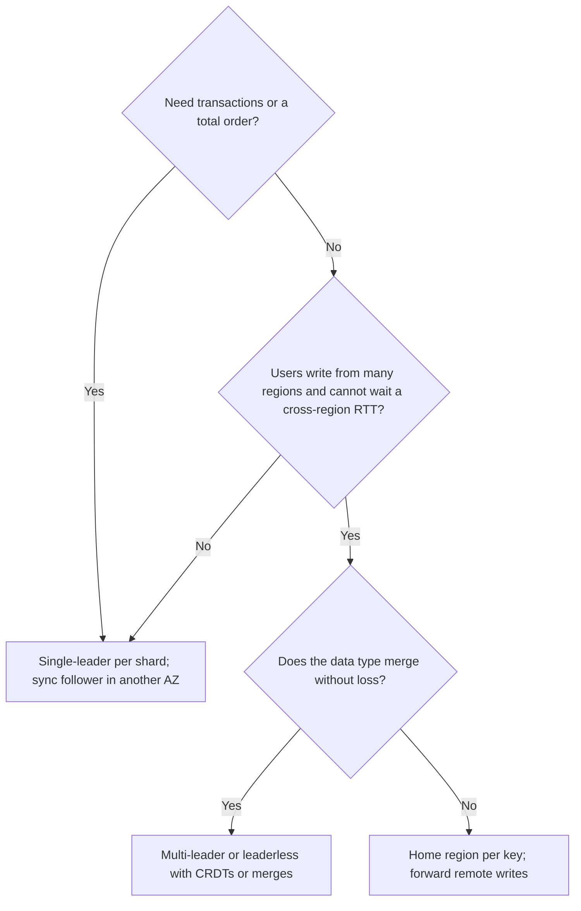

A single database server handles on the order of 10,000 writes and 50,000 indexed reads per second before hardware becomes the limit, and it has one disk, one power supply and one network port between your product and an outage. Replication answers both problems: copies on other machines take reads, survive the first machine's death, and sit near users in other regions. The price is that the copies cannot all change at the same instant, so every replicated system answers three questions: who accepts writes, how do the others find out, and what does a client see in between.

The three answers (one leader, several leaders, no leader) are the three strategies in this lesson. Each is a position on the trade between write latency, consistency and behaviour under failure, and the senior bar is knowing the mechanics well enough to say, with a number, what each one loses when something breaks.

## Single-leader replication

One replica, the leader, accepts all writes. It appends each write to its log and ships the log to followers, which apply it in order. Reads go to the leader (fresh) or to followers (possibly stale). Postgres, MySQL, MongoDB replica sets, Kafka partitions and most managed databases work this way.

```viz
{"type": "system", "scenario": "replication-leader-follower", "replicas": 2,
 "title": "Leader ships its log to followers", "caption": "The write is durable on the leader first. With asynchronous replication the client is acknowledged before followers apply it; with synchronous replication the leader waits for at least one follower. The gap between the two is what a failover can lose."}
```

| Mode | Leader acknowledges after | Write latency added | Loss if the leader dies |
|---|---|---|---|
| Asynchronous | Local commit | None | Everything not yet shipped: write rate × lag |
| Synchronous to all followers | Every follower confirms | Slowest follower, including its GC pauses; a dead follower blocks all writes | None, but availability is worse than one node |
| Semi-synchronous (one or a quorum of followers) | At least one follower confirms | Fastest follower: under 1 ms in an AZ, 1–2 ms across AZs, 60–150 ms across continents | None while that follower survives |

### What failover loses, in writes

The loss window of asynchronous replication is write rate × lag. At 5,000 writes/s and a healthy 20 ms of lag, a leader crash loses about 100 acknowledged writes; during a bulk import that pushes lag to 30 s, it loses 150,000. A failover runs four steps, each with a cost:

| Step | What happens | Typical duration and its driver |
|---|---|---|
| 1. Detect | Heartbeats stop; a timeout expires | 10–30 s; shorter timeouts fail over on every GC pause. Patroni's default leader key TTL is 30 s |
| 2. Choose | The follower with the most complete log is picked, by a consensus store (etcd, ZooKeeper) or an orchestrator | Seconds |
| 3. Redirect | DNS, a proxy or client configuration points at the new leader | DNS TTL plus connection pool churn; AWS documents RDS Multi-AZ failover as typically 60–120 s end to end |
| 4. Demote | The old leader rejoins as a follower, discarding writes the new leader never had | Minutes; the discarded writes need reconciliation |

If the old leader was only partitioned, not dead, both nodes accept writes: **split brain**, two divergent histories. The defence is fencing, covered in [failure detection and leases](/learn/system-design/distributed-systems/failure-detection-and-leases): the promoted leader gets a higher epoch, and storage and clients reject writes carrying a lower one. Automated failover without fencing is more dangerous than no automated failover.

### Under the hood: the knobs that set the loss window

| System | Setting | What it does | The trap |
|---|---|---|---|
| Postgres | `synchronous_standby_names = 'ANY 1 (s1, s2)'` (quorum form since 10) with `synchronous_commit = on` | Commit waits until one of s1, s2 has flushed the WAL | With no synchronous standby connected, commits wait forever; `remote_apply` is needed for read-your-writes on the standby |
| MySQL | Semi-sync with `rpl_semi_sync_source_wait_point = AFTER_SYNC` | Waits for a replica's ack before the commit becomes visible (lossless semi-sync) | After `rpl_semi_sync_source_timeout` (10 s by default) it silently reverts to asynchronous, reopening the loss window |
| Kafka | `acks=all`, `min.insync.replicas=2`, replication factor 3 | A write is acknowledged once every in-sync replica has it; with fewer than 2 in sync, writes are refused | Followers leave the in-sync set after `replica.lag.time.max.ms` (30 s since 2.5); `unclean.leader.election.enable=true` trades loss for availability |

What travels in the log matters too. Statement-based replication ships SQL and breaks on `NOW()` and `RANDOM()`. Physical WAL shipping sends byte changes and requires identical versions. Logical, row-based replication sends "row K changed from X to Y", works across versions, and feeds [change data capture](/learn/big-data/streaming/change-data-capture). [Database replication](/learn/databases/storage-and-scale/replication) covers the operational side.

**Lag** is single-digit milliseconds within a region when healthy, tens to hundreds across regions, and seconds to minutes when a follower cannot keep up: a long query on the follower blocking replay, DDL, a write burst, I/O contention. Export lag per follower and take a follower out of read rotation above a threshold; the client-visible effects are in [consistency models](/learn/system-design/building-blocks/consistency-models).

### Reading your own writes from a follower

Lag becomes a user-visible bug the moment a user edits their profile, is redirected to a page served by a follower, and sees the old value. The fix is a **log-position token**, not a sleep. After a write, the leader returns the position of that commit in its log (Postgres: `pg_current_wal_lsn()` after commit; MySQL: the GTID set). The client or session keeps the highest token it has seen. A follower may serve that session's read only when its replayed position has reached the token (`pg_last_wal_replay_lsn()` ≥ token, or MySQL's `WAIT_FOR_EXECUTED_GTID_SET` with a short timeout); otherwise the read waits briefly or goes to the leader. Traced: the user writes at LSN 0/5A0, follower F1 has replayed 0/590 and F2 0/5B0; the router sends the next read to F2, or to F1 after it passes 0/5A0. Other users, with older or no tokens, keep reading from either follower. The cost is one integer per session and a comparison per read, which is why this beats pinning a user to the leader for "a few seconds after any write", a heuristic that fails exactly when lag spikes.

## Multi-leader replication

Several nodes accept writes and replicate to each other asynchronously. The cases that justify it are specific: one leader per region so users write locally (1 ms instead of 70 ms), devices that work offline and sync later, and collaborative editing.

```viz
{"type": "system", "scenario": "replication-multi-leader", "nodes": 2,
 "title": "Two leaders replicating to each other", "caption": "Each leader commits locally and ships to the other. When both accept a write to the same key before hearing of the other's, the writes conflict and something has to decide the outcome."}
```

### A conflict traced: last-writer-wins loses an increment

A post has 10 likes, replicated in US and EU leaders with perfectly synchronised clocks. One user likes it in each region within the same second. Each leader runs `likes = likes + 1` locally, a read-modify-write, and replicates the new value:

| Step | US leader | EU leader | Replicated message |
|---|---|---|---|
| 1 | reads 10, writes 11 at ts 100 | | US → EU: likes=11 @100 |
| 2 | | reads 10, writes 11 at ts 101 | EU → US: likes=11 @101 |
| 3 | receives 11 @101: newer, keeps 11 | receives 11 @100: older, ignores | |
| Result | 11 | 11 | converged, and wrong: one like lost |

No clock skew was needed. LWW decides which *value* survives, but the values were each computed from a stale read, so one increment is gone. Replicate the *operation* instead, as a counter whose state is one entry per leader (a PN-counter, one of the [CRDTs](/learn/system-design/distributed-systems/crdts-and-collaboration)):

| Step | US state | EU state | Value (base 10 + sum) |
|---|---|---|---|
| 1 | {US: 1, EU: 0} | {US: 0, EU: 0} | US 11, EU 10 |
| 2 | {US: 1, EU: 0} | {US: 0, EU: 1} | US 11, EU 11 |
| 3 merge (max per entry) | {US: 1, EU: 1} | {US: 1, EU: 1} | 12 on both |

The merge takes the maximum of each leader's own entry, so it is commutative, idempotent and loses nothing. The general rules:

| Rule | Mechanism | Loses data? |
|---|---|---|
| Last-writer-wins | Highest timestamp survives | Yes, silently; decided by skew and by stale reads |
| Keep siblings | Store both; return both on read; client merges | No, but every reader must merge |
| Merge function | Application merge per type (union, max, custom) | No, if the merge is right |
| CRDT | Type whose merge is commutative, associative, idempotent | No |
| Avoid | Each key has a home leader; other regions forward writes | No conflicts; non-home writes pay the cross-region RTT |

The last row is what most "active-active multi-region" deployments do: the topology is multi-leader, but each key has a home, and only a partition forces true concurrent writes. Detecting that two writes *were* concurrent needs version vectors, traced in [time and ordering](/learn/system-design/distributed-systems/time-and-ordering). Topology adds one more trap: with all-to-all replication, leader C can receive B's update to a row before A's insert of it, so updates must carry their dependencies and wait for them.

### Under the hood: how real multi-leader systems handle conflicts

Systems differ mainly in *when* they notice a conflict. **CouchDB** (and PouchDB on devices) keeps a revision tree per document. Replication copies every revision; when two branches exist, every replica picks the same deterministic winner (the longest revision history, then the highest revision hash) so reads agree, but the losing branch is kept and flagged as a conflict until the application merges and deletes it. Nothing is lost, and nothing is merged unless your code merges it. **DynamoDB global tables** resolve concurrent cross-region writes to the same item by last-writer-wins on a timestamp, which is the likes trace above. **MySQL Group Replication** in multi-primary mode detects conflicts *before* commit: each transaction's write set (the hashes of the rows it changed) is broadcast through a Paxos-based group protocol that gives every member the same order, and a transaction whose write set overlaps one ordered earlier but not yet seen by it is rolled back on every member. That is optimistic concurrency control across leaders: no conflicts survive, at the price of a group round trip per commit and aborts under contention. **Postgres logical replication**, in the versions most teams run, has no resolution rule: a conflicting row (a duplicate key, say) stops the subscription's apply worker, which retries and fails until an operator intervenes, so a "multi-master" built from it needs keys that cannot collide.

## Leaderless replication

No replica is special. A coordinator sends each write to all N replicas of the key and succeeds after W acknowledgements; a read asks replicas and waits for R responses, returning the newest version. Amazon's Dynamo paper defined the model; Cassandra, Riak and ScyllaDB implement it. (DynamoDB, despite the name, runs a leader per partition elected by Multi-Paxos, according to its 2022 USENIX ATC paper.)

```viz
{"type": "system", "scenario": "quorum", "replicas": 3,
 "title": "N=3, W=2, R=2", "caption": "The write succeeds once two replicas acknowledge; the read consults two. Any two-of-three read set overlaps any two-of-three write set in at least one replica, so the read sees the latest write, in the absence of concurrent activity and failures."}
```

### Why R + W > N guarantees overlap

Let the write set have W replicas and the read set R, both drawn from N. By inclusion-exclusion, |R ∩ W| = R + W − |R ∪ W| ≥ R + W − N, because the union cannot exceed N. If R + W > N, the intersection has at least one replica, so at least one reader holds the latest acknowledged write, and version comparison picks it. With N = 5, W = 3, R = 3 the overlap is at least 1; with W = 4, R = 3 it is at least 2.

| Configuration | Write waits for | Read waits for | Survives | Use |
|---|---|---|---|---|
| N=3, W=2, R=2 | 2nd fastest replica | 2nd fastest | 1 down, reads and writes | Default |
| N=3, W=3, R=1 | Slowest replica | Fastest | 0 down for writes | Rare writes, many reads |
| N=3, W=1, R=1 | Fastest | Fastest | 2 down, but no overlap | Speed over freshness |
| N=5, W=3, R=3 | 3rd fastest | 3rd fastest | 2 down | Larger failure budget |

Waiting for the second-fastest of three costs roughly the median RTT; waiting for all three costs the maximum, which includes a replica's occasional 50 ms GC pause. That is why W = 2 has good tail latency.

### How stale is a partial quorum?

When R + W ≤ N, overlap is probabilistic. A read of R random replicas misses a W-replica write set with probability C(N−W, R) / C(N, R) at the moment of acknowledgement, and less as the write reaches the other replicas. A simulation (100,000 trials per cell) with each replica applying the write after an exponential delay averaging 5 ms, and reads issued t ms after the acknowledgement:

| N, W, R | Missed at ack (exact) | t = 1 ms | t = 5 ms | t = 10 ms | t = 20 ms |
|---|---|---|---|---|---|
| 3, 1, 1 | 2/3 | 55% | 24% | 9.0% | 1.2% |
| 3, 1, 2 | 1/3 | 22% | 4.4% | 0.64% | 0.01% |
| 3, 2, 1 | 1/3 | 27% | 12% | 4.5% | 0.56% |
| 3, 2, 2 | 0 | 0 | 0 | 0 | 0 |
| 5, 2, 2 | 3/10 | 20% | 4.1% | 0.55% | 0.01% |

Staleness decays with propagation delay, so "eventually" is milliseconds when replicas are healthy and as long as the outage when one is not. Bailis et al.'s probabilistically bounded staleness work (VLDB 2012) did this analysis with production latency distributions; the shape is the same.

### Sloppy quorums and hinted handoff, traced

N = 3, W = 2, R = 2. Key k's preference list is A, B, C; the next node on the ring is D.

| Step | Event | A | B | C | D |
|---|---|---|---|---|---|
| 1 | Network partition: B and C unreachable from the coordinator | v1 | v1 | v1 | – |
| 2 | Write k = v2. Strict quorum fails (only A reachable). Sloppy quorum writes A and D, with a hint "belongs to B" | v2 | v1 | v1 | v2 (hint for B) |
| 3 | Partition heals; A crashes before D delivers the hint | down | v1 | v1 | v2 (hint) |
| 4 | Read R = 2 from the preference list: B and C | down | v1 | v1 | |
| 5 | Returns v1: an acknowledged write is invisible | | | | |
| 6 | D delivers the hint to B; later reads see v2 | | v2 | v1 → repaired | |

The write was acknowledged with W = 2, but the two replicas that took it were not both in the read set, so the overlap argument no longer applies. Hinted handoff buys write availability during failures and pays with the guarantee. Cassandra keeps hints for `max_hint_window` (3 hours by default); a replica down for longer never receives them and must be fixed by repair.

### Under the hood: a Cassandra read at QUORUM

With replication factor 3 and `QUORUM` (2), the coordinator does not fetch the row twice. It asks the replica its dynamic snitch rates fastest for the full data and one other replica for a **digest**, a hash of its version of the result. Matching digests mean the data is returned after two small responses. A mismatch means a replica is stale: the coordinator requests full data from both, reconciles cell by cell (highest timestamp wins per cell), returns the result and repairs the stale replica. If a replica is slower than its recent 99th-percentile latency, **speculative retry** (the table's `speculative_retry = '99p'` default) sends the request to the third replica rather than waiting, which is how a quorum store keeps its tail short when one node pauses. Writes go to all three replicas regardless of the consistency level; the level only decides how many acknowledgements the coordinator waits for, so a write at `ONE` still usually reaches every replica within milliseconds.

### Read repair and anti-entropy

**Read repair**: a read at R = 2 gets v2 from A and v1 from C, returns v2, and writes v2 back to C. Hot keys converge quickly; keys nobody reads never do. Since 4.0, Cassandra's default `read_repair = 'BLOCKING'` makes the coordinator wait for that repair write before answering, which gives monotonic quorum reads; its old probabilistic `read_repair_chance` was removed. **Anti-entropy** compares replicas in the background with Merkle trees over key ranges and streams the differences, covering cold keys at the cost of I/O; [gossip and anti-entropy](/learn/system-design/distributed-systems/gossip-and-anti-entropy) traces it.

### Why a quorum is not linearizable

Overlap is about acknowledged writes. A write in progress breaks it, traced with N = 3, W = 2, R = 2 and no read repair:

| Time | Event | R1 | R2 | R3 | Reader sees |
|---|---|---|---|---|---|
| 0 | x = 0 everywhere | 0 | 0 | 0 | |
| 1 | Client A writes x = 1; R1 applies, R2's copy is still in flight | 1 | 0 | 0 | |
| 2 | Client B reads R1, R3 | | | | 1 (newest) |
| 3 | Client C, after B's read returns, reads R2, R3 | | | | 0 |
| 4 | R2 applies; A's write is acknowledged | 1 | 1 | 0 | |

B saw the new value, then C saw the old one: no single real-time order explains both, so it is not linearizable. Blocking read repair fixes this case (B's read writes 1 to R3 before returning, so C finds it). It does not fix concurrent writes to different W-sets ordered by LWW, or a write that failed with W not reached yet stuck on one replica, which later reads repair to every replica: a write the client was told failed becomes visible. Linearizable operations need consensus; Cassandra's lightweight transactions run Paxos per partition at about four round trips instead of one. [Raft](/learn/system-design/distributed-systems/consensus-raft) is the general answer.

Cassandra exposes the choice per query: `ONE`, `QUORUM`, `LOCAL_QUORUM` (quorum in the local data centre), `EACH_QUORUM`, `ALL`. `LOCAL_QUORUM` for reads and writes is the multi-region default: a few milliseconds, overlap within the DC, asynchronous and eventually consistent across DCs. [Wide-column stores](/learn/databases/nosql-and-specialised/wide-column-stores) covers the data model.

## Comparison and choice

| | Single-leader | Multi-leader | Leaderless |
|---|---|---|---|
| Write path | One node, totally ordered | Any leader; conflicts | Any W of N; conflicts |
| Write latency | Leader's commit plus sync follower; remote users pay cross-region RTT | Local everywhere | W-th fastest of N |
| Strongest consistency | Linearizable through the leader | Eventual with merge | Tunable overlap, not linearizable |
| Node failure | Follower: nothing; leader: failover with a loss window | That region degrades | Continues while W and R replicas remain |
| Best fit | Transactions, ordered logs | Write-local multi-region, offline clients | High write availability, key-value and wide-column access |



A read-heavy feed is single-leader with many followers and read-your-writes for the author. A ledger is single-leader with a synchronous follower and fenced, consensus-driven failover, never multi-leader. A multi-region whiteboard is multi-leader with CRDTs, because users must write locally and every stroke must survive.

## Failure modes

| Failure | Symptom | Diagnosis | Fix |
|---|---|---|---|
| Async failover loses acknowledged writes | Orders confirmed to customers are missing after a failover | The old leader's WAL or binlog has transactions past the new leader's position | Semi-synchronous replication to another AZ; document the loss window where you accept it |
| Semi-sync silently degrades | No alert, then a failover loses data anyway | MySQL's semi-sync status variables show it fell back to async after the 10 s timeout during a replica stall | Alert on the fallback; two semi-sync-eligible replicas so one stall does not trigger it |
| Lag surfaces as a user bug | Users' own edits vanish for seconds | Per-follower lag spiked during a bulk import or long query | Route reads by log position (LSN token); remove lagging followers from rotation |
| Split brain | Two divergent histories after a network event | Two nodes held leadership at once; no epoch check at the storage layer | Epoch fencing in storage and clients; consensus-based election |
| Sloppy quorum hides a write | Reads return versions older than acknowledged writes during node churn | Hints pending on non-preference nodes; replicas down longer than the hint window | Strict quorums for keys that need overlap; run repair after long outages |
| Multi-leader LWW loses updates | Counters undercount; edits revert | Conflict counters; values computed from stale reads | Replicate operations as CRDTs, merge siblings, or give keys a home leader |
| Synchronous follower stalls all writes | Leader write latency tracks one follower's disk | Commit waits in `pg_stat_activity` on `SyncRep` | Quorum commit (`ANY 1 (s1, s2)`) so one slow standby does not block |

## Interviewer follow-ups

**"The primary fails. What exactly do you lose?"** Model answer: with async replication, write rate × lag: 5,000 writes/s at 20 ms is about 100 acknowledged writes, far more if lag had spiked; with a semi-synchronous follower in another AZ, nothing, for 1–2 ms per write, which an order or payment system pays. And the promotion must be fenced, or a partitioned old primary produces a divergent history instead of a bounded loss. Common wrong answer: "nothing, we have replicas," which ignores the asynchronous window.

**"Three replicas, W = 2, R = 2. Is a read guaranteed to return the latest write?"** Model answer: it is guaranteed to include a replica with the latest acknowledged write, by the overlap proof. It is not linearizable: a write in flight can be seen by one reader and missed by a later one unless read repair blocks, and concurrent LWW writes or sloppy quorums break the guarantee further. Common wrong answer: "yes, R + W > N means strong consistency."

**"What is hinted handoff, and what does it cost?"** Model answer: during a replica outage a neighbour stores the write with a hint and forwards it later, so writes succeed; the neighbour is not in the read set, so reads can miss acknowledged writes until the hint is delivered, and hints older than the window are dropped, leaving repair to fix it. Common wrong answer: "it is a retry queue with no consistency impact."

**"Why not replicate synchronously to every replica?"** Model answer: every write then waits for the slowest replica and blocks when any replica is down, so three replicas are less available than one. One synchronous follower (or `ANY 1` of two) protects against a single failure; surviving two simultaneous failures without loss is a five-node consensus group. Common wrong answer: "synchronous is always safer, so use it everywhere."

## What mid-level engineers get wrong

- **Equating a quorum with strong consistency.** Consequence: a design promises linearizable reads it cannot deliver, found only when an in-flight write is observed out of order.
- **Using LWW on a read-modify-write value.** Consequence: counters and balances lose concurrent updates even with perfect clocks.
- **Turning on automated failover without fencing.** Consequence: a network blip becomes split brain and a manual reconciliation.
- **Trusting MySQL semi-sync to be lossless.** Consequence: it falls back to async after 10 s of replica trouble, and the next failover loses data.
- **Sizing the loss window from healthy lag.** Consequence: the crash that matters happens during the bulk import, when lag is 30 s.
- **Assuming DynamoDB works like the Dynamo paper.** Consequence: reasoning about sloppy quorums and siblings for a system that runs a Paxos leader per partition.

## Exercise

```exercise
id: quorum-calculator
title: Quorum calculator
prompt: |
  A key is stored on `n` replicas; writes wait for `w` acknowledgements and
  reads for `r` responses (1 ≤ w, r ≤ n). Return an object with:

  - `overlap`: whether every read set must intersect every write set
  - `min_overlap`: the smallest possible number of replicas in both sets
  - `write_failures_tolerated`, `read_failures_tolerated`: how many replicas
    can be down while writes (or reads) still reach their quorum
  - `p_miss`: the probability that a read of `r` replicas chosen uniformly at
    random contains none of the `w` replicas holding a newly acknowledged write,
    as a reduced fraction `[numerator, denominator]` (use `[0, 1]` for zero)
languages: [python, javascript]
entry: quorum_properties
starter:
  python: |
    def quorum_properties(n, w, r):
        # count read sets that avoid the write set, over all read sets
        return {}
  javascript: |
    function quorum_properties(n, w, r) {
      // count read sets that avoid the write set, over all read sets
      return {};
    }
tests:
  - args: [3, 2, 2]
    expected: {"overlap": true, "min_overlap": 1, "write_failures_tolerated": 1, "read_failures_tolerated": 1, "p_miss": [0, 1]}
  - args: [3, 1, 1]
    expected: {"overlap": false, "min_overlap": 0, "write_failures_tolerated": 2, "read_failures_tolerated": 2, "p_miss": [2, 3]}
  - args: [5, 2, 2]
    expected: {"overlap": false, "min_overlap": 0, "write_failures_tolerated": 3, "read_failures_tolerated": 3, "p_miss": [3, 10]}
  - args: [1, 1, 1]
    expected: {"overlap": true, "min_overlap": 1, "write_failures_tolerated": 0, "read_failures_tolerated": 0, "p_miss": [0, 1]}
    label: a single replica
  - args: [9, 3, 3]
    expected: {"overlap": false, "min_overlap": 0, "write_failures_tolerated": 6, "read_failures_tolerated": 6, "p_miss": [5, 21]}
    hidden: true
  - args: [5, 4, 3]
    expected: {"overlap": true, "min_overlap": 2, "write_failures_tolerated": 1, "read_failures_tolerated": 2, "p_miss": [0, 1]}
    hidden: true
    label: overlap of two
hints:
  - "The intersection of two subsets of n elements has at least w + r - n elements."
  - "A read set misses the write set when all r of its replicas come from the n - w that lack the write: C(n - w, r) of the C(n, r) read sets."
```

## Senior signals

- You state what failover loses as write rate × lag, choose semi-synchronous replication with its latency number, and know which knob silently turns it off.
- You name split brain and fencing unprompted when automated failover comes up.
- You prove R + W > N overlap in one line, and you know it gives overlap, not linearizability, with the in-flight-write trace to show why.
- You quantify partial quorums as a decaying miss probability rather than calling them "eventually consistent".
- You explain hinted handoff as availability bought with the overlap guarantee, bounded by the hint window.
- You treat multi-leader as a commitment to a merge rule, and show LWW losing an increment even with perfect clocks.

## Check yourself

```quiz
- q: >-
    A leader acknowledges after local commit and ships asynchronously. It handles 5,000 writes/s with 40 ms of replication lag, then crashes and a follower is promoted. Roughly how many acknowledged writes are lost?
  options: ["None, the follower has the log", "About 5,000, one second of writes", "About 200, the rate times the lag", "About 40, one per millisecond of lag"]
  answer: 2
  explanation: >-
    Writes inside the lag window exist only on the leader: 5,000/s × 0.04 s = 200. A semi-synchronous follower would reduce this to zero at 1 to 2 ms per write. The follower has the log only up to the point it was shipped.
- q: >-
    Two regional leaders each run likes = likes + 1 on a post with 10 likes, with perfectly synchronised clocks, and replicate the new values under last-writer-wins. What is the converged value?
  options: ["11, because each value came from a stale read", "12, because synchronised clocks order both writes", "10, because the two conflicting writes cancel", "Both 11s are kept as siblings for the reader"]
  answer: 0
  explanation: >-
    Each leader read 10 and wrote 11, so both replicated values are 11; LWW picks one and an increment is lost. Clock accuracy is irrelevant to this loss. A per-leader counter merged by taking the maximum of each entry converges to 12.
- q: >-
    With N = 5, W = 3 and R = 3, why must every read see the latest acknowledged write?
  options: ["Hinted handoff copies each write to all five replicas first", "Reads wait for the slowest replica, which has every write", "Any two sets of 3 out of 5 share at least one replica", "The coordinator forwards reads to the replica that wrote last"]
  answer: 2
  explanation: >-
    The intersection of the read and write sets has at least R + W − N = 1 member, so some replica in the read set holds the write and version comparison returns it. A read waits for 3 responses, not the slowest; hinted handoff weakens the guarantee rather than creating it.
- q: >-
    During a partition a sloppy quorum stores a write on nodes A and D (with a hint for B). A then crashes, and a read with R = 2 goes to B and C. What does it return?
  options: ["The new value, because W + R > N still holds", "The old value, until D hands the hint to B", "An error, because a quorum cannot be formed", "The new value, because D forwards all reads"]
  answer: 1
  explanation: >-
    The write set {A, D} and the read set {B, C} do not intersect, since D is not in the key's preference list. The read succeeds with two responses and returns the old value. Hinted handoff trades the overlap guarantee for write availability.
- q: >-
    A quorum read returns x = 1 to client B. Client C then does a quorum read of the same key and gets x = 0. Which mechanism prevents this?
  options: ["Blocking read repair on B's read before it returns", "Hinted handoff to the replica that missed the write", "Switching the key to last-writer-wins resolution", "Raising N from three replicas to five"]
  answer: 0
  explanation: >-
    B read a write still in flight. If B's coordinator writes x = 1 to the stale replica in its read set before answering, C's quorum must overlap a replica holding 1. Cassandra 4.0's BLOCKING read repair does this, giving monotonic quorum reads, though still not full linearizability. More replicas do not change the in-flight window.
- q: >-
    Which product is the poorest fit for multi-leader replication?
  options: ["A shopping cart edited from sessions in two regions", "A whiteboard whose users draw from several regions", "A note app that syncs edits made on offline devices", "A ledger where every transfer must be totally ordered"]
  answer: 3
  explanation: >-
    A ledger needs a total order and no merged or lost writes, which a single leader with a synchronous follower provides. The note app, cart and whiteboard tolerate concurrent writes because their data types have well-defined merges.
```
