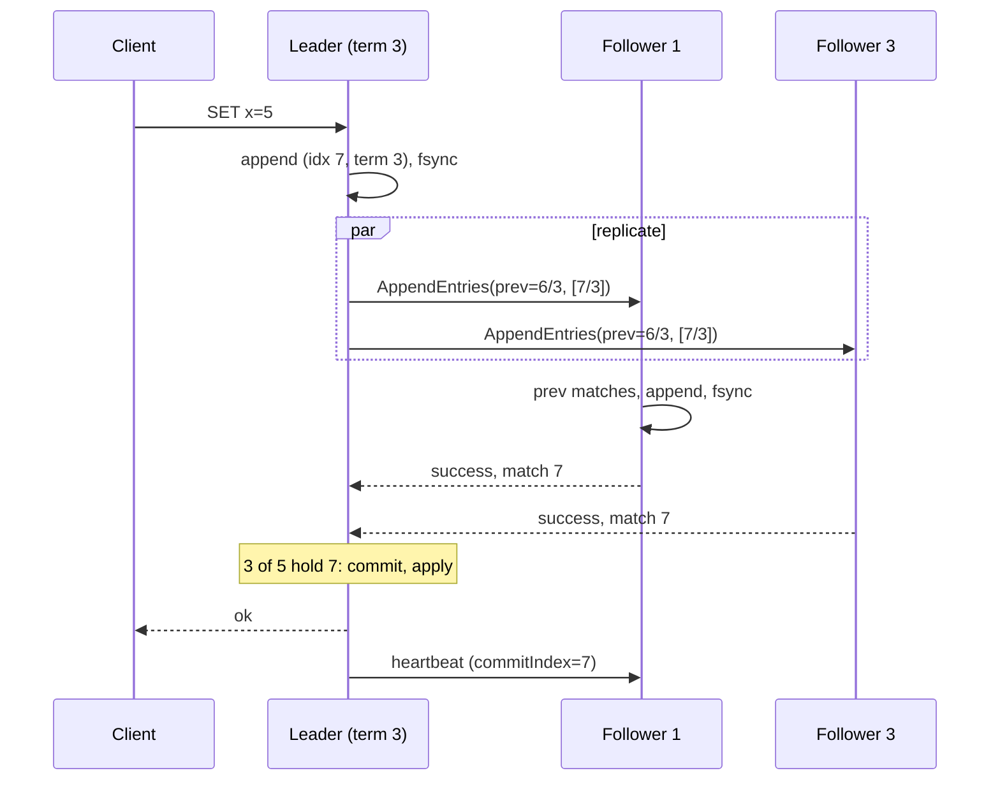

Five servers must agree on the order of operations in a log so that each can apply the same operations to a copy of a state machine and end up in the same state, even though any two of them may crash, messages may be delayed or lost, and there is no shared clock. Quorum replication gets you overlap, not agreement: as [replication strategies](/learn/system-design/distributed-systems/replication-strategies) showed, two writers with disjoint W-sets leave the replicas with no single order. Consensus produces one order, and Raft is the algorithm behind etcd, Consul, CockroachDB, TiKV and Kafka's KRaft controllers.

Raft is understandable because it decomposes the problem: elect one leader; let the leader dictate the log; make sure every new leader already has every committed entry. This lesson traces each part on concrete logs, including the rule that a leader commits only entries from its own term, and ends with the numbers that bound what a Raft cluster can do.

## The model

Each server holds a log of entries (index, term, command), a current term, and a state machine to which committed entries are applied in index order. A server is a follower, a candidate or a leader. Time is divided into numbered terms, each with at most one leader. Two RPCs do all the work: `RequestVote` and `AppendEntries` (which doubles as the heartbeat). Any message carrying a higher term makes the receiver adopt that term and become a follower.

A cluster of 2f + 1 servers tolerates f failures: 3 survive 1, 5 survive 2. Every decision needs a majority, and any two majorities share at least one server; every safety argument below rests on that overlap. Four servers still tolerate only one failure and need three votes instead of two, so even sizes buy nothing.

## Leader election, traced through a split vote

A follower that hears no heartbeat for its **election timeout**, drawn at random from a range such as 150–300 ms, becomes a candidate: it increments its term, votes for itself and sends `RequestVote` to everyone. A server grants its vote if it has not voted in this term and the candidate's log is **at least as up to date** as its own, comparing the last entry's term first and its index second. A follower that grants a vote resets its own election timer. A candidate with votes from a majority becomes leader and starts sending heartbeats.

Five servers, S1 leader in term 1, all logs equal. S1 crashes at t = 0, right after a heartbeat. The followers' random timeouts are S2 162 ms, S3 164, S4 231, S5 287, and link delays differ per pair:

| t (ms) | Event | Terms S2–S5 | Votes |
|---|---|---|---|
| 162 | S2 times out: term 2, votes for itself, sends RequestVote; re-arms with 240 ms (fires at 402) | 2, 1, 1, 1 | S2: {S2} |
| 164 | S3 times out 2 ms later, before S2's request reaches it: term 2, votes for itself; re-arms with 170 ms (fires at 334) | 2, 2, 1, 1 | S3: {S3} |
| 165 | S2's request reaches S4 (3 ms link): S4 adopts term 2, grants, resets its timer | 2, 2, 2, 1 | |
| 166 | S2's request reaches S3: already voted for itself in term 2, rejects | | |
| 168 | S3's request reaches S5 (4 ms link) first: S5 adopts term 2, grants | 2, 2, 2, 2 | |
| 168–172 | S2 receives S4's vote; S3 receives S5's; the slower requests (S2 → S5, S3 → S4) arrive after those servers have voted and are rejected | | S2: {S2, S4}; S3: {S3, S5} |
| 172 | **Split vote**: each candidate has 2 of the 3 votes it needs, S1 is down, and nobody else will vote in term 2 | | |
| 334 | S3's re-armed timer fires first: term 3, requests votes | 2, 3, 2, 2 | S3: {S3} |
| 338 | S2 and S5 see term 3, step down or adopt it, and grant (logs equal) | 3, 3, 2, 3 | |
| 342 | S3 has S2 and S5's votes: **leader of term 3**; heartbeats go out and reset S4's timer before it fires at 375 | 3, 3, 3, 3 | S3: {S3, S2, S5} |

The randomised timeout is the whole mechanism: a split vote happens only when two timers fire within about one message delay of each other, and the fresh random draw after a split makes a second collision unlikely. A simulation (20,000 elections per row, five servers, the leader crashing immediately after a heartbeat, one-way delays uniform in ±50% of the value shown, candidates and voting followers re-arming with fresh random timeouts):

| Timeout range | One-way delay | Elections needing more than one term | Median time to a leader | p99 time to a leader |
|---|---|---|---|---|
| 150–300 ms | 1 ms | 0.7% | 176 ms | 266 ms |
| 150–300 ms | 5 ms | 3.4% | 185 ms | 398 ms |
| 150–300 ms | 20 ms | 16% | 220 ms | 651 ms |
| 150–300 ms | 50 ms | 48% | 324 ms | 1.3 s |
| 150–155 ms | 5 ms | 98% | 920 ms | 4.4 s |
| 1,000–2,000 ms (etcd default) | 1 ms | 0.1% | 1.16 s | 1.69 s |

Two rules fall out. The timeout range must be wide relative to the message delay, or elections collide repeatedly (the 5 ms-wide range needed a median of six terms and, at p99, 28). And the timeout must be far above the round trip, or candidates give up before their votes return. etcd's documentation asks for an election timeout of at least ten times the round-trip time; its defaults are a 100 ms heartbeat and a 1,000 ms election timeout, which etcd's raft library randomises to between one and two times the configured value. The paper's 150–300 ms assumes a LAN.

```viz
{"type": "system", "scenario": "raft-election", "nodes": 5,
 "title": "Election after leader failure", "caption": "The leader stops sending heartbeats. The follower whose randomised timeout fires first becomes a candidate, increments the term and requests votes. Servers grant a vote only if the candidate's log is at least as current as theirs. A majority makes it leader; it then heartbeats to stop everyone else's timers."}
```

## Log replication and the commit index

The leader appends a client command to its log with its current term and sends `AppendEntries` to every follower, carrying the new entries plus the index and term of the entry immediately before them (`prevLogIndex`, `prevLogTerm`). For each follower it tracks `matchIndex`, the highest index known to be replicated there. An index N is **committed** when a majority has `matchIndex` ≥ N and the entry at N is from the leader's current term. The leader then applies it, answers the client, and sends the new `commitIndex` in later messages so followers apply it too.

Leader L in term 3 with four followers; indexes 1–4 are committed everywhere, and L has appended 5, 6 and 7:

| Event | matchIndex (L, F1, F2, F3, F4) | Third highest (majority of 5) | commitIndex |
|---|---|---|---|
| L appends 5–7 and fsyncs | 7, 4, 4, 4, 4 | 4 | 4 |
| F1 acknowledges up to 7 | 7, 7, 4, 4, 4 | 4 | 4 |
| F3 acknowledges up to 6 | 7, 7, 4, 6, 4 | 6 (term 3) | **6**: apply 5, 6; answer those clients |
| F2 acknowledges up to 5 | 7, 7, 5, 6, 4 | 6 | 6 |
| F3 acknowledges up to 7 | 7, 7, 5, 7, 4 | 7 | **7** |
| Next heartbeat carries commitIndex 7 | | | F2 applies up to 5, F4 up to 4: each applies min(leader's commit, its own last index) |

The commit index is the median of the match indexes. One slow follower (F4) changes nothing; two slow followers in a five-node cluster would put one of them in every majority, and commit latency would track it.



A write therefore costs one round trip to the fastest majority plus an fsync on the leader and on each follower in that majority: about 1–2 ms within a region on SSDs, and the second-fastest cross-region round trip (60–80 ms) for a cluster spread across regions.

```viz
{"type": "system", "scenario": "raft-log-replication", "nodes": 5,
 "title": "Appending, replicating and committing an entry", "caption": "The leader appends locally and sends AppendEntries with the previous entry's index and term. Followers whose logs match accept. When a majority holds the entry the leader marks it committed and applies it; followers learn the commit index on the next message."}
```

## Log matching and repairing a divergent follower

A follower accepts `AppendEntries` only if its log holds an entry at `prevLogIndex` with term `prevLogTerm`. By induction over appends, this gives the **log matching property**: if two logs contain an entry with the same index and term, they are identical in every entry up to that index. A leader never needs to compare whole logs; finding one matching (index, term) pair proves the whole prefix matches.

After leader changes, followers can hold entries that never committed. Suppose the new leader of term 6 has log terms [1, 1, 1, 4, 4, 5, 5, 6, 6] and a follower, once leader of terms 2 and 3, has [1, 1, 1, 2, 2, 2, 3, 3]. The leader starts with `nextIndex` = 10 and backs off on each rejection:

| Probe | prevLogIndex / prevLogTerm | Follower's entry there | Result |
|---|---|---|---|
| 1 | 9 / 6 | none (log ends at 8) | reject; nextIndex = 9 |
| 2 | 8 / 6 | term 3 | reject; nextIndex = 8 |
| 3 | 7 / 5 | term 3 | reject |
| 4 | 6 / 5 | term 2 | reject |
| 5 | 5 / 4 | term 2 | reject |
| 6 | 4 / 4 | term 2 | reject |
| 7 | 3 / 1 | term 1 | **match**: follower deletes its entries 4–8 (5 entries, all uncommitted) and appends the leader's 4–9 |

The follower deletes only from the first *conflicting* entry; an entry with matching index and term is kept, which matters when an old, delayed `AppendEntries` arrives after a newer one. Backing off one entry per round trip is slow for a follower that was offline for thousands of entries, so implementations reject with a hint. In the optimisation described in Ongaro's thesis, the follower returns the conflicting term and the first index it holds for that term, and the leader skips the whole term: probe 1 returns "log ends at 8" (nextIndex 9), probe 2 returns "term 3 starts at 7" (the leader has no term 3, nextIndex 7), probe 3 returns "term 2 starts at 4" (nextIndex 4), probe 4 matches at 3. Four round trips instead of seven: one per divergent term rather than per entry. etcd's raft library sends a similar reject hint.

## The rule everyone gets wrong: commit only your own term

A leader may count replicas to commit an entry only if the entry is **from its current term**. The Raft paper's Figure 8 shows why, with five servers (logs as term per index):

| Step | S1 | S2 | S3 | S4 | S5 | What happened |
|---|---|---|---|---|---|---|
| a | [1, 2] | [1, 2] | [1] | [1] | [1] | S1 leads term 2, replicates index 2 to S2 only, crashes |
| b | [1, 2] | [1, 2] | [1] | [1] | [1, 3] | S5 wins term 3 with votes from S3, S4 (their logs are no newer), appends index 2 in term 3, crashes |
| c | [1, 2, 4] | [1, 2] | [1, 2] | [1] | [1, 3] | S1 wins term 4, appends index 3, and copies its old index 2 to S3: index 2 (term 2) is now on a majority |
| d, unsafe | [1, 3] | [1, 3] | [1, 3] | [1, 3] | [1, 3] | If S1 had declared index 2 committed and then crashed, S5 could win term 5 (its last term 3 beats term 2 on S2, S3, S4) and overwrite index 2 everywhere: a "committed" entry lost |
| d, safe | [1, 2, 4] | [1, 2, 4] | [1, 2, 4] | [1] | [1, 3] | S1 first replicates index 3 (term 4) to S2 and S3 and commits it; index 2 commits with it by log matching, and S5 can no longer win (every majority includes a server whose last term is 4) |

So a leader commits old-term entries only *indirectly*, by committing an entry of its own term on top of them. That is why every Raft leader appends a no-op entry the moment it is elected: to commit everything before it promptly, and to learn its own commit index before serving reads.

| Property | Statement | Why it holds |
|---|---|---|
| Election safety | At most one leader per term | One vote per server per term; majorities overlap |
| Leader append-only | A leader never overwrites its own entries | By construction |
| Log matching | Same index and term implies identical prefix | The `prevLogIndex/prevLogTerm` check |
| Leader completeness | A committed entry is in every later leader's log | Election restriction plus commit-only-own-term |
| State machine safety | No two servers apply different entries at one index | Follows from the four above |

## Membership changes

Switching every server to a new configuration at once is unsafe: while the switch propagates, an old majority and a new majority can be disjoint, and two leaders can be elected in one term. Growing from 3 to 5 servers at once is the textbook case: {S1, S2} is a majority of the old three, {S3, S4, S5} a majority of the new five.

**Joint consensus** commits a transitional configuration in which every decision needs majorities of both the old and the new sets, then commits the new one. **Single-server changes** add or remove one server at a time, which guarantees any old and new majorities overlap. etcd's server applies one member change at a time, and since 3.4 a new member can join as a **learner** (`etcdctl member add --learner`) that receives the log without voting; `member promote` refuses until it has caught up, so a slow catch-up never blocks commits. etcd's raft library also implements joint consensus (ConfChangeV2), which CockroachDB uses to move a range's replicas atomically.

## Snapshots, reads and client retries

Each server periodically snapshots its state machine at some index and discards the log before it; a follower too far behind receives the snapshot instead (`InstallSnapshot`). etcd snapshots every 100,000 applied entries by default (`--snapshot-count`), and its backend quota (`--quota-backend-bytes`, 2 GB by default, 8 GB suggested maximum) exists because snapshots, compaction and follower catch-up all scale with state size. etcd is a configuration store, not a database.

A leader cannot serve linearizable reads from its own state, because a partitioned leader may not know it has been deposed. **ReadIndex**: the leader records its commit index, confirms leadership with a heartbeat round to a majority, waits until it has applied up to the recorded index, then answers: one round trip, no disk write. **Lease reads** skip the round trip for a period after each successful heartbeat round, trusting that no election can finish within the lease; that trust rests on bounded clock drift. Follower reads are stale by the replication delay, which is etcd's `serializable` read mode.

```viz
{"type": "system", "scenario": "leader-lease", "nodes": 3,
 "title": "Lease-based reads on the leader", "caption": "The leader serves reads from local state while its lease holds. Followers promise not to elect a new leader before the lease expires, so the read cannot be stale, provided clocks drift less than the safety margin."}
```

A client that times out and resends can get its command applied twice. The fix is a client session with a sequence number per command, which the state machine uses to ignore duplicates: the idempotency-key idea from [idempotency and retries](/learn/system-design/building-blocks/idempotency-and-retries).

## Under the hood: etcd, KRaft and multi-Raft

Throughput is bounded by the leader's fsync and replication. An SSD fsync costs on the order of a millisecond, so one append per fsync caps a leader near 1,000 appends per second; batching every pending client write into each append multiplies that, so 20 writes per batch gives about 20,000 writes/s. A single client issuing one write at a time is bounded by 1 / commit latency, a few hundred per second at 2–3 ms. etcd's hardware guidance asks for a WAL fsync p99 (`etcd_disk_wal_fsync_duration_seconds`) under 10 ms, because heartbeats and appends share the WAL path: a slow disk delays heartbeats, followers time out, and the cluster elects instead of serving.

Kafka's KRaft controllers (the only mode since Kafka 4.0 removed ZooKeeper) run a pull-based Raft variant from KIP-595: followers fetch from the leader's metadata log instead of the leader pushing `AppendEntries`, reusing Kafka's replication path. Systems that need more throughput than one leader run **many Raft groups**, one per shard: CockroachDB ranges and TiKV regions (each tens to hundreds of MB) are separate groups with separate leaders spread across nodes, so write capacity grows with the number of groups, not the size of each.

Under a partition of {S1, S2} from {S3, S4, S5}, with S1 leader of term 3 and indexes 1–10 committed:

| Time | {S1, S2} | {S3, S4, S5} |
|---|---|---|
| t = 0 | S1 appends 11 (term 3) and replicates to S2: 2 of 5, not committed; the client waits | Heartbeats stop |
| ≈ 250 ms | S1 still believes it leads | S4 times out, wins term 4 with S3 and S5, appends a no-op at 11 (term 4) and commits it |
| 1 s | Uncommitted entries 12, 13 pile up; clients time out | S4 commits 12–14 (term 4) |
| Heal | S1 sees term 4 and steps down | S4's probe at 10 / 3 matches; S1 and S2 delete their term-3 entries 11–13 and take S4's 11–14 |

No committed entry was lost; only writes no client was told had succeeded were discarded. **CheckQuorum** makes S1 step down after an election timeout without hearing from a majority, so its clients fail fast. **PreVote** makes a would-be candidate first ask whether it could win before incrementing its term, so a server returning from isolation does not force a needless election with an inflated term. This is the CP behaviour in [CAP and PACELC](/learn/system-design/building-blocks/cap-and-pacelc).

## Choosing a configuration

| Choice | Fault tolerance | Commit latency | Leader work | Use |
|---|---|---|---|---|
| 3 voters, one per AZ | 1 failure | Fastest follower of 2 | Replicates to 2 | Most control planes |
| 5 voters across 5 zones | 2 failures | 2nd fastest of 4 | Replicates to 4 | Survive maintenance plus a failure |
| 4 voters | 1 failure | 2nd fastest of 3 | Replicates to 3 | Never: worse than 3 at the same tolerance |
| 3 voters plus learners | 1 failure | Unchanged | Extra outbound copies | Catch-up and read replicas |
| Many 3-voter groups | 1 per group | Per group | Spread across nodes | Database-scale throughput |
| ReadIndex vs lease reads | Same | +1 RTT vs none | Heartbeat round per read batch | Correctness vs latency; leases trust clocks |

## Failure modes

| Failure | Symptom | Diagnosis | Fix |
|---|---|---|---|
| fsync disabled or lying | After a power loss, committed entries are missing on a majority | Disk write cache or `unsafe` flags; durability tests with power cuts | Never disable fsync; buy faster disks |
| Slow disk causes elections | Frequent leader changes, write latency spikes | WAL fsync p99 above 10 ms correlates with term changes | Dedicated SSD for the WAL; timeouts above disk p99; alert on fsync latency |
| Timeout range too narrow or below RTT | Repeated elections; terms climb by dozens after a failover | Term metric jumps; the simulated 5 ms-wide range needed a median of six terms | Widen the random range; election timeout ≥ 10 × RTT |
| A slow majority stalls commits | Commit latency tracks one of the followers | Two slow followers in a five-node cluster | Replace slow nodes; keep hardware homogeneous |
| Lease reads with clock problems | Rare stale reads after a failover | Jepsen-style linearizability checks fail; a VM paused past the lease | ReadIndex for anything that must be linearizable |
| Membership change too fast | An election during reconfiguration; commits stall | Two voters added at once, or a voter added before catching up | One change at a time; learners first |
| Unbounded log | Disk fills, a node dies, the cluster loses its majority | Log size and last-snapshot age climb; snapshots failing | Automatic compaction with alerts; defragment etcd after compaction |

## Interviewer follow-ups

**"Why does Raft need a leader when quorum replication has none?"** Model answer: a quorum gives overlap, not order; the leader assigns each entry one index in one log, and log matching makes every follower's log a prefix of the leader's. For throughput, run many groups with different leaders. Common wrong answer: "the leader is for performance," which misses that it is the serialisation point that creates the order.

**"A leader has an entry from an earlier term on a majority. Is it committed?"** Model answer: not by counting; in Figure 8 a server whose last entry has a higher term can still win and overwrite it. The leader commits it indirectly by committing a current-term entry on top, which is why it appends a no-op on election. Common wrong answer: "yes, it is on a majority."

**"How do you make a read linearizable without writing to the log?"** Model answer: ReadIndex: record the commit index, confirm leadership with a heartbeat round, wait for apply, answer; or a lease read that trusts bounded drift. Common wrong answer: "read from the leader," which serves stale data from a deposed leader in the minority.

**"Elections keep happening in your etcd cluster. What do you check?"** Model answer: WAL fsync latency first (disk stalls delay heartbeats), then network RTT against the election timeout, then CPU starvation or GC on the leader; fix the disk before touching timeouts. Common wrong answer: "raise the election timeout," which lengthens every real failover and hides the disk problem.

**"Three nodes or five?"** Model answer: three tolerates one failure and commits fastest; five survives a failure during maintenance at the cost of a larger majority and more leader work; never four; add groups, not members, for throughput. Common wrong answer: "more nodes means more capacity."

## What mid-level engineers get wrong

- **Treating "on a majority" as "committed".** Consequence: a hand-rolled or modified implementation loses acknowledged writes in the Figure 8 schedule.
- **Reading from the leader without ReadIndex or a lease.** Consequence: a partitioned ex-leader serves stale reads for as long as the partition lasts.
- **Putting etcd on a shared or network disk.** Consequence: fsync stalls turn into leader elections and Kubernetes control-plane outages.
- **Adding members to scale throughput.** Consequence: more replication work for the same single leader, and slower commits.
- **Adding two voters at once, or a voter that has not caught up.** Consequence: disjoint majorities, or commits stalled until the new member catches up.
- **Retrying client commands without a session sequence number.** Consequence: a timed-out command applied twice.

## Exercises

```exercise
id: raft-commit-index
title: Advance the leader's commit index
prompt: |
  A Raft leader's log is `log_terms`, where `log_terms[i]` is the term of the
  entry at index i + 1. `match_index` lists, for each follower, the highest
  index known to be replicated there; the leader itself matches its whole log.
  The cluster has `len(match_index) + 1` servers.

  Return the new commit index: the largest N greater than `commit_index` such
  that a strict majority of servers have match index at least N **and** the
  entry at N is from `current_term`. If no such N exists, return
  `commit_index` unchanged.
languages: [python, javascript]
entry: raft_commit_index
starter:
  python: |
    def raft_commit_index(log_terms, current_term, match_index, commit_index):
        # try candidate indexes from the end of the log downwards
        return commit_index
  javascript: |
    function raft_commit_index(log_terms, current_term, match_index, commit_index) {
      // try candidate indexes from the end of the log downwards
      return commit_index;
    }
tests:
  - args: [[1, 1, 2, 2, 3, 3, 3], 3, [7, 4, 6, 4], 4]
    expected: 6
    label: the lesson's trace, F3 at 6
  - args: [[1, 1, 2, 2, 3, 3, 3], 3, [7, 5, 7, 4], 4]
    expected: 7
  - args: [[1, 2, 4], 4, [2, 2, 1, 1], 1]
    expected: 1
    label: Figure 8, an old-term entry on a majority is not committed
  - args: [[1, 2, 4], 4, [3, 3, 1, 1], 1]
    expected: 3
    label: committing a current-term entry commits the prefix
  - args: [[1, 1], 1, [0, 0], 0]
    expected: 0
    label: nothing replicated yet
  - args: [[5, 5, 5], 5, [], 1]
    expected: 3
    hidden: true
    label: single-server cluster
  - args: [[2, 2, 2, 2], 2, [4, 1, 1], 0]
    expected: 1
    hidden: true
    label: four servers need three
hints:
  - "Count the leader itself as matching every index in its log."
  - "A strict majority of s servers means more than s / 2 of them."
  - "Skip any index whose entry is from an older term, even if it is on a majority."
```

```exercise
id: raft-log-repair
title: Repair a divergent follower
prompt: |
  Logs are lists of terms; the entry at index i (1-based) is `log[i - 1]`.
  The leader starts with nextIndex = len(leader) + 1 and repeats:

  1. prev = nextIndex - 1, prevTerm = leader[prev - 1] (0 when prev is 0).
     Record prev as a probe.
  2. The follower accepts if prev is 0, or it has an entry at prev with term
     prevTerm. Otherwise it rejects and nextIndex decreases by 1.

  On acceptance the leader sends its entries from index prev + 1 onwards. For
  each one, if the follower already has an entry at that index with the same
  term it is kept; at the first entry whose term differs, the follower deletes
  that entry and everything after it, then appends the rest of the leader's
  entries. A follower with extra entries and no conflict keeps them.

  Return `{"probes": [...], "truncated": k, "log": [...]}`: the prev indexes
  probed in order, how many follower entries were deleted, and the follower's
  final log.
languages: [python, javascript]
entry: repair_follower
starter:
  python: |
    def repair_follower(leader, follower):
        probes = []
        return {"probes": probes, "truncated": 0, "log": list(follower)}
  javascript: |
    function repair_follower(leader, follower) {
      const probes = [];
      return { probes, truncated: 0, log: follower.slice() };
    }
tests:
  - args: [[1, 1, 1, 4, 4, 5, 5, 6, 6], [1, 1, 1, 2, 2, 2, 3, 3]]
    expected: {"probes": [9, 8, 7, 6, 5, 4, 3], "truncated": 5, "log": [1, 1, 1, 4, 4, 5, 5, 6, 6]}
    label: the lesson's divergent follower
  - args: [[1, 1, 1, 4, 4, 5, 5, 6, 6, 6], [1, 1, 1, 4, 4, 5, 5, 6, 6]]
    expected: {"probes": [10, 9], "truncated": 0, "log": [1, 1, 1, 4, 4, 5, 5, 6, 6, 6]}
    label: missing one entry
  - args: [[1, 1, 2], []]
    expected: {"probes": [3, 2, 1, 0], "truncated": 0, "log": [1, 1, 2]}
    label: empty follower
  - args: [[1, 1, 1, 4, 4, 5, 5, 6, 6, 6], [1, 1, 1, 4, 4, 5, 5, 6, 6, 6, 7, 7]]
    expected: {"probes": [10], "truncated": 0, "log": [1, 1, 1, 4, 4, 5, 5, 6, 6, 6, 7, 7]}
    label: extra entries without a conflict are kept
  - args: [[1, 1, 1, 4, 4, 5, 5, 6, 6, 6], [1, 1, 1, 2, 2, 2, 3, 3, 3, 3, 3]]
    expected: {"probes": [10, 9, 8, 7, 6, 5, 4, 3], "truncated": 8, "log": [1, 1, 1, 4, 4, 5, 5, 6, 6, 6]}
    hidden: true
  - args: [[1, 1, 1, 4, 4, 5, 5, 6, 6, 6], [1, 1, 1, 4, 4, 4, 4]]
    expected: {"probes": [10, 9, 8, 7, 6, 5], "truncated": 2, "log": [1, 1, 1, 4, 4, 5, 5, 6, 6, 6]}
    hidden: true
hints:
  - "The probe loop always terminates, because prev = 0 is always accepted."
  - "Compare entries one by one after the match; truncate only at the first index whose term differs."
```

## Senior signals

- You explain why overlap is not agreement and what the leader adds, and you derive leader completeness from the election restriction plus majority overlap.
- You can trace an election through a split vote, and you size timeouts from the message delay (≥ 10 × RTT, a wide random range), with numbers for what goes wrong otherwise.
- You compute the commit index as the median of match indexes and explain why one slow follower is harmless and two are not.
- You can repair a divergent follower probe by probe, and know the conflict-term hint that makes it one round trip per term.
- You walk through Figure 8 and explain the no-op on election.
- You know Raft's limits are fsync and the single leader, quote etcd's defaults and fsync guidance, choose ReadIndex or leases deliberately, and scale with Raft groups, not members.

## Check yourself

```quiz
- q: >-
    A candidate requests votes in term 7. Its last log entry is (index 40, term 5). A voter's last entry is (index 38, term 6). Does the voter grant the vote?
  options: ["Yes, because its index 40 is greater than the voter's 38", "No, because the voter's last entry has a higher term", "Yes, because the candidate's term 7 is higher than 6", "Only if the voter has not already voted in term 7"]
  answer: 1
  explanation: >-
    Up-to-dateness compares the last entry's term first, then its index. Term 6 beats term 5 regardless of index, so the voter's log is more up to date and it refuses. The candidate's term 7 only entitles it to ask; not having voted yet is necessary but not sufficient.
- q: >-
    Two followers time out 2 ms apart, both become candidates in term 2, and each collects one other vote in a five-server cluster with the leader down. What happens next?
  options: ["The candidate with the higher server id takes over the term", "Both become leaders of term 2 until the next heartbeat", "The remaining follower breaks the tie by voting again", "Their timers re-arm randomly and one wins a later term"]
  answer: 3
  explanation: >-
    With two votes each and three needed, term 2 has no leader. Each candidate re-arms with a fresh random timeout, and the one that fires first starts term 3 and usually wins. Servers vote once per term, so nobody votes again in term 2, and election safety forbids two leaders in one term.
- q: >-
    A five-server leader's match indexes are leader 9, and followers 9, 6, 7, 5. All entries are from the current term. What is the commit index?
  options: ["5, the lowest index held by every server", "6, the median of the four follower indexes", "9, because the leader and one follower have it", "7, the third highest of the five match indexes"]
  answer: 3
  explanation: >-
    Sorted, the match indexes are 9, 9, 7, 6, 5. A majority of five is three servers, and three of them hold index 7 or more, so 7 is committed. Waiting for every server would let the slowest follower set the pace.
- q: >-
    Why does a newly elected Raft leader append a no-op entry immediately?
  options: ["To trigger a snapshot so lagging followers can catch up", "To announce the membership configuration to followers", "To commit a current-term entry, which commits older ones", "To reset every follower's election timer in the new term"]
  answer: 2
  explanation: >-
    A leader may not commit an earlier-term entry by counting replicas, because a server with a higher last term could still win and overwrite it (Figure 8). Committing a current-term entry makes the prefix safe through log matching. Heartbeats, not the no-op, reset election timers.
- q: >-
    A new leader probes a follower at prevLogIndex 9 / term 6 and is rejected. The follower's log is [1, 1, 1, 2, 2, 2, 3, 3]. What does the follower hold after repair?
  options: ["Its 8 entries, plus the leader's entry 9 appended", "Entries 1–3 kept, then the leader's entries 4–9", "Nothing, because it must receive a full snapshot", "Entries 1–6 kept, then the leader's entries 7–9"]
  answer: 1
  explanation: >-
    The leader backs off until prevLogIndex 3 / term 1 matches; log matching then proves entries 1–3 are identical. The follower deletes its entries 4–8, which were never committed, and appends the leader's 4–9. A snapshot is needed only when the leader has discarded the entries the follower lacks.
- q: >-
    An etcd cluster's write latency jumps and leader elections become frequent. What is the most likely cause?
  options: ["Too many clients holding watches open on the leader", "Clock skew between nodes corrupting election timers", "An even number of members splitting every vote", "Slow WAL fsync delaying appends and heartbeats alike"]
  answer: 3
  explanation: >-
    Commits wait for fsync on the leader and a majority, and heartbeats share the WAL path, so a stalling disk delays heartbeats, followers time out and elect. Election timers are local monotonic durations, so skew does not affect them. Fix the disk (fsync p99 under 10 ms) before raising timeouts.
```
