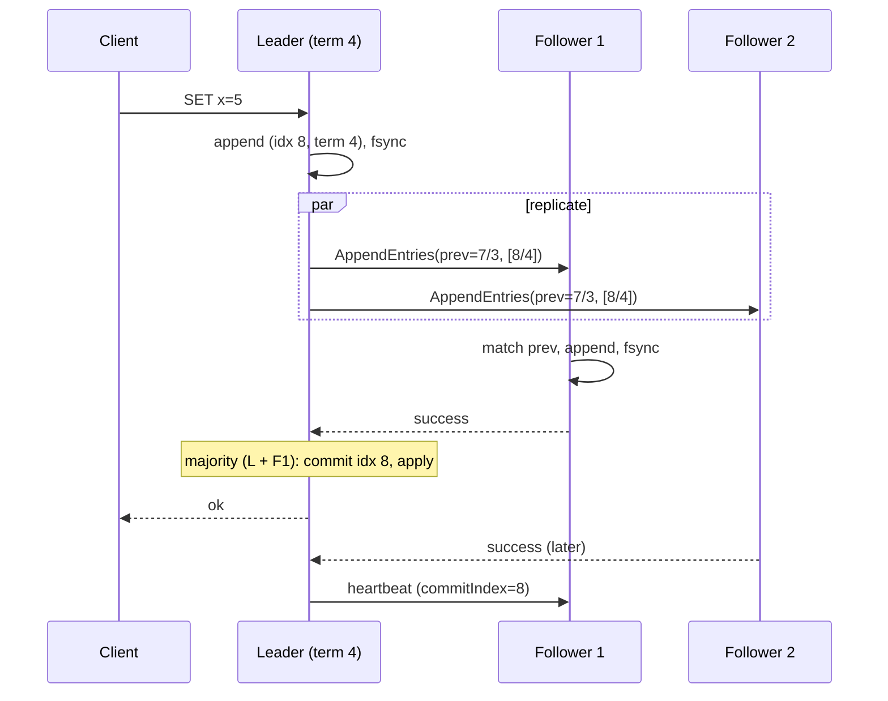
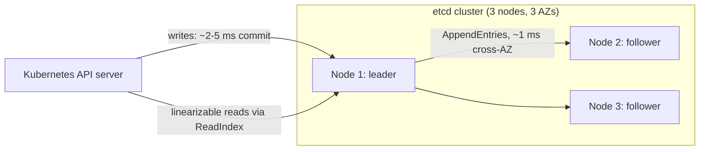

Five servers must agree on the order of operations in a log so that each can apply the same operations to a copy of a state machine and end up in the same state, even though any two of them may crash, messages may be delayed or lost, and there is no shared clock. Quorum replication gets you overlap, not agreement: as [Replication strategies](/learn/system-design/distributed-systems/replication-strategies) showed, two writers with disjoint W-sets leave the replicas with no single order. Consensus is the problem of producing one order, and Raft is the algorithm most systems you have used (etcd, Consul, CockroachDB, TiKV, Kafka's KRaft) use to solve it.

Raft is understandable in a way Paxos is not because it decomposes the problem: elect a single leader; let the leader dictate the log; make sure a new leader always has every committed entry. This lesson works through each part with the details that matter in production, including the one rule (a leader commits only entries from its own term) that everyone gets wrong the first time, and the numbers that bound what a Raft cluster can do.

## The model

Each server holds a log of entries (index, term, command), a current term number, and a state machine to which committed entries are applied in index order. Servers are in one of three states: follower, candidate, leader. Time is divided into terms, numbered increasingly; each term has at most one leader. Servers communicate by two RPCs: `RequestVote` and `AppendEntries` (which doubles as the heartbeat).

The cluster tolerates f failures with 2f + 1 servers: 3 servers survive 1 failure, 5 survive 2. Every decision needs a majority, and any two majorities overlap in at least one server, which is the fact every safety argument uses. Even-sized clusters buy nothing: 4 servers still tolerate only 1 failure and have a larger majority to wait for.

## Leader election

Followers expect heartbeats from the leader. If a follower hears nothing for its **election timeout**, randomly chosen from a range such as 150 to 300 ms, it becomes a candidate: it increments its term, votes for itself, and sends `RequestVote` to everyone.

A server grants its vote if (a) it has not voted in this term, and (b) the candidate's log is at least as up to date as its own, where "up to date" compares the last entry's term first and then its index. Rule (b) is the **election restriction**, and it is what makes a new leader guaranteed to hold every committed entry: a committed entry is on a majority; a candidate needs votes from a majority; the two majorities overlap; the overlapping server refuses to vote for a candidate whose log lacks the entry.

A candidate that gets a majority becomes leader and immediately sends heartbeats. A candidate that hears from a leader with a term at least as high as its own steps down. If two candidates split the vote, neither wins; both time out (randomly, so they are unlikely to collide again) and one retries in a new term. The randomised timeout is the whole trick: it makes split votes rare and self-resolving without any coordination.

```viz
{"type": "system", "scenario": "raft-election", "nodes": 5,
 "title": "Election after leader failure", "caption": "The leader stops sending heartbeats. The follower whose randomised timeout fires first becomes a candidate, increments the term and requests votes. Servers grant a vote only if the candidate's log is at least as current as theirs. A majority makes it leader; it then heartbeats to stop everyone else's timers."}
```

Numbers: with a 150 to 300 ms election timeout and heartbeats every 50 ms, a leader failure is detected in roughly 150 to 300 ms and a new leader elected within one or two round trips after that, so unavailability for writes on a healthy network is under a second. etcd's defaults are a 100 ms heartbeat and 1,000 ms election timeout, deliberately conservative to avoid elections on transient stalls. The timeout must be much larger than the RTT (or candidates time out before their votes return) and much smaller than the acceptable outage.

## Log replication

The leader accepts a client command, appends it to its log with the current term, and sends `AppendEntries` to every follower in parallel. Each `AppendEntries` carries the new entries plus the index and term of the entry immediately before them (`prevLogIndex`, `prevLogTerm`). A follower accepts the entries only if its log has an entry at `prevLogIndex` with term `prevLogTerm`; otherwise it rejects, and the leader retries with an earlier `prevLogIndex` until they agree, then overwrites the follower's divergent suffix with its own. This consistency check gives the **log matching property**: if two logs have an entry with the same index and term, the logs are identical up to that index.

Once the leader has the entry on a majority (itself plus enough followers), the entry is **committed**: the leader advances its `commitIndex`, applies the entry to its state machine, replies to the client, and tells followers the new `commitIndex` in subsequent messages so they apply it too.

```viz
{"type": "system", "scenario": "raft-log-replication", "nodes": 5,
 "title": "Appending, replicating and committing an entry", "caption": "The leader appends locally and sends AppendEntries with the previous entry's index and term. Followers whose logs match accept. When a majority holds the entry the leader marks it committed and applies it; followers learn the commit index on the next message."}
```



The latency of a write is therefore one round trip to the fastest majority plus an fsync on the leader and on each follower in that majority. Same-AZ: about 1 to 2 ms. Cross-region majority: the second-fastest cross-region RTT, 60 to 80 ms.

### The rule everyone gets wrong

A leader may count replicas for commitment only for entries **from its own term**. It cannot conclude that an entry from an earlier term is committed just because it is now on a majority. The scenario (Figure 8 in the Raft paper) with five servers:

| Step | What happens |
|---|---|
| 1 | S1 is leader in term 2, appends entry at index 2 (term 2), replicates it to S2 only, then crashes |
| 2 | S5 wins term 3 with votes from S3, S4 and itself (their logs lack index 2, and S5's log is as up to date as theirs), appends a different index-2 entry (term 3), then crashes |
| 3 | S1 restarts, wins term 4, and continues replicating its old index-2 entry (term 2). It reaches S3. Index 2 (term 2) is now on S1, S2, S3: a majority |
| 4 | If S1 declared it committed by counting replicas, and then crashed, S5 could still win term 5 (its last entry has term 3, newer than term 2 on S2/S3/S4's logs) and overwrite index 2 with its term-3 entry. A "committed" entry would be lost |

The fix: S1 does not commit index 2 by counting. It commits index 2 only *indirectly*, by committing a new term-4 entry at index 3 on a majority; log matching then implies index 2 is on the same majority, and S5 can no longer win an election because its log is older than term 4. That is why every Raft leader appends a no-op entry from its own term immediately on election: to commit everything before it.

### Safety properties

| Property | Statement | Why it holds |
|---|---|---|
| Election safety | At most one leader per term | Each server votes once per term; two majorities overlap |
| Leader append-only | A leader never overwrites or deletes its own entries | By construction |
| Log matching | Same index and term implies identical prefix | The `prevLogIndex/Term` check on every append |
| Leader completeness | A committed entry is in every future leader's log | Election restriction plus commit-only-own-term |
| State machine safety | If a server applied an entry at an index, no other server applies a different entry there | Follows from the four above |

## Membership changes

Adding or removing servers changes what "majority" means, and switching every server's configuration at once is unsafe: during the switch, the old majority and the new majority might not overlap, so two leaders could be elected in the same term. Adding two servers to a three-server cluster at once is the textbook case: old majority is 2 of 3, new majority is 3 of 5, and {S1, S2} and {S3, S4, S5} are disjoint.

Two safe approaches. **Joint consensus**: a transitional configuration where decisions need majorities of *both* the old and the new sets; committed as a log entry; then the new configuration is committed. **Single-server changes**: add or remove one server at a time, which guarantees any old and new majorities overlap; simpler, and what etcd implements. A new server joins as a non-voting learner first, catches up on the log, and only then is promoted to a voter, so a slow catch-up does not block commits.

## Compaction, snapshots and reads

The log grows without bound; each server periodically snapshots its state machine at some index and discards the log before it. A follower that is too far behind to be caught up from the log is sent the snapshot instead (`InstallSnapshot`). Snapshot size is the state size: an etcd cluster with 2 GB of keys writes 2 GB per snapshot, which is the reason etcd has a default storage limit on the order of a few GB and is a configuration store, not a database.

Reads that must be linearizable cannot simply read the leader's state: a leader that has been partitioned may not know it was deposed. Two options: **ReadIndex**, where the leader records its commit index, confirms it is still leader by exchanging a heartbeat with a majority, then serves the read once its state machine has applied to that index (one round trip, no log write); or **lease-based reads**, where the leader serves reads without confirmation for the duration of a lease after its last successful heartbeat round, relying on bounded clock drift, which is faster and slightly less safe. Reads from followers are stale by the replication delay, which is fine for many uses and is etcd's `serializable` read mode.

Client retries need care: a client that times out and resends a command could get it applied twice. Raft's answer is a client session with a sequence number per command; the state machine ignores a command whose sequence it has already applied, the same idempotency-key idea as in [Idempotency and retries](/learn/system-design/building-blocks/idempotency-and-retries).

## Performance and real deployments

Throughput is bounded by the leader's ability to fsync and to replicate. Each committed batch costs one fsync on the leader and on each follower in the majority; on an SSD that is on the order of a millisecond; batching many client commands into one append amortises it. etcd on good hardware sustains on the order of 10,000 writes per second for small values and a few thousand for larger ones, with commit latency of a few milliseconds; its documentation is explicit that disk latency, not CPU or network, is the usual limit, and that a slow disk causes leader elections because heartbeats and appends share the same I/O path.

Cluster size: 3 for most uses (tolerates 1 failure, fastest commits), 5 where two simultaneous failures must be survived (a regional deployment across five zones) at the cost of a larger majority. 7 is rare; every added server adds replication work for the leader without adding write capacity. Systems that need more throughput run many Raft groups, one per shard, each with its own leader: CockroachDB, TiKV and Spanner (with Paxos) scale this way, and a single node can lead some groups and follow others.



Under a partition, the majority side elects a leader if it lacks one and continues; the minority side can neither elect nor commit. A leader stranded in the minority keeps accepting client writes it can never commit, and clients waiting on those writes hang until they time out: this is the CP behaviour from [CAP and PACELC](/learn/system-design/building-blocks/cap-and-pacelc). When the minority rejoins, its stale leader steps down on seeing a higher term. Two refinements avoid disruption: **PreVote** (a would-be candidate first checks whether a majority would vote for it before incrementing its term, so a partitioned server does not return with an inflated term that forces a needless election) and **CheckQuorum** (a leader steps down if it has not heard from a majority within an election timeout, so a stranded leader stops accepting writes sooner).

## A five-node walkthrough

Nodes S1 to S5; S1 is leader in term 3, log has indexes 1 to 10 committed. A partition isolates {S1, S2} from {S3, S4, S5}.

| Time | {S1, S2} | {S3, S4, S5} |
|---|---|---|
| t=0 | S1 accepts write at index 11 (term 3), replicates to S2; only 2 of 5: not committed; client waits | Followers time out (no heartbeats) |
| t≈250 ms | | S4's timeout fires first; term 4; votes from S3, S5 (logs equal): S4 is leader; appends no-op at index 11 (term 4), commits it on majority |
| t=1 s | S1 still leader in term 3 in its own view; more uncommitted entries at 12, 13 | S4 commits client writes at 12, 13, 14 (term 4) |
| Partition heals | S1 receives an AppendEntries from S4 with term 4: steps down to follower | S4 sends AppendEntries with prev=10/3 to S1; S1's index 11 has term 3, not 4: reject; S4 retries from index 10; S1 truncates 11 to 13 and accepts S4's 11 to 14 |
| After | S1, S2's uncommitted term-3 entries are gone; their clients had timed out and will retry with sequence numbers | All five logs identical through 14 |

No committed entry was lost; the only writes discarded were ones no client was told had succeeded.

## Failure modes

**fsync disabled or lying.** For speed, someone turns off fsync, or the disk acknowledges writes from a volatile cache. A power loss on a majority loses committed entries, and Raft's safety proof no longer applies. Detect: durability tests with power cuts; disk configuration audits. Mitigate: never; use fast disks instead.

**Disk latency causing elections.** A follower's slow disk delays its appends; the leader's own slow disk delays heartbeats (they share the WAL path in etcd); followers time out and elect; the cluster flaps. Detect: WAL fsync latency metric correlated with leader changes. Mitigate: dedicated fast disks for the WAL; timeouts sized above disk p99; alerts on fsync latency.

**A slow majority stalls commits.** One slow follower does not matter (the leader waits for the fastest majority). Two slow followers in a five-node cluster do: the majority now includes one of them. Detect: commit latency tracking the second-slowest follower. Mitigate: replace slow nodes; keep clusters homogeneous.

**Lease reads with clock skew.** Lease-based reads assume bounded drift; a leader with a stalled clock serves a stale read after being deposed. Detect: linearizability checkers (Jepsen-style) in CI. Mitigate: ReadIndex where correctness matters; conservative lease margins otherwise.

**Adding servers too fast.** Two servers added at once, or a new server added as a voter before it catches up, breaks majority overlap or stalls commits. Detect: election in the middle of a membership change. Mitigate: one change at a time; learners first.

**Unbounded log.** Snapshots disabled or failing; the log fills the disk; the node dies; the cluster loses a majority. Detect: log size and last-snapshot age. Mitigate: automatic compaction with alerting on failure.

## Interviewer follow-ups

**Q: "Why does Raft need a leader at all? Quorum replication has none."**

Because a quorum gives overlap, not order. Two clients writing concurrently to different W-sets leave replicas with conflicting versions and no single history. A leader serialises: every entry gets one index in one log, and followers accept entries only if their log matches the leader's at the previous index, so all logs are prefixes of the leader's. The leader is a serialisation point, not a bottleneck you cannot remove: for throughput you run many Raft groups with different leaders, which is how CockroachDB and TiKV scale.

**Q: "A leader has an entry from an earlier term on a majority of servers. Is it committed?"**

Not by that fact alone, and this is the subtle case in the Raft paper. A server with a higher-term entry in its log could still win an election, because votes compare last-entry terms, and overwrite the old entry. The leader commits old-term entries only indirectly, by committing an entry from its own current term on top of them; log matching then carries the older entries along, and any future leader must have the new term's entry and therefore the older ones. That is why a leader appends a no-op the moment it is elected.

**Q: "What are the latency and throughput limits of an etcd cluster, and what would you do if you needed more?"**

A write costs one round trip to a majority plus fsync at the leader and the majority's followers: a few milliseconds in-region, mostly disk. Throughput is on the order of 10,000 small writes per second with batching, bounded by the leader's WAL fsync rate; etcd also caps total storage at a few GB because snapshots and compaction are proportional to state size. If I needed more, etcd is the wrong tool: it is for configuration, locks and leader election. For a database-scale workload I shard into many Raft groups, each with its own leader and its own disk, which is what the distributed SQL engines do.

**Q: "How do you make a read linearizable without writing to the log?"**

ReadIndex: the leader notes its current commit index, confirms it is still leader by getting heartbeat responses from a majority, waits for its state machine to apply up to that index, then serves the read. One round trip, no disk write. The confirmation matters because a deposed leader in a partition does not know it was deposed and would otherwise serve stale data. Lease-based reads skip the round trip by trusting that no election can have happened within the lease, which depends on clock drift being bounded; I use them only where a rare stale read is acceptable.

**Q: "Three nodes or five?"**

Three tolerates one failure and commits fastest, which covers a single-AZ loss with one node per AZ and is right for most control planes. Five tolerates two simultaneous failures, which matters when a maintenance restart coincides with a real failure, or in a five-zone regional deployment, and it costs a slightly larger majority to wait for and more replication work on the leader. Never four: same fault tolerance as three, slower. Beyond five, the leader's outbound replication dominates and there is no throughput gain; I would add Raft groups, not members.

## Senior signals

- You explain why **overlap is not agreement** and what the leader adds.
- You state the **election restriction** and derive leader completeness from majority overlap.
- You can walk through **why a leader commits only entries from its own term** and why the no-op on election exists.
- You know that Raft's limits are **fsync and the leader**, quote etcd's order-of-magnitude numbers, and scale with Raft groups rather than bigger clusters.
- You describe **ReadIndex vs lease reads** and choose based on how much you trust clocks.
- You change membership **one server at a time, learners first**, and you can say what goes wrong otherwise.

## Check yourself

```quiz
- q: >-
    A candidate requests votes in term 7. Its last log entry is (index 40, term 5). A voter's last entry is (index 38, term 6). Does the voter grant the vote?
  options: ["Yes, because its index 40 is greater than the voter's 38", "No, because the voter's last entry has a higher term", "Yes, because the candidate's term 7 is higher than 6", "Only if the voter has not yet voted in term 7"]
  answer: 1
  explanation: >-
    Up-to-dateness compares last-entry term first, then index. Term 6 beats term 5 regardless of index, so the voter's log is more up to date. This restriction is what guarantees a new leader holds every committed entry. The candidate's own term only lets it ask; it does not win the log comparison.
- q: >-
    Why does a newly elected Raft leader append a no-op entry immediately?
  options: ["To trigger a snapshot so that lagging followers can catch up", "To announce the membership configuration to all followers", "To commit a current-term entry, which commits earlier ones", "To reset every follower's election timer in the new term"]
  answer: 2
  explanation: >-
    A leader cannot safely treat an earlier-term entry as committed just because it is on a majority (a higher-term log elsewhere could still win an election), so it may not commit those by counting replicas. Committing a current-term entry on top makes the prefix safe via log matching. Heartbeats, not the no-op, reset election timers.
- q: >-
    A five-node cluster is partitioned into {A, B} with the current leader A, and {C, D, E}. What happens to writes?
  options: ["Both sides continue accepting and committing writes", "All writes stop on both sides until the partition heals", "C, D, E elect a leader and commit; A's writes never commit", "C, D and E cannot elect because they lack the leader's log"]
  answer: 2
  explanation: >-
    Commitment needs 3 of 5. A may keep accepting writes, but its side has 2, so those entries never commit and are discarded on heal. The majority side elects a leader whose log is at least as current as any of theirs and proceeds. CheckQuorum makes A step down sooner.
- q: >-
    An etcd cluster's write latency jumps and leader elections become frequent. The most likely cause is:
  options: ["Slow fsync delaying appends and heartbeats alike", "Too many clients opening watches on the leader", "Clock skew between nodes corrupting election timeouts", "An even number of members splitting every vote"]
  answer: 0
  explanation: >-
    Raft commits are bounded by fsync on the leader and a majority; appends and heartbeats share the WAL path, so when the disk stalls, heartbeats are late too, followers time out and elect. Dedicated fast disks and fsync-latency alerts are the fix. Election timeouts are measured on local monotonic timers, so skew does not affect them.
- q: >-
    You want to expand a three-node Raft cluster to five. The safe procedure is:
  options: ["Add one at a time: learner first, promote, then the next", "Stop the cluster, copy the log to the new servers, restart all five", "Add both new servers at once as full voting members", "Add both as learners simultaneously and promote them together"]
  answer: 0
  explanation: >-
    Single-server changes keep every old and new majority overlapping; starting each as a non-voting learner avoids stalling commits while it catches up. Adding two voters at once (or promoting two learners together) allows disjoint majorities ({S1,S2} vs {S3,S4,S5}) and two leaders in one term.
```
