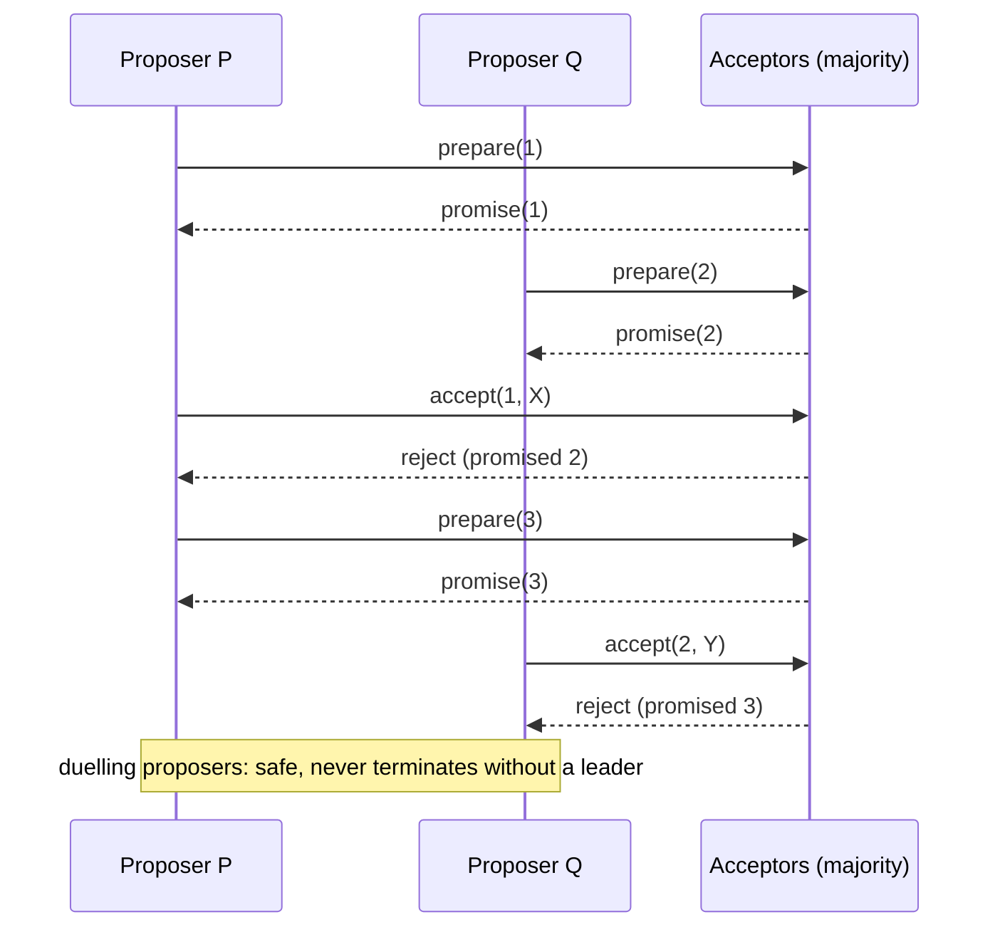
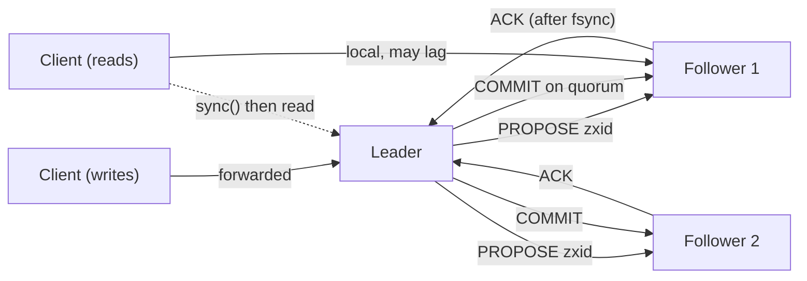

Three servers need to agree on one value: which of them is the leader, or what the next entry in a log is. Any of them may crash. Messages may be delayed arbitrarily. Nobody has a reliable clock. It sounds like a problem with an obvious solution (vote, take the majority) until you try to write down what happens when a server crashes mid-vote, or when two servers each think they have a majority because a message was delayed, or when a server that was slow rather than dead wakes up with a stale view and starts proposing.

Paxos, published by Leslie Lamport in a paper so odd that it took years to be taken seriously, is the first algorithm that gets every one of those cases right, and its core is two rounds of messages and one invariant. Raft ([Consensus with Raft](/learn/system-design/distributed-systems/consensus-raft)) is best understood as Paxos with a leader baked in and the log made explicit; ZooKeeper's ZAB is the same family adapted for a primary-backup system. This lesson builds the intuition for all three, with the worked example that makes Paxos's invariant click.

## Why it is hard

**FLP.** Fischer, Lynch and Paterson proved in 1985 that in an asynchronous system (no bound on message delay or processing time), no deterministic algorithm can guarantee consensus if even one process may crash. The intuition: you cannot distinguish a crashed process from a slow one, so an algorithm that waits for it may wait forever, and an algorithm that proceeds without it may decide differently from what the slow process later decides. Every practical algorithm escapes FLP by giving up on guaranteed termination in some pathological schedule, using timeouts and randomness to make the pathological schedules vanishingly unlikely. Paxos and Raft are always *safe* (never decide two different values) and are *live* (eventually decide) whenever the network behaves for long enough. That split, safety unconditionally and liveness under partial synchrony, is the shape of every correct consensus protocol.

**Majorities.** Two generals on hills cannot agree on an attack time over an unreliable messenger: every acknowledgement needs an acknowledgement. Consensus among 2f + 1 nodes with up to f failures avoids the infinite regress by never needing every node: any decision needs a majority, any two majorities share a node, and that shared node is the memory that carries a decision from one round to the next.

## Single-decree Paxos

Paxos decides one value. Three roles, which in practice every node plays: **proposers** propose values; **acceptors** vote, and their collective memory is the decision; **learners** find out what was chosen. Every proposal has a unique, totally ordered number n (for example a counter with the proposer's ID as tiebreak).

**Phase 1 (prepare / promise).** A proposer picks n and sends `prepare(n)` to the acceptors. An acceptor that has not already promised for a higher number replies `promise(n, v_a, n_a)`: it promises to ignore any proposal numbered below n, and reports the highest-numbered proposal `(n_a, v_a)` it has already accepted, if any.

**Phase 2 (accept / accepted).** If the proposer receives promises from a majority, it chooses a value: if any promise carried an accepted value, it *must* propose the value from the highest-numbered accepted proposal among them; only if none did may it propose its own value. It sends `accept(n, v)`. An acceptor accepts unless it has promised to a higher number, and replies `accepted(n, v)`. When a majority has accepted proposal n, value v is **chosen**. Learners learn it from the acceptors' `accepted` messages.

The invariant that makes it safe: **once a value is chosen, every higher-numbered proposal that reaches phase 2 proposes that same value.** A chosen value is accepted by a majority; any later proposer's phase-1 majority overlaps that majority; the overlapping acceptor reports the chosen value (or a later one, which by induction is the same value); the proposer adopts it. Promises make this airtight: an acceptor that promised n will not accept an older proposal that arrives late, so the majority that chose v cannot be undone by a straggler.

```viz
{"type": "system", "scenario": "quorum", "replicas": 3,
 "title": "Majorities overlap", "caption": "Any two majorities of three acceptors share at least one. That shared acceptor is how a later proposer learns what an earlier majority already accepted; it is the entire reason Paxos can survive proposer crashes."}
```

### Worked example: two proposers, three acceptors

Acceptors A1, A2, A3. Proposer P wants value X; proposer Q wants value Y.

| Step | Message | A1 | A2 | A3 | Notes |
|---|---|---|---|---|---|
| 1 | P: prepare(1) to all | promise(1) | promise(1) | (delayed) | P has a majority: A1, A2, no prior values |
| 2 | P: accept(1, X) | accepted(1, X) | (delayed) | | Only A1 has accepted so far |
| 3 | Q: prepare(2) to all | promise(2, X, 1) | promise(2) | promise(2) | A1 reports it accepted (1, X); A2 has promised 2 |
| 4 | P's delayed accept(1, X) reaches A2 | | rejected | | A2 promised 2 > 1 |
| 5 | Q must propose X (highest accepted value seen) | | | | Q's own Y is abandoned |
| 6 | Q: accept(2, X) | accepted(2, X) | accepted(2, X) | accepted(2, X) | X chosen by majority |

Q wanted Y but had to propose X because one acceptor in its majority had already accepted X. Was X chosen at step 2? No, only A1 had it, so P's proposal could legitimately have been overridden. But the rule is conservative: Q cannot tell whether X was chosen by a majority it did not hear from, so it must assume it might have been. The safety invariant holds either way, and the price is that Q's value never gets a chance in this round.

Now change step 3 so that A1's promise to Q carries no accepted value (say P's accept(1, X) was slower and arrived after Q's prepare). Then Q proposes Y, gets a majority, and Y is chosen; P's late accept(1, X) is rejected everywhere because everyone promised 2. Either way exactly one value is chosen.

### Livelock and the fix

Two proposers can duel forever: P prepares 1, Q prepares 2 (P's accept(1) now rejected), P prepares 3 (Q's accept(2) rejected), Q prepares 4, and so on. Safety is intact; liveness is not, and this is FLP showing up in practice. The fix is a distinguished proposer: elect one (with timeouts, imperfectly) and have only it propose; others forward to it. Duelling then happens only during the brief window when two nodes both think they are the distinguished proposer.



## Multi-Paxos: and then it is basically Raft

A log is a sequence of single-decree instances, one per index. Running both phases for every entry costs two round trips per command. Multi-Paxos observes that if one proposer is stable, it can run phase 1 *once* for all future instances (a prepare covering "every index from here on"), then run only phase 2 for each new entry: one round trip per command, exactly Raft's `AppendEntries`. The stable proposer is a leader; the phase-1 prepare is a leader election; the accepted values are log entries; a majority of accepts is a commit.

| | Multi-Paxos (as typically built) | Raft |
|---|---|---|
| Leader | Optimisation; any node may propose in any slot | Fundamental; only the leader appends |
| Log | May have holes; entries chosen out of order | Contiguous; the consistency check forces prefixes |
| Election | Phase 1 with a higher proposal number | RequestVote with the up-to-date-log restriction |
| Who can lead | Any node; the new leader must first learn and re-propose the highest accepted value per slot | Only a node whose log is at least as current as a majority's |
| Specification | The paper leaves engineering to the reader | The paper specifies everything including membership change |

Raft's restriction that a leader's log is always the most complete removes the need for a new leader to reconcile per-slot values from acceptors, which is the part of Multi-Paxos that implementers most often got wrong. Google's Chubby paper ("Paxos Made Live") describes what that engineering took; Spanner runs a Paxos group per data shard with a long-lived leader and leader leases, which behaves like Raft with a different vocabulary.

```viz
{"type": "system", "scenario": "raft-election", "nodes": 3,
 "title": "A leader election is a Paxos phase 1", "caption": "Raft's RequestVote is Multi-Paxos's prepare for all future slots: the winner may then skip phase 1 and run only accepts. Raft adds the restriction that the winner's log must already be at least as complete as a majority's, which is what lets it avoid per-slot reconciliation."}
```

## ZooKeeper's ZAB

ZooKeeper is a replicated, in-memory hierarchical key-value store used for configuration, locks, leader election and group membership (Kafka before KRaft, HBase, Hadoop). Its replication protocol is ZAB: ZooKeeper Atomic Broadcast. It is a consensus protocol in the Paxos family, tuned for a **primary-backup** system: one primary receives all client writes and broadcasts state changes, and the protocol must deliver those changes in the order the primary generated them.

**zxid.** Every transaction gets a 64-bit ID: the high 32 bits are the epoch (incremented at each new leader), the low 32 bits a counter within the epoch. zxids totally order all transactions ever committed; (epoch, counter) is the same idea as Raft's (term, index) and a Lamport-style timestamp with the leader as the only ticker.

**Phases.** Leader election (a fast election picks the server with the highest last zxid). **Discovery**: the new leader learns the followers' most recent epochs and zxids and establishes a new epoch. **Synchronisation**: the leader brings a quorum of followers up to its history (sending diffs or a snapshot) before any new proposal, so that everything committed in earlier epochs is on the quorum. **Broadcast**: the leader proposes each transaction to followers, which log it to disk and ack; on a quorum of acks the leader sends `COMMIT`; followers apply in zxid order.

Two guarantees distinguish ZAB from a generic consensus log. **Primary order**: if the primary broadcasts a then b, every server delivers a before b; a new primary never delivers an earlier primary's uncommitted transactions after its own. **Prefix recovery**: after a leader change, the new leader's history is a prefix that includes every transaction committed by any earlier leader, and any partially proposed transactions from a deposed leader are either committed on the quorum or discarded, never interleaved. Together they preserve FIFO order per client session, which ZooKeeper exposes as a guarantee: a client's writes are applied in the order it issued them.

**Reads are local.** A ZooKeeper follower serves reads from its own in-memory state without consulting the leader. Reads therefore scale linearly with servers and take microseconds, and they are not linearizable: a follower may be behind the leader by the replication delay. What clients get is sequential consistency plus their own FIFO order: they see a prefix of the true history that only grows. A client that needs a fresh read issues `sync()` first, which makes the follower catch up to the leader's current commit before serving; that is a round trip to the leader and roughly what Raft's ReadIndex costs. Watches (one-shot notifications on a znode change) are delivered to a client in order, before any read that would show the new state, so a client never sees a change without having been notified.



Numbers: a ZooKeeper write costs a quorum round trip plus fsync on the leader and the acking followers, a few milliseconds in-region; write throughput is on the order of thousands to low tens of thousands per second for small znodes and drops as the fraction of writes rises. Reads at a follower are memory speed. The dataset must fit in memory on every server, so ZooKeeper holds configuration, not data. Sessions have a timeout (a few seconds to tens of seconds); if the leader does not hear from a client within it, the session expires and the client's **ephemeral znodes** are deleted, which is how locks and membership are released on client death, and also how they are lost on a long GC pause, the failure mode that [Distributed locks and coordination](/learn/system-design/distributed-systems/distributed-locks-and-coordination) turns on.

## Where they live

| System | Protocol | Role |
|---|---|---|
| Chubby (Google) | Paxos | Lock service and name service; the template for ZooKeeper |
| Spanner | Paxos per shard, with leader leases | Replicated storage under a globally consistent database |
| ZooKeeper | ZAB | Coordination for Kafka (pre-KRaft), HBase, Hadoop, many in-house systems |
| etcd, Consul | Raft | Kubernetes' store, service discovery, locks |
| CockroachDB, TiKV | Raft per range | Replicated storage for distributed SQL |
| Kafka (KRaft) | Raft variant | Replaced ZooKeeper for Kafka's own metadata |

The throughput story is the same everywhere: one leader serialises one log, so one group tops out at the leader's disk and network; batching amortises fsync; scaling out means many groups with different leaders.

## Failure modes

**Duelling proposers.** No stable leader; proposal numbers climb; nothing is chosen for as long as the duel lasts. Detect: proposal rate high, decision rate zero. Mitigate: leader election with randomised timeouts; forward proposals to the leader.

**An acceptor forgets its promise.** Acceptor promises n, crashes before persisting the promise, restarts, and accepts an older proposal it should have rejected; two values can now be chosen. Detect: safety violation found by a checker. Mitigate: promises and accepts are fsynced before replying, always; this is the durability requirement every consensus implementation pays for in latency.

**A quorum with a slow disk.** In a three-node cluster, the leader's fsync plus the fastest follower's fsync is the commit path. One slow disk on the leader slows everything; on a follower it drops that follower from the fastest majority, so a second slow disk stalls commits. Detect: fsync latency per node. Mitigate: dedicated disks, homogeneous hardware.

**Session expiry unnoticed by the holder.** A ZooKeeper client holding a lock via an ephemeral znode pauses (GC, stop-the-world) longer than the session timeout; the znode is deleted; another client takes the lock; the first client resumes believing it still holds it. Detect: fencing-token rejections downstream, if fencing exists. Mitigate: fencing tokens (the znode's version or zxid) checked by the protected resource; treat session expiry as a fatal event in the client.

**Learners learning a value that was never chosen.** Impossible in correct Paxos; possible when an implementation lets learners infer a choice from a non-majority, or counts accepts from different proposal numbers together. Detect: model checking; Jepsen. Mitigate: use an existing implementation.

**ZooKeeper reads assumed fresh.** A follower serves a read that predates a committed write the client's collaborator just made. Detect: "I wrote it, they do not see it" reports. Mitigate: `sync()` before reads that must be fresh; design around watches rather than polling.

## Interviewer follow-ups

**Q: "Explain Paxos's safety in one breath."**

A value is chosen when a majority of acceptors accept the same numbered proposal. Any later proposer must first get promises from a majority, which overlaps the choosing majority, so at least one acceptor reports the chosen value, and the proposer is required to propose the highest-numbered accepted value it sees rather than its own. Promises stop older proposals from sneaking in afterwards. So once a value is chosen, every subsequent proposal carries it, and nothing else can ever be chosen.

**Q: "If Paxos and Raft are equivalent, why did everyone switch to Raft?"**

They decide the same things with the same fault tolerance and the same message costs in the steady state. Raft specifies the whole system: a contiguous log, a leader whose log is always the most complete so no per-slot reconciliation is needed after election, membership changes, snapshots, and client interaction. Multi-Paxos as published leaves those to the implementer, and Google's own account of building Chubby describes how much went wrong filling the gaps. I would pick Raft for anything new, and I would describe Spanner's Paxos groups with leader leases as Raft-shaped in practice.

**Q: "Are ZooKeeper reads linearizable?"**

No, by default. Followers serve reads locally from memory, so a read can lag the leader by the replication delay; what you get is sequential consistency with FIFO order per client, meaning you only ever see a growing prefix of history. Writes are linearizable because they all go through the leader and ZAB orders them by zxid. A client that needs a fresh read calls `sync()`, which forces its follower to catch up to the leader before answering, one extra round trip. Most coordination code does not need it because watches deliver changes in order before any read would show them.

**Q: "You hold a ZooKeeper lock and your JVM pauses for 40 seconds. What happens?"**

The session timeout, say 10 seconds, expires at the leader; my ephemeral znode is deleted; the next waiter's watch fires and it takes the lock. When my JVM resumes, my client library tells me the session expired, but the code that was mid-operation does not know that until it checks. Anything it writes in the meantime is a write from a lock holder that is not the lock holder. So the resource being protected must check a fencing token, the znode's version or the lock's zxid, and reject anything older than the latest grant; and my client treats session expiry as fatal and stops. ZooKeeper's guarantee is about its own state, not about whether my process has been scheduled.

**Q: "What does FLP actually prevent you from building?"**

A consensus algorithm that is guaranteed to terminate in a fully asynchronous system with one crash. It does not prevent a safe algorithm, and it does not prevent one that terminates whenever the network is eventually well-behaved for a bounded period. Paxos and Raft are that: always safe, live under partial synchrony. In practice the pathological schedules that stall them, endless duelling elections or a network that always delays the one crucial message, are made rare with randomised timeouts and stable leaders. What I take from FLP in design is that any protocol promising both guaranteed progress and safety with no timing assumptions is wrong.

## Senior signals

- You can state **FLP** correctly and explain how real protocols keep safety unconditional and buy liveness with timing assumptions.
- You can run **single-decree Paxos by hand** with two proposers and show why the second must adopt the first's value.
- You describe **Multi-Paxos with a stable leader** and explain the one restriction Raft adds that removes per-slot reconciliation.
- You know **ZAB's primary-order guarantee** and that ZooKeeper reads are local and not linearizable without `sync()`.
- You treat **fsync of promises and accepts** as the non-negotiable cost of consensus and can tie it to commit latency.
- You connect **session expiry** and ephemeral znodes to fencing tokens without being prompted.

## Check yourself

```quiz
- q: >-
    In Paxos phase 2, a proposer with promises from a majority finds that one acceptor already accepted (n=3, v=X). The proposer wanted Y. It must propose:
  options: ["Nothing; it must restart phase 1 with a higher number", "Either, since neither has yet reached a majority", "X, because it may already have been chosen", "Y, because its proposal number is higher"]
  answer: 2
  explanation: >-
    The proposer cannot know whether X was accepted by a full majority it did not hear from, so it conservatively adopts the highest-numbered accepted value it sees and preserves it. This is the invariant that keeps a chosen value from ever being overturned. A higher proposal number does not license overwriting a possibly chosen value.
- q: >-
    Two proposers keep issuing higher-numbered prepares, each invalidating the other's accept phase. Which property is violated?
  options: ["Neither, because Paxos resolves this within a round", "Liveness, because no value is chosen while it lasts", "Safety, because two values may end up chosen", "Both, because each duel may overwrite a chosen value"]
  answer: 1
  explanation: >-
    Promises guarantee at most one value is ever chosen, so safety holds. Progress fails until a distinguished proposer (leader) is established, which is how implementations avoid the FLP-shaped stall.
- q: >-
    A ZooKeeper client reads a znode from a follower immediately after another client's write was acknowledged by the leader. What may it see?
  options: ["Possibly the old value, unless it calls sync() first", "An error until the follower has applied the write", "A torn mix of the old and new values of the znode", "Always the new value, since the write was acknowledged"]
  answer: 0
  explanation: >-
    ZooKeeper trades linearizable reads for read scalability: followers serve reads locally and may lag. Clients see a growing prefix of history (sequential consistency) and their own writes in order; sync() provides a fresh read at the cost of a round trip to the leader. Acknowledgement by a quorum does not mean every follower has applied it.
- q: >-
    Why must a Paxos acceptor persist its promise to disk before replying?
  options: ["So learners can read the promise to find the chosen value", "To avoid resending promises and so reduce network traffic", "It need not; a majority of other acceptors holds it anyway", "So a restart cannot make it accept what it promised to reject"]
  answer: 3
  explanation: >-
    The promise is part of the safety argument: a majority that promised n must never accept anything below n. An acceptor that crashes, forgets and accepts an older proposal breaks the overlap reasoning, and two different values could be chosen. This fsync is why consensus commit latency is disk-bound.
- q: >-
    Which statement best describes the relationship between Multi-Paxos and Raft?
  options: ["Raft tolerates more node failures for the same cluster size", "Raft is Multi-Paxos with a mandatory leader and log rules", "They are unrelated algorithms solving two different problems", "Multi-Paxos needs no leader, so it is faster for every write"]
  answer: 1
  explanation: >-
    Raft adds a contiguous log and the rule that only a node with the most complete log can lead, which removes per-slot reconciliation after election. Both tolerate f failures with 2f+1 nodes and cost one round trip per entry in steady state. Raft's restrictions and its fully specified membership, snapshot and client rules are what made it the practical default.
```
