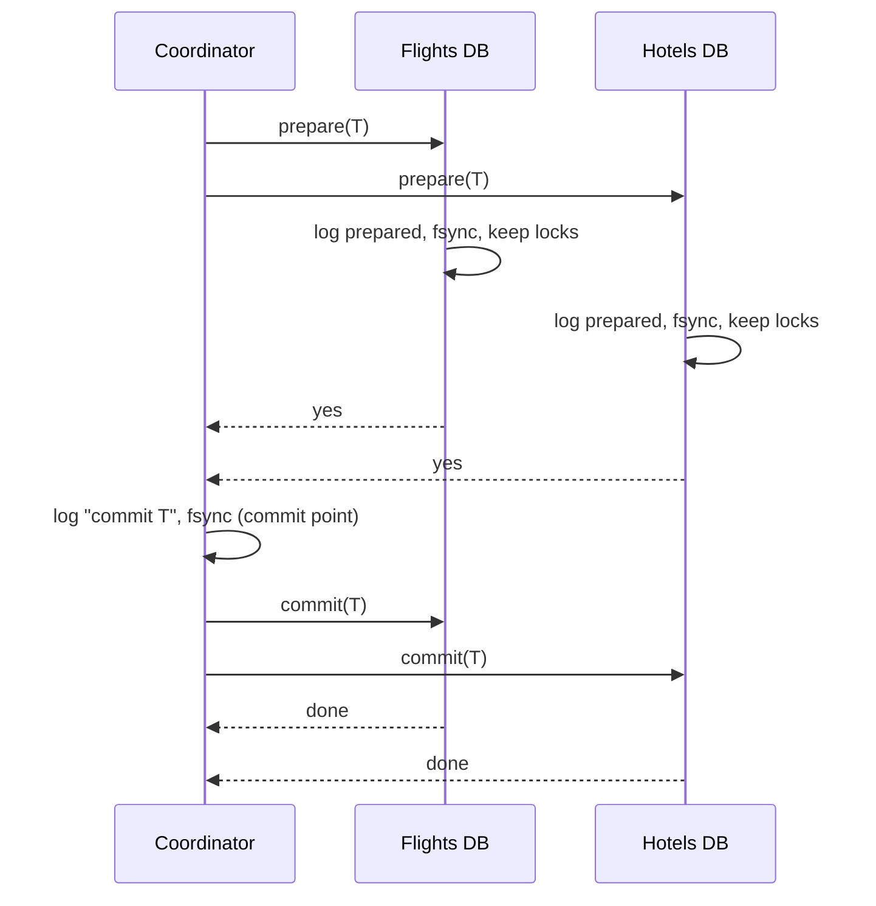

A trip booking needs a flight, a hotel and a car, held by three services with three databases. Either all three are booked or none is: nobody wants a hotel in a city they cannot fly to. In one database this is `BEGIN; ...; COMMIT`, and the storage engine makes the writes atomic. Across three databases no engine is in charge, and the naive sequence (book the flight, book the hotel, book the car) leaves a flight and a hotel booked when the car service is down.

Atomicity across systems is hard because the systems fail independently and the network between them fails at the worst moment. There are three families of answer: a protocol that makes every participant commit or abort together (two-phase commit, and its descendants inside Percolator and Spanner), a sequence of local transactions with undo steps (sagas), and a restructuring that turns "write here and also there" into "write here, and let the other system follow" (the transactional outbox). The senior bar is knowing which one fits and exactly how each fails.

## Two-phase commit

A **coordinator** drives the protocol; the databases are **participants**. The transaction's writes have already been executed on each participant, uncommitted and holding locks.

- **Phase 1, prepare.** The coordinator sends `prepare(T)`. Each participant makes sure it *can* commit: it writes the changes and a "prepared T" record to its write-ahead log, fsyncs, keeps its locks, and votes yes. One that cannot (constraint violation, disk full) votes no. A yes vote is a promise: the participant may no longer abort on its own.
- **Phase 2, decide.** If every vote is yes, the coordinator writes "commit T" to its log and fsyncs. **That write is the commit point.** It then sends `commit(T)`; participants commit, release locks and acknowledge. Any no vote or timeout leads to "abort T".

```viz
{"type": "system", "scenario": "two-phase-commit", "nodes": 3,
 "title": "Prepare, vote, decide, commit", "caption": "Each participant fsyncs a prepared record before voting yes and holds its locks. The coordinator's logged decision is the commit point. Step through to the moment after the votes and before the decision: that is where a coordinator crash leaves everyone stuck."}
```



### A crash at every step, traced

| Crash point | Participants at that moment | What they can do | Outcome after recovery |
|---|---|---|---|
| Coordinator, before sending prepare | Active, locks held, no vote given | Time out and abort on their own: they promised nothing | Abort |
| Coordinator, after some prepares | Prepared ones are **in doubt**; the rest are active | Active ones abort; prepared ones must hold locks and wait | Coordinator restarts, finds no decision, aborts, tells the prepared ones |
| Coordinator, after all yes votes, before logging | All in doubt | Wait, locks held, for the whole outage | No decision logged: abort |
| Coordinator, after logging commit, before sending | All in doubt | Wait | Restart reads "commit T" and resends: commit |
| Coordinator, after some commit messages | Some committed, the rest in doubt | The rest wait | Resend commit (idempotent) to everyone: commit |
| Participant, before voting | Coordinator times out waiting for its vote | | Coordinator aborts; the participant finds no prepared record on restart and aborts |
| Participant, after voting yes | Coordinator may have committed | On restart it finds its prepared record and re-acquires the locks, but cannot decide alone | Asks the coordinator, then commits or aborts |

Two design points fall out. **Presumed abort**: if "no decision in the log" means abort, the coordinator never needs to force an abort record to disk or remember aborted transactions, which is the variant most implementations use. And the **in-doubt window** exists at every point after a participant votes yes and before it hears the decision; a coordinator crash inside it turns into locks held for as long as the coordinator is down. Operators can force **heuristic** decisions on in-doubt participants, which restores availability at the risk of one participant committing while another aborts, to be repaired by hand.

### The cost, in numbers

A 2PC commit adds two round trips and at least three fsyncs (each participant's prepare, the coordinator's decision) to the critical path, and every lock is held across all of it. The throughput of a contended row is bounded by 1 / lock-hold time:

| Placement | Lock hold added by 2PC (RTT, 1 ms fsync) | Ceiling on one hot row |
|---|---|---|
| One database, no 2PC | ~1 ms (one fsync) | ~1,000 transactions/s |
| Participants in one region (0.5 ms RTT) | 2 × 0.5 + 2 × 1 ≈ 3 ms | ~330 transactions/s |
| Participants in two regions (70 ms RTT) | 2 × 70 + 2 ≈ 142 ms | ~7 transactions/s |

Availability multiplies too: a commit needs the coordinator and every participant up, so four components at 99.9% each give 0.999⁴ ≈ 99.6%, about 35 hours a year of failed or blocked commits instead of 9.

### Three-phase commit and its assumption

Three-phase commit inserts a **pre-commit** round between the vote and the commit: the coordinator tells everyone "all voted yes" before anyone commits, and the rules become "a participant that times out after receiving pre-commit commits; one that times out before it aborts". That removes blocking on a coordinator crash, **provided a timeout means a crash**, which holds only in a synchronous network with bounded delays. Under a partition it fails:

| Step | Coordinator | P1 | P2, P3 |
|---|---|---|---|
| 1 | All three voted yes | prepared | prepared |
| 2 | Sends pre-commit; only P1's copy arrives, then the coordinator crashes and a partition cuts P1 off | pre-committed | prepared, uncertain |
| 3 | | Times out after pre-commit: **commits** | Run recovery among themselves: nobody reachable is pre-committed, so **abort** |

One participant committed and two aborted. That is why nobody runs 3PC; the version that works replicates the coordinator's decision with consensus instead (Gray and Lamport's Paxos Commit, and in practice Spanner).

### Under the hood: where 2PC lives

Postgres participates through `PREPARE TRANSACTION` and `COMMIT PREPARED`, but `max_prepared_transactions` defaults to 0, so it is off until you enable it, and a forgotten prepared transaction keeps its locks and holds back vacuum's horizon until someone finds it in `pg_prepared_xacts`. XA across a database and a message broker puts the application server in the coordinator's seat, where its crash blocks the database, and is widely avoided. Kafka's transactions are a 2PC whose coordinator is a replicated broker-side component, covered in [exactly-once semantics](/learn/system-design/distributed-systems/exactly-once-semantics). The safe pattern is 2PC inside one system that replicates its coordinator, described next.

## Percolator and Spanner: 2PC with the coordinator made durable

**Percolator** (Google, 2010, on Bigtable; the model TiDB uses on TiKV) adds multi-row transactions to a store that only offers single-row atomicity. A timestamp oracle hands out increasing timestamps (the paper reports about 2 million per second from one machine, by batching). One written row is the **primary**; its lock is the whole transaction's commit point. Transfer $7 from Bob ($10) to Joe ($2):

| Step | Bob (primary) | Joe (secondary) | Notes |
|---|---|---|---|
| 0 | data@5 = 10; write@6 → 5 | data@5 = 2; write@6 → 5 | Committed state visible at timestamps ≥ 6 |
| 1 | Prewrite: data@7 = 3, lock@7 = "primary" | Prewrite: data@7 = 9, lock@7 = "primary is Bob" | start_ts = 7; a conflicting lock or a newer write aborts the transaction |
| 2 | Commit: write@8 → 7, erase lock@7 | | commit_ts = 8. **Commit point**: one atomic single-row write |
| 3 | | write@8 → 7, erase lock@7 | Secondaries can be committed lazily |

If the client dies between steps 2 and 3, a reader of Joe at timestamp 9 finds lock@7, follows it to Bob, sees write@8 for start 7 and **rolls Joe forward**. If it died before step 2, the reader finds Bob's primary lock still present, and once the lock's owner is known to be dead it **rolls back** both. The coordinator's durable decision lives in the primary row, so nothing blocks on a dead client for longer than the liveness check. The price is two timestamp-oracle calls and two write rounds per transaction, and snapshot isolation rather than serializability.

**Spanner** runs classic 2PC, but every participant and the coordinator are Paxos groups. Each participant leader takes locks, picks a prepare timestamp and replicates its prepare record through Paxos; the coordinator leader picks a commit timestamp at least as large as every prepare timestamp and `TT.now().latest`, replicates the decision through Paxos, performs **commit wait** (the arithmetic is in [time and ordering](/learn/system-design/distributed-systems/time-and-ordering)), and releases. A coordinator machine failing is a Paxos leader change, not an in-doubt outage. **CockroachDB** goes further with **parallel commits**: the transaction record is written in a `STAGING` state alongside the final writes, and the transaction counts as committed as soon as all of them are replicated, so a commit costs one round of consensus instead of two.

## Sagas

A saga replaces one atomic transaction with a sequence of **local transactions** T1 … Tn, each committed independently, and a **compensating transaction** Ci for each Ti that semantically undoes it. If Tk fails, the saga runs C(k−1) … C1 in reverse. No locks are held across services.

| Step | Local transaction | Compensation |
|---|---|---|
| T1 | Reserve flight seat | Cancel reservation (free within the hold window) |
| T2 | Book hotel room | Cancel booking |
| T3 | Reserve car | Cancel reservation |
| T4 | Charge card (**pivot**) | Refund (costly, so it goes last among the undoable steps) |
| T5 | Send confirmation email | None: retried until it succeeds |

```viz
{"type": "system", "scenario": "saga", "steps": [{"service":"Flight svc","step":"T1 book flight","undo":"C1 cancel flight","ok":"flight booked","undone":"flight cancelled","why":"The seat goes back to the airline; the booking and its cancellation are both on record."},{"service":"Hotel svc","step":"T2 book hotel","undo":"C2 cancel hotel","ok":"hotel booked","undone":"hotel cancelled","why":"The room goes back on sale."},{"service":"Car svc","step":"T3 reserve car","undo":"–","ok":"reserved","undone":"–"}],
 "title": "Forward steps, then compensations on failure",
 "caption": "Each step commits locally. When the car reservation fails, the saga runs the compensations for the hotel and flight in reverse. The intermediate state (flight booked, no car) is visible to other transactions while it lasts."}
```

### A saga traced through a timeout and a failure

The orchestrator persists its state before each step and uses (saga id, step) as the idempotency key:

| # | Orchestrator state | Action | Result | Why |
|---|---|---|---|---|
| 1 | RESERVING_FLIGHT | reserve flight, key s42/1 | ok, seat 14C | |
| 2 | BOOKING_HOTEL | book hotel, key s42/2 | **timeout** | Unknown, not failed: the hotel may have booked |
| 3 | BOOKING_HOTEL | retry with key s42/2 | ok, room 812 (the hotel returns the original result) | The retry is safe because the hotel deduplicates on the key |
| 4 | RESERVING_CAR | reserve car, key s42/3 | **fail**: no cars | A definite failure before the pivot |
| 5 | CANCELLING_HOTEL | cancel room 812, key s42/C2 | ok | Compensate in reverse |
| 6 | CANCELLING_FLIGHT | cancel seat 14C, key s42/C1 | ok | |
| 7 | FAILED | | | User told no trip was booked |

Had step 2 been treated as a failure, step 5 would have run for a booking the orchestrator believed never happened, and a room would stay booked with nobody to pay for it; had it been treated as success without the retry, the saga would have built on nothing. Past the pivot (T4) the saga never rolls back: a failed email is retried until it goes out, then alerts.

### Orchestration and the engines behind it

An **orchestrator** is a persisted state machine; after a crash it rereads its table and resumes. **Choreography** has each service react to the previous one's event with no central record, which makes compensation order and "where is saga s42?" hard to answer. [Event-driven architecture](/learn/system-design/building-blocks/event-driven-architecture) compares them; for compensating workflows, orchestration wins. The engines that run orchestrated sagas are durable-execution systems: Temporal (and Cadence, its predecessor at Uber) records every step's result in an event history and replays the workflow code after a crash; AWS Step Functions persists a state machine; Netflix built Conductor to orchestrate workflows that span microservices (and stopped maintaining the open-source repository in December 2023).

### Designing compensations

- **Semantic, not physical, undo.** A refund is not a deleted charge. The original action stays on record with its compensation beside it, as accounting requires.
- **Order by compensability.** Cheap-to-undo steps first, the **pivot** (after which the saga will not roll back) as late as possible, non-compensatable steps after it. Steps after the pivot must be able to succeed eventually.
- **Idempotent everything**, keyed by (saga id, step), because the orchestrator retries every ambiguous outcome.
- **Compensations tolerate a missing forward step.** Cancelling a reservation that never happened returns success, since a timed-out step may not have run.

### What sagas give up: isolation

A saga's intermediate states are visible. Between T2 and T3, another user's search sees room 812 as booked; if the saga compensates, a third saga may have been told "no rooms" for nothing, and two sagas updating the same inventory counter can lose updates. These are the anomalies of [isolation levels and anomalies](/learn/databases/relational-fundamentals/isolation-levels-and-anomalies), across services. Countermeasures from Garcia-Molina and Salem's 1987 paper and its successors:

| Countermeasure | Mechanism |
|---|---|
| Semantic lock | The forward step writes `PENDING`; readers treat pending records as unavailable or show "in progress"; the pivot confirms |
| Commutative updates | Increments and decrements instead of overwrites, so interleavings do not lose updates |
| Pessimistic ordering | Steps whose dirty state would hurt most run after the pivot |
| Reread before commit | Verify the state the saga relied on is unchanged; abort if not |

## Transactional outbox

The most common "distributed transaction" is one database plus a broker: save the order *and* publish `OrderPlaced`. The outbox writes the order row and an event row in the same local transaction; a relay publishes the events afterwards, at least once; consumers deduplicate on the event id. A crash can delay an event or publish it twice, never lose it or publish one for an order that rolled back.

```viz
{"type": "system", "scenario": "outbox", "requests": 4,
 "title": "One local transaction, then asynchronous publish", "caption": "The event is committed in the same transaction as the data, so it can never be lost or orphaned. The relay's publish may repeat after a crash, which is why the event carries a unique ID for consumers to dedupe on."}
```

This turns cross-system atomicity into a local commit, at-least-once delivery and idempotent consumers, problems covered in [idempotency and retries](/learn/system-design/building-blocks/idempotency-and-retries). A CDC relay such as Debezium reading the WAL is the usual implementation ([change data capture](/learn/big-data/streaming/change-data-capture)), and saga steps use the same pattern to emit "step done" events.

## Worked design: the trip, end to end

Put the pieces together for the opening problem, at 50 bookings per second with a 15-minute hold window at the airline.

1. The **trip service** owns an orchestrated saga per booking. Its state row and an outbox event commit together in one local transaction at every transition, so a crash between "state changed" and "command sent" cannot happen; the relay delivers each command at least once.
2. The **flight, hotel and car services** each apply a command in one local transaction that writes the reservation as `PENDING` with an expiry, records the idempotency key (saga id, step) in a unique-keyed table, and writes a reply event to their own outbox. A duplicate command hits the unique key and returns the stored reply.
3. **Payment** is the pivot. The payment service calls the card processor with an idempotency key derived from the saga id, so a retried charge after a timeout returns the first result rather than charging twice.
4. After the charge succeeds, the orchestrator sends `confirm` to the three reservation services, which flip `PENDING` to `CONFIRMED`. Confirmations and the email are after the pivot: retried until they succeed, alerting after 10 minutes.
5. If anything fails before the pivot, the orchestrator sends cancellations in reverse. If the orchestrator itself is down for longer than the hold window, the `PENDING` expiry releases the seat and room on its own, and the saga's later confirmation attempt fails loudly instead of confirming a released seat.

Nothing here holds a lock across services, and every cross-service arrow is an outbox event plus an idempotent consumer. What the design gives up is isolation: for up to 15 minutes, a pending room is unavailable to other customers even if the trip will fail, which is the product trade the semantic lock makes explicit.

## Choosing

| | 2PC with a replicated coordinator | Saga | Outbox | Single database |
|---|---|---|---|---|
| Atomicity | All or nothing | Eventually: all steps or all compensated | Data plus event | Yes |
| Isolation | Yes, locks held | None without semantic locks | N/A | Yes |
| Latency | 2 rounds plus fsyncs; locks held throughout | Sum of fast local commits | One local commit | One local commit |
| Coordinator failure | Consensus leader change | Orchestrator resumes from its table | Relay resumes | N/A |
| Across independently run services | Avoid | Yes | Yes | No |
| Best for | Cross-shard writes inside one database (Spanner, CockroachDB, TiDB) | Multi-service workflows | Write plus publish | Everything that fits |

Look first for a **single-writer** design that needs no distributed transaction (one service owns the whole trip record); use the outbox for write-plus-publish; a saga with `PENDING` states and a deliberate pivot for multi-service workflows; and 2PC only inside a system that replicates its coordinator. [Payment system](/learn/system-design/case-studies/payment-system) and [ticket booking](/learn/system-design/case-studies/ticket-booking) apply these choices.

## Failure modes

| Failure | Symptom | Diagnosis | Fix |
|---|---|---|---|
| Coordinator down with participants in doubt | Queries on unrelated features hang on row locks | Prepared-transaction age and lock waits on participants point at one coordinator | Replicated coordinator; no 2PC across services |
| Forgotten Postgres prepared transaction | Table bloat and lock waits weeks after a middleware crash | `pg_prepared_xacts` lists an old entry holding back the xmin horizon | Commit or roll back it by hand; alert on prepared-transaction age |
| Timeout treated as failure | Orphaned hotel bookings nobody paid for | Reconciliation finds bookings whose saga compensated | Retry with the same key until a definite answer |
| Compensation cannot succeed | Saga stuck in a compensating state | The refund service is down or rejects the refund | Retry with backoff indefinitely, alert after N minutes, manual queue |
| Non-idempotent step retried | Two cars reserved for one trip | Duplicate records with the same saga id | Key every step by (saga id, step); services deduplicate |
| Intermediate state shown to users | Support calls about half-booked trips | Reads of `PENDING` records without the flag | Semantic locks; "booking in progress" in the UI |
| Outbox relay stalls | Downstream silent though writes succeed | Age of the oldest unpublished outbox row | CDC relay, alert on age, delete or partition published rows |

## Interviewer follow-ups

**"The order service writes the order and publishes an event. Two-phase commit between Postgres and Kafka?"** Model answer: no; XA makes the application server the coordinator, whose crash leaves order rows locked, and the outbox gives the same atomicity with one local commit plus a relay and consumer dedupe. Common wrong answer: "write to Postgres, then publish, and retry on failure," which loses the event when the process dies between the two.

**"What happens if the coordinator dies right after collecting yes votes?"** Model answer: every participant is in doubt, holding locks, and must wait for the coordinator's recovery; with presumed abort and no logged decision it aborts on restart. Hence a replicated coordinator (Spanner, CockroachDB) or no 2PC. Common wrong answer: "the participants time out and abort," which risks aborting a transaction the coordinator committed.

**"A saga step times out. What does the orchestrator do?"** Model answer: retry the same step with the same idempotency key until it gets a definite answer; compensate only on a definite failure before the pivot. Common wrong answer: "compensate immediately," which cancels things that may have succeeded, or not at all.

**"Why does nobody use three-phase commit?"** Model answer: it avoids blocking only if a timeout reliably means a crash; under a partition one side commits after pre-commit while the other aborts. Replicating the decision with consensus solves blocking without that assumption. Common wrong answer: "it is too slow," which is true but not the reason.

**"How is Percolator's commit atomic without a coordinator process?"** Model answer: the primary row's lock is the coordinator's state; committing is one atomic write to the primary, and readers who find a secondary lock resolve it by checking the primary, rolling forward or back. Common wrong answer: "Bigtable supports multi-row transactions."

## What mid-level engineers get wrong

- **Catching exceptions and calling it a saga.** Consequence: a process crash between steps loses the saga's state, and nobody compensates the flight.
- **Treating a timeout as a failure.** Consequence: compensations run for steps that succeeded, leaving orphaned bookings.
- **Putting a non-compensatable step before the pivot.** Consequence: a later failure leaves an email sent or a package shipped for a cancelled order.
- **Using 2PC across services over a WAN.** Consequence: hot rows limited to single-digit transactions per second, and a coordinator crash that locks every participant.
- **Assuming a saga is isolated.** Consequence: other users act on bookings that a compensation will remove.
- **Enabling `PREPARE TRANSACTION` without monitoring.** Consequence: an orphaned prepared transaction holds locks and bloats tables for weeks.

## Exercise

```exercise
id: saga-orchestrator
title: Run an orchestrated saga
prompt: |
  An orchestrator runs `steps` in order. `pivot` is the index of the pivot
  step: steps at or before it can be compensated; steps after it cannot.
  `outcomes` maps a step name to the results of its successive attempts
  (`"ok"`, `"fail"` or `"timeout"`); attempts beyond the listed ones, or of
  unlisted steps, return `"ok"`.

  Rules:
  - Every attempt appends the step name to the action log.
  - `"ok"`: move to the next step.
  - `"timeout"`: the outcome is unknown, so retry the same step.
  - `"fail"` at an index after the pivot: retry the same step (forward recovery).
  - `"fail"` at or before the pivot: append `"undo <name>"` for every step
    that completed, most recent first, and stop with status `"compensated"`.

  Return `{"actions": [...], "status": "committed" | "compensated"}`.
languages: [python, javascript]
entry: run_saga
starter:
  python: |
    def run_saga(steps, pivot, outcomes):
        actions, done = [], []
        return {"actions": actions, "status": "committed"}
  javascript: |
    function run_saga(steps, pivot, outcomes) {
      const actions = [];
      const done = [];
      return { actions, status: "committed" };
    }
tests:
  - args: [["flight", "hotel", "car", "charge", "email"], 3, {}]
    expected: {"actions": ["flight", "hotel", "car", "charge", "email"], "status": "committed"}
  - args: [["flight", "hotel", "car", "charge", "email"], 3, {"car": ["fail"]}]
    expected: {"actions": ["flight", "hotel", "car", "undo hotel", "undo flight"], "status": "compensated"}
    label: failure before the pivot compensates in reverse
  - args: [["flight", "hotel", "car", "charge", "email"], 3, {"hotel": ["timeout", "ok"]}]
    expected: {"actions": ["flight", "hotel", "hotel", "car", "charge", "email"], "status": "committed"}
    label: a timeout is retried, not compensated
  - args: [["flight", "hotel", "car", "charge", "email"], 3, {"flight": ["fail"]}]
    expected: {"actions": ["flight"], "status": "compensated"}
    label: the first step fails, nothing to undo
  - args: [["flight", "hotel", "car", "charge", "email"], 3, {"email": ["fail", "fail"]}]
    expected: {"actions": ["flight", "hotel", "car", "charge", "email", "email", "email"], "status": "committed"}
    hidden: true
    label: past the pivot, failures are retried
  - args: [["flight", "hotel", "car", "charge", "email"], 3, {"charge": ["timeout", "fail"]}]
    expected: {"actions": ["flight", "hotel", "car", "charge", "charge", "undo car", "undo hotel", "undo flight"], "status": "compensated"}
    hidden: true
    label: the pivot itself fails after a timeout
hints:
  - "Keep an attempt counter per step to index into its outcomes list."
  - "Only a definite failure at or before the pivot ends the saga; everything else loops on the same step."
```

## Senior signals

- You describe 2PC by its commit point (the coordinator's logged decision) and its in-doubt window, and you can say what each crash point leaves locked.
- You quantify 2PC's cost as lock-hold time bounding hot-row throughput, and availability as the product of every participant's.
- You explain why 3PC's timeout rule breaks under a partition, and that the real fix is replicating the coordinator's decision (Spanner, Paxos Commit, Percolator's primary row).
- You design sagas with a pivot, compensatable steps before it, retry-until-success after it, and every step idempotent on (saga id, step), and you treat a timeout as unknown.
- You name what sagas lose (isolation) and apply semantic locks.
- You reach for the outbox for write-plus-publish, and first look for a single-writer design that needs no distributed transaction.

## Check yourself

```quiz
- q: >-
    In two-phase commit, at what moment is the transaction irrevocably committed?
  options: ["When every participant has voted yes to the coordinator", "When the client receives the commit acknowledgement", "When the first participant has committed locally", "When the coordinator durably logs its commit decision"]
  answer: 3
  explanation: >-
    Yes votes are promises, not a decision; the coordinator may still abort if another vote is missing. The logged decision is the commit point: after it, recovery always drives participants to commit. Participants commit and the client learns of it afterwards.
- q: >-
    The coordinator crashes after all participants voted yes but before it logged a decision, and restarts ten minutes later. Using presumed abort, what happened in between and what is the outcome?
  options: ["Participants waited with locks held; the transaction aborts", "Participants aborted at once; the restart finds nothing", "Participants elected a new coordinator, which committed", "Participants timed out and committed, since all voted yes"]
  answer: 0
  explanation: >-
    A participant that voted yes is in doubt: it cannot commit (a vote could have been missing) or abort (the coordinator could have committed), so it holds its locks for the whole outage. On restart the coordinator finds no decision record, which under presumed abort means abort.
- q: >-
    Two participants are in regions 70 ms apart. Roughly how many transactions per second can update one hot row under 2PC?
  options: ["About 1,000, since fsync dominates the commit time", "Unlimited, since each participant commits on its own", "About 330, as with participants in one region", "About 7, since locks span two cross-region trips"]
  answer: 3
  explanation: >-
    Locks are held from prepare until the commit arrives: about 2 × 70 ms plus fsyncs, roughly 142 ms, so a contended row manages about 7 transactions per second. In one region the same arithmetic gives a few milliseconds and hundreds per second.
- q: >-
    Under three-phase commit, a partition separates one pre-committed participant from two that are only prepared, and the coordinator crashes. What happens?
  options: ["All three block until the coordinator comes back", "All three abort, because the coordinator is missing", "The pre-committed one commits; the other two abort", "All three commit, because everyone had voted yes"]
  answer: 2
  explanation: >-
    3PC's rules assume a timeout means a crash. The isolated participant times out after pre-commit and commits; the other two find nobody pre-committed among themselves and abort. The outcome diverges, which is why systems replicate the coordinator's decision instead of running 3PC.
- q: >-
    A saga's hotel step times out with no response. What should the orchestrator do?
  options: ["Mark the saga failed and stop without compensating", "Run the compensations at once, treating it as a failure", "Retry the step with the same idempotency key", "Skip to the car step, treating the hotel as booked"]
  answer: 2
  explanation: >-
    A timeout is an unknown outcome: the hotel may have booked. Compensating could cancel something that succeeded or leave a room nobody pays for; proceeding could build on nothing. An idempotent retry returns the original result if it did succeed. Only a definite failure before the pivot triggers compensation.
- q: >-
    A Percolator transaction's client dies after committing the primary row and before committing a secondary. What does a later reader of the secondary do?
  options: ["It reads the secondary's uncommitted data value directly", "It blocks until the dead client restarts and finishes", "It rolls the whole transaction back, since it is unfinished", "It finds the primary committed and rolls itself forward"]
  answer: 3
  explanation: >-
    The secondary's lock points at the primary, whose single-row commit is the transaction's commit point. Finding a commit record there, the reader completes the secondary itself. Had the primary still been locked by a dead client, the reader would roll back instead, so nothing waits on the client.
```
