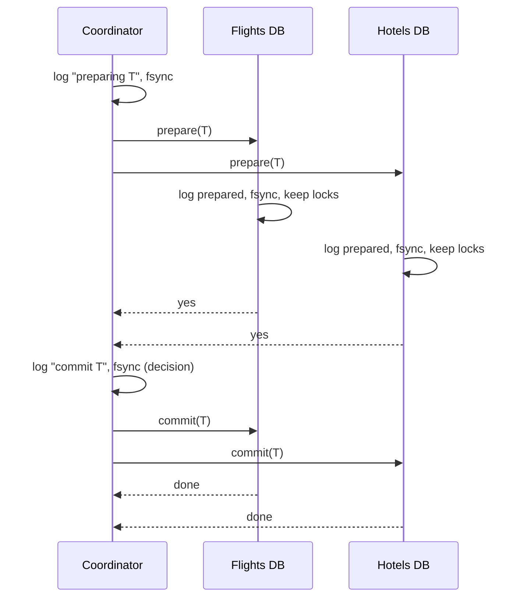
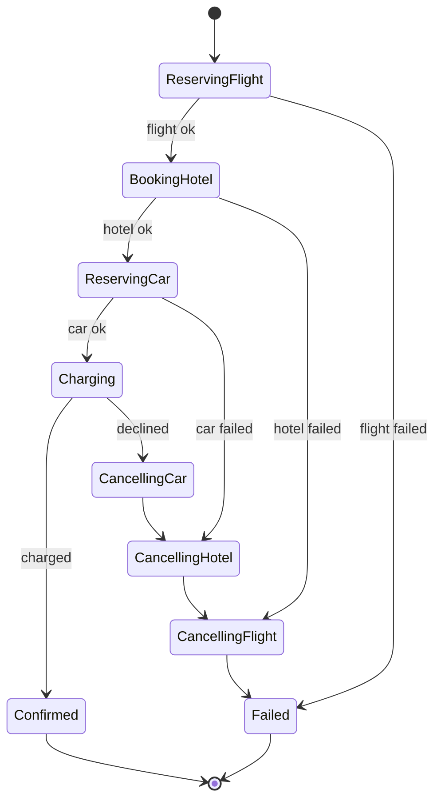

A trip booking needs a flight, a hotel and a car, held by three different services with three different databases. Either all three are booked or none is: nobody wants a hotel in a city they cannot fly to. In a single database this is `BEGIN; ...; COMMIT`, and the storage engine makes the three writes atomic. Across three databases there is no engine in charge, and the naive sequence (book the flight, book the hotel, book the car) leaves a booked flight and hotel when the car service is down.

Atomicity across systems is one of the genuinely hard problems, because the systems can fail independently and the network between them can fail at the worst moment. There are exactly three families of answer: a protocol that makes them all commit or all abort (two-phase commit), a sequence of local transactions with undo steps (sagas), and a restructuring that turns "write here and also there" into "write here, and let the other system follow" (the transactional outbox). Knowing which one fits, and precisely how each fails, is the senior bar.

## Two-phase commit

A **coordinator** drives the protocol; the databases are **participants**. The client asks the coordinator to commit a transaction whose writes have already been sent to each participant (still uncommitted, holding locks).

**Phase 1, prepare.** The coordinator writes "preparing T" to its log, then sends `prepare(T)` to every participant. Each participant does everything needed to guarantee it *can* commit: writes the transaction's data and a "prepared T" record to its write-ahead log and fsyncs, keeps its locks, then votes yes. A participant that cannot (constraint violation, disk full, crashed) votes no. A yes vote is a promise: the participant may no longer unilaterally abort.

**Phase 2, commit or abort.** If every vote is yes, the coordinator writes "commit T" to its log and fsyncs. That write *is* the decision. It then sends `commit(T)` to all participants, which commit locally, release locks and acknowledge. If any vote was no, or timed out, the coordinator logs "abort T" and sends `abort(T)`.

```viz
{"type": "system", "scenario": "two-phase-commit", "nodes": 3,
 "title": "Prepare, vote, decide, commit", "caption": "Each participant fsyncs a prepared record before voting yes and holds its locks. The coordinator's logged decision is the commit point. Step through to the moment after the votes and before the decision: that is where a coordinator crash leaves everyone stuck."}
```



### Cost

Two round trips plus at least three fsyncs on the critical path (each participant's prepare, the coordinator's decision), then a second write on each participant to commit. In one region: on the order of 5 to 10 ms per transaction versus 1 to 2 ms for a local commit. Across regions: two cross-region RTTs, 150 ms or more. Locks are held for the whole duration, so throughput on contended rows drops proportionally.

### The blocking problem

Between voting yes and receiving the decision, a participant is **in doubt**. It cannot commit (the coordinator might have aborted because another participant said no) and cannot abort (the coordinator might have committed). It must hold its locks and wait. If the coordinator crashes after collecting yes votes and before broadcasting the decision, every participant waits until the coordinator recovers and reads its log. That can be minutes, and every other transaction touching those rows queues behind the locks. The coordinator's log is a single point of failure, which is why a serious 2PC deployment replicates the coordinator (Spanner runs its coordinator inside a Paxos group, so the decision is itself consensus-replicated).

The escape hatch, **heuristic decisions**, lets an operator or a timeout force a participant to commit or abort while in doubt. It restores availability and may produce an inconsistent outcome (one participant committed, another aborted) that must be repaired by hand. Three-phase commit adds a pre-commit round to make participants non-blocking on coordinator failure, at the cost of a third round trip and no safety under network partition, which is why nobody runs it; Paxos Commit, replicating the coordinator's decision, is the version that works.

### Where 2PC is used well

Inside one system whose designers control every participant and the coordinator's availability. Spanner and CockroachDB use 2PC over Paxos/Raft groups for transactions spanning shards, with the coordinator state replicated. Postgres supports `PREPARE TRANSACTION` for participants, used by middleware. In the JVM world, XA transactions across a database and a message broker exist and are widely avoided: the coordinator is the application server, whose crash blocks the database, and the broker's XA support is often slow and partial. The pattern to avoid is 2PC across independently operated services over a WAN, where the in-doubt window meets the least reliable network.

## Sagas

A saga replaces one atomic transaction with a sequence of **local transactions** T1, T2, ..., Tn, each committed independently, and a **compensating transaction** Ci for each Ti that semantically undoes it. If Tk fails, the saga runs C(k-1), ..., C1 in reverse. Nothing holds locks across services; each step commits and moves on.

| Step | Local transaction | Compensation |
|---|---|---|
| T1 | Reserve flight seat | C1: cancel reservation (may incur fee, or is free within a window) |
| T2 | Book hotel room | C2: cancel booking |
| T3 | Reserve car | C3: cancel reservation |
| T4 | Charge card | C4: refund |
| T5 | Send confirmation email | (none: cannot unsend) |

```viz
{"type": "system", "scenario": "saga", "nodes": 4,
 "title": "Forward steps, then compensations on failure", "caption": "Each step commits locally. When the car reservation fails, the saga runs the compensations for the hotel and flight in reverse. The intermediate state (flight booked, no car) is visible to other transactions while it lasts."}
```

### Orchestration vs choreography

An **orchestrator** is a state machine, persisted in its own table, that issues each step as a command, records the result, and decides the next step or the compensation sequence. Recovery after an orchestrator crash is reading the table and resuming. Every step is idempotent and the orchestrator retries it until it gets a definite answer. **Choreography** has each service react to the previous service's event and emit its own, with compensations triggered by failure events; there is no central record of where a saga is. [Event-driven architecture](/learn/system-design/building-blocks/event-driven-architecture) compares them; for sagas with compensation, orchestration wins on observability and on getting the compensation order right.



### Designing compensations

**Semantic, not physical, undo.** A refund is not a deleted charge; a cancellation is not a deleted booking. The record of the original action stays, with the compensation recorded beside it, which is what accounting and auditing require.

**Order the steps by compensability.** Some steps cannot be compensated (sending an email, shipping a package) or compensate expensively (a charge that incurs a fee to refund). Put the compensatable steps first, the **pivot** step (the one after which the saga will not roll back) as late as possible, and the non-compensatable steps after the pivot. In the table, the email is last; charging the card is the pivot after all reservations succeed.

**Retryable steps after the pivot.** Once past the pivot, the saga does not abort; every later step is retried until it succeeds (send the email, retry for a day, then alert). Steps after the pivot must therefore be things that *can* eventually succeed.

**Every step and compensation is idempotent**, keyed by the saga ID and step number, because the orchestrator will retry on any ambiguous outcome. A compensation must also handle "the forward step never actually happened" (the flight service timed out but had not reserved): cancelling a non-existent reservation returns success.

### What sagas give up: isolation

A saga's intermediate states are visible. While the trip saga is between T2 and T3, another transaction can see the booked hotel; if the saga later compensates, that other transaction acted on a booking that no longer exists. The anomalies are the ones from [Isolation levels and anomalies](/learn/databases/relational-fundamentals/isolation-levels-and-anomalies), across services: dirty reads of uncommitted saga state, lost updates when two sagas update the same record, and non-repeatable reads.

Countermeasures, from Garcia-Molina and Salem's original paper and its descendants:

| Countermeasure | Mechanism |
|---|---|
| Semantic lock | The forward step marks the record `PENDING`; other transactions treat pending records as unavailable or wait; the pivot clears the flag |
| Commutative updates | Design steps as operations that commute (increment/decrement) so interleaving does not lose updates |
| Pessimistic view | Reorder steps so the ones whose dirty state would hurt most run after the pivot |
| Reread value | Before committing a step, reread and verify the state the saga relied on; abort if changed |
| Version file / counter | Record the order of operations on a record so compensations can be applied in the right order |

The `PENDING` flag is the workhorse: a hotel room reserved by an in-flight saga shows as unavailable to searches and as `pending` to the user, and becomes `confirmed` only at the pivot.

## Transactional outbox

The most common "distributed transaction" in practice is not three databases; it is one database plus a message broker: save the order *and* publish `OrderPlaced`. The outbox makes that atomic without 2PC by keeping both writes in the one database: the order row and an outbox row commit together; a relay publishes from the outbox afterwards, at least once; consumers dedupe on the outbox row's ID.

```viz
{"type": "system", "scenario": "outbox", "requests": 4,
 "title": "One local transaction, then asynchronous publish", "caption": "The event is committed in the same transaction as the data, so it can never be lost or orphaned. The relay's publish may repeat after a crash, which is why the event carries a unique ID for consumers to dedupe on."}
```

The outbox turns a cross-system atomicity problem into local atomicity plus at-least-once delivery plus idempotent consumers, which is a problem you already know how to solve ([Idempotency and retries](/learn/system-design/building-blocks/idempotency-and-retries)). It is also how sagas are built in practice: each step's local transaction writes its business change and its "step done" event to the outbox, and the orchestrator consumes those events.

## Choosing

| | 2PC | Saga | Outbox | Single database |
|---|---|---|---|---|
| Atomicity | Yes (all or nothing) | Eventually: all steps or all compensated | Yes for data plus event | Yes |
| Isolation | Yes, locks held throughout | No; intermediate states visible | N/A | Yes |
| Latency | 2 RTTs + fsyncs; locks held | Sum of steps, but each commits fast | Local commit | Local commit |
| Coordinator failure | Blocks participants | Orchestrator resumes from its table | Relay resumes from outbox | N/A |
| Across independent services | Avoid | Yes | Yes | No |
| Non-compensatable steps | Fine (they wait for commit) | Must be after the pivot | Fine | Fine |
| Best for | Cross-shard writes inside one system with a replicated coordinator | Multi-service workflows | DB write plus event | Everything you can fit |

The interview version: prefer designs where each operation has a **single writer** so no distributed transaction is needed at all (put the flight, hotel and car for one trip in one service if the domain allows; put the order and its lines in one row store); use the **outbox** for the write-plus-publish case; use a **saga** for a multi-service workflow, with `PENDING` states and the pivot placed deliberately; use **2PC** only inside a system that provides it with a highly available coordinator, such as a distributed SQL engine's cross-shard transactions. [Payment system](/learn/system-design/case-studies/payment-system) and [ticket booking](/learn/system-design/case-studies/ticket-booking) apply these choices.

## Failure modes

**Coordinator crash with participants in doubt.** Locks held on rows in every participant for the coordinator's recovery time; unrelated transactions on those rows queue; timeouts cascade. Detect: lock wait time and prepared-transaction age on participants. Mitigate: replicated coordinator; short prepare timeouts with a well-defined heuristic policy; do not use 2PC across services.

**Compensation fails.** The refund service is down when the saga needs to compensate the charge. Detect: saga stuck in a compensating state beyond a threshold. Mitigate: compensations are retried indefinitely with backoff (they must be designed to eventually succeed), the saga alerts after N minutes, and a manual-intervention queue exists for the ones that cannot.

**Non-idempotent step double-applied.** The orchestrator times out on "reserve car", retries, and two cars are reserved. Detect: duplicate reservations with the same saga ID. Mitigate: every step keyed by (saga ID, step); the car service dedupes.

**User sees intermediate state.** The trip page shows a booked hotel and no flight during compensation; the user calls support. Detect: user-facing reads of `PENDING` records without the flag. Mitigate: semantic locks; UI shows "booking in progress" until the pivot.

**Outbox relay lag or stall.** Events are committed but not published for minutes; downstream is silent. Detect: oldest unpublished outbox row age. Mitigate: CDC-based relay; alert on age; multiple relay workers partitioned by aggregate.

**Outbox table growth.** Published rows never deleted; the polling query slows; relay latency climbs. Detect: table size and relay poll time. Mitigate: delete after publish, or partition by day and drop; with CDC, delete immediately.

**Saga step succeeded but reported failure.** The hotel service booked the room, then its response was lost; the orchestrator runs compensation for a booking it thinks did not happen; the cancel must handle a booking that exists. Detect: orphaned bookings in reconciliation. Mitigate: compensations are written to succeed whether or not the forward step happened; reconciliation jobs compare saga logs with service state.

## Interviewer follow-ups

**Q: "The order service must write the order and publish an event. Two-phase commit between Postgres and Kafka?"**

No. XA between a database and a broker puts the application in the coordinator's seat; when it crashes mid-commit, the database holds locks on the order rows until someone recovers the transaction, and Kafka's XA support is not something I would rely on in production. The transactional outbox does what I need: the order and the event row commit together in Postgres, a relay reading the WAL through Debezium publishes to Kafka at least once, and consumers dedupe on the event ID. The write path is one local commit, about a millisecond, and nothing blocks on the broker.

**Q: "Design the booking flow across flights, hotels and cars."**

An orchestrated saga with its own persisted state machine. Order the steps by how cheaply they compensate: reserve the flight and hotel and car first, since cancellations within a short window are free, then charge the card as the pivot, then send the confirmation, which cannot be undone and therefore comes after the point of no return. Every step is idempotent on (saga ID, step) because the orchestrator retries on timeouts. Reservations are written as `PENDING` so searches do not show a seat that a compensating saga is about to release, and the user sees "booking in progress" rather than a half-booked trip. Compensations retry indefinitely with an alert after ten minutes and a manual queue for the ones that cannot succeed. And I say out loud that this gives atomicity eventually and isolation only via the pending flag, which is the trade the domain can accept.

**Q: "What happens if the coordinator dies right after collecting yes votes?"**

Every participant is in doubt: it has fsynced its prepared record and holds its locks, and it can neither commit nor abort because it does not know the decision. It waits for the coordinator to come back and read its log; if the coordinator had not yet logged the decision, the transaction is aborted on recovery. During the wait, every transaction touching those rows queues behind the locks, which is how a coordinator outage becomes a database-wide stall. That is why I only use 2PC where the coordinator's decision is itself replicated, as Spanner and CockroachDB do, and never with an application server as coordinator.

**Q: "A saga step returns a timeout. What does the orchestrator do?"**

Retry the same step with the same idempotency key until it gets a definite answer. A timeout means unknown, not failed; if I ran the compensation immediately I might cancel a booking that succeeded, and if I proceeded I might build on one that did not. The step is designed so that the retry is safe: the hotel service dedupes on (saga ID, step) and returns the original result. Only a definite failure triggers compensation, and if the step never answers definitively within the saga's deadline, it goes to the alerting path rather than guessing.

**Q: "How is a saga different from just calling the services in order and catching exceptions?"**

Persistence and idempotency. The naive version loses its state when the process dies between steps, leaving a flight booked with no record that a hotel was needed, and its catch block runs compensations once with no retry. A saga persists the state machine before each step, so a restart resumes from the right place; it retries steps and compensations with idempotency keys; and it puts the pivot deliberately so non-compensatable actions come last. The exception-handling version is a saga with the durability removed, which is exactly the part that matters.

## Senior signals

- You describe 2PC by its **commit point** (the coordinator's logged decision) and its **in-doubt window**, and you know what the participants hold while they wait.
- You confine 2PC to systems with a **replicated coordinator** and refuse it across independently operated services.
- You design sagas with a **pivot**, compensatable steps before it, retry-until-success steps after it, and every step idempotent on (saga ID, step).
- You name what sagas lose (**isolation**) and apply semantic locks so users and other transactions do not act on intermediate state.
- You reach for the **outbox** for write-plus-publish and can describe the CDC relay and consumer dedupe.
- You look first for a **single-writer** design that needs no distributed transaction at all.

## Check yourself

```quiz
- q: >-
    In two-phase commit, at what moment is the transaction irrevocably committed?
  options: ["When every participant has voted yes to the coordinator", "When the coordinator durably logs its commit decision", "When the client receives the commit acknowledgement", "When the first participant has committed locally"]
  answer: 1
  explanation: >-
    Yes votes are promises, not a decision; the coordinator may still abort. The logged decision is the commit point: after it, recovery will always drive participants to commit. Participants commit and the client learns of it afterwards.
- q: >-
    The coordinator crashes after collecting all yes votes but before sending the decision. Participants:
  options: ["Commit after a timeout, since all votes were yes", "Hold their locks until the coordinator recovers", "Elect a new coordinator among themselves and carry on", "Abort after a timeout, since no decision arrived"]
  answer: 1
  explanation: >-
    A participant in doubt cannot know whether the coordinator logged commit or abort, so unilateral action risks inconsistency; it waits for the coordinator to recover and read its log. Blocking is the fundamental weakness of 2PC; replicating the coordinator's decision is the fix.
- q: >-
    In a booking saga, where should the "send confirmation email" step go?
  options: ["After the card charge, since an email cannot be undone", "Before the card charge, so failures surface sooner", "In parallel with the other steps, to cut latency", "First, so the user is informed as early as possible"]
  answer: 0
  explanation: >-
    Non-compensatable steps must come after the pivot (here the card charge), the point where the saga will no longer roll back. Placing them earlier means a later failure leaves an effect that cannot be undone.
- q: >-
    A saga's forward step times out with no response. The orchestrator should:
  options: ["Run the compensation at once, treating it as a failure", "Mark the saga failed and stop without compensating", "Proceed to the next step, treating it as a success", "Retry it with the same idempotency key until definite"]
  answer: 3
  explanation: >-
    A timeout is an unknown outcome. Compensating may cancel something that succeeded; proceeding may build on something that did not. Idempotent retry resolves the ambiguity; only a definite failure triggers compensation.
- q: >-
    Which problem does the transactional outbox solve?
  options: ["Atomically writing a row and publishing an event", "Atomic writes across three independent databases", "Isolation between sagas that touch the same rows", "Total ordering of messages across all Kafka partitions"]
  answer: 0
  explanation: >-
    The outbox commits the event in the same local transaction as the row and publishes it afterwards at least once, so no 2PC is needed: the cross-system problem becomes a local commit plus at-least-once delivery with consumer-side dedupe. It does not span multiple databases; that is a saga or 2PC.
```
