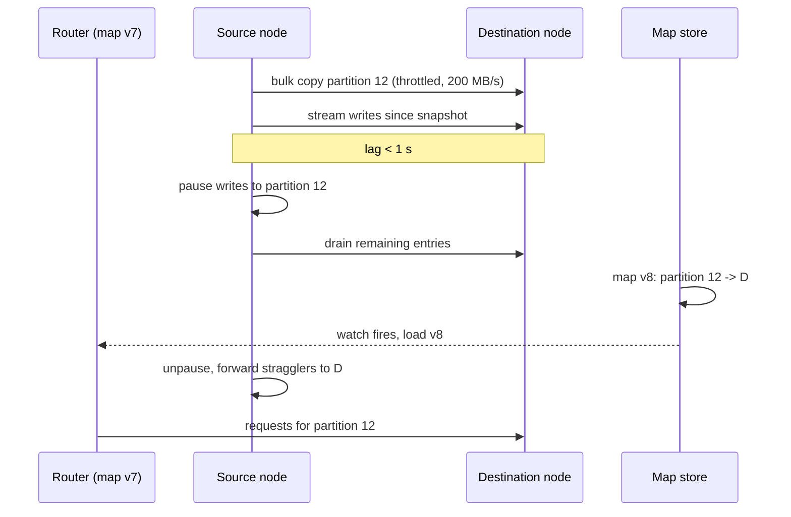

A key-value store holds 10 TB across 20 nodes, each key placed by `hash(key) mod 20`. Traffic grows and you add a twenty-first node. Now `hash(key) mod 21` sends almost every key somewhere else: with N nodes going to N + 1, roughly N/(N+1) of keys move, here 20 of every 21, 95% of the data. The cluster spends the next several hours copying 9.5 TB across the network while serving reads that mostly miss, and the caches in front of it, which used the same scheme, are cold everywhere at once. Adding one machine to a fleet of twenty has caused a full outage.

Partitioning is how a dataset or a workload outgrows one machine. The scheme you use to decide where a key lives decides three things: how evenly load spreads, how efficiently you can query, and what happens when the set of machines changes. The last one is where designs fail, because it happens during the exact moment, growth or failure, when you can least afford it.

## Two families

**Hash partitioning** applies a hash to the partition key and maps the result to a node. Keys are spread uniformly regardless of their values; related keys are scattered, so range queries (all orders from last week) touch every partition.

**Range partitioning** assigns each partition a contiguous range of the sorted key space. Range queries hit one or a few partitions; sequential keys (timestamps, auto-increment IDs) land in one partition and create hot spots.

| | Hash | Range |
|---|---|---|
| Point lookup | One partition | One partition (needs the range map) |
| Range scan | All partitions (scatter-gather) | The partitions covering the range |
| Load with sequential keys | Even | Concentrated on the newest partition |
| Adding nodes | Depends on the hash scheme (mod N is terrible, consistent hashing is fine) | Split a range; move one partition |
| Used by | Cassandra, DynamoDB, Redis Cluster (with slots), most caches | Bigtable/HBase, CockroachDB, Spanner, TiKV, MongoDB range sharding |

## Consistent hashing

Consistent hashing places both nodes and keys on a ring (the hash space, say 0 to 2^64 - 1, treated as circular). A key belongs to the first node clockwise from its position. Adding a node claims the arc between it and its predecessor: only the keys on that arc move, about 1/N of the total. Removing a node hands its arc to its successor; again 1/N moves.

```viz
{"type": "system", "scenario": "consistent-hashing", "nodes": 4, "keys": 12,
 "title": "Adding a node to the ring", "caption": "Keys map to the next node clockwise. When a fifth node joins, only the keys between it and its predecessor change owner; everything else stays put. Compare with mod N, where nearly every key would move."}
```

Lookup is a binary search over the sorted node positions: O(log V) for V positions, microseconds. Replication follows the ring too: a key's N replicas are the next N distinct nodes clockwise, so replica placement is also stable under membership change.

### Virtual nodes

With one position per node, the arcs are uneven: random placement of 20 points on a circle produces arcs varying by several times, so one node holds 3x the data of another. And when a node leaves, its entire arc goes to one successor, doubling that node's load.

Virtual nodes fix both. Each physical node takes many positions on the ring (100 to 200 is common; Cassandra's default was 256 and later 16 with a smarter allocator). Each physical node's total share is the sum of many small arcs, which averages out: with 150 virtual nodes per physical node, the imbalance drops to a few per cent. When a node leaves, its 150 arcs go to 150 different successors, spreading the load across the whole cluster rather than doubling one neighbour. Heterogeneous hardware gets proportional virtual nodes: a machine with twice the capacity takes twice the positions.

The cost is the routing table: V positions instead of N, and O(V) memory and O(log V) lookup, trivial at thousands of positions.

### Rendezvous hashing

An alternative with the same 1/N movement property: for a key, compute a score `hash(key, node)` for every node and pick the highest. No ring, no virtual nodes, perfectly even in expectation, O(N) per lookup, which is fine for tens of nodes and not for thousands. Used in some load balancers and caches; consistent hashing wins when N is large or lookup is on the hot path.

[Consistent hashing and routing](/learn/networking/network-algorithms/consistent-hashing-and-routing) covers the algorithm's implementation details; here the point is the movement bound and what it means for operations.

## Hash mod N and fixed partition counts

Hash mod N is fine if N never changes, which is never. The practical variant is a **fixed number of partitions** far larger than the number of nodes: Kafka topics with, say, 60 partitions across 6 brokers; Elasticsearch indices with a fixed shard count; Redis Cluster with 16,384 hash slots. A key maps to a partition by hash mod P, and partitions are assigned to nodes by a table. Adding a node moves whole partitions from existing nodes to the new one; keys never change partition, so key-to-partition mapping is stable forever and only the partition-to-node table changes.

```viz
{"type": "system", "scenario": "sharding-hash", "nodes": 3, "keys": 12,
 "title": "Fixed partitions assigned to nodes", "caption": "Keys hash to one of a fixed set of partitions; partitions are assigned to nodes by a table. Growing the cluster reassigns partitions, never keys, so the movement is a whole-partition copy with no rehashing."}
```

The catch is choosing P. Too few and you cannot grow beyond P nodes or balance finely; too many and each partition's overhead (files, metadata, replication streams, rebalance time) adds up. Kafka's guidance is to pick a partition count for the throughput you will need in a couple of years, because changing it later changes key-to-partition mapping and breaks per-key ordering. Redis Cluster's 16,384 slots is the fixed-partition idea with P large enough that nobody hits it.

## Range partitioning and splits

Range-partitioned systems keep a sorted map of ranges to nodes: `[a, f) → node 3, [f, m) → node 1, ...`. A partition that grows past a threshold (HBase regions historically around 10 GB; CockroachDB ranges default to 512 MB; TiKV regions around 96 MB) **splits** at its median key into two, one of which is then moved to a less loaded node. A partition that shrinks can be merged with a neighbour. The number of partitions therefore tracks the data size automatically, which is what dynamic partitioning means.

```viz
{"type": "system", "scenario": "sharding-range", "nodes": 3, "keys": 12,
 "title": "Ranges of sorted keys on nodes", "caption": "Each node owns contiguous key ranges. A range scan touches only the nodes covering it. Watch what happens with keys that arrive in sorted order: they all land in the last range, on one node."}
```

The hot-spot problem is structural. Time-series data keyed by timestamp writes every new row to the last range; a sensor fleet at 100,000 writes per second puts all of them on one node while the other 29 idle. The fixes all break the sort locally so writes spread:

- **Salting**: prefix the key with `hash(key) mod S` for a small S (say 16): `07:2026-09-26T10:00:00Z`. Writes spread over 16 ranges; a range scan over a time window becomes 16 scans merged, which is acceptable for S in the tens.
- **Bucketing by a natural dimension**: key by `(sensor_id, timestamp)` so each sensor's data is sequential but the fleet spreads; scans per sensor stay cheap.
- **Reverse or hash a leading component** when nobody scans by it.

## Request routing

Once data is partitioned, a request must find the right node. Three arrangements:

| Arrangement | Mechanism | Cost |
|---|---|---|
| Client-side | Client holds the partition map and connects directly | Every client needs the map and updates; fastest (one hop) |
| Routing tier | A proxy holds the map; clients hit the proxy | Extra hop (~0.5 ms); clients stay simple; the proxy scales separately |
| Any node | Client hits any node; it forwards to the owner | Extra hop within the cluster; nodes need the map; simplest clients |

The map itself has to be kept consistent. Two approaches: a coordination service (ZooKeeper, etcd) holds the authoritative map and nodes and routers watch it (HBase, Kafka pre-KRaft, many in-house systems); or nodes gossip the map among themselves and clients learn it from any node (Cassandra, Redis Cluster, with `MOVED` redirects when a client's map is stale). [Gossip and anti-entropy](/learn/system-design/distributed-systems/gossip-and-anti-entropy) covers the second. Either way a stale map must fail safe: the node that receives a request for a partition it no longer owns redirects rather than serving stale data.

## Rebalancing without downtime

Rebalancing is moving partitions while continuing to serve. The principles:

**Move partitions, not keys.** With fixed partitions or ranges, a rebalance is a set of whole-partition copies, each a sequential read on the source and a sequential write on the destination, with a well-defined cutover per partition.

**Throttle.** 1 TB at 200 MB/s is about 1.4 hours; at an unthrottled 2 GB/s it is 8 minutes and every disk and NIC in the cluster is saturated, so production traffic sees the p99 spike. Rebalance bandwidth is a tunable with a default that assumes you are serving traffic at the same time (Kafka's replication throttle, Cassandra's stream throughput, Elasticsearch's recovery bandwidth).

**Dual-serve during the move.** For each partition: snapshot and copy the bulk; stream the writes that arrived during the copy (from the source's log); when the destination is within a few seconds of the source, briefly block writes to that partition, drain the last entries, flip the routing table entry (versioned, so routers can detect staleness), unblock. The write pause per partition is milliseconds to a second; clients see a latency blip on that partition only.

**One partition, or a bounded few, at a time.** Moving everything at once maximises the blast radius; moving one partition at a time takes longer but each step is small and reversible.

**Prefer to grow by 2x when using hash mod P with splittable partitions.** If partitions can be split in half (each half keeps the keys whose next hash bit is 0 or 1), doubling the node count means every partition splits once and half of each stays in place: exactly 50% moves and nothing is rehashed. Non-power-of-two growth with a naive scheme moves more.



### A worked plan

Dataset 10 TB, 500 GB usable per node after replication headroom, replication factor 3: 30 TB of replicas, so 60 nodes minimum, run 72 for headroom. Fixed partitions: choose 1,024 (each about 30 GB of primary data, ~14 partitions per node, fine-grained enough to balance within a few per cent). Growth from 72 to 96 nodes: the new nodes should end up with 1,024 x 3 / 96 = 32 replicas each, 768 replica-partitions to move, 768 x 30 GB = 23 TB. At 200 MB/s per source node with 72 sources in parallel the aggregate is ~14 GB/s if the network allows, so the copy phase is under an hour; at a conservative cluster-wide 2 GB/s it is about 3.2 hours. Schedule it off-peak, move 24 partitions at a time, and watch p99 on the serving path with a kill switch that pauses the move.

## Hot spots

Even hashing spreads keys, not load. One key that receives 30% of traffic (a celebrity's profile, a global counter, a viral post) lives on one partition no matter how you hash. The fixes:

- **Key splitting**: for write-heavy hot keys, append a random suffix (`post:123:0` to `post:123:15`), spreading writes over 16 partitions; reads fan in across the 16 and aggregate. Use only for the keys that are hot, tracked by a small "hot key" table, because it makes every read 16x more expensive.
- **Caching in front**: a hot key is by definition cacheable; a small in-process cache on the routers absorbs the read load before it reaches the partition. Netflix's EVCache and most CDNs do this for the read side.
- **Per-key rate limiting or admission control**: protect the partition from a single key's traffic so its neighbours survive.
- **Dedicated placement**: move the hot partition to its own node, or pin a hot key's partition to the biggest machine.

Detection is per-partition throughput and latency, alerting on skew (max partition load / mean load > 3, for example), and the design should say who watches that number.

## Secondary indexes

Partitioning by primary key leaves the question of queries by other attributes. A **local secondary index** lives on each partition and indexes only that partition's rows: writes are local and cheap; a query by the indexed attribute must scatter to every partition and gather (P round trips in parallel; tail latency amplification; 100 partitions means the query waits for the slowest of 100). A **global secondary index** is itself partitioned by the indexed attribute: a query hits one index partition; a write must update the index on another node, asynchronously (DynamoDB's GSIs are eventually consistent for this reason) or with a distributed transaction. [Database scaling](/learn/system-design/building-blocks/database-scaling) works through the numbers for both.

## Failure modes

**Mod-N resize storm.** The opening story: 95% of keys move, caches go cold, the database behind them is hit with the full miss rate. Detect: a design that uses `mod node_count`. Mitigate: consistent hashing or fixed partitions from the start; this is not fixable incrementally.

**Cascading rebalance.** A node dies; its partitions are copied to survivors; the copy load pushes a survivor over its limit; it is declared dead; its partitions are copied... Detect: node failures during a rebalance. Mitigate: delay automatic rebalancing after a failure (the node may come back), throttle copy bandwidth, and cap concurrent moves. Elasticsearch's `delayed_timeout` and Cassandra's manual replacement exist for this.

**Monotonic key hot spot.** All writes on one range. Detect: per-partition write rate skew. Mitigate: salting or bucketing at design time; splitting the hot range does not help when writes always go to the newest one.

**Uneven virtual node distribution.** Too few virtual nodes per physical node; one node has 2x the load. Detect: data per node variance. Mitigate: more virtual nodes; token allocation algorithms that place new nodes into the largest arcs.

**Stale routing after a move.** A router with the old map sends writes to the old owner, which accepts them; data diverges. Detect: writes acknowledged by a non-owner; version mismatch in the map. Mitigate: versioned maps; non-owners reject or redirect; ownership changes fenced by the map version.

**Rebalancing during peak.** The copy saturates disks; p99 doubles for hours. Detect: p99 correlated with rebalance start. Mitigate: schedule, throttle, and a kill switch that pauses the move when serving latency exceeds a threshold.

**Split brain in the map.** Two coordinators, or a partitioned gossip cluster, publish different maps; two nodes both believe they own a partition. Detect: conflicting ownership claims. Mitigate: a consensus-backed map (etcd/ZooKeeper) or epoch-fenced ownership.

## Interviewer follow-ups

**Q: "You add a node to a 20-node hash-partitioned cluster. How much data moves?"**

With `hash mod N`, about 20/21 of all keys, 95%, which is a self-inflicted outage. With consistent hashing, the new node takes roughly 1/21 of the ring, so about 5% of the data moves, and with virtual nodes that 5% comes from many nodes rather than one neighbour. With a fixed partition count and a partition-to-node table, the new node is assigned its fair share of partitions, again about 5%, moved as whole-partition copies with no rehashing. I would design with one of the latter two from day one because the first cannot be fixed in place.

**Q: "Time-series writes keyed by timestamp are all landing on one node. Fix it."**

The sort order is the problem: every new key is larger than every existing one, so it belongs to the last range. I salt the key with a small hash prefix, 16 buckets, so writes spread across 16 ranges; a query for a time window becomes 16 parallel range scans merged on the client, which is acceptable because reads on this data are windowed anyway. If the data has a natural dimension like sensor ID, I key by `(sensor_id, timestamp)` instead, which spreads writes across sensors and keeps per-sensor scans sequential. Splitting the hot range does not help; the new writes just go to the new last range.

**Q: "Walk me through growing from 72 to 96 nodes on a live cluster."**

Fixed partitions, 1,024 of them, so the new nodes need about 32 replicas each and 768 partition replicas move, roughly 23 TB. I throttle cluster-wide copy bandwidth to what leaves serving p99 untouched, say 2 GB/s aggregate, which makes the copy about three hours, and I run 24 moves at a time. Each move is bulk copy, then streamed catch-up from the source's log, then a sub-second write pause on that partition to drain and flip the routing entry, versioned so stale routers get a redirect. I watch per-partition latency with a kill switch that pauses the plan, and I do it off-peak. Growth to a power of two would let me split partitions in half and move exactly 50% with no rehash, which is why I chose 1,024 partitions in the first place.

**Q: "A single key gets 30% of the reads. What breaks and what do you do?"**

The partition owning it, and its node, saturate while the rest of the cluster idles; hashing cannot help because it is one key. Reads for a hot key are the easiest case: a small in-process cache on the routers with a short TTL absorbs almost all of them before they reach the partition. For hot writes I split the key into suffixed copies across partitions and aggregate on read, only for keys detected as hot, because it multiplies read cost. Either way I add per-partition load skew to the dashboard so the next hot key is found before users find it.

**Q: "Local or global secondary index for querying orders by customer?"**

Global, partitioned by customer ID, so a customer's orders query hits one index partition instead of scattering to all 1,024 and waiting for the slowest. The cost is that an order write updates an index entry on another node; I accept asynchronous index maintenance with a small staleness window, the way DynamoDB's GSIs work, and I make the read path tolerate it. If queries by customer were rare and writes dominant, a local index with scatter-gather would be cheaper on the write path and I would say so; the choice follows the read/write ratio.

## Senior signals

- You quantify **movement on membership change**: N/(N+1) for mod N, 1/N for consistent hashing and fixed partitions.
- You explain **virtual nodes** as variance reduction and failure-load spreading, with a number for how many.
- You spot **monotonic keys** in a range-partitioned design and salt or bucket them before anyone asks.
- You plan a rebalance with **bandwidth arithmetic, throttling, per-partition cutover and a kill switch**, not "the system rebalances automatically".
- You know why **partition count is chosen once** and choose it with growth and per-partition overhead in mind.
- You treat **hot keys** as a separate problem from partitioning and have distinct fixes for hot reads and hot writes.

## Check yourself

```quiz
- q: >-
    A cluster places keys with hash(key) mod N. Growing N from 20 to 21 causes approximately what fraction of keys to change node?
  options: ["About 0%", "About 5%", "About 95%", "About 50%"]
  answer: 2
  explanation: >-
    A key stays only if hash mod 20 equals hash mod 21, which happens for roughly 1 in 21 keys, so about 95% move; it is not only new keys that land on the new node. Consistent hashing or fixed partitions reduce movement to about 1/21.
- q: >-
    Why do consistent-hashing systems give each physical node many virtual positions on the ring?
  options: ["To shrink the routing table each client has to hold", "To even out arc sizes and spread a failed node's load", "To enlarge the hash space so collisions become rarer", "To keep adjacent keys together so range scans are cheap"]
  answer: 1
  explanation: >-
    Random single positions produce arcs of very different sizes and a failure doubles one neighbour's load. Many small arcs average out so data spreads within a few per cent, and a failed node's load goes to many successors rather than one. The routing table grows, not shrinks, and range scans are unaffected.
- q: >-
    Sensor readings keyed by timestamp in a range-partitioned store are overloading one node. Which fix works?
  options: ["Lead the key with a small hash bucket or the sensor_id", "Add more nodes so the ranges are spread more thinly", "Switch to synchronous replication to share the writes", "Split the hot range in half and move one half away"]
  answer: 0
  explanation: >-
    New timestamps are always larger than existing keys, so they go to the last range regardless of splits or node count. Breaking the sort order with a salt or a natural leading dimension spreads new writes across ranges and is the only fix.
- q: >-
    During a rebalance, a router with a stale map sends a write to the old owner of a partition. The safe behaviour is:
  options: ["The old owner rejects or redirects it, based on the map version", "The old owner accepts it and forwards it to the new owner later", "The router retries the write on a randomly chosen node", "The old owner accepts it, since it still holds the data"]
  answer: 0
  explanation: >-
    Accepting writes at a non-owner creates divergence, even with a later forward. Versioned ownership fences the old owner so it recognises it is stale and redirects; the router then refreshes its map.
- q: >-
    Moving 23 TB during a rebalance while serving traffic, the most important control is:
  options: ["Pausing replication during the move to free up disk I/O", "Using the fastest possible copy so it finishes quickly", "Copying all partitions at once to shorten the window", "Throttling the copy so serving p99 stays within SLO"]
  answer: 3
  explanation: >-
    An unthrottled copy saturates disks and NICs and the serving path pays. A slower move with throttled bandwidth, bounded concurrent moves and a kill switch keeps the system within SLO; a few hours of background copy is the intended cost.
```
