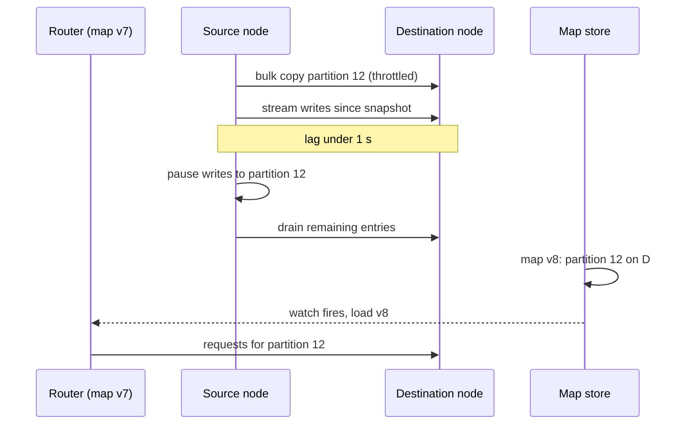

A key-value store holds 10 TB across 20 nodes, each key placed by `hash(key) mod 20`. Traffic grows and you add a twenty-first node. Now `hash(key) mod 21` sends almost every key somewhere else: a key stays put only when both remainders agree, about 1 time in 21, so 95% of the data moves. The cluster spends hours copying 9.5 TB while serving reads that mostly miss, and the caches in front of it, which used the same scheme, go cold everywhere at once. Adding one machine to twenty has caused an outage.

Partitioning is how a dataset or workload outgrows one machine. The rule that decides where a key lives decides three things: how evenly load spreads, which queries stay cheap, and what happens when the set of machines changes. The last is where designs fail, because it happens during growth or failure, exactly when you can least afford it. This lesson measures each scheme's behaviour on concrete data.

## Two families

**Hash partitioning** maps a hash of the partition key to a node: keys spread uniformly whatever their values, and related keys scatter, so a range query touches every partition. **Range partitioning** gives each partition a contiguous slice of the sorted key space: range queries hit one or a few partitions, and sequential keys (timestamps, auto-increment ids) pile onto one.

| | Hash | Range |
|---|---|---|
| Point lookup | One partition | One partition, via the range map |
| Range scan | Every partition (scatter-gather) | Only the partitions covering the range |
| Sequential keys | Even load | All writes on the newest partition |
| Adding nodes | Depends on the scheme: mod N is terrible, consistent hashing or fixed partitions are fine | Split a range and move one half |
| Used by | Cassandra, DynamoDB, Redis Cluster (slots), most caches | Bigtable/HBase, Spanner, CockroachDB, TiKV, MongoDB ranged sharding |

## Choosing the partition key

The scheme matters less than the key you feed it. A good partition key has three properties: high cardinality (millions of distinct values, so no partition is forced to hold one enormous value), even access (no value receives a large share of traffic), and locality for the queries that matter (the rows one request needs share a key, so the request touches one partition). Worked examples:

- **Chat messages**: partition by `conversation_id`. Loading a conversation is one partition read. Partitioning by `message_id` spreads writes perfectly and turns every conversation load into a scatter-gather.
- **Multi-tenant SaaS**: partitioning by `tenant_id` keeps each tenant's queries local until one tenant is 40% of the traffic. A compound key `(tenant_id, user_id)` hashed on both keeps small tenants on one partition and spreads large ones, at the cost of a per-tenant scatter for tenant-wide reports.
- **Orders**: partition by `customer_id` if the dominant query is "my orders", by `order_id` if it is lookup by id, and add a global secondary index for the other access path.

Write down the top three queries and their rates before choosing; the key that serves the highest-rate query from one partition usually wins, and the rest get indexes or a second copy of the data.

## Consistent hashing

Nodes and keys are placed on a ring (the hash space treated as circular). A key belongs to the first node clockwise from its position. A new node claims only the arc between itself and its predecessor, so only those keys move; a departing node hands its arc to its successor. Lookup is a binary search over the sorted node positions, O(log V) for V positions. A key's replicas are the next distinct nodes clockwise, so replica placement is stable too.

```viz
{"type": "system", "scenario": "consistent-hashing", "nodes": 4, "keys": 12,
 "title": "Adding a node to the ring", "caption": "Keys map to the next node clockwise. When a fifth node joins, only the keys between it and its predecessor change owner; everything else stays put. Compare with mod N, where nearly every key would move."}
```

### Virtual nodes, measured

With one random position per node, arcs are uneven and a departing node's whole arc lands on one successor. Giving each node V positions (virtual nodes, or tokens) averages many small arcs. A simulation of 20 nodes with random tokens, 300 trials per row:

| Tokens per node | Largest node's share ÷ mean share (average, p95) | One node leaves: most-affected survivor's load grows by |
|---|---|---|
| 1 | 3.6×, 5.4× | 654% |
| 4 | 2.2×, 2.9× | 84% |
| 16 | 1.5×, 1.8× | 31% |
| 64 | 1.24×, 1.37× | 16% |
| 256 | 1.12×, 1.17× | 10% |

Imbalance falls roughly with the square root of the token count, and a failure's load spreads over many successors instead of doubling one. Cassandra defaulted to 256 random tokens per node until 4.0, which changed the default to 16 combined with a token allocator (`allocate_tokens_for_local_replication_factor`) that places new tokens into the largest arcs instead of at random, getting balance close to the 256-token row with far fewer ranges to repair and stream. Heterogeneous hardware takes tokens in proportion to capacity. The cost is a routing table of V × N positions, trivial at thousands.

**Rendezvous hashing** gets the same minimal movement without a ring: score every node with `hash(key, node)` and pick the highest. It is perfectly even in expectation and O(N) per lookup, fine for tens of nodes and not for thousands. [Consistent hashing and routing](/learn/networking/network-algorithms/consistent-hashing-and-routing) covers both algorithms' implementation.

## Fixed partition counts

The practical alternative is a fixed number of partitions P, far more than nodes: `hash(key) mod P` picks the partition, and a table assigns partitions to nodes. Kafka topics, Elasticsearch indices and Redis Cluster (16,384 hash slots) work this way. Growth moves whole partitions and rewrites table entries; no key ever changes partition.

```viz
{"type": "system", "scenario": "sharding-hash", "nodes": 3, "keys": 12,
 "title": "Fixed partitions assigned to nodes", "caption": "Keys hash to one of a fixed set of partitions; partitions are assigned to nodes by a table. Growing the cluster reassigns partitions, never keys, so the movement is a whole-partition copy with no rehashing."}
```

The catch is choosing P once. Too few and you cannot grow past P nodes or balance finely; too many and per-partition overhead (files, metadata, replication streams) adds up. Changing P later changes every key's partition, which in Kafka breaks per-key ordering, so pick it for the throughput you expect in a couple of years. Worked: 1 GB/s of expected ingest, consumers that each sustain about 10 MB/s per partition, so at least 100 partitions to keep up, doubled to 200 for growth and for rebalancing granularity; a 12-broker cluster then carries about 17 leaders each.

## Range partitioning and splits

A range-partitioned store keeps a sorted map of ranges to nodes. A range that grows past a threshold **splits** at a middle key and one half moves to a less loaded node; small neighbours merge. Defaults differ by system: HBase regions split around 10 GB (`hbase.hregion.max.filesize`), CockroachDB ranges at 512 MiB, TiKV regions at a few hundred MB or less depending on version. CockroachDB also splits on load, when a range's queries per second pass a configurable threshold.

```viz
{"type": "system", "scenario": "sharding-range", "nodes": 3, "keys": 12,
 "title": "Ranges of sorted keys on nodes", "caption": "Each node owns contiguous key ranges. A range scan touches only the nodes covering it. Watch what happens with keys that arrive in sorted order: they all land in the last range, on one node."}
```

Monotonic keys defeat splitting: a sensor fleet writing 100,000 rows per second keyed by timestamp sends every row to the last range, and a split only creates a new last range. The fixes break the sort order locally. **Salting** prefixes the key with `hash(key) mod 16`, spreading writes over 16 ranges at the cost of 16 merged scans per time-window query. **Bucketing by a natural dimension** keys by `(sensor_id, timestamp)`, so the fleet spreads and per-sensor scans stay sequential. Hash or reverse a leading component nobody scans by.

## A rebalance traced: data moved per node

Four nodes hold 500 GB (200,000 keys of 2.5 MB); a fifth joins. The same keys, hashed with SHA-1, under each scheme:

| Scheme | Data moved | Sent by N1 / N2 / N3 / N4 | Received by N1–N4 | Received by N5 |
|---|---|---|---|---|
| `hash mod N` | 400 GB (80%) | 100 / 100 / 100 / 101 GB | 75 GB each | 100 GB |
| Consistent hashing, 1 token per node | 292 GB (58%) | 292 / 0 / 0 / 0 GB | 0 | 292 GB |
| Consistent hashing, 16 tokens | 116 GB (23%) | 44 / 34 / 24 / 15 GB | 0 | 116 GB |
| Consistent hashing, 256 tokens | 103 GB (21%) | 23 / 23 / 27 / 29 GB | 0 | 103 GB |
| 20 fixed partitions, one from each node | 101 GB (20%) | 25 / 25 / 25 / 25 GB | 0 | 101 GB |

The ideal is 1/5 of the data, 100 GB, all flowing to the new node. `mod N` moves four times that and makes every node both send and receive, so the whole cluster's disks and links are busy. A single token per node moves a random arc (40% in another run of the same simulation, 58% in this one), all of it from one neighbour, which also ends up with a lopsided share. Many tokens or fixed partitions approach the ideal and spread the sending evenly, which is what keeps any one source from saturating.

## Moving one partition without downtime

Rebalancing moves partitions while serving them. For each partition: copy a snapshot in bulk, throttled; stream the writes that arrived since the snapshot from the source's log; when the destination is within about a second, pause writes to that partition briefly, drain the tail, flip the routing entry to a new map version, and resume. Clients see a latency blip on one partition, never an outage.



### Under the hood: Redis Cluster, Kafka and Elasticsearch

**Redis Cluster** does the same per hash slot, and its redirects show the dual-serve window. Slot 7000 moves from A to B:

| Step | Command or event | A answers a request for key k in slot 7000 | Client behaviour |
|---|---|---|---|
| 1 | B: `CLUSTER SETSLOT 7000 IMPORTING A`; A: `CLUSTER SETSLOT 7000 MIGRATING B` | Serves k if it still holds it | Normal |
| 2 | A `MIGRATE`s keys to B in batches | If k has already moved: `-ASK 7000 B` | Sends `ASKING` then the command to B, once; does not update its slot map |
| 3 | `CLUSTER SETSLOT 7000 NODE B` on the nodes | `-MOVED 7000 B` | Updates its slot map; later requests go to B directly |

ASK is a one-request detour while the slot is split across two nodes; MOVED is the permanent change. Other systems expose the same controls: Kafka's `kafka-reassign-partitions` takes a `--throttle` in bytes per second, Elasticsearch limits recovery with `indices.recovery.max_bytes_per_sec` (40 MB/s by default), and it waits `index.unassigned.node_left.delayed_timeout` (1 minute) before re-replicating a departed node's shards, in case the node is only restarting.

**Automatic or operator-driven?** Elasticsearch, CockroachDB and DynamoDB move partitions on their own, which is convenient until a node that is only restarting triggers a full re-replication, or a flapping node causes moves in both directions. Cassandra historically left token changes to operators, and Kafka reassigns partitions only when asked (or when Cruise Control, LinkedIn's rebalancer, proposes a plan). The senior middle ground is automatic detection with a delay and a cap: wait out short absences, move at most a few partitions at once, and page a human when the plan would move more than some fraction of the cluster.

### A worked growth plan

10 TB of primary data, replication factor 3, 500 GB usable per node: 60 nodes minimum, run 72 for headroom. Choose 1,024 fixed partitions, about 10 GB of primary data each (30 GB with replicas). Growing to 96 nodes gives each new node 1,024 × 3 / 96 = 32 replica-partitions: 768 moves, about 7.7 TB. At a cluster-wide throttle of 2 GB/s chosen to leave serving p99 flat, the copy takes about an hour; run 24 moves at a time, off-peak, with a kill switch that pauses the plan when serving latency rises. Doubling (64 to 128 nodes) with splittable partitions would move exactly half of every partition and rehash nothing, one reason to choose a power of two for P.

## Request routing

| Arrangement | Mechanism | Cost |
|---|---|---|
| Client-side | Clients hold the map and connect to the owner | One hop; every client must track map changes |
| Routing tier | A proxy holds the map | An extra hop (about 0.5 ms); simple clients |
| Any node | Clients hit any node, which forwards or redirects | An extra hop inside the cluster; simplest clients |

The map lives either in a consensus store that routers watch (etcd or ZooKeeper; HBase, pre-KRaft Kafka) or is gossiped among nodes with clients corrected by redirects (Cassandra, Redis Cluster; see [gossip and anti-entropy](/learn/system-design/distributed-systems/gossip-and-anti-entropy)). Either way a stale map must fail safe: a node asked about a partition it no longer owns redirects, fenced by the map version, instead of serving or accepting data.

## Hot partitions, quantified

Even hashing spreads keys, not load. Simulating one million keys with Zipf-distributed popularity hashed into 1,024 partitions on 32 nodes:

| Zipf exponent | Hottest key's share of traffic | Hottest node vs a perfectly even node |
|---|---|---|
| 0.8 | 1.3% | 1.3× |
| 1.0 | 6.9% | 2.9× |
| 1.2 | 19% | 6.4× |

Once one key carries more than a node's fair share (1/32 ≈ 3% here), no hash function helps: that key lives in one partition. Managed stores publish the ceiling. DynamoDB documents each partition as serving up to 3,000 read units and 1,000 write units per second and holding about 10 GB, and splits hot partitions automatically, but a single hot item cannot be split. The fixes are specific to the key:

- **Hot reads**: a small in-process cache on routers or clients with a TTL of a second absorbs almost all of them; Netflix's EVCache and CDNs play this role at scale.
- **Hot writes**: split the key into suffixed copies (`post:123:0` … `post:123:15`) on different partitions and sum them on read, only for keys detected as hot, since it multiplies read cost by 16.
- **Admission control**: per-key rate limits so one key cannot starve its partition's neighbours.
- **Dedicated placement**: isolate the hot partition on its own node.

Alert on skew (hottest partition's load over the mean, say above 3) and name the owner of that alert. Finding *which* key is hot needs counting at the edge: sample requests in the router and keep an approximate top-k per partition (the Space-Saving algorithm, or a count-min sketch plus a small heap) in a few kilobytes of memory, so the hot-key table that drives caching and key splitting updates within seconds. Redis offers `redis-cli --hotkeys` when the eviction policy is LFU, which reads the per-key access counters Redis already keeps.

## Secondary indexes

A **local** secondary index lives with each partition: writes stay local, and a query by the indexed attribute scatters to all P partitions and waits for the slowest: if each partition answers slowly 1% of the time, a query that needs all 100 partitions is slow 1 − 0.99¹⁰⁰ ≈ 63% of the time, so the partitions' p99 becomes the query's median. A **global** secondary index is partitioned by the indexed attribute: a query hits one index partition, and each write must update an index entry on another node, asynchronously (DynamoDB's GSIs are eventually consistent) or transactionally. [Database scaling](/learn/system-design/building-blocks/database-scaling) works the numbers.

## Failure modes

| Failure | Symptom | Diagnosis | Fix |
|---|---|---|---|
| Mod-N resize storm | Cache hit rate collapses and the database saturates after adding a node | Placement uses `mod node_count` | Fixed partitions or consistent hashing from day one; not fixable incrementally |
| Cascading rebalance | Nodes fail one after another during recovery | Re-replication traffic after one failure pushes survivors over their limits | Delay automatic rebalancing, throttle copies, cap concurrent moves |
| Monotonic-key hot spot | One node at 100% write load while others idle | Per-partition write rate shows the newest range taking everything | Salting or a natural leading dimension, at design time |
| Too few tokens per node | One node holds twice the data | Data per node variance; ring arc sizes | More tokens or a token allocator |
| Stale routing after a move | Writes acknowledged by a node that no longer owns the partition | Map version mismatch between routers and nodes | Versioned maps; non-owners redirect; ownership fenced by version |
| Rebalance at peak | p99 doubles for hours | p99 correlates with rebalance start | Schedule off-peak, throttle, kill switch |
| Celebrity key | One partition saturates with even key distribution | Top-k key tracking shows one key over a node's fair share | Cache hot reads, split hot writes, per-key rate limits |

## Interviewer follow-ups

**"You add a node to a 20-node hash-partitioned cluster. How much data moves?"** Model answer: with `mod N` about 20/21, 95%; with consistent hashing and many tokens, or fixed partitions, about 1/21, drawn evenly from every node; with one token per node, a random arc from a single neighbour. Common wrong answer: "only the new node's share," which is true only for the right scheme.

**"Time-series writes keyed by timestamp all land on one node. Fix it."** Model answer: the sort order sends every new key to the last range; salt with a small hash prefix and merge 16 scans per query, or key by (sensor_id, timestamp). Common wrong answer: "split the hot range," which only creates a new last range.

**"Walk me through growing from 72 to 96 nodes on a live cluster."** Model answer: fixed partitions, 768 replica moves of about 10 GB each, a cluster-wide throttle sized from serving headroom, bounded concurrent moves, per-partition cutover with versioned routing and a kill switch. Common wrong answer: "the database rebalances automatically," with no bandwidth or blast-radius numbers.

**"One key gets 30% of reads. What breaks and what do you do?"** Model answer: its partition and node saturate whatever the hash; cache it close to the callers with a short TTL, and for hot writes split the key and aggregate on read. Common wrong answer: "add more partitions."

## What mid-level engineers get wrong

- **Using `hash mod node_count`.** Consequence: every resize moves most of the data and empties every cache.
- **Keying time-series by timestamp in a range-partitioned store.** Consequence: one hot node, and splitting cannot fix it.
- **Picking a partition count for today.** Consequence: a painful repartition, and broken per-key ordering in Kafka, when growth arrives.
- **Leaving rebalancing unthrottled.** Consequence: the move that was supposed to add capacity degrades p99 for hours.
- **Expecting even hashing to fix a hot key.** Consequence: capacity is added everywhere and the one hot node stays hot.
- **Serving from a node that no longer owns a partition.** Consequence: writes land on the old owner and diverge.

## Exercise

```exercise
id: ring-moves
title: Which keys move when a node joins the ring?
prompt: |
  A consistent-hashing ring uses integer positions. `nodes` maps each node
  name to its list of token positions; `keys` maps key names to positions.
  A key is owned by the node holding the smallest token position greater
  than or equal to the key's position; if there is none, it wraps around to
  the node holding the smallest position on the ring.

  Node `new_node = [name, positions]` joins. Return, sorted by key name, a
  list of `[key, old_owner, new_owner]` for every key whose owner changes.
languages: [python, javascript]
entry: ring_moves
starter:
  python: |
    def ring_moves(nodes, new_node, keys):
        # build a sorted list of (position, node) and search it for each key
        return []
  javascript: |
    function ring_moves(nodes, new_node, keys) {
      // build a sorted list of [position, node] and search it for each key
      return [];
    }
tests:
  - args: [{"A": [10], "B": [50], "C": [80]}, ["D", [30]], {"k1": 5, "k2": 20, "k3": 40, "k4": 85, "k5": 30}]
    expected: [["k2", "B", "D"], ["k5", "B", "D"]]
    label: only the arc before the new token moves
  - args: [{"A": [10], "B": [50], "C": [80]}, ["D", [95]], {"k1": 85, "k2": 99, "k3": 5}]
    expected: [["k1", "A", "D"]]
    label: wrap-around arc
  - args: [{"A": [10, 60], "B": [35, 85]}, ["C", [20, 70]], {"a": 15, "b": 50, "c": 65, "d": 90, "e": 12}]
    expected: [["a", "B", "C"], ["c", "B", "C"], ["e", "B", "C"]]
    label: virtual nodes
  - args: [{"A": [10], "B": [50]}, ["C", [70]], {}]
    expected: []
    label: no keys
  - args: [{"A": [10], "B": [50], "C": [80]}, ["D", [60]], {"x": 20, "y": 55, "z": 79}]
    expected: [["y", "C", "D"]]
    hidden: true
  - args: [{"A": [0, 50]}, ["B", [25, 75]], {"p": 0, "q": 25, "r": 26, "s": 74, "t": 99}]
    expected: [["q", "A", "B"], ["s", "A", "B"]]
    hidden: true
    label: a key exactly on a token belongs to that token
hints:
  - "Sort all (position, node) pairs once, then binary-search for the first position >= the key's position."
  - "Compute every key's owner before and after the join and compare."
```

## Senior signals

- You quantify movement on membership change: N/(N+1) for mod N, about 1/N for consistent hashing with many tokens or fixed partitions, and you say where the moved data comes from.
- You explain virtual nodes as variance reduction and failure-load spreading, with a number for the imbalance at a given token count.
- You spot monotonic keys in a range-partitioned design and salt or bucket them before anyone asks.
- You plan a rebalance with bandwidth arithmetic, throttling, per-partition cutover, versioned routing and a kill switch, and can describe ASK versus MOVED.
- You choose the partition count once, with growth and per-partition overhead in mind.
- You treat hot keys as a separate problem from partitioning, with distinct fixes for hot reads and hot writes and a skew alert.

## Check yourself

```quiz
- q: >-
    A cluster places keys with hash(key) mod N. Growing N from 20 to 21 moves approximately what fraction of keys?
  options: ["About 0%, since existing keys keep their nodes", "About 5%, the new node's fair share of keys", "About 95%, since both remainders rarely agree", "About 50%, half the keys on average per node"]
  answer: 2
  explanation: >-
    A key stays only if its hash mod 20 equals its hash mod 21, which happens for about 1 key in 21, so about 95% move, and every node both sends and receives. Consistent hashing or fixed partitions bring movement down to about 1/21.
- q: >-
    Why do consistent-hashing systems give each node many tokens on the ring?
  options: ["To shrink the routing table each client holds", "To even out arcs and spread a failed node's load", "To enlarge the hash space so collisions are rarer", "To keep adjacent keys together for range scans"]
  answer: 1
  explanation: >-
    In the simulation, one token per node left the largest node with 3.6 times the mean share and a failure increased one survivor's load by over 600%; 256 tokens brought that to 1.12 times and 10%. The routing table grows rather than shrinks, and range scans are unaffected.
- q: >-
    Four nodes grow to five. With one token per node, where does the moved data come from?
  options: ["Evenly from all four existing nodes", "From one existing node, a random-sized arc", "From no node, since new keys go to the new node", "From every node, which also receive data back"]
  answer: 1
  explanation: >-
    The new token splits one existing arc, so everything moves from the node that owned it, and the amount is the random arc size (58% and 40% in two simulated runs). Many tokens or fixed partitions draw roughly equal amounts from every node. Sending and receiving everywhere is the mod N pattern.
- q: >-
    Sensor readings keyed by timestamp in a range-partitioned store overload one node. Which fix works?
  options: ["Lead the key with a hash bucket or the sensor_id", "Add more nodes so the ranges spread more thinly", "Switch to synchronous replication to share writes", "Split the hot range in half and move one half away"]
  answer: 0
  explanation: >-
    New timestamps are always larger than existing keys, so they go to the last range whatever the node count or splits. Breaking the sort order with a salt or a natural leading dimension spreads new writes across ranges.
- q: >-
    During a Redis Cluster slot migration, a client asks the source node for a key that has already moved. What does the source reply, and what does the client do?
  options: ["MOVED; the client rewrites its slot map, then retries there", "ASK; the client retries once at the target with ASKING", "An error; the client waits for the migration to finish", "The stale value, which the target will later overwrite"]
  answer: 1
  explanation: >-
    While a slot is split between two nodes, the source answers ASK for keys it no longer holds, and the client makes a one-off request to the target preceded by ASKING without changing its map. Only after the slot's ownership is reassigned does the source answer MOVED, and the client updates its map.
- q: >-
    Keys follow a Zipf distribution with exponent 1.2 and one key carries 19% of traffic on a 32-node cluster. What helps most?
  options: ["Raising the partition count from 1,024 to 8,192", "Adding more nodes so that each one owns fewer keys", "Switching the hash function to spread keys better", "Caching that key near the callers with a short TTL"]
  answer: 3
  explanation: >-
    One key lives in one partition whatever the hash or partition count, so its node carries at least 19% of traffic against a fair share of about 3%. Absorbing its reads in a nearby cache (or splitting it, for writes) is the fix. More nodes or partitions only lower the load of the nodes that were not the problem.
```
