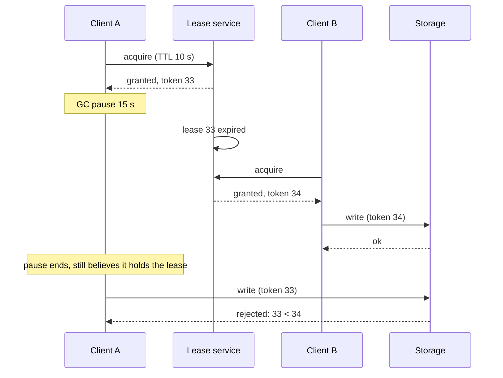

The primary has not sent a heartbeat for 8 seconds. Is it dead? If it is and you wait, every write stalls while you wait. If it is not (it is 12 seconds into a full garbage collection, or a switch is dropping its packets in one direction) and you promote a replica, you have two primaries, and the old one resumes writing as though nothing happened. From outside, crashed, paused and partitioned processes look the same: silence. A failure detector is a guess, and its knobs are how long you wait and how often you are wrong.

Leases let a system act on that guess without catastrophe: authority that expires by itself, so a node that stops renewing loses it even when nobody can reach it to say so. Fencing tokens turn a lease from probably safe into safe, because the protected resource rejects a holder whose lease has lapsed.

## Heartbeats and timeouts

A heartbeat is a periodic "I am alive" message, pushed by the node or pulled by a monitor that pings it. The detector declares failure after a timeout T of silence, so with interval I a crash is detected between T − I and T after it happens. A false suspicion is a live node silent for longer than T: a stop-the-world collection (G1's pause goal is 200 ms, but a full collection of a large heap takes seconds; see [JVM essentials](/learn/senior-craft/languages-for-senior-engineers/jvm-essentials)), a hypervisor stall, a heartbeat thread starved of CPU, a TCP retransmission (at least 200 ms on Linux), a route change.

Real systems choose T from the cost of being wrong:

| System | Heartbeat | Declared failed after | What that triggers |
|---|---|---|---|
| etcd (Raft) | 100 ms | 1,000 ms election timeout, randomised to 1–2 s | An election; cheap |
| Kafka consumer group | 3 s (`heartbeat.interval.ms`) | 45 s (`session.timeout.ms`; 10 s before Kafka 3.0) | Partition reassignment |
| Akka Cluster | 1 s | φ ≥ 8 with a 3 s acceptable pause: about 4.5 s | Member marked unreachable |
| Cassandra | Gossip every 1 s | φ ≥ 8 under an exponential model: about 18 s | Node marked down; writes to it become hints |
| Kubernetes node | Lease renewed every 10 s | 40 s (`--node-monitor-grace-period`; 50 s from 1.32) | Node tainted unreachable; pods evicted 300 s later |
| HDFS DataNode | 3 s | 630 s (2 × 5-minute recheck + 10 heartbeats) | Re-replication of every block it held |
| Load balancer health check | 2–10 s | 2–3 consecutive failures | Removed from rotation; reversible |

Read the table as a price list: HDFS waits ten and a half minutes because declaring a DataNode dead starts copying terabytes; a load balancer acts in seconds because putting an instance back costs nothing.

## The trade, simulated

A simulation of one node over 40,000 node-hours puts numbers on it. Heartbeats go out every 1,000 ms plus exponential jitter (1 ms mean). Pauses come from two Poisson processes: minor ones about every 10 s (lognormal, 20 ms median) and long stalls about once an hour (lognormal, 500 ms median, σ = 1.0, so one in ten exceeds 1.8 s, one in a hundred 5.1 s, one in a thousand 11 s); a heartbeat due during a pause goes out when it ends. The network adds 1 ms plus an exponential 2 ms, and retransmits one heartbeat in a thousand 200 ms late. False suspicions are silences past the threshold on a live node; detection times come from crashes injected at random.

| Detector (simulated) | Silence before suspicion | False suspicions per node-hour | Per day across 1,000 nodes | Mean detection after a crash |
|---|---|---|---|---|
| Fixed 1.5 s | 1.5 s | 0.27 | 6,400 | 1.0 s |
| Fixed 2 s | 2 s | 0.15 | 3,500 | 1.5 s |
| Fixed 3 s | 3 s | 0.056 | 1,340 | 2.5 s |
| Fixed 5 s | 5 s | 0.015 | 350 | 4.5 s |
| Fixed 10 s | 10 s | 0.0016 | 37 | 9.5 s |
| Fixed 30 s | 30 s | none in 40,000 node-hours | under 1 | 29.5 s |
| φ ≥ 8, normal model, σ floor 100 ms | ≈ 1.56 s | 0.25 | 5,900 | 1.1 s |
| φ ≥ 8, Akka's defaults | ≈ 4.5 s | 0.020 | 470 | 4.0 s |
| φ ≥ 8, Cassandra's exponential model | ≈ 18.4 s | 0.0001 (5 events) | 3 | 17.9 s |

Three readings. Detection time is the threshold minus half an interval, whatever the detector. The false-suspicion rate is the pause tail (stalls per hour times the chance one outlasts the threshold), so 5 s to 10 s cut it ninefold. And fleet size turns a small rate into a stream: 0.015 per node-hour is 350 false alarms a day. The numbers belong to this pause model; read your own threshold off the tail of your inter-arrival histogram and GC and steal logs.

## Phi-accrual, computed by hand

A fixed timeout is a step: alive until T, dead after. The φ-accrual detector (Hayashibara, Défago, Yared and Katayama, 2004) outputs a continuous suspicion level: it fits a distribution with CDF F to a sliding window of inter-arrival times and asks how likely a live node's heartbeat is to be this late:

$$\varphi(\Delta t) = -\log_{10}\bigl(1 - F(\Delta t)\bigr)$$

where Δt is the time since the last heartbeat. φ = 1 means a 10% chance; φ = 2, 1%; φ = 8, one in 10⁸. Take eleven heartbeats arriving at 0, 1,000, 2,000, 3,100, 4,000, 5,200, 6,000, 7,000, 8,000, 9,000 and 10,000 ms:

| Quantity | Computation | Value |
|---|---|---|
| Intervals | Consecutive differences | 1,000, 1,000, 1,100, 900, 1,200, 800, 1,000, 1,000, 1,000, 1,000 |
| Mean μ | 10,000 / 10 | 1,000 ms |
| Squared deviations | 0, 0, 10⁴, 10⁴, 4 × 10⁴, 4 × 10⁴, 0, 0, 0, 0 | Sum 10⁵ |
| Variance (population form, as Akka computes it) | 10⁵ / 10 | 10⁴ ms² |
| σ | √10⁴ | 100 ms |

Now let the silence after the heartbeat at 10,000 ms grow, with y = (Δt − μ) / σ:

| Δt (ms) | y | 1 − F, normal | φ normal | φ, Akka's logistic approximation | φ exponential, Δt / (μ ln 10) |
|---|---|---|---|---|---|
| 1,000 | 0 | 0.5 | 0.30 | 0.30 | 0.43 |
| 1,100 | 1 | 0.159 | 0.80 | 0.80 | 0.48 |
| 1,200 | 2 | 0.0228 | 1.64 | 1.64 | 0.52 |
| 1,300 | 3 | 0.00135 | 2.87 | 2.91 | 0.56 |
| 1,400 | 4 | 3.2 × 10⁻⁵ | 4.50 | 4.74 | 0.61 |
| 1,500 | 5 | 2.9 × 10⁻⁷ | 6.54 | 7.30 | 0.65 |
| 1,561 | 5.61 | 1.0 × 10⁻⁸ | 7.99 | 9.30 | 0.68 |
| 2,000 | 10 | 7.6 × 10⁻²⁴ | 23.1 | 37.6 | 0.87 |

```python
import math

arrivals = [0, 1000, 2000, 3100, 4000, 5200, 6000, 7000, 8000, 9000, 10000]
iv = [b - a for a, b in zip(arrivals, arrivals[1:])]
mu = sum(iv) / len(iv)                                         # 1000.0
sigma = math.sqrt(sum((x - mu) ** 2 for x in iv) / len(iv))    # 100.0, population form

def phi_normal(dt):
    p_later = 0.5 * math.erfc((dt - mu) / (sigma * math.sqrt(2)))   # 1 - CDF without cancellation
    return -math.log10(p_later)

def phi_exponential(dt):                                       # Cassandra: 1 - CDF = e^(-dt/mu)
    return dt / (mu * math.log(10))

for dt in (1000, 1300, 1561, 2000):
    print(dt, round(phi_normal(dt), 2), round(phi_exponential(dt), 2))
```

`erfc` computes the upper tail directly; `1 - cdf` would round 0.99999999 and lose the digits φ is made of. Under the normal model threshold 8 fires 561 ms after the heartbeat was due, promising a live node is this late once in 10⁸ heartbeats, 3.6 × 10⁻⁵ times per hour. The simulation's normal-model row raised 0.25 per hour, about 7,000 times the promise: a window of calm heartbeats has never seen a pause, so the fitted tail is thin exactly where pauses are heavy.

## Phi in Akka and Cassandra

**Akka** (`akka.cluster.failure-detector`; reference defaults: heartbeat interval 1 s, threshold 8, `acceptable-heartbeat-pause` 3 s, `min-std-deviation` 100 ms, `max-sample-size` 1,000) floors σ at the minimum, adds the acceptable pause to the mean, and replaces the normal CDF with the logistic approximation F(y) ≈ 1 / (1 + e^(−y(1.5976 + 0.070566y²))). Its tail is thinner than the normal's, so φ crosses 8 at y = 5.23 instead of 5.61. With the history above, the effective mean is 1,000 + 3,000 = 4,000 ms and y = (Δt − 4,000) / 100: φ is 0.30 at 4,000 ms, 7.30 at 4,500 ms and 8.01 at 4,523 ms, so a steady cluster marks a silent member unreachable about 4.5 s after its last heartbeat. Akka's reference configuration says "around 5.5 seconds" because real histories carry more jitter; each 100 ms of σ above the floor moves the crossing out about 0.5 s. The pause allowance tells the detector how long a live process can stall, which calm heartbeats cannot teach it; in the simulation it cut false suspicions from 0.25 to 0.02 per node-hour for 3 s of extra detection time.

**Cassandra** models inter-arrival times as exponential, 1 − F(Δt) = e^(−Δt/μ), so φ = Δt / (μ ln 10) ≈ 0.434 Δt/μ: linear in the silence, with no variance term. The default `phi_convict_threshold` of 8 convicts after 8 ln 10 ≈ 18.4 mean intervals, about 18 s with 1 s gossip, and each extra unit adds 2.3 s. Each endpoint's window holds 1,000 samples, and intervals longer than twice the gossip interval (2 s) are never recorded, so an outage cannot teach the detector that outages are normal. Both designs end up as a timeout proportional to the typical interval plus slack for pauses, but one that adapts per peer, so a cross-region link and a same-rack link share one threshold.

## What "dead" triggers, and why detectors should only suspect

| Action on suspicion | Cost if the node was alive | Reversible? |
|---|---|---|
| Stop routing requests to it | Seconds of lost capacity | Yes, at the next good heartbeat |
| Reassign its work (partitions, pods, shards) | Two workers on one partition until the old one notices; duplicates downstream | Partly; consumers must be idempotent |
| Re-replicate its data | Copying all it stored: 4 TB at 1 GB/s is over an hour of disk and network taken from live traffic | No; the copies are made |
| Take over its authority (promote, elect, grant its lock) | Two nodes exercising an exclusive authority | No; split brain unless fenced |

So a detector should only **suspect**; **conviction** is a separate, slower decision. Suspicion is cheap and local: stop sending the node requests. Conviction starts irreversible work, so it waits longer, gathers evidence from several observers, and is made once, by one decision-maker. SWIM has k other members probe before suspecting and lets the node refute with a higher incarnation number; Lifeguard stretches the suspicion timeout until others confirm; Consul records the failure once, in its Raft-replicated catalog; Kubernetes stops scheduling on a node at 40–50 s and evicts 300 s later.

```viz
{"type": "system", "scenario": "gossip", "nodes": 6,
 "title": "Membership spread by gossip", "caption": "Each node's view of who is alive spreads by random pairwise exchange. A suspicion raised by one node is confirmed or refuted by other nodes' probes before the cluster acts on it, which is how a single bad link is prevented from ejecting a healthy node."}
```

Correlation is the other reason to wait: a switch reboot silences a whole rack, and convicting on first suspicion turns one blip into a re-replication storm.

## Leases

A lease is authority (leadership, a lock, ownership of a partition) granted for a bounded time. If the holder cannot renew before expiry, the authority lapses without any message reaching it, and the grantor (a lease service, or a consensus store such as etcd or ZooKeeper) may reassign it. A crashed process's lock is held until someone breaks it; its lease ends by itself, at the price of an assumption about time.

Renew early: etcd's Go client sends a keepalive every TTL/3, so a 10 s lease survives two lost keepalives. The TTL bounds failover from below (a 30 s TTL cannot fail over in under 30 s), so choose it from the unavailability you can accept after a real crash. A lease gives **liveness**: a crashed holder cannot block the system forever. Whether it gives **safety**, at most one holder acting at a time, depends on clocks and pauses.

## Lease safety under clock drift

Holder and grantor measure one lease on two clocks that start at different moments and tick at different rates. Let the lease be L and every clock's rate be within ρ of true time (Spanner budgets 200 ppm; see [time and ordering](/learn/system-design/distributed-systems/time-and-ordering)). Two rules make it safe:

1. **The holder starts its clock when it sends the request**, since the grantor starts its own at or after receipt, and stops acting when its monotonic clock reads L(1 − ρ) − m, for a safety margin m.
2. **The grantor reassigns only after L(1 + ρ) + m** on its own clock, started when it granted.

The slowest allowed holder clock reads L(1 − ρ) − m after at most L − m/(1 − ρ) of true time; the fastest allowed grantor clock reads L(1 + ρ) + m after at least L + m/(1 + ρ). The holder always finishes first, by about 2m plus the request's transit time.

| L = 10 s, ρ = 200 ppm, m = 100 ms | Local reading | True time, worst case |
|---|---|---|
| Holder stops acting | 10 × (1 − 0.0002) − 0.1 = 9.898 s after sending | At most 9.900 s |
| Grantor reassigns | 10 × (1 + 0.0002) + 0.1 = 10.102 s after granting | At least 10.100 s |

The drift term is 2 ms on a 10 s lease, so drift is not the threat; the margin covers scheduling slack between check and action, and no margin covers what the next section traces. Chubby's client follows the same rule, keeping "a conservative approximation of the master's lease timeout" that allows for the reply's flight time and a known bound on how much faster the master's clock runs.

```viz
{"type": "system", "scenario": "leader-lease", "nodes": 3,
 "title": "Lease renewal, expiry and takeover", "caption": "A 5 s lease renewed every 2 s. When the holder is cut off it stops serving at expiry by its own clock; the store waits an extra drift bound of 500 ms before granting the lease to another node. The gap between the two is the price of safety; the case where both believe they lead is what fencing prevents."}
```

## Traced: a GC pause and a VM freeze

The arithmetic assumes check and action happen together. Client A holds a lease (L = 10 s, the rules above) and is about to write; client B is waiting.

| True time (s) | Event | A's belief | Storage |
|---|---|---|---|
| 0.000 | A sends acquire; A's lease clock starts | – | v0 |
| 0.004 | Grantor grants A, starts its 10.102 s wait | – | |
| 0.006 | A receives the grant; A's deadline is 9.898 on its monotonic clock | Holds lease | |
| 1.000 | A checks 1.000 < 9.898 and enters its write path | Holds lease | |
| 1.001 | Full GC: A stops for 15 s | (frozen) | |
| 10.106 | Grantor's wait ends; A's lease has expired | (frozen) | |
| 10.300 | B acquires and writes vB | | vB |
| 16.001 | A resumes mid-write and sends v1, already past its check | Holds lease | **v1 overwrites vB** |
| 16.002 | A's next check: 16.001 > 9.898; A stops | Lost lease | |

A's check was correct when it ran. No margin helps, because the pause is longer than the lease, and a shorter lease makes the overlap more likely, not less. At least a GC pause leaves the clock running, so A's next check catches it.

A VM freeze (a slow live migration, a hypervisor under memory pressure) can be worse: `CLOCK_MONOTONIC` does not count suspended time, and depending on the hypervisor and clock source a stopped guest may resume with its clocks not advanced by the freeze. Replay the trace with a 15 s freeze at 1.001: at 16.001 A's monotonic clock reads about 1.001, so even a re-check just before the write says 8.9 s remain, and A overwrites vB with every check passing. A lease gives liveness; something else has to give safety.

## Fencing tokens, traced

The fix Martin Kleppmann laid out in 2016, and Chubby shipped as sequencers a decade earlier: every grant carries a number that increases with each grant, 33 to A and 34 to B. Every operation on the protected resource carries the token; the resource remembers the highest it has accepted and rejects anything lower.



| Step | Request | Highest token before | Check | Result | Highest after |
|---|---|---|---|---|---|
| 1 | A: write v1, token 33 | 32 | 33 ≥ 32 | Accepted | 33 |
| 2 | A pauses; lease 33 expires; B is granted 34 | 33 | – | – | 33 |
| 3 | B: write vB, token 34 | 33 | 34 ≥ 33 | Accepted | 34 |
| 4 | B: write vB′, token 34 | 34 | 34 ≥ 34 | Accepted, same holder | 34 |
| 5 | A resumes: write v1′, token 33 | 34 | 33 < 34 | **Rejected**; A steps down | 34 |

What the storage must do:

- **Check and write atomically.** As two steps, A's check can pass just before B's write lands, and A's write lands after it.
- **Accept equal, reject lower.** One holder writes many times under one token.
- **Store the highest token with the data**, durably and replicated; a node that forgets it on restart accepts 33 again.
- **Let a new holder fence before it reads.** Storage rejects 33 only once it has seen 34: if B reads, A's delayed write lands, then B writes from what it read, B acted on stale data. B closes the gap by touching the resource with 34 first (a fenced read or a no-op write).

```viz
{"type": "system", "scenario": "distributed-lock",
 "title": "The pause, with and without fencing", "caption": "Client A is granted token 33 and pauses for 15 s; the 10 s lease expires and B is granted 34 and writes. Without fencing, A's late write lands on top of B's. With fencing, storage remembers 34 and rejects A's 33."}
```

## Where the token comes from and where it is checked

The token must be monotonic across grants and issued by the grantor from consensus-replicated state: a ZooKeeper sequence number or zxid, an etcd revision, a Raft term or log index, Chubby's sequencer (lock name, mode, generation). Never a wall clock (two grants in one millisecond, or a clock step), a per-client counter, or a random value, which is unique but not ordered; that is why Redlock cannot fence ([distributed locks and coordination](/learn/system-design/distributed-systems/distributed-locks-and-coordination)). The check lives in the resource as a conditional write; in SQL it is one column and one `WHERE` clause:

```python
import sqlite3

db = sqlite3.connect(":memory:")
db.execute("CREATE TABLE files (name TEXT PRIMARY KEY, body TEXT, fence INTEGER NOT NULL)")
db.execute("INSERT INTO files VALUES ('report', '', 0)")

def fenced_write(name, body, token):
    # One statement: the token check and the write cannot be separated by another writer.
    cur = db.execute(
        "UPDATE files SET body = ?, fence = ? WHERE name = ? AND fence <= ?",
        (body, token, name, token),
    )
    db.commit()
    return cur.rowcount == 1   # False means a newer holder has written: stop and step down

print(fenced_write("report", "from B", 34))    # True
print(fenced_write("report", "from A", 33))    # False: 33 < 34, A was fenced off
print(fenced_write("report", "B again", 34))   # True: same holder, same token
print(db.execute("SELECT body, fence FROM files").fetchone())   # ('B again', 34)
```

`fence <= ?` is accept-equal, reject-lower, and `rowcount` tells the stale holder it lost. Object stores do the same with conditional puts on a version or ETag, and Kafka with producer epochs ([exactly-once semantics](/learn/system-design/distributed-systems/exactly-once-semantics) traces this zombie fencing). A resource that cannot check anything (a third-party API, an email provider) cannot be protected by a lease at all: use an idempotency key ([idempotency and retries](/learn/system-design/building-blocks/idempotency-and-retries)), a single writer by construction, or state the risk.

## Leader leases in Raft, Chubby and Spanner

A leader lease lets a leader serve reads from local state without a round trip, because the others have promised not to elect anyone else for a while.

| System | What is leased | Duration | What makes it safe |
|---|---|---|---|
| Raft lease reads (etcd's raft `ReadOnlyLeaseBased`) | Leadership, for reads | About one election timeout (1 s at etcd defaults) | CheckQuorum (followers that heard from a leader recently ignore votes); bounded drift |
| Chubby master | Mastership | "A few seconds" | Replicas promise not to elect another master during the lease |
| Chubby session | A client's session, locks and ephemeral files | 12 s default extension per KeepAlive; 45 s grace period | Conservative client timeout; a new master assumes the longest lease its predecessor may have granted |
| Spanner Paxos group | Leadership of each group | 10 s by default, extended by votes | Successive leaders' lease intervals kept disjoint with TrueTime |
| Kubernetes controllers | Leadership, as a Lease object | 15 s lease, 10 s renew deadline, 2 s retry | Leader stops at 10 s without renewal; others wait 15 s; no fencing |

In Raft the lease is implicit: a leader that heard from a majority within the last election timeout knows no rival can have won since, if clocks drift less than the margin. etcd defaults to ReadIndex, keeping the round trip rather than the clock assumption ([consensus with Raft](/learn/system-design/distributed-systems/consensus-raft)).

Chubby adds the client's side. When a client's local lease timeout expires it cannot tell whether the master has ended its session, so it enters **jeopardy**: it empties and disables its cache and waits a 45 s grace period for a KeepAlive, which lets sessions survive a master failover; if none succeeds, it tells the application its locks are gone. Chubby also shipped both remedies for the pause: **sequencers** that servers can check and, for servers that cannot, a **lock-delay** (nobody may take a failed holder's lock for a client-chosen period of up to one minute), a timing mitigation rather than a guarantee. Kubernetes' election is traced in [distributed locks and coordination](/learn/system-design/distributed-systems/distributed-locks-and-coordination): a crashed controller manager leaves nobody reconciling for 15 s plus up to one retry period.

## Under the hood: Kubernetes nodes, etcd and memberlist

**Kubernetes nodes.** Since NodeLease went GA (1.17), each kubelet renews a Lease in `kube-node-lease` every 10 s, a quarter of its 40 s duration, and writes the much larger NodeStatus only on change or every 5 minutes, which took most heartbeat writes off etcd. The node lifecycle controller checks every 5 s; after `--node-monitor-grace-period` without an update it sets the node's Ready condition to Unknown and taints it `node.kubernetes.io/unreachable`. The grace period rose from 40 s to 50 s in 1.32 after [an issue](https://github.com/kubernetes/kubernetes/issues/121793) showed a lost watch connection, which HTTP/2 health checks take up to 45 s to notice, making the controller mark every node NotReady. Pods tolerate the taint for 300 s by default, so Deployment pods restart elsewhere about 6 minutes after a node dies; StatefulSet pods wait until the old pod object is deleted, since two pods with one identity would be split brain. When a large fraction of a zone looks unhealthy, the controller slows or stops evicting.

**etcd leases.** A lease is a TTL owned by the etcd leader; keepalives renew it, and at expiry the leader revokes it through Raft, deleting every attached key in one committed operation; that is how etcd locks release. Very short TTLs are raised to a minimum derived from the election timeout. Expiry is timed on the leader's clock, and a new leader extends every lease so none expires because of the election itself (newer releases can checkpoint remaining TTLs), so a lease can outlive its TTL by an election or so. A client should time its authority from when it sent its last acknowledged keepalive.

**memberlist** (Consul, Nomad, Serf) uses SWIM with Lifeguard instead of φ, and Cassandra feeds its φ from gossip heartbeat versions; [gossip and anti-entropy](/learn/system-design/distributed-systems/gossip-and-anti-entropy) traces both.

## Choosing a detector and a lease

| Approach | Detection time | False suspicions | Adapts per peer | Tuning burden | Used by |
|---|---|---|---|---|---|
| Fixed timeout T | T − I/2 | The pause tail beyond T | No | One number per environment | Raft elections, Kafka sessions, HDFS, Kubernetes nodes |
| φ, normal model, no pause allowance | ≈ μ + 5.6σ | High: the window never saw a pause | Yes, too eagerly | Low, but fragile | Rarely used alone |
| φ with a pause allowance (Akka) | ≈ μ + pause + 5.2σ | Set by the allowance | Yes, for jitter | The allowance, per environment | Akka Cluster |
| φ, exponential model (Cassandra) | ≈ 18.4μ at threshold 8 | Low; slow to convict | Through the mean only | Threshold only | Cassandra |
| SWIM with Lifeguard | Probe period plus a suspicion timeout of seconds to tens of seconds | Low: indirect probes, refutation, local health | Timeout shrinks with confirmations | Several knobs with good defaults | Consul, Nomad, Serf |

| Parameter | Typical | Too small | Too large |
|---|---|---|---|
| Heartbeat interval | 100 ms to 5 s | Load; heartbeats compete with traffic | Detection slower by up to one interval |
| Failure threshold | 5–10 × interval, or φ = 8 | False failovers on pauses | Long leaderless or misrouted window |
| Lease TTL | 5–30 s | Leases lost to moderate pauses | Failover never faster than the TTL |
| Renewal period | TTL / 3 | Renewal traffic | One lost renewal loses the lease |
| Safety margin m | Hundreds of ms | Acting past expiry under drift or a slow check | Unused lease time |

Pick the threshold from the measured pause tail and the cost of a false conviction, the TTL from the failover time you can tolerate, and fence every resource you cannot afford to corrupt.

## Exercises

```exercise
id: phi-accrual-akka
title: Compute phi the way Akka's detector does
prompt: |
  A monitor records heartbeat arrival times `arrivals` (milliseconds,
  ascending). For each time in `checks`, compute the suspicion level φ
  using only the heartbeats that arrived at or before that check time:

  1. If fewer than two heartbeats have arrived, φ is 0.
  2. Take the inter-arrival intervals and keep only the last `window` of them.
  3. `mean` is their average. `std` is their population standard deviation
     (divide by the count), raised to `min_std` if it is smaller.
  4. `dt` is the check time minus the latest heartbeat's arrival time.
  5. `y = (dt - (mean + pause)) / std` and
     `g = y * (1.5976 + 0.070566 * y * y)`, Akka's logistic approximation
     of the normal distribution.
  6. φ = log10(1 + e^g).

  Return the list of φ values, each rounded to 2 decimal places.
languages: [python, javascript]
entry: phi_values
starter:
  python: |
    import math

    def phi_values(arrivals, checks, window, min_std, pause):
        out = []
        for c in checks:
            # history up to c, intervals, mean, std, then phi
            out.append(0.0)
        return out
  javascript: |
    function phi_values(arrivals, checks, window, min_std, pause) {
      const out = [];
      for (const c of checks) {
        // history up to c, intervals, mean, std, then phi
        out.push(0);
      }
      return out;
    }
tests:
  - args: [[0, 1000, 2000, 3100, 4000, 5200, 6000, 7000, 8000, 9000, 10000], [11000, 11300, 11523, 11600], 1000, 100, 0]
    expected: [0.3, 2.91, 8.01, 10.78]
    label: the lesson's series, mean 1000 and std 100
  - args: [[0, 1000, 2000, 3100, 4000, 5200, 6000, 7000, 8000, 9000, 10000], [12000, 14000, 14300, 14500, 15000], 1000, 100, 3000]
    expected: [0, 0.3, 2.91, 7.3, 37.58]
    label: Akka's 3 s acceptable pause shifts the curve
  - args: [[500], [100, 600, 9000], 1000, 100, 0]
    expected: [0, 0, 0]
    label: fewer than two heartbeats
  - args: [[0, 1000, 2000, 3000], [4000, 4400, 5000], 100, 200, 0]
    expected: [0.3, 1.64, 7.3]
    label: perfectly regular history uses the std floor
  - args: [[0, 5000, 6000, 7000, 8000], [10000], 3, 100, 0]
    expected: [37.58]
    label: the window drops the old 5 s gap
  - args: [[0, 5000, 6000, 7000, 8000], [10000], 4, 100, 0]
    expected: [0.3]
    hidden: true
  - args: [[0, 1000, 2000, 3000, 6000], [4500, 6100], 10, 100, 0]
    expected: [7.3, 0.02]
    hidden: true
    label: a long gap enters the history and calms the detector
hints:
  - "Recompute the history for each check: filter the arrivals to those at or before it, then take consecutive differences."
  - "Population variance is the mean of the squares minus the square of the mean; clamp a tiny negative result from rounding to 0 before the square root."
  - "e^g overflows near g = 710. Once g is above about 40, log10(1 + e^g) equals g / ln 10 to double precision, so use that branch for large g."
```

```exercise
id: fenced-storage
title: Enforce fencing tokens at the storage
prompt: |
  Implement the storage side of fencing. Every key starts absent, with a
  highest-seen token of 0. Apply `ops` in order and return one result per
  operation:

  - `["write", key, token, value]`: if `token` is at least the key's highest
    seen token, store `value`, set the highest token to `token`, and return
    `"ok"`. Otherwise change nothing and return `"rejected"`.
  - `["read", key, token]`: a fenced read. If `token` is at least the key's
    highest seen token, raise the highest token to `token` and return the
    stored value (`None` / `null` if the key has no value). Otherwise return
    `"rejected"`.

  Tokens on different keys are independent.
languages: [python, javascript]
entry: fenced_store
starter:
  python: |
    def fenced_store(ops):
        value, highest, out = {}, {}, []
        for op in ops:
            pass
        return out
  javascript: |
    function fenced_store(ops) {
      const value = new Map(), highest = new Map(), out = [];
      for (const op of ops) {
      }
      return out;
    }
tests:
  - args: [[["write", "file", 34, "B"], ["write", "file", 33, "A"], ["read", "file", 34]]]
    expected: ["ok", "rejected", "B"]
    label: the paused holder's token 33 arrives after 34
  - args: [[["write", "file", 33, "a1"], ["write", "file", 33, "a2"], ["read", "file", 33]]]
    expected: ["ok", "ok", "a2"]
    label: one holder writes twice with one token
  - args: [[["write", "f", 33, "v1"], ["read", "f", 34], ["write", "f", 33, "v2"], ["write", "f", 34, "v3"], ["read", "f", 34]]]
    expected: ["ok", "v1", "rejected", "ok", "v3"]
    label: the new holder fences with a read before relying on it
  - args: [[["read", "x", 5], ["write", "x", 4, "a"], ["write", "x", 5, "b"]]]
    expected: [null, "rejected", "ok"]
    label: a read of a missing key still raises the token
  - args: [[]]
    expected: []
    label: no operations
  - args: [[["write", "a", 10, "x"], ["write", "b", 3, "y"], ["write", "a", 9, "z"], ["read", "b", 3]]]
    expected: ["ok", "ok", "rejected", "y"]
    hidden: true
    label: keys are fenced independently
  - args: [[["write", "f", 7, "q"], ["read", "f", 6], ["write", "f", 100, "r"], ["write", "f", 99, "s"], ["read", "f", 100]]]
    expected: ["ok", "rejected", "ok", "rejected", "r"]
    hidden: true
hints:
  - "Keep two maps: key to value and key to highest token seen, with 0 as the default token."
  - "Reads and writes share the same check; only a write changes the stored value."
```

## Failure modes

| Failure | Symptom | Diagnosis | Fix |
|---|---|---|---|
| Pause longer than the lease | Two holders' writes interleaved, or fencing rejections at the resource | A GC or steal pause spans the incident; the rejected token is one below the current | Fencing at the resource; shorter pauses lower the rate but never remove it |
| Lease timed on the wall clock | A holder acts past expiry after an NTP step back, or quits early after a step forward | Lease code reads `time.time()` or `System.currentTimeMillis()`; incidents align with chrony or ntpd steps | Monotonic clock from send time; holder stops at L(1 − ρ) − m |
| Threshold inside the pause tail | Failovers, evictions or membership flaps with no crash | Suspicions line up with GC or steal events; the inter-arrival histogram's tail passes the threshold | Raise the threshold past the measured tail, add a pause allowance, confirm with indirect probes |
| Renewal starved by the holder's own load | Leases lost exactly when a node is busiest | Renewal latency climbs with CPU or event-loop lag before each loss | Renew on a dedicated thread; alert on renewal latency; see [async and event loops](/learn/systems/concurrency/async-and-event-loops) |
| Token recorded but not enforced | A stale holder's writes succeed although tokens are logged | A write with a lower token is accepted; check and write are separate statements | One conditional write (`WHERE fence <= $token`), covered by a test |
| Token from the wrong source | Two grants with equal or decreasing tokens | Tokens are timestamps, client counters or random IDs | A grantor-issued, consensus-backed counter: zxid, etcd revision, Raft term |
| Correlated false suspicion | Many nodes declared dead at once, then a re-replication or eviction storm | All suspicions come from one zone, one network event or one stalled monitor | Confirm from several observers; rate-limit convictions, as Kubernetes does for a mostly unhealthy zone |

## Interviewer follow-ups

**"Your primary stops heartbeating. When do you fail over, and why that number?"** Model answer: from the measured pause tail and the cost of a wrong failover. In the lesson's model a 5 s threshold means about 350 false alarms a day across 1,000 nodes, and a database failover is expensive, so 10–30 s; either way the promotion carries a higher epoch that storage enforces, so a wrong guess costs an aborted write, not a forked history. Common wrong answer: "after three missed heartbeats", with no mention of pauses or fencing.

**"What does φ = 8 mean, and do you trust it?"** Model answer: under the fitted distribution a live node would be this late with probability 10⁻⁸, but the fit comes from calm heartbeats, so its tail is wrong for pauses; Akka adds an acceptable pause and Cassandra uses an exponential model. Common wrong answer: "one false positive in 100 million checks."

**"A client holds a 10 s lease and pauses for 15 s. What happens to its writes?"** Model answer: without fencing they overwrite the new holder's work, because the check happened before the pause; with fencing the storage has seen 34 and rejects 33, and the new holder fences before it reads. Common wrong answer: "re-check the lease before writing" or "use a shorter lease."

## What mid-level engineers get wrong

- **Treating a timeout as a crash detector.** Consequence: failover logic lets the old node keep writing.
- **Deriving the timeout from the heartbeat interval** ("three missed beats"). Consequence: hundreds of false failovers a day per fleet.
- **Trusting φ's nominal probability.** Consequence: a promised 10⁻⁸ that delivers 0.25 false suspicions per node-hour.
- **Timing a lease on the wall clock, or from when the grant arrived.** Consequence: the holder acts after the grantor has reassigned.
- **Believing a shorter lease makes a pause safe.** Consequence: more lease losses and the same unsafe write.
- **Recording fencing tokens without a conditional write.** Consequence: the guarantee exists only in the logs.
- **Re-replicating or evicting on the first suspicion.** Consequence: one network blip becomes an hour of recovery traffic.

## Senior signals

- You start from **crashed, slow and partitioned look identical** and describe every detector as a false-suspicion rate traded against detection time, set by the pause tail.
- You can **compute φ** from a heartbeat history and explain Akka's pause allowance and Cassandra's exponential model.
- You separate **suspicion from conviction**: reversible actions on suspicion, irreversible ones after confirmation, decided once.
- You state a lease's **clock rule** with numbers and say that drift is milliseconds while pauses are seconds, then trace the **pause and VM freeze** that no lease length fixes.
- You define **fencing tokens** by source (grantor, consensus, monotonic) and check (atomic conditional write, accept equal, reject lower, fence before reading), and say when a resource cannot be fenced.
- You know shipped numbers: Kubernetes' 10 s node Lease renewals, 50 s grace (40 s before 1.32) and 300 s eviction; Chubby's 12 s leases and 45 s grace.

## Check yourself

```quiz
- q: >-
    A node's heartbeat is 8 seconds late. Which cause can the detector rule out from the silence alone?
  options: ["A partition, since the other links are healthy", "A crash, since a crashed host always resets TCP", "A GC pause, since pauses never exceed a few seconds", "None of them; all three produce the same silence"]
  answer: 3
  explanation: >-
    Silence carries no information about its cause. Pauses can last tens of seconds, a crashed or frozen host need not send a reset, and healthy links elsewhere say nothing about this one. That is why acting on a detection must stay safe when the detection is wrong, through leases and fencing.
- q: >-
    Heartbeat intervals have mean 1,000 ms and standard deviation 100 ms. Under the normal model, when does phi reach 8?
  options: ["About 8.00 s after the last heartbeat", "About 1.56 s after the last heartbeat", "About 1.80 s after the last heartbeat", "About 18.4 s after the last heartbeat"]
  answer: 1
  explanation: >-
    Phi 8 means an upper-tail probability of 10 to the minus 8, which the normal distribution reaches 5.61 standard deviations past the mean: 1,000 + 561 ms. 18.4 s is what Cassandra's exponential model gives for a 1 s mean, since there phi is the silence divided by the mean times ln 10. Adding 8 standard deviations confuses phi with a z-score.
- q: >-
    In the lesson's simulation, a phi detector with threshold 8 and no pause allowance raised about 0.25 false suspicions per node-hour. Why so far above what the threshold implies?
  options: ["Its window held only calm heartbeats, so the fitted tail was too thin", "The logistic approximation it used is inaccurate close to the mean", "The population variance underestimated the true deviation tenfold", "Network jitter dominated the distribution of the inter-arrival times"]
  answer: 0
  explanation: >-
    Long pauses arrive about once an hour, so a 1,000-sample window of steady 1 s heartbeats rarely contains one; the fitted normal tail says a 1.6 s silence is a one-in-10^8 event, and pauses make it routine. Akka's acceptable heartbeat pause encodes the missing tail. That row used the exact normal CDF, and jitter was a few milliseconds.
- q: >-
    A lease is 10 s, clocks drift at most 200 ppm, and the safety margin is 100 ms. When must the holder stop acting?
  options: ["9.898 s after sending the request, on its monotonic clock", "10.102 s after sending the request, on its monotonic clock", "10.000 s after receiving the grant, on its wall clock", "9.898 s after the grantor's timestamp inside the grant"]
  answer: 0
  explanation: >-
    L(1 - rho) - m = 9.998 - 0.1 = 9.898 s, measured from send time because the grantor's clock started at or after receipt, on a monotonic clock so an NTP step cannot move it. 10.102 s is the grantor's wait, L(1 + rho) + m. A timestamp from the grantor compares two different clocks.
- q: >-
    B is granted token 34 and reads a record. Client A's delayed write with token 33 then arrives, and B writes based on what it read. What closes this gap?
  options: ["The lease service revokes token 33 at the resource on expiry", "A shorter lease so that A's writes arrive before B is granted", "A re-checks its lease immediately before sending each write", "B touches the resource with token 34 before it reads anything"]
  answer: 3
  explanation: >-
    Storage rejects 33 only after it has seen 34. A fenced read or no-op write with 34 raises the stored highest token before B relies on the data, so A's late write is rejected. A re-check by A cannot help because the write was already in flight, and the lease service has no channel to the resource.
- q: >-
    A Kubernetes 1.32 node loses power. With default settings, roughly when are its Deployment's pods started on other nodes?
  options: ["After about 6 minutes: the 50 s grace, then a 300 s toleration", "Only once an operator deletes the Node object from the cluster", "After about 40 s: the kubelet's node Lease duration expires", "After about 10 s: the kubelet misses one node Lease renewal"]
  answer: 0
  explanation: >-
    The node lifecycle controller marks the node unreachable when its Lease has not been renewed within node-monitor-grace-period, 50 s from 1.32 (40 s before), and pods then wait out the default 300 s toleration for the unreachable taint before eviction. Waiting for a manual delete is what StatefulSet pods need, not Deployment pods.
```
