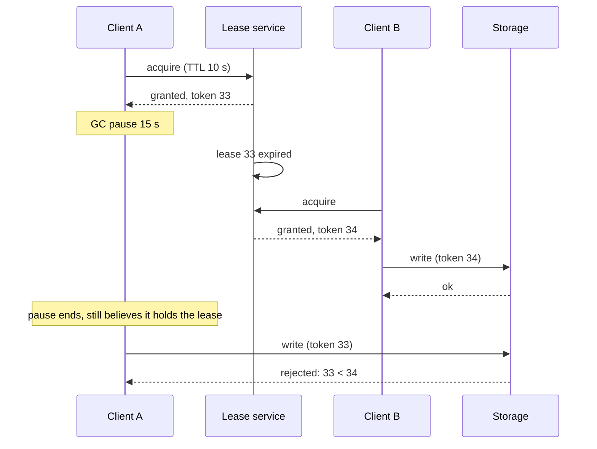

The primary has not sent a heartbeat for 8 seconds. Is it dead? If it is and you wait, every write is blocked for as long as you wait. If it is not (it is in a 12-second garbage collection pause, or a switch between you and it is dropping packets one way) and you promote a replica, you have two primaries, and the old one will resume and keep writing as though nothing happened. From outside, a crashed process, a paused process and a partitioned process are indistinguishable. A failure detector is a guess, and the two knobs are how long you wait and how often you are wrong.

Leases are how systems act on that guess without catastrophe: a grant of authority that expires on its own, so a node that stops renewing loses its authority even if nobody can reach it to tell it so. And fencing tokens are what turns a lease from probably-safe into safe, because they let the resource being protected reject the node that thinks it still holds a lease it has lost. This lesson is the mechanics of all three, with the numbers and the pause scenario that every senior interviewer eventually draws.

## Heartbeats and timeouts

A heartbeat is a periodic "I am alive" message. Push: the monitored node sends it. Pull: the monitor pings and expects a reply. Either way the detector declares a failure when nothing has arrived for a timeout T.

The trade-off is a straight line. A short T detects real failures fast but fires on every hiccup: a 100 ms stop-the-world GC, a 200 ms network stall during a route change, a busy CPU delaying the heartbeat thread. A long T tolerates the hiccups and leaves the system leaderless or routing to a dead node for the whole of T. Typical choices:

| Setting | Interval | Timeout | Reasoning |
|---|---|---|---|
| Raft (etcd defaults) | 100 ms | 1,000 ms | Elections are cheap; false elections are disruptive; 10x margin over the interval |
| Database failover (Patroni, Orchestrator) | 1 to 5 s | 10 to 30 s | Failover is expensive and lossy; better to wait out a pause than to split |
| Kubernetes node heartbeats | 10 s | 40 s (node not ready) plus a pod eviction delay of minutes | Rescheduling many pods is disruptive |
| Load balancer health checks | 2 to 5 s | 2 to 3 consecutive failures | Removing an instance is cheap and reversible |
| Cassandra gossip | 1 s | phi-accrual, no fixed timeout | See below |

GC pauses are the reason the timeouts are not shorter. A JVM with a large heap can pause for seconds under a full collection; a Go or Rust service can stall on a page fault while swapping; a VM can be paused by its hypervisor for live migration. Any of these makes a healthy node silent for longer than an aggressive timeout, and the detector cannot tell.

## Phi-accrual failure detection

A fixed timeout treats a heartbeat 1 ms late and 10 seconds late the same until the threshold, and then flips from "alive" to "dead" in one step. The **phi-accrual** detector (Hayashibara et al., used in Cassandra and Akka) instead outputs a continuously rising suspicion level.

It keeps a sliding window of recent inter-arrival times (say the last 1,000) and models their distribution. Given the time since the last heartbeat, it computes the probability that a heartbeat would be this late if the node were alive, and reports φ = -log10 of that probability. φ = 1 means a 10% chance the node is alive and merely late; φ = 3, 0.1%; φ = 8, 10^-8. The application chooses its threshold: Cassandra's default is 8.

The point is adaptation. On a quiet LAN with heartbeats arriving every 1,000 ± 5 ms, a heartbeat 300 ms late is already φ ≈ 8, so detection is fast. On a congested link with arrivals at 1,000 ± 400 ms, the same 300 ms is ordinary and φ stays near 0; the detector waits longer automatically. Two consequences: a fixed threshold gives consistent false-positive rates across different network conditions, and a slow degradation (the node getting steadily slower) shows up as rising φ before it crosses the line.

SWIM-style protocols add a second idea: before declaring a node dead, ask k other nodes to probe it, so one bad link does not condemn a healthy node. [Gossip and anti-entropy](/learn/system-design/distributed-systems/gossip-and-anti-entropy) covers SWIM's suspicion and refutation mechanism.

```viz
{"type": "system", "scenario": "gossip", "nodes": 6,
 "title": "Membership spread by gossip", "caption": "Each node's view of who is alive spreads by random pairwise exchange. A suspicion raised by one node is confirmed or refuted by others' probes before the cluster acts on it, which is how a single bad link is prevented from ejecting a healthy node."}
```

## What "dead" triggers

Detection is only useful if the consequence is safe. The consequences, in increasing order of danger:

- **Stop routing to it.** A load balancer removes the instance. Reversible, cheap, low risk; if wrong, the instance loses traffic briefly.
- **Reassign its work.** A consumer group reassigns its partitions; a scheduler reschedules its pods. Medium risk: if the node was merely slow, two workers now process the same partition, which is why consumers must be idempotent.
- **Take over its authority.** Promote a replica; elect a new leader; grant its lock to another. High risk: if the node is alive, two nodes hold an authority that was supposed to be exclusive. This is the case leases and fencing exist for.

## Leases

A lease is a grant of authority (leadership, a lock, ownership of a partition) for a bounded time. The holder must renew before expiry; if it cannot, the authority lapses without any message reaching the holder. The grantor (a lease service, or a consensus store like etcd or ZooKeeper) reassigns it after expiry.

Compare with a lock: a lock held by a crashed process is held forever unless someone breaks it; a lease held by a crashed process expires by itself. That is the entire reason leases exist, and the cost is the assumption they make about time.

### The clock assumption

The holder decides "I still have the lease" by its own clock; the grantor decides "the lease has expired" by its own clock. They are different clocks. For safety, the holder must stop acting *before* the grantor could consider the lease expired, allowing for the worst-case difference in how the two clocks measure the interval.

Concretely, with a 10-second lease: the holder measures the lease from the moment it *sent* the request (not received the response, because the grantor's clock started at or before receipt), uses its monotonic clock, and treats the lease as over at 10 seconds minus a safety margin for drift (a few hundred milliseconds at typical rates; more if clocks are known to be poor). The grantor waits the full 10 seconds by its own clock, plus its own margin, before reassigning. Renewal happens well before expiry, at around a third of the lease: a 10-second lease renewed every 3 seconds survives two missed renewals.

```viz
{"type": "system", "scenario": "leader-lease", "nodes": 3,
 "title": "Lease renewal, expiry and takeover", "caption": "The leader renews at a third of the lease period. When it stops renewing, the grantor waits out the full lease plus a margin before granting to another node. The window between the old leader's last renewal and the new grant is when no one leads; the window when both believe they lead is what fencing prevents."}
```

Kubernetes leader election is a concrete instance: a Lease object in the API server with `holderIdentity`, `leaseDurationSeconds` (default 15), `renewDeadline` (10) and `retryPeriod` (2). The holder updates `renewTime` every 2 seconds; if it fails to renew within 10 seconds it *voluntarily* stops leading; other candidates take the lease once 15 seconds have passed since the last renewal they observed. etcd leases work the same way at the store level: a lease with a TTL, kept alive by the client; keys attached to the lease are deleted when it expires. ZooKeeper's sessions are leases: session timeout, heartbeats from the client, ephemeral znodes deleted on expiry.

### The pause

Here is the scenario, drawn by Martin Kleppmann and repeated in every serious discussion of distributed locks since:

1. Client A acquires a lease on resource R (say, "may write file F") with a 10-second TTL.
2. Client A begins its work and hits a stop-the-world GC pause of 15 seconds.
3. The lease expires. The grantor grants R to client B.
4. Client B writes F.
5. Client A's pause ends. It has no idea time has passed; its last observation was "I hold the lease". It writes F, overwriting B's write.

Nothing in the lease protocol prevents step 5. Client A checked the lease before the pause; the check was correct at the time; the pause is invisible to A's own code. Shortening the TTL makes it more likely, not less. Making A "check the lease again before writing" narrows the window but does not close it: the pause can occur between the check and the write. Only the resource itself can close it.



## Fencing tokens

A fencing token is a number that increases with every grant of the lease: 33 to A, 34 to B. The holder includes its token in every operation on the protected resource, and the resource **rejects any operation whose token is lower than the highest it has seen**. In step 5 above, storage has seen 34 and rejects A's 33. A's late write fails, loudly, and A learns it lost the lease.

Where the token comes from: any source that is monotonic across grants. ZooKeeper's znode version or the zxid of the grant; etcd's revision number of the key write; a Raft log index; a counter in the lease service's consensus-replicated state. What it must not come from: a wall clock (two grants in the same millisecond, or a clock step, break monotonicity) or a per-client counter.

Where the token is checked: at the resource, which must therefore support it. A database can with a conditional write (`UPDATE ... WHERE fence_token <= 34` then set it), an object store with a conditional put on a version, a file system with a token in a header the writer verifies before appending. A resource that cannot check tokens (a plain HTTP API with no version parameter, a third-party system) cannot be safely protected by a lease; the best you can do is make the operation idempotent or accept the risk and say so.

The token also handles the *reverse* problem: A's lease is renewed, B's grant never happens, but A's writes are delayed in the network and arrive after A has released and B has been granted. Same rejection, same safety.

## Numbers and choices

| Parameter | Typical | Consequence of too small | Consequence of too large |
|---|---|---|---|
| Heartbeat interval | 100 ms to 5 s | Network and CPU load; heartbeats compete with real traffic | Slower detection |
| Failure timeout | 5 to 10x interval | False positives on GC and network stalls; split brain if fencing is absent | Long leaderless or misrouted window |
| Lease TTL | 5 to 30 s | Renewal traffic; expiry under moderate pauses | Long time to recover from a real crash |
| Renewal period | TTL / 3 | Traffic | One missed renewal loses the lease |
| Holder safety margin | Hundreds of ms | Acting past expiry under drift | Unused lease time |

The relationship people miss: the failure timeout bounds unavailability (nobody leads for up to T after a crash), and the lease TTL bounds it again (nobody can take over until the lease expires), so a system with a 30-second TTL cannot fail over faster than 30 seconds no matter how good its detector is. Choose the TTL from the recovery time you can accept, then choose the renewal rate and the detector from the TTL.

## Failure modes

**Pause longer than the lease.** The scenario above; the holder acts after losing the lease. Detect: fencing rejections at the resource, if fenced; divergent writes if not. Mitigate: fencing tokens at the resource; smaller heaps or pauseless collectors reduce frequency but do not fix it.

**Clock jump extends a lease.** The holder's wall clock steps backwards 30 seconds; it believes the lease is still valid. Detect: rare; found by fencing rejections. Mitigate: leases measured on the monotonic clock from the send time; never on wall time.

**Partitioned old leader continues.** The old leader is cut off from the lease service but can still reach the storage; it keeps writing. Detect: the storage sees writes from two tokens. Mitigate: the holder stops acting when it cannot renew (voluntary step-down at the renew deadline); the storage rejects the stale token regardless.

**Timeout too short for the environment.** Cloud instances with noisy neighbours, or a JVM with a 30 GB heap, produce multi-second stalls; a 2-second timeout causes constant failovers. Detect: failover count without corresponding crashes; φ history. Mitigate: phi-accrual or a timeout derived from observed pause distributions; SWIM-style indirect probes.

**Token accepted but not enforced.** The storage records the token but does not reject lower ones, so the guarantee is decorative. Detect: code review; a test that writes with a stale token and expects rejection. Mitigate: the check is a conditional write in the storage layer, tested.

**Renewal starved by the holder's own load.** The renewal runs on the same event loop as the work; a burst of work delays the renewal past the deadline; the lease is lost under load, exactly when failover hurts most. Detect: lease loss correlating with CPU saturation. Mitigate: renewal on a dedicated thread with priority; watch renewal latency as a metric. [Async and event loops](/learn/systems/concurrency/async-and-event-loops) covers why a blocked loop delays everything on it.

**Fencing token from the wrong source.** Tokens from a wall clock, or from each client's own counter, are not monotonic across grants. Detect: two grants with equal or decreasing tokens. Mitigate: tokens issued by the grantor from consensus-replicated state.

## Interviewer follow-ups

**Q: "Your primary stops heartbeating. When do you fail over, and why that number?"**

I wait long enough that a GC pause or a network blip does not trigger a failover, because a false failover with asynchronous replication loses acknowledged writes and risks two primaries. For a database with a JVM-style pause profile that is 10 to 30 seconds; for a control plane with cheap elections, a second. The number comes from the observed distribution of pauses and heartbeat delays, ideally via a phi-accrual detector rather than a fixed threshold. And whatever the number, the promotion is fenced: the new primary gets a higher epoch, and replicas and clients reject the old primary's writes, so the cost of being wrong is an aborted write rather than a divergent history.

**Q: "A client holds a lock with a 10-second TTL and pauses for 15 seconds. What happens to its writes?"**

Without fencing, they succeed and overwrite whatever the new holder wrote, because the client cannot know it paused. With fencing, the lock service issued token 33 to the first client and 34 to the second, the storage has seen 34, and the first client's write arrives with 33 and is rejected. The lease gives me liveness: a crashed holder does not block forever. The token gives me safety: a paused holder cannot corrupt. I need the resource to check tokens, so if the resource is something that cannot, I redesign so that the operation is idempotent or has a single writer by construction.

**Q: "Why not just use a very short lease so the window is tiny?"**

Because the window is not the lease length; it is the pause length. A 1-second lease loses the lease on every 1-second pause, causing constant churn, and still allows a paused holder to act after expiry. Shorter leases increase false failovers without closing the safety hole. The right lease length comes from how long I can tolerate having no leader after a real crash; the safety comes from fencing, independent of the length.

**Q: "How does a phi-accrual detector differ from a timeout, and when does it matter?"**

A timeout is a step function; phi is a suspicion level derived from the observed inter-arrival distribution: how improbable is a heartbeat this late given recent history. On a stable network it detects failures faster than a conservative fixed timeout; on a noisy one it automatically tolerates the noise. It matters in heterogeneous or cloud environments where the same fixed timeout is too aggressive for some links and too slow for others, which is why Cassandra uses it across a cluster spanning data centres. I would combine it with indirect probes so one bad link does not condemn a node.

**Q: "Where does the fencing token come from, and where is it checked?"**

From the grantor's consensus-replicated state: an etcd revision, a ZooKeeper znode version, or a Raft log index, so that it is strictly increasing across grants regardless of clocks or which client asked. It is checked at the resource being protected, in the storage layer, as a conditional write that fails if the token is lower than the highest seen. Checking it in the client is worthless because the client is the thing that might be paused. If the resource is a database, that is one column and one `WHERE` clause; if it is an object store, a conditional put on a version; if it is a third-party API with no such feature, I say that the lock is advisory only.

## Senior signals

- You start from **crashed, slow and partitioned are indistinguishable** and describe every detector as a false-positive rate traded against detection time.
- You quote **timeout numbers with the reasoning** (GC pauses, cost of a false failover) and know where phi-accrual improves on a fixed threshold.
- You explain a lease's **clock assumption** precisely: monotonic clock, measured from send time, margin for drift, holder stops before the grantor reassigns.
- You draw the **pause scenario** yourself and state that no lease length fixes it.
- You define **fencing tokens** by their source (monotonic, consensus-backed) and their check point (the resource, as a conditional write).
- You know that a resource that **cannot check tokens** cannot be safely protected by a lease, and you say so.

## Check yourself

```quiz
- q: >-
    A node's heartbeat is 8 seconds late. Which of these can the detector rule out?
  options: ["The GC pause, since pauses never exceed a few seconds", "The partition, since the cluster's other links are healthy", "The crash, since a crashed node's TCP connection resets", "None; silence looks the same for all three causes"]
  answer: 3
  explanation: >-
    Silence carries no information about its cause: a crash, a long GC pause and a partition all look identical from outside. A crashed host need not send a reset, pauses can last tens of seconds, and healthy links elsewhere say nothing about this one. This is why acting on a failure detection must be safe even when the detection is wrong, via leases and fencing.
- q: >-
    A lease has a 10-second TTL. To be safe against clock differences, the holder should treat the lease as valid until:
  options: ["Until the grantor sends a message saying it has expired", "10 s after receiving the grant, measured on the wall clock", "10 s from sending the request, monotonic, minus a margin", "10 s after the grantor's timestamp in the grant response"]
  answer: 2
  explanation: >-
    The grantor's clock started at or before receipt of the request, so the holder measures from send time; the monotonic clock is immune to NTP steps; the drift margin covers rate drift. Waiting for the grantor's message fails when the network is the problem, and the grantor's timestamp compares two different clocks.
- q: >-
    Client A holds a lease and pauses for longer than its TTL. Client B is granted the lease and writes. A resumes and writes. What prevents A's write from corrupting the resource?
  options: ["Nothing; with process pauses this cannot be prevented", "A shorter TTL, so that a pause outlives the lease less often", "The resource rejecting A's write for its lower fencing token", "A re-check of the lease by A immediately before writing"]
  answer: 2
  explanation: >-
    The pause can happen between any check and the write, so client-side checks cannot close the window. Only the resource, seeing a monotonically increasing token, can reject the stale holder.
- q: >-
    Why does a phi-accrual detector adapt better than a fixed timeout across a cluster spanning two data centres?
  options: ["It judges lateness against each peer's own arrival history", "It uses synchronised wall clocks instead of local timers", "It subtracts the measured network latency from each wait", "It sends heartbeats more often to the more distant data centre"]
  answer: 0
  explanation: >-
    A fixed timeout is too aggressive for the cross-DC links and too lax for the local ones; phi computes suspicion from each peer's observed inter-arrival distribution, so the same threshold means the same false-positive probability on fast and slow links.
- q: >-
    A fencing token should be generated by:
  options: ["The client, from a counter it increments on each acquire", "The grantor, from consensus-replicated monotonic state", "A random UUID, so no two grants ever share a token", "The grantor's wall-clock time in milliseconds at the grant"]
  answer: 1
  explanation: >-
    The token must be strictly increasing across grants regardless of which client asks or what any clock says: an etcd revision or ZooKeeper version does this. Client counters and wall clocks are not comparable across grants; UUIDs are unique but not ordered.
```
