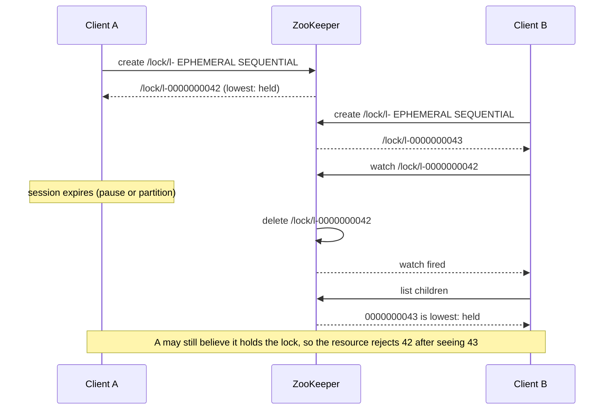

Twenty replicas of a service each run a nightly job that emails every customer a statement. The job must run once. The obvious answer, "take a distributed lock, run the job, release it", is where the trouble starts: which lock, held how, and what happens when the holder pauses for 30 seconds halfway through, loses the lock without noticing, and a second replica starts sending the same emails.

The first question a senior engineer asks about any distributed lock is what it is for. If it prevents *wasted work* (two replicas computing a report, one copy thrown away), an occasional double holder costs money and nothing else, and a fast best-effort lock is fine. If it prevents *incorrect results* (two writers corrupting a file, two charges for one order), no lock built on timeouts is sufficient alone: the resource must enforce exclusivity with a fencing token, as [failure detection and leases](/learn/system-design/distributed-systems/failure-detection-and-leases) traced.

## Efficiency or correctness: ask first

| Purpose | Cost of two holders | Lock that is good enough |
|---|---|---|
| Efficiency: skip duplicate work (cache rebuild, report generation, a cron job whose work is idempotent) | Wasted compute, perhaps a duplicate log line | A single Redis `SET NX PX`, Redlock, any lease |
| Correctness: prevent conflicting effects (one writer to a file, one charge per order, one leader mutating shared state) | Corrupted data, a double charge, split brain | A consensus-backed lease **plus** a fencing token checked by the resource, or a design with no lock |

The nightly job is closer to correctness than it looks: a duplicate statement is a customer complaint. The fix is not a stronger lock but an idempotent job: record "statement sent to customer C for month M" under a unique key and send only when that insert succeeds. Now two replicas running at once is harmless, the lock only saves CPU, and any lock will do. Most correctness locks dissolve under this question; the ones that remain need fencing.

## The single-node Redis lock

```python
import secrets
import redis

r = redis.Redis()
RELEASE = r.register_script("""
if redis.call('GET', KEYS[1]) == ARGV[1] then
  return redis.call('DEL', KEYS[1])
end
return 0
""")

def acquire(name, ttl_ms=30_000):
    token = secrets.token_hex(20)               # 160 random bits, new for every acquisition
    if r.set(name, token, nx=True, px=ttl_ms):  # SET name token NX PX 30000
        return token
    return None

def release(name, token):
    return RELEASE(keys=[name], args=[token]) == 1   # compare-and-delete, atomic inside Redis
```

`NX` sets the key only if it is absent, which is the atomic acquire. `PX 30000` makes the lock a 30 s lease, so a crashed holder cannot block everyone forever. The token identifies this acquisition, and the Lua script deletes the key only if it still holds that token; Redis runs a script without interleaving other commands. Redis 8.4 added `DELEX key IFEQ token`, which does the same without Lua.

Why the release must compare, and why atomically:

| t (s) | A | B | Key `lock:stmt` |
|---|---|---|---|
| 0 | `SET NX PX 30000`, token a7f3: OK | | a7f3, expires at 30 |
| 1–31 | Stalled (GC, slow query) | | |
| 30 | | | Expired, absent |
| 30.2 | | `SET NX`, token 19c2: OK | 19c2, expires at 60.2 |
| 31 | Plain `DEL lock:stmt` | | **Absent: B's lock deleted** |
| 31.1 | | C acquires while B still works | Two holders |

With the script, A's release at 31 finds 19c2, not a7f3, and returns 0. A client-side `GET` then `DEL` fails the same way when the key expires and B acquires between the two commands. The token must be unique per acquisition, not per process: a hostname or a process id is shared by a restarted process or a second worker, which could then delete a lock it does not hold. Redis's documentation suggests 20 bytes from `/dev/urandom`.

### Failover gives it two holders

Redis replicates asynchronously: the primary acknowledges `SET` before any replica has it.

| t | Event | Primary | Replica |
|---|---|---|---|
| 0 | A: `SET NX PX` succeeds; the primary replies | lock = A | Replication in flight |
| 0.001 | Primary crashes before the write leaves | – | No key |
| ≈ 30 s | Sentinel's `down-after-milliseconds` (30 s by default) passes; replica promoted | – | Primary, no key |
| 30.1 | B: `SET NX PX` succeeds | | lock = B, while A still works |

`WAIT 1 100` after the `SET` makes A wait until one replica acknowledges, which narrows the window, but Redis documents that `WAIT` does not make it strongly consistent: a failover can still promote a replica without the key, and a replica restarted without persistence comes back empty. A single-node lock, replicated or not, is an efficiency lock.

```viz
{"type": "system", "scenario": "distributed-lock", "nodes": 3,
 "title": "Acquire, hold, expire, re-acquire", "caption": "The lock is a key with a TTL. Client A is granted token 33 and pauses for 15 s; the lease expires, B is granted 34 and writes. Without fencing, A's late write lands on top of B's; with fencing, storage rejects 33 because it has seen 34."}
```

## Redlock's algorithm, worked

Redlock, proposed by Redis's author Salvatore Sanfilippo (antirez), removes the single node with N independent masters, typically 5, with no replication between them. To acquire:

1. Read the current time.
2. Send `SET key token NX PX ttl` to all N, ideally in parallel, each with a short timeout (5–50 ms for a 10 s TTL) so a dead node cannot stall the attempt.
3. The lock is held if a majority (3 of 5) succeeded and the elapsed time is less than the TTL.
4. Its validity is the TTL minus the elapsed time minus a drift allowance. The reference clients (redlock-rb, redlock-py) use `ttl × 0.01 + 2 ms`.
5. On failure, release on every node, including ones whose reply was lost, and retry after a random delay.

| Node | Result | Elapsed since step 1 (requests sent in turn) |
|---|---|---|
| R1 | OK | 2 ms |
| R2 | OK | 4 ms |
| R3 | Timeout (partitioned; the `SET` may have landed) | 54 ms |
| R4 | OK | 56 ms |
| R5 | Held by another client | 58 ms |

Three of five succeeded in 58 ms. With a 10,000 ms TTL the drift allowance is 10,000 × 0.01 + 2 = 102 ms, so validity = 10,000 − 58 − 102 = 9,840 ms. The client must finish its work within 9,840 ms of step 1, as measured on its own clock. Had R4 also failed, the client would hold 2 of 5 and must release R1, R2 and R3.

Persistence matters more than it first appears. If R2 restarts without the key (no persistence, or AOF with the default fsync every second and a power loss), another client can lock R2, R4 and R5 while the first still holds the lock. Redis's documentation offers two remedies: `appendfsync always`, at a latency cost, or **delayed restarts**, keeping a crashed node out for longer than the maximum TTL so every lock it held has expired.

## The debate as two timelines

In February 2016 Martin Kleppmann published "How to do distributed locking", arguing Redlock is unsafe for correctness; antirez replied in "Is Redlock safe?". Their disagreement is clearest as two timelines.

**Timeline 1: a pause longer than the validity.** TTL 10 s, validity 9,840 ms, storage without fencing.

| t (s) | Client 1 | Client 2 | Redis keys R1–R5 | Storage |
|---|---|---|---|---|
| 0.00 | Acquires 3 of 5; valid until 9.84 by its clock | | Client 1 on R1, R2, R4 | v0 |
| 1.00 | Checks: 1.00 < 9.84; begins the write; GC starts | | | |
| 10.00 | (paused) | | Keys expire | |
| 10.20 | (paused) | Acquires 5 of 5 | Client 2 everywhere | |
| 10.50 | (paused) | Writes v2 | | v2 |
| 16.00 | Resumes and sends v1 | | | **v1 overwrites v2** |

**Timeline 2: a clock jump on one of five nodes.** Kleppmann's scenario. Redis stores a key's expiry as an absolute Unix time and compares it with the wall clock; its documentation says so and warns that a wall-clock shift can give a lock to two processes.

| t (s) | Event | R1, R2 | R3 (clock) | R4, R5 | Holders |
|---|---|---|---|---|---|
| 0 | Client 1 reaches R1, R2, R3; R4 and R5 are partitioned from it | Client 1, expire at 10 | Client 1, expires at 10 (clock 0) | Free | Client 1 |
| 1 | NTP steps R3's clock forward 20 s | | Clock 21: key expired | | Client 1 |
| 2 | Client 2 reaches R3, R4, R5; R1 and R2 are partitioned from it | | Client 2 (clock 22, expires 32) | Client 2 | **Client 1 and client 2** |

Each client saw a majority, and neither did anything wrong. The same outcome follows if R3 restarts without persistence instead of jumping.

## The verdict

Kleppmann's argument has two parts. A lock used for correctness should stay safe whatever the timing and use timing only for progress; Redlock's safety depends on bounded pauses, bounded network delay and well-behaved clocks, which timelines 1 and 2 violate. And even a perfect lock service cannot stop timeline 1 without a **fencing token** checked by the storage, which Redlock does not produce.

antirez's reply: the pause in timeline 1 afflicts every lock with automatic release, ZooKeeper's included, and Redlock at least re-checks elapsed time after acquisition; clock jumps are an operational matter (slew, never step, keep administrators away from `date`); and a storage that can do compare-and-set could use the random token as a check value. The first point is right, and is why the previous lesson ends at fencing. The third concedes the argument: a resource with compare-and-set barely needs the lock.

The conclusion, stated precisely:

- **For efficiency, Redlock is fine**, though a single Redis node usually is too, at a fifth of the infrastructure; Redlock adds correct behaviour when a minority of masters crash.
- **For correctness, Redlock is unsafe without fencing**, because a pause past validity, a clock step or an unpersisted restart produces two holders.
- **Redlock cannot generate fencing tokens.** Its values are random, unique but unordered, and five independent masters share no counter. Making one would require the masters to agree on an order of grants, which is consensus; at that point use etcd or ZooKeeper, which already provide the counter.

## ZooKeeper locks, traced

The recipe uses ephemeral sequential znodes:

1. Create `/lock/guid-lock-` with `EPHEMERAL | SEQUENTIAL`. ZooKeeper appends the parent's next sequence number, ten digits: `/lock/guid-lock-0000000002`. The guid lets a client whose create response was lost find its own znode instead of creating a second.
2. List `/lock`'s children. If yours has the lowest number, you hold the lock.
3. Otherwise watch the znode immediately before yours, and only that one. When the watch fires, return to step 2.
4. Release by deleting your znode; session expiry deletes it for you.

Four clients, sequence numbers written as 0–3:

| Step | Event | Children (seq: owner) | Holder (token) | Watches |
|---|---|---|---|---|
| 1 | A creates | 0: A | A (0) | – |
| 2 | B creates; not lowest | 0: A, 1: B | A (0) | B → 0 |
| 3 | C creates | 0, 1, 2: C | A (0) | B → 0, C → 1 |
| 4 | D creates | 0, 1, 2, 3: D | A (0) | B → 0, C → 1, D → 2 |
| 5 | C's session expires; ZooKeeper deletes 2; D's watch fires | 0, 1, 3 | A (0) | B → 0 |
| 6 | D re-lists: 1 is now its predecessor, D is not lowest | 0, 1, 3 | A (0) | B → 0, D → 1 |
| 7 | A deletes 0; B's watch fires; B lists and is lowest | 1, 3 | B (1) | D → 1 |

Step 6 is the part implementations get wrong: a fired watch means "re-check", not "you hold the lock". A client that treated D's notification as a grant would run alongside A.

Watching only the predecessor avoids the **herd effect**. If 500 waiters each watched `/lock`'s children, every release would fire 500 notifications and 500 `getChildren` calls returning about 500 names each, roughly 250,000 names shipped to hand the lock to one client, and draining the queue would cost O(n²). With predecessor watches a release costs one notification and one listing, and hand-off is FIFO by sequence number.

## Session expiry and the fencing token

A ZooKeeper session is a lease ([Paxos and ZAB](/learn/system-design/distributed-systems/paxos-and-zab-intuition) covers what the ensemble behind it guarantees). Its timeout is negotiated between 2 and 20 ticks, 4 to 40 s with the sample configuration's 2 s tick, and the client heartbeats well inside it. When the server hears nothing for the timeout it expires the session and deletes its ephemeral znodes, which releases the lock and fires the successor's watch.

The holder learns late. Its client library reports `Disconnected` when it loses its server but learns `Expired` only after it reconnects, so between the two it cannot know whether it still holds the lock. Curator surfaces this as `SUSPENDED` (treat the lock as possibly lost: stop mutating and wait) and `LOST` (the session is gone or the timeout has elapsed). A process paused through the whole timeout sees neither until it resumes, which is the pause from the previous lesson in ZooKeeper's clothing.

The cure is the same: the lock znode carries a monotonic number. The sequence number increases for every child created under that lock path, and the znode's `czxid` (the zxid of its creation) increases across the whole ensemble. Pass either to the protected resource with every operation and reject lower ones.



## etcd locks

etcd's lock is a key attached to a lease, ordered by revision; every write gets the next revision of etcd's Raft-replicated store, so revisions increase cluster-wide. The Go client's `concurrency.Mutex` does this:

1. Create a session: a lease (60 s TTL by default) kept alive in the background every TTL/3.
2. Transaction: if the key `<prefix><lease ID in hex>` does not exist (`CreateRevision == 0`), put it attached to the lease.
3. Read the key under the prefix with the lowest create revision. If it is yours, you hold the lock.
4. Otherwise wait until every key with a lower create revision is deleted, watching the latest one below yours, the predecessor again.

| Step | Event | Keys under `/locks/shard-7/` (create revision) | Holder, token |
|---|---|---|---|
| 1 | A's transaction puts its key | 694d71a0 (1201) | A, 1201 |
| 2 | B puts its key; waits on revisions ≤ 1203 | + 694d71b3 (1204) | A, 1201 |
| 3 | C puts its key; watches 1204, the latest below its own | + 694d71c9 (1209) | A, 1201 |
| 4 | A pauses; its lease expires; the leader revokes it, deleting A's key | 1204, 1209 | B, 1204 |
| 5 | A resumes and writes with 1201; the resource has seen 1204 | | Rejected |

```go
package main

import (
	"context"
	"log"
	"time"

	clientv3 "go.etcd.io/etcd/client/v3"
	"go.etcd.io/etcd/client/v3/concurrency"
)

func main() {
	cli, err := clientv3.New(clientv3.Config{Endpoints: []string{"localhost:2379"}, DialTimeout: 5 * time.Second})
	if err != nil {
		log.Fatal(err)
	}
	defer cli.Close()

	sess, err := concurrency.NewSession(cli, concurrency.WithTTL(10)) // lease plus background keepalive
	if err != nil {
		log.Fatal(err)
	}
	defer sess.Close()

	ctx := context.Background()
	m := concurrency.NewMutex(sess, "/locks/shard-7/")
	if err := m.Lock(ctx); err != nil { // returns once every lower create revision is gone
		log.Fatal(err)
	}
	resp, err := cli.Get(ctx, m.Key())
	if err != nil || len(resp.Kvs) == 0 {
		log.Fatal("lock key vanished: the session expired")
	}
	token := resp.Kvs[0].CreateRevision // cluster-wide, increasing: the fencing token
	log.Printf("holding %s with token %d", m.Key(), token)

	// Writes to etcd itself are fenced by the lock: the Put commits only while we own it.
	txn, err := cli.Txn(ctx).If(m.IsOwner()).Then(clientv3.OpPut("/shard-7/checkpoint", "offset=9120")).Commit()
	if err != nil || !txn.Succeeded {
		log.Fatal("lost the lock: stop work")
	}
	if err := m.Unlock(ctx); err != nil {
		log.Fatal(err)
	}
}
```

`IsOwner()` returns a comparison, "my key still has my create revision", that any transaction can carry, so state kept in etcd needs no separate token check. An acquisition costs one Raft write (the transaction) plus reads, and a release another; each write is a quorum round trip plus fsync, a few milliseconds in-region, and a cluster sustains on the order of thousands of lock operations per second. Locks are for coarse coordination, not per-request exclusion.

## Leader election with etcd, Curator and Raft

Leader election is a lock whose holder does the work while the others wait to take over.

**etcd's election API** (`concurrency.NewElection(sess, "/election/")`) uses the same lowest-create-revision queue: `Campaign(ctx, "node-a")` blocks until you lead, `Proclaim` updates the value followers see, `Observe` streams leadership changes, and `Resign` hands over. The leader key's create revision is the fencing token.

**ZooKeeper through Curator** offers two shapes on the sequential-znode recipe. `LeaderLatch` makes you leader until you close the latch or lose the connection; you poll `hasLeadership()` or block in `await()`. `LeaderSelector` calls your `takeLeadership()` and you lead while that method runs; returning relinquishes, and `autoRequeue()` puts you back in line. Curator's `LeaderSelectorListenerAdapter` cancels leadership on `SUSPENDED` or `LOST` by interrupting the thread, so code inside `takeLeadership()` must respond to interruption, and `LeaderLatch` by default drops leadership on `SUSPENDED`.

**Consensus-internal leadership** skips the separate lock: the service embeds Raft and the log's leader is the leader. A deposed leader's messages carry an old term and are rejected, which is fencing for free; see [consensus with Raft](/learn/system-design/distributed-systems/consensus-raft).

```viz
{"type": "system", "scenario": "raft-election", "nodes": 3,
 "title": "Election built into the replication protocol", "caption": "When the service embeds consensus, leadership is a property of the log: the leader for the current term is the only node whose entries can commit, and a deposed leader's writes are rejected by term, which is fencing for free."}
```

Whichever you choose, the leader is the **single active writer** for something, and that something must check the token: DynamoDB condition expressions, S3 conditional puts on an ETag, Postgres `UPDATE ... WHERE version = $expected`, Kafka producer epochs.

## Kubernetes leader election, traced

`kube-controller-manager` and `kube-scheduler` elect a leader through client-go's `leaderelection` package on a Lease object: `holderIdentity`, `leaseDurationSeconds`, `renewTime`, `leaseTransitions`. Their defaults are a 15 s lease duration, a 10 s renew deadline and a 2 s retry period, and client-go refuses configurations unless lease duration > renew deadline > 1.2 × retry period. Candidates never compare `renewTime` with their own clock: each records when *it* last saw the record change and treats the lease as expired 15 s after that, which tolerates any clock offset between nodes but not wildly different clock rates.

The leader loses the API server at t = 20 s, right after a successful renewal:

| t (s) | Leader A | Candidate B | Lease object |
|---|---|---|---|
| 0–20 | Renews every 2 s | Sees a change each time; last observed at 20 | holder A, renewTime 20 |
| 20–30 | Renewals fail; A retries every 2 s | Record unchanged | Unchanged |
| 30 | Renew deadline passes: A stops leading; controller managers exit on this | | |
| 35 | | 15 s since B last saw a change; B's next attempt (2 s plus jitter) takes the lease | holder B, transitions + 1 |

Nobody leads from 30 s until B's attempt at about 35–39 s; that gap is the safety margin between the renew deadline and the lease duration. Now replay it with A paused from 21 s to 41 s instead. A cannot notice its deadline while paused, B leads from about 35 s, and at 41 s A may act as leader until its renewal loop runs and notices. client-go's documentation says so directly: the implementation "does not guarantee that only one client is acting as a leader (a.k.a. fencing)". Controllers mostly survive because every API object carries a `resourceVersion` and updates are conditional on it, so A's writes based on stale reads fail with a conflict. That is fencing per object, not per leadership, and it does not cover side effects outside the API server, such as a cloud provider call.

```viz
{"type": "system", "scenario": "leader-lease", "nodes": 3,
 "title": "A leader lease: renew, lose, step down, take over", "caption": "A 5 s lease renewed every 2 s. When the holder is cut off from the lease store it stops at expiry by its own clock, and the store waits an extra drift bound before granting the lease to another node. A holder that is paused rather than cut off cannot step down, which is the case fencing exists for."}
```

## Alternatives to locks

| Approach | Safe if the holder pauses? | Cost per operation | Throughput ceiling | Needs | Where you see it |
|---|---|---|---|---|---|
| Redis `SET NX PX` | No: expiry and failover | One round trip to one node | On the order of 10⁵ ops/s per node | One Redis | Cron dedupe, cache rebuilds |
| Redlock | No, and it cannot fence | N parallel round trips | Per-node limit | 5 independent masters, persistence or delayed restarts | Efficiency locks that must survive a Redis node failing |
| Consensus lease + fencing | Yes, if the resource checks the token | A quorum write and fsync: milliseconds | Thousands of acquisitions/s per cluster | etcd or ZooKeeper; a resource that can check tokens | Leader election, shard ownership |
| Single-writer partitioning | Yes: the assignment's generation fences zombies | Nothing on the hot path | Grows with partitions | An assignment protocol | Kafka consumer groups, per-shard owners |
| Conditional write (compare-and-set) | Yes: the compared value is the fence | One conditional write | The store's write rate | A store with CAS | DynamoDB conditions, S3 `If-Match`, etcd `Txn` |
| Optimistic concurrency with versions | Yes | A read, a conditional write, retries on conflict | Falls under contention on one row | A version column | Row and document updates |
| Idempotent operation | Duplicates are harmless | One dedupe record | The dedupe store | A unique key per effect | Payments, emails, statement runs |

```sql
-- optimistic concurrency: the version check is the fence
UPDATE accounts
SET balance = balance - 30, version = version + 1
WHERE id = 42 AND version = 17;
-- 0 rows updated: someone else wrote first; re-read and retry
```

Reach for these before a lock service. A lock is a serialisation point with a timing assumption; a conditional write is a serialisation point without one. [Idempotency and retries](/learn/system-design/building-blocks/idempotency-and-retries) covers the dedupe record, and [exactly-once semantics](/learn/system-design/distributed-systems/exactly-once-semantics) traces Kafka's epoch fencing.

## Two worked examples

**The nightly statement job.** Each unit of work runs `INSERT INTO statements (customer_id, month) ... ON CONFLICT DO NOTHING` and sends only when the insert succeeded, passing `(customer_id, month)` to the mail provider as an idempotency key. Twenty replicas can all start and each statement goes out once. An efficiency lock (`SET NX PX` with a 10-minute TTL keyed on the month) stops nineteen replicas scanning for nothing; if Redis fails over and two run, the result is still correct.

**A shard owner writing to object storage.** The owner of shard 7 holds an etcd lock whose key has create revision 1,204. Every object write carries `x-fence-token: 1204`, and the storage layer (a small proxy, or a conditional put against a per-shard version object) rejects tokens below the latest it has seen. The owner pauses for 20 s, its 10 s lease expires, a new owner acquires at revision 1,231 and writes, and the old owner's resumed write with 1,204 is rejected. It treats the rejection as "no longer owner", stops, and campaigns again.

## Under the hood: Chubby and the lock services compared

Google's Chubby (Burrows, 2006) is the ancestor of all of these: a Paxos-replicated lock service with a file-system namespace, for coarse-grained locks held for hours or days. Its locks are advisory, and it anticipated the pause problem. A holder can request a **sequencer**, a byte string with the lock's name, its mode (exclusive or shared) and a generation number, and pass it to servers, which check it with Chubby or against the newest they have seen. For servers that cannot, Chubby applies a **lock-delay**: when a holder fails or becomes unreachable, nobody else may take the lock for a period the holder chose, bounded at one minute. ZooKeeper took Chubby's namespace, sessions and ephemeral nodes as its model but exposes ordering through sequence numbers and zxids rather than sequencers.

| Service | Lock primitive | What keeps it alive | Fencing token | How two holders happen |
|---|---|---|---|---|
| Redis, one node | Key set with `NX PX` | Key TTL | None; the random value identifies but cannot order | Expiry during a pause; failover to a replica without the key |
| Redlock | Keys on a majority of N masters | Key TTLs | None | Pause past validity; clock step or unpersisted restart on one node |
| ZooKeeper | Lowest ephemeral sequential znode | Session timeout, 4–40 s at defaults | Sequence number or `czxid` | Session expiry while the holder runs on |
| etcd | Lowest create revision under a prefix, key on a lease | Lease TTL, keepalive every TTL/3 | Create revision | Lease expiry while the holder runs on |
| Chubby | Lock file, advisory | Session lease: 12 s extensions, 45 s grace | Sequencer: name, mode, generation | Session loss; servers check sequencers or rely on lock-delay |
| Kubernetes Lease | Lease object updated conditionally | 15 s lease, 10 s renew deadline | None for leadership; `resourceVersion` per object | A paused leader resuming after takeover |

The ZooKeeper, etcd and Chubby rows produce two holders under exactly the conditions Redlock does. The difference is the token column: with them, the second holder can be stopped at the resource.

## Exercises

```exercise
id: zk-lock-queue
title: Replay the ZooKeeper lock recipe
prompt: |
  Simulate the lock recipe on one lock path. `events` are applied in order:

  - `["create", client]`: the client creates an ephemeral sequential znode.
    It receives the next sequence number from a counter that starts at 0 and
    never reuses a number, even after deletions.
  - `["delete", client]`: the client's znode is deleted (a release or a
    session expiry). Ignore it if the client has no znode.

  After every event, return the state as an object:

  - `holder`: the client whose znode has the lowest sequence number, or
    null if there are none.
  - `token`: the holder's sequence number (its fencing token), or null.
  - `watching`: for every other client, the client whose znode is
    immediately before its own in sequence order (its predecessor).
languages: [python, javascript]
entry: zk_lock_queue
starter:
  python: |
    def zk_lock_queue(events):
        seq = 0
        znodes = {}   # client -> sequence number
        out = []
        for kind, client in events:
            pass
        return out
  javascript: |
    function zk_lock_queue(events) {
      let seq = 0;
      const znodes = new Map(); // client -> sequence number
      const out = [];
      for (const [kind, client] of events) {
      }
      return out;
    }
tests:
  - args: [[["create", "A"], ["create", "B"], ["create", "C"], ["delete", "A"], ["delete", "B"]]]
    expected: [{"holder": "A", "token": 0, "watching": {}}, {"holder": "A", "token": 0, "watching": {"B": "A"}}, {"holder": "A", "token": 0, "watching": {"B": "A", "C": "B"}}, {"holder": "B", "token": 1, "watching": {"C": "B"}}, {"holder": "C", "token": 2, "watching": {}}]
    label: FIFO hand-off, one watcher per znode
  - args: [[["create", "A"], ["create", "B"], ["create", "C"], ["create", "D"], ["delete", "C"]]]
    expected: [{"holder": "A", "token": 0, "watching": {}}, {"holder": "A", "token": 0, "watching": {"B": "A"}}, {"holder": "A", "token": 0, "watching": {"B": "A", "C": "B"}}, {"holder": "A", "token": 0, "watching": {"B": "A", "C": "B", "D": "C"}}, {"holder": "A", "token": 0, "watching": {"B": "A", "D": "B"}}]
    label: a waiter's session expires; D must watch B, not take the lock
  - args: [[]]
    expected: []
    label: no events
  - args: [[["create", "A"], ["delete", "A"], ["delete", "A"]]]
    expected: [{"holder": "A", "token": 0, "watching": {}}, {"holder": null, "token": null, "watching": {}}, {"holder": null, "token": null, "watching": {}}]
    label: release with nobody waiting, then a repeated delete
  - args: [[["create", "A"], ["create", "B"], ["delete", "A"], ["create", "A"]]]
    expected: [{"holder": "A", "token": 0, "watching": {}}, {"holder": "A", "token": 0, "watching": {"B": "A"}}, {"holder": "B", "token": 1, "watching": {}}, {"holder": "B", "token": 1, "watching": {"A": "B"}}]
    label: re-entering gets a new, higher number
  - args: [[["create", "A"], ["create", "B"], ["create", "C"], ["delete", "A"], ["create", "A"], ["delete", "C"], ["delete", "B"]]]
    expected: [{"holder": "A", "token": 0, "watching": {}}, {"holder": "A", "token": 0, "watching": {"B": "A"}}, {"holder": "A", "token": 0, "watching": {"B": "A", "C": "B"}}, {"holder": "B", "token": 1, "watching": {"C": "B"}}, {"holder": "B", "token": 1, "watching": {"C": "B", "A": "C"}}, {"holder": "B", "token": 1, "watching": {"A": "B"}}, {"holder": "A", "token": 3, "watching": {}}]
    hidden: true
    label: tokens keep increasing across hand-offs
  - args: [[["create", "X"], ["delete", "Y"], ["create", "Y"], ["delete", "X"]]]
    expected: [{"holder": "X", "token": 0, "watching": {}}, {"holder": "X", "token": 0, "watching": {}}, {"holder": "X", "token": 0, "watching": {"Y": "X"}}, {"holder": "Y", "token": 1, "watching": {}}]
    hidden: true
hints:
  - "Keep a map from client to sequence number; after each event, sort the clients by their numbers."
  - "The first client in that order holds the lock; every later client watches the one immediately before it."
```

```exercise
id: redlock-sim
title: Find the second Redlock holder
prompt: |
  Simulate Redlock on `n` independent Redis masters (numbered 0 to n-1)
  with lock TTL `ttl` milliseconds. A majority is `n // 2 + 1`. Each node
  keeps its lock key's owner and its expiry time on the node's own clock;
  a node's clock reads true time plus that node's accumulated jumps
  (initially 0). Apply `events` in order:

  - `["acquire", client, t, reachable]`: at true time `t` the client tries
    `SET NX` on each node in `reachable`. It succeeds on a node whose key
    is absent or whose node clock is at or past the key's expiry; the node
    then records the client and an expiry of node clock + `ttl`. With a
    majority, the client believes it holds the lock until true time
    `t + ttl - drift`, where `drift = ttl // 100 + 2`. Without a majority
    it deletes the keys it set in this attempt.
  - `["jump", node, delta]`: that node's clock jumps forward by `delta` ms.
  - `["restart", node]`: that node restarts without persistence and loses
    its key.
  - `["release", client]`: the client deletes its keys on every node and
    stops believing it holds the lock.

  For each acquire, return `{"ok": bool, "also_holding": [...]}` where
  `also_holding` is the sorted list of other clients that, at time `t`,
  still believe they hold the lock (believed-until strictly greater than `t`).
languages: [python, javascript]
entry: redlock
starter:
  python: |
    def redlock(n, ttl, events):
        majority = n // 2 + 1
        drift = ttl // 100 + 2
        offset = [0] * n
        owner = [None] * n
        expiry = [0] * n
        believes = {}  # client -> believed-until, in true time
        out = []
        return out
  javascript: |
    function redlock(n, ttl, events) {
      const majority = Math.floor(n / 2) + 1;
      const drift = Math.floor(ttl / 100) + 2;
      const offset = new Array(n).fill(0);
      const owner = new Array(n).fill(null);
      const expiry = new Array(n).fill(0);
      const believes = new Map(); // client -> believed-until, in true time
      const out = [];
      return out;
    }
tests:
  - args: [5, 10000, [["acquire", "C1", 0, [0, 1, 2]], ["jump", 2, 20000], ["acquire", "C2", 1000, [2, 3, 4]]]]
    expected: [{"ok": true, "also_holding": []}, {"ok": true, "also_holding": ["C1"]}]
    label: Kleppmann's clock jump gives two holders
  - args: [5, 10000, [["acquire", "C1", 0, [0, 1, 2]], ["acquire", "C2", 1000, [2, 3, 4]]]]
    expected: [{"ok": true, "also_holding": []}, {"ok": false, "also_holding": ["C1"]}]
    label: without the jump the overlap on node 2 blocks C2
  - args: [5, 10000, [["acquire", "C1", 0, [0, 1, 2, 3, 4]], ["acquire", "C2", 10500, [0, 1, 2, 3, 4]]]]
    expected: [{"ok": true, "also_holding": []}, {"ok": true, "also_holding": []}]
    label: expiry hands the lock over cleanly
  - args: [5, 10000, [["acquire", "C1", 0, [0, 1]], ["acquire", "C2", 100, [0, 1, 2]]]]
    expected: [{"ok": false, "also_holding": []}, {"ok": true, "also_holding": []}]
    label: a failed attempt releases what it locked
  - args: [5, 10000, [["acquire", "C1", 0, [0, 1, 2, 3, 4]], ["release", "C1"], ["acquire", "C2", 500, [0, 1, 2, 3, 4]]]]
    expected: [{"ok": true, "also_holding": []}, {"ok": true, "also_holding": []}]
  - args: [5, 10000, [["acquire", "C1", 0, [0, 1, 2]], ["restart", 2], ["acquire", "C2", 2000, [2, 3, 4]]]]
    expected: [{"ok": true, "also_holding": []}, {"ok": true, "also_holding": ["C1"]}]
    hidden: true
    label: a restart without persistence also gives two holders
  - args: [3, 1000, [["acquire", "C1", 0, [0, 1]], ["acquire", "C2", 990, [0, 1, 2]]]]
    expected: [{"ok": true, "also_holding": []}, {"ok": false, "also_holding": []}]
    hidden: true
    label: the drift allowance leaves a window with no holder
hints:
  - "Store each node's expiry in that node's clock, and compare it against t plus the node's current offset."
  - "A key whose owner is None is free whatever its old expiry says; a restart or a release sets the owner to None."
  - "Compute also_holding after the attempt, from every other client's believed-until time."
```

## Failure modes

| Failure | Symptom | Diagnosis | Fix |
|---|---|---|---|
| Lock without a TTL | A job never runs again after its holder crashed | Lock age grows without bound; the holder's process is gone | Every lock is a lease: `PX`, an ephemeral znode, an etcd lease |
| Expiry mid-work | Duplicate side effects, or fencing rejections, during slow runs | Work duration or GC pauses exceed the TTL; two holders' ids in the logs for one period | Fencing at the resource; idempotent work; renew on a dedicated thread well before expiry |
| Release without an ownership check | Another client's lock vanishes; three holders in quick succession | `DEL` or GET-then-DEL in the release path; releases logged from non-holders | Atomic compare-and-delete (Lua or `DELEX IFEQ`) with a per-acquisition random token |
| Single Redis failover | Two holders right after a Sentinel or Cluster failover | Lock acquired moments before the primary died; the promoted replica lacks the key | Accept it for efficiency locks; use consensus plus fencing for correctness |
| Herd effect | Load spikes on ZooKeeper at every release; hand-off latency grows with waiters | Every waiter watches the parent's children; `getChildren` calls equal to the waiter count per release | Watch the predecessor only |
| Fired watch treated as a grant | Two clients act as holder after a middle waiter's session expires | The client proceeds on notification without re-listing | Re-list on every notification; hold only when lowest |
| Session expiry unnoticed | A client keeps working after its ephemeral znode is gone | Curator `SUSPENDED` or `LOST` events not handled; work continues through them | Stop mutating on `SUSPENDED`, abandon on `LOST`; fence the resource for the window before the client notices |
| Lock service on the hot path | Latency dominated by lock acquisition; the coordination cluster saturates | Per-request lock calls; a few thousand acquisitions per second is the ceiling | Partition ownership, conditional writes or optimistic concurrency; locks only for coarse coordination |

## Interviewer follow-ups

**"Twenty replicas, one nightly job. How do you run it exactly once?"** Model answer: I don't rely on the lock: each unit of work inserts a uniquely keyed completion record and acts only if the insert succeeded, and the external side effect carries an idempotency key; then a single Redis `SET NX PX` is an efficiency lock, and a failover that lets two replicas run costs CPU, not correctness. Common wrong answer: "Redlock, because it is safer than one Redis node."

**"Is Redlock safe?"** Model answer: for efficiency, yes, and it keeps working when a minority of masters fail; for correctness, no: a pause past validity, a clock step or an unpersisted restart on one node gives two holders, and it cannot produce a fencing token because its values are random and its masters share no counter. For correctness: etcd or ZooKeeper, with the resource checking the token. Common wrong answer: "yes, it uses a majority, like Raft."

**"Walk through the ZooKeeper lock. What happens when a waiter in the middle dies?"** Model answer: ephemeral sequential znodes; lowest holds; each waiter watches its predecessor to avoid the herd; when a middle waiter's session expires, its successor's watch fires, the successor re-lists, finds an earlier znode still present and watches that one instead. The holder's number or `czxid` is the fencing token. Common wrong answer: "the successor now holds the lock."

**"The Kubernetes controller-manager leader can't reach the API server. What happens, and what if it is paused instead?"** Model answer: it stops leading at the 10 s renew deadline and a candidate takes over 15 s after it last saw a renewal, leaving a few seconds with no leader; a paused leader cannot stop itself, so after resuming it can act while another leads, and only per-object `resourceVersion` conflicts protect the API objects. Common wrong answer: "the Lease guarantees one leader."

**"Where would you put a distributed lock in the request path?"** Model answer: nowhere. A consensus lock costs a Raft write, milliseconds, from a cluster-wide budget of thousands per second, so per-request locking makes the lock service the bottleneck and the outage domain; I use conditional writes, or give each key a single owner by partitioning. Common wrong answer: "a Redis lock per request, since Redis is fast."

## What mid-level engineers get wrong

- **Choosing a lock before asking what it protects.** Consequence: Redlock and a week of debate for a job that could have been idempotent.
- **Releasing with a plain `DEL`, or a token shared by a whole host.** Consequence: a slow holder deletes the next holder's lock.
- **Treating Redlock's majority as consensus.** Consequence: two holders after a clock step, and no token to stop the second.
- **Treating a ZooKeeper watch notification as the grant.** Consequence: two holders whenever a middle waiter's session expires.
- **Ignoring Curator's `SUSPENDED` state.** Consequence: work continues for up to a session timeout after the lock may have passed on.
- **Assuming a Kubernetes Lease fences the old leader.** Consequence: a paused controller makes external calls after a successor took over.
- **Putting a lock around every request.** Consequence: latency and availability capped by the coordination cluster.

## Senior signals

- You ask **efficiency or correctness** first, and you turn most correctness locks into idempotent operations, conditional writes or single-writer ownership.
- You can write the **Redis lock** correctly (random per-acquisition token, atomic compare-and-delete) and trace why it has two holders after a failover.
- You can run **Redlock's arithmetic**, draw both debate timelines, and give the precise verdict: fine for efficiency, unsafe for correctness, and unable to fence.
- You know the **ZooKeeper recipe** down to the re-list after a middle waiter dies, the herd arithmetic, `SUSPENDED` versus `LOST`, and the sequence number or `czxid` as the token.
- You know **etcd's lock** as lease plus lowest create revision, use the revision as the token, and guard etcd writes with `IsOwner()`.
- You can trace **Kubernetes leader election** with 15/10/2 s, say why candidates use their own observation time, and quote client-go's no-fencing warning.
- You keep lock services **off the hot path** with the throughput number that says why, and name the conditional-write primitive in three stores.

## Check yourself

```quiz
- q: >-
    A lock is taken with SET NX PX on a Redis primary that replicates asynchronously. The primary crashes and a replica is promoted. What can happen?
  options: ["The replica lacks the key, so a second client acquires it", "All clients disconnect and the lock is released safely", "The lock survives, because replicas copy every key at once", "Redis refuses to promote a replica while any lock is held"]
  answer: 0
  explanation: >-
    The primary acknowledged the SET before replicating it, so the promoted replica may never have seen the key, and a second client acquires the lock while the first still works. WAIT narrows the window but does not make Redis strongly consistent. That makes a single-node Redis lock an efficiency lock.
- q: >-
    Client 1 locks Redis nodes R1, R2 and R3 of five. NTP then steps R3's clock forward 20 s, expiring its key. Client 2 locks R3, R4 and R5. What is the outcome?
  options: ["Both clients hold the lock at the same time", "Redis refuses to apply the forward clock step", "Client 2 fails, since R3 still counts client 1", "Client 1's lock moves over to R4 and R5"]
  answer: 0
  explanation: >-
    Redis compares a key's absolute expiry with the wall clock, so the step expires client 1's key on R3 early. Each client then has a majority of three, and both believe they hold the lock. This is Kleppmann's second timeline; the same happens if R3 restarts without persistence.
- q: >-
    Why can Redlock not provide fencing tokens?
  options: ["Its keys expire on wall-clock time, not monotonic time", "Its tokens would need five round trips per acquisition", "Its values are random and its masters share no counter", "Its Lua release script is not atomic across all nodes"]
  answer: 2
  explanation: >-
    A fencing token must increase with every grant. A random value is unique but unordered, and five independent masters have no shared counter; producing one would need them to agree on the order of grants, which is consensus. etcd revisions and ZooKeeper sequence numbers are such counters. Wall-clock expiry is a separate weakness.
- q: >-
    Waiters B, C and D queue behind holder A in a ZooKeeper lock, each watching its predecessor. C's session expires. What should D do?
  options: ["Nothing, since its watch was set on the parent", "Watch A's znode, because A is the current holder", "Take the lock, since its predecessor has gone", "Re-list the children, find B ahead, and watch B"]
  answer: 3
  explanation: >-
    D's watch fires because C's znode was deleted, but a notification means re-check, not granted. D lists the children, sees A and B still ahead, and watches B, its new predecessor. Taking the lock would give two holders; watching A or the parent brings back the herd effect.
- q: >-
    Kubernetes leader election uses a 15 s lease, 10 s renew deadline and 2 s retry. The leader's last renewal succeeds at t = 20 s, then it loses the API server. When does it stop, and when can a candidate take over?
  options: ["It stops at 30 s; takeover from about 30 s", "It stops at 22 s; takeover from about 24 s", "It stops at 30 s; takeover from about 35 s", "It stops at 35 s; takeover from about 30 s"]
  answer: 2
  explanation: >-
    The leader gives up when it has not renewed within the 10 s renew deadline, at 30 s. A candidate treats the lease as expired 15 s after it last observed a change, at 35 s, and acquires on its next retry. The 5 s gap is the safety margin; overlapping them would allow two leaders even without pauses.
- q: >-
    Twenty replicas must run a nightly statement job once. Which design is the most robust?
  options: ["Idempotent work keyed per customer and month, with a lock only to save effort", "A ZooKeeper lock with a long session timeout held by the replica that runs it", "Redlock across five independent Redis nodes so that one failure cannot split it", "A configuration flag that pins the job to one named replica of the twenty"]
  answer: 0
  explanation: >-
    With a uniquely keyed completion record per customer and month, and an idempotency key on the email, two replicas running at once produce each statement once, so the lock only avoids wasted scanning. Stronger locks still expire under pauses, and pinning to one replica makes the job fail whenever that replica is down.
```
